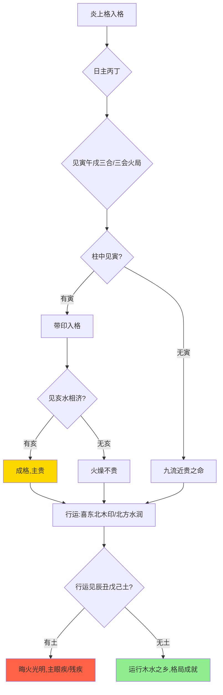

## 格局入式丙丁日主与寅午戌之会

> 【原文】丙丁日遇寅午戌局，柱中须有寅字带印为入格，无寅止是九流近贵之命，若火自旺，无亥水相济，不贵。

此言炎上格之基本入格条件。丙火、丁火日元，生于寅、午、戌三会火局或三合火局（寅午戌合火）之中，柱中气势汇聚于火。原文特别强调"须有寅字带印"——寅中藏甲木、丙火、戊土，其中甲木生丙丁之火，为印绶（生我者）；无寅则木气（印绶）缺失，火炎无源而难以成大格，仅得"九流近贵"（即普通士人、技艺傍身、声誉或近于显贵之小成，非真正显达）之命。又言"火自旺，无亥水相济，不贵"——亥为甲木长生之地，壬水之禄，藏壬水、甲木。若命中火势过旺而不见亥中壬水，既无木以生火、又无水以润济，则燥烈无制，"火炎无制则焚"（五行之中，火过旺而有水制方为中和），纵得三合火局而气势纯粹，亦难入贵格。盖"炎上"一格取清纯粹之气，纯粹的极致是成方成圆的纯粹，并非单调炎热。火势过亢则为自焚之象——有水而调和方能成就"文明之火"。亥水能济之（既济卦之"水火相交"）、寅木能生之，正是"有根有润"方得"火之正德"之体现。

## 行运喜忌木印水润为扶助土晦金削为所忌

> 【原文】喜东北方运，忌见辰丑戊己，晦火光明，多主眼疾，或患风气，柱有木制成贵，忌水金乡，怕冲。

此论行运吉凶之取径。喜东北方运者，寅为东北之木，甲木生火，印绶运正是火炎上格之食粮（"印绶者，日主之所资以生也"），运行东北木地，等于在八字中补足了"无寅"之缺，故为"后天补格"之法。又亥为北方水地，壬水为丙丁之财、官，财官相生，亦是所喜之大运方向。忌辰丑戊己者，辰为水库（湿土晦光）、丑为金库（湿土晦光）、戊己为土，湿土与燥土俱能晦火光明——土晦则光暗，是故命中火旺而有土晦者多主眼疾（火主目，土壅火蔽则目暗）；或患风气（风木之气与湿土之壅交战，故为风疾、湿痹之类），皆因"火不明则病目、火受阻则病窍"之理。"柱有木制成贵"者，木能疏土，制其壅塞，使火重新显明——木在炎上格中既为印源，又为制土之功臣。"忌水金乡"者，此言与前段"无亥水不贵"似相矛盾，实则不然：原命中无亥而运见亥水，是水入火地而调和、是为"相济之水"，能得既济之功；然若命局火势已足而再见大水冲激，是水来克火——金亦同此理，金在炎上格中为财，金太旺则水势涨而火反受克，反为"财多身弱"之患，故忌金水大运并见。末言"怕冲"者，寅午戌三合火局最怕冲散——亥冲寅（水克木破印）、申冲寅（金克木破印）、辰冲戌（湿土破火局）、丑冲未（若三会火局被丑冲则破），冲则合局散而格破。

## 诗诀收束无寅无亥不成名忌逢土晦主残疾

> 【原文】诗曰：丙丁日坐寅午戌，火炎上格从此出，无寅无亥不成名，忌逢土晦主残疾。

此以七言四句之歌诀对全篇作收束重申。"丙丁日坐寅午戌"——点明日主与三合局之基本条件。"火炎上格从此出"——点出格局名。"无寅无亥不成名"——再申入格之两要件：寅为印绶之木、亥为调和之水，缺一则难入贵格（仅得近贵小成）。"忌逢土晦主残疾"——再申大运流年遇辰、丑、戊、己等土神晦火，则火失其明而病于目、阻于窍，主残疾之患。盖"眼疾"与"残疾"皆因"火明"被"土壅"所致：火主目、土主脾，火被土覆则目暗失明；火主筋脉气机、土壅则气滞血瘀而痿痹残疾。此以收束之笔，提醒读此格者——行运不谨则吉变为凶，成格而成败格往往在一字之差。

## 炎上格在五行成格体系中之位置

炎上与曲直、从革、润下、稼穑并列为子平术"五行归局"五大外格。五格之理一贯：皆取日主之气与月令之时、支局之会聚，合成纯粹一行之气，而忌破坏此纯粹之物。"曲直"取木之仁、"炎上"取火之明、"从革"取金之断、"润下"取水之智、"稼穑"取土之信。炎上居五格之一，论"火之正德"——火主文明、光明、礼仪。命理以"取象"论"人事"：曲直仁寿、炎上文明、从革刚断、润下圆通、稼穑笃实。炎上格若成，则主人气质清明、有文章礼仪之才、处世光明磊落。然五格皆"纯粹则贵、混浊则败"——此为格局取用之通则，无一例外。读者研习此格，当由此及彼，悟五行成格之共法：皆重日主与月令之呼应，皆重成局之纯粹与破坏之忌，皆重行运之扶抑与激化之辨。

## 原文

> 丙丁日遇寅午戌局，柱中须有寅字带印为入格，无寅止是九流近贵之命，若火自旺，无亥水相济，不贵。喜东北方运，忌见辰丑戊己，晦火光明，多主眼疾，或患风气，柱有木制成贵，忌水金乡，怕冲。诗曰：丙丁日坐寅午戌，火炎上格从此出，无寅无亥不成名，忌逢土晦主残疾。