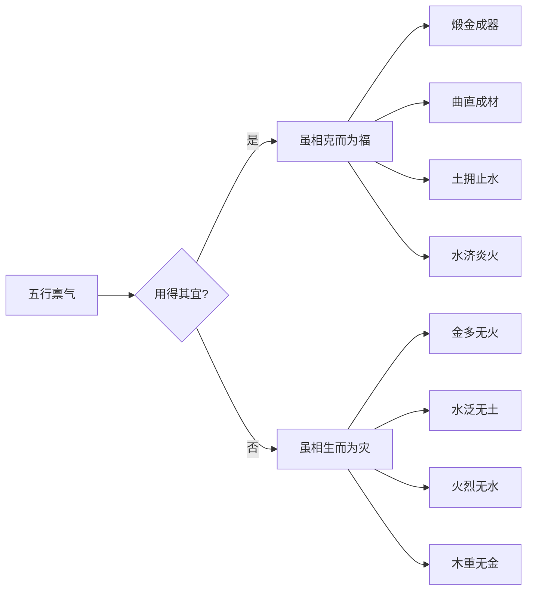

## 总纲先体面次局势终喜忌

> 【原文】凡看命先论五行，体面，局势。然后参以喜忌好恶，旺相休囚。

此段为全篇之总纲，开宗明义立下看命三步次第：先定五行所属，次辨体面与局势之成格与否，终以喜忌好恶参酌旺相休囚而断吉凶。所谓「体面」，即日主所禀之五行本气及其同类比助之物；「局势」者，三合、六合、五行聚成一气之格局结构；「喜忌好恶」则就成格之后所需之扶抑、所需之调候而言。三步层层递进，缺一不可。

## 金人专论体面局势与煅炼之道

> 【原文】如金人得庚辛或申酉为体面，得巳酉丑三合为局势。喜火制土扶，忌金寒水冷。

> 【原文】生三秋四季为旺相，春夏为休囚。余木火水土以例推之。

> 【原文】金人遇庚申辛酉为五离煞，若生秋月逢水则化金之毒，为金白水清。

> 【原文】造化逢火，则制金之钢，为煅成锋利之器。柱无火无水是谓顽金，主早年酒色，瘵痢身死。若得戊寅日时，刚处逢生，主富而寿。

「金人」即日主属金之命。金之体面在天干为庚辛，在地支为申酉；金之局势则取巳酉丑三合金局。喜火者，火能制金之刚烈，使之煅炼成器；喜土者，土能生金，扶助金气。忌金者，金多则顽；忌水水者——此处「水冷」之「水」字，承前文「金寒」而言，实指冬月金寒水冷之时，金得水反增寒肃之气，非泛忌水也（秋月逢水反成「金白水清」之贵格，可见水非全忌）。

金以三秋（申酉戌月）、四季末（辰戌丑未月）为旺相；春夏则金处休囚之地。其余木火水土四行，依此理类推——木旺于春、水旺于冬、火旺于夏、土旺于四季。

「庚申辛酉」为五行离绝之煞，金遇之若再失煅炼则为「五离煞」。然秋月金旺得水泄秀，金气清白，是为「金白水清」之格，秀气发越。逢火则金受煅炼，钢成锋利之器。若柱中既无火煅又无水泄，纯金无制，是为「顽金」，主人沉溺酒色、瘵痢（劳瘵、痢疾等慢性虚损之疾）而早亡。唯得戊寅日时者，戊土为金之母，寅中藏火调候，刚处逢生，主富且寿。

## 木人专论栽培涤畅与刚柔之制

> 【原文】木人得土则根荄藉以栽培，得水则枝叶赖以涤畅。得金斲削便成材也。

> 【原文】木逢寅卯，更在春生最吉，若三合会木局全，不须春生，多主仁寿。

> 【原文】木逢金制，金煅火伏，则刚柔相制。

> 【原文】若火太多则焚，金太多则损。土虚则不能培，水泛则不能润，妙在得其中和。

「荄」者，草根也。木之生长，土为根本之培，水为枝叶之润泽，金为斧斤之斲削——三者俱全方成栋梁之材。木逢寅卯为得禄得旺之地，春生更当令；若亥卯未三合木局成全，则不必拘于春生，局全气足，多主仁慈长寿。

木以金为官杀而成材，但金煅之余须有火伏制——火者伤官也，伤官能制杀，使刚柔相济而不至于克伐太过。若火太多则木被焚，金太多则木被损；土若虚浮则不能培木根，水若泛滥则不能润木叶。关键在于五行得其中和之气——此为全篇反复申说之核心主张。

## 水人专论源流西东与堤防之要

> 【原文】水人以亥子为源，以寅卯辰巳为纳。干源自北万折朝东，故水仁喜逢东方，则浪息波平。

> 【原文】水赖土防，若生亥子，土多则吉。既在东方，逢土亦吉。

> 【原文】不宜土多，更有贵人，财禄则贵。

> 【原文】若日时遇庚申辛酉，水忌西流，恐寿不高。

> 【原文】生于秋冬，生旺清澄，壬癸此时，而逢亥子，主有文学。

> 【原文】纳音更水，则水太过，柱无土提，乃少子之断。

> 【原文】惟艺术，空门则吉，更隔角重逢，定主刑克。

> 【原文】春月干渴而凅，夏月浑浊而泛，柱无水助则不贵。

「纳」者，纳入、归藏之方。水以亥子为源，北方坎位；以寅卯辰巳为纳，东方之位。盖水自北发源，万折而东流归于海，故水命之人喜见东方之木——水生木则水有归宿，浪息波平，反成滋养之功。

水以土为堤防，亥子水旺之时得土堤壅则吉；东方木气当令则泄水之气，亦须土以制之。然土亦不宜过多——土多则水被壅塞不通，反成浊水；须有贵人、财禄之配置方能化浊为清，主贵。

最忌日时逢庚申辛酉，金生水而水势愈旺，加以西方金位引化水势西流，恐寿命不永。秋冬生水，壬癸日干再逢亥子，水清澈澄净，主有文学才华。若纳音五行又复属水，则水势太过，必须柱中有土堤制；若失土堤，乃少子之兆——水泛无制则子息难成。若投身艺术或空门（佛道出家）反吉，因清静之地正合水之本性；若再逢「隔角重逢」（辰戌丑未等墓库之冲）则定主刑克六亲。

春月木旺水泄，木多水缩，是为「干渴而凅」；夏月火旺水被蒸腾，是为「浑浊而泛」——此时水须有金生之方显清贵，若柱中无水助则命格不贵。

## 火人专论藏光内照与潜消霜雪

> 【原文】火居寅卯，生于春月，木秀火明，荣华富贵。

> 【原文】生于夏月则太炎，柱中无水定夭，有水早贵。

> 【原文】生于秋月，火死金成，藏光内照，时日微逢旺气则吉。

> 【原文】盖水火不嫌死绝，只宜恬淡为福。

> 【原文】生于冬月，柱中再得火助，则潜消霜雪，温暖山河。

> 【原文】古人云：冬日可爱，夏日可畏，此之谓也。

火以寅卯为「火之禄地」（寅中藏丙火，卯中藏乙木生火），春月木旺，木秀则火明，主人荣华富贵。夏月火当令，火势太炎——炎者，过热也——若无水调候则火烈伤身，主夭折；有水则水火既济，主早发。

秋月火处死地（秋金克木，木不生火），然火死于秋、金正成器之时，若藏光内照，晦养其明，则火不逞其焰而反成温润之质。「藏光内照」四字最得火秋之妙——火虽死而不灭，光虽藏而内照，此即「水火不嫌死绝」之确解：盖水火二气，旺极则害，衰极反可蓄养其精，故曰「只宜恬淡为福」。

冬月火处绝地（冬至水旺火熄），然柱中若再得火助（寅中丙火、卯中乙木等木火之气），则能潜消霜雪、温暖山河，化寒为温，反成大格。古人「冬日可爱、夏日可畏」之语，正是以人之体感比喻冬火之可亲、夏火之可畏。

## 土人专论厚载资生与艮山之贵

> 【原文】土逢四季全上贵，如纳音全土，柱中更得寅字，为艮山亦贵。

> 【原文】土能厚载，万物资生，金木水火，皆不可缺，故此四行，咸赖之也。

「四季全」者，辰戌丑未四库支皆见也——土得四季库气充盈，厚重无匹，最为上贵。若纳音五行又复属土，柱中更得「寅」字者，寅为艮位（《周易·说卦》：「艮，东北之卦也，万物之所成终而所成始也」），艮止之象，止于厚重之土，故亦主贵。

土居五行之中，厚载万物；金木水火四行皆赖土而立——金葬于土、木植于土、水止于土、火藏于土。故「土」者，五行之母，五行不可缺土。此段以土为枢纽收束前四行之论，揭示土之特殊地位：他行皆有克制，唯土包容滋养一切。

## 抑扬归中五行太过不及之通则

> 【原文】夫论五行之用，多则太过，少则不及，其气其数，有余不足皆能致凶。

> 【原文】抑扬归中，然后为福。功成者宜于退藏，将来者贵于荣振。

> 【原文】五行禀旺谓之成功，旺而能止息是谓退藏。

> 【原文】五行在冠带胎养之地，其气亏而未盈，是谓将来。故欲子母相生，以益其气。

> 【原文】则有荣进振发之道。

五行之用，贵在中和。多则太过，盛极则亢；少则不及，弱极则颓。「抑」者抑其太过，「扬」者扬其不及，二者皆归于中道方为福。

「功成者宜于退藏」——五行禀旺谓之成功（成事），然成功之后须知退藏，盈满则亏、亢龙有悔。「将来者贵于荣振」——五行处冠带（第三运）、胎养（第十一、第十二运）之地，气尚亏而未盈，此为「将来」之势，须以母子相生之法增益其气（如木气弱则以水生木、水气弱则以金生水），此则荣进振发之道。

## 生死之辨凶中藏吉与吉中藏凶

> 【原文】如木非其时，衰则梗介，死则枯槁。

> 【原文】金旺太过，则动作多凶。

> 【原文】炎炎者贵乎熄，不熄则有自焚之灾。

> 【原文】滔滔者贵乎止，不止则有自溺之患。

> 【原文】火行南陆而化热，盛则焚烈而害物，至酉亥则阴能翕之，然后能温暖万物。

> 【原文】水行北陆而化寒，盛则严冷而杀物，至卯巳则阳能辟之，然后能滋生万物。

木非其时而衰（如木衰于秋），则为「梗介」之木——枯枝僵木，无所用之；木死于秋，则彻底枯槁。金旺太过则刚锐过甚，主人动辄招凶。火炎上而贵乎熄，熄则温煦，不熄则自焚；水滔滔而贵乎止，止则润泽，不止则自溺——此皆「抑」之义也。

火行南陆（南方夏月）化热，盛则焚烈害物；然行至酉、亥时（西方、北方），阴气收敛翕聚，火得阴翕反能温暖万物。水行北陆（北方冬月）化寒，盛则严冷杀物；然行至卯、巳时（东方、南方），阳气宣发辟散，水得阳辟反能滋生万物——此即「过亢者必有所制」之理，亦即前文「成功者宜于退藏」之具体发挥。

## 反生反旺与死不绝之理

> 【原文】又有生而不生，旺而不旺，此为凶乃先吉也。

> 【原文】有死而不死，绝而不绝，此为吉乃先凶也。

> 【原文】如水见戊申土，此生而不生。见庚子土，此旺而不旺。遇此多成而反败，因喜而反忧。

> 【原文】如水见癸卯金，此死而不死。见辛巳金，此绝而不绝。

> 【原文】五行气尽而得父母之德，以生益之则其气复生。遇之者危中有福，穷而通屈而伸也。

此段论五行「反生反旺、死而不死」之变理，甚为精微。「生而不生」者，譬如水见戊申土——水生于申（申为水之长生），然戊土克水，虽遇长生之位反被土克，是名「生而不生」。「旺而不旺」者，譬如水见庚子土——水旺于子，然庚金生水本为助力，但庚子土（纳音）其性浊重，反而牵累水之清势，是名「旺而不旺」。遇此者先吉后凶，因喜成忧。

「死而不死」者，譬如水见癸卯金——水死于卯（《五行发微》论十二长生水死于卯），然癸卯金（纳音）反能资助水之精气，是名「死而不死」。「绝而不绝」者，譬如水见辛巳金——水绝于巳，然辛巳金（纳音）其气清轻，能使水不绝。

此皆「五行气尽而得父母之德」之理——五行之气已尽（如水之死、绝），若得生我者（即父母，如水之父母为金）以德滋养，则气复生回转，遇之者「危中有福、穷而通、屈而伸」，逆境反得转圜。

## 死绝逢生五行回生之先后

> 【原文】生旺太过则福中藏祸，死绝太过则福无可托。

> 【原文】若夫死绝逢生，殃变能逃，火土最先，金水犹后。

> 【原文】火绝得土曰睿「火以土为干，火绝于亥，而兑丁亥是也」

> 【原文】土绝得金死而不亡曰寿「土绝在巳，得辛巳金是也」

> 【原文】金绝得水精复继体「金绝于寅，得甲寅水是也」

> 【原文】水绝得木魂复天游「水绝于巳得己巳木是也」

> 【原文】木绝得火火出木烬，灰飞湮灭故独为凶。「木绝于申，得丙申火是也」蛇马无胆于焉足证：

> 【原文】蛇马在位巳午，木历巳午而死。木于脏属肝，于腑属胆，证木死为凶也。

「生旺太过则福中藏祸」——前文「金旺太过则动作多凶」之总括也；「死绝太过则福无可托」——气已尽而又无回生之机，则真为凶咎。

「死绝逢生」者，五行处死绝之地而得母德回生，则可逃灾殃之变。火、土二行回生之效最速（「火土最先」），金、水二行稍次（「金水犹后」）——盖火以土为干（根基），土绝于巳得辛巳金回生；金以水为精，水绝于巳得己巳木回生。此皆「死而不死、绝而不绝」之实例。

唯木绝于申得丙申火——按理木生火、木得火似为回生，然原文独以「灰飞湮灭」论之，谓木绝之时遇火，火虽为木之母（母为养者），然木既已绝则无受生之质，灰飞而湮灭，「故独为凶」。以「蛇马无胆」为证——巳午属蛇马，蛇（巳）马（午）皆无胆者（古有「蛇无胆、马无胆」之说），因巳午于五行属火（亦有说属木之死地），木历巳午而死，木于脏腑属肝胆，肝胆为木之象，木死则胆失其用，故云「蛇马无胆」。

此段以木绝遇火为反例，正前文「死绝逢生」之例外，可见五行回生虽有定理，仍须分辨所逢之「生」者于本行是否真有滋养之实。

## 经云克用得宜则福生用失宜则灾

> 【原文】经云：

> 【原文】身土遇火生而渐利，命水得金年乃优长。金多须火或从革以成名，木重得金揉曲直而任使，水流不止须土以拥之，火盛无依惟水以济之。

> 【原文】五行用得其宜，虽相克而为福。若用失其宜，虽相生而为灾。

「经云」之语，盖引前贤之成论以殿全篇。身（土命）遇火（火生土）则渐利；命（水命）得金（金生水）则年寿优长——此言相生之福，须在命主需要时方得其利。

金多者须火煅炼方成名器（「从革」为金之别名），或以火局成器；木重者须金斲削方成材（「曲直」为木之别名）；水流不止者须土堤壅防；火盛无依者惟水能济——此皆「相克而成用」之明证。

末句总结全篇之旨：「五行用得其宜，虽相克而为福；若用失其宜，虽相生而为灾。」——五行之间本有生克之定数，相生者本为美事，相克者本为恶事，然其用于命局中是否得宜，须以日主之强弱、五行之旺衰、所求之调候为断。得宜则金克木而成材、火爆烈而得水济；失宜则水生木而木泛、火生土而土焦。

## 附·原文图解（生克成用之机）

此图示全篇核心主张之逻辑结构：五行之用，无定格、无常善——生克之定数须落实于「用之宜否」方见吉凶。

## 此篇在全书之位置

此篇为《看命口诀》系列（卷十）之一，位居格局诸篇之后、赋文诸篇之前，属由「格局定法」过渡至「通论口诀」之枢纽段落。通篇以五行为经纬，以「体面—局势—喜忌」为次第，以「太过不及—抑扬归中—生克成用」为推演逻辑，实为子平命理之通论大纲。其论法不拘一格之格局判定，而从五行本体之气数、喜忌、煅炼、堤防入手，故读之可与卷五、卷六之格局专论互为经纬，亦可为卷十一、卷十二之赋文提供义理根基。