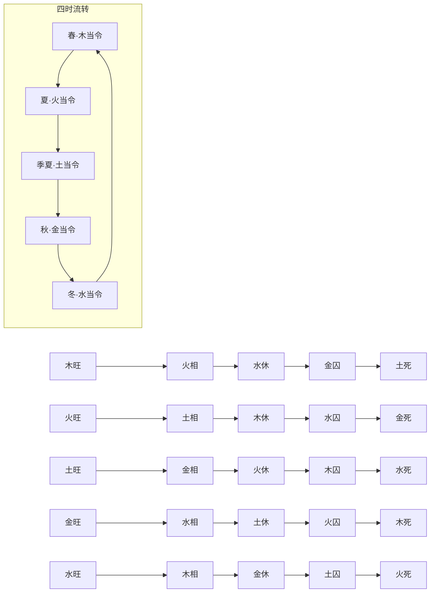

## 旺相休囚与十二宫循环

> 盛德乘时曰旺。如春木旺，旺则生火，火乃木之子，子乘父业，故火相；木用水生，生我者父母，今子嗣得时，登高明显赫之地，而生我者当知退矣，故水休。休者，美之无极，休然无事之义。火能克金，金乃木之鬼，被火克制，不能施设，故金囚；火能生土，土为木之财，财为隐藏之物，草木发生，土散气尘，所以春木克土则死。

此段立四时五行流转之总则。"盛德乘时"四字为眼目，谓五行当令得气即为旺，如春木之得寅卯之令。所谓"旺、相、休、囚、死"五态，并非仅言一气之强弱，而是以当令之我为坐标，向外推演亲缘、敌对诸关系之状态：生我者（父母）退避而休——"子嗣得时，生我者当知退"；我所克者（官鬼）受制而囚；我克者（妻财）因时令散气而死。五行之"死"非真亡，乃当令所克者散气之义，须识此语意。

> 夏火旺火，生土则土相，木生火则木休，水克火则水囚，火克金则金死。六月土旺，土生金则金相，火生土则火休，木克土则木囚，土克水则水死。秋金旺，金生水则水相，土生金则土休，火克金则火囚，金克木则木死。冬水旺，水生木则木相，金生水则金休，土克水则土囚，水克火则火死。

此承前段之理，依次推演夏火、季夏土、秋金、冬水四季之"旺—相—休—囚—死"分布，呈现五行在四时轮转中的完整关系图谱。所列"生某则某相、某生我则我休、某克我则某囚、我克某则某死"之公式，适用于任何五行当令之时。此非孤立之理，而是将五行生克纳入时间维度——同一五行在四时不同位置，旺衰即异，所触发之连锁关系亦随之流转。

## 观天验理

> 观夏月大旱，金石流，水土焦。六月暑气增，寒气灭；秋月金胜，草木黄落；冬月大寒太冷，水结冰，火气顿减，其旺其死，概可见矣。

此段以天时物候验前文之理。夏月大旱则金石流、水土焦，正是火旺而金囚、水死之实证；六月暑极则寒气灭，是火旺极而水休囚之征；秋月金胜而草木黄落，是金旺木死之验；冬月大寒、水结冰而火气顿减，是水旺火死之验。借天象以证五行流转之必然，所谓"观天之道，执天之行"者。

## 盈虚消息之通则

> 盖四时之序，节满即谢，五行之性，功成必复，故阳极而降，阴极而升，日中则昃，月盈则亏。此天之常道也。人生天地，势积必损，财聚必散，年少反衰，乐极反悲。此人之常情也。故一盛一衰，或得或失，荣枯进退，难逃此理，经云：人虽灵于万物，命莫逃乎五行。斯言尽矣。

此段由五行流转之理抽绎出天地人共通之通则——"消息盈虚"之理。四时节满即谢、五行功成必复，物理本然；人事势积必损、财聚必散、年少反衰、乐极反悲，人情亦然。所谓"日中则昃，月盈则亏"，是天地自然之规律；引《易》"人虽灵于万物，命莫逃乎五行"，正与篇首"盛德乘时"之论相呼应。盛衰之理贯通天人，命理之学即基于此"天理"而立。

## 十二宫循环之譬喻

> 五行寄生十二宫：长生、沐浴、冠带、临官、帝旺、衰、病、死、墓、绝、胎、养，循环无端，周而复始，造物大体与人相似，循环十二宫亦若人世轮回也。

此引入"十二宫"之说，列其名目：长生、沐浴、冠带、临官、帝旺、衰、病、死、墓、绝、胎、养。须明者，此十二宫非孤立之吉凶符号，而是模拟万物从发生到消亡、再受气而复生之完整周期。其义理根基于"盈虚消息"——前文所论"节满即谢、功成必复"之理，于此具体化为十二阶段之流转变迁。

> 《三命提要》云："五行寄生十二宫，一曰受气，又曰绝，曰脆，以万物在地中未有其象，如母腹空，未有物也；二曰受胎，天地气交，氤氲造物，其物在地中萌芽，始有其气，如人受父母之气也；三曰成形，万物在地中成形，如人在母腹成形也；四曰长生，万物发生向荣，如人始生而向长也；五曰沐浴，又曰败，以万物始生，形体柔脆，易为所损，如人生后三日以沐浴之，几至困绝也；六曰冠带，万物渐荣秀，如人具衣冠也；七曰临官，万物既秀实，如人之临官也；八曰帝旺，万物成熟，如人之兴旺也；九曰衰，万物形衰，如人之气衰也；十曰病，万物病，如人之病也；十一曰死，万物死，如人之死也；十二曰墓，又曰库，以万物成功而藏之库，如人之终而归墓也。归墓则又受气，胞胎而生。"

此引《三命提要》详释十二宫之命名取义。须辨者，《三命提要》以"受气、受胎、成形、长生、沐浴、冠带、临官、帝旺、衰、病、死、墓"十二阶段为序，与上文"长生、沐浴……胎、养"之序略有出入——前者多出"受气、受胎、成形"三阶段以对应"绝、胎、养"之位次，然实质皆言五行从萌芽到归藏再受气复生之循环。"归墓则又受气，胞胎而生"一句点明循环无端之旨，与前文"周而复始"相表里。

## 通变之妙

> 凡推造化，见生旺者未必便作吉论，见休囚死绝未必便作凶言。如生旺太过，宜乎制伏，死绝不及，宜乎生扶，妙在识其通变。古以胎生旺库为四贵，死绝病败为四忌，余为四平，亦大概言之。

此段为全篇归结之论，最为吃紧。生旺未必吉——若旺极无制则亢龙有悔；死绝未必凶——若绝处逢生则否极泰来。关键在于"通变"二字：太过者制之、不及者扶之，识其偏颇而调之，此即命理取用神之根本原则。"古以胎生旺库为四贵，死绝病败为四忌，余为四平"乃古法之大概论，非定则。须识"大概言之"四字之分量——此非武断之定规，而是示人以权衡之机。

## 旺相休囚流转图

## 此篇在命学体系之位置

此篇总论五行四时旺相休囚死之理，并及十二宫循环、取用通变之要旨，属子平之通论、大纲范畴。篇中所立"盛德乘时"之则、"消息盈虚"之通、"太过不及、贵乎制扶"之妙，乃命理取用之大法，贯穿全书格局篇、日时断篇之始终。后世论命者谈五行强弱、论用神扶抑，皆当以此篇为根基而求通变。

## 术语别名

> 【异文标注】源文本一曰受气，又曰绝，曰脆，以万物在地中未有其象，如母腹空，未有物也；二曰受胎，天地气交，乃作者用字变体或同义术语别名，非版本异文。

> 【异文标注】源文本一曰死，万物死，如人之死也；十二曰墓，又曰库，以万物成功而藏之库，如人之终而归墓也，乃作者用字变体或同义术语别名，非版本异文。
