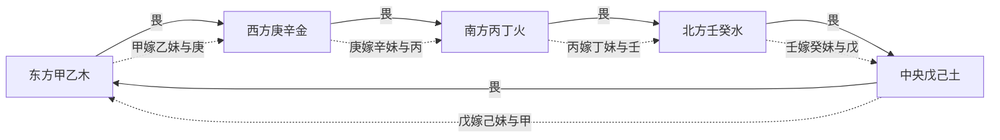

## 合之名义与五行婚配之喻

> 【原文】夫合者，乃和谐之义，如阳见阳，二阳相竞则为克，阴见阴，二阴不足则为克，唯阴见阳，阳见阴为合，亦如男女相合而成夫妇之道。

此段开宗明义，揭「合」之名义。所谓「合」者，和谐之义——阳见阳则两刚相竞而成克，阴见阴则两柔不足亦成克，唯有阴与阳相配方为「合」。此以夫妇喻五行：刚柔相济、阴阳交感方能成配，正如男女合而成夫妇之道。此一喻象贯穿全篇，五合之理即以「嫁娶」之象贯穿始终。

## 五合之嫁娶图方位与五行婚配

> 【原文】东方甲乙木畏西方庚辛金克。甲属阳为兄，乙属阴为妹，甲兄遂将乙妹嫁金家，与庚为妻，所以乙与庚合。南方丙丁火畏北方壬癸水克。丙属阳为兄，丁属阴为妹，丙兄遂将丁妹嫁水家，与壬为妻，所以丁与壬合。中央戊己土畏东方甲乙木克。戊属阳为兄，己属阴为妹，戊兄遂将己妹嫁木家，与甲为妻，所以甲与己合。西方庚辛金畏南方丙丁火克。庚属阳为兄，辛属阴为妹，庚兄乃将辛妹嫁火家，与丙为妻，所以丙与辛合。北方壬癸水畏中央戊己土克。壬阳为兄，癸属阴为妹，壬兄乃将癸妹嫁土家，与戊为妻，所以戊与癸合。

五合之配，实基于五行相畏之理。所谓「畏」者，五行相克而力有未敌，弱势之一方须以和亲为自保之策——正所谓「畏则合亲」。试逐一析之：

- **甲己合**：木畏金克，乙为甲之妹，甲将乙妹嫁与庚；己为戊之妹，戊将己妹嫁与甲。甲己相合，是木土之配。
- **乙庚合**：金畏火克，辛为庚之妹，庚将辛妹嫁与丙。乙庚相合，是木金之配——即甲兄所嫁之乙妹与庚为妻。
- **丙辛合**：火畏水克，丁为丙之妹，丙将丁妹嫁与壬。丙辛相合，是火金之配。
- **丁壬合**：水畏土克，癸为壬之妹，壬将癸妹嫁与戊。丁壬相合，是水火之配。
- **戊癸合**：土畏木克，己为戊之妹，戊将己妹嫁与甲。戊癸相合，是水土之配。

> 旁及「甲己、乙庚之合，妇人不忌」一语，提示此二合于女命最吉，盖因甲己为中正、乙庚为仁义，皆含厚生之德。

此处所蕴含之理颇为微妙：所合者皆为克我之五行所畏之物的同类（如木畏金，则木嫁妹于金以化解；金畏火，则金嫁妹于火以自保）。这与后世所传「合杀」「合官」之理同条共贯——弱势者以合亲代对抗，是五行流通之正道。

## 中正之合甲己

> 【原文】甲与己何名为中正之合？甲，阳木也，其性仁，位处十干之首，己，阴土也，镇静淳笃，有生物之德，故甲己为中正之合。带此合主人尊崇重大，宽厚平直。如带煞而五行无气则多嗔好怒，性梗不可屈。

甲为阳木，性仁而处十干之首；己为阴土，镇静淳笃而具生物之德。仁者木之德，厚者土之德，仁厚相合是为「中正」。中者不偏不倚，正者端方不阿，此正天地生物之心。

带此合者，性格多尊崇重大、宽厚平直。若命局中甲己合而带煞（即合中逢克，如甲己合而甲被庚克、己被乙克）、五行无气（休囚死绝之地），则其人多嗔好怒、性梗不可屈——盖仁厚之性受制，则变为刚愎之偏。

## 仁义之合乙庚

> 【原文】乙与庚何名为仁义之合？乙，阴木也，其性仁而太柔，庚，阳金也，坚强不屈则刚柔相济，仁义兼资。故主人果敢有守，不惑柔佞，周旋唯仁，进退唯义。五行生旺则骨秀形清，若死绝带煞则使气好勇，体貌不扬，自是非人。

乙为阴木，仁而太柔则近于懦；庚为阳金，坚强不屈则近乎刚。乙庚相合，刚柔相济，是为「仁义」。仁者柔而不失其善，义者刚而不伤于物。带此合者，果敢有守，不为柔佞所惑，周旋以仁、进退以义。

五行生旺则骨秀形清，气质清朗；死绝带煞则使气好勇、体貌不扬、自是非人——仁义之性失衡，则刚柔俱失其正。

## 威制之合丙辛

> 【原文】丙与辛何名为威制之合？丙，阳火也，辉赫自盛，辛，阴金也，克刃喜煞。故丙辛为威制之合。主人仪表威肃，人多畏惧，酷毒，好贿喜淫，若带煞或五行死绝则寡恩少义，无情之人。妇人得之，与天中、大耗、咸池相并者，貌美声卑，夭冶而淫。

丙为阳火，辉赫自盛而有威；辛为阴金，克刃喜煞（辛金本为珠玉之金，喜火锻炼而成器）而成制。火克金而金从火，是威制之象。带此合者，仪表威肃、人多畏惧。

值得注意的是，此合主人性有「酷毒、好贿喜淫」之偏——火之辉赫若失其正则为酷，金之锋锐若失其正则为毒。若带煞或死绝则寡恩少义。妇人得此合而与天中、大耗、咸池（皆桃花、耗泄之星）并见，貌美而声卑、妖冶而淫——此处「氵？」字依文意当为「淫」。

## 淫慝之合丁壬

> 【原文】丁与壬何名为淫慝之合？壬者，纯阴之水，三光不照，丁者，藏阴之火，自昧不明。故丁壬为淫慝之合。主人眼明神娇，多情易动，不事高洁，习下无去，枕欢溺色，于我则吝，于彼则贪，若五行死绝或带煞，见咸池、大耗、天中自败，有淫污家风之丑；亲厚小人，侮慢君子，贪婪妄作，必胜而后已。妇人淫邪奸慝，易挑易诱，多招玷辱，或年高而嫁少夫，或年幼而配老夫，或先贱而后良，或先良而后贱。

壬为纯阴之水，三光（日月星）不照则幽暗不明；丁为藏阴之火（丁火本为灯烛之光），自昧不明则暧昧不清。阴水阴火相合，是为「淫慝」。慝者，奸邪之谓。

带此合者，眼明神娇、多情易动——「习下无去」当为古文之讹，依"亲厚小人、侮慢君子"之语境参之，疑本作「习下无耻」或「习下无节」（"无去"与"无耻/无节"形近而讹，"去"古通"祛"，亦可解为不自尊之意），谓习染之下不知耻节。不事高洁，亲厚小人、侮慢君子，贪婪妄作、必胜而后已。

妇人得之，淫邪奸慝、易挑易诱；年高嫁少夫、年幼配老夫、先贱后良或先良后贱——皆阴火阴水暧昧不明之象的推演。

## 无情之合戊癸

> 【原文】戊与癸何名为无情之合？戊，阳土也，是老丑之夫，癸，阴水也，是婆娑之妇，老阳而少阴，虽合而无情，主人或好或丑，如戊得癸则娇媚，姿美得所，男子娶少妇，妇人嫁美夫；若癸得戊则形容古朴，老相俗尘，男子娶老妻，妇人嫁老夫。

戊为阳土，是「老丑之夫」；癸为阴水，是「婆娑之妇」。「老阳少阴」——阳为老、阴为少，年貌悬隔，虽合而无情。

无情之合之妙处在于「合」之双方年龄与容貌的悬殊：

- **戊得癸**：戊为阳土老丑，癸为阴水婆娑美艳。土得水润则姿美得所——男子娶少妇，妇人嫁美夫。
- **癸得戊**：癸本阴水美艳，戊本阳土老丑。水被土克则形容古朴、老相俗尘——男子娶老妻，妇人嫁老夫。

此以「老丑」与「婆娑」之反差，见「无情」之实——盖合虽成而年貌不相当，情不能洽也。

## 五合性情之辨与全书之位

五合之名义可归纳为：甲己中正取仁厚之德，乙庚仁义取刚柔之济，丙辛威制取火克金之象，丁壬淫慝取阴火阴水之暗，戊癸无情取老阳少阴之不伦。五合命名之理，皆从阴阳、五行、方位三端综合而立。

此篇所论之五合，是子平命理「天干合」一系之核心条文。书中论五行流通、论格局变化、论夫妻宫取用，皆以天干五合为重要枢纽。原文以「嫁娶」之喻贯穿始终，将抽象之五行相克转化为具象之婚配关系，使「畏则合亲」之理通俗可感——畏克而求合，正是弱势五行自保之正道，也是命局中「通关」「和解」之法所本。

全书论干支、论五行、论格局、论赋文歌诀，皆以此五合为基本构件之一。篇中所论性情之偏（「好勇」「好淫」「无情」等），实开后世论「合之吉凶」先声——合有真合、假合之辨，有合化、合留之别，本篇所揭之「带煞」「死绝」条件，已暗含合之成败的判据。