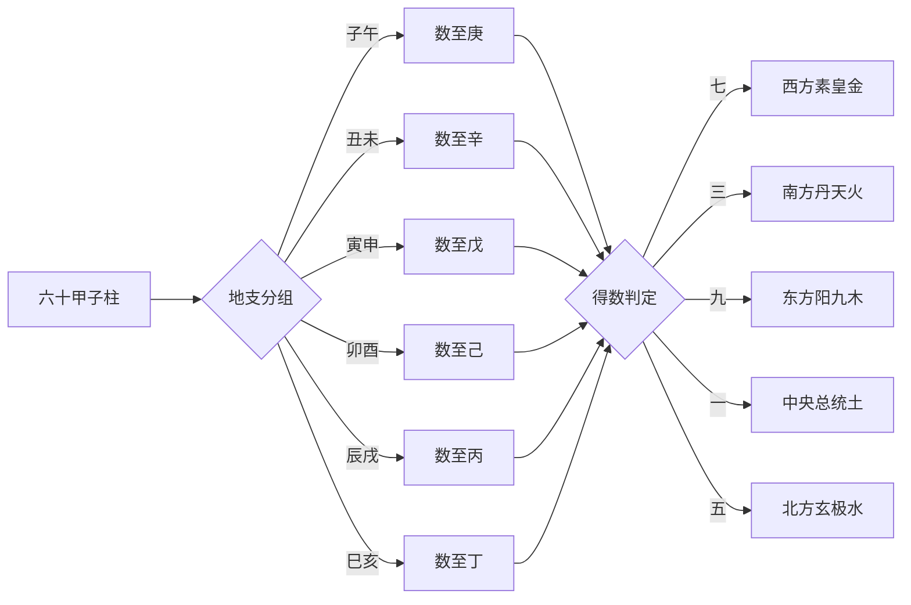

## 数干得气：纳音推算的算法总纲

> 【《六微指论》】天气始于甲，地气始于子，子甲相合，命曰岁，以十干配十二支，周而复始，则六甲成矣。

此段开宗明义交代纳音立法的宇宙图式：天干以甲为始，地支以子为始，子与甲相合而定岁，干支循环一周而六甲（甲子、甲午、甲辰、甲寅、甲申、甲戌六组重支干）遂成。这是纳音得以成立的数序前提——六十甲子之中先抽出六甲作为节律骨干，再据干支阴阳交错之数推算五行归属。

> 【《六微指论》】凡欲知纳音者，谓子午数至庚，丑未数至辛，寅申数至戊，卯酉数至己，辰戌数至丙，巳亥数至丁，得七者，西方素皇之气，纳音属金也；得三者，南方丹天之气，纳音属火也；得九者，东方阳九之气，纳音属木也；得一者，中央总统之气，纳音属土也；得五者，北方玄极之气，纳音属水也。

此为纳音推算的算法口诀。诀义有四：其一，**只数天干不数地支**（下文「以上只数其干，不数其支」重述此规），即以干序顺数至某位干为止；其二，依**地支同位**分组——子午同位、丑未同位、寅申同位、卯酉同位、辰戌同位、巳亥同位，每组对应一个终止之干（庚、辛、戊、己、丙、丁）；其三，得数（自起始干数至终止干的位数）有七、三、九、一、五五种，分别配五方五气——西方素皇金、南方丹天火、东方阳九木、中央总统土、北方玄极水；其四，所谓「西方」「南方」并非地理方位，而是五行各禀一方的**气化方位**——素皇金禀秋之肃杀，丹天火禀夏之炎上，阳九木禀春之生发，总统土居中调和，玄极水禀冬之润下。这一框架把六十甲子纳入五气循环的数序系统。

> 【故颂】“七金三是火，九木一中央，得五皆为水，纳音宜审详。”

此颂以五言韵句复述前条口诀，便于记诵。「中央」即总统之气属土，「审详」二字告诫学者纳音推算看似简易（仅依数取象），实则关乎五行格局根基，不可草草。

> 【《六微指论》】假如甲子甲午，从甲至庚，乙丑乙未，从乙至辛，其数皆七，所以纳音俱属金也。

此为口诀的实例演示：甲数至庚得七（甲乙丙丁戊己庚），乙数至辛亦得七（乙丙丁戊己庚辛），皆配西方素皇金气。此处须留意——口诀之所以「子午数至庚、丑未数至辛」而非「甲数至庚、乙数至辛」，是因为地支同位的两组干支（甲子甲午、乙丑乙未）共用同一终止之干与得数；换言之，纳音的推算单元是**同位干支组**，而非单一柱。

> 【《六微指论》】丙寅丙申，从丙至戊，丁卯丁酉，从丁至己，其数皆三，所以纳音属火也。
>
> 戊辰戊戌，从戊至丙，己巳己亥，从己至丁，其数皆九，所以纳音属木也。
>
> 庚子庚午辛未辛丑，其数皆一，所以纳音属土也。
>
> 丙子丙午，从丙至庚，丁未丁丑，从丁至辛，其数皆五，所以纳音属水也。
>
> 余皆彷此。
>
> 以上只数其干，不数其支，假令从丙至庚，即丙丁戊己庚，是其数五也。
>
> 又如从甲至庚，即甲乙丙丁戊己庚，是其数七也。

此段为推算规则的逐一演示。值得注意的两点：其一，**「从丙至庚」径数丙丁戊己庚得五，与「丙子丙午」的「子午数至庚」属同一运算**——因为子午位的终止干即是庚，故「数至庚」与「数至庚位所对应的干」口径一致。其二，「彷此」二字示意剩余四十八柱（除前述十二例外）皆依此法类推，无需逐一刻举。整段口诀的逻辑主干就此确立——**数序得气，气化五行**。

#### 算法流程示意

此图所展示的，是从六十甲子柱到五行纳音归属的两层判断：第一层按地支同位确定终止之干，第二层按得数（七、三、九、一、五）映射五方五气。理解这两层结构，是把握后世纳音五行格局判读（如「甲子从革之金」「丙寅赫牺之火」）的前提。

---

## 从革之金与赫牺之火：纳音取象的义理根基

> 【三历会同】甲子从革之金，其气散，得戊申土，癸巳水相之，则吉。
>
> 戊申乃金临官之地，土者更旺于子，必能生成，癸巳系金，生于巳，水旺于子，纳音各有所归，又为朝元禄，忌丁卯丁酉戊午之火。

「从革」二字出自《尚书·洪范》「金曰从革」，意指金之性顺从而可变革，故甲子纳音取此象——金之气已散，必得戊申土、癸巳水相济方吉。所谓「相之」即五行相生相济：戊申为土，土生金；癸巳之纳音虽亦为金，但其干支癸巳本身水火交融（癸阴水、巳中藏丙火），可润泽甲子从革之燥散之性。**朝元禄**指纳音遇本气临官之位（戊申为土之临官，土生金，故为甲子金之朝元禄）。所忌丁卯丁酉戊午之火，皆因火克金故。

> 【阎东叟】甲子金为进神，禀沉潜灵中之德，四时皆吉，入贵格，承旺气，则术业精微，主魁夺之荣。

阎东叟以「进神」释甲子金——进神为六十甲子中特定四柱（甲子、甲午、己卯、己酉）之一，其性刚健上进，可夺魁甲。所谓「沉潜灵中之德」，谓此金虽为从革之金，气散而不聚，然若入贵格、得旺气相承，则反能潜沉入静、精微入艺，主科举夺魁之荣。

> 乙丑自库之金，火不能克，盖退藏之金，苟无刑害冲破，未有不显荣者，独忌己丑戊午己未之火。

「自库」指乙丑纳音金处墓库之位。丑为金库，乙阴干配丑，纳音金入库则气敛不散，故火不能克。所谓「退藏之金」即退而归藏于库，苟无刑冲破害，未有不显荣者。所忌己丑、戊午、己未之火皆因火克金——己丑纳音为天上火（天上火乃纳音六十甲子之火名），与乙丑纳音同柱地支，构成纳音火克纳音金；戊午、己未纳音皆天上火，道理相同。

> 【阎东叟】乙丑金为正印，具大福德，秋冬富贵寿考，春夏吉中有凶，入格则建功享福，带煞类为凶会，玉霄宝鉴云：甲子乙丑未成器金，见火则成，多见则吉。

阎东叟以「正印」释乙丑金。正印乃五行生我之正位（如土生金），具大福德之象。四时分论：秋冬金当令，得时则富贵寿考；春夏金处休囚，吉中藏凶。「入格」「带煞」之分——入格者吉，带煞者凶。末引《玉霄宝鉴》云甲子乙丑为「未成器金」，须见火锻炼方成器，故「多见则吉」。

> 丙寅赫牺之火，无水制之，则为燔灼炎烈之患，水不可遇，独爱甲寅之水，就位济之，又名朝元禄。

「赫牺」即赫胥氏，传说中的火德之帝（与伏羲氏同源异流），故丙寅纳音取此象——火性炎烈，无水制则成燔灼之患。值得注意的是此处之「水不可遇，独爱甲寅之水」与下句「水不可遇」看似矛盾，实则指**壬癸之水克丙火太过**，而甲寅之水（纳音为大溪水，与丙寅纳音同位相济）为朝元禄，可济而不克，故「就位济之」。

> 【五行要论】丙寅火食灵明冲粹之气，四时生生之德，入贵格，则文彩发应，主科甲之贵。

《五行要论》以「灵明冲粹之气」释丙寅火——火之精华凝为纯粹冲和之气，四时皆具生生之德。入贵格则主科甲文彩之贵，与阎东叟论甲子金「术业精微」异曲同工，皆指纳音入格主文教功名。

> 丁卯伏明之火，气弱宜木生之，遇水则凶，乙卯乙酉水最毒。

「伏明」二字点出丁卯纳音火之特质——火处伏藏不显之地，气弱而须木生。所忌之水并非泛指，而特指乙卯、乙酉纳音大溪水——其「毒」字点明水火相克之烈，遇之则灾祸立至。

> 【五行要论】丁卯沐浴之火，含雷动风作之气，水济之则达，土载之则基厚，以木资之为文彩，以金橐之，更逢夏令则凶暴。

「沐浴」乃十二长生之一，指丁卯火处沐浴位（与上「伏明」并不矛盾——「伏明」取其性之伏藏，「沐浴」取其位之初萌）。火含雷动风作之气，故遇水则济达、遇土则基厚、遇木则资文彩、遇金则助光焰——唯更逢夏令火旺之地则凶暴，谓火旺太过而无制。

> 【珞琭子】丙寅丁卯秋天宜以保持。

> 【莹和尚注】丙寅丁卯举火之类，秋天保持者，言水生于秋也。

> 【鬼谷遗文】丙寅丁卯秋冬宜以保持。

> 【注】木不南奔，火无西旺，火至秋冬，势恐不久。

此处呈现同一论题的两派说法：《珞琭子》与《鬼谷遗文》小有差异——前者言「秋天宜以保持」，后者言「秋冬宜以保持」，即火于秋令独宜保持（秋金可制火，火不至于太过），而冬令水旺则火势已衰，故《鬼谷遗文》扩为秋冬两季皆宜保持。莹和尚以「水生于秋」释「保持」二字——秋金生水，水可制火，火得制则能保持而不至于焚毁。末附【注】解释「木不南奔，火无西旺」二句：木之本性向阳（南），火之本性炎上（西），二者在秋冬已失势，故「势恐不久」。两派的分歧焦点在「秋冬皆宜」与「独秋宜」之差，原文未作裁断，依原文客观陈列即可。

> 戊辰两土下木，众金不能克，盖生金，有母子之道，得土生之为佳。

戊辰纳音为大林木，辰中有乙木余气，故「两土下木」——表面戊土、辰土，其下藏乙木。所谓「众金不能克」指纳音之木有土护，且木本克土（此处「生金」指木可转生火再生土），有母子相生之妙。

> 【五行要论】戊辰庚寅癸丑三辰，挺木德清健之数，生于春夏，能转立独奋，随变成功，更成旺气，则有凌霄耸壑之志，惟忌秋生，虽怀志节，屈而不伸。

《五行要论》将戊辰、庚寅（大溪水？实为纳音木——「庚寅」按本篇纳音表为松柏木）、癸丑（纳音桑柘木）三柱并论为「挺木德清健之数」，皆取木之清健挺拔之象。生于春夏木旺之时，可独立奋起成就功业；秋金克木，则虽有节操而屈不伸。

> 己巳为近火之木，金自此生，于我无伤，忌见生旺之火。

己巳纳音为大林木，巳中藏丙火、戊土、庚金，故为「近火之木」。金自此生者，巳中藏庚金，金气初萌，尚未成形，故不克木——此为纳音木与地支藏干的微妙关系：木虽畏金，然金处生发之初而不能伤木。所忌见生旺之火，因木生火、火泄木气，逢旺火则木气耗散。

> 【阎东叟】己巳在巽为风动之木，根危易拔，和之以金土，运归东南方成材用。

阎东叟以八卦方位释己巳——巽为东南风木之象，故己巳为「风动之木」。风动则根危易拔，须金土培固，运至东南方（木火之地）方能成材。

> 虽外阳内阴，别无辅助，则其气灵散，更为生鬼所克，乃不材之本也。

此承前论反例——若己巳木外阳内阴（上干己阴、地支巳阳为外阳内阴？实则「外阳内阴」或指巳中藏干丙戊庚阴阳交错），无所辅助则气灵散，所谓「生鬼所克」指木生火、火反泄木，乃成「不材之本」。

> 【珞琭子】己巳戊辰度乾宫而脱厄。

> 【莹和尚注】己巳戊辰举木之数，西方金鬼旺乡，纳音之木，至此绝矣，斯谓厄会。
>
> 若度乾亥之宫，木得水以生长，故脱厄。

《珞琭子》提出「度乾宫脱厄」之说。莹和尚释之：西方金乡为纳音木之绝地（「金鬼旺乡」即西方金旺克木之方），木至此则厄。然若运行至乾亥之宫（西北水位），木得水生，则可脱厄。此说与上文阎东叟「运归东南方成材」之论形成方向性差异：阎氏主东南方（木火之地），珞琭子主乾亥方（水生木之地）——两说皆有所本，原文未判高下。

---

## 厚德之土与银汉之水：纳音格局的多源汇通

> 庚午辛未始生之土，木不能克，惟忌水多，反伤其气，木多却有归，盖归未也。

庚午、辛未纳音俱为路旁土。「始生之土」指土处初始生发之地，气尚薄弱故木不能克（土虽厚，然此处取「始生」之义故木不克）。所忌水多者，水来克土；木多却有归者，未为木库，木归于库则有所归藏——所谓「归未」即木归未库。

> 【阎东叟】庚午辛未戊申丁巳，皆厚德之土，含容镇静，和气融怡，福禄优裕，入格则多历方岳之任，有普惠博爱之功。

阎东叟将庚午、辛未、戊申（大驿土）、丁巳（沙中土）四柱并论为「厚德之土」——四者皆土之厚德含容、镇静和怡之象。入格者多历方岳（地方大员如州郡长官）之任，普惠博爱即土之德泽广布之义。

> 壬申临官之金，利见水土，若丙申丙寅戊午之火，则为灾害。

壬申纳音为剑锋金。申为金之临官位（十二长生之一），故「临官之金」金气最旺。利见水土者，土生金、水泄金而金得其秀；忌丙申、丙寅、戊午之火，因火克金故。

> 【阎东叟】壬申金，持天将之威，资临官之气，秋冬掌生杀之权，春夏吉少凶多，入格以功名自奋，带杀之刻剥为能。

阎东叟申论壬申金——「天将之威」指其禀天将刚锐之气，临官之位金气正盛。秋冬金当令则掌生杀之权（喻执法之官或军戎之任），春夏金处休囚则凶多吉少。入格者以功名自奋，带杀者反能刻剥——「刻剥」即严厉执法之能。

> 癸酉坚成之金，火死于酉，见火何伤，惟忌丁酉火，就位克之。

癸酉纳音为剑锋金。「坚成」即金已成器、不待锻炼。火死于酉（十二长生中火至酉为死地），故见一般之火不能伤——然丁酉纳音为山下火，「就位克之」即同位克之。

> 【阎东叟】癸酉自旺之金，禀纯粹之气，春夏为性英明，秋冬尤贵。

「自旺」即金处本气自旺之位（酉为金之帝旺），与上文「坚成」互补——「坚成」取其已成之象，「自旺」取其位之当令。禀纯粹之气，四时皆有可观，秋冬尤贵。

> 【玉霄宝鉴】壬申癸酉，金旺之位，不可复旺，旺则伤物；不可见火，见火则自伤。

《玉霄宝鉴》论壬申癸酉之禁忌——金已处旺位，不可再见金来助旺（旺极则伤物）；亦不可见火（火克金则金自伤）。此条与阎东叟「秋冬掌生杀之权」形成反例——秋冬金虽旺，然旺极则须见火制之方成器用，否则「旺则伤物」。

> 甲戌自库之火，不嫌众水，惟忌壬戌，所谓墓中受克，其患难逃。

甲戌纳音为山头火。戌为火之墓库，故「自库之火」——火归墓库则气敛不散，故不嫌众水。所忌壬戌（大海水）者，壬戌纳音水与甲戌纳音火同处戌位，构成「墓中受克」——火墓中受水克，患难难逃。

> 【五行要论】甲戌火为邱为库。
>
> 含至阳藏密之气，贵格逢之富贵光大，惟忌夏生，防吉中有凶。

《五行要论》以「邱」「库」喻甲戌火——戌为火库又为丘阜，故火藏密而含至阳之气。贵格者富贵光大，惟夏生火旺太过则吉中藏凶——与上「不嫌众水」形成内外之辨：内则火藏库不畏水，外则火当令须防过旺。

> 乙亥伏明之火，其气湮欎而不发，借己亥辛卯己巳壬午癸未木生之，则精神旺相。

乙亥纳音为山头火。「伏明」二字与前论丁卯火同——火伏藏不显，气湮欎而须借木生。所借之木为已亥（平地木）、辛卯（松柏木）、己巳（大林木）、壬午（杨柳木）、癸未（杨柳木）——皆纳音木可生火。所忌「癸巳癸亥丙午水」——癸巳纳音长流水、癸亥纳音大海水、丙午纳音天河水，皆水克火。

> 【阎东叟】乙亥火自绝，含明敏自静之气，葆光晦路，寂然无形，禀之得数者，为妙道高人，吉德君子。

阎东叟以「自绝」释乙亥火——乙阴干配亥，亥为火之绝地，故火自绝。然「绝」非真灭，乃含明敏自静之气，葆光晦路、寂然无形。禀之者得此数，则为妙道高人、吉德君子——与丁卯「伏明之火」取象相近，皆言火之伏藏内敛。

> 丙子流衍之水，不忌众土，惟嫌庚子，乃旺中逢鬼，不祥莫大焉。

丙子纳音为涧下水。「流衍」指水之流动漫衍。子为水之帝旺位，故水势正盛，不忌众土（土虽克水，然水旺则土不能克）。所嫌庚子（壁上土）——庚子纳音土与丙子纳音水同处子位，「旺中逢鬼」即水旺之时反遇克我之土，不祥之甚。

> 【五行要论】丙子自旺之水，阳上阴下，精神俱全，禀之者天资旷达，识量渊深，春夏为济物之气，多建利泽之功。

《五行要论》以「自旺」释丙子水——子为水之帝旺，阳上（丙为阳干）阴下（子为阴支）而精神俱全。春夏水虽休囚，然禀此者天资旷达、识量渊深，多建利泽之功——与阎东叟论壬申「秋冬掌生杀之权」恰成对照，一主春夏济物，一主秋冬肃杀。

> 丁丑福聚之水，最爱金生，忌辛未丙辰丙戌相刑破也。

丁丑纳音为涧下水。「福聚」二字言水得福聚之象。最爱金生者，金生水故。所忌辛未（路旁土）、丙辰（沙中土）、丙戌（屋上土）相刑破——三土皆与丁丑构成某种刑冲关系。

> 【五行要论】丁丑乙酉在数为溪弱之水，阴盛阳弱，禀之者器识清明，多慧少福，橐以水木旺气。
>
> 则阴阳均协，为贵达崇显之土。

《五行要论》将丁丑、癸酉（此处作「乙酉」疑传抄之误——按本篇纳音表癸酉为剑锋金而非水，疑当作「癸丑」之形近而讹，原文如此，不擅自改动）并论为「溪弱之水」——丁丑纳音涧下水、癸酉纳音剑锋金，二者皆气弱而须扶助。「阴盛阳弱」指丁为阴干、丑为阴支，纯阴无阳。橐以水木旺气即借水木之气以资扶助，则阴阳均协，可为贵达崇显之格。

> 戊寅受伤之土，最为无力，要生旺火，以资其气，忌己亥庚寅辛卯诸色木剋之，主短夭之凶。

戊寅纳音为城头土。「受伤之土」即土受伤而无力。须借生旺之火以资气（火生土），忌己亥（平地木）、庚寅（松柏木）、辛卯（松柏木）诸纳音木——木克土故，主短寿夭折之凶。

> 【玉霄宝鑑】戊寅己卯土，不宜见水，见水不为财，不畏木，见木愈坚，戊寅承土德旺气，而含生火，得之主福寿绵远，贵人多于此日生，己卯不宜再见死绝见则凶。

《玉霄宝鉴》（此处作「宝鑑」与上「宝鉴」互见，系底本异写，原文并存）论戊寅己卯与上「受伤之土」义理互为表里：上言戊寅受伤须火资，此言戊寅承土德旺气而含生火，得之者福寿绵远——两说并非矛盾，乃视其组合而定。己卯则不宜再见死绝——「死绝」即纳音土处死绝之位。

> 己卯自死之土，抑有甚焉，贵得丁卯甲戌乙亥己未之火，由合而来，以致其福。

己卯纳音为城头土。「自死之土」较戊寅「受伤之土」更甚——土处死地。须得丁卯（山下火）、甲戌（山头火）、乙亥（山头火）、己未（天上火）之火，由纳音相合而来，以致其福。

> 【三命纂局】戊寅己卯受伤之土，不可有木所损，其土无力也。

《三命纂局》重申戊寅己卯土之忌——不可有木损之，与上文「忌己亥庚寅辛卯诸色木剋之」义理一贯。

> 庚辰气聚之金，不用火制，其器自成，火盛反丧其器，病绝火无害，若甲辰乙巳火，恶不可言，亦不能剋众木，益我气亦繁耳。

庚辰纳音为白蜡金。「气聚之金」指金气已聚成器。「不用火制」与一般五行思想异——通常金须火炼方成器，此处言庚辰金已自聚成器，不须火制；火盛反丧其器（火过旺则熔金）。火处病绝之位则无害——气弱之火不能伤金。所忌甲辰（覆灯火）、乙巳（佛灯火）——二火纳音皆灯火之属，最恶。「亦不能剋众木，益我气亦繁耳」——庚辰金亦不克众木，反借木之繁茂以益金气。

> 【阎东叟】庚辰之金，具刚健沉厚之德，禀聪明显通之性，春夏祸福倚伏，秋冬秀颖充实，入格则益资文武，带杀则好弄兵权。

阎东叟以「刚健沉厚」释庚辰金——禀聪明显通之性。春夏金处休囚，祸福相倚；秋冬金当令则秀颖充实。入格者益资文武，带杀者好弄兵权——与壬申「带杀之刻剥为能」相类，皆言金之刚锐带杀则主兵戎。

> 辛巳自生之金，精神具足，体气完备，炎烈炽火而不忌，忌丙寅乙巳戊午之火，盖金生于巳而不能生，败于午，绝于寅而气散，复见生旺之火，焉可当之。

辛巳纳音为白蜡金。「自生之金」指金处自生之地（巳中藏庚金，庚金长生在巳）。精神具足、体气完备，故炎烈之火不能忌。然忌丙寅（炉中火）、乙巳（佛灯火）、戊午（天上火）——三火皆处生旺之地，金至巳为生而不能再生，至午为败、至寅为绝，气已散乱，复见生旺之火则不可当。

> 【五行要论】辛巳金为自生学堂，具英明瑰奇之德，秋冬得力十全，春夏七凶三吉，入贵格则主学行英伟，致身清贵，常怀济物之心。

《五行要论》以「自生学堂」释辛巳金——学堂乃命理十二宫之一，主文教功名。秋冬金当令则十全十美，春夏金处休囚则七凶三吉。入贵格主学行英伟、清贵济物。

> 壬午柔和之木，枝干微弱，木能生火，却忌见火多，多则烬矣。

壬午纳音为杨柳木。「柔和之木」即木之柔弱者。壬为阳水、午为火，木能生火而泄气，故忌火多——火多则木焚为烬。

> 【五行要论】壬午自死之木，木死绝则魂游，而神气灵秀。
>
> 禀之者挺静明之德，抱仁者之勇建以主为功行也。
>
> 可谓静而有勇，延年益寿。

《五行要论》以「自死」释壬午木——木处死地则魂游（与下庚申「魂游神变」之说呼应，皆取木死魂游之象），然神气灵秀。禀之者挺静明之德、抱仁者之勇——静而有勇、延年益寿。

> 癸未自库之木，生旺尤佳，虽乙丑金不能冲破，各归其根，而不相犯，忌庚戌乙未金。

癸未纳音为杨柳木。「自库之木」指未为木之库。虽乙丑（海中金）金来冲破，未库自存而金不入，故各归其根不相犯。所忌庚戌（钗钏金）、乙未（沙中金）——二金皆处墓库之地，与癸未构成某种冲克关系。

> 癸未木为正印，挺文明吉会之德，禀之者，类抱间世之才，享清华之福。

阎东叟以「正印」释癸未木——木之正印即水生木之正位，具文明吉会之德。禀之者抱间世之才、享清华之福。

> 【玉霄宝鉴】壬午癸未谓之杨柳木者，盖木至午而死，至未而墓，故盛夏叶稠，得其时则富寿，非其时则贫夭。

《玉霄宝鉴》解释「杨柳木」得名之由——木至午处死地、至未处墓地，然盛夏杨柳叶繁，得时则富寿，非时则贫夭。此条与上文「自死」「自库」之论互为表里。

> 甲申者自生之水，其气流衍，宜有所贵，亦藉金生，不忌众土，特嫌戊申庚子之土。

甲申纳音为泉中水。「自生之水」指水处自生之地（申中藏壬水，壬水长生在申）。水流衍而不忌众土——水旺则土不能克。所嫌戊申（大驿土）、庚子（壁上土）——二土与甲申构成某种冲克关系。

> 【五行要论】甲申水自生，含天真学堂，得之入局，主智识聪慧，妙用无穷。

《五行要论》以「天真学堂」释甲申水——学堂主文教智识。得之入局则智识聪慧、妙用无穷。

> 乙酉自败之水，假众金以相之，盖我气既弱，藉母以育，忌己酉乙卯戊申庚子辛丑之土，则夭折穷贱。

乙酉纳音为泉中水。「自败之水」指水处败地（酉为水之败地）。须假众金以相之（金生水），然所忌己酉（大驿土）、乙卯（大溪水？按本篇乙卯纳音为大溪水，非土，疑此处「乙卯」或作他解，或「戊申庚子辛丑」皆土而「乙卯」为水之异文，原文如此，不擅自改动）戊申（大驿土）、庚子（壁上土）、辛丑（壁上土）之土——土克水故，主夭折穷贱。

> 丙戌福壮禄厚之土，木不能剋，忌见生旺之金，若遇火盛，则贵不可言。

丙戌纳音为屋上土。「福壮禄厚」即福禄俱厚。戌为土之库位，土气正盛，故木不能克。所忌生旺之金（金泄土气），遇火盛则贵不可言（火生土）。

> 丁亥临官之土，木不能剋，嫌金多，须得火生救之乃吉，忌己亥辛卯之木。

丁亥纳音为屋上土。「临官之土」指土处临官位（亥为土之临官）。木不能克（土旺故），嫌金多者金泄土气，须火生救之乃吉。所忌己亥（平地木）、辛卯（松柏木）之木。

> 【五行要论】丁亥庚子二土，中含全数，内刚外和，禀之者得有定力，上下济之以水火旺气，能建功立事，敢为威果之行。

《五行要论》将丁亥、庚子二土并论为「中含全数」——内刚外和，禀之者有定力。上下济以水火旺气则能建功立事、敢为威果之行。

> 戊子己丑水中之火，又曰神龙之火，遇水方贵，为六气之君可也。

戊子、己丑纳音俱为天上火（按本篇纳音表戊子己丑为霹雳火，此处言「水中之火」与「神龙之火」，与「天上火」之名相异而实同——皆言火藏水中、遇水方显之象）。所谓「六气之君」指其统御六气之尊。

> 【五行要论】戊子含精神辉光全实之气，作四时保生之福，入贵格则为大人君子，器宇含弘，富贵终吉。

《五行要论》以「精神辉光全实之气」释戊子——火含精神全实，作四时保生之福。入贵格则为大人君子、器宇含弘、富贵终吉。

> 己丑为天将之火，又为天乙本家，含威福光厚之气，发越峻勐，贵极乘之，为将德，为魁名，而建功。

「天将」「天乙」皆命理神煞之名——天乙乃吉神，天将乃刚威之神。己丑纳音天上火为天乙本家，含威福光厚之气，发越峻勐。贵极乘之则为将德、为魁名，建功立业。

> 庚寅辛卯岁寒之木，雪霜无以改其操，况金能剋之乎？上有庚辛，不假制治，自然成材。

庚寅纳音为松柏木，辛卯亦为松柏木。「岁寒之木」取松柏岁寒不凋之象——雪霜不能改其操守，金何能克？上有庚辛金（干支同位有庚辛金气），不假制治自然成材——此与一般「金克木」之论相反，乃取松柏木质坚刚、金不能克之象。

> 【阎东叟】辛卯木自旺，春夏则气节挺拔，建功立事；生于秋，则狂狷折挫，劲气不伸。

阎东叟论辛卯木——春夏木当令则气节挺拔，秋金克木则狂狷折挫、劲气不伸。

> 壬辰自库之水，若池沼水积之地，忌金来决破，若再见壬辰，是谓自刑，别辰无咎，遇多水土皆喜，惟畏壬戌癸亥丙子之水，生旺太过，汗漫无归。

壬辰纳音为长流水。「自库之水」指辰为水之库。库水积聚如池沼，忌金来决破（类似水库溃决之喻）。再见壬辰为「自刑」——同柱自刑，别辰则无咎。遇多水土皆喜（土克水但此处水土相助？疑指水土相济之组合），惟畏壬戌（大海水）、癸亥（大海水）、丙子（涧下水）——三水皆气势盛大，再遇壬辰则水势泛滥、汗漫无归。

> 【五行要论】壬辰水为正印，含清明润沃之德，禀之者，含容弘大，心识如镜，春夏得之，作大福慧，如秋冬得之，类姦诈薄德。

《五行要论》以「正印」释壬辰水——正印主慈祥清明。春夏得之则作大福慧（春夏木旺、水生木、木主仁德），秋冬得之则类奸诈薄德（秋冬水处休囚，福慧不显而薄德）。

> 癸巳为自绝之水，名曰涸流，若丙戌丁亥庚子壮厚之土，其涸可待；若得三合生旺之金生之，则源泉溷溷，盈科而进也。

癸巳纳音为长流水。「自绝之水」即水处绝地（巳为水之绝地），故名「涸流」。若遇丙戌（屋上土）、丁亥（屋上土）、庚子（壁上土）壮厚之土——土克水，水涸可待。然若得三合生旺之金生之——金生水，源泉混混、盈科而进。

> 癸巳乙卯自绝自死之水，乃至阴退藏真精，啬养凝成贵气，贵局秉之，类是妙道君子，夙体常德，有功及物。

此句原接前段，释癸巳乙卯（按本篇纳音表乙卯为大溪水而非水——原文如此，疑「乙卯」或作他解或不擅改）皆自绝自死之水，乃「至阴退藏真精」——阴极而精气内敛，啬养凝成贵气。贵局秉之则为妙道君子、夙体常德、有功及物。

> 甲午自败之金，亦曰强悍之金，遇火生旺，其器乃成，忌丁卯、丁酉、戊子之火，凶。

甲午纳音为沙中金。「自败之金」即金处败地（午为金之败地），亦曰「强悍之金」——虽败而强悍。遇火生旺则器成（火炼金），忌丁卯（山下火）、丁酉（山下火）、戊子（霹雳火）之火——三火处死绝之地，火反不能生金而金被克。

> 【烛神经】甲午金伤强悍，或抑之乃沉潜。
>
> 【注】沙石金刚旷喜杀抑之者，火革之也。

《烛神经》言甲午金之「伤强悍」——金虽强悍而伤，须抑之方沉潜。【注】解释「抑」为「火革之」——火来锻金，金方沉潜。此与上「遇火生旺，其器乃成」义理一贯。

> 【鬼谷遗文】甲午爱官鬼。
>
> 【李虚中】甲午金伤强悍，壬子木失之柔，或壬子得甲午或甲午得壬子，阴阳专位，却为炳灵。

《鬼谷遗文》言甲午「爱官鬼」——官鬼乃五行克我者，此处火克金故火为官鬼。【李虚中】进一步论甲午与壬子之关系——「甲午金伤强悍，壬子木失之柔」二者皆偏：一则强悍太过，一则柔弱太过。然「壬子得甲午或甲午得壬子，阴阳专位，却为炳灵」——二者相遇，刚柔相济、阴阳专位，反成炳灵之格。此论为纳音与纳音之间的相互关系提供了一个具体例证。

> 乙未偏库之金，亦欲火制，而土生之，则福壮气聚，忌己未、丙申、丁酉之火。

乙未纳音为沙中金。「偏库之金」指金处偏库之位（未为木之库，金处未为偏库）。亦欲火制（火炼金成器），土生之（土生金），则福壮气聚。所忌己未（天上火）、丙申（山下火）、丁酉（山下火）之火——三火皆克金。

> 【五行要论】乙未金在数为木库，又为天将，具纯仁厚义之德，无往不吉，贵格得之，是不世之英杰，魁镇士伦。
>
> 常格得之，带杀冲犯，亦作小人中之君子，眉寿人也。

《五行要论》以「木库」「天将」释乙未金——纯仁厚义之德，无往不吉。贵格得之为不世英杰，常格带杀冲犯亦作「小人中之君子」——虽带杀而本质仁厚，可作眉寿之人。

> 丙申自病之火，丁酉自死之火，其气极微，假木相助，其气方生，忌甲申乙酉甲寅乙卯之水。

丙申纳音为山下火，丁酉亦为山下火。「自病」「自死」皆火处病地死地（申为火之病、酉为火之死），故气极微。须假木相助（木生火），所忌甲申（泉中水）、乙酉（泉中水）、甲寅（大溪水）、乙卯（大溪水）之水——水克火。

> 【阎东叟】丙申病火，以木为文明之德，以水为旷达之性，以土为福慧之基，惟金为暴虐，纵有吉神，革为不和之气。

阎东叟详释丙申病火之喜忌——木为文明、水为旷达、土为福慧、金为暴虐。纵有吉神，逢金则革为不和之气——金克火故。

> 五行要论云，丁酉火自死，含韬晦寂静之气，外和内刚，贵格秉之，类为有道君子，非自然之德行。

引《五行要论》释丁酉自死之火——含韬晦寂静之气，外和内刚。贵格秉之则为有道君子——「非自然之德行」一句值得留意：丁酉之德行非自然天成，乃韬晦修养所得，故「非自然」。

> 戊戌土中之木，忌重见土，若纳音土多，一生迍蹇，金不能剋，盖金气至戌而散，遇金乃能致福，利见多水木盛而为贵格。

戊戌纳音为平地木。「土中之木」——戌为土，戊亦土，故木处两土之间。忌重见土者，土多则木被压，一生迍蹇。金不能克者，金气至戌而散（金处墓地），无力克木。遇金乃能致福——金处墓地不能克木而反资木。利见多水木盛则为贵格。

> 戊戌之木，孤根独立，和之以水火旺气，则有英明秀实之德，入格则文章进达，福禄始终，然乘天将之气，主备历艰险，节操不移，方见晚福。

承上论戊戌木之特质——「孤根独立」（处两土之间，独立不依），和水火旺气则英明秀实。入格则文章福禄，然「乘天将之气」主备历艰险、节操不移、方见晚福——大器晚成之象。

> 己亥自生之木，根本繁盛，不忌众金，惟嫌辛亥辛巳癸酉之金，若见己卯丁未水、癸未木，未有不大贵。

己亥纳音为平地木。「自生之木」指木处自生之地（亥中藏壬水，水生木）。根本繁盛故不忌众金（与庚寅辛卯「雪霜无以改其操」同理），惟嫌辛亥（钗钏金）、辛巳（白蜡金）、癸酉（剑锋金）——三金皆处自生或刃旺之地，与己亥构成某种冲克关系。若见己卯（大溪水）、丁未（天河水）水、癸未（杨柳木）木，则未有大贵——水生木、木同类相助，可成大贵之格。

> 【五行要论】己亥木自生，挺英才秀拔之德，得之于转达处，类皆清贵少达。

《五行要论》以「自生」释己亥木——挺英才秀拔之德。得于转达处则清贵少达——「转达」疑指运行至转达之方（即木火通明之方），方能清贵；不至转达则少达。

> 【阎东叟】己亥之木，得时则清贵，非时则辛苦。

阎东叟简言之——己亥木得时则清贵，非时则辛苦。与《五行要论》「转达处清贵少达」互证。

> 庚子厚德之土，能剋众水,不忌他木，盖木至子无气，若遇壬申之金，谓之明位禄，其贵必矣。

庚子纳音为壁上土。「厚德之土」——土厚德能克众水。不忌他木者，木至子无气（子为木之死地），无力克土。若遇壬申（剑锋金）——「明位禄」指金之临官位（申为金之临官）遇土则土生金，金为土之明位禄，其贵必矣。

> 辛丑福聚之土，众木不能剋，盖丑为金库，丑中有金，见木何伤。

辛丑纳音为壁上土。「福聚之土」与前丁丑「福聚之水」同理——气聚则福厚。丑为金库，丑中有金气，金克木而木不能克土——丑为金库则金气护土，故众木不能克。

> 【玉霄宝鑑】庚子辛丑土，爱木而恶水，见木为官，见水不相宜。

《玉霄宝鉴》言庚子辛丑土之喜忌——爱木（木为土之官即克土之物，此处反以爱木为官）、恶水（水虽克火生土，但此处言见水不相宜，疑指水来泄土气或别有取义）。与上文庚子「能克众水」形成一喜一恶之别：喜木为官（得克我者为贵）、恶水不相宜。

> 【阎东叟】辛丑己酉之土，中含金数，德厚性刚，和而不同，上下济以水火旺气，则威名功烈，见于敢为。

阎东叟将辛丑、己酉（大驿土）二土并论——中含金数、德厚性刚。「和而不同」即和众而自有主见。济以水火旺气则威名功烈、见于敢为。

> 壬寅自绝之金，癸卯气散之金，若见众火则丧气，惟水土朝之则吉。

壬寅纳音为金箔金，癸卯亦为金箔金。「自绝」「气散」皆金处绝地散地（寅为金之绝、卯为金之散），故金气已尽。若见众火则丧气（火克金故），惟水土朝之则吉——土生金、水泄金而金得其润。

> 【五行要论】壬寅癸卯为虚薄之金，具仁柔义刚之德，秋冬则健无凶，凶为吉兆。
>
> 春夏则内凶外吉，吉乃先凶，入贵格则志节英明，带杀则凶暴不令终也。

《五行要论》以「虚薄」释壬寅癸卯金——金气虚薄。具仁柔义刚之德。秋冬金当令则健而无凶，「凶为吉兆」——秋金虽处休囚（秋金当令何休？此句或指春金休囚而「凶为吉兆」），春夏则内凶外吉——吉乃先凶之兆。入贵格则志节英明，带杀则凶暴不令终。

> 【三命纂局】癸卯自胎之金，若逢丙寅丁卯炉中之火不为鬼，以胎金炉中成器，必有高达。

《三命纂局》释癸卯「自胎之金」——胎为十二长生之初，金处胎位。若逢丙寅（炉中火）、丁卯（炉中火）——「炉中之火」锻金成器，不为鬼（克我者）反而为助，必有高达。

> 甲辰偏库之火，多火助之吉，所谓同气相救，以资其不足，若见戊辰戊戌木生之为贵格，忌壬辰壬戌丙午丁未水最毒。

甲辰纳音为覆灯火。「偏库之火」指辰为火之偏库（戌为火之正库，辰为偏）。多火助之则吉——同气相救以资不足。若见戊辰（大林木）、戊戌（平地木）木生之则为贵格。所忌壬辰（长流水）、壬戌（大海水）、丙午（天河水）、丁未（天河水）——「水最毒」。

> 【五行要论】甲辰为天将之火，含敏速峻烈之气，入贵格则为特达，为文魁，利秋冬不利于夏。

《五行要论》以「天将」释甲辰火——含敏速峻烈之气。入贵格则特达文魁，利秋冬（火处休囚则用其秀）不利夏（火旺太过则烈）。

> 乙巳临官之火，水不能剋，盖水绝于巳，得水济之，则为纯粹，若得二三火助之亦佳。

乙巳纳音为佛灯火。「临官之火」指巳为火之临官位。巳为水之绝地，水绝则不克火，故得水济之反为纯粹（与甲子金「水不可遇」同理——气绝之水不能克火反为济）。得二三火助之亦佳——同类相助。

> 乙巳火含纯阳巽发之气，光辉充实，春冬向吉，夏秋向凶。

承前论乙巳火——「纯阳巽发」（巽为东南风木之方，纯阳巽发指火处东南阳气发扬之地），光辉充实。春冬向吉、夏秋向凶——与丙寅丁卯「秋冬宜以保持」形成对照：乙巳火春冬吉（春冬水旺可制火之烈）、夏秋凶（火旺太过）。

> 丙午丁未银汉之水，土不能剋，天上之水地金不能生也。

丙午、丁未纳音俱为天河水。「银汉之水」即天河（银河）之水——天上之水。土不能克者，天河悬于天上不在地，故地土不能克；地金不能生者，亦因金在地上、天河在天上之故。

> 生旺太过，反伤于万物，死绝太多，又不能生万物也。

承上论丙午丁未天河水之双重性——生旺太过则伤万物（如同洪水泛滥），死绝太多又不能生万物（如同枯涸断流）。故纳音取贵在于中和。

> 丙午至崇之水，体南方温厚之气，禀之者，类有道气灵变，颖异有为，魁众出伦。

「至崇之水」即至高至尊之水。丙为南方火、午为火之旺位，水体南方温厚之气即水火既济之象。禀之者有道气灵变、颖异有为、魁众出伦。

> 丁未具足三才全数，得冲和之气，禀之者主精神气全，性根高妙，尽变之道。

「三才」即天地人三才——丁为阴火、纳音为水、未为阴土，三者阴阳和合具足。禀之者精神气全、性根高妙、尽变之道——此与戊子「精神辉光全实之气」互为表里。

> 戊申重阜之土，木绝于申不能剋，若见金水多助，则富贵尊荣之格也。

戊申纳音为大驿土。「重阜之土」即重山厚土之象。申为木之绝地，木绝则不能克土。若见金水多助则富贵尊荣——金泄土、水润土，皆得其所。

> 己酉自败之土，其气不足，藉火以相助之。
>
> 见丁卯丁酉火则吉，切忌死绝，畏辛卯辛酉木，灾蹇夭折。

己酉纳音为大驿土。「自败之土」指酉为土之败地。气不足须借火助（火生土）——见丁卯、丁酉（山下火）则吉。切忌死绝（己酉本身已处败地，更忌再见土处死绝之位），畏辛卯（松柏木）、辛酉（石榴木）之木——木克土故，灾蹇夭折。

> 庚戌辛亥坚成之金，不可见火，恐有所伤，若得水土相之为贵。

庚戌纳音为钗钏金，辛亥亦为钗钏金。「坚成之金」即金已成器、坚不可破。不可见火者，恐有所伤（金虽坚成，逢火则熔）；若得水土相之（水泄金、土生金）则为贵。

> 【阎东叟】庚戌火墓之金，有刚烈自恃之暴，秋冬庶几沉厚，春夏动生悔咎，君子执兵刑之权，小人恣犷悍之性。

阎东叟以「火墓之金」释庚戌——戌为火之墓，金处火墓则有刚烈自恃之暴。秋冬庶几沉厚，春夏动生悔咎。君子执兵刑之权，小人恣犷悍之性——一正一反，皆由带杀与否而定。

> 辛亥金禀乾健纯明中正之气，春秋冬三时吉，夏七吉三凶，贵格乘之，体仁守义，若带刑杀，肆暴贪功。

阎东叟释辛亥金——「乾健纯明中正之气」（乾为西北金方，纯明中正）。三时吉、夏三凶（夏火克金）。贵格乘之则体仁守义，带刑杀则肆暴贪功。

> 壬子专位之木，癸丑偏库之木，遇死绝则富贵，生旺则贫贱，水多则夭折，金多土盛为佳。

壬子纳音为桑柘木，癸丑亦为桑柘木。「专位」「偏库」之分：子为木之专位（按十二长生，壬水生甲木，甲木长生在亥、帝旺在子？此处「专位」疑指子为阳水之方、水专旺之地，木得专位之水相济则吉），丑为木之偏库。遇死绝则富贵、生旺则贫贱——反常之论，疑指纳音木之死绝反得水之专气而生；水多则夭折（水多木漂），金多土盛为佳（金克木、土克水而制水太过）。

> 【五行要论】壬子幽阴之木，阳弱阴盛，柔而无立，类从水德用事，惟对于丙午水，则为水木冲粹之德，类入神仙异士标格，非常流也。

《五行要论》以「幽阴之木」释壬子——阳弱阴盛、柔而无立，类从水德（壬子纳音为木，纳音之干为壬水，故「类从水德」）。惟对于丙午（天河水）——壬子木与丙午水相遇，「水木冲粹之德」可入神仙异士标格，非常流之辈。

> 【烛神经】壬子之木失于优柔，其或扬之仁而高明。
>
> 【注】壬子木在水旺之乡，假子中得微阳之气而生，柔脆易折，自败木也。
>
> 扬之者欲得火土之气，益之使敷荣，则仁勇而高明。

《烛神经》言壬子木「失于优柔」——柔而无立，须「扬之」方仁而高明。【注】解释「扬之」为「欲得火土之气，益之使敷荣」——火泄木、土克水而制水太过，使木得其所则仁勇高明。

> 【玉霄宝鑑】谓桑拓木取之以时蚕衰之月桑拓受生气也。

《玉霄宝鉴》解释「桑柘木」得名之由——桑柘在蚕衰之月受生气（按：蚕事既毕，桑柘叶落而根气内养，反得生气）。此与上文壬午「杨柳木」得名同理，皆以生物物候释纳音取象。

> 甲寅自病之水，乙卯自死之水，虽然死病，土不能剋，盖干支二木，可以制土，若见壬寅癸卯之金则为优裕。

甲寅纳音为大溪水，乙卯亦为大溪水。「自病」「自死」皆水处病地死地（寅为水之病、卯为水之死），故气弱。然土不能克者，干支二木可制土（甲乙寅卯皆木，木克土），故土无力克水。若见壬寅（金箔金）、癸卯（金箔金）之金则为优裕——金生水，水得金助则优裕。

> 【五行要论】甲寅壬戌二水，为伏逆之气，阴胜于阳，主姦邪害物，惟济之以火土，损益之，方成大器。

《五行要论》将甲寅（大溪水）、壬戌（大海水）二水并论为「伏逆之气」——阴胜于阳、主奸邪害物。须济以火土损益之方成大器——火可制水太过、土可制水泛溢。

> 丙辰自库之土厚且壮，喜甲辰恶戊辰，此土木不能伤，盖丙火也。

丙辰纳音为沙中土。「自库之土」指辰为土之库。土厚且壮。喜甲辰（覆灯火）者，火生土；恶戊辰（大林木）者，木克土。然「土木不能伤」者，丙辰纳音之干为丙火，火可制木、土虽厚不畏木克。

> 辰为火偏库，土已成器，惟嫌戊戌己亥辛卯戊辰之木。

承上释丙辰——辰为火之偏库（戌为正库），土已成器。惟嫌戊戌（平地木）、己亥（平地木）、辛卯（松柏木）、戊辰（大林木）之木——木克土故。

> 丙辰土为正印，建五福吉会之德，禀之者，类皆享大有为，不贵即富，惟犯冲者多为僧道。

阎东叟以「正印」释丙辰土——「五福吉会」即寿、富、康宁、攸好德、考终命五福。禀之者享大有为（不贵即富），惟犯冲者多为僧道——五行犯冲则遁入空门。

> 丁巳自绝之土，又不为绝，盖一土居二火之下，在父母之邦，乘天属之恩，故不为绝，木不能剋，火多益佳。

丁巳纳音为沙中土。「自绝之土」本指巳为土之绝地，然「又不为绝」——丁巳纳音之干为丁火，地支巳中藏丙火戊土，一土居二火之下（如在父母之邦），乘天属之恩故不为绝。木不能克（火可制木），火多益佳（火生土）。

> 【玉霄宝鑑】丁巳含东南火德，旺数得之者，含容福寿。

《玉霄宝鉴》以「东南火德」释丁巳——东南为火方，丁巳纳音火土兼备。旺数得之则含容福寿。

> 戊午自旺之火，己未偏库之火，居离明之方，旺相之地，其气极盛，他水无伤，忌丙午丁未天上之水。

戊午纳音为天上火，己未亦为天上火。「自旺」「偏库」之分——午为火之帝旺、未为火之偏库。居离明之方（离为南方火）旺相之地，其气极盛。他水无伤——水虽克火，然火盛则水不能克。忌丙午（天河水）、丁未（天河水）天上之水——「天上之水」即天河水，与天上火同处天位，构成水火相克之局。

> 【阎东叟】戊午自旺火，含离明炎上之气，无情治物，动违于众，秋冬得之，济以水土旺气，则豁达高明，福力坚壮，春夏乘之以金木，虽腾光迅速，命非久长。

阎东叟以「离明炎上之气」释戊午——「无情治物，动违于众」即火之性猛烈。秋冬济以水土旺气则豁达高明、福力坚壮。春夏乘金木则「虽腾光迅速，命非久长」——春夏火已当令，再乘金木（春木生火、夏火极盛）则火势过烈，寿不久长。

> 【五行要论】己未衰火，含馀光藏实之气，春冬之月，运入沉潜之乡，则明达峻敏，福庆深远，夏得之非和气也。
>
> 秋则先吉后凶。

《五行要论》以「衰火」释己未——「馀光藏实」即火虽衰而余光藏实。春冬运入沉潜之乡（春冬水旺制火之烈）则明达峻敏、福庆深远。夏得之非和气（夏火已盛，再加己未衰火则火势不和）。秋则先吉后凶——秋金可制火故先吉，秋深火处死地故后凶。

> 庚申辛酉二金居木上，因金以成器，忌再见金，致毁其器，若见甲申乙酉水则入格也。

庚申纳音为石榴木，辛酉亦为石榴木。「二金居木上」——庚辛二金在申酉位上，木因金而成器（石榴木取金气而成器，与庚辰「不用火制」同理）。忌再见金者，再见则金过旺毁木之器。若见甲申（泉中水）、乙酉（泉中水）之水则入格——水生木、木得水养可入格。

> 【玉霄宝鑑】庚申辛酉属木以相剋，取之木性辛者为石榴木，故配之以石榴者，取其性也。
>
> 他木至午则死，惟石榴木至午而旺，盖得其性故也。

《玉霄宝鉴》解释「石榴木」得名之由——庚辛属金、以金相克木，「木性辛者为石榴木」（按：石榴味酸属木，金克木而木性辛者受克最深，故配以石榴）。他木至午则死（如壬午杨柳木至午为死），惟石榴木至午而旺——「盖得其性故也」，即石榴木得金之雕琢而越发茂盛，与一般木气相反。

> 庚申自绝木，为魂游神变之气，此生类非凡器，常格主赋性颖异，豪放不羁，入贵格则是英杰之才，立不世之功。

此段承前释庚申石榴木——「自绝木」即木处绝地（申为木之绝）。然「魂游神变之气」反非凡器——常格主赋性颖异、豪放不羁，入贵格则英杰之才、不世之功。与前「壬午自死之木，魂游神气灵秀」互证，皆言木处死绝之地反得神气灵秀之妙。

> 辛酉失位之木，木因金乡乘之者，涉世多艰，惟对以癸卯金，则刚柔相济，挺拔出群，决取巍科。

辛酉石榴木——「失位之木」即木失其位（酉非木之旺地）。木因金乡乘之则涉世多艰（金克木之故）。惟对以癸卯（金箔金）则刚柔相济——癸卯金处胎位（金之胎），与辛酉木相遇，一刚一柔、挺拔出群、决取巍科。

> 【烛神经】魂贵天游，故庚申之木，不嫌于死绝独坐而守庚申是也。
>
> 【注】庚申自绝木也，木于脏属肝，肝藏魂，木体绝，则魂游于天，故庚申之木不嫌死绝，所以贵于天游。

《烛神经》提出「魂贵天游」之论——庚申之木不嫌死绝，独坐而守庚申为贵。【注】从中医脏腑角度解释——「木于脏属肝，肝藏魂，木体绝则魂游于天」——木处绝地则魂游于天，「天游」即魂之境界升华，故庚申之木反以死绝为贵。

> 【鬼古遗文】辛酉期生旺。

引《鬼古遗文》（按：与上文 L49「【鬼谷遗文】」并列，二者或系同书异名或传抄异字，原文并存不擅自改动）——辛酉「期生旺」——辛酉失位之木期望生旺为荣。

> 【注】辛酉气绝之木，欲生旺以为荣也。

【注】释辛酉气绝之木——「气绝」即木处绝地（「失位」与「气绝」互文），欲生旺以为荣。

> 壬戌偏库之水,癸亥临官之水，名曰大海水，盖干支纳音皆水，忌见众水，虽壬辰水库，亦不能当，不忌他土，死绝则吉，生旺则氾滥而无所归也。

壬戌、癸亥纳音俱为大海水。「偏库」「临官」之分——戌为水之偏库、亥为水之临官。名「大海水」——干支纳音皆水，水势浩荡。忌见众水者，水多则泛滥——虽壬辰（长流水）水库亦不能当（水库之水归入大海则大海不能容）。不忌他土——土克水然此处水土反济？或指纳音土与大海水土相隔不能克。死绝则吉（死绝则水势收敛）、生旺则泛滥无归。

> 【玉霄宝鑑】亥子水之正位，壬戌气伏而不顺，惟以火土损益之，乃成大器，癸亥具纯阴之数，内体至仁，禀之者天资夷旷，志气浩然，发为功业利泽，日时带杀则凶狡之流。

《玉霄宝鉴》论壬戌癸亥——壬戌气伏而不顺（戌为水之偏库，气伏藏不顺），惟以火土损益之方成大器。癸亥具纯阴之数（癸阴水、亥阴支，纯阴无阳），内体至仁，禀之者天资夷旷、志气浩然、功业利泽。日时带杀则凶狡之流——与前诸家言「带杀」同理，正格与杀格之辨。

---

## 纳音义理的全书定位

此篇位居全书卷首所论六十甲子诸篇之中，专司纳音推算之法与六十甲子纳音义理之解读，处于六十甲子论承上启下之枢纽——既为纳音推算之「算法层」，亦为六十甲子纳音义理之「取象层」。

统观全篇所论，可归纳纳音义理有三重维度：其一为**数序得气**（如「七金三是火，九木一中央」之口诀），确立纳音的算法基础；其二为**五行取象**（如「从革之金」「赫牺之火」「杨柳木」「石榴木」「大海水」等具象命名），将抽象五行落实为可感可知的物象；其三为**吉凶格局**（如入格、带杀、贵格、常格之分，朝元禄、明位禄、福聚、坚成之别），为命理实践提供判读依据。此三层结构，正是后世纳音推命之法所由立。

本篇汇通诸家——阎东叟主入格局之高下、《五行要论》主五行生成之精义、《玉霄宝鉴》主物候取象之微、《珞琭子》与《鬼谷遗文》主运行吉凶之机、《烛神经》与《三命纂局》主格局变通之例——汇诸家于一炉，使纳音义理由算法而取象、由取象而格局，层层推进，构成子平命理纳音一系的核心文本。后世论纳音者，溯其源多本于此。

就方法论而言，此篇呈现子平命理的两个重要原则：一是**纳音与正五行并用**——纳音主「气质禀赋」之论，正五行主「生克制化」之用，二者不可偏废；二是**同位纳音之气化互通**——同位干支（如子午、丑未）共用同一纳音，故论命时同位纳音之吉凶可以互参，此为后世纳音格局判读之关键。

至其流派分歧之处，原文皆以客观陈述呈现，未尝强行调和。如丙寅丁卯季节吉凶之论，《珞琭子》言秋宜保持、《鬼谷遗文》扩为秋冬皆宜，二说并存；如己巳戊辰运方之论，阎东叟主东南、珞琭子主乾亥，二说并存。此皆示学者纳音义理之解读宜兼听诸家、不可执一端而定全局，正与本书广纳诸家的编撰体例相契。