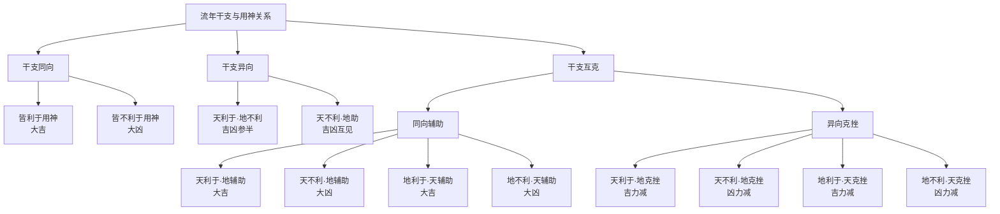

# 流年篇 解读

## 善恶之纲维：流年利于用神为善，不利为恶

> 【原文】流年干支，利于用神为善。流年干支，不利于用神为恶。

此二句为流年篇之总纲。韦氏论流年，不就流年干支本身论吉凶，而以**局中用神**为权衡尺度——流年干支若帮扶用神，使命局趋于中和平衡，是为「善」；若克泄刑冲用神，使命局失衡倾覆，是为「恶」。此一立论，承接月建篇所论「用神」之旨：流年者，岁运之逐年推移也；其与命局发生作用，所关者仍在用神之得失损益。

八字命理以用神为命局「药」，用神得力则命主安泰，用神受伤则命主困厄。流年之来，犹如新方投于旧局——是助药力还是伐药材，须视其与用神之关系而定。故云「利于用神为善」者，非谓流年干支本身有何吉凶属性，乃因其作用于命局后所产生的实际效果而言。

## 克合之变例：善恶之互相转化

> 【原文】流年干支，利于用神。但为局中他神克去或合住，善而不善，然亦不恶，平庸而已。
> 
> 【原文】流年干支，不利于用神，但为局中他神克去或合住，恶而不恶，然亦不善，平庸而已。

此二节论**克合相权**之理。流年本利于用神，然命局之中若有他神（其他干支）将流年克去、或与流年合住（即地支六合、天干五合），则流年之力不能达于用神，善因而转为平庸。譬如本欲以流年之金助用神，而局中火旺克金，则金之助力被夺，纵非凶祸，亦无佳音。

反之，流年本不利于用神，若局中有他神克制此不利之流年、或将流年合住，使其不能加害于用神，则凶力消弭，亦归平庸。此即所谓「制恶」之理——不是直接去恶，乃是断其作恶之路径。

韦氏用「平庸而已」四字最值得玩味。命理之妙，在于**中和**：善恶两消，用神既不得助、亦不受伤，则流年于命主无大影响，平平淡淡而已。此非凶，亦非吉，乃守成之岁。

## 流年与大运：轻重相权之理

> 【原文】流年善，运亦善，则更妙。流年善，运恶，则善，如昙花一现。流年恶，运亦恶，则更恶。流年恶，运善，本年恶，如春草逢霜。

此节论**流年与大运配合**之关系。韦氏先立四象：流年善而大运亦善，两善相叠，「更妙」；流年善而大运恶，善被恶制，「如昙花一现」——好景不长，旋即被厄运冲销；流年恶而大运亦恶，两恶相加，「更恶」；流年恶而大运善，虽大运终能挽回颓势，但本年仍先受其殃，「如春草逢霜」——虽非永枯，一时的摧折在所难免。

「昙花一现」与「春草逢霜」二喻，皆言**时空错位**之害：善者，来之即逝；恶者，虽终能化解，但本年已先受其殃。此正见命理推算需逐年细察，不能因大运善而忽略流年之恶，亦不能因大运恶而否定流年之善——两者并行不悖，各有应期。

## 克合逢制：转机之枢机

> 【原文】流年善，惟被局中某神克合，若运来制住克合之神，则仍佳妙。
> 
> 【原文】流年恶，惟被局中某神克合，若运来制住克合之神，则仍蹇劣。
> 
> 【原文】流年善，惟被局中某神克合，若运来生助克合之神，则凶多吉少。
> 
> 【原文】流年恶，惟被局中某神克合，若运来生辅克合之神，则吉多凶少。

此四节论**大运制化克合之神**时流年吉凶之变化。前二节言「制」：流年本善（或本恶），有局中之神克之合之；若大运来制住此克合之神，则流年之本意得以伸展——善者仍佳，恶者仍凶。后二节言「助」：若大运非但不制克合之神，反而生助之，则克合之力更强——流年善者被克合殆尽而凶多吉少，流年恶者被克合压抑而吉多凶少。

此理精微处在于：**吉凶非流年所能独定**，须看克合之神的强弱消长。同一流年，遇大运不同，吉凶判然。此即子平命理「**同命不同运**」之常谈——命局相同而大运流转有异，则流年之应期与应事亦随之而变。韦氏以「蹇劣」二字状流年恶而被大运制住克合神后仍凶之状，语极凝重。

## 生助之增势：善者更善，恶者更恶

> 【原文】流年善，运若生助之，则更善。流年恶，运若生助之，则更恶。
> 
> 【原文】流年善，运若克挫之，则善力减轻。流年恶，运若克挫之，则恶力减轻。

此四节承上「生助」「克挫」两端，与上文「生助克合之神」相互发明。流年本善（或本恶），大运若再以同类五行生助之，则气势更盛，善者愈善、恶者愈恶；若大运以异类五行克挫之，则气势受遏，善恶之力度皆减轻。

此一原则看似平易，实为子平推命之**基本操作**：大运十年一换，每运皆有干支五行；流年虽有「利于用神」「不利于用神」之定论，然遇大运生助则增其力，遇大运克挫则减其威。命理之推断，乃在**大运、流年、命局三盘互动**中求其综合效果，非可孤立论一端。

## 干支并看：驳偏执之论

> 【原文】有谓流年，重天干。亦有以天干为上半年，地支为下半年，皆非的论。当以干支并看，最较精确。其法有十二。

韦氏于此处破前人之谬：「重天干」之论与「天干主上半年、地支主下半年」之说，皆非精确之论。流年一柱，干支合一、上下相联，犹如人之首足——论命岂可重此轻彼？

故其立论曰「**干支并看**」，即以流年干支同时纳入命局五行生克之网，视其整体作用而后定吉凶。此一立场，与本书月建篇「取用之法，干支并重」之旨一脉相承。

## 干支十二法：吉凶之细分

> 【原文】流年干支，皆利于用神，乃大吉之年。
> 
> 【原文】流年干支，皆不利于用神，乃大凶之年。
> 
> 【原文】流年天干，利于用神，地支不利于用神，乃吉凶参半之年。
> 
> 【原文】流年天干，不利于用神，地支益助用神，亦吉凶互见之年。
> 
> 【原文】流年天干，利于用神，而地支再辅助之，大吉之年。
> 
> 【原文】流年天干，不利于用神，而地支再辅助之，大凶之年。
> 
> 【原文】流年地支，利于用神，而天干再辅助之，大吉之年。
> 
> 【原文】流年地支，不利于用神，而天干再辅助之，大凶之年。
> 
> 【原文】流年天干，利于用神，而地支克挫之，吉力减轻。
> 
> 【原文】流年天干，不利于用神，而地支克挫之，凶力减轻。
> 
> 【原文】流年地支，利于用神，而天干克挫之，吉力减轻。
> 
> 【原文】流年地支，不利于用神，而天干克挫之，凶力减轻。

此十二法，乃「干支并看」之具体应用。韦氏将流年干支与用神之关系析为四大类、每类三分：

**其一，单一干支利于用神**——分「天干利于用神」「地支利于用神」两端。

**其二，单一干支不利于用神**——分「天干不利于用神」「地支不利于用神」两端。

**其三，权衡干支之同异**——同向则「皆利于用神」「皆不利于用神」；异向则「天利于而地不利」「天不利于而地助」。

**其四，权衡干支之辅助与克挫**——同类相辅（大吉大凶）、异类相克（吉凶减轻）。

十二法之排列逻辑，可由下表观其全貌：

十二法之要旨，在于揭示**干支作用方向之同异**决定吉凶之纯杂：同向则吉凶皆纯（大吉大凶），异向则吉凶相杂（参半互见、克挫减轻）。命理推断之精微，正在此同异之间辨析。

## 结篇：流年之义

韦氏此篇，专论流年吉凶之权衡法则。其核心立场有三：

其一，以**用神**为权衡尺度——流年本身无吉凶属性，其作用于命局后所产生之效果（助用神或伤用神）方为吉凶之源。

其二，**流年与大运相权**——孤立论流年或孤立论大运皆非全面，须以两盘互动之综合效果为准。

其三，**干支并看**——流年一柱干支不可偏废，十二法即此立场之具体展开。

本书体例，于运限篇论大运之起止与吉凶，于流年篇专论逐年之变化与应期。流年篇所论，上承运限篇之总纲（十年大运），下启月建篇之细目（流月流日）。其于子平推断体系，居于**逐年细辨**之枢纽位置——大运定其大势，流年析其微应，二者合参，方尽命理推断之能事。