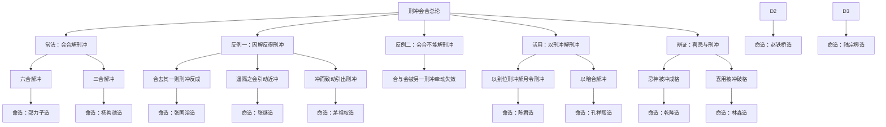

```markdown
## 刑冲会合之名目与义理根柢

> 【原文】刑者，三刑也，子卯巳申之类是也。冲者，六冲也，子午卯酉之类是也。会者，三会也，申子辰之类是也。合者，六合也，子与丑合之类是也。此皆以地支宫分而言，系对射之意也。三方为会，朋友之意也。并对为合，比邻之意也。至于三刑取庑，姑且阙疑，虽不知其所以然，于命理亦无害也。

地支之间四种相互作用，统称「刑冲会合」。「刑」即三刑（子卯、寅巳申、丑戌未三组，另有辰午酉亥自刑）；「冲」即六冲（子午、丑未、卯辰酉戌、寅巳申亥四组对冲）；「会」即三会局（申子辰水、寅午戌火、亥卯未木、巳酉丑金）；「合」即六合（子丑、寅亥、卯戌、辰酉、巳申、午未六对相合）。

原文用三个比喻说透四者的关系性质：**冲为对射**——子午卯酉本宫相对，如两军对垒相克；**会为朋友**——申子辰三方汇聚成势，如朋友结盟；**合为比邻**——子丑并立紧贴，如邻里亲近。三刑的机理「取庑」一说则坦言存疑，沈氏认为虽不能确解，于命理实操无害，体现出严谨的阙疑态度。

> 【徐注】三刑者，谓子卯相刑，寅巳申相刑、丑戌未相刑、辰午酉亥自刑。刑者，数之极也满招损之意。《阴符经》云：三刑生于三会，犹六害之生于六合也（详见卷之起例）。申子辰三合，与巳午未方相比，则巳刑寅，午见午自刑，戌刑未。巳酉丑三合，与申酉戌方相比，则巳刑申，酉见酉自刑，丑刑戌。亥卯未三合，与亥子丑方相比，则亥见亥自刑，未弄丑。各家解释不一，以此说为最确当也。

徐乐吾对三刑的注解分两层。先列三刑的四种组合：子卯、寅巳申、丑戌未三组相刑，辰午酉亥自刑。再以《阴符经》「三刑生于三会」为理论根据——三刑与三会同源，三害与六合同理，盖三合局成则所冲之支必受刑，如申子辰水局成于北方，与南方巳午未相比，巳便刑寅、午见午自刑、戌刑未；同理推及金局、木局。

这一注解的义理推进在于：把三刑从孤立的「相伤」提升为「三会局成的副产品」，是宇宙生成论意义上的结构，而非简单的五行相克。「各家解释不一，以此说为最确当也」一句，是徐氏对前人诸说的客观评断，并未强行独尊，但明确表态——这属于注家间合理分歧的客观陈述，不涉及义理对错判定。

> 【徐注】六冲者，本宫之对，如子之与午、丑之与未、卯辰之与酉戌、寅巳之与申亥是也。天干遇之则为煞，地支遇之则为冲。冲者克也。

六冲的实质是「克」——地支本宫相对，彼此相克。徐氏进一步区分干支：「天干遇之则为煞」，是说天干对冲不称冲而称煞（如甲庚、乙辛等七煞）；「地支遇之则为冲」，冲即克之义。术语当场释义：这里的「煞」即七杀（偏官），是因天干相克而成；地支相冲则以「冲」名之，性质同为相克。

> 【徐注】六合者，子与丑合之类，乃日缠与月建相合也。日缠右转，月建左旋，顺逆相值，而生六合也。

六合的生成机制取自天文：日缠（右旋，即太阳视运动）右转，月建（左旋，即月令斗建）左旋，顺逆相值之处便成六合。这是从天体运行角度解释地支相合的宇宙论根据，与后世单纯从五行生克或阴阳合化解读六合的路径不同，是徐氏注解中颇具天文学色彩的部分。

> 【徐注】三合者，以四正为主。四正者，子午卯酉即坎离震兑也。四隅之支，从四正以立局，木生于亥，旺于卯，墓于未，故亥卯未会木局。火生于寅，旺于午墓于戌，故寅午戌会火局。金生于巳，旺于酉，墓于丑，故巳酉丑会金局。水生于申，旺于子，墓于辰，故申子辰会水局。参阅卷六入门起例。

三合局以四正（子午卯酉，对应坎离震兑四卦）为骨架，四隅之支从四正立局：木长生在亥、旺在卯、墓在未，故亥卯未会木局；火长生在寅、旺在午、墓在戌，故寅午戌会火局；金长生在巳、旺在酉、墓在丑，故巳酉丑会金局；水长生在申、旺在子、墓于辰，故申子辰会水局。

术语释义：长生、旺、墓是五行在十二支中的三种状态——长生如人之初生，旺如壮年，墓如归藏。三合局的成立必须取齐长生、旺、墓三支，缺一则不成局。这一理论把三合与五行十二宫的生旺墓体系直接挂钩，使「会」的义理有了坚实的生成论根基。

## 六合与三合之变例

> 【徐注】三合以三支全为成局。倘仅寅午或午戌为半火局，申子或子辰为半为水局。若单是寅戌或申辰，则不成局。盖三合以四正为主也。若支寅戌而干丙丁，支申辰而干壬癸，则仍可成局，丙丁即午，壬癸即子也。又寅戌会 ，无午而有巳，申辰会，无子而有亥，亦有会合之意。盖巳为火之禄，亥为水之禄，与午子相去一间耳。金木可以类推。此为会局之变例。

三合成局的严苛条件是「三支全」。半局（如寅午、午戌、申子、子辰）尚有会合之意，单是两支（如寅戌、申辰）则不成局——因其缺四正之干（午或子）。

变例有二：一是干上见丙丁可补午、壬癸可补子，仍可成局（因丙丁位属午、壬癸位属子）；二是无午而有巳、无子而有亥，亦有会合之意——巳为火的临官（禄）、亥为水的临官，与午子相去仅一间，临官与帝旺之气相通，故可代用。金木同理可推。这是三合局在「三支不全」时的灵活变通，体现了命理推演的活变精神。

> 【徐注】又甲子、己丑为天地合，盖以甲己合、子丑合也。而丙申、辛卯，亦可谓为天地合，盖申即庚，卯即乙，乙庚合也。又如甲午、壬午，午中藏己，可与甲合，午中藏丁，可与壬合。辛巳、癸巳，巳中藏丙戊，可与辛癸合，是为上下相合也。又如辛亥月丁巳日，亥中之壬，可以合丁，巳中之丙，可以合辛。此为交互相合也。凡此为六合之变例（详订正在《滴天髓征义》天合地节）。

六合的变例更为复杂。**天地合**：天干五合与地支六合同时成立，如甲己合而子丑合，是甲子、己丑为天地合；同理丙辛合而申卯（申藏庚、卯藏乙，乙庚亦合）合，故丙申、辛卯亦天地合。**上下相合**：天干与地支藏干相合，如甲午、壬午——午中藏己可与甲合、藏丁可与壬合；辛巳、癸巳——巳中藏丙戊可与辛癸合。**交互相合**：两柱地支藏干与天干互合，如辛亥月丁巳日，亥中壬可合丁、巳中丙可合辛。

术语释义：「天地合」「上下相合」「交互相合」是六合的三种变例，其核心在于：六合不只看地支本字，更要看地支所藏天干以及四柱干支的整体配合。徐氏注明「详订正在《滴天髓征义》天合地节」，此处保留了徐氏原注的跨书指引文字，属原注本身的内容，并非解读者的引申。

## 会合解刑冲之常法

> 【原文】八字支中，刑冲俱非美事，而三合六合，可以解之。假如甲生酉月，逢卯则冲，而或支中有戌，则卯与戌合而不冲；有辰，则酉与辰合而不冲；有亥与未，则卯与亥未会而不冲；有巳与丑，则酉与巳丑会而不冲。是会合可以解冲也。又如丙生子月，逢卯则刑，而或支中有戌，则与戌合而不刑；有丑，则子与丑合而不刑；有亥与未，则卯与亥未会而不刑；有申与辰，则子与申辰会而不刑。是会合可以解刑也。

会合是刑冲的天然解药。**解冲**：甲生酉月（酉为正官），支逢卯冲酉，若支中再见戌，则卯戌合而解卯酉冲；见辰，则酉辰合而解冲；见亥未，则卯与会成木局而不冲酉；见巳丑，则酉与会成金局而不冲卯。**解刑**：丙生子月（子为正官），卯刑子，若支中见戌则卯戌合解刑；见丑则子丑合解刑；见亥未则卯与会木局解刑；见申辰则子与会水局解刑。

义理核心：会合之所以能解刑冲，是因为会合使相刑相冲的两方「各得其所」——合则贴近、会则结盟，原有的对冲相克之势被新的吸引所取代。这是命理「以情化敌」的方法论根基。

> 【原文】会合可以解刑冲，刑冲亦可以解会合。此须看地位与性质之如何而定，有冲之无力，冲如不冲者，法至活变，无一定之方式也。又冲者，克也，贴近为克，遥动为冲，如年支与时支之冲是也。

刑冲与会合的相互作用是双向的——会合可解刑冲，刑冲亦可解会合。但「解与不解」没有固定公式，须看具体地位与性质。徐氏补注进一步阐发：「冲者，克也」贴近相克（如日支月支紧邻），遥隔则为冲（如年支与时支之隔位相冲）。术语释义：「地位」指四柱中的位置（年月日时），「性质」指五行力量的强弱与喜忌。

这一段是全篇的方法论总纲：命理变化「无一定之方式」，全在「活变」二字。这与沈氏一以贯之的「法至活变」精神相通——没有僵死的规则，只有原则性的方向加上对具体格局的精细辨察。

## 因解而反得刑冲

> 【原文】又有因解而反得刑冲者，何也？假如甲生子月，支逢二卯相并，二卯不刑一子，而支又逢戌，戌与卯合，本为解刑，而合去其一，则一合而一刑，是因解而反得刑冲也。

会合解刑冲并非总是一帆风顺——若会合「合去过当」，反而会引出新的刑冲。例：甲生子月，支中两卯并见，本不刑一子（力量不足以刑）；但若支又逢戌，戌与一卯合（合去其一），则另一卯独对子，反成卯刑子之局——会合本是解刑，合去其一后刑冲反而坐实。

> 【原文】因解反得刑冲者，四柱本可不冲，因会合而反引起刑冲也。不一其例：

此节专论「因解反得」，列举四例：

> 【命造一（原文·张国淦造）】丙子 甲午 丙午 庚寅
>
> 此张国淦之造。一子不冲二午，因寅午之会，复引起子午之冲也。

一子不冲二午（力量悬殊），但因寅午会火局，子水之位被触动（午火得势则子水孤立），复引子午之冲——会合起势反而激起原有的潜在相冲。

> 【命造二（原文·张继命造）】壬午 戊申 壬寅 壬寅
>
> 此张继命造。因年时寅午之会，而引起月日寅申之冲也。寅午遥隔，本无会合之理，而引起冲则可能也。

年支午与时支寅，本因遥隔无会合之理（中间隔着申、寅），但年月寅申紧邻相冲——远隔之会引动近邻之冲。说明会合之影响可通过「气」的传导而起作用，不受距离限制。

> 【命造三（原文·茅祖权造）】癸未 壬戌 庚戌 庚辰
>
> 此茅祖权之造。一未不刑两戌，本可不以刑论，乃因辰戌之冲，复引起戌未之刑。

一未不刑两戌（力量不足以刑），但因辰戌之冲（辰在时支，与月支戌、日支戌形成二戌冲一辰），戌被冲动而受制，反引戌未之刑——冲而致动，动而受制，受制则无力抗刑。

> 【命造四（原文·赵观涛造）】壬辰 癸卯 丁酉 己酉
>
> 此赵观涛之造。一卯不冲二酉，乃以辰酉之合，引起卯酉之冲，与上张继造相同。

辰酉合本可解卯酉冲，但二酉对一卯，辰与一酉合（合去其一），另一酉仍冲卯——与前文「合去其一则刑冲反成」同理。

四造共同呈现「因解反得」的三种路径：会合起势激起潜冲（张国淦）、遥隔之会引动近冲（张继）、冲而致动引出刑冲（茅祖权、赵观涛）。这是「法至活变」的具体落地——没有机械的「合则必解」公式。

## 刑冲而会合不能解

> 【原文】又有刑冲而会合不能解者，何也？假如子年午月，日坐丑位，丑与子合，可以解冲，而时逢巳酉，则丑与巳酉会，而子复冲午；子年卯月，日坐戌位，戌与卯合，可以解刑，而或时逢寅午，则戌与寅午会，而卯复刑子。是会合而不能解刑冲也。

会合有时并不能解刑冲，反而因「会合对象转移」而使原有刑冲重新成立。例：子年午月，日支丑与年支子合（丑子合），本可解子午冲；但时支逢巳酉，丑又去与巳酉会金局，丑一被牵走，子午冲复起。子年卯月，日支戌与月支卯合（卯戌合），本可解卯刑子；但时支逢寅午，戌又去与寅午会火局，卯刑子复起。

义理核心：合与会的力量是有限的——一合不能二用、一会不能两从。当会合的对象被另一柱牵走，原有的「解」便随之失效。

> 【原文】刑冲而会合不能解者，本有会合，可解刑冲矣，乃因另一会合，复引起刑冲，或因第二刑冲引起第一刑冲，亦不一其例。

此节专论「会合不能解」，列举三例：

> 【命造五（原文·赵铁桥造）】丁亥 乙巳 丁酉 甲辰
>
> 此招商督办赵铁桥造。辰酉之合，复引起巳亥之冲也。

年支亥与时支辰，月支巳与日支酉，辰酉合本可安顿金气，但巳亥紧邻对冲——辰酉合成立的同时，巳亥冲亦起。会合与刑冲并存，不能相互抵消。

> 【命造六（原文·陆宗舆造）】丙子 甲午 甲戌 戊辰
>
> 此陆宗舆之造。午戌会可解子午之冲矣，乃因辰戌之冲，复引起子午之冲也。

午戌半会火局本可解子午冲，但辰戌之冲（辰在时支冲月支戌），戌被冲则午戌会破，午孤立则子午冲复起——「第二冲引起第一冲」。

> 【命造七（原文·齐耀琳造）】乙丑 癸未 甲午 甲子
>
> 此齐耀琳之造。午未合本可解丑未之冲，乃因子午之冲，复引起丑未之冲也。

年支丑与月支未对冲，日支午与时支子对冲，午未合本可解丑未冲（合住月支未），但因子午之冲（时支冲日支），午被冲则午未合破，未孤立则丑未冲复起。

三造共同呈现「会合不能解」的机理：合与会的力量被另一组刑冲所牵动而失效，原有的「解」并不能独立成立。这与「因解反得」的区别在于：前者是「解后引出新冲」，后者是「根本解不成」。

## 以刑冲解刑冲之法

> 【原文】更有刑冲而可以解刑者，何也？盖四柱之中，刑冲俱不为美，而刑冲用神，尤为破格，不如以另位之刑冲，解月令之刑冲矣。假如丙生子月，卯以刑子，而支又逢酉，则又与酉冲不刑月令之官。甲生酉月，卯日冲之，而时逢子立，则卯与子刑，而月令官星，冲之无力，虽于别宫刑冲，六亲不无刑克，而月官犹在，其格不破。是所谓以刑冲而解刑冲也。

更深一层：刑冲不仅可以解刑冲，更可「以别位之刑冲解月令之刑冲」。义理根基：四柱之中月令为尊（定格局之所依），若月令用神被刑冲则破格；若以**别位**（非月令之位）的刑冲去牵动刑冲月令之物，使月令用神得以保全，则格局不破。

例：丙生子月（子为正官），卯来刑子，本破官星；若支中又见酉，酉冲卯则卯无力刑子，月令官星得保。甲生酉月（酉为正官），卯日冲之；若时逢子，卯子反成相刑（卯不去冲酉），月令官星虽受遥动但冲之无力，格局犹存。

这一方法的关键：「以别位之刑冲解月令之刑冲」——以次要位置的牺牲换取月令格局的完整。这是命理「两害相权取其轻」的典型应用。

> 【原文】以别位之刑冲而解月令之刑冲者，有以冲而解，有以会而解，不一其例。

此节专论「以刑冲解刑冲」，列举两例：

> 【命造八（原文·陈君造）】丁亥 丙午 丁卯 庚子
>
> 此因子卯之刑，而解子午之冲也。为敝友陈君造。

月支午、时支子紧邻相冲，年支亥、日支卯，子卯相刑——子卯一刑，子被牵住则无力冲午，月令午火得保。这是「以刑解冲」之例。

> 【命造九（原文·杜锡珪造）】甲戌 丙子 癸卯 壬戌
>
> 此因卯戌之合，而解子卯之刑也。为海军总长杜锡珪造。

月支子、日支卯，卯刑子本破月令子水（官星）；但年支戌、时支戌，卯戌合——卯被合住则无力刑子，月令得保。这是「以合解刑」之例，亦属「以别位之合解月令之刑」。

两造分别示范了「以刑解冲」「以合解刑」两种路径，体现「法至活变」在具体格局中的灵活落地。

## 暗合解冲与隔位成格

> 【原文】命理变化，不外乎干支会合刑冲，学者于此辨别明晰，八字入手，自无能逃形。上述变化，尚有未尽，兹再举数例于下：

沈氏总结：命理变化的全部内容不出干支会合刑冲四字，能辨明此理，八字推演便无遁形。以下再举数例补前文未尽之变。

> 【命造十（原文·孔祥熙造）】庚辰 乙酉 癸卯 庚申
>
> 此行政院副院长孔祥熙之造也。卯酉之冲，似解辰酉之合，不知申中之庚，与卯中之乙暗合，因暗合而解冲，遂成贵格。

卯酉冲本可解辰酉之合（辰在年支、酉在月支紧邻），但时支申中藏庚，日支卯中藏乙，庚乙暗合——卯被暗合牵住则无力冲酉，辰酉之合得以保全，遂成贵格。

术语释义：「暗合」指地支藏干之间的相合，藏于地支之内、不显于天干表面，但其作用力真实存在。这一造的关键是：表面看卯酉冲欲破辰酉合，深层有庚乙暗合反救辰酉合——表里两层作用相互抵消而后者胜出。

> 【命造十一（原文·摘《神峰通考》）】丁酉 壬寅 辛巳 丙申
>
> 酉巳之会，因隔寅木而不成局；寅申之冲，亦因隔巳火而不成冲；且巳申刑而带合，去申中庚金，使其不伤寅木，财官之用无损，便成贵格。此造摘自《神峰通考》。

此造源自《神峰通考》（张神峰著），是命理典籍之间的跨文本引用。义理分析：月支寅与时支申本可成寅申冲，但日支巳隔在中间，巳申合（刑中带合）——寅申冲被隔断而不成。月支酉与日支巳本可会金局，但年支酉与月支寅紧邻，寅木隔断——酉巳会不成局。结果：巳申合去申中庚金（忌神），使庚金不伤寅木（财星），财官之用无损，遂成贵格。

术语释义：「刑而带合」指巳申之间既有相刑的成分，又有相合的成分，两者并存而合的作用占优——这是地支藏干作用复杂性的典型表现。

> 【命造十二（原文·光绪皇帝造）】辛未 丙申 丁亥 壬寅
>
> 亥未隔申，不能成局；寅亥之合，似可解寅申之冲，无如申金秉令，亥中壬甲休囚，不能解金木之争；且丁壬寅亥，天地合而假化，旺金伤木，化气破格。此逊清光绪皇帝造也。

与上一造形成鲜明对比。月支申金秉令（得时令之气）力量强旺，亥未隔申不成木局，寅亥合本可解寅申冲，但亥中壬甲休囚（失时令之助），无力解金木之争。丁壬寅亥天地合本可假化木（丁壬合木、寅亥合木），但申金旺而伤木——化气被破，反成破格之造。

义理辨析：上一造（丁酉壬寅辛巳丙申）寅木受申金之克因巳申合而解；此造辛未丙申丁亥壬寅寅亥合本可解寅申冲，但因申金秉令、亥水休囚而解不成。两造并列，呈现「解与不解」之分全在五行力量的对比——秉令者（得月令）力量最强，难以被克制；休囚者（失月令）力量薄弱，无力解冲。

## 喜忌与刑冲会合之双向辨证

> 【原文】又四柱之中，刑冲俱非美事，此言亦未尽然。喜用被冲，则非美事，忌神被冲，则以成格，非可一例言也。举例如下：

前文说「刑冲俱非美事」，此言亦不可执一而论——须看所冲者是喜神还是忌神。**喜用被冲则凶**（破格）；**忌神被冲则吉**（成格）。这是命理辨证精神的极致体现：同一现象（冲），因对象不同（喜/忌）而吉凶相反。

> 【命造十三（原文·乾隆皇帝造）】辛卯 丁酉 庚午 丙子
>
> 煞刃格。天干丁火制辛，煞旺劫轻，喜子冲午，使火不伤金，酉冲卯，使木不助煞，此两冲大得其用。此清乾隆皇帝之造也。

格局：煞刃格（偏官加阳刃）。天干丁火七杀制辛金（劫财），煞旺劫轻——喜见金水以扶身抑煞。

四柱：年支卯（煞之根）、月支酉（劫财之禄）、日支午（日主庚金之旺处所藏丁火，为煞之根）、时支子（食神，可制煞）。**子冲午**：时支子冲日支午，午中丁火被冲则不能伤金——食神制杀的另一种形式（食神本可制煞，此处食神直接冲走煞根）。**酉冲卯**：月支酉冲年支卯，卯木（煞之根）被冲则不能助煞。两冲皆去忌神（煞根），反成贵格。

术语释义：「煞刃格」即偏官（七杀）坐阳刃之格，喜身强能抗煞、食伤能制煞。此造两冲恰好去煞之根，保留身强之质——是「忌神被冲反成格」的典范。

> 【命造十四（原文·林森造）】戊辰 甲寅 丁卯 己酉
>
> 寅卯辰气聚东方而透甲，印星太旺，时上酉冲卯，损其有余，去其太过，却到好处。此国府主席林森之造。或云戊申时，然不论其为申为酉，用神同为取财损印，特借以阐明刑冲会合之理而已。

格局：印星太旺。年支辰（湿土可生木）、月支寅（印之禄）、日支卯（印之本气）、天干甲木透出——寅卯辰三会木局气聚东方，印星过旺反为忌（印太旺则泄日主丁火太过，日主虚弱）。

时支酉冲日支卯（也有版本作戊申时，即申冲寅），冲去印星之旺处，使印星从太旺归于中和——损其有余、去其太过，正是用神所喜。「或云戊申时，然不论其为申为酉，用神同为取财损印」一句是沈氏的自注——版本虽异，论命之理则同，皆是借以阐明刑冲会合之理。

术语释义：「气聚东方」指寅卯辰三支汇聚成木方（东方木）；「损其有余、去其太过」即《尚书·洪范》所谓「满招损」之意，与开篇徐注引《阴符经》「三刑生于三会」之「数之极也满招损」一脉相承。

## 刑冲会合之方法论统观

统观全篇，沈氏论刑冲会合之解法，可归纳为三层递进：

**第一层：常法**——会合可解刑冲，三合六合是刑冲的天然解药。**第二层：反例**——会合并非万能，或因解反得刑冲（合去其一则刑冲反成、遥隔之会引动近冲），或会合根本不能解刑冲（合与会被另一组刑冲牵动而失效）。**第三层：活用**——以别位之刑冲解月令之刑冲，使格局得以保全；忌神被冲反成格、喜神被冲则破格，须辨喜忌而定吉凶。

贯穿全篇的方法论纲领是「法至活变，无一定之方式」。沈氏反复强调：命理变化「不外乎干支会合刑冲」，八字入手的根本功夫即在于辨明四柱之中各种会合刑冲的相互作用——其解与不解、其当解不当解，全在具体格局中「地位与性质」的精细辨察。这一精神与沈氏一以贯之的命理观相通：用神为纲、活变为目，没有僵死的规则，只有原则性的方向与对具体格局的精准把握。

十四造命例从各个角度落地这一方法论：从「会合可解」（邵力子、杨善德、陆荣廷、周湘舲）到「因解反得」（张国淦、张继、茅祖权、赵观涛），从「会合不能解」（赵铁桥、陆宗舆、齐耀琳）到「以刑冲解刑冲」（陈君、杜锡珪），从「暗合解冲」（孔祥熙）到「隔位成格」（丁酉壬寅辛巳丙申、光绪造），从「忌神被冲成格」（乾隆）到「损其太过成格」（林森）——每一造都是「法至活变」的具体演绎。

## 解冲诸法之脉络



## 在命理典籍体系中的定位

此篇为「基础理论」与「格局通论」之间的过渡枢纽。本书承干支性情之论而进论刑冲会合之解法；为用神取用与格局推演奠定基础。

本篇所确立的方法论纲领——「法至活变，无一定之方式」——是全书的精神主线之一。沈孝瞻在后续论用神成败、论用神变化、论用神纯杂、论用神格局高低诸篇中，反复回到「活变」二字：所谓「用神」非一成不变之物，其成立与变化全在四柱具体会合刑冲之精细辨察。此篇之刑冲会合解法，正是「用神活变」之具体落地——干支之间的相互作用千变万化，没有机械的公式可套，唯有对每一组会合刑冲的具体地位与性质做精准辨察，方能论定格局之高下、吉凶之取舍。
```