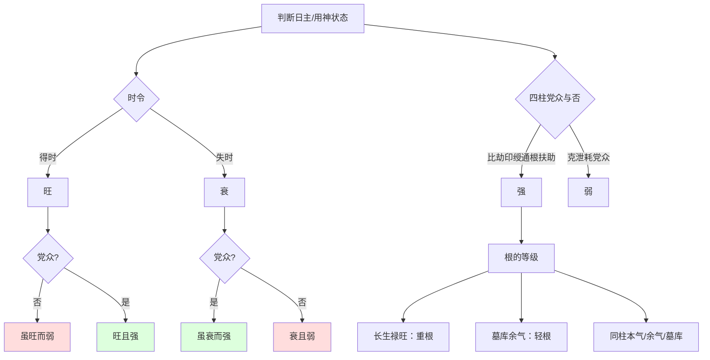

# 解读文件生成

## 1. 前置自检确认

✅ 已完整通读 `SPEC-interpretation.md` 全文
✅ 已完整通读 `research-dispute/general.md` §一总则与 §二 14 条红线
✅ 已完整通读 `bazi.md` 子平八字专项约束文件
✅ 已完整通读 `catalog.md` 篇章目录与 `source.md` 本篇原文
✅ 14 条红线与 §1.5 内联摘要核对一致

---

## 2. 内容结构梳理

**原文段落拆分与理论点提取**：

1. **首段**：破题——驳"得时即旺、失时即衰"死法，提出五行并存之气。
2. **第二段**（徐注后接沈氏正文）：举例说明——春木虽强，金太重则危（得时而不旺）；秋木虽弱，根深则强（失时而不弱）。
3. **第三段**：总论"旺衰强弱"四字须分别看——得时为旺、失时为衰、党众为强、助寡为弱。
4. **第四段**：论"根"——长生禄旺为重根，墓库余气为轻根；干多不如根重。
5. **第五段**（徐注中沈氏自辨）：辨明墓库不可通用，余气各有专属；驳"阴长生"说之矛盾。
6. **第六段**：驳时人谬论——夏水冬火不问通根便言弱、阳干逢库求刑冲开。
7. **末段**：统论子平以五行为宗，万变不离其宗，可一扫谬书谬论。

**注家分层**：本篇有【徐注】一处，夹于原文第二段后。【徐注】与沈氏原文互为补充——徐注先以"退伍军人"作喻阐发"虽不当令、其用未尝消失"之理，沈氏随后接以"春木夏火秋金冬水"实例落地，二者层次分明。

**二级标题拟定**（反机械化，从原文关键词提炼）：

- 破死法：五行并存于四时
- 旺衰强弱须分别看
- 根有轻重：干多不如支重
- 辨墓库余气之通根
- 扫谬论：以五行为宗

---

## 3. 逐段引用与表层解读

### 破死法：五行并存于四时

> 【原文】书云，得时俱为旺论，失时便作衰看，虽是至理，亦死法也。然亦可活看。夫五行之气，流行四时，虽日干各有专令，而其实专令之中，亦有并存者在。

沈氏开篇即破拘执之见。古书所谓"得时为旺、失时为衰"，从大处看不差，但若作死法则误。五行之气流转于四时，虽有当令与不当令之分，而不当令者并非消亡——春木司令时，戊己土虽处于休囚退避之地，却依然存在于天地之间，且"春土何尝不生万物"？

> 【原文】假若春木司令，甲乙虽旺，而此时休囚之戊己，亦未尝绝于天地也。特时当退避，不能争先，而其实春土何尝不生万物，冬日何尝不照万国乎？

此处内含一个方法论主张：**判断日主旺衰，不能只看月令专令，须兼看四柱整体气的并存**。"退避"二字尤为关键——不当令不等于无力，只是"不能争先"而已。沈氏以"冬日何尝不照万国"作反诘，意思是：冬月火虽处死地，太阳却依然普照，并非真的消失。

> 【徐注】四时之中，五行之气，无时无刻不俱备，特有旺相休囚之别耳。譬如木旺于春，而其时金水火土，非绝迹也。但不得时耳。而不得时中，又有分别。如火为方生之气，虽尚在潜伏之时，已有逢勃之象，故名为相；金土虽绝，其气将来，水为刚退之气，下当休息……虽退归田野，其能力依然存在，一旦集合，其用无殊。非失时便可置之不论也。

徐注对"并存"之理发覆尤切。他将"不得时"再细分三等：火为方生之气（相），金土虽绝而其气将来，水为刚退而当休息——这是把五行在四时的状态从二元（旺/衰）推进为四元（旺、相、休、囚）的细分。"退伍军人、致仕官吏"之喻，把"不当令不等于无用"说得极为通透。

### 旺衰强弱须分别看

> 【原文】旺衰强弱四字，昔人论命，每笼统互用，不知须分别看也。大致得时为旺，失时为衰；党众为强，助寡为弱。故有虽旺而弱者，亦有虽衰而强者，分别观之，其理自明。

此为全篇核心命题——**"旺衰"与"强弱"是两组不同的判断维度**。旺衰关乎时令（外部条件），强弱关乎四柱同类与异类的力量对比（内部结构）。时令虽旺，若四柱中克泄耗日主之神党众，反而显弱；时令虽衰，若比劫印绶通根扶助，则虽衰而强。

> 【原文】春木夏火秋金冬水为得时，比劫印绶通根扶助为党众。甲乙木生于寅卯月，为得时者旺；干庚辛而支酉丑，则金之党众，而木之助寡。干丙丁而支巳午，则火之党众，木泄气太重，虽秉令而不强也。

举例说明：甲乙木生于寅卯月，得时为旺，但若天干透庚辛、地支见酉丑，金来克木，是"金之党众、木之助寡"——得时而不强。又若天干透丙丁、地支见巳午，火泄木之气太重，"虽秉令而不强"。

> 【原文】甲乙木生于申酉月，为失时则衰，若比印重叠，年日时支，又通根比印，即为党众，虽失时而不弱也。不特日主如此，喜用忌神皆同此论。

反过来说：甲乙木生于申酉月，金来克木，失时为衰；但若年日时支中比肩、印绶重叠通根，则是"党众"——虽失时而不弱。末句"不特日主如此，喜用忌神皆同此论"是方法论推广——这一辨别原则不仅适用于日主，也适用于喜神、用神、忌神、仇神的旺衰判断。

### 根有轻重：干多不如支重

> 【原文】是故十干不论月令休囚，只要四柱有根，便能受财官食神而当伤官七煞。长生禄旺，根之重者也；墓库余气，根之轻者也。

由此引出"根"的等级体系：四柱有根是承受财官食伤、抵挡伤官七煞的根基。长生、禄、旺为重根，墓库、余气为轻根。

> 【原文】天干得一比肩，不如得支中一墓库，如甲逢未、丙逢戌之类。乙逢戌、丁逢丑、不作此论，以戌中无藏木，丑中无藏火也。得二比肩，不如得一余气，如乙逢辰、丁逢未之类。得三比肩，不如得一长生禄刃，如甲逢亥子寅卯之类。

"干多不如根重"——这是子平术中极重要的经验法则：一个天干比肩（如甲乙同类）的帮扶力度，反而不如地支中的一个墓库（如甲以未为木库）。关键在于"根"是归宿之地（后文徐注补论为"室家之可住"），而比肩只是朋友之相扶——朋友的帮助，不如自己家有根基踏实。

沈氏于此处特意标注例外：**乙逢戌、丁逢丑不作通根论**，因戌中无藏木、丑中无藏火。墓库能否通根，要看本库中是否真藏本干之气。

> 【徐注】此节所论至精。墓库者，本身之库也，如未为木库，戌为火库，辰为水库，丑为金库。不能通用，与长生禄旺同，余气亦然。辰为木之余气，未为火之余气，戌为金之余气，丑为水之余气。

徐注补全四库对应：未为木库、戌为火库、辰为水库、丑为金库。强调"不能通用"——辰虽是水库，却也是木之余气，戌虽是火库，也是金之余气，这是两个不同的根气来源，不可混淆。

### 辨墓库余气之通根

> 【徐注】盖清明后十二日，乙木犹司令，轻而不轻，在土旺之后，则为轻矣；然亦可抵一比劫也。若乙逢戌、丁逢丑，非其本库余气，自不作通根论。

徐注进一步细化"余气"的轻重：清明后十二日乙木犹司令，此时辰中乙木余气尚有一点力量；至土旺之后则力轻。乙逢戌（戌非木之余气）、丁逢丑（丑非火之余气），自不作通根论。

> 【徐注】至于阴长生，既云不作此论，又云亦为有根，可比一余气云云，实未明生旺墓绝之理，不免矛盾。木至午，火至酉，皆为死地，岂得为根？盖亦拘于俗说而曲为之词也。

徐注在此对"阴长生"说提出明确驳议——这是子平术中的一个具体分歧点。沈氏原文说"阴长生不作此论，然亦为明根，可比得一余气"，徐注认为这"实未明生旺墓绝之理"：木至午、火至酉皆为死地，岂可作为根气？徐注的态度是"拘于俗说而曲为之词"——即认为是沈氏本人在此处沿袭了传统说法而未深辨。

> 【徐注】比劫如朋友之相扶，通根如室家之可住；干多不如根重，理固然也。

此句是徐注对全段的小结。"比劫如朋友、通根如家室"——朋友只是助力，家室才是安身立命之所。干多（四柱天干多比劫）不如支重（四柱地支有根），这是子平判断身强弱的一条铁律。

### 扫谬论：以五行为宗

> 【原文】今人不知命理，见夏水冬火，不问有无通根，便为之弱。更有阳干逢库，如壬逢辰、丙坐戌之类，不以为水火通根身库，甚至求刑冲开之。此种谬论，必宜一切扫除也。

此段是沈氏针对时人两类谬误的驳正：其一，夏水冬火（如壬水生午月、丁火生冬月）若不细查地支有无通根（如壬有亥子、丁有巳寅）便一概言弱；其二，阳干逢库（如壬逢辰、丙坐戌）不识其本气通根，反而求他支刑冲来"开库"——库为收藏之府，本就是根基所在，刑冲反致损伤。

> 【原文】从来谈命理，有五星、六壬、奇门、太乙、河洛、紫微斗数各种，而所用有纳音、星辰宫度、卦理之不同。子平用五行评命，其一种耳。术者不知其源流，东拉西扯，免强牵合，以讹传讹，固无足怪，然子平既以五行为评命之根据，则万变而不离其宗者，五行之理也。以理相衡，则谬书谬论，自可一扫而空矣。

末段统论子平命理的方法论根基——五星、奇门、六壬、太乙、河洛、紫微诸术各有所本，子平独以五行为宗。"万变不离其宗"四字点睛：不论格局如何变换、用神如何取舍，底层逻辑始终是五行生克之理。依此理衡之，则种种谬书谬论自然可一扫而空。

---

## 4. 深化洞见

本篇在《子平真诠》基础理论卷中位置关键——前此数篇完成"五行本体"的静态论述，至此篇转入"五行在四时中的动态变化"及其在四柱格局中的实际判断。本篇为后续"用神论"诸篇扫清方法论障碍：若旺衰强弱判断不准，则用神无从取舍、格局无从高下。

沈氏在子平命理史上的贡献，于本篇可见一斑——他将"旺衰"与"强弱"析为两维，又将"根"析为三等（长生禄旺/余气/墓库），把传统命理从笼统的"得时即旺、失时即衰"二元判断，推进为多维度的精细量化体系。徐乐吾以"退伍军人""室家可住"为喻，把这一体系的方法论意蕴阐发得透彻。二者构成"原理-注解"的良性互补：沈氏立框架、举实例、破俗说；徐注补背景、明边界、驳疑义。

"万变不离其宗"一句，作为子平命理的方法论宣言，在全书体系中具有统摄性意义——后续无论讲用神变化、格局高低、还是各格详论，皆以此五行为宗。

---

## 5. 图解补充

本篇涉及"旺衰"与"强弱"两组维度的判别，以及"根"的三等分级逻辑，宜以图表梳理。

