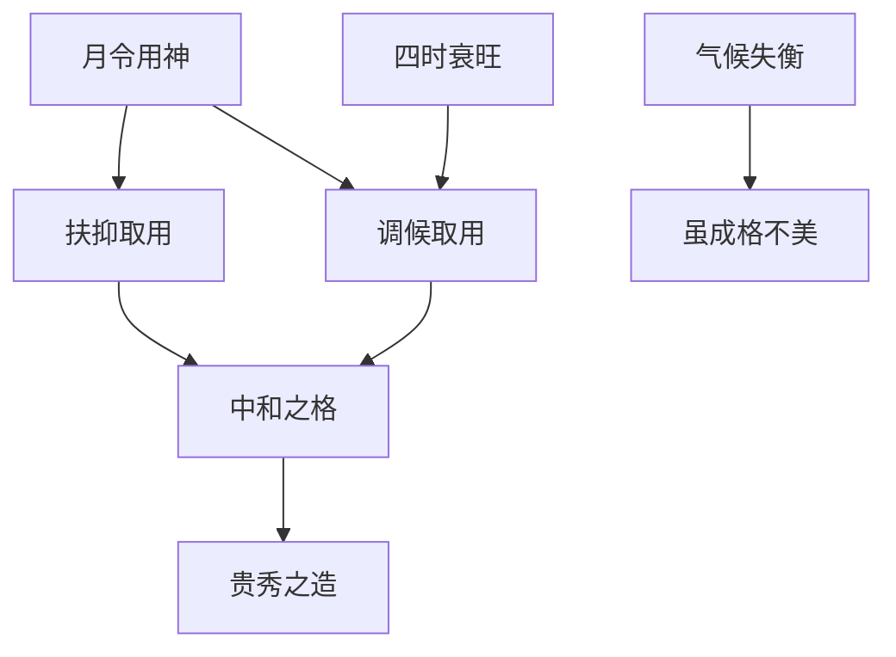

## 月令为主，气候为参

> 【原文】论命惟以月令用神为主，然亦须配气候而互参之。譬如英雄豪杰，生得其时，自然事半功倍；遭时不顺，虽有奇才，成功不易。

此言取用之大纲。命理推命以月令为用神之根基，然非孤立拘执于月令一端，须再参合四时气候之衰旺。譬如英雄得时则事半功倍、失时则成功不易，用神得时乘气则贵，不得时则纵有奇才亦不易显达。徐乐吾注言「夏葛冬裘，得时则贵」，已点明此理：取用神于扶抑之外，必须参合调候之法。所谓调候，即依四时气候之寒暖燥湿，以五行流通之气为用，使日主得中和之宜。

## 冬木寒凝，独取食伤

> 【原文】是以印绶遇官，此谓官印双全，无人不贵。而冬木逢水，虽透官星，亦难必贵，盖金寒而水益冻，冻水不能生木，其理然也。身印两旺，透食则贵，凡印格皆然。而用之冬木，尤为秀气，以冬木逢火，不惟可以泄身，而即可以调候也。

冬木一节，乃气候影响用神之显例。印绶遇官，常规而言官印双全主贵，此为通论。然冬木当令，水寒木冻，印绶之气已成冰水，生木之功已失；官星属金，金寒水冷，金从水势愈增其寒，冻水不能生木，故冬木透官难必贵。身印两旺而透食神者，四时皆可取贵；唯冬木见丙丁食伤，泄身之外兼调气候之寒，是为「尤为秀气」。

> 【原注】木生冬令，月令印绶，冻水不能生木，透官星则金从水势，益增其寒；透财星则水寒土冻，毫无生机，故财官皆无所用。寒木向阳，惟有见丙丁食伤则贵。如庚寅 戊子 甲寅 丙寅，财官皆闲神，无所用之，其时上丙火清纯，以泄身调候为用，所谓用之冬木，尤为秀气。此前清某尚书之造也。

此造庚寅、戊子、甲寅、丙寅，日元甲木生于子月，正当冬令。时上丙火清纯，财官皆为闲神，惟丙火泄身调候为用神——冬木逢火不惟泄木之旺气，且暖局解寒，使冻水得温、木气复苏。此理即「寒木向阳」四字之义。

## 冬土寒沍，必赖丙照

> 【原注】然不仅冬木为然，冬土亦须调候，盖土金伤官生于冬令，必须佩印也。如前清彭刚直公玉麟之造，丙子 辛丑 戊子 癸丑，丑中癸辛透出为贵征，然冬土寒沍，非丙火照暖，则用不显。喜其年上丙火，合而不化，运行南方，丙火得地，而戊土辛癸，皆得显其用，亦调和气候为急也。

冬土与冬木同理。彭玉麟造丙子、辛丑、戊子、癸丑，日元戊土生于丑月（冬土当令），月令土金伤官，丑中藏癸辛透出，本为伤官佩印格之贵征。然冬土寒沍，若无火照暖则金水寒凝、用神不显。年干丙火本为己土之财，与辛金合而不化（丙辛合而化水需水旺丙火弱，此造丙火有子水阻隔难以化水），运行南方得地，丙火照暖之力乃显，使戊土、辛金、癸水各得所用。原注自述「此造《命鉴》所批，误以为倒冲，近方悟得；因悟古来奇异格局，大多类此耳」，可见此造之难悟，正在于冬土调候之理易被忽视。

## 金水伤官，冬令见火为美

> 【原文】伤官见官，为祸百端，而金水见之，反为秀气。非官之不畏夫伤，而调候为急，权而用之也。伤官带煞，随时可用，而用之冬金，其秀百倍。

此言金水伤官之通例。伤官见官，常规主祸；然金水伤官生于冬令，金寒水冷，见火方显其用，官星属火者反为调候所必需，非真正畏伤，乃调候为急、权而用之。冬金伤官带煞，其秀百倍——此理根于「调候」二字。

> 【原注】此言金水伤官也。月令伤官，本以官煞为忌，独有金水伤官，生于冬令，金寒水冷，以见火为美，不论官煞也。更须身印两旺，财官通根，方为贵格。如甲申 丙子 庚辰 甲申，木火无根，虽小富而不贵，且不能用财官，身旺以伤官泄秀为用，特丙火调候，为配合所不可缺，否则，清寒之造也。

原注所举甲申、丙子、庚辰、甲申一造，日元庚金生于子月（冬金当令），月令伤官。甲木、丙火皆无根——木火在冬令无气，不通根则不能为用。身旺以伤官泄秀为用，丙火调候为配合所不可缺。此造虽有伤官泄秀之美，然火神无根，仅主小富而不贵；若无丙火，则成清寒之造——冬金无火，格局虽成而气象寒薄。

> 【原注】更有调候虽得其宜而身弱者，如丁巳 壬子 辛巳 丁酉，丁火虽通根，而日元泄气重，须以酉金扶身为用，亦为贵格。随宜配置，并无一定，特冬令金水，不可缺火，非定以为用也。

此又一例：丁巳、壬子、辛巳、丁酉，日元辛金生于子月，壬水透出为伤官。丁火虽巳酉通根可调候，然壬水伤官泄气太重，日元转弱，须以酉金扶身（亦为用神之一）。原注明言「随宜配置，并无一定」——调候之理虽定，具体取用则须通盘考虑身强弱、格局配伍，无固定程式。唯「冬令金水不可缺火」为定则，缺火则格局不圆。

## 木火伤官，夏令佩印为美

> 【原文】伤官佩印，随时可用，而用之夏木，其秀百倍，火济水，水济火也。

此言木火伤官之通例。伤官佩印本为随时可用之格；唯夏木伤官佩印，其秀百倍——火（伤官）济水（印）之燥、水（印）济火（伤官）之烈，两相调和得其中和之美。

> 【原注】此亦调候之意也。凡佩印必缘身弱，而木火伤官，生于夏令之佩印，润土生木，得其中和为美。如庚辰 壬午 甲辰 丁卯，夏木丁火吐秀，日辰时卯，身不为弱，然喜壬水润泽，更得庚金生印，两辰泄火之燥，生金蓄水，配置中和，为清某观察造也。然甲寅坐禄，时逢卯木，日元已旺，不藉佩印，但贵小，不及佩印之秀耳，非如金水之必须见火也。

此造庚辰、壬午、甲辰、丁卯，日元甲木生于午月（夏木当令），月令伤官。丁火吐秀（伤官泄秀），壬水润泽（佩印调候），庚金生印（财生官印之链），两辰蓄水泄火——配置中和，为贵征。然原注另设一对比：若甲寅坐禄、时逢卯木，则日元已旺，不需佩印，只主小贵，不及佩印之秀。两者之别在于：身弱佩印，得印生身、印克伤、调候一气贯通，乃秀而贵；身旺不藉佩印，则伤官虽泄秀而格局层次受限。此即「夏木不必定以见水为用」之理——木火伤官虽喜见水，然身旺者不必拘执。

## 冬水伤官，见财为美

> 【原文】伤官用财，本为贵格，而用之冬水，即使小富，亦多不贵，冻水不能生木也。

此言冬水伤官之特例。伤官用财本为贵格；唯冬水伤官，金寒水冷，冻水不能生木——木为水之财，财星失于寒凝而不能为用，故主小富而不贵。

> 【原注】承上文金水伤官而言。金水伤官，以木为财，伤官生财，本为美格，而冬令无火，见财无用，因冻水不能生木也。若为水木伤官，见财最美，盖财即火也。总之以调候为急。如甲子 丙子 癸亥 乙卯，水木假伤官用财，名利两全；又己未 乙亥 癸亥 丙辰，汪大发之造也，用丙火之财，亦调候之意也。书云，「惟有水木伤官格，财官两见始为欢」，其实水水喜财，金水喜官也。当分别观之。

原注先承上文金水伤官冬令见财无用之理，再转折指出：若为水木伤官（假伤官），见财最美——水木伤官以火为财，财即调候之神，一举两得。甲子、丙子、癸亥、乙卯一造，日元癸水生于子月，水旺木相，假伤官用丙火之财，调候与用财合一，故名利两全。己未、乙亥、癸亥、丙辰（汪大发造）同理，用丙火之财亦为调候之意。

原注末引「惟有水木伤官格，财官两见始为欢」之书诀，并自下断语：「水木喜财，金水喜官」——水木伤官以财星（火）为美，金水伤官以官星（火）为美，两者取径不同，须分别观之。

## 夏木用财，燥土不秀

> 【原文】伤官用财，即为秀气，而用之夏木，贵而不甚秀，燥土不甚灵秀也。

此言夏木伤官用财之特例。伤官用财本为秀气之格；然夏木当令，火旺土燥，用财（木之财星为水）之时，土因燥而不灵秀——气不中和，格局层次受限。

> 【原注】承上木火伤官而言。夏木用财，如戊戌 丁巳 甲寅 己巳，火旺木焚，而四柱无印，不得已取土泄火之气，行印运被土回克，非特不贵，富亦难期。

此造戊戌、丁巳、甲寅、己巳，日元甲木生于巳月，夏木火旺，四柱无印（壬癸之水全无），不得已取土（己土食伤）泄火之气。然土为燥土，本不灵秀；运行印地（水运），又被燥土回克，财印交战——故非特不贵，富亦难期。此即「燥土不灵秀」之实证：夏木用财而调候失宜，纵有格局之名而无贵秀之实。

## 春木秋金，各当其令

> 【原文】春木逢火，则为木为通明，而夏木不作此论；秋金遇水，则为金水相涵，而冬金不作此论。气有衰旺，取用不同也。春木逢火，木火通明，不利见官；而秋金遇水，金水相涵，见官无碍。假如庚生申月，而支中或子或辰，会成水局，天干透丁，以为官星，只要壬癸不透露干头，便为贵格，与食神伤官喜见官之说同论，亦调候之道也。

此言春木、秋金之调候常规。春木逢火为「木火通明」，其格秀发；秋金遇水为「金水相涵」，其格清贵。夏木冬金则因气过旺或过衰而反失其秀——气有衰旺，取用因之不同。

原注指出：庚生申月（金水假伤官），支会水局（申子辰或申辰半会），天干透丁火为官星——此格「金水相涵」，见官无碍；只要壬癸不透露干头（壬癸为伤官，透干则伤官见官），即为贵格。此理与「食神伤官喜见官」之说同，皆调候之道。

## 春木逢火，木火通明

> 【原注】春木逢火，木火通明；夏木逢火，火旺木焚；秋金遇水，金水相涵；冬金遇水，水荡金沉。此乃气候之衰旺，不能一例论。夏木冬金，真伤官也，反不及假伤官之美矣。春木逢火见官，如甲申 丙寅 甲申 庚午，木嫩金坚，庚金通根于申，必须取丙火制庚为用，为儿能救母。若庚金轻而无根，则置之不用，如戊寅 甲寅 甲寅 庚午，反可取贵也。庚生申月而合水局，为金水假伤官，喜见官星，与冬金真伤官相同。壬癸透露则伤害官星，不论秋冬，为忌亦同。

原注先列四时衰旺之别：春木逢火为木火通明（秀），夏木逢火为火旺木焚（凶），秋金遇水为金水相涵（秀），冬金遇水为水荡金沉（凶）。夏木冬金因气候过极，真伤官反不及假伤官之美。

春木逢火见官，原注举两造对比：甲申、丙寅、甲申、庚午（春木当令），庚金通根于申，木嫩金坚，须取丙火制庚金为用（食神制杀），「儿能救母」之理；若庚金轻而无根（如戊寅、甲寅、甲寅、庚午），则庚金置之不用，反可取贵——金轻不碍木之旺气，不需制之亦无害。

庚生申月合水局为「金水假伤官」，与冬金真伤官同理，皆喜见官星（调候）；壬癸伤官若透干则伤官见官，不论秋冬皆为忌——此为定则。

## 食神夺食，配置为要

> 【原文】食神虽逢正印，亦谓夺食，而夏木火盛，轻用之亦秀而贵，与木火伤官喜见水同论，亦调候之谓也。

此言食神夺食之特例。食神逢正印（枭神夺食），常规主凶；然夏木火盛，轻用之亦主秀贵——印星（壬癸之水）非特生身，且润土调候，与木火伤官喜见水同理。

> 【原注】食神伤官同类，正印固可夺食，偏印可制伤。只要干头支下不相冲突，则各得其用，此八字所以贵于配置适宜也。如一造甲寅 庚午 乙卯 丙子，食轻为印所冲，官轻无财，为丙所克，乃乞丐之命也。

原注点睛：食神与伤官同类，正印固可夺食，偏印（枭神）可制伤——只要干支配置不相冲突，则各得其用。八字之贵，全在配置适宜。此造甲寅、庚午、乙卯、丙子（日元乙木生于午月），食神（丁火之类）轻而被印（壬癸）冲、官星（庚金）轻而无财生、被丙火克伤——配置失衡，乃乞丐之命也。此与前文诸造「配置中和」者形成鲜明对比。

## 通关补缺，取用于运

> 【原注】观上述变化之法，可知用神以及辅佐，最要者在合于日主之需要。倘能合于需要，伤官不妨见；不合需要，财官同为害物。更有两神成象，如水火对峙，非木调和不可，即使四柱无木，亦必待木运，弥其缺憾，方能发迹。以其需要为木，所谓通关是也。取用于四柱之外，更为奇者矣。

原注末段为画龙点睛之论：用神与辅佐之取舍，最要在「合于日主之需要」——合需要则伤官不妨见，不合需要则财官同为害物。此为「需要」二字之定锤。

更论及「两神成象」之特殊格局：若八字水火对峙，无木通关则两强相战为凶；即使四柱无木，亦须待木运方能发迹——「取用于四柱之外」，此为通关之妙用，亦为命理变化之极致。

## 中和为贵，偏燥不美

> 【原注】凡八字必以中和为贵，偏旺一方，而无调剂之神，虽成格成局，亦不为美。如戊戌 己未 戊戌 丙辰，稼穑格也，但辰被戌冲，火土偏燥，气不中和，戌中辛金不能引出，子嗣亦艰，不但不能富贵也。运以金地为美，运至财地，以原局无食伤之化，群劫争财，不禄。此为舍侄某之造，可见调候之重要也。

末段总论「中和」二字。八字以中和为贵，若偏旺一方而无调剂之神，虽成格成局亦不为美。戊戌、己未、戊戌、丙辰一造，本为稼穑格（四柱纯土），然辰被戌冲，火土偏燥，气不中和；戌中辛金本为调候之用而不能引出，故子嗣艰难、不但不能富贵。运至金地（中和之美）稍可，运至财地（木克土为财）则原局无食伤化劫，群劫争财，不禄。原注叹「此为舍侄某之造」，以亲历之例证调候之重要。

## 调候为用神之辅佐

统观全篇，「调候」二字实为论用神配气候之核心枢纽。月令为用神之纲维，扶抑为用神之正轨，而调候则为用神之辅佐——三者缺一不可。

**用神三要素之关系**：

冬木必取丙丁（寒木向阳）、冬土必赖丙照（寒土非暖不灵）、金水伤官冬令见火为美（木火无根亦主小富）、木火伤官夏令佩印为美（两辰蓄水得中和）、冬水伤官见财为美（财即调候之神）、夏木用财贵而不秀（燥土不灵秀）、春木秋金各当其令（木火通明、金水相涵）——皆为调候之具体应用。

更深一层，「调候」之理已超出单纯补火补水之层面，而上升为「合于日主之需要」——需要者，即扶抑、调候、通关之综合考量也。配置适宜则贵秀，配置失衡则贫夭。此为命理变化之通则，亦为子平学之精要。