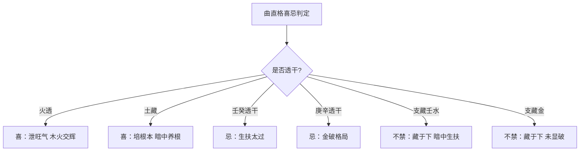

## 曲直格成立之要件

曲直一格之成立，须日干、月令、地支三重条件齐备。

> 【原文】甲乙春生寅卯辰，三方亥未体尤真。
> 【原文】此论曲直格。以甲乙日干为主，柱要寅卯辰全，或亥卯未全。生正二月，方为正论；三月入杂气，又非也。

此言曲直格取材之三重门槛。其一，日主须为甲乙两干：甲为阳木，乙为阴木，两者皆禀东方木之气，方可入此木局。其二，须生于春季之正、二月——正月建寅、二月建卯，正当木气生旺之候，木得时令方可言「曲直成势」。其三，地支须成「三会」或「三合」之局：寅卯辰三会东方木、亥卯未三合木局，两局皆木气纯粹、方许论格之正体。

文中特别指出三月（辰月）生者虽仍在春季，但辰为杂气，混入了戊土、癸水之气，木气已不纯粹，故云「又非也」。三会三合分别由寅卯辰、亥卯未组成，前者全木、后者藏水——下文论「支下有水不妨」者，正就此亥中之壬甲而言。

「尤真」二字，特指亥卯未局之推重。亥为水、卯为木、未为木库，三合木局得水滋而有根，与寅卯辰三会比照，水之生扶非但无碍，反助其势。两局并存，读者可按实际命造择用。

## 喜忌之则：火土之用与金水之忌

曲直格成立之后，喜忌之辨为取用关键。原文以极为凝练之笔，立下此格局之「药」与「病」。

> 【原文】春月旺木，要火透，以泄其旺气，土藏，以培其根本。合此者，方为贵命。见金，则破了格局，见水，则生扶太过。二者，反为不贵。支下有水不妨，最忌：壬癸透出。

春木当令，气已极盛。盛极须有疏泄，否则气机壅塞，反为偏枯。火为木之子，木生火——子气泄母之旺，木自疏通而有致用之功，故云「火透」。土虽克木，但木之根须土培——土主静藏而不显于干，恰得养根之妙，故云「土藏」。一泄一培，调候已成。

金水则反是：金克木，金若透出于干，则木受制而格局破碎；水生木，春木已旺，再加水则「生扶太过」，反为壅溢之病。故原文明示「最忌壬癸透出」——壬癸者，水之正印，透干则水势显于外，益增其太过之弊。

「支下有水不妨」一句至为精微。支藏之水与干透之壬癸有明暗之别：亥卯未局中亥藏壬甲，水气伏于地下、为引化之机，并不破格；壬癸一旦透出于天干，则水势张扬、显而太过。两者判然分明。

> 【原文】木生春月，丙丁午露，火明木秀，有木火交辉之象。

丙丁为火之阳阴（丙阳丁阴），午为火之禄地、内藏丁己——三者具备，则火气通明。火之通明照木之生发，木之秀发反助火之辉光，木火互成其美，故名「交辉」。火透与木秀并见为曲直格之最贵配置。

## 木火交辉之贵象

> 【原文】子平云：火明木秀，斯人不负经魁。故有魁元之喻。
> 【原文】名中魁元心耿耿，官居廊庙质彬彬。

子平之语「火明木秀，斯人不负经魁」，明示此格局与功名之关系。经魁者，五经义理考试之首，古代以经义取士，火明木秀者文章锦绣、功名可期。所谓「魁元」，即此格局功名成就之断语——心耿耿者，志气端方；官居廊庙者，跻身朝廷重臣之列。

> 【原文】其人忠孝多仁德，风雪雷霆内有春。

此承前文推及性情之论。木之性仁，主忠孝；曲直格者，禀木之纯气，故其人多仁德之行。然木亦有风雪雷霆之怒——震为雷，震卦配东方属木，故木中含怒威之质。然怒而不失其仁，所谓「内有春」，即便外显威严，胸中仍有春日温煦之存。

## 青龙恃势与曲直之名义

> 【原文】曲直全，亦名青龙恃势，取东方木之本位，象曰：青龙。结成木局，故名：恃势。木曰曲直，曲直作酸，木味本酸。

「曲直」之名，直承《尚书·洪范》「木曰曲直」——意谓木之性能曲能直、能屈能伸，原文取此名义以名格，明其格局取义之根。

「青龙恃势」之喻尤为精切：青龙为四象之一，主东方；曲直格者，木气纯粹而结成木局，取东方木之本位，故以青龙喻之。龙得云雨而飞腾，得春令而势旺，故名「恃势」。势者，时令所赋予之威权也。

「曲直作酸」一句，亦沿用《洪范》之文，谓木之味为酸。五行五味之配（木酸、火苦、土甘、金辛、水咸）为五行体系最基本之分配，曲直格者，命中木气纯正，故「作酸」——这是体质与饮食偏嗜上的一种展现。

## 木主仁、肝胆魂智与仁寿之义

> 【原文】木主仁，其性喜。
> 【原文】纯粹化为仁寿格，功名远达仕途宽。
> 【原文】纯而不杂，化为仁，多主寿。取仁者，寿之义也。全此之形，其功名远大，仕途绵长之造也。

五行与五常之配，为子平格局论之深层基础：木主仁、火主礼、土主信、金主义、水主智。曲直格以木为体，故以「仁」为其人之性之核心。纯粹不杂之木化为仁体，仁者祥厚安和，故主寿考绵长——「仁者寿」之义，正合《论语》「知者乐，仁者寿」之古训。

> 【原文】乙木属肝脏、魂。甲木属胆脏、智。内含勇气怒。冲肝，亦有恐惧。三乃木之生数，八乃木之成数。

此处由五行进入天干与脏腑、魂智之具体配属。乙为阴木，配肝、藏魂；甲为阳木，配胆、藏智。在中医体系内，肝主谋虑、胆主决断，二者相表里。甲乙日主之人，木气纯粹者，往往兼具谋虑（乙之魂）与决断（甲之智），内含勇毅之气。

然木之性兼有两面：怒则为勇、为发越之象；恐惧则为木受金克、肝胆失护之象——所谓「冲肝亦有恐惧」，并非自相矛盾，实为五行之体性本就兼具两端：木能屈能伸，屈时隐忍如恐惧，伸时勃发如怒威。

数字之配，亦本《尚书·洪范》「三曰木」之生数、「八曰木」之成数。生数者初生之气，成数者成熟之体。纯粹曲直格即禀此三、八之数，全而不杂，故功名远大、仕途绵长——这是格局完美度之数字象征。

## 五行全息之贯通

> 【原文】立春属木。其帝太皞，其神勾芒（太皞，伏羲氏；勾芒，伏羲氏之子也），其虫鳞（凡有鳞者，俱属木）其音角，其臭膻，其味酸，其性喜，其情慈，其数八，在天为五行属岁星，在地为五岳属泰山，在人为五行属木，在身为五脏属肝胆，在理为五常属仁，在岁为春，在方为东，在卦为震，在天干为甲乙，在地支为寅卯，在神为青龙，在色为青
> 【原文】在声降以约，其和静以清，律中太簇。

此为典型之五行全息图式——从天象到地理、从人体到神明、从音律到色味，将「木行」之所有对应项全景罗列。此种系统化配属，源自汉代阴阳五行家之整理，《淮南子》《春秋繁露》《白虎通》之属皆可见类似结构，子平命理承其法而用之。

立春为四时之始、属木。太皞即伏羲氏，《淮南子》以之配东方木德之帝；勾芒为其佐神、主春。木之虫为鳞（鱼龙蛇之类）；音为角（五音之一、配春）；臭为膻；味为酸；性为喜；情为慈；数为八；天象应岁星（木星）；地理应泰山（五岳之东岳）；人体应木（五行之属）；身形应肝胆；伦理应仁；时令应春；方位应东；卦象应震；天干应甲乙；地支应寅卯；神祇应青龙；颜色应青——这套配属体系，将木行彻底贯穿于天地人神之间。

音律一项另出：「在声降以约，其和静以清，律中太簇」。太簇为十二律之一、配正月（寅月），应于木气。此与上文「春」相应，以律吕体系深化五行之音。

## 肝脏之生理体象

> 【原文】治肝用嘘，嘘为泻，吸为补。肝，木宫也。居心下，少近左，有七叶，三长四短。色如缟映绀。重四斤四两。
> 【原文】凡人至六十，肝气衰、肝叶薄、胆渐减，目不明也。东方青色，入通于肝，开窍于目。左目甲，右目乙，在形为眼。肝脉出于大敦（在足大指内侧，去一韭叶是一）肝色青翠，大小相重之象也。

由五行归属转入中医肝脏之具体讨论。「治肝用嘘」之语，源出道家与医家之「六字诀」——嘘字诀为肝之泻法，吸气为补法。

肝之形质：「居心下，少近左」——心脏之下、偏于左侧；「有七叶，三长四短」——此说综合《难经》「肝独有两叶」之记载，后世医家或以「七叶」释之，反映不同医家流派对肝叶之描绘差异。「色如缟映绀」——缟为白色绢、绀为青色，肝之色如白绢映出青色般之泽；「重四斤四两」——古代重量单位，言肝之重量大体。

年六十而肝气衰之说，与《黄帝内经》之衰老理论合——六十岁左右肝气已衰、肝叶渐薄、胆汁渐减，故目不明（「肝开窍于目」）。「东方青色，入通于肝」一语，本《素问·金匮真言论》原文。左目甲、右目乙——天干与人体之具体配属，反映《子平管见》论命时从天干落实到人身之路径。

肝脉起于足大敦穴，与肝之色如翠羽、重叠之象的形态描述相继，皆引自古代医典之文。

> 【原文】肝者，罢极之本，魂之处也。肝号丞相，亦号大夫，又为清冷宫。气吸引入肝，为之语也。气通于肝，于液为泪。泪者，肝之液。肾邪入肝，则多泪也。胆为肝之府，眼为肝之官。肝气通，则眼明。肝气实，则眼赤。肝合于脉，其荣爪也。肝之合：筋缓脉而不能自收持者，肝气先死也。

此段集中铺陈肝之生理与功能、名号。「罢极之本，魂之处」——《素问·六节藏象论》原文。「罢极」即「疲极」，肝主筋、筋耐劳故，肝为人体耐受疲劳之根本；「魂之处」与上文乙木藏魂直接呼应。

肝之号有三种：「丞相」者，以肝辅佐心君（心为君主之官）调理全身；「大夫」者，以肝居臣位主谋略；「清冷宫」者，肝属木、木能制火过亢，有清凉之象。三号同体，并见于医、道诸书。

气通于肝、肝液为泪、肝开窍于目、肝合于脉、肝华为爪——构成中医「肝」之完整生理图式。肝气充盈则眼目明亮、肝气郁结（实）则眼赤；筋缓不能自收持者，肝气已先死——皆五行理论在医理上之推演。

## 肝病诊断与春三月养生

> 【原文】其味酸。其臭膻，心邪入肺，则恶膻。其性仁，肝气主仁。其情喜，木好生而主喜。肝之外应东岳，上通岁星之精。

承前段所论，连缀介绍肝之味、臭、性、情、外应。肝之外应东岳（泰山）、上通岁星之精——天人相应之论，与五行全息体系相贯通。

> 【原文】春三月，存岁星在肝中，亦作青气存也。肝神龙烟，字合明。肝合于胆，上主于目，又主筋。故人之肝虚者，筋急。人之皮枯者，肝热。人之肌肉斑点者，肝风。人之色青者，肝盛。人之好食酸物者，肝不足。人之发枯者，肝伤。人之手足多汗者，肺无病。肺邪入肝，则多哭。肝主角，肝之有疾，当用嘘。嘘者，肝之气，其气仁，能除毁痛。皆自然之理也。肝色青，如翠羽者，生。如草滋者，死。食之先走筋。筋病，勿多食，则皮稿而毛发落也。

春三月存想岁星在肝中、取青气内养——此为道家内修之传统，与医家养肝之论相辅。「肝神龙烟，字合明」——肝之精神名为龙烟、字合明，道家神谱之命名每脏皆有定号。

下文具体列举肝之病症诊断规律：肝虚则筋急、肝热则皮枯、肝风则肌肉斑点、肝盛则色青、肝不足则好酸、肝伤则发枯——皆外症与内因之辨证规律。「食之先走筋」「筋病勿多食」一句，承《黄帝内经》「酸走筋」之论：酸味入肝、肝主筋，故酸先走筋；筋病者不可多食酸味，否则筋反被过酸所伤。

「肝色青，如翠羽者生，如草滋者死」——色泽之润枯判断预后，翠羽之润为生、草滋之枯为死，形象而精切。

> 【原文】肝者，震之气，木之精。其色青。其象如悬匏。其神形如青龙。肝主仁，使人凝肃慈惠及物，则魂安而形全也。

「肝者震之气」一句，直接点明震卦与肝之对应关系（震为东方木之卦），加强前文「在卦为震」之论。「象如悬匏」——匏即葫芦，肝之形态如悬挂之葫芦状。「肝主仁」一句反复申明，将人之道德修养（仁）与生理健康（魂安形全）相结合——仁者肝气舒畅、肝气舒畅者魂有所安，是中医「形神合一」之经典表达，亦为《子平管见》将命理与医理贯通之核心论点。

> 【原文】且肝者，春之用事。春三月，天地俱生，万物以荣。花繁叶茂，仁气初萌。夜卧早起，广步于庭。披发缓形，以使志生。生而勿杀，予而勿夺，掌而勿罚，此春气之应，养生之道。逆之则伤肝，则毛发不荣。夏为寒变，则奉生者少也。

末段为《素问·四气调神大论》之经文，论春季养生之道。「夜卧早起，广步于庭。披发缓形，以使志生。生而勿杀，予而勿夺，掌而勿罚」——春季养生之具体做法：以宽舒之形应春之生发志气，以宽仁之政应春之和煦。「逆之则伤肝」，「夏为寒变」者，春生不足则夏长无源，所谓「奉生者少」。

自格局要件、喜忌之则、五行名义、肝胆配属、五行全息贯通，再到中医肝脏生理与春季养生之道——本篇以曲直一格始论，层层推展，将命理格局之学与医家五脏之学、道家内修之学贯而为一。曲直为《子平管见》格局体系中五行成局之木行专属，与春令相应、于甲乙取干、于寅卯辰亥卯未取支，以木行之全息配属贯穿始终。全篇之论，既立格局正轨，亦明五行之全；既要曲直之象，亦穷肝胆之理——其用意之深、其取材之博，于此可见一斑。