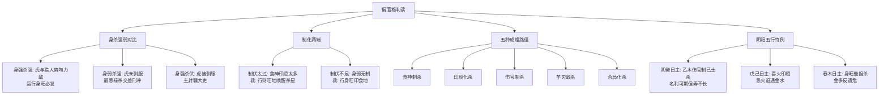

# 偏官诗诀 · 解读

> 解读对象：卷五·偏官诗诀（渊海子平第165篇）
> 体例：七言/五言诗诀（正文、补、眉批）
> 体量：标准档

## 一、何谓"偏官"——全篇立论起点

> 【原文】偏官如虎怕冲多，运旺身强岂奈何，身弱虎强成祸患，身强制伏贵中和。
> 【眉批】偏官无制为七杀，克我之人也。身强则贵，身弱则贱，此皆要身旺。食神制杀，癸水以己土为杀，以乙木克之方吉。丙以水为杀土为伤食，土制水不伤丙为和。春木乘旺，故喜杀。戊己以甲乙为官杀，忌金。

偏官又称"七杀"——是日主所克之阴阳同类而异性者（一句话：与我阴阳相反的官星）。它与正官的区别在于"阴阳相克还是阴阳相异"：正官是异阴阳克我（柔顺），偏官是同五行克我（暴烈）。所以眉批第一句即定调：**"偏官无制为七杀"**——有制则成偏官、为贵格；无制则为七杀、克身作祸。这一字之差，分水岭在于"身强身弱"与"有制无制"。

本篇首句"偏官如虎"，取喻极为生动——把偏官之猛烈、不可驯与"虎"的气质直接挂钩。后文反复回归这一意象（"虎强""驯伏"），可见全篇以"驯虎"为方法论核心：调伏得法则登云发迹，调伏失法则噬身受祸。眉批末段"春木乘旺，故喜杀"一句尤为重要——指出"何时喜杀"的关键判据：身旺能担杀之时，反而以杀为用，正与首句"身强则贵"互证。

## 二、身强身弱——总判据

> 【原文】偏官如虎怕冲多，运旺身强岂奈何，身弱虎强成祸患，身强制伏贵中和。
> 【原文】身逢七杀旺提纲，只为干衰大受伤，正禄交差刑杀入，终身不免受灾殃。
> 【原文】七杀提纲本是愁，只因驯伏喜无忧，平生正直无邪曲，职位高封万户侯。

"提纲"指月令（出生月份地支），为命局五行旺衰的"司令者"。上引三首反复围绕**身（月令/日主）的强弱**与**杀（七杀）的强弱**的对比来立论，呈现三种典型格局：

**身强杀强**（"运旺身强"）——虎与猎人势均力敌，反能激发勇力，**运行身旺之地必发**。

**身弱杀强**（"身弱虎强"）——虎未被驯，必成祸患。诗用"受灾殃""受伤"直言其害。**这种格局最忌"正禄交差刑杀入"**——正禄（比肩帮身之禄位）与七杀交相错杂又逢刑冲，灾殃必至。

**身强杀伏**（"驯伏喜无忧"）——虎被驯服，反为主人守门护院。主"平生正直无邪曲，职位高封万户侯"——这是偏官格最佳气象，主人刚正不阿、位至封疆大吏。

三首合看，全篇立论之纲已明：**偏官格的吉凶，关键不在杀之有无，而在身与杀的强弱对比与制化关系**。这与卷二《论偏官即七杀》《论七杀即偏官》二篇的理论主轴一脉相承。

## 三、制化为权——偏官成格的核心路径

> 【原文】偏官有制化为权，垂手登云发少年，岁运若行身旺地，功名大用福双全。
> 【原文】偏官不可例言凶，有制还他衣禄丰，干上食神支又合，儿孙满眼福无穷。
> 【原文】偏官有制化为权，英俊文章发少年，身旺定登台谏客，印助扶官累受宣。

"制化"是偏官成格的核心路径——本卷诗诀反复点出**"有制化为权"**五字：

**"有制"的方式**：以**食神**制杀（"干上食神支又合"——天干食神制杀、地支六合化杀的双管齐下之制）；以**伤官**制杀（眉批"癸水以己土为杀，以乙木克之方吉"——乙木乃癸之伤官非食神，以伤官之克去制伏七杀）；以**印绶**扶身而化杀生身（"印助扶官累受宣"——印能化泄杀之戾气、转为扶身之助）；以**合局**化杀（"支又合"指地支六合可将杀星合住而化其暴烈）。

**"化为权"的结果**：诗用三种意象铺陈——"垂手登云发少年"（少年得志、青云直上）、"英俊文章发少年"（文采英发）、"身旺定登台谏客"（身旺必为台谏——掌谏诤之官，刚正无私）。三种意象指向同一结果：**权柄在握、少年显达**。

**"岁运若行身旺地"**一句点睛——制化是种子，身旺是土壤。仅有食神制杀而无身旺配合，则杀虽制而身不能担，功名难就；**岁运再行身旺之地，则制与身两旺、功名大用、福禄双全**。这是偏官格从"理论成立"到"现实显达"的桥梁。

## 四、制伏太过与制伏不足——两端之失

> 【原文】偏官制伏太过时，贫儒生此更何疑，岁时若遇财旺地，杀星苏醒发权威。
> 【原文】杀神元有制神伤，制伏身强福禄昌，如见制伏先有损，反将富贵变灾殃。
> 【原文】身弱杀强无制神，多生灾祸不堪论，那堪更入官强地，带疾遭刑丧此身。
> 【原文】伤官七杀命中嫌，制伏调和可作权，日弱又无制伏者，兢兢如抱虎而眠。

偏官格的两个失度皆明示：

**制伏太过**（食神印绶太多、把杀压死）：主人懦弱无能，"贫儒生此更何疑"——终生贫寒的读书人是其写照。救应之法：**岁时行财旺之地**（财能克印、生食以制杀），让"杀星苏醒"——被压制的七杀重新焕发生机，反能以杀为权、显权威。

**制伏不足**（身弱又无制神）："多生灾祸不堪论"——灾祸层出不穷。**更忌再行官强之地**（"官强"此处指官杀并旺之运），则杀势更烈、必致"带疾遭刑丧此身"。日弱又无制者，时时"如抱虎而眠"——处境危殆，旦夕不保。

> 【原文】月令偏官本杀神，有制还居一品尊，假若自身荣贵晚，也须为福及儿孙。
> 【原文】月令偏官最忌冲，伤官羊刃喜相逢，日干旺相皆为贵，制伏无过百事通。

"月令偏官"指生月地支藏有七杀且得令（旺相）——这是**最纯正的偏官格**。本节补出两条重要细节：

**第一**："有制还居一品尊"——月令有杀又得制，**品级最高**。即使身弱而荣贵较晚（早运不济），终究福泽绵长、惠及儿孙。

**第二**："月令偏官最忌冲"——月令被冲则杀星失令、格局崩坏。但若配合得当，**"伤官羊刃喜相逢"**反成大格：伤官能制杀（泄日主之气以制杀）、羊刃能敌杀（比劫帮身以抗杀），二者都是"制伏"的有效手段。"日干旺相皆为贵，制伏无过百事通"——核心仍是身强与制化二者兼备。

## 五、偏官与印绶——杀印相生的另一格

> 【原文】六丙生人亥子多，杀星拘印反中和，东方行去兴名利，运到西方事转磨。
> 【原文】偏官偏印最难明，上下相生有利名，四库坐财直向贵，等闲平步出公卿。

杀印相生是偏官格的另一条成格路径——"杀（克我）生印（泄杀）、印（生我）扶身"，形成奇妙的五行通关。

**第一首"六丙生人"**：丙火生人，亥子（北方水）为杀星。亥中壬水为七杀，亥中甲木为印绶（壬之长生、阴木之阳），印绶能把杀气转化为扶身之力——**"杀星拘印反中和"**，即杀与印同宫而印能化杀。这种格局**喜东方（东为木、为印绶之方）行运**——印绶方位得助、名利大兴；**最忌西方（西为金、金能生水助杀）**——行西方则杀星得势、印绶被伤，"事转磨"指事情反复不顺。

**第二首"偏官偏印"**："偏官偏印"是同一柱中既有杀（克我）又有印（生我）的组合，**"上下相生"**指天干地支之间形成杀→印→身的连环相生。**"四库坐财"**指辰戌丑未四墓库坐于财位（财星居于库地），这种组合可直向富贵——"等闲平步出公卿"。

眉批所谓"最难明"，正是指这一格的复杂性：杀与印看似矛盾（克我者 vs 生我者），实则相辅相成。理解这一相生机制，是把握偏官格之"中和"的关键。

## 六、阴阳五行之偏——个别日主之特例

> 【原文】阴癸多逢己字伤，杀星须用木来降，虽然名利升高显、怎奈平生寿不长。
> 【原文】戊己若逢见官杀，局中金水更加临，当生有火宜逢火，火退愁金怕水侵。
> 【原文】春木无金不是奇，金多尤恐反遭危，柱中取得中和气，福寿康宁百事宜。

三首进入**个别日主与季节**的细化讨论，与卷二《论偏官即七杀》中"分日主论七杀喜忌"的体系相呼应：

**癸水日主**："阴癸"即癸水。己土为癸水之七杀，**需乙木（癸之伤官）制之方吉**——这是"食伤制杀"的另一种表达。诗承认"名利升高显"，但又叹"怎奈平生寿不长"——癸水本身阴柔，难承杀之重克，制之虽得名与利，却折寿元。

**戊己土日主**："戊己"为阳土阴土，甲乙木为官杀。**局中金水加临**（金泄土之气、水润土之燥，反成克制）。诗主张**"当生有火宜逢火"**——戊己土本燥、有火（印绶）则更能化杀生身；最怕"火退"（印绶失运）之时，又遇金水助杀，则"愁金怕水侵"。

**春木日主**（寅卯月生人）：春木当令身旺。**"无金不是奇"**——春木无金（无官杀）则无以砥砺成才；**"金多尤恐反遭危"**——金多则杀重克身，反致灾危。**"中和气"**三字是总判：身与杀力量相当、互相成就方为上格。

## 七、补段要诀——身杀强弱的具体尺度

> 【补】身逢七杀旺提纲，只为干衰大受伤，正禄交差刑杀入，终身不免受灾殃。
> 【补】偏官有制化为权，垂手登云发少年，身旺定登台谏客，印助扶官累受宣。
> 【补】若逢七杀化为权，武职功名奏九天，威镇边疆功盖世，貔貅云拥尽扬威。
> 【补】偏官制伏太过时，贫儒生此更何疑，岁时若遇财旺地，杀星苏醒发权威。

补段以四首七言浓缩全篇要旨，呈现三种典型成格气象：

**文官气象**（"英俊文章发少年""身旺定登台谏客"）——以印绶化杀扶身，主文教、谏诤、文章。

**武职气象**（"武职功名奏九天""威镇边疆功盖世"）——以食神制杀或羊刃敌杀，主军功、武勋。"貔貅云拥尽扬威"是古代将军出征、猛将如貔貅的威武意象——这是偏官格与羊刃、伤官配合的典型产物。

**病重得药**（"制伏太过……杀星苏醒发权威"）——制伏过甚的逆转，**靠财地唤醒杀星**。

## 八、偏官格在诗诀体系中之位置

偏官是子平八字十神中**最具辩证张力**的一位：论吉则"垂手登云""万户侯"，论凶则"抱虎而眠""带疾遭刑"。本篇以"**有制化为权，身强为根本**"立论枢纽，把这个张力统一于身杀强弱对比与制化两端的尺度之中。

本篇体例上同时具备主论、诗诀、补段、眉批四层内容，便于学人从抽象论断到口诀记诵、再到眉批点要逐层研习。其独特价值在于：

**第一**，把偏官格的核心判据以**口诀化的形式**呈现——身强身弱、杀强杀弱、制化太过与不足的"三组对比"，是判断偏官格吉凶的快速标尺。

**第二**，呈现偏官格的**多种成格路径**——食神制杀、印绶化杀、伤官制杀、羊刃敌杀、合局化杀——五路并行，远比单一路径的格局更为复杂多变。

**第三**，明示偏官格的**两端之失**（制伏太过与制伏不足），并给出**救应之法**（制太过用财地、制不足用印食）——这是把理论落到"行运判断"的关键。

本篇以"驯虎"为方法论核心，把"调伏得法则登云发迹、调伏失法则噬身受祸"的辩证张力贯穿始终，是子平命理中处理对立十神关系的典型范例。
