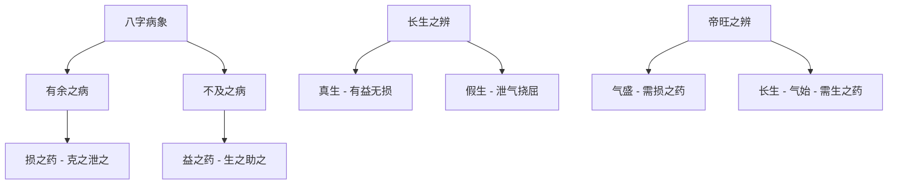

# 损益生长四药说类

## 总论

损益生长四药说是子平命理核心理论之一，以药喻命，深入阐述五行衰旺、病药关系的核心法则。文中以人身疾病为喻，论证八字需要"损有余、益不及"的平衡之道。

## 理论一：损

### 原文解读

> 【原文】何以为之损？损者，损其有余也。然木生震位，正木气当权也。金産兑宫，正金神之得位。当权者不宜资助，得位者不必生扶。假若水又滋土，土又培金。若木有余之病，用金以制之；金有余之病，用火以克之。官星之气有余，则损其官星；财之气有余，则损其财星。譬如人身元太旺为病，当以凉剂通药之剂之也。是以八字贵有损之药也。

**核心概念：**

- **损**：损其有余，即克制过旺的五行
- **当权**：某一行在时令或局中处于旺势
- **得位**：某一行在其本宫位置得势

**损之原理：**

| 过旺之病 | 治法 | 举例 |
|----------|------|------|
| 木有余 | 用金克 | 官星太旺克身太过，用财星耗官 |
| 金有余 | 用火克 | 财星太旺耗身太过，用官星制财 |

【白话】损就像给太旺的人降火。人太旺是病，药是凉茶寒药来平衡。八字也一样，哪一行太旺就是病，需要克它泄它。

## 理论二：益

### 原文解读

> 【原文】何以为之益？益者，益其不及也。若木之死於午，若水之死於卯也。不及则宜资助，且如木气本衰，庚辛又来克木也；水气本衰，戊己土又来克水也，则水木不及之病在此矣。益之之理又当何如也？若木之不及，或行水运以滋其根本。或行木运以茂其枝叶。若水之不及，或行金运通其源流，或行水运以广其彭湃。

**核心概念：**

- **益**：益其不及，即补益虚弱的五行
- **不及**：某一行衰弱的病态

**益之原理：**

| 过弱之病 | 治法 | 举例 |
|----------|------|------|
| 木不及 | 行水木运 | 水运滋木根本，木运茂其枝叶 |
| 水不及 | 行金水运 | 金运通源流，水运广其声势 |

【白话】益就像给太虚的人补气。人太虚是病，药是温补的热药来扶持。八字也一样，哪一行太弱就是病，需要生它助它。

## 理论三：生

### 原文解读

> 【原文】何以为之生也？六阳生处，真为生也。如甲木生亥，亥有壬水，来滋甲木也。六阴生处，俱为弱。如乙木生於午也，午有丁火泄木之精英，有己土为乙木之挠屈。

**生的辨析：**

- **真生**：阳干长生位为真生，如甲木生亥，壬水滋甲，有益无损
- **假生**：阴干长生位未必为真生，如乙木生午，丁火泄气、己土挠屈

**生之要义：**

> 【原文】凡气之不足，故贵济有生之药也。

长生者未必真吉，须辨其气之损益。

【白话】生不一定是好事。阳干长生有水滋是好事，阴干长生有火泄土克反而是坏事。要看长生位有没有坏东西跟着。

## 理论四：长

### 原文解读

> 【原文】何以为之长也？春蚕作茧，木气方敷。夏热成炉，炎光始着。如木临震位，火到离宫。如此帝旺之乡，实不同於生长之位。

**长生与帝旺之辨：**

| 阶段 | 特征 | 喜忌 |
|------|------|------|
| 长生 | 始生，气未盛 | 生之药，扶助生发 |
| 帝旺 | 气已盛，势已成 | 损之药，克其过旺 |

**长之要义：**

> 【原文】走以长生二字，衰旺之不同，故行运有喜生喜克之异。是以八字贵有长之之药也。

长生与帝旺虽同属旺相，但气之盛衰不同，行运喜忌有异。

【白话】长生就像婴儿刚出生，帝旺就像大人壮年。婴儿需要呵护，大人需要管束。长生位的命和帝旺位的命，走运的喜忌完全不同。

## 总结

### 四药关系总图

### 核心要义

> 【原文】以上诸格，楠於合理者取之，背理者辟之矣。以後各格，楠所未及者，附陈於後，以备参考。

损益生长四药说是子平学的方法论基础，强调以平衡为贵、以病药为用。任何格局的喜忌判断，皆须以四药法则为依据。

【白话】这篇文章是子平命理的核心方法论。核心就是八个字：损有余，益不及。太多要克，太少要帮。学会了这一篇，其他格局的喜忌你就懂了。

## 篇章关联

四药说与"雕枯旺弱四病说类"、"病药说"等篇章构成子平病药理论体系，相互发明、相互印证。

【白话】这篇文章跟"雕枯旺弱四病说类"、"病药说"是一套东西，讲的都是怎么看八字哪里有病、怎么用药来治。