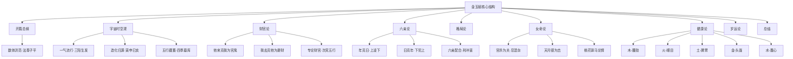

# 金玉赋 · 解读

## 总论

本篇为《渊海子平》卷四收官之赋文，全篇以骈体写成，内容涵盖命理学核心范畴：五行旺衰、六亲论断、格局配合、岁运推断、健康寿夭、吉凶转换等。是书中最具综合性、理论密度最高的篇章之一，被后世命家广泛引用。本赋以"数体洪范，法尊子平"开篇，以"洪范数终，渊源骨髓"收束，首尾呼应，构成完整的命理思想体系。

【白话】这是渊海子平中最长、最重要的一篇赋文，讲的是命理学的各个方面，从六亲到健康到吉凶都有。

---

## 表层义理

### 一、开篇总纲

> 【原文】数体洪范(眉批："洪范"箕子所衍，即河洛大衍之数五十)，法尊子平。

**表层解读**：开篇明义，点明命理学之理论根源。洪范者，箕子所传之河洛大衍之数，为中华术数之祖；子平者，徐大升所创之命理体系。命理之学，以河洛数为体，以子平法为用。

【白话】命理学的基础来自河图洛书，具体方法遵循子平命理。

### 二、宇宙时空观

> 【原文】命天地之奥妙，听空谷之传声。一气流行，则冬寒而夏暑；三阳生发，自春长以秋成。窃闻既生有灭，若亏则盈。造化归源，尽反寅申巳亥；五行藏蓄，各居四季丘陵。

**表层解读**：本段论述宇宙时空与五行运行之规律。一气流行，形成四季寒暑；三阳生发，促成万物生长。造化之源，尽归寅申巳亥四生之地；五行藏蓄于辰戌丑未四季墓库。此为命理推断之时空背景。

【白话】宇宙的运行有规律，五行在四季中循环，人要顺应这个规律。

> 【眉批】"四季"，辰戌丑未土有墓库之方，故曰藏蓄。

### 三、财官论之核心

> 【原文】搜寻八字，专论财官；次究五行，须求气候。论财官之轻重，察气候之浅深。推向背财官之得失，论当生格局之高低。

**表层解读**：本段点明子平命理之核心法则：专论财官。五行配合中，财官为最重之二神。财者，养命之源；官者，荣身之本。判断命局高下，以财官为权衡。

【白话】看八字最重要的是看财和官这两个字，这是子平命理的根本。

> 【原文】他来克我为官鬼，身旺当权；我去克他为妻财，官强则富。

**表层解读**：此句定义财官之取法。他来克我为官鬼（官星），身旺则能担官；我去克他为妻财，官强则富。财官之得失，决定命主之贵贱贫富。

【白话】别人克我是官星，我克别人是财星，身旺能当官，官旺能发财。

### 四、六亲关系论

> 【原文】年伤身主，乃父与子而不亲；时克日辰，是子不遵于父命。年克日兮上能淩下；日克年兮下去犯上。

**表层解读**：本段论年柱与日柱之关系及其六亲含义。年柱为祖辈，日柱为自身，时柱为子女。年柱克日主，则与父辈缘分薄；时柱克日柱，则子女不听话、不孝顺。

【白话】祖辈克日主，和父母关系不好；时柱克日主，子女不听话。

> 【眉批】时为子息，日为自身，年为祖，月为父，克之乃犯上。

> 【原文】若得有物制日子，则可化恶为祥。(眉批：言七杀有制伏，化作偏官，当有兵权之任。)

**表层解读**：本段论七杀之制化。七杀本凶，若有食神或伤官制伏，则化凶为祥，可掌兵权。此为命理"七杀有制化为权"之经典论述。

【白话】如果七杀被制服，反而能当大官，有兵权。

### 五、吉凶转换论

> 【原文】更要本主逢喜神，则将凶而变吉。喜神(眉批：言财官印)庆会，当知资産丰隆；四柱无情，定见祸端并作。

**表层解读**：本段论吉凶转换之机。本主（日主）逢财官印等喜神，则凶可变吉；四柱无情（无喜神、互相冲克），则祸端并起。

【白话】日主遇到喜神，坏事能变好事；四柱没有喜神，什么坏事都可能发生。

> 【原文】或见本主相冲，三刑重叠，岁运欺淩，必招横事。

**表层解读**：本段论凶兆。日主被冲、三刑重重、岁运克身，必招横祸。此为命理凶判之重要依据。

【白话】日主被冲、三刑很多、大运不好，一定会出灾祸。

### 六、格局论

> 【原文】纯粹五行入格，台阁风清；身强七杀逢伏，藩垣镇守。无财官而有格局，青云得路；无格局而有财官，黄门成名。

**表层解读**：本段论格局之高下。纯粹五行入格，可为清贵之命；身强七杀有制，可为边疆大吏。有格局无财官，仍可登科入仕；有财官无格局，亦可衣锦荣身。

【白话】格局纯粹可以当清官，身旺能制七杀可以守边疆；有格局没有财官也能发达，有财官没有格局也能当官。

### 七、女命论

> 【原文】女人无杀，一贵何妨。喜逢天月德神，忌见官杀混杂。贵衆则舞裙歌扇，合多则暗约偷期。

**表层解读**：本段专论女命吉凶。女命以官星为夫，无杀则一贵可取；最喜天月德，忌官杀混杂。官星太众则风流，财合太多则多情。此为女命论之经典要诀。

【白话】女人没有七杀，有一个正官就很好；最喜欢天德月德，最怕官杀混杂；官多了风流，合多了多情。

> 【原文】官星七杀曰夫主，忌见重逢。寅申互见性荒淫，巳亥相逢心不已。

**表层解读**：本段继续女命论。官星七杀皆为夫星，忌重逢见多。寅申互见（驿马）则性荒淫，巳亥相逢（相冲）则心不安。此为女命桃花、感情之重要判断。

【白话】官星和七杀都代表丈夫，忌讳太多；寅申巳亥相逢容易感情混乱。

> 【原文】四柱官鬼(眉批：官鬼即女人之夫，旺为官衰为鬼。)入墓，使夫星早人黄泉；岁运临夭绝之宫，俾鸳配飞分异路。

**表层解读**：本段论女命克夫之象。官鬼入墓，则丈夫早亡；岁运临夭绝之宫，则婚姻分离。此为女命寡宿、克夫之重要判断。

【白话】女命里丈夫星入墓，丈夫会早死；大运走到死绝宫，婚姻会出问题。

> 【原文】要知女命难婚，运入背夫之位；欲识男儿早娶，定是运合财乡。

**表层解读**：本段论婚姻早晚。女命难婚，因运入背夫之位；男儿早娶，因运合财乡（财为妻）。

【白话】女命难嫁是因为大运背了丈夫，男命早娶是因为大运合到了财星。

### 八、财官与人丁

> 【原文】子克重重，杀没官衰；伤食重重，伤妻叠叠。财轻身旺弟兄多，若不如斯，定是刑冲妻妾位。暗合财星妻妾衆，虚朝财位主妻多。财星入墓，必定刑妻；支下伏神，偏房宠妾。

**表层解读**：本段论财官与六亲之关系。子多则杀无官衰，伤食多则伤妻；财轻身旺则弟兄多，反之则刑冲妻妾；暗合财星则妻多，财星入墓则刑妻，支下伏神则宠妾。

【白话】子女多说明七杀无官，伤食多会伤妻子；财少身旺兄弟多，反之会克妻子；暗合财星有很多老婆，财星入墓会离婚。

> 【原文】妻星明朗，乔木相求。

**表层解读**：本段论妻星明暗。妻星（日支）明朗，则得贤妻。

【白话】日支明亮，能找到好妻子。

> 【原文】大运流年三合财乡，必主红鸾吉兆；或临财败之宫，家赀淩替，伤妻损妾，婚配难成。

**表层解读**：本段论岁运与财官。大运流年三合财乡，必有婚配之喜；临财败之宫，则破财伤妻。

【白话】大运流年合到财星，会有婚姻喜事；走到破财的宫位，会破财伤妻。

### 九、健康寿夭论

> 【原文】木逢金克，定主腰肋之灾。火被水伤，必是眼目之疾。三合火神旺盛，克庚辛损头面及脓血之疾。

**表层解读**：本段论五行克战与健康之关系。木被金克，腰肋有灾；火被水伤，眼目有病；三合火局旺，克庚辛则有头面脓血之疾。

【白话】木被金克，腰和肋骨会出问题；火被水克，眼睛会有病；火太旺克金，皮肤会有问题。

> 【原文】如伤日干及财官太盛，折肢体有眷恋之灾。心肺喘满，亦本金火相刑；脾胃损伤，盖因土木克战。

**表层解读**：本段继续论健康。日干、财官太盛，则折肢体；金火相刑则心肺喘满；土木克战则脾胃损伤。此为五行对应脏腑之重要论述。

【白话】日干和财官太旺，手脚会受伤；金和火冲突，肺和心会出问题；土和木冲突，脾胃会受伤。

> 【原文】支水干头有火，遭水克必主腹胚心朦。支火干头有水，遇火旺则内障睛盲。火土烦焦蒸四曜，则发秃眼昏；润下纯湿元气，反神清骨秀。

**表层解读**：本段继续论健康并兼论清浊。支水干火被克，腹心有病；支火干水被克，眼目有疾；火土太盛则发秃眼昏；润下纯湿则神清骨秀。此论清浊之辨。

【白话】支水干火被水克，肚子和心脏会出问题；火土太旺头发秃眼睛昏；水太旺反而神清骨秀。

### 十、贵贱贫富论

> 【原文】官禄杀强，无制则夭；日衰财重，党杀则穷。更看岁运，何凶何吉。身宫冲破无倚，不离祖必出他乡；乾坤艮巽互换朝，好驰骋则心无定主。

**表层解读**：本段论贵贱贫富与岁运。官杀太强无制则夭，日衰财重党杀则穷；身宫冲破则离祖他乡，乾坤艮巽互换则心无定主。

【白话】官杀太强没制会短命，身弱财多帮杀会贫穷；身宫被冲会离开家乡，东西南北乱跑心不安定。

### 十一、华盖与空亡

> 【原文】柱中若逢华盖(眉批：华盖星者，主盖之状，主翰苑，若逢空亡主僧道。)，犯二德清贵之人；官星七杀落空亡，在九流任虚闲之职。

**表层解读**：本段论华盖与空亡。华盖主文翰，遇二德则清贵；官杀落空亡，则为九流虚职。

【白话】八字里有华盖，遇二德是清贵人；官星落空亡，是普通小官。

### 十二、吉凶转换之妙

> 【原文】如临喜处以得祸，是三合而隐凶星；或逢凶处而反祥，乃九宫(眉批：迁宫也。)而露吉曜。要知职品高低，当求运神向背。清奇则早岁成名，沾缺则晚年得地。

**表层解读**：本段论吉凶转换之妙。喜处反得祸，因三合中藏凶星；凶处反为祥，因九宫中露吉曜。职品高低，取决于运神向背；早岁成名者清奇，晚年得地者沾缺。

【白话】走到喜用神的宫位反而出事，是因为三合里有凶神；走到凶神宫位反而顺利，是因为九宫里有吉神；官职高低看大运，早年发达的人命清奇，晚年发达的人命有缺。

### 十三、总结

> 【原文】顺则行，逆则弃。知命乐天，困穷合义，洪范数终，渊源骨髓。

**表层解读**：本段为全文总结。顺天应时则行，逆天背时则弃；知命乐天，困穷合义；此乃洪范之数终，渊源之骨髓。点明命理学之最高境界：知命顺天、乐天知命。

【白话】顺应命运走，违背命运要放弃；知道自己的命，乐观面对，穷困也要守义，这是命理学的最高境界。

---

## 升华洞见

### 一、金玉赋的理论体系地位

金玉赋是《渊海子平》中理论密度最高的综合性赋文，几乎涵盖了子平命理学所有核心范畴：

- **基础理论**：五行旺衰、阴阳配合
- **格局论**：财官格局、杂气格局
- **六亲论**：父母、夫妻、子女、兄弟
- **健康论**：五行对应脏腑、疾病
- **岁运论**：大运流年、运限向背
- **吉凶论**：贵贱贫富、寿夭吉凶

此赋可视为子平命理学的"百科全书"，是研习命理者必读之经典。

### 二、"财官"核心范畴的命理意义

本赋开篇即言"专论财官"，此为子平命理学之核心范畴。财官二神之所以为重，因其直接对应人生两大追求：富与贵。财者养命之源，贵者荣身之本。

在命理实践中，财官之得失、轻重、配合，往往决定命局之高低：

- **财官得地**：富而且贵
- **财官失地**：贫而且贱
- **财多官少**：富而不贵
- **官多财少**：贵而不富
- **财官配合有情**：富贵双全
- **财官配合无情**：贫贱交加

### 三、女命论的特殊意义

本赋女命论述极为详尽，占全文较大比重。此现象反映宋代命理学对女命之重视，亦体现子平命理"女命以官杀为夫"之核心原则。

女命论要点：

- 官杀为夫星，无杀一贵则可
- 天月德为吉神，官杀混杂为凶
- 桃花（寅申巳亥）与感情相关
- 官鬼入墓主克夫
- 财星明暗与婚姻相关

### 四、健康与五行的对应体系

本赋建立了一套完整的五行与脏腑对应体系：

| 五行 | 脏腑 | 疾病 |
|------|------|------|
| 木 | 肝胆 | 腰肋之灾 |
| 火 | 心小肠 | 眼目之疾 |
| 土 | 脾胃 | 消化系统疾病 |
| 金 | 肺大肠 | 头面脓血 |
| 水 | 肾膀胱 | 腹心之疾 |

此体系为后世命理健康论之基础，被广泛引用发挥。

### 五、本篇与全书体系的关联

本篇与以下篇章形成有机呼应：

- "碧渊赋"：同为综合性赋文，内容互有详略
- "金声玉振赋"：同为韵文形式，论述命理要点
- "论六亲"：六亲论之详细展开
- "论大运"：岁运论之详细展开
- "论疾病"：健康论之详细展开

【白话】这篇赋文是子平命理学最全面的总结，几乎涵盖了所有重要理论。

---

## 复杂度评分

| 维度 | 分值 | 说明 |
|------|------|------|
| 理论密度 | 5 | 宇宙观+财官论+六亲论+健康论+吉凶论+格局论，全息理论 |
| 案例数量 | 0 | 无命造案例，纯粹理论阐述 |
| 跨篇章关联度 | 3 | 与碧渊赋、金声玉振赋等多篇章深度关联 |
| **总分** | **13** | 密集模式（≥11分区间） |

**判定**：密集模式——多理论模块系统结构

---

## 命造验证

（原文无自带命造案例，按规范删除此章节。）

---

## 图解补充

【白话】这张图展示了金玉赋的主要内容结构，从开篇到总结，涵盖了命理学的各个方面。