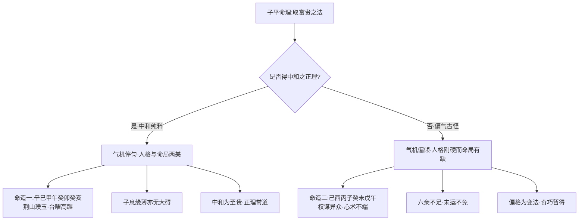

# 中和

## 开门见山：以中和为子平之要法

> 【原文】既识中和之正理，而于五行之妙，有全能焉。

开篇以「既识……而于……」的递进句式立论——前半句是认知前提，后半句是能力承诺。识得中和之正理，则五行之妙全能尽得；不识中和，则五行之妙不过零碎口诀。句式本身就提示了「中和」二字在《滴天髓》体系中的方法论位阶：它不是众多法则中的一条，而是统驭其他法则的总纲。

> 【原注】中而且和，子平之要法也："有病方为贵，无伤不是奇"，举偏而言之也。至于格中如去病，财禄两相宜，则又中和矣，到底中和，乃为至贵。

原注先定调：「中而且和，子平之要法也」——这是把子平命理的核心方法浓缩为「中」「和」两字。「中」指日主与用神之间的中庸平衡，「和」指四柱五行之间的和顺流通。随即原注引出那句流传甚广的口诀——「有病方为贵，无伤不是奇」，并点明这是「举偏而言之」——为了警醒世人而故意走偏锋的说法；真正彻底的中和，才是「至贵」。

> 【原注】若当令之气数，或身弱而财官旺地，取富贵不必于中也；用神强，取富贵而不必于和也；偏其古怪，取富贵而不必于中且和也。何也？以天下之财官，止有此数，而天下之人材，惟此时为最多，皆尚于奇巧也。

原注随即承认「中和」之外另有三途可取富贵：当令气数可凭；用神强可凭；偏其古怪可凭。这里的逻辑是——天下财官之数有限，天下人才之数众多，当多数人争走中和正路时，少数人凭偏奇之格反能脱颖而出。原注这一段看似在开「中和」的方便之门，实则在划定其适用边界：**中和为常法、奇格为变法**，二者并非对立，而是常与变的辩证关系。

## 任氏之辩：中和是「正理」，偏奇是「缺陷」

> 【任氏曰】中和者，命中之正理也。即得中和之正气，又何患名利之不遂耶？夫一世优游，无抑郁而畅遂者，少险阻而迪吉者，为人孝友而无骄谄者，居心耿介而不苟且者，得中和之正气也。

任铁樵接过原注的话头，把中和从「取富贵的法门」提升为「处世的格调」。他先给中和以名分——「命中之正理」。「正理」二字尤其吃紧：不是某一种富贵之格，而是命理之所以为命理的根本义理。随即任氏用一连串排比句（`一世优游……少险阻……为人孝友……居心耿介……`）把抽象的「中和」落到具体的人格形象上——中和之人，性格畅遂不抑郁、命运少险阻、待人孝友不骄谄、居心耿介不苟且。这就把「中和」从技法层推到了性情命格层。

> 【任氏曰】至若身弱而旺地取富贵，身旺而弱地取富贵者，必四柱有所缺陷，或财轻劫重，或官衰伤旺，或杀强制弱，或制强杀弱，此等虽不得中和之理，其气却亦纯正，为人恩怨分明，惟柱中所有缺陷，或运又违，因而妻子财禄，各有不足，如财轻劫重妻不足，制强杀弱子不足，官衰伤旺名不足，杀强制弱财不足，其人或志高傲物，虽贫无谄，后至岁运，补其不足，去其有余，乃得中和之理，定然起发于后，有第见富贵而生谄容，遇贫穷面作骄态者，必四柱偏气古怪，五行不得其正，故心事奸贪，作事侥幸也。

任氏这一段是本篇最吃紧的论辩。他先把「非中和」之造归为四柱有缺陷——或财轻劫重、官衰伤旺、杀强制弱、制强杀弱四类。这四类有一个共同点：六神之间「偏」了——某一神过强而其克泄者太弱，或反之。任氏坦言此等格局「虽不得中和之理，其气却亦纯正，为人恩怨分明」——人格上未必差，只是命局的气机有所偏倾。随即任氏点出偏格的命理代价：「妻子财禄，各有不足」——财轻劫重则妻不足，制强杀弱则子不足，官衰伤旺则名不足，杀强制弱则财不足。配着这四句排比，任氏给出一句断语：「其人或志高傲物，虽贫无谄」——格局偏的人往往人格刚硬，可以贫而骨气不折；这和下文「见富贵而生谄容、遇贫穷而作骄态」之流形成对照。

> 【任氏曰】若所谓"有病有药，吉凶易验，无病无药，祸福难推"，此论仍乃失之偏。大凡有病者显而易取，无病者隐而难推。然总以中和为主，犹如人之无病，由四肢健旺，营卫调和，行止自如，诸多安适：设使有病，则忧多乐少，举动艰难，如无良药医之，岂不为终身之患乎？

任氏在这里批判了「有病有药」之论的偏颇——他不是说这句话错，而是说执持此论者流于偏锋，只看「有药可救」的有病之格，忽略了「无病」之格其实更难得、价值更高。任氏以人体作比：中和之命如同无病之身，「四肢健旺，营卫调和，行止自如」；偏格之命如同有病之躯，「忧多乐少，举动艰难」——若再有良药可救尚可，若无良药则「岂不为终身之患」？这个比喻把「中和」之珍贵讲到了极致——它不是富贵多寡的问题，而是生命状态质量的问题。

## 命造一（任氏注）：辛巳 甲午 癸卯 癸亥——中和纯粹之贵格

> 【命造一（任氏注）】辛巳 甲午 癸卯 癸亥
> 癸巳 壬辰 辛卯 庚寅 己丑 戊子
> 癸卯日元，生于亥时，日主之气已贯，喜其无土，才旺自能生官。更妙巳亥遥冲，去火存金，印星得用，木火受制，体用不伤，中和纯粹。为人智识深沉，器重荆山璞玉，才华卓越，光浮鉴水珠玑。庚运助辛制甲，自应台曜高躔，朗映紫薇，微嫌亥卯拱木，木旺金衰，未免嗣息艰难也。此莫宝斋先生造。

**命局结构**——年辛巳、月甲午、日癸卯、时癸亥。天干辛、甲、癸、癸，地支巳、午、卯、亥。

**任氏析命**——癸卯日主生于亥时（癸水得禄），日主之气已贯而旺。月令午火（财星当令），但局中无土（官星不现），财旺自能生官（财生官之连续性需要土为媒，今缺土则官之印绶不现）；天干透甲木（伤官），食伤生财格局可成。任氏点出最妙之处——「巳亥遥冲，去火存金，印星得用」：巳亥一冲，火气受制，辛金（偏印）得用，可化泄日主之旺气而生木，木火受制而体用不伤。任氏的判语是「中和纯粹」，并以「器重荆山璞玉、才华卓越」形容命主之格调。

**运程流转**——庚运（辛金之根得助）制甲木（去伤官之有余），台曜高躔、紫薇朗映，仕途显达。但「微嫌亥卯拱木」——亥卯未合木局之半木气偏旺，金衰木旺，故「嗣息艰难」（子息缘薄）。

此造为「中和纯粹」之典型——日主旺而不极、财官通根而不滥、印星得用而不伤，**气机流转、五行停匀**。

## 命造二（任氏注）：己酉 丙子 癸未 戊午——偏气混浊之败格

> 【命造二（任氏注）】己酉 丙子 癸未 戊午
> 乙亥 甲戌 癸酉 壬申 辛未 庚午
> 此王观察造，癸日子月，似乎旺相，不知财杀太重，旺中变弱，局中无木，混浊不清，阴内阳外之象。月透财星，其心意必欲爱之；时逢官杀，其心志必欲合之。所以权谋异众，才干过人，出生末微，心术不端。癸酉得逢际遇，由佐二至观察，奢华逢迎，无出其右；至未运不能免祸。所谓欲不除，似蛾扑灯，焚身乃止；如猩嗜酒，鞭血方休。

**命局结构**——年己酉、月丙子、日癸未、时戊午。天干己、丙、癸、戊，地支酉、子、未、午。

**任氏析命**——癸水生于子月（建禄），似乎旺相——这是「得令为旺」之表。但任氏随即点破：「财杀太重，旺中变弱」——月干丙火（财星）紧克日主，时干戊土（七杀）再克，地支午未（财之根）助纣为虐，财杀重重克身，**日主虽得月令之禄仍被克得旺中变弱**。更关键的是「局中无木，混浊不清」——无食伤泄秀（日主无从表达才情），无印绶化杀（杀气无从疏解），整个命局财杀混作一团。

**任氏以「阴内阳外之象」断之**——「阴内阳外」是说命主外表（用神层面）有所成就（阳），内里（本质层面）则暗昧混杂（阴）。「月透财星，其心意必欲爱之；时逢官杀，其心志必欲合之」——任氏用对偶句点出命主的两重欲望（爱财与求官），而「权谋异众、才干过人」则是这种内在欲望外化为能力。「出生末微」是命局本身的格局层次不高（不中和故也），「心术不端」是命局气机混浊在人格上的反映。

**运程流转**——癸酉运得逢际遇（酉为偏印、癸为劫财，皆助身），由佐二升至观察（中级武官）；未运（未为木库、亦为火的余气）则「不能免祸」——任氏引《楞严经》「如蛾扑灯、似猩嗜酒」之喻形容命主欲壑难填、终至焚身之祸。

此造与命造一形成鲜明对照：同是癸水日主，同有财官之配，但一者「中和纯粹」、一者「混浊不清」；一者「器重荆山璞玉」、一者「心术不端」。

## 两造对照：中和之贵、偏奇之患

两造并列，中和与偏奇之别一目了然：命造一气质纯粹、贵而不富，仕至清要；命造二才华外溢、心术暗昧，骤贵而终败。任氏在两造之间的判语是：「有第见富贵而生谄容，遇贫穷面作骄态者，必四柱偏气古怪，五行不得其正，故心事奸贪，作事侥幸也。」——见人富贵而生谄、见人贫穷而骄的，往往是命局偏气古怪之格，因为内在气机不中和，外在言行也必失之偏倚。

## 篇中定位

本篇立"中和"二字为命理目标状态之总纲。任氏把中和从模糊的"恰到好处"细化为"强者宜抑、弱者宜扶、众者宜减、寡者宜益"的可操作判据，并以两造对照演示"中和者致祥、偏奇者致殊"的实操后果。本篇义理为后续命理篇章提供一个可对照的"理想态"——命局调理之目的，皆在复归中和。
