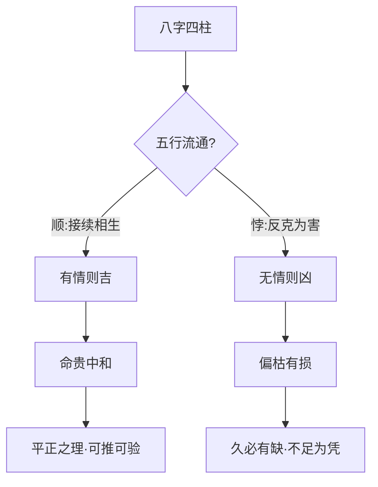

# 人道

## 人得五行之全为贵

> 【原注】万物莫不得五行而戴天履地，惟人得五行之全，故为贵。其有吉凶之不一者，以其得于五行之顺与悖也。

本篇无独立正文，开篇便是原注定调。注家先从宇宙论角度立论：万物皆禀五行之气而生——"戴天履地"四字，把万物安置在天覆地载的宇宙结构之中。但注家随即做了一个关键区别：万物都得五行之"一气"（羽虫属火、毛属木、鳞属金、蚧属水，原文未列倮虫所属，盖后段详述），唯独人得五行之"全气"——人为倮虫之长，禀土气而居中央，土乃木火金水中气所凝，故"独是五行之全"。

这个"全"字是本篇眼目。但注家随即指出：吉凶之所以不齐，不在"全不全"——人人都全——而在所得之气是"顺"还是"悖"。这是把命理学从"禀赋"层面（得什么）推进到"流通"层面（顺不顺）的关键转换。

## 顺则吉、悖则凶

> 【任氏曰】人居覆载之中，戴天履地，八字贵乎天干地支顺而不悖也。顺者接续相生，悖者反克为害，故吉凶判然。

任铁樵接住原注"顺与悖"的概念，做了实操翻译：把"五行之顺"落到"八字天干地支"上。"贵乎天干地支顺而不悖"——这是把抽象的宇宙论变成可操作的方法论。

任氏把"顺"与"悖"各做具体定义：

- **顺者接续相生**——天干弱而地支生之、地支衰而天干辅之，都是"有情而顺"则吉；
- **悖者反克为害**——天干衰弱而地支抑之、地支气弱而天干克之，都是"无情而悖"则凶。

这里有一个值得留意的判法："顺"不是"相同"或"同类"，而是"接续相生"——气的流通是否有情。任氏紧接着用木为例，做了一次完整的"顺—悖"推演：

> 如天干是木，畏金之克，地支有亥子生之；支无亥子，天干有壬癸以化之；干无壬癸，地支有寅卯以通根；支无寅卯，天干有丙丁以制之，木有生机，吉可知矣。

这是层层递退的救应之法——亥子（生木之水）→ 壬癸（天干之水）→ 寅卯（地支之木根）→ 丙丁（制金之火）。一层不够，用下一层补。这四层救应都体现了"接续相生"的核心——木气有生路，便是"顺"。

紧接着的反面是"悖"的演示：

> 若天干无壬癸，而反透之以戊己；支无亥子寅卯，而反加之以辰戌丑未申酉，党助庚辛之金，木无生理，凶可知矣。

"反透之以戊己"——土本可生木，但木弱之时再见厚土，反而泄木之气（"反克"即反向消耗）；"辰戌丑未申酉"——这些地支若成党助金之势（辰戌丑未为土，但此处作金之党），则木无任何生路。

任氏最后说"馀可类推"——这一个木的例子，立的是通用方法，五行皆可循此推演。

## 物类五行与人造流通

> 【任氏曰】凡物莫不得五行，戴天履地，即羽毛鳞蚧，亦各得五行专气而生，如羽虫属火，毛属木，鳞属金，蚧属水。惟人属土，土居中央，乃木火金水中气所成，独是五行之全，为贵。是以人之八字，最宜四柱流通，五行生化；大忌四柱缺陷，五行偏枯。谬书妄言四戊午者，是圣帝之造，四癸亥者，是张桓侯之造，究其理皆后人讹传。

任氏在此段做了一件重要工作：把原注"万物得五行"的宇宙论再细讲一遍，并由此推导出八字学的两条总原则——

| 八字学的两大总原则 | 释义 |
| --- | --- |
| 最宜四柱流通，五行生化 | 年月日时四柱之间要气贯流通、生化有情 |
| 大忌四柱缺陷，五行偏枯 | 某一柱或某一行过盛过弱，便成偏枯之局 |

任氏在文末特别批判谬传："谬书妄言四戊午者，是圣帝之造，四癸亥者，是张桓侯之造"——这是流传甚广的所谓"圣帝""张桓侯"造四柱纯阳的传说。任氏明言"究其理皆后人讹传"，这是他对民间口传的明确否定。

## 史姓四壬寅造——偏枯之验

> 【任氏曰】余行道以来，推过四戊午、四丁未、四癸亥、四乙酉、四辛卯、四庚辰、四甲戌者甚多，皆作偏枯论，无不应验。

这一句是任氏对自己实战经验的总结：他亲推过的"四柱纯一"（四戊午、四丁未、四癸亥、四乙酉、四辛卯、四庚辰、四甲戌）命造甚多，结论都是"作偏枯论，无不应验"——四柱五行偏于一端者，纵有纯清之名，亦入偏枯之病。

紧接着的史姓案例，是对上述总论的活验证。

【命造一（任氏曰第3段）】史姓四壬寅造

> 同邑史姓者有四壬寅者，寅中火土长生，食神禄旺，尚有生化之忣，而妻财子禄，不能全美，只因寅中火土之气，无从引出，以致幼遭孤苦，中受饥寒；至三旬外，运转南方，引出寅中火气，得际遇，经营发财；后竟无子，家业分夺一空。可知仍作偏枯论也。

任氏自己的格局判定——

- **四壬寅**：天干四壬（水）一气，地支四寅（藏甲木、丙火、戊土）。表面看四柱纯一当是"专旺"之造。
- **寅中所藏**：甲木（食神）、丙火（长生）、戊土（禄），三者本是"生化有情"的好配置——木生火、火生土，看似流通。
- **判定难点**：为何这种看似"有情"的配置，依然"妻财子禄不能全美"？

任氏给出关键判语——**"寅中火土之气，无从引出"**。

- 寅中丙火（长生）、戊土（禄）虽然存在，但被四壬水盖头压住，无法透出为用——这是"有而不能引"之病。
- 幼年、中年行北方水运（壬癸亥子），加重水势，寅中火土更受压抑——故"幼遭孤苦，中受饥寒"。
- 三旬外行南方火运（巳午未），引出寅中丙火、戊土之气，得际遇发财。
- 但"后竟无子，家业分夺一空"——中老年再回水运，火土之根被拔，结局仍以偏枯论。

任氏由此得出压轴定论：

> 由此观之，命贵中和，偏枯终于有损；理求平正，奇异不足为凭。

这一句是本篇的总结，也是任氏一生命理实践的最高信条：

- **命贵中和**——四柱五行要平衡流通，忌偏于一端；
- **偏枯终于有损**——即便有"专旺""纯清"之美名，久之必有所缺；
- **理求平正**——命理追求的是平正中和之理，不是奇异罕见之格；
- **奇异不足为凭**——民间口传的"圣帝四戊午""张桓侯四癸亥"之类奇异传说，不足为凭。

任氏相较原注的推进：原注在原理论层立"顺则吉、悖则凶"，任氏则进一步把"顺"具体为"接续相生"的可操作判法，把"悖"具体为"反克为害"的反面案例，并以史姓四壬寅造实战验证"偏枯终于有损"。原注给的是道，任氏给的是术——这正是任铁樵注本一以贯之的特色。

**本篇为《滴天髓》上篇通神论系列之一，专论人道之「顺与悖」**。任铁樵在注解中一面以木为喻立「顺则吉、悖则凶」的具体判法，一面以史姓四壬寅造实战验证「偏枯终于有损」，两层合看便把「中和」二字从抽象的口诀落到可操作的命理准则。
