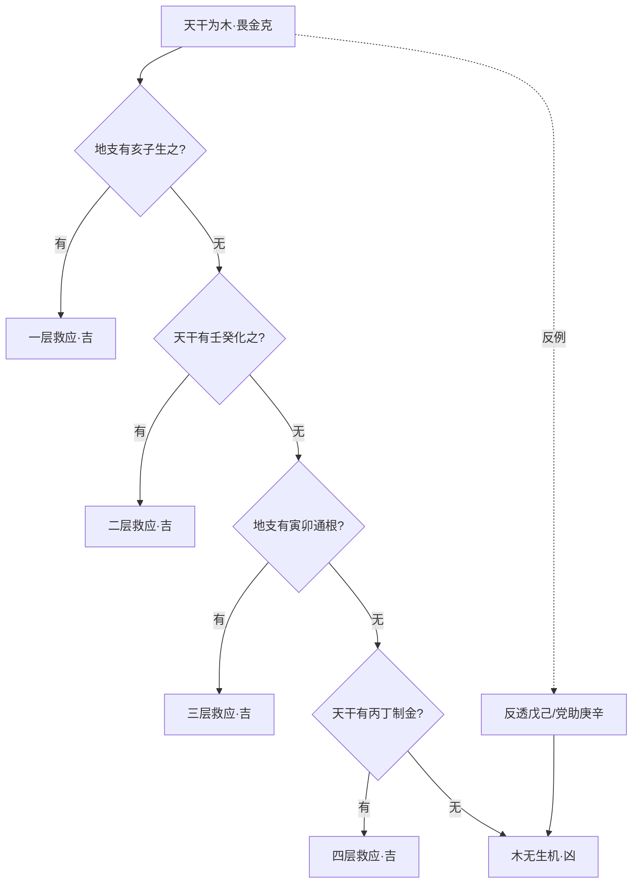

## 顺则吉、悖则凶：命理判吉凶之总纲

> 【原文】戴天覆地人为贵，顺则吉兮凶则悖。

> 【原注】万物莫不得五行而戴天履地，惟人得五行之全，故为贵。其有吉凶之不一者，以其得于五行之顺与悖也。

首二句先立宇宙论的总背景：万物皆禀五行之气而生，"戴天覆地"四字把万物安置在天覆地载的结构之中。但随即做一关键区别——万物得五行之一气（羽虫属火、毛属木、鳞属金、蚧属水），唯独人得五行之"全气"：人为倮虫之长，禀土气而居中央，土乃木火金水中气所凝，故"独是五行之全"。

"全"字是此篇眼目。但吉凶之所以不齐，不在"全不全"——人人都全——而在所得之气是"顺"还是"悖"。这一转手即把命理学从"禀赋"层面（得什么）推进到"流通"层面（顺不顺）。

## 以木为例：救应之法的层层递退

> 【任氏曰】天干是木，畏金之克，地支有亥子生之；支无亥子，天干有壬癸以化之；干无壬癸，地支有寅卯以通根；支无寅卯，天干有丙丁以制之，木有生机，吉可知矣。若天干无壬癸，而反透之以戊己；支无亥子寅卯，而反加之以辰戌丑未申酉，党助庚辛之金，木无生理，凶可知矣。馀可类推。

任氏把原注"顺与悖"翻译成可操作方法论："贵乎天干地支顺而不悖"——把抽象的宇宙论变成可推演的判法。"顺"不是"相同"或"同类"，而是"接续相生"——气的流通是否有情；"悖"则相反，指"反克为害"——气的运行被反向消耗或对冲。

任氏以木为例，立通用方法：

| 救应层级 | 救应之神 | 作用机制 |
| --- | --- | --- |
| 一层 | 亥子（地支之水）| 生木——金克木时，水来化金生木 |
| 二层 | 壬癸（天干之水）| 化之——支无亥子时，干透壬癸仍可生木 |
| 三层 | 寅卯（地支之木根）| 通根——干无壬癸时，地支有寅卯可立木之根 |
| 四层 | 丙丁（天干之火）| 制之——支无寅卯时，干透丙丁制金以存木 |

一层不够，用下一层补。四层递退皆体现"接续相生"的核心——木气有生路便是"顺"。

反面即"悖"的演示："反透之以戊己"——土本可生木，但木弱之时再见厚土，反而泄木之气（"反克"即反向消耗）；"辰戌丑未申酉"——若成党助金之势，则木无任何生路。"馀可类推"四字立的是通用方法，五行皆可循此推演。

## 物类分五行、人禀土之全

> 【任氏曰】凡物莫不得五行，戴天履地，即羽毛鳞蚧，亦各得五行专气而生，如羽虫属火，毛属木，鳞属金，蚧属水。惟人属土，土居中央，乃木火金水中气所成，独是五行之全，为贵。

任氏在此段把原注"万物得五行"再细讲一遍，由是推导出八字学的两条总原则：

| 总原则 | 释义 |
| --- | --- |
| 最宜四柱流通，五行生化 | 年月日时四柱之间要气贯流通、生化有情 |
| 大忌四柱缺陷，五行偏枯 | 某一柱或某一行过盛过弱，便成偏枯之局 |

任氏文末特别批判谬传："谬书妄言四戊午者，是圣帝之造，四癸亥者，是张桓侯之造"——这是流传甚广的所谓"圣帝""张桓侯"造四柱纯阳的传说，任氏明言"究其理皆后人讹传"，这是对民间口传的明确否定。

## 史姓四壬寅造：偏枯之实证

> 【任氏曰】同邑史姓者有四壬寅者，寅中火土长生，食神禄旺，尚有生化之忣，而妻财子禄，不能全美，只因寅中火土之气，无从引出，以致幼遭孤苦，中受饥寒；至三旬外，运转南方，引出寅中火气，得际遇，经营发财；后竟无子，家业分夺一空。可知仍作偏枯论也。

> 【任氏曰】余行道以来，推过四戊午、四丁未、四癸亥、四乙酉、四辛卯、四庚辰、四甲戌者甚多，皆作偏枯论，无不应验。

任氏先自述实战经验：亲推过的"四柱纯一"命造甚多（四戊午、四丁未、四癸亥、四乙酉、四辛卯、四庚辰、四甲戌），结论都是"作偏枯论，无不应验"——四柱五行偏于一端者，纵有纯清之名，亦入偏枯之病。

史姓案例即此总论的活验证：

- **命造基础**：四壬寅——天干四壬（水）一气；地支四寅，藏甲木（食神）、丙火（长生）、戊土（禄），看似"生化有情"的好配置（木生火、火生土）。
- **格局判定难点**：为何"有情"的配置，依然"妻财子禄不能全美"？
- **任氏判语关键**——"寅中火土之气，无从引出"：寅中丙火、戊土虽存在，但被四壬水盖头压住，无法透出为用——"有而不能引"之病。
- **流程回溯**：
  - 幼年、中年行北方水运（壬癸亥子），加重水势，寅中火土更受压抑——"幼遭孤苦，中受饥寒"。
  - 三旬外行南方火运（巳午未），引出寅中丙火、戊土之气，得际遇发财。
  - 中老年再回水运，火土之根被拔——"后竟无子，家业分夺一空"，仍以偏枯论。

> 【任氏曰】由此观之，命贵中和，偏枯终于有损；理求平正，奇异不足为凭。

此四句是此篇的压轴定论——任氏由史姓案例的偏枯之验，落到方法论的收束：

- **命贵中和**——四柱五行要平衡流通，忌偏于一端。
- **偏枯终于有损**——即便有"专旺""纯清"之美名，久之必有所缺。
- **理求平正**——命理追求的是平正中和之理，不是奇异罕见之格。
- **奇异不足为凭**——民间口传的"圣帝四戊午""张桓侯四癸亥"之类奇异传说，不足为凭。

## 原注层与任氏层之分工

**原注层与任氏层之分工**：原注立宇宙论之底色——把万物安置在"戴天履地"的五行结构中，明"人得五行之全"与"顺则吉、悖则凶"的总纲；任氏据此转译为可操作判法——把"顺"落到"接续相生"的四层救应，把"悖"落到"反克为害"的反面案例，并以史姓四壬寅造实战验证。两层各司其职。

任氏相较原注的推进：原注在原理论层立"顺则吉、悖则凶"，任氏则进一步把"顺"具体为"接续相生"的可操作判法，把"悖"具体为"反克为害"的反面案例，并以史姓四壬寅造实战验证"偏枯终于有损"。原注给的是道，任氏给的是术——任铁樵注本一以贯之的特色在此亦可见。
