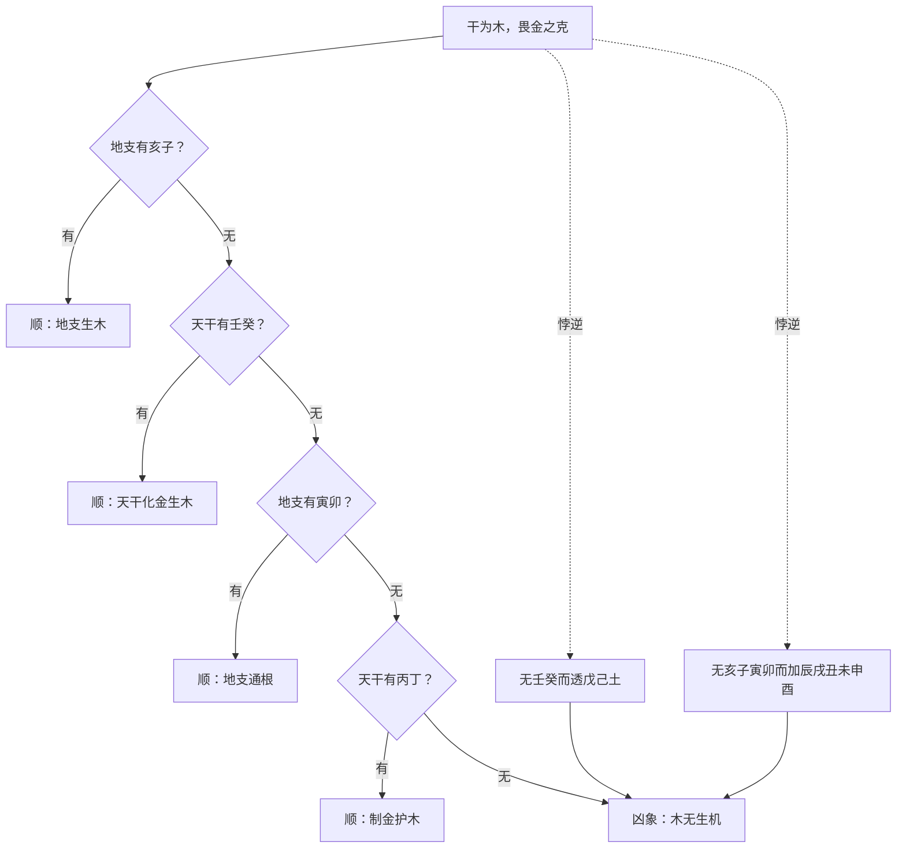

## 戴天覆地 惟人为贵

> 【原文】戴天覆地人为贵，顺则吉兮凶则悖。

此二句为全篇纲领。"戴天覆地"语本《礼记·郊特牲》"戴皇天，履后土"，人头顶天、足踏地，居天地之间而与万物并立。"顺则吉兮凶则悖"则开宗明义揭出八字吉凶之总判——不在五行繁简，而在顺悖之间。"兮"字为古汉语虚词，用于句中舒缓语气，"悖"字义为违逆、相害。

> 【原注】万物莫不得五行而戴天履地，惟人得五行之全，故为贵。其有吉凶之不一者，以其得于五行之顺与悖也。

原注先立本体：万物皆禀五行之气而生，非独人也。然人之所以独贵，在"得五行之全"——非仅得一气之偏，乃兼收五行之全体。后文任氏所谓"惟人属土，土居中央，乃木火金水中气所成"，即此义之展开。吉凶之判，则系于所得五行"顺与悖"——顺则流通生化，悖则反克为害。

此处须辨明：人之处世非孤立于五行之外，而是五行之"全"与"和"的承担者。命造之优劣，不在某行独旺，而在整体是否顺遂有情。此一立场为后文任氏所反复申说。

## 顺者有情 悖者无情

> 【任氏曰】人居覆载之中，戴天履地，八字贵乎天干地支顺而不悖也。顺者接续相生，悖者反克为害，故吉凶判然。如天干气弱，地支生之，地支神衰，天干辅之，皆为有情而顺则吉；如天干衰弱，地支抑之，地支气弱，天干克之，皆为无情而悖则凶也。

任氏承接原注，将"顺""悖"二字落实为八字干支间的作用关系。"顺"非仅指相生，更指"接续相生"——气有衰旺，则强者扶之、弱者助之，使全局生生不息。"悖"则指"反克为害"——本应相生而反来克，本应相扶而反来抑，恰与所需相反。

任氏提出"有情""无情"一对范畴以判顺悖：

- **有情而吉**：天干气弱，地支生扶之；地支神衰，天干辅助之。一衰一旺，相互接济，弱者得养而生机不竭。
- **无情而凶**：天干已衰，地支反来抑制；地支已弱，天干反来克伐。衰者更衰，生机断绝。

此判据关键在于"气之衰旺"与"作用方向"是否相合——衰者当扶而反抑、弱者当助而反克，便是悖。"神衰""气弱"皆指五行气势之虚弱，"抑之""克之"则指反方向的作用力，任氏以此两组对照，示人顺悖之辨。

## 木干通根引化——顺悖实操

> 【任氏曰】假如干是木，畏金之克，地支有亥子生之；支无亥子，天干有壬癸以化之；干无壬癸，地支有寅卯以通根；支无寅卯，天干有丙丁以制之，木有生机，吉可知矣。若天干无壬癸，而反透之以戊己；支无亥子寅卯，而反加之以辰戌丑未申酉，党助庚辛之金，木无生机，凶可知矣。馀可类推。

此段任氏以"木"为例，将"顺""悖"之理展开为多层逻辑推演，示人以实操门径。

木之所畏者，金也——庚辛克木，是为木之克星。欲保木之生机，须依下列次第化解：

1. **地支有亥子**——亥子为水，水生木，地支生扶天干，是为第一顺境；
2. **支无亥子，天干有壬癸**——壬癸亦水，天干透出以化金生木，是为第二顺境；
3. **干无壬癸，地支有寅卯**——寅卯为木之禄旺与同类，地支通根则木有依托，是为第三顺境；
4. **支无寅卯，天干有丙丁**——丙丁为火，火能制金以护木，是为第四顺境。

四层次第，是任氏为"顺"字所铺设的完整路径——亥子、壬癸、寅卯、丙丁，生、化、根、制，层层接续，使木于五行流转中处处有托。

反之则为悖：木干无水（壬癸）而反见土（戊己）——木克土为财，然木已衰弱，复以财累之，是泄其元气；地支无水木而反见辰戌丑未申酉——土与金皆木之所畏或所耗，反助金势以攻木。如此则木无生机，凶不可免。

"馀可类推"四字尤为紧要。五行之中，金、水、火、土皆可依此格局推演其顺悖之理，不必执一而论。任氏以木为示例，正是为读者打开类推之门。

```mermaid
flowchart TD
    A[干为木，畏金之克] --> B{地支有亥子？}
    B -->|有| C[顺：地支生木]
    B -->|无| D{天干有壬癸？}
    D -->|有| E[顺：天干化金生木]
    D -->|无| F{地支有寅卯？}
    F -->|有| G[顺：地支通根]
    F -->|无| H{天干有丙丁？}
    H -->|有| I[顺：制金护木]
    H -->|无| J[凶象：木无生机]
    A -.悖逆.-> K[无壬癸而透戊己土]
    A -.悖逆.-> L[无亥子寅卯而加辰戌丑未申酉]
    K --> J
    L --> J
```

## 惟人属土 得五行之全

> 【任氏曰】凡物莫不得五行，戴天履地，即羽毛鳞蚧，亦各得五行专气而生，如羽虫属火，毛属木，鳞属金，蚧属水。惟人属土，土居中央，乃木火金水中气所成，独是五行之全，为贵。

此段任氏将"人之所以贵"的本体论推进一步。万物皆禀五行而生，然各有专气：

- 羽虫属火——羽能飞翔，取火性炎上之象；
- 毛属木——毛属草木之伦，取木性生发之象；
- 鳞属金——鳞甲坚利，取金性肃杀之象；
- 蚧属水——蚧潜隐幽暗，取水性润下之象。

此四类各得五行之一端，是为"专气"。惟人属土——土居中央，处木火金水之交，乃四行之中气所凝结。故人能兼四行之气，得五行之全。此即原注"惟人得五行之全，故为贵"之具体落实。

由此引出八字之要："是以人之八字，最宜四柱流通，五行生化；大忌四柱缺陷，五行偏枯。"流通则五行之气周转有情，生化则相生有序；缺陷则一气偏倾，偏枯则一行孤立。任氏以此八字为"人道"二字作总注——人之贵在得全，人之命在得顺。

## 谬书四纯之妄

> 【任氏曰】谬书妄言四戊午者，是圣帝之造，四癸亥者，是张桓侯之造，究其理皆后人讹传。

此处任氏点名驳斥流传之谬说——有书妄称"四戊午"为圣帝之造、"四癸亥"为张桓侯（张飞）之造，以四纯一气为至贵之格。此说流布甚广，然任氏直断"皆后人讹传"，明斥其非。

任氏以实证破之：

> 【任氏曰】余行道以来，推过四戊午、四丁未、四癸亥、四乙酉、四辛卯、四庚辰、四甲戌者甚多，皆作偏枯论，无不应验。

任氏自述其数十年命理实践所见：所推此类"四纯"命造不止一二——四戊午、四丁未、四癸亥、四乙酉、四辛卯、四庚辰、四甲戌皆亲历验之，"皆作偏枯论"，所断无不与事实相应。

此处任氏之驳据，有两层力量：

一者，引前文"五行之全"之理——人之贵在兼得五行，非独执一行；四纯命造恰是五行偏枯的反面，何贵之有？

二者，以己身经验为证——任氏明言"行道以来""推过""甚多"，此非孤证，乃长期、大量命造之统计所归纳。"无不应验"四字斩钉截铁，可见任氏对此理之确信。

## 偏枯终于有损——史氏四壬寅实证

> 【任氏曰】同邑史姓者有四壬寅者，寅中火土长生，食神禄旺，尚有生化之忣，而妻财子禄，不能全美，只因寅中火土之气，无从引出，以致幼遭孤苦，中受饥寒；至三旬外，运转南方，引出寅中火气，得际遇，经营发财；后竟无子，家业分夺一空。可知仍作偏枯论也。由此观之，命贵中和，偏枯终于有损；理求平正，奇异不足为凭。

此段任氏举同邑史姓者一造为实证，以明"偏枯终于有损"之理。

【命造一（任氏亲历案例）】史姓者，四柱壬寅、壬寅、壬寅、壬寅。

表面观之，此造似有可取：寅中藏甲木（食神）、丙火（偏财）、戊土（七杀），火土长生，气有根源。壬水坐寅，寅为壬之食神禄旺，似有"生化之机"。

然任氏指出其根本症结——寅中火土之气，无从引出。"无从引出"四字最堪玩味：气虽藏于地支，若天干不透、岁运不引，则藏者终为死藏。壬水天干纯一壬水天干纯一，无丙戊以引出寅中丙戊之气；行运初逢北方水地，更增其寒湿，寅中所藏火土全无激发之机。由此推演其命：

- **幼遭孤苦，中受饥寒**——少年至中年，北方水运寒湿过盛，火土伏藏不彰，出身孤寒，中年困顿；
- **三旬外运转南方**——大运流转南方火地（巳午未），火气激发，寅中丙火得用，故"得际遇，经营发财"；
- **后竟无子，家业分夺一空**——然命局根本仍属偏枯，南方运过，气势已尽，最终无子、家财散尽。

任氏由是结论："可知仍作偏枯论也。"——纵有一时之发越，终不能改偏枯之本。

"由此观之"以下，是任氏对全篇之总收束："命贵中和，偏枯终于有损；理求平正，奇异不足为凭。"前句应原注"顺则吉、凶则悖"之判，后句应前段驳"谬书四纯"之辨——命理之求，不在奇异之格，而在平正之和；偏枯之造，纵似奇特，终归于损。

## 深化洞见

此篇以"人道"名篇，正扣原注"惟人得五行之全，故为贵"之旨。其立论由本体而方法、由方法而破妄、由破妄而实证，形成"本体—方法—破妄—实证"四层结构。

任氏此篇之义理贡献，在于将"顺""悖"二字由泛泛的吉凶之判，提升为可操作的技术范畴——"有情""无情"之分，正是命理审辨之枢纽。后世论命者言"流通""扶抑""顺逆"，其根柢皆可溯至任氏此处所揭之理。

任氏驳"谬书"之态度尤可注意。命理之学流传既久，伪诀讹传势所难免——"四戊午为圣帝""四癸亥为桓侯"之说，非止一书。然任氏不引前人、不立新说，唯以"行道以来""推过""甚多""无不应验"九字为据，以实证破妄。此一态度，于命学之传尤为切要——经典之理必验于事实，流俗之说必汰于实践。

至于"命贵中和"四字，可视为全篇之核心。顺者中和之象，悖者偏枯之征；偏枯者一时或发越而终归于损，中和者平淡无奇而长保其福。此理不独八字为然，即观人观事，亦当以此为衡——任氏由人道推及命理、由命理验之人事，正可见子平之学非徒技艺之末，而实关乎性命之理。