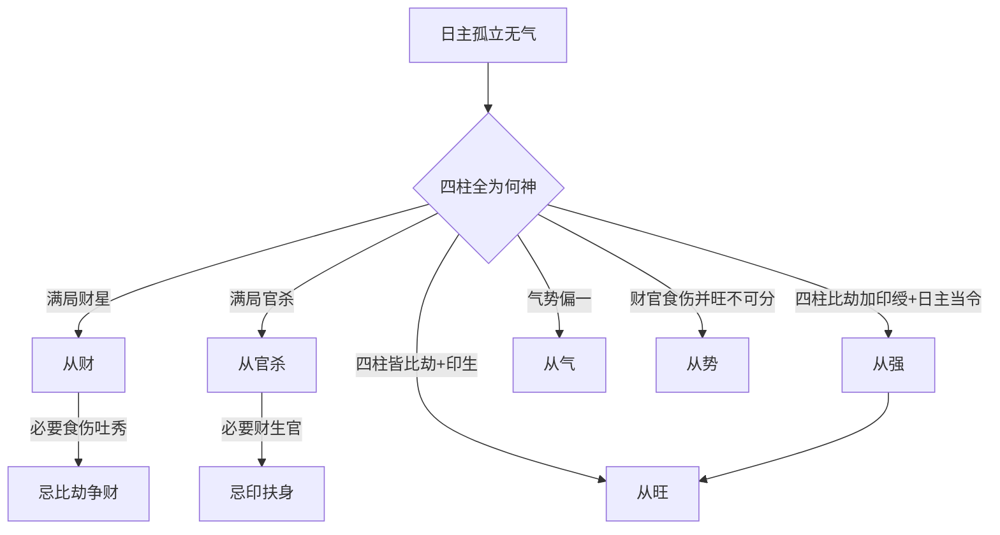

# 从象

## 真从之义

> 【原文】日主孤立无气，无地人元，绝无一毫生扶之意，财官强甚，乃为真从也。

第一句以四层条件立判准：日主"孤立无气"（月令不得时、四柱无根）；"无地人元"（地支不见同类之藏干）；"绝无一毫生扶之意"（印星与比劫皆不到位）；"财官强甚"（所从之神极旺）。四层条件同时满足，日主毫无自立余地，只能投靠旺神，这才是"真从"。

> 【原注】既从矣，当论所从之神。如从财，只以财为主；财神是木而旺，又看意向，或要火、要土。要金，而行运得所者吉，否则凶，余皆仿此，金不可克木，克木财衰矣。

原注紧接着推进一步：真的"从"了之后，分析重心就转移到"所从之神"上。举例说，从财就以财为主，财神是木且处旺相；至于运程喜忌，要看格局的"意向"——或要火来泄秀，或要土来培根，或要金来制衡，行运配合得宜则吉，不配合则凶。原注最后点出一个重要原则："金不可克木，克木财衰矣"——所从之财神是木，就不能再有金来克木，伤了所从之神就是伤了整个格局。此判法对所有"从"格都适用（"余皆仿此"）。

## 任氏之分疏——从象之六

> 【任氏曰】从象不一，非专论财官而已也。日主孤立无气，四柱无生扶之意，满局官星，谓之从官，满局财星，谓之从财。如日主是金，财神是木，生于春令，又有水生，谓之太过，喜火以行之；生于夏令，火旺泄气，喜水以生之；生于冬令，水多木泛，喜土以培之，火以暖之则吉，反是必凶，所谓从神又有吉和凶也。尚有从旺、从强、从气、从势之理，比从财官更难推算，尤当审察，此四从，诸书所未载，余之立说，试验确实，非虚言也。

任铁樵把"从"作了系统化的扩展。原文只提"从财""从官"，任氏先明确点出"满局官星谓之从官，满局财星谓之从财"——这是最基本的两类从格。

接着任氏以"日主是金、财神是木"为范例，展示从财格内部的细分：
- 春令木旺又有水生——太过，喜火以行之（用火泄木之气，把过旺的木气转化为可用之物）；
- 夏令火旺泄木之气——喜水以生之（补水生木，防止木气被泄尽）；
- 冬令水多木泛——喜土培之、火暖之（既要防止水泛淹木，又要以火暖局，使木气有生机）；
- 反是必凶。

任氏点睛之语："从神又有吉和凶"——同样是从财格，财神所处的月令环境不同，喜忌的取用就完全不同。这是"从神"内部更细致的判别。

> 尚有从旺、从强、从气、从势之理，比从财官更难推算，尤当审察，此四从，诸书所未载，余之立说，试验确实，非虚言也。

任氏强调"四从"是从他自己实占经验中提炼——"诸书所未载"既是谦词也是声明，这是任氏对《滴天髓》原文的实质性扩充。下文逐项展示这四从的判法与命造实例。

> 【任氏曰】从旺者，四柱皆比劫，无官杀之制，有印绶之生，旺之极者，从其旺神也。运行比劫印绶制则吉；如局中印轻，行伤食亦佳；官杀运，谓之犯旺，凶祸立至；遇财星，群劫相争，九死一生。

> 【任氏曰】从强者，四柱印绶重重，比劫叠叠，日主又当令。绝无一毫财星官杀之气，谓二人同心，强之极矣，可顺而不可逆也。财纯行比劫运财吉，印绶运亦佳，食伤运有印绶冲克必凶，财官运为触怒强神，大凶。

> 【任氏曰】从气者，不论财官、印绶、食伤之类，如气势在木火，要行木火运，气势在金水，要行金水运，反此必凶。

> 【任氏曰】从势者，日主无根，四柱财官食伤并旺，不分强弱，又无劫印生扶日主，又不能从一神而去，惟有和解之可也。视其财官食伤之中，何其独旺，则从旺者之势。如三者均停，不分强弱，须行财运以和之，引通食伤之气，助其财官之势则吉；行官杀运次之；行食伤运又次之；如行比劫印绶，必凶无疑。试之屡验。

任氏把六种"从"格的判法都讲清了。从旺与从强的差别在于：从旺只看比劫多、印绶生、不见官杀；从强还要加上"印绶重重、日主又当令"，是"二人同心"的极强格局。从气不论日主所从的具体是哪类神，只看整个命局的"气势"落在哪里——气势在木火就走木火运，在金水就走金水运。从势则是日主无根、财官食伤三者均停不可分时，用"和解"之法——行财运引通食伤之气、助旺财官之势最为妥当。

任氏最后以"试之屡验"作结，强调这是经过实占验证的判法。

## 从财真格

> 【任氏曰】戊戌 丙辰 乙未 丙戌
>
> 丁巳 戊午 己未 庚申 辛酉 壬戌
>
> 乙木生于季春，蟠根在未，余气在辰，似乎财多身弱，但四柱皆财，其势必从。春土气虚，得丙火发实之，且火乃木之秀气，土乃火之秀气，三者为全，无金以泄之，无水以靡之。更喜运走南方火地，秀气流行，所以第发丹墀，鸿笔奏三千之绩，名题金榜，鳌头冠五百之仙也，志有为也。

### 【命造一（任氏注）】戊戌 丙辰 乙未 丙戌

日干乙木，生季春辰月，地支辰未戌皆土（乙木之财，我克者为财），四柱财星遍布。乍看是"财多身弱"，但任氏判定其势当从——四柱皆财，没有金（克木）、没有水（生木）来帮扶日主，乙木只能"从财"。

任氏进一步分析其秀气来源：春土气虚，得月干丙火（年干丙火、月支辰中乙木余气）发实之——火是木的秀气（我生者为食伤），土是火的秀气（食伤所生为财），木→火→土三层传递，秀气连贯不漏。最关键的是行运——丁巳、戊午、己未一路南方火地，火土齐来，引通木之秀气直达财星，所以任氏用"鸿笔奏三千之绩""鳌头冠五百之仙"形容其登科发甲之盛。

> 【任氏曰】壬寅 壬寅 庚寅 戊寅
>
> 癸卯 甲辰 乙巳 丙午 丁未 戊申
>
> 庚金生于孟春，四支皆寅，戊土虽生犹死。喜其两壬透干年月，引通庚金，生扶嫩木而从财也。亦是秀气流行，更喜运走东南不悖，木亦得其敷荣，所以早登甲第，仕至黄堂。

### 【命造二（任氏注）】壬寅 壬寅 庚寅 戊寅

日干庚金，生孟春寅月，四支全是寅木（庚金之财），财星极旺。戊土（庚金之印）虽透时干，但生在初春寅月，木旺土死——戊土想生庚金但自己已经受克，无力生扶。

任氏指出妙处在两壬透干年月：壬水是庚金的食伤（我生者为食伤），引通庚金之气下生寅木（食伤生财），庚金→壬水→寅木，秀气层层流通，没有金来克木、没有水来泛木。再走东南水木运，一路顺畅，"早登甲第，仕至黄堂"。

> 【任氏曰】丙寅 庚寅 壬午 乙巳
>
> 辛卯 壬辰 癸巳 甲午 乙未 丙申
>
> 壬水生于孟春，木当令，而火逢生，一点庚金临绝，丙火力能锻之，从财格真。水生木，水生木，木生火，秀所流行，登科发仁，至侍郎。

### 【命造三（任氏注）】丙寅 庚寅 壬午 乙巳

日干壬水，生孟春寅月，木当令。壬水生寅木（食伤生财），寅木又生午火巳火（财生官杀），整条链"水生木、木生火"——秀气一路流到火（克我者为官杀）。"一点庚金临绝"——庚金虽为壬水之印，但寅月庚金处绝地，无力扶身；丙火（壬水之七杀）却能锻之（克中有成）。任氏判定"从财格真"，是因为整个命局的秀气由壬→寅→午巳流通到底，没有阻碍。

> 【任氏曰】凡从财格，必要食务吐秀，不但功名显达，而且一生无大起倒凶灾。盖从财最忌比劫运，柱中有食伤，能化比劫生财之妙也。若无若食伤吐秀，书香难遂，一逢比劫，无生化之情，必有起倒刑伤也。

【异文标注】"食务"或为"食伤"之刊误，同段下文正用"食伤"二字，可证。【异文标注】"若无若食伤吐秀"或为"若无食伤吐秀"之衍文。

任氏立下从财格的通则：要"食伤吐秀"才能大富贵且一生安稳。为什么？因为从财格最忌比劫来争财——若有食伤在柱中，比劫来时食伤可以"转化"——把比劫之气引去生财（比劫生食伤、食伤生财），避开比劫直接夺财的凶险。

若无食伤吐秀——书香难遂（考运不利），一逢比劫运，"无生化之情，必有起倒刑伤"——家业倾覆、身体损伤的灾祸马上出现。

## 从杀真格

> 【任氏曰】丁卯 壬寅 庚午 丙戌
>
> 辛丑 庚子 乙亥 戊戌 丁酉 丙申
>
> 庚生寅月，支全火局，财生杀旺，绝无一毫生扶之意；月干壬水，丁壬合而化木，又从火势，皆成杀党，从象斯真，中乡榜，挑知县，酉运丁艰，丙运仕版连登，申运诖误落职。

### 【命造四（任氏注）】丁卯 壬寅 庚午 丙戌

日干庚金，生寅月（初春），地支卯午戌三合火局，火是庚金的官杀（克我者为官杀），"财（卯木）生杀（火）旺"。年干丁火是庚金的七杀，月干壬水原本可作庚金之食伤制杀，但丁壬合木——壬水被合化走，反而从了火势（"皆成杀党"）。

任氏断"从象斯真"——四柱绝无生扶之意（没有金来帮庚金、壬水又被合走），所以是真从。中乡榜之后挑知县（小官）；至酉运、丙运，助杀之运，仕版连登——然而申运金水又回头来，格局冲突，诖误落职。

> 【任氏曰】辛巳 辛丑 乙酉 乙酉
>
> 庚子 己亥 戊戌 丁酉 丙申 乙未
>
> 乙木生于季冬，支全金局，干透两辛，从杀斯真。戊戌运连登甲第，置身翰苑；丁酉丙申，火截脚而金得也，仕版连登；乙未运，冲破金局，木得蟠根，不禄。

### 【命造五（任氏注）】辛巳 辛丑 乙酉 乙酉

日干乙木，生季冬丑月（冬末），地支巳酉丑三合金局，月干、时干透两辛（乙木之七杀），全是杀星——任氏判"从杀斯真"。

运走戊戌（火土运）连登甲第，入翰苑；丁酉丙申火运——火虽可制金（杀），但巳酉丑金局仍强，"火截脚而金得"——意为火能泄金的部分锐气但金仍占主导，仕途继续走；乙未运冲破金局（未冲丑，乙木之根显现），格局破裂，亡故。

## 任氏新立之四从

> 【任氏曰】癸卯 乙卯 甲寅 乙亥
>
> 甲寅 癸丑 壬子 辛亥 庚戌 己酉
>
> 甲木生于仲春，支逢两卯之旺、寅之禄，亥之生，干有乙之助，癸之印旺之极矣，从其旺神。初行甲运，早采芹香；癸丑北方湿土，亦作水论，登科发甲；壬子印星照临，辛亥金不通根，支逢生旺，仕至黄堂；一交庚砘，土金并旺，触其旺神，故不能免咎也。

### 【命造六（任氏注）】癸卯 乙卯 甲寅 乙亥

日干甲木，生仲春卯月（仲春木旺），地支卯卯寅亥全是木（寅是甲之禄，亥中壬水生木），天干乙木比肩、癸水印星——一片旺木。

任氏判"从其旺神"——这是"从旺"格（不是从财官），旺到极致的木气是日主要顺从的对象。运走甲寅、癸丑、壬子一路水木运，顺势，"早采芹香""登科发甲""仕至黄堂"；一交庚戌运，土金并旺——金来克木、土来晦水，触怒旺神，凶祸立见。

> 【任氏曰】丙午 甲午 丙午 甲午
>
> 乙未 丙申 丁酉 戊戌 己亥 庚子
>
> 丙生仲夏，四柱皆刃，天干并透甲丙，强旺极矣，可顺而不可逆也。初运乙未，早游泮水，丙运登科，申运大病危险，丁运发甲，酉运丁艰，戊戌己运仕途坦平，亥运犯其旺神，死于军前。

### 【命造七（任氏注）】丙午 甲午 丙午 甲午

日干丙火，生仲夏午月（火旺之极），四支全是午火（丙火之羊刃），天干甲木（丙之印）、丙火比肩——任氏判"强旺极矣，可顺而不可逆"——这是"从强"格。

运走乙未（乙木印星顺其旺），早游泮水（考中秀才）；丙运登科；申运（庚金之根申金来冲克）则大病危险；丁运发甲（丁火比劫顺其势）；酉运丁艰（丧事）；戊戌己运土来泄火，仕途坦平；亥运（壬水之禄亥水来冲克）"犯其旺神"，死于军前。

> 【任氏曰】癸酉 癸亥 庚申 丁亥
>
> 壬戌 辛酉 庚申 己未 戊午 丁巳
>
> 庚金生于孟冬，水势当权，金逢禄旺，时干丁火无根，局中气势金水，亦是从金水而论，丁反为病。初交癸亥，去其丁火，其乐自如；壬戌运入泮，而丧服重重，因戌土之制水也；辛酉庚申，癸科发甲，出仕琴堂；己未运转南方，火土齐来，诖误落职；戊午，更多破耗而亡。

### 【命造八（任氏注）】癸酉 癸亥 庚申 丁亥

日干庚金，生孟冬亥月（水旺），地支酉申亥亥金水成势（庚金之禄申、庚金之旺酉、壬水之禄亥），时干丁火虽为庚金之官（七杀），但生于亥月毫无根气（冬水旺火死），是格局之病。

任氏判"从金水而论"——这是"从气"格（气势在金水）。丁火无根反为病，所以初交癸亥运（去丁火，纯净金水），其乐自如；壬戌运入泮（考运佳），但戌土制水，丧服重重；辛酉庚申金水运，癸科发甲；己未运转南方（火土），诖误落职；戊午运更多破耗而亡。

> 【任氏曰】丙戌 壬辰 癸巳 甲寅
>
> 癸巳 甲午 乙未 丙申 丁酉 戊戌
>
> 癸水生于季春，柱中财、官、伤三者并旺，印星伏而无气，日主休囚无根，惟官星当令，须从官星之势。所喜坐下财星，引通伤官之气，至甲午运，会成火局生官，云程直上；乙未出仕，申酉运有丙丁盖头，仕途平坦，戊戌运仕至观察；至亥运帮身，冲去巳火，不禄。所谓弱之极者不可益也。

### 【命造九（任氏注）】丙戌 壬辰 癸巳 甲寅

日干癸水，生季春辰月（土旺），天干壬水、丙火、甲木透出，财（辰中戊土、丙火）、官（巳中丙火）、伤（甲木）三者并旺，印（壬水）虽透但被丙火克制而"伏而无气"，日主无根。

任氏判"从官星之势"——因为官星当令（辰月土旺、土克水为官），日主只有从官。但坐下巳火（财星）能引通伤官甲木之气（木生火），一路引通下来；甲午运，会成火局生官，云程直上；乙未、申酉、戊戌运一路火土，仕至观察；至亥运帮身（亥水帮癸水），冲去巳火（亥冲巳），格局破裂，"弱之极者不可益也"——把已经极弱的日主硬去帮扶，反而破局。

> 【任氏曰】癸酉 乙丑 丙申 丙申
>
> 甲子 癸亥 壬戌 辛酉 庚申 己未
>
> 丙火生丑临申，衰绝无气，酉丑拱金，月乙木凋枯无根，官星坐财，伤逢财化，从化金水之势。癸亥运中，入泮登科；辛酉庚申，去印生官，由县令而迁州牧，宦囊丰厚；己未南方燥土，伤官助劫，不禄。

### 【命造十（任氏注）】癸酉 乙丑 丙申 丙申

日干丙火，生丑月（冬末水旺土寒），地支酉申申金气成势（酉丑半会金），月干乙木虽为丙火之印（生我者为印），但"凋枯无根"——冬木无气；时干丙火比肩帮身，但无力——衰绝无气。

任氏判"从化金水之势"——这是特殊变格：金水成气势，丙火衰绝，反要从金水。癸亥运中入泮登科；辛酉庚申运金水更纯净，去印（乙木印被金克）生官（官星即金），由县令而迁州牧；己未运南方燥土，伤官助劫（伤官未土、助丙火劫财），格局失衡，不禄。

_本篇在《滴天髓》通神论中位居格局论之要冲，专论命局气势一边倒时的处理。任氏在原注"从财、从官"的基础上推扩为六种"从"格——从财、从官、从旺、从强、从气、从势——并对每一种给出可操作的喜忌判法与十则命造实例。这是任氏对《滴天髓》格局论的实质性扩充，也是后世研读"从格"判法不可绕过的体系。_

_本篇所论"从"的精神，贯穿全书"气势论"主线——气偏一则可从、不可杂；杂则真从破，假从亦破。其核心方法——"既从则论所从之神、所从之神衰旺喜忌"——与同书其它"气势论"篇章相互呼应，共同构成《滴天髓》处理非常规命局的整套判法群。_
