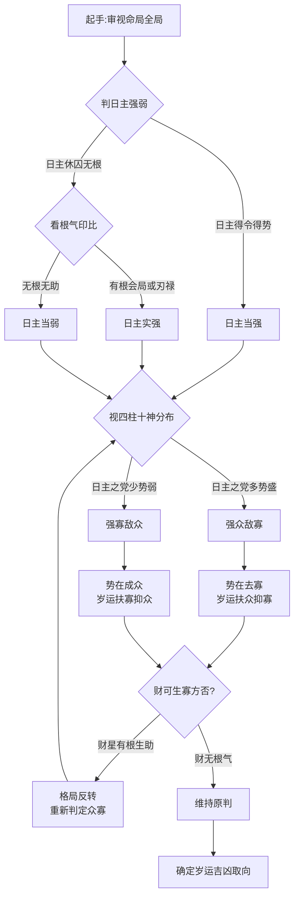

## 众寡之义：二格局之辨

> 【原文】强众而敌寡者,势在去其寡;强寡而敌众者,势在成乎众。

> 【原注】强寡而敌众者,扶弱而助寡者吉;强众而敌寡者,恶寡而助众者滞。

此篇以"众寡"二字立论，开门见山揭出命局判势的两大基本格局——非泛论日主之强弱，而专审**敌对双方**之众寡。此义须从两层理解：其一，"众"与"寡"非数量之多寡，乃气势之盛衰；其二，"敌"字最紧要——命局之中十神杂处，唯有两端对垒之势分明，众寡之义方显。所谓"敌"者，非日主与他干之单挑，乃命局中两股相互克制之气各成一党、相互对抗也。

原注紧承其义，转出岁运应对之方：若己方为寡而敌强，则岁运逢生扶寡方则吉；若己方为强而敌寡，则再去助寡则滞（壅塞不通）。盖众寡之势既明，则岁运之取舍不能与此相悖。命理所谓"扶抑"，贵在识己所处之位，不在扶某固定十神。原注"恶寡而助众者滞"一句，尤须着眼——许多命师一见官星便扶、一见日主便抑，全然不识"己方已在众位"之势，是任氏深所针砭者。

## 两端之判：日主与众寡之分

> 【任氏曰】众寡之说,强弱之意也,须分日主四柱两端而论也。

任氏疏解直指众寡之判须分两个层次：一为日主自身之众寡，二为四柱整体格局之众寡。两端常须相互印证，不可以一端否定另一端。盖日主或当令得势、或休囚无根；而四柱之中十神分布、气势流转——单看日主则失之偏颇，单看四柱又恐与日主相悖。命理之中"强""弱"二字最易误人：日主坐阳刃、逢三合会局者，表面上未必当令得时，内里却极强旺；若仅以月令定强弱，必失之于表。

## 日主极强、官星极弱：去官之正格

> 【任氏曰】如日主是火,生于寅、卯、巳、午月,官星是水,四柱无财,反有土之食伤,即使有财,财无根气,不能生官,此日主之党众,敌官星之寡,势在尽去其官,岁运宜扶众抑寡则吉。

此节铺陈日主得时得势、官星孤立无援的格局。日主之党（火土印比食伤）极众，官星之党（水）极寡——势在去官。任氏特别指出"即使有财"亦不能生官者，因财无根气，纵有亦虚。岁运若再行扶助官星之运，反成"助寡"之滞。盖原局官星既已"无根无气"，岁运再见官星亦难真有力；然气势之流注若偏向官星方，则日主之众气反被牵制，是为"助寡而滞"。

## 日主与四柱须相应：弗反背为妙

> 【任氏曰】如以四柱分众寡,则分四柱之强弱,然又要与日主符合,弗反背为妙。

四柱的众寡之判不能脱离日主独立判断。若四柱之中某方气势偏强，但与日主相悖（如日主所喜之神被克、日主所忌之神反旺），则该气势不能成事；唯有与日主同心同德、相互转化的众寡之分，方有实际意义。"反背"二字最得此中三昧——气势虽众，若与日主无情（反背日主），则该众不能为己用，反成敌国之援。

> 【任氏曰】假如水星是官星,休囚无气,土是伤官,当令得时,其势以去其官星,岁运亦宜制官为美;日主是火,亦要通根得气,则能生土,或有木而克土,则日主自能化木,转转相生,所谓日主符合者也。

此节明示"日主符合"的具体内容：日主须有根气可通、可化、可生彼之众方，使气势不断。火能生土、土能去水——四柱之中，众寡之机流转不息，全仗日主居中能化能生。所谓"日主符合"，非谓日主之强弱与四柱一致，乃谓日主能统驭四柱之气势，使各得其位。

## 寡方得助则转强：众寡之反转

> 【任氏曰】官星是水,虽不及时,却有财生助,或财星当令,或成财局,此官星虽寡,得财星扶则强,岁运宜扶寡而抑众者吉。

此为前文之转——若官星虽寡，却得财星之生，则寡方得助转强。此时整个格局的众寡关系便发生反转：原以为强众之党，可能反为被克制之寡方。岁运之扶抑亦须随之反向而行。此节看似与前节相反，实是同一原则的延伸：众寡之势本随格局之构成而流转，非一成不变。

> 【任氏曰】虽举财官而论,其余皆同此论。

任氏特别点明：以上所论虽以财官为例，十神之中其余七位（印比食伤等）皆可套用此理。盖众寡之判本是格局大势之论，非独财官然也。

## 众寡之判的程序图

此图所示，为众寡判定的总脉络。先判日主，次视四柱，再看二者是否相应，最后定岁运之扶抑。其中"财可生寡方"一节最是关键——许多命局之众寡反转，皆因财星之生助使然。

## 命造一：戊辰 乙丑 戊戌 辛酉

> 【原注】戊辰 乙丑 戊戌 辛酉。
>
> 大运：丙寅 丁卯 戊辰 己巳 庚午 辛未。
>
> 此造重重厚土,乙木无根,身旺又甚,其势足以敌官星之寡。故初交丙寅丁卯,印星得地,刑耗多端;戊辰得际遇,捐纳出仕,及已巳二十年,土生金旺,从佐二而履琴堂。至未运破金,不禄。

观此造戊土日主，生于丑月（己土当令），又有辰戌两土并透，厚土重重。乙木为戊土之正官，独透月干却无根（丑中藏己辛癸而无乙木，辰戌中亦无乙气透干），是为官星之寡。日主极强而官星极弱——正是"强众而敌寡"的典型格局。

岁运流转如下：

| 大运 | 五行倾向 | 命主境遇 | 任氏判辞 |
|------|----------|----------|----------|
| 丙寅 | 偏印得地 | 印绶过旺，加之日主已极强，反而失于失衡 | 刑耗多端 |
| 丁卯 | 正印之乡，卯中藏乙木（正官）复动 | 在"去官"格局中见官星复现，悖逆原局之势 | 刑耗多端 |
| 戊辰 | 比肩劫财之乡，厚土更旺 | 日主之众势更盛，去官之机愈畅 | 得际遇、捐纳出仕 |
| 己巳 | 己土正印、巳藏庚丙戊，巳酉半合金局 | 土生金旺，财星（辛）得助，仕途通达 | 从佐贰而履琴堂（由副职晋主官） |
| 庚午 | 庚金正财、午火丁己 | 财星得助，仍属顺境 | 续享官禄 |
| 辛未 | 辛金偏财、未中藏乙木 | 未为木之墓库，乙木入墓得库而复活，原局"去官"之势破 | 不禄 |

此造最精妙处在"未运破金"四字——未为木之墓库（按十二长生，木墓在未），原局乙木无根，似已被土众克尽；然未运一到，乙木入墓得库，官星从无到有忽然复活。原局立定的"去官"格局因墓库之开而瓦解，故命主于此运中逝。"未运破金"之"破"字有二义：一者未土刑戌、丑未戌三刑皆动，原局厚土之势因刑冲而散；二者未中藏乙（正官），官星复动而去官不成——两义相辅，方见任氏笔法之精密。

观此造，可悟众寡之势虽定于命局，亦随岁运之开库填库而流转不息。命理最忌死执格局而不顾岁运之变。

## 命造二：戊午 壬戌 丁卯 癸卯

> 【原注】戊午 壬戌 丁卯 癸卯。
>
> 大运：癸亥 甲子 乙丑 丙寅 丁卯 戊辰 己巳。
>
> 此伤官当令,印星并见,官煞虽透无根,势在去官。初年运走北方,官星得势,一事无成;丙寅丁卯,生助火土,经营发财巨万;戊辰己巳,去尽官煞,一子登科,晚景峥嵘。此造戌午拱火,日时逢印,日主旺极,莫作用印而推,亦不可作去官留杀论也。

此造丁火日主，壬癸两水官煞并透于月干时干，然卯木两重（印星）截其水之根气（水生木、木泄水，官煞之气尽被印星化去），官煞皆成虚浮无根之象。年干戊土为食神，月支戌中藏戊土辛金丁火，食伤之气暗生。午戌会火局拱火（戌午相会加强火势），日时卯木为印——日主之党（印、食伤）极众，官煞之党极寡。

任氏特别提示两禁：

- **"莫作用印而推"**——若执着用印之法（以印为用神），则谬。原局印虽多，乃日主之党，非可独立为用。
- **"亦不可作去官留杀论"**——若执著"去官留杀"之常格（专去正官而留七杀），亦谬。原局壬癸同被化去，无所谓"留杀"。

盖此造之"去官"是气势之自然，而非人为之克制。原局中印比食伤流转不息，官煞之气被自然消化（克、泄、化殆尽），故命主一生无须刻意与官煞对抗，自有化敌为友之妙。

岁运之应：

| 大运 | 五行 | 命主境遇 | 与原局去官之势关系 |
|------|------|----------|-------------------|
| 癸亥 | 七杀坐亥水之根 | 官煞之乡，水势得助 | 与"去官"之势相悖，一事无成 |
| 甲子 乙丑 | 印星之乡（子中癸水、丑中辛癸己） | 印绶并见，官星虽不被去亦被化 | 子丑运虽不见大凶，亦不见大成 |
| 丙寅 丁卯 | 东方木火 | 火为日主之比劫、木为印星，扶众抑寡之正运 | 经营发财巨万 |
| 戊辰 己巳 | 中央土火 | 食伤旺运，去尽官煞 | 一子登科，晚景峥嵘 |

此造与前造皆"去官"，然前造是命局日主专权、土众专克水寡——是为**"硬去"**；此造是命局印比食伤环转克泄、水寡自然消化——是为**"软消"**。同为"去官"而气象各异：一为刀斧之刚，一为春风之和。

## 命造三：癸丑 壬戌 丙午 庚寅

> 【原注】癸丑 壬戌 丙午 庚寅。
>
> 大运：辛酉 庚申 己未 戊午 丁巳 丙辰。
>
> 丙火生于九月,日主本不及时,第坐阳刃会火局,谓之强寡。年干癸进气,癸水通根余气丑土,克其火局,庚金生助壬癸为众也。势在成乎众,故交辛酉庚申,金生水旺,遗业丰盈,其乐自如;一交己未,火土并旺,父母双亡;及戊午十年,破败家业,妻子皆伤,至丙辰流落外方而亡。

此造最为曲折，亦最能见任氏识局之精。

丙火生于戌月（九月），秋土当令，火处休囚——表面看日主"本不及时"，理应为弱。然丙午一柱，午为丙之阳刃（帝旺之地，刃者极盛之位），又有寅午戌三合火局（年支寅、日支午、戌会聚成火局），故日主实则极强。任氏谓"谓之强寡"——此"寡"非真的弱，乃相对四柱表面时令而言"似寡"；命局实质是"强"。盖月令之休囚仅就一端而言，若四柱会局成势，则虽不当令亦可转弱为强，此即子平"从强"之法所本。

再看彼方：壬癸两水官煞并透，癸水通根于丑（丑中藏癸水余气），庚金在时干生水——金水之党看似不弱。然任氏谓"势在成乎众"，这里的"众"非指日主之党，乃指命主应当顺势扶助的一方——即金水之流通。盖原局丙火极强，自然泄出庚金（食伤生财），庚金再生壬癸（财生官），形成**丙→庚→壬癸**之自生循环。此循环若畅，则金水之"众"自得其势；若循环被切断（如火过旺而克金），则金水之"众"反被克制。

岁运之验：

| 大运 | 五行 | 与原局循环之关系 | 命主境遇 |
|------|------|------------------|----------|
| 辛酉 庚申 | 西方金地 | 金生水旺，扶助原局金水之循环 | 遗业丰盈、其乐自如 |
| 己未 | 中央土 | 火土并旺，火克金太过，金水循环断 | 父母双亡 |
| 戊午 | 火土更炽 | 丙火比肩加午火，火势燎原，金被克尽 | 破败家业、妻子皆伤 |
| 丁巳 | 火土收尾 | 火土仍旺 | 困厄愈深 |
| 丙辰 | 火土收尾 | 丙火比肩、辰为水库，水被克 | 流落外方而亡 |

观此四运，可见任氏所谓"势在成乎众"的真义：当原局日主极强时，金水之"众"乃命主自然流通之产物；岁运扶持金水则循环畅，逆金水而助火土则循环断。循环一断，日主过旺而失衡，原局所赖以成立之格局（强寡之成众）便土崩瓦解。

此造最具警示意义者——任氏于末句"至丙辰流落外方而亡"下暗藏深意：丙火比肩之乡，看似扶助日主，实则违背"成乎众"之势。盖火过旺则克金，金被克则不能生水，水（壬癸）失源则官煞之"众"全灭。命主一生之富贵皆从金水循环中来，今循环断，命亦随之而尽。

## 三造对照：众寡之三义

三造并观，恰成"众寡"之三义：

1. **戊辰一造**：日主极强、官星极弱——是"强众敌寡"之**正局**，去官为正途。此为众寡之常格。
2. **戊午一造**：日主党众、官煞虚浮——是"众寡相当而日主自然消化"之**变局**，去官于无形。此为众寡之和局。
3. **癸丑一造**：日主似弱实强、官杀有党——是"强寡敌众"之**反局**，成乎众方为吉。此为众寡之逆局。

三造之别，不在十神之配置，而在气势之流注。第一造气势专一，去寡则吉；第二造气势环转，自化则吉；第三造气势内敛（强藏于寡），成众则吉。任氏以此三造并陈，正所以示众寡之义非可执一端而观。

## 篇中位置

子平命理之精髓在审势，势者众寡之辨也。审势不明，则一切格局、喜忌、用神之论皆失其根。此篇以最简之笔揭出最要之理——以"敌对双方"立论，而非以孤立日主立论；以"扶抑之机"点岁运之应，而非以死格局点死喜忌。篇中任氏之疏解，处处扣紧"两端之分"与"弗反背"之训，将静态之命局与动态之岁运贯穿为一，使其于子平体系中，自有统摄群篇之位。盖"众寡"二字，实为命理判势之总钥——日主之强弱、十神之配置、格局之从化、岁运之流转，皆可由此二字推而广之。