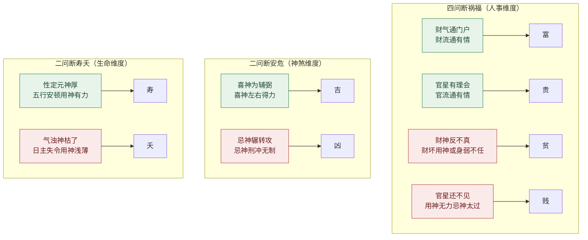

# 何知

《滴天髓》下篇以「何知」开门，并非偶然——上篇「天道」立的是看命的「眼」（三元拆解、帝载神功），到「何知」这里，眼已立好，要回答的是命中最实际的八件事：富、贵、贫、贱、吉、凶、寿、夭。这一篇相当于一份「验证清单」——把前面格局、喜忌、体用、衰旺一类的原理，落到人生八个具体维度上逐条兑付。

本篇共八段、每段一对问答。原文以「何知其人 X？Y」开篇，是设问句式，先抛出问题、再给出判据。八个判据的内在结构高度一致：先讲「得 X 的格局组合长什么样」，再讲「反之则不 X」。任氏则把每一组反例细化为多则命造，与原注互为表里。

## 财气通门户

> 【原文】何知其人富？财气通门户。

「财气通门户」是断富的总纲。「门户」原指宫位，此处引申为「财气出入的通道」——财星在命局中能进得来、出得去，生化有情、不被堵死，就叫「通」。原文用极简一句统摄，背后的判断维度却极多。

> 【原注】财旺身强，官星卫财，忌印而财能坏印，喜印而财能生官，伤官重面财神流通，财神重而伤官有限，无财而暗成财局，财露而伤亦露者，此皆财气通门户，所以富也。夫论财与论妻之法，可相通也，然有妻贤而财薄者，亦有财富有妻伤者，看刑冲会合。但财神清而身旺者妻美，财神浊而身旺者家富。

原注列出七种「财气通」的格局：财旺身强且有官护财；喜印时财能转生官星（财不坏印）；忌印时财能反克印（财去印）；伤官与财星两强相济；财藏暗成财局；财与伤官同透于天干。任氏将其归纳为「妻财同论」——但妻美与家富不必兼得，须看格局清浊：清则妻贤，浊则家富。

【异文标注】"伤官重面财神流通"，"面"字疑为"兼"字之误，备参。

> 【任氏曰】身旺财弱无官者，必要有食伤；身旺财旺无食伤者，必须有官有杀。身旺印旺食伤轻者，财星得局，身旺官衰印绶重者，财得当令，身旺劫旺，无财印而有食伤者；身弱财重，无官印而有比劫者，皆财气通门户也。财即是妻，可以通论也。若清财妻美，浊财家富，其理虽正，尚未深论之也。如身旺有印，官星泄气，四柱不见食伤得财星生官，无食伤则财星亦浅，主妻美而财薄也；身旺无印，官弱逢伤，得财星化伤生官，则亦通根，官亦得助，不特妻美，而且富厚；身旺官弱，食伤重见，财星不与官通，家虽富而妻必陋也；身旺无官，食伤有气，财星不与劫连，无印而妻财并美，有印则财旺妻伤。此四者宜细究之。

任氏把原注的笼统判据细化为四象：①身旺有印、官泄气、食伤不见，妻美财薄；②身旺无印、官弱逢伤、财化伤生官，妻美富厚；③身旺官弱、食伤重见、财不生官，富而妻陋；④身旺无官、食伤有气、财不与劫连（无印妻财并美、有印财旺妻伤）。这四象把「妻美」「家富」拆成两条独立曲线，强调二者并非因果——可能妻美财薄，可能富而妻陋，亦可能两全，关键看财气通法。任氏末句收束于：「此四者宜细究之」。

### 【命造一（原注附例）】

> 甲申 丙子 壬寅 辛亥
>
> 丁丑 戊寅 己卯 庚辰 辛巳 壬午

壬水生于仲冬，羊刃当权，年月木火无根，日支食神冲破，似乎平常。然喜日寅时亥，乃木火生地；寅亥合，则木火之气愈贯；子申会，则食神反得生扶，所谓财气通门户也。富有百余万，凡巨富之命，财星不多，只要生化有情，即是财气通门户，若财临旺地，不宜见官，日主失令，必要比劫助之，期为美也。

任氏解此造：「壬水仲冬，羊刃当权」——日主强旺可任财；「木火无根」看似虚弱，但「日寅时亥乃木火生地」，且「寅亥合木」将气贯连到木火之上。关键转折在「子申会」——本来看似「日支食神冲破」是破局，实质让食神（壬水之子水长生在申）反得生扶。末句是任氏的方法论提炼：「凡巨富之命，财星不多，只要生化有情」——「财气通」的本质不是财多，而是生化有情；同理，「日主失令，必要比劫助之」则为身弱取财之法。

### 【命造二（原注附例）】

> 壬申 丙午 癸亥 戊午
>
> 丁未 戊申 己酉 庚戌 辛亥 壬子

癸水生于仲夏，又逢午时，财官太旺。喜其日元得地，更妙年干劫坐长生，财星有气，尤羡五行无木，财水泄而火无助，壬水可用。且运走西北，金水得地，遗绪不丰，自创四五十万，一妻四妾八子。

此造身弱财旺，喜「年干壬水劫财坐长生」——比劫帮身任财。所谓「财水泄而火无助」是点睛：原局无木，则财（午火）不生官之元神，火无助而水可用。任氏顺便交代行运：西北金水运帮身，故能聚财；「一妻四妾八子」则是「财星得用」在家庭层面的自然延伸。

## 官星有理会

> 【原文】何知其人贵？官星有理会。

「官星有理会」是断贵的总纲。结构与「财气通门户」完全对仗——富是财气流通，贵是官气流通。八个维度中富与贵居首，贫贱居次，吉凶再次，寿夭殿后，呈现「先论人间事业，再论人生命运」的次第。

> 【原注】官旺身旺，印绶卫官，忌劫而官能去劫，喜印而官能生印，财神旺而官星通达，官星旺而财神有气，无官而暗成官局，官星藏而财神亦藏者，此皆官星有理会，所以贵也。夫论民与论子之法，可相通也，然有子多而无官者，身显而无子者，亦看刑冲会合。但官星清而身旺者必贵；官星浊而身旺者必多子；至于得象得气、得局、得格者，妻子富贵两全。

原注列七种「官星有会」的格局：官旺身旺、印护官；忌劫而官能去劫；喜印而官能生印；财旺官通；官藏财藏；暗成官局。任氏随后区分「官清」「官浊」——清者身旺必贵，浊者身旺必多子；得象得气得局得格者，妻子富贵两全。这一句把上段「财气通门户」的「妻财同论」延伸到「官星有理会」的「贵子同论」。

> 【任氏曰】身旺官弱，财能生官，官旺身弱，官能生印，印旺官衰，财能坏印，印衰官旺，财不现，劫重财轻，官能去劫，财星坏印，官能生印，用官，官藏财亦藏，用印，印露官亦露者，皆官星有理会，所以贵显也。如身旺官旺印亦旺，格局最清，而四柱食伤，一点不混，财星又不出现，官星之情依乎印，印之情依乎日主，只生得一个本身，所以有官无子也；纵使稍杂食伤，亦被印星所克，子亦艰难。如身旺官旺印弱，食伤暗藏，不伤官星，不受印星所克，自然贵而有子；必身旺官衰，身伤有气，有印而财有坏印，无才而暗成财局，不贵而子必富；如身旺官衰，食伤旺而无财，有子必贫；如身弱官旺，食伤旺而无印，贫而无子，或有印逢财，亦同此论。

任氏此段把原注展开为四象，对仗精严：
- ①身旺官旺印亦旺，格局最清——「有官无子」（印绶夺食伤，子息艰难）；
- ②身旺官旺印弱，食伤暗藏——「贵而有子」（食伤不伤官、不受印克）；
- ③身旺官衰，身伤有气，财坏印或暗成财局——「不贵而子必富」；
- ④身旺官衰，食伤旺无财——「有子必贫」；
- ⑤身弱官旺，食伤旺无印——「贫而无子」。

这五象把「贵」「子」「富」「贫」打成一张可逐项核对的表，等于把全篇方法论压缩在一段注文之内。末句是任氏的归纳：「或贫而无子，或有印逢财，亦同此论」。

### 【命造一（原注附例）】

> 癸卯 癸亥 丁卯 辛亥
>
> 壬戌 辛酉 庚申 己未 戊午 丁巳

此造官杀乘权，原可畏也，然喜支拱印局，巧借栽培，流通水势，官星有理会。第嫌初运庚申辛酉，生杀坏印，偃蹇功名；己未支全印局，干透食神，云程直上，仕至尚书。然有其命必得其运，如不得其运，一介寒儒矣。

丁火日主，官杀（癸水、辛金）乘权本可畏；妙在「支拱印局」——亥卯未三合木局，木为丁火之印，印化官杀之气，使官杀有情于日主。任氏特别点出行运：早运庚申辛酉「生杀坏印」困顿；中后运己未「支全印局、干透食神」直达尚书。末句「有其命必得其运，如不得其运，一介寒儒矣」是任氏全篇反复强调的方法论——命与运是乘除关系。

### 【命造二（原注附例）】

> 癸酉 丁巳 丙午 壬辰
>
> 丙辰 乙卯 甲寅 癸丑 壬子 辛亥

丙火生于孟夏，坐禄临旺，喜其巳酉拱金，财生官，官制劫，更妙时透壬水，助起官星，以成既济。三旬外运走北方水地，登科发甲，名利双辉。勿以官杀混杂为嫌也，身旺者，必要官杀混杂而发也。

「巳酉拱金」是金局暗成，「财生官、官制劫」是经典喜用结构。任氏末句「勿以官杀混杂为嫌」是一句破执之语——世俗以为「官杀混杂」为忌，任氏以本造为反证：身旺者必要官杀混杂方能激发制衡之力。

### 【命造三（原注附例）】

> 甲午 丙寅 辛酉 己丑
>
> 丁卯 戊辰 己巳 庚午 辛未 壬申

此造财临旺地，官遇长生，日主坐禄，印绶通根，天干四字，地支皆临禄旺，五行无水，清而纯粹。春金虽弱，喜其时印通根得用，庚运帮身。癸酉看登科；午运杀旺，病晦刑丧；辛运己卯年发甲入词林；后运金水帮身，仕路未可限量也。

辛金日主，「财临旺地、官遇长生、日主坐禄、印绶通根」四美俱全。任氏又分行运细论：癸酉看登科、午运杀旺遭困、辛运己卯年发甲入词林。这一例的特点在于：把行运的起伏与命局静态结构对照，写出「命好还要运好」的乘除法。

### 【命造四（原注附例）】

> 乙巳 辛巳 庚辰 甲申
>
> 庚辰 己卯 戊寅 丁丑 丙子 乙亥

庚金生于立夏前五日，土当令，火未司权，庚金之生坐实，且辰支申昌，生扶并旺，身强杀浅。嫌其财露无根逢劫，所以出身贫寒；一交丁运，官星元神发露，戊寅己卯两年，财星得地，喜用齐来，科甲联登，又入词林。书云，「以杀化权，定显露门贵客」，此之谓也。

「身强杀浅」格局中以七杀为用。任氏分行运细论：初运财露无根逢劫，出身贫寒；丁运之后官星元神发露，戊寅己卯财星得地、喜用齐来。末句引「以杀化权，定显露门贵客」为书云，是对本造「杀浅、运来扶杀」的方法论提炼。

## 财神反不真

> 【原文】何知其人贫?财贫神反不真。

「贫」与「富」相对，但断法并不直接取反。原注与任氏都强调：贫命未必是「无财」，而往往是「财多身弱」或「财坏用神」——「财神不真」是真病。

> 【原注】财神不真者，不但泄气被劫也，伤轻财重伤气泄，财轻官重财气泄，伤重印轻身弱，财重却轻身弱，皆为财神不真也。中有一味清气，则不贱。

原注「财神不真」涵盖五种情况：泄气被劫；伤轻财重伤气泄；财轻官重财气泄；伤重印轻身弱；财重劫轻身弱。末句「中有一味清气，则不贱」是关键的转化条件——格局再差，若有一味清气支撑，仍不至于下贱。这句也为下一段「贱」的断法埋下伏笔。

> 【任氏曰】财神不真者有九，如财重而食伤多者，一不真也；财轻喜食伤而印旺者，二不真也；财轻劫重，食伤不现，三不真也；财多喜劫，官星制劫，四不真也；喜印而财星坏印，五不真也；忌印而财星生官，六不真也；喜财而财合闲神而化者，七不真也；忌财而财合闲神化财者，八不真也；官杀旺而喜印，财星得局者，九不真也。此九者，财神不真之正理也，然贫者多富者少，故贫有几等之贫，富有几等之富，不可概定。有贫而贵者，有贫而正者，有贫而贱者，宜分辨之。如财轻官衰，逢食伤而见印绶者，或喜印，财星坏印，得官星解者，此贵而贫也；官杀旺而身弱，财星生助官杀，有印财一衿易得，无印则老儒冠，此清贫之格，所为皆正也，财多而心事必欲贪死，官旺而心志必求之，非合而合，不从而从，合之不化，从之不真，此等之命，见富贵而生谄容，遇财利而忘恩义，谓贫而贱也，即侥幸致富，亦不足贵也，凡败业破家之命，初看似呼佳美，非财官双美，即干支双清，非杀印相生，即财临旺地，不知财官虽可养命荣身，必先要日主旺相，主能任其财官，若太过不及，皆为不真，能散能耗则有之，终不能臻富贵也，此等格局最多，难以枚举，宜细究之。

任氏列「财神不真」九例，是对原注五类的扩展。九例的共同点是：原局某一种用神（财、官、印、食伤）看似存在，实则被克制、化泄、阻挡，不能真正发挥作用。

任氏接着把「贫」分三等：贵而贫（财轻官衰但格正）、清贫（官杀旺身弱有印）、贫而贱（合之不化、从之不真）。这一分层与原注「中有一味清气则不贱」相呼应——贵而贫与清贫都属于「有清气」，唯贫而贱是格局混浊。末段以「败业破家之命」反衬：初看似佳（财官双美、干支双清、杀印相生、财临旺地），实则「日主不旺」或「太过不及」，皆为不真。这一句对后人最具警示意味：看命不能只看表面静态的清浊美恶，必须看日主能否任财任官。

### 【命造一（原注附例）】

> 壬子 戊申 戊戌 辛酉
>
> 己酉 庚戌 辛亥 壬子 癸丑 甲寅

戊土生于孟秋，支在西方，秀气流行，格局本佳，出身大富。所嫌者，年干壬水能根会局，则财星反不真矣。兼之运走西北金水之地，所以轻财重义，耗散异常，惟戌运入泮得子。辛亥壬子贫乏不堪。

戊土日主生于申月，本是大格；「年干壬水」虽为财星，但「能根会局」——亥子会水局，财星有势而日主难任，故「财神反不真」。任氏末句「辛亥壬子贫乏不堪」是行运层面的推演：亥子运金水成势，财更不真。

### 【命造二（原注附例）】

> 癸卯 甲寅 丁巳 己酉
>
> 癸丑 壬子 辛亥 庚戌 己酉 戊申

此造财藏杀露，杀印相生，又联珠相生，似乎贵格，所以祖业二十余万；不知年干之杀无根，其菁华尽被印绶窃去，必用酉金之财。盖头覆之以土。似科有情，但木旺土虚，相火逢生，则巳酉不会，财不真矣。一交壬子，泄金生木，一败如灰；至亥支，印遇长生，竟遭饿死。

丁火日主，印（木）旺当令，杀（癸水）露无根；任氏指出「年干之杀无根，菁华尽被印绶窃去」。表面看是杀印相生、联珠相生，实则「木旺土虚」——土（财）反被木克，「巳酉不会」即财不真。末段以行运验之：壬子运泄金生木，败尽；亥支印遇长生，饿死。任氏的解法展现了「表面似贵，实则财神不真」的辨证功夫。

### 【命造三（原注附例）】

> 庚午 壬午 丙寅 庚寅
>
> 癸未 甲申 乙酉 丙戌 丁亥 戊子

此夏火逢金，财滋弱杀，两支不杂，杀刃神清，定然名利双辉。不知地支木火，不载金水，杯水车薪，不但不能制火，反泄财星之气，夏月庚金败绝，财之不真可知矣。早运癸未、甲申、乙酉土金之地，丰衣足食；一交丙戌，支全火局，刑妻克子，破耗异常，数万家业，尽付东流；丁亥合壬寅而化木，孤苦不堪而死。

丙火生于午月，刃旺而庚金（财）弱，本是「财滋弱杀」之格。任氏点出病根：地支木火不载金水，金（财）无根而泄气，故「财之不真」。初运土金帮财，家丰；丙戌运支全火局，财被彻底焚尽；丁亥运合寅化木，孤苦而死。命与运对照，财神不真的轨迹在行运中被放大。

### 【命造四（原注附例）】

> 乙卯 乙酉 庚寅 壬午
>
> 甲申 癸未 壬午 辛巳 庚辰 己卯

秋金乘令，财官并旺，食神吐秀，大象观之，富贵之命。第财星太重，官星拱局，日主反弱，不任其财官，全赖劫刃扶身，被卯冲午克，时干壬水，不能克火，反泄日元之气，财财星不真矣。初运甲申禄旺，早年入泮，其后运走南方，贫乏不堪。

庚金日主生于酉月，本是乘令之格；「财星太重、官星拱局」使日主「不任其财官」。任氏指出关键病象：「时干壬水不能克火，反泄日元之气」——壬水为食神，本可制官（火），但此处反而泄金气，使日主更弱。「财财星不真矣」中「财财」二字疑为传抄重出，备参。初运甲申禄旺帮身，中后运走南方火地克金，贫乏不堪。

### 【命造五（原注附例）】

> 辛丑 丙申 癸巳 庚申
>
> 乙未 甲午 癸巳 壬辰 辛卯 庚寅

此财星坐禄，一杀独清，似乎佳美，所嫌者，印星太重，丑土生金泄火，丙辛合而化水，以财为用，申又合巳，则财更不真。初运乙未甲午，木火并旺，祖业颇丰；一交癸巳，皆从申合，一败如灰，竟为乞丐。

癸水日主，「财星坐禄（申金）、一杀（丙火）独清」看似佳美。任氏指出三病：①印星太重（丑土）；②「丙辛合而化水」——丙火本是用神，被辛金合化为水（财化为印），财之根动摇；③「申又合巳」——巳申合水，更把火（财）合走。末句「皆从申合，一败如灰，竟为乞丐」是「财神不真」推到极致的典型结局。

### 【命造六（原注附例）】

> 庚辰 乙酉 丁丑 乙巳
>
> 丙戌 丁亥 戊子 己丑 庚寅 辛卯

丁火日元，时逢旺地，两印生身。火焰金叠，似乎富格，不知月干乙木，从庚而化，支会金局，四柱皆财，反不真矣。祖业亦丰，初运丙戌丁亥，比劫帮身，财喜如心；戊子已丑，生金晦火，财散人离，竟冻饿而死。

丁火生于丑月虽时逢旺地（巳火），但「月干乙木从庚而化」——乙庚合金，月干印星化为财星；「支会金局」——巳酉丑三合金局，四柱皆财。任氏点明：财过旺而日主不能任，故「反不真」。初运比劫帮身，财喜如心；戊子已丑运生金晦火，财散人离，冻饿而死。

## 官星还不见

> 【原文】何知其人贱？官星还不见。

「贱」是「贵」的反面，但断法不与「贵」直接对称。任氏特意提醒：「此段原注太略」——可见原注对此段的展开不足，任氏在注解中作了大量补充。「贱」与「贫」的分界在哪里？原注已透露：「中有一味浊财，则不贫」——关键在于「贫」尚有正气可言，「贱」则连人格节操也出了问题。

> 【原注】官星不见者，不但失令被伤也。身轻官重，官轻印重，财重无官，官重无印者，皆是官星不见也。中有一味浊财，则不贫；至于用神无力而忌神太过，敌而不受降，助旺欺弱，主从失宜，岁运不辅者，既贫且贱。

原注列四种「官星不见」：身轻官重、官轻印重、财重无官、官重无印。「中有一味浊财，则不贫」与前段「清气则不贱」形成对仗——一段是「清气存则不贱」，一段是「浊财存则不贫」。末段点出「贱」的真病：用神无力、忌神太过、主从失宜、岁运不辅——这是格局整体失灵的格局。任氏对此段以「清」「浊」两条线对举展开。

> 【任氏曰】此段原注太略，然富贵之中，未当无贱，贫贱之中，未当无贵，所以贱之一字，不易知也。如身弱官旺，不用印绶化之，反以伤官强制；如身弱印轻，不以官星生印，反以财星坏印；如财重身轻，不以比劫帮身，反以比劫夺财，合此格者，忘却圣贤明训，不思祖父积德，以致灾生不测，，殃及子孙。如身弱印轻，官旺无财，或身旺官弱，财星不现，合此格者，处贫困不改其节，遇富贵不易其志，非礼不行，大义不取。故知贪财改帛而恋金谷者，竟竟遭一时之显戮，乐箪瓢而甘沿履者，终受千载之令各，是以有三等官星不见之理，如官轻印重而身旺，或官重印轻而身弱，或官印两平而日主休囚者，此上等官星不见也，如官旺喜印，财星坏印，或官杀重无印，食伤强制，或官多忌财，财星得局，或喜官星，而官星合他神化伤者。或忌官星，他神合官星又化官者，此下等官星不见也。细究之，不但贵贱分明，而贤不肖亦了然矣。

任氏开篇即言「此段原注太略」，并把「贱」分为三等：上等（官轻印重身旺 / 官重印轻身弱 / 官印两平日主休囚）、中等、下等（官旺喜印财坏印 / 官杀重无印食伤强制 / 官多忌财财得局 / 喜官合他神化伤 / 忌官合官又化官）。

任氏这一段最有特色之处是同时讨论命与德：「贪财改帛而恋金谷者，竟遭一时之显戮」——「改帛」疑为「改节」之误，备参；「乐箪瓢而甘沿履者，终受千载之令各」——「令各」疑为「令名」之误，备参。两句对举，把命理与儒家德行观牢牢绑在一起：命好未必德好，贫贱未必无德。末句「细究之，不但贵贱分明，而贤不肖亦了然矣」是任氏对全段方法论的提炼——论命最终要落到人品高下。

【异文标注】"以致灾生不测，，殃及子孙"，双逗号处疑为传抄衍文，备参。
【异文标注】"贪财改帛而恋金谷者"，"改帛"疑为"改节"之误；"乐箪瓢而甘沿履者，终受千载之令各"，"令各"疑为"令名"之误，备参。

### 【命造一（原注附例）】

> 丁丑 壬子 丁亥 甲辰
>
> 辛亥 庚戌 己酉 戊申 丁未 丙午

丁火生于仲冬，干透壬水，支全亥、子、丑北方，官星旺格；辰乃湿土，不能制水，反能晦火，谓清枯之象，官星反不真也。喜其无金，气势纯清，其为人学问真确，处世无苟，训蒙度日，苦守清贫，上等官星不见也。

丁火日主生于亥月，壬水（正官）当令，支全北方，官星本是旺格。任氏却判定为「清枯之象」——官虽旺，无印化之，反使日主枯弱；「辰乃湿土，不能制水，反能晦火」——湿土不能为用，反损日主。任氏以此为「上等官星不见」：格局清寒而人正品端。

### 【命造二（原注附例）】

> 丙辰 庚寅 丙午 壬辰
>
> 辛卯 壬辰 癸巳 甲午 乙未 丙申

此造财绝无根，官又无气，兼之运走东南之地，幼年丧父，依母转嫁他姓；数年母死，牧牛度日，稍长则卖力佣工；后双目失明，不能佣作，求乞自活。

此造是任氏笔下下等「官星不见」的现实结局：财绝无根、官又无气、运走东南木火之地克泄日主——「幼年丧父、依母转嫁、牧牛度日、双目失明、求乞自活」。任氏用朴素的笔法写命，主旨并不在批判而在示警：命理到此等地步，已是人文意义上需要救济的处境。

### 【命造三（原注附例）】

> 丁卯 甲辰 辛亥 癸巳
>
> 癸卯 壬寅 辛丑 庚子 己亥 戊戌

此春金逢火，理宜印化杀，财星坏印，癸水克丁，亥水冲巳，似乎制杀有情，不知春水休囚，木火并旺，不但不能克火，反去生木泄金；财官本可荣身，而日空不能胜任，虽心专必欲求之。亦何盖哉！出身未属微贱。初习梨园，后因失音随官；人极伶俐，且极会趋逢，随任数年，发财背主，竟损纳从九品出仕，作威作福，无所不为；后因犯事革职，依然落魄。

辛金日主生于辰月，本应「印化杀」，但「财星坏印」——财坏印则杀无制，任氏用「癸水克丁、亥水冲巳」看似制杀有情，实则「春水休囚、木火并旺」，制不住反助敌。任氏用此造描述「下等官星不见」之人格：伶俐趋逢、发财背主、革职落魄——才智可用但德不配位。

## 喜神为辅弼

> 【原文】何知其人吉？喜神为辅弼。

「吉」与「凶」是一对。「吉」在命理中通常指灾祸不生、谋为顺遂；任氏的定义更精确：吉的关键不在于「无凶」，而在于「喜神得力」。

> 【原注】柱中所喜之神，左右终始，皆得其力者必吉，然大势平顺，内体坚厚，主从得宜，纵有一二忌神，适来攻击，亦不为凶，譬之国内安和，不愁外寇。

原注点出吉的两层：①喜神左右终始皆得力；②大势平顺、主从得宜，内体坚厚。「譬之国内安和，不愁外寇」一句是最生动的比喻——喜神就是国家的忠臣良将，忌神即使有，也是「外寇」级别，国内安和则不惧。

> 【任氏曰】喜神者，辅用助主之神也。凡八字先要有喜神，则用神势，一生有吉无凶，故喜神乃吉神也。若柱中有用神而无喜神，岁运不逢忌神无害，一遇忌神必凶，如戊土生于寅月，以寅中甲木为用神，忌神必是庚辛申酉之金，日主元神厚者，以壬癸亥子为喜神，则金见水而贪生，不来克木矣；日主元神薄者，以丙丁巳午为喜神，则金见水而畏，亦不来克木矣。如身弱以寅中丙火用神，喜天干透出，以水为忌神，以比动为喜神，所以用官用印有别，用官者，身旺可以财为喜神，用印身弱，而后用官为喜神，无喜神，而用神得秉令，气象雄壮，大势坚固，四柱安和，用神紧贴，不争不妒者，即遇忌神，亦不为凶。如原局无喜神，有忌神，或暗伏或出现，或与用神紧贴，或争或妒，或用神不当令，或岁运引出忌神、助起忌神，譬之国家有奸臣，私通外寇，两来夹攻，其凶立见。论土如此，余皆类推。

任氏把「喜神」定义为「辅用助主之神」——它不是用神本身，而是护住用神、扶住日主的那层。任氏给出判定步骤：
- ①看用神：戊土生于寅月，用神在甲木，忌神是庚辛申酉金；
- ②看日主厚薄：日主元神厚者，喜神在壬癸亥子（水），使金「贪生」不来克木；日主元神薄者，喜神在丙丁巳午（火），使金「畏火」不来克木；
- ③用神得令、气象雄壮、大势坚固、用神紧贴不争不妒者——即遇忌神亦不凶；
- ④若原局无喜神、有忌神、或忌神与用神紧贴——「譬之国家有奸臣，私通外寇，两来夹攻，其凶立见」。

「论土如此，余皆类推」一句是任氏反复使用的类推收束法——前面的具体分析只是一例，读者应自己推到其他五行。

### 【命造一（原注附例）】

> 甲子 丙寅 戊寅 己未
>
> 丁卯 戊辰 己巳 庚午 辛未 壬申 癸酉 甲戌

春初土虚，杀旺逢财，以丙火为用，喜其财印相隔，生生不悖；更妙未时帮身为喜，四柱纯粹，主从得宜。所以早登甲第，一生有吉无凶，仕至观察，后退归优游林下，生六子皆登科第，夫妇齐眉，寿越八旬。

戊土日主生于寅月，七杀（甲木）当令；以丙火（印）为用神，化杀生身。「财印相隔，生生不悖」是结构关键：财（壬水）虽能坏印（丙火），但中间隔着七杀（甲木），使财不能直接坏印。「未时帮身」是喜神——未土为日主之根。任氏以此造为「一生有吉无凶」的样板。

### 【命造二（原注附例）】

> 丙申 己亥 庚辰 戊寅
>
> 庚子 辛丑 壬寅 癸卯 甲辰 乙巳 丙午

此寒金喜火，得时支寅木之生，则火有焰，然有财杀，必先身旺。妙在年支坐禄，三印贴生，更妙亥水当权，申金含生忘冲。无火则土冻金寒，无木则水旺火虚，以火为用，以木为喜，木火两字，缺一不可。所以生平无凶无险，登科发甲，宦海无波，后裔济美，寿至八旬之外。

庚金日主生于亥月，金寒水旺；用神在火（火暖金），喜神在木（木生火）。任氏以八字逻辑推演：「无火则土冻金寒，无木则水旺火虚」——两味缺一不可。「以火为用、以木为喜」是任氏典型的「用喜对举」式表述，比单论用神更严密。末段以「生平无凶无险、登科发甲、宦海无波、寿至八旬之外」验证「喜神为辅弼」的论断。

## 忌神辗转攻

> 【原文】何知其人凶？忌神辗转攻。

与「吉」相对，「凶」的原注定义明确：忌神太多、刑冲并见、岁运助之、局内无备御之神，又无主从，必然刑伤破败、犯罪受难。

> 【原注】财官无气，用神无力，不过无所发达而已，亦无刑凶也。至于忌神太多，或刑或冲，岁运助之。辗转攻击，局内无备御之神，又无主从，不免刑伤破败，犯罪受难，到老不古。

原注区别两种情况：①财官无气、用神无力——只是不发达而已，不算凶；②忌神太多、刑冲并见、岁运助之、局内无备御——这才是真凶。「局内无备御之神，又无主从」一句点中病根：原局没有喜神来制约忌神，也没有主从结构来稳定全局。

> 【任氏曰】忌神者，损害体用之神也。故八字先要有喜神，则忌神无势。以忌神为病，以喜神为药，有病有则吉，有病无药则凶，一生吉少凶多者，皆忌神得势之故耳。如寅月生人，不用甲木而用戊土，则甲木为当令这忌神，看日主之意向，或喜火以化之，或用金以制之，安顿得好，又逢岁运扶喜抑忌，亦可转凶为吉；岁运又不来扶喜抑忌，又不与忌神结党者，不过终身碌碌，无所发达而已；若无火之化、金之制，又遇水之生，岁运又党助忌神，伤我喜神，辗转相攻，凶祸多端，到老不吉。论木如此，余可类推。

任氏此段把「忌神」定义为「损害体用之神」，并以医理作比：「以忌神为病，以喜神为药」——有病有药则吉，有病无药则凶。任氏给出三种处置方案：
- ①「或喜火以化之，或用金以制之」——这是原局有解的办法；
- ②「安顿得好，又逢岁运扶喜抑忌」——这是原局有解、运亦帮忙的情况，可「转凶为吉」；
- ③「无火之化、金之制，又遇水之生，岁运又党助忌神」——这是最凶的情况，「辗转相攻，凶祸多端」。

「有病有则吉，有病无药则凶」是任氏全篇最具医理色彩的归纳。

### 【命造一（原注附例）】

> 乙亥 戊寅 丙子 甲午
>
> 丁丑 丙子 乙亥 甲戌 癸酉 壬申

丙火生于寅月，印星当令，时逢刃旺，甲乙并旺透，四柱无金；寅亥化木，子水冲破，官星无用，必以月干戊土为用。忌神即是甲木，亥子之水，反生旺木，所谓忌神辗转攻也。初交丁丑，生助用神，祖业十余万，其乐自如；一交丙子，火不通根，父母双亡，连遭回禄；乙亥水木并旺，又遭回禄，克三妻四子，赴水而亡。

丙火日主生于寅月，印（木）当令，戊土（用神）在月干；甲乙并透、亥子水生木——「忌神辗转攻」。任氏以行运细论：丁丑运生助用神，祖业十余万；丙子运火不通根，父母双亡、连遭火灾；乙亥运水木并旺，克三妻四子、赴水而亡。从「祖业十余万」到「赴水而亡」，是「忌神辗转攻」三十年行运中逐渐展开的典型轨迹。

### 【命造二（原注附例）】

> 辛巳 庚寅 丙辰 己丑
>
> 己丑 戊子 丁亥 丙戌 乙酉 甲申

丙火生寅，木嫩火相，未为旺也，生丑时，窃去命主元神，以寅木为用。所嫌庚金当头之忌，木嫩逢金，火虚见泄。初交己丑戊子，生金泄火，幼丧父母，孤苦不堪；丁亥丙戌，火在西北，不能去尽忌神，所以历尽风霜，稍成家业；一交乙酉，干支皆化忌神，刑妻克子，遭水厄而亡。

丙火日主生于寅月，「木嫩火相」——日主与印星皆嫩；「庚金当头之忌」——庚金伤寅木（用神）、泄丙火（元气）。任氏分行运：初运己丑戊子生金泄火，幼丧父母；丁亥丙戌火地但仍在西北，难去尽忌神；乙酉运「干支皆化忌神」，刑妻克子、遭水厄而亡。本造与上造并观，是「忌神辗转攻」的两种典型——上造是忌神得水之生而肆虐，本造是忌神当头独透而难去。

## 性定元神厚

> 【原文】何知其人寿？性定元神厚

「寿」与「夭」是末段对照。「性定」指五行安顿不冲不战不贪不欠，「元神厚」指日主根基稳固、用神有力。

> 【原注】静者寿，柱中无冲无合，无缺无贪，则性定矣。元神存者，不特精气神气皆全之谓也，官星不绝，财神不灭，伤官有气，身弱印旺，提纲辅主，用神有力，时上生根，运无绝地，皆是元神厚处。细究之，大率甲乙寅卯之气，不遇冲战泄伤、偏旺浮泛而安顿得所者心寿。木属仁，仁者寿，每每有验，故敢施之于笔。若贫贱之人而亦能寿者，以其禀得一个身旺，或身弱而运行生地，食禄不缺故耳。

原注「静者寿」是开宗明义——五行无冲无合、无缺无贪，性情自然安定；「元神厚」则是从官、财、伤、印、身、用、时、运八个维度全面细论。「细究之，大率甲乙寅卯之气，不遇冲战泄伤、偏旺浮泛而安顿得所者心寿」一句点出原注的特殊观察：木气（仁）安顿得所者多寿——「仁者寿」是儒家命题被引入命理。「木属仁，仁者寿，每每有验」一句表面看是五行气论，实质是把命理与儒家德行观挂钩。

> 【任氏曰】仁、静、宽、德、厚，此五者，皆寿征也。四柱得地，五行停匀，所合者皆闲神，所化者皆用神，冲去者皆忌神，留存者皆喜神，无缺无陷，不偏不枯，则性定矣。性定不生贪恋之私，不做苟且之事，为人宽厚和平，仁德兼资，未有不富贵福寿者也。元神厚者，官弱逢财，财轻遇食，身旺而食伤发秀，身弱而印绶当权，所喜者皆提纲之神，所忌者皆失令之物，提纲与时支有情，行运与喜用不悖，是皆元神厚处，宜细究这。清而纯粹者，必富贵而寿；浊而混杂者，必贫贱而寿。

任氏首句「仁、静、宽、德、厚，此五者，皆寿征也」是全篇最具德行论意味的归纳。任氏把「性定」定义为：「所合者皆闲神，所化者皆用神，冲去者皆忌神，留存者皆喜神」——这是从四柱合化冲存的四个维度对「性定」作精确定义。「无缺无陷，不偏不枯」是性定的形态描述；「性定不生贪恋之私，不做苟且之事」是性定的德行延伸。

任氏在「元神厚」的论述中给出「所喜者皆提纲之神、所忌者皆失令之物」的方法论——喜神得时、忌神失令是元神厚的关键。末句「清而纯粹者，必富贵而寿；浊而混杂者，必贫贱而寿」——这一句同时回答了「寿」与「贫/富/贵/贱」的关系：清浊只影响富贵等级，不影响寿夭。

【异文标注】"心寿"，疑为「必寿」或「其寿」之误，备参。

### 【命造一（原注附例）】

> 辛丑 癸巳 甲子 丙寅
>
> 壬辰 辛卯 庚寅 己丑 戊子 丁亥 丙戌 乙酉

此从巳火起源头，生丑土，丑土生辛金，辛生癸，癸生甲，甲生丙火；甲禄居寅，癸禄居子，丙禄居巳，官坐财地，财逢食生，五行元刘皆厚，四柱通根生旺，左右上下有情，为人刚柔相济，仁德兼资，贵至三品，富有百万，子十三人，寿至百岁，无疾而终。

此造任氏用「源头」一脉推出五行相生之序：巳火生丑土、丑土生辛金、辛金生癸水、癸水生甲木、甲木生丙火。任氏末段以「贵至三品、富有百万、子十三人、寿至百岁、无疾而终」作为「性定元神厚」的人生注脚。原文「五行元刘皆厚」中「元刘」疑为「元流」之误，备参。

【异文标注】"五行元刘皆厚"，"元刘"疑为「元流」之误，备参。

### 【命造二（原注附例）】

> 己酉 乙亥 丙寅 戊子
>
> 甲戌 癸酉 壬申 辛未 庚午 己巳 戊辰

此以酉金为源头，生亥水，亥水合寅而生丙，丙火生戊土，元神皆厚。乡榜出身，仕至观察，为人宽厚端方，九子二十四孙，富有百余万，寿至百二十岁，无疾而终。

与上造同理，任氏再次以「源头—相生」的方式推出五行链。命主「宽厚端方、九子二十四孙、寿至百二十岁」是「性定元神厚」应验的又一例。

### 【命造三（原注附例）】

> 己酉 辛未 壬寅 壬寅
>
> 庚午 己巳 戊辰 丁卯 丙寅 乙丑 甲子 癸亥

此以未土为源头，生辛金，辛金生壬水，壬水生寅木，四柱生化有情，元神厚而纯粹。所喜者，火喜其包藏不露。早登科甲，仕至三品；为人品行端方，廉和仁厚；八子十九孙，寿至九旬有六。

第三例「未土生辛金、辛金生壬水、壬水生寅木」五行相生之链更短更纯。任氏末句「廉和仁厚」与首段「仁、静、宽、德、厚」五寿征中的「仁、厚」直接对应。

### 【命造四（原注附例）】

> 丁未 庚戌 庚辰 丙子
>
> 己酉 戊申 丁未 丙午 乙巳 甲辰

此以丁火为源头，生土，土生金，两藏财库，身旺用官。中年行运不背，所以早登乡榜，名利双辉。为人有刚明决断之本，无刻薄欺瞒之意。惜乎无木，火之元神不足，孙枝虽旺，子息未免多损之忧。

本造「丁火源头」一路生土生金，「身旺用官」格局清；任氏点出「中年行运不背」是富贵成就的关键，但「无木，火之元神不足」使子息有损——寿虽长而子嗣不全，是「元神厚」中的瑕疵。

### 【命造五（原注附例）】

> 乙未 戊寅 乙卯 庚辰
>
> 丁丑 丙子 乙亥 甲戌 癸酉 壬申 辛未 庚午

此支类东方，正曲直仁寿格，大势观之，财官有气，名利裕如。第五行火不出现，财之元神虚脱，寅卯东方木旺，官司星之根亦薄。所以一生操剥削，资囊未满先倾，且平生仗义疏财；为人无骄谄，存古道，苦守清贫；生四子皆得力，寿至九十四岁。

「曲直仁寿格」是子平专有格局名，专论木气成格者寿。任氏以本造为「性定」应验：人「无骄谄、存古道、仗义疏财」，虽「苦守清贫」而「寿至九十四岁」——这是「性定」大于「财官」的具体例证。

### 【命造六（原注附例）】

> 癸丑 甲寅 戊戌 庚申
>
> 癸丑 壬子 辛亥 庚戌 己酉 戊申

戊戌日逢庚申时，食神有力，杀旺无印，足以强制。生八九子，有三四子贵显而授一品之诰封者，土金有情之妙也。其为人贪恶两备者，不能化杀之故也，淫靡无礼者，火不现，水得地之故也。盖寅申冲，则丙火必坏，丑戌刑则丁火亦伤，兼之癸水透，则日主之心志必合，而求之不顾；寅戌支藏之火，暗中克尽，夫火司礼，为人岂可无礼？无礼则无所不为矣！设使年干癸水，换于丁火，未有不仁德者也。其富贵福寿，皆申时之力，亦祖德宗功所致也。后生落头疽而死，由已积恶多端，而天诛之矣。

此造原局「土金有情」本可成格，但「寅申冲、丑戌刑」使丙丁火（礼）俱伤，任氏以儒家视角论断：「火司礼，为人岂可无礼？无礼则无所不为」——命理与德行在此处合一。任氏末段以「后生落头疽而死，由已积恶多端，而天诛之矣」收束——这是全篇中极罕见的「命与德报应」的强烈论断。

### 【命造七（原注附例）】

> 戊辰 庚申 己卯 戊辰
>
> 辛酉 壬戌 癸亥 甲子 乙丑 丙寅

此土金伤官，辰中癸水，正财归库，申中壬水，正财逢生，劫虽旺，而不能夺；且土气尽归于金，伤官化劫，暗处生财，兼之独杀为权，故为人权谋异众，地支皆阴湿之气，作事诡谲多端，一生所重者财，而少仁义，至四旬无子，娶两妾又无子。寿至九旬外，异财如命，卒后家业四十余万，分夺而尽。细究之，皆因财星守于藏蓄，不得流行之故也，财不流行，秋金逢土而愈坚，生意遂绝耳，大凡财厚无子者，皆类此格，故无子之人，其性情必多鄙吝，不知财散则民聚，倘使富人无子能轻其财于亲族之中，分多润寡，何患无子哉？即如此造，金气太坚，水不露头，未得生生之妙，能散其财，则金自流行，子必招矣。然散亦有功过，散财于僧道，有过无功；散财于亲族，有功无过。修德获报，人事原可挽回；作善隆祥，天心讵难感召，寿本五福之首，寿而无子，终于无益；与其富寿而无子，不若贫寿而有子也。

此造任氏以「土金伤官、伤官化劫、暗处生财」点格局，以「权谋异众、诡谲多端、一生重财少仁义」点人格。任氏末段从命理延伸至伦常：「大凡财厚无子者，皆类此格」——以命理之常推出人伦之理：「财散则民聚」、「散财于亲族，有功无过」、「与其富寿而无子，不若贫寿而有子」。这是任氏注中最具人文关怀的论述，把命理与「五福」观（寿、富、康宁、攸好德、考终命）紧密绑合。

## 气浊神枯了

> 【原文】何知其人夭？气浊神枯了。

「气浊」与「神枯」是任氏对「夭」的两层细分。原注随后列出多种「气浊神枯」的具体形态。

> 【原注】气浊神枯之命极易看，印绶太旺，日主无着落，财杀太旺，日主无依倚，忌神与喜神杂而虞，四柱与用神反而绝，冲而不和，旺而无制，湿而滞，燥而郁，精流气泄，月悖时脱，此皆无寿之人也。

原注列「气浊神枯」十一种：印旺日主无着、财杀旺日主无倚、忌喜杂而虞、用神反绝、冲而不和、旺而无制、湿而滞、燥而郁、精流气泄、月悖时脱。这些术语需稍作疏通：「月悖时脱」指月令与时支不能相顾；「精流气泄」指日主元气因克泄而流失。末句「此皆无寿之人也」是直接定论。

> 【任氏曰】气浊神枯之命，易中之难看者，"气浊神枯"四字，可分言之，浊字作一弱字论，气浊者，日主失令，用神浅薄，忌神深重，提纲与时支不照，年支与日支不和，喜冲而不冲，忌合而反合，行运与喜用无情，反与忌神结党，虽不寿而有子。神枯者，，身弱而印绶太重，身旺而克泄全无，然重用印，而财星坏印，身弱无印，而重叠食伤，或金寒水冷而土湿，或火炎土燥而木枯者，皆夭而无子也。

任氏把「气浊」与「神枯」拆开分别下定义：
- **气浊**：日主失令、用神浅薄、忌神深重、提纲与时支不照、年支与日支不和、喜冲不冲、忌合反合、行运与喜用无情却与忌神结党——「虽不寿而有子」（气浊者有子）；
- **神枯**：身弱印重、身旺克泄全无、重用印而财坏印、身弱无印而重叠食伤、金寒水冷土湿、火炎土燥木枯——「皆夭而无子」（神枯者无子）。

这一拆解是任氏对「夭」的精细化：「夭」未必无子，「无子」也未必夭；只有「气浊神枯」俱全者才既夭且无子。

【异文标注】"神枯者，，身弱而印绶太重"，双逗号处疑为传抄衍文，备参。

### 【命造一（原注附例）】

> 乙丑 乙酉 丙辰 辛卯
>
> 甲申 癸未 壬午 辛巳 庚辰 己卯

此造三印扶身，辰酉合而不冲，四柱无水，似呼中格。第支皆湿土，晦火生金，辰及木之余气，与酉合财，木不能托根，与酉化金，则木反被其损，天干两乙，地支不载，凋可知矣，由此推之，日元虚弱，至午运，破酉卫卯，得一子；辛巳全会金局坏印，则元气大伤，会财则财极必反，夫妇双亡。

丙火日主「三印扶身」看似不弱，但任氏指出「支皆湿土、晦火生金」——辰土晦火气、酉金克木（印），使「天干两乙、地支不载」。午运破酉卫卯，得一子；辛巳运全会金局，元气大伤、夫妇双亡。任氏以「气浊神枯」一语定之：「凋可知矣」。

### 【命造二（原注附例）】

> 己丑 戊辰 辛亥 戊戌
>
> 丁卯 丙寅 乙丑 甲子 癸亥 壬戌

此重重厚土，埋藏脆嫩之金，五行无木，未得疏扬之利；一点亥水克绝，支藏甲乙，无从引助；然春土气虚，藏财可用，初运东方木地，疪荫有余；寅运得一子。乙丑运，土又通根而夭。

辛金日主被「重重厚土」埋藏——土重金埋；「五行无木」使金无疏扬之利，「一点亥水」被克绝。任氏分行运：初运东方木地庇荫，寅运得一子；乙丑运土又通根而夭——从「得子」到「夭」不过十年运。

### 【命造三（原注附例）】

> 壬寅 壬寅 甲寅 壬申
>
> 癸卯 甲辰 乙巳 丙午 丁未 戊申

春木重逢禄，支得申时，似乎时杀留清，不知木旺金缺，必要有火才佳；天于三壬，寅中丙火受克，神枯可知。至丙支，逢三壬回克，家业败尽，夭而无子。凡水木并旺无土者，最忌火运，即不伤身，刑耗异常。若俗论必用申金，两火克金之故也。如丙火克金为害，则前之乙已运，紧克申金，而且三刑，何反美乎？

甲木日主「春木重逢禄」——三寅禄地一片木海，看似「时杀（申金）留清」实则「木旺金缺，必要有火才佳」。「天于三壬」中「于」疑为「干」之误，备参。任氏以行运验之：丙支运三壬回克丙火，家业败尽、夭而无子。末段是任氏对「俗论」的反诘：「如丙火克金为害，则前之乙已运，紧克申金，而且三刑，何反美乎」——以反诘论证「俗论」之非，「神枯」之真。

【异文标注】"天于三壬"，"于"疑为「干」之误，备参。

### 【命造四（原注附例）】

> 辛丑 辛丑 癸酉 癸丑
>
> 庚子 己亥 戊戌 丁酉 丙申 乙未

此重重湿土，叠叠寒金，癸水浊而且冻，所谓阴之甚，寒之至者也。毫无生发，气浊神枯，故春人愚昧不堪，一事无成，至戊戌运，生金克水而夭。以俗论之，两干不杂，金水双清，地支三杀，杀印相生之美，定为贵格，前则春木带嫩金。斩削成大器，皆作名利两全之格也，不知夭命，皆类此格，学者宜深究之。

癸水日主「重重湿土、叠叠寒金、癸水浊而且冻」——阴寒之极，毫无生发之气。任氏以「气浊神枯」一语定之：「春人愚昧不堪、一事无成、戊戌运生金克水而夭」。末段是任氏对「俗论」的全面反驳：「以俗论之，两干不杂、金水双清、地支三杀、杀印相生之美，定为贵格」——任氏直接斥之：「不知夭命，皆类此格，学者宜深究之」。这一段是任氏反复出现的方法论姿态：命理不能只看表面清浊，须看日主能否任局。

## 命局吉凶对照图

下表把本篇八段问答的「命局—结果」对应关系压缩到一张图，便于与原文逐条对照。

---

_本篇是下篇六亲论的「门厅」之作——把前面所有关于格局、喜忌、体用、衰旺的原理汇总为八个可逐项核对的判据，命与德两条线索在这一篇中亦合而为一：命好未必德好，贫贱未必无德，寿夭判断最终要落到「性定」「仁厚」等人格层面。本篇的八对问答，本身就是一个「八字人事对应表」，每一条都需要回到具体命造中验证。_
