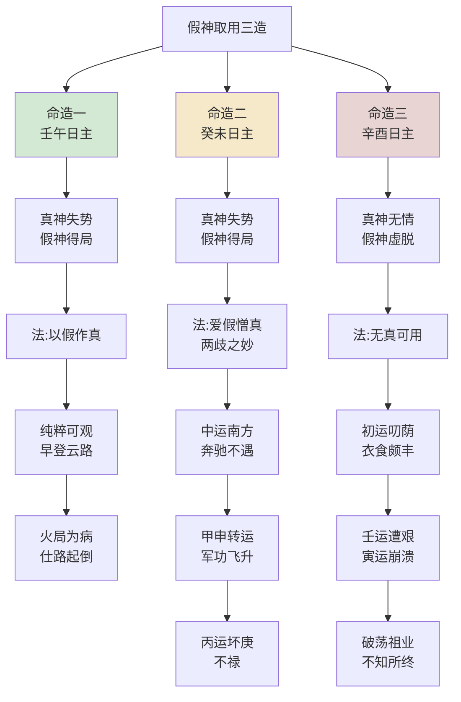

## 提纲不照

> 【原文】真假参差难辨论，不明不暗受困顿。提纲不与真神照，暗处寻真也有真。

此为全篇发端之偈，先立假神之难辨。首句"真假参差难辨论"——真假之机参差错杂，常人难以骤断；次句"不明不暗受困顿"——命主之运不明不暗，受困于疑似之间而不得解脱。三句"提纲不与真神照"——"提纲"者，月令也，乃八字之纲领、节气之所属；月令本气若与所透之真神不相契合，则真神虽具其名而不得提纲之助，是谓"不照"。末句"暗处寻真也有真"——假神之用，非全属假也，其中亦有真机可寻；盖命理之妙，不在表面之旺衰，而在隐微处察其情势。

此篇所论"假神"，非凭空杜撰之术语，乃就真神失势、提纲不照之际，从地支暗藏、岁运引动处寻求可用之神也。读者宜先明此义，然后可读下文。

## 真神得令与假神得局

> 【原注】真神得令，假神得局而党多；假神得令，真神得局而党多。不见真假之迹，或真假皆得令得助，不能辨其胜负而参差者，其人难无大祸，一生迍否而少安乐。

此段立真假辨证之大端，须先明三组术语："得令"者，得月令之气而当旺也；"得局"者，得地支之根而位正也；"党"者，同类之助力也。真神得令则力强，假神得局且党多则亦旺；二者相较，须辨其轻重缓急。

原注揭出三种情形：

其一，**真神得令而假神得局党多**——真神当令而力强，假神虽不当令但地支根深且同类相助。两相角逐，则须审其胜负之分。

其二，**假神得令而真神得局党多**——局势与上相反，假神反而借月令之势占先。

其三，**真假皆得令得助，胜负难辨**——若真神、假神均得令得助而势均力敌，"不见真假之迹"，此时最难裁断。原注断曰："其人难无大祸，一生迍否而少安乐"——盖格局混沌则行运无所适从，吉凶参半而少安稳之福。

> 【原注】寅月生人，不透木火，而透金为用神，是为提纲不照也；得己土暗邀，戊土转生，地支卯多酉冲，乙庚暗冲，运转西方，亦为有真，亦或发福。

此即"提纲不照"之实例演示。寅月藏甲木、丙火、戊土，月令本气为甲木。若命造"不透木火"，则提纲之气隐而不显；若"透金为用神"，则金来克木，月令本气（甲木）受损，是为真神失势。然金既透出为用，必有生扶之法：己土暗邀（地支中己土暗中生金）、戊土转生（天干戊土生金）、卯酉相冲、乙庚暗冲——皆"暗处寻真"之具体路径。运转西方（西方金运）金神得地，则"亦为有真，亦或发福"。原注此段正与篇首偈语"暗处寻真也有真"前后呼应。

> 【原注】以上特举真假一端言耳，其会局、合神、从化、用神衰旺、情势象格、心迹才德邪正、缓急、生死、进退之例，莫不有真假，最宜详辨之。

此段总收原注，提示读者：上述真假之辨乃就一端而言，凡命造中之会局、合神、从化、用神衰旺、格局情势，乃至人心邪正、缓急、生死、进退，皆有真假之迹可辨。换言之，"真假"非止于五行之气，亦通贯于整个命理体系之细部。此为提纲挈领之论，提醒读者不可仅执"真假"二字作机械理解。

## 以真为假与以假作真

> 【任氏曰】气有真假，真神失势，假神得局，法当以真为假，以假为真；气有先后，真气未到，假气先到，法当以真作假，以假作真。

任氏此段揭出假神取用之两大法式，皆承原注"真假得令得局"之论而深入阐发。

**第一法式：以真为假，以假为真**——此针对"真神失势，假神得局"之局。真神虽名"真"，然失势则无力可用；假神虽名"假"，然得局则有功可立。此时取用，不当泥于真假之名，当审其实际之力。所谓"以真为假"，非谓真者可废，乃谓真神既失势则权作不可用；"以假为真"，非谓假者骤升，乃谓假神既得局则权作可用。

**第二法式：以真作假，以假作真**——此针对"真气未到，假气先到"之局。一年之气有先后之序（如初春木气未盛而寒气犹存），命造亦有类似之时序：真气虽为调候所必须，然其时尚未至；假气虽非最理想之选，然已先到而可用。此与第一法式微有区别：第一法式重在"势"（得令得局之强弱），第二法式重在"时"（气之先后到与未到）。读者宜细辨之。

> 【任氏曰】如寅月生人，不透甲木而透戊土，而年月日时支，有辰戌丑未之类，亦可作用；如不透戊土，透之以金，即使木火司令，而年日时支，或得申字冲寅，或得酉丑拱金，或天干又有戊己生金，此谓真神失势，假神得局，亦可取用。

任氏紧接前段，举寅月为例细演两种情形：

其一，不透甲木而**透戊土**——戊土为甲木之财星，亦为调候所需。年月日时支有辰戌丑未（土局）相助，则戊土有根可用。此即"以真为假，以假为真"之实操：甲木虽为月令本气而属真神，然"不透"则力弱；戊土虽非提纲之气而属假神，然"透出"且有局则可用。

其二，不透戊土而**透金**——木火虽当令司令，金仍可取用，只要地支有申冲寅（冲月令之木）、酉丑拱金（会西方金气）、天干戊己生金——皆假神得局之佐证。

> 【任氏曰】若四柱真神不足，假气亦虚，而日主爱假憎真，必须岁运扶真抑假，亦可发福。

此言真假皆虚之救济法。真神本弱，假神亦不强，则须借岁运之力扶持真神、抑制假神。何谓"日主爱假憎真"？盖日主（命主自身）之气与真假之神有亲和与否之分：所爱者虽为假神，所憎者虽为真神，亦须顺日主之情而取用。此与一般"取真弃假"之论看似相反，实则透露任氏论命之圆融——**用神之美恶，不在真与假之名，而在与日主之契合与否。**

## 参芪砒霜之喻

> 【任氏曰】若岁运助真损假，凶祸立至，此谓以实投虚，以虚乘实，是犹医者知参芪之能生人，而不知参芪之能害人也，知砒霜之能杀人，而不知砒霜之能救人也。有是病而服是药则生，无是病而服是药则死。

任氏此段以医喻命，最为警策。"以实投虚，以虚乘实"——若真神本实而扶之太过，则为壅滞；若假神本虚而克之太过，则为摧折。此中分寸，最难把控。

参芪（人参、黄芪）乃大补之药，砒霜乃大毒之物。以医理观之：参芪虽补，无病而服则助火生壅；砒霜虽毒，对症而施则拔毒起沉疴。任氏借此喻明假神取用之机：**用神无绝对之吉凶，唯视其与命造之契合与否、岁运之引动与否。**

此段与上文"扶真抑假"相呼应。前言扶真抑假可发福，此言助真损假则凶祸立至——同一"扶真"之法，在不同命造、不同岁运下，吉凶迥异。此中关键，即"有是病而服是药"之"病"为何——命造之"病"即其气势之偏颇（过寒、过热、过旺、过弱），用神即对治此偏颇之药。"有是病"则"服是药"而生，"无是病"则"服是药"而死。任氏此喻，揭出子平论命之根本逻辑：**药无好坏，唯视病之有无；用神无吉凶，唯视命之所需。**

> 【任氏曰】且命之贵贱不一，邪正无常，动静之间，莫不有真假之迹。格局尚有真假，用神岂无真假乎？

此句承上启下：命之贵贱不齐，邪正无常，动静之间皆有真假之迹可察。任氏反诘："格局尚有真假，用神岂无真假乎？"——既一切格局皆可能有真假之混杂，用神之取用安得拘于一名？此一问实为整篇假神论之核心发问。

## 安享荫庇与创业兴家

> 【任氏曰】大凡安享荫庇现成之福者，真神得用居多；创业兴家，劳碌而少安逸者，假神得局者居多，或真神受伤者有之；薄承者厚创驳杂者，真神不足居多；一生起倒，世事崎岖者，假神不足居多。细究之，无不验也。

任氏此段从真神之辨转入格局类型与命运形态之对应，是为前文义理之归纳应用。共析四类命格：

**安享荫庇现成之福**：真神得用居多。真神当令得局且与日主情洽，则格局纯粹，福泽现成，无需劳碌。此种命造往往出身优渥，少年即顺。

**创业兴家，劳碌少安逸**：假神得局居多。假神虽非提纲之气，然得局有力可用；命主须借假神之力白手起家，故劳碌而少安享。或真神受伤者亦有此象——本有真神可用，惜遭克制，亦须另辟蹊径。

**薄承者厚创驳杂**：真神不足居多。真神本弱则根基不厚，所承之荫薄，而所创之业驳杂不纯。命主既无雄厚家业可继，亦难得纯粹之格局以成大业。

**一生起倒，世事崎岖**：假神不足居多。假神既失势又无局可用，命主终生起伏而无定数；吉凶互见，难成难毁。

此四种分类，并非严密之逻辑层级，而为任氏多年经验之归纳，与前文"真神失势假神得局"等理论正相印证。读者宜将此四类与下文命造三例互相参看，则义理自明。

## 命造三例：假神取用之验证

任氏于本篇附三造，一正一反一极反，皆以实例证假神取用之难。三造之差别，即为前文义理之活注解。

> 【命造一】乙酉 戊寅 壬午 庚戌
>
> 大运：丁丑 丙子 乙亥 甲戌 癸酉 壬申
>
> 【任氏案语】壬水生于立春二十二日，正当甲木真神司令，而天干土金并透，地支通根戌酉，此谓真神失势，假神得局，用以庚金化煞，法当以假作真，纯粹可观。虽嫌支全火局，克金灼水，喜其火不透干，又得戊土生化更妙。运走西北，所以早登云路，甲第蜚声，仕至封疆，有利民济物之志，禀秀德真儒之器。总嫌火局为病，仕路未免起倒耳。

此造为"以假作真"之经典实例。壬水日主生于寅月（立春后22日），甲木正当司令——甲木乃壬水之食神，亦为调候所必须，是为真神。然天干透出戊土（偏官、七杀之象）、庚金（偏印），地支午戌半合火局、酉戌通金根。甲木不透于天干，寅卯未成木局之条件亦不具备，故甲木真神失势。

反观庚金：透于时干，通根于酉戌，戊土又转生之——此假神（庚金）得局且有党。按任氏所论，"法当以假作真"，取庚金化煞（化戊土之偏官以生壬水），格局纯粹可观。

然命造亦有隐忧：地支寅午戌三合火局，火势克金灼水（克制庚金、灼伤壬水）。喜火不透干（仅藏于地支），又得戊土转泄火气而生金。运走西北（金水运），庚金得地，壬水得助，故"早登云路，甲第蜚声，仕至封疆"。然火局始终为病（中晚年或流年引动火局时），故"仕路未免起倒"——此即假神虽得局而终有隐患之显证。一造之中，发福与隐患并存，足见论命之难。

> 【命造二】庚戌 戊寅 癸未 癸丑
>
> 大运：己卯 庚辰 辛巳 壬午 癸未 甲申 乙酉 丙戌
>
> 【任氏案语】癸水生于立春二十六日，正当甲木真神司令，而天干土金并透，地支丑戌通根。正财虽当令，而官杀之势纵横，即使财敌杀，而日主反泄，况未能敌乎？庚金虽是假神，无如日主爱假憎真，用以庚金，有两歧之妙：一则化杀官之强暴，二则生我之日元，时干比肩帮身，又能润土养金。第中运南方，生杀坏印，奔驰不遇；至甲申，运转西方，用神得地，得军功飞升知县；乙酉更佳，仁至州牧；一交丙，坏庚，不禄。

此造为"日主爱假憎真"之显例，亦见"两歧之妙"。

癸水日主，生寅月（立春后26日），甲木司令为真神。然甲木不透，天干透庚（偏印）、戊（正官）、癸（比肩），地支丑戌通金土根。任氏细析其局势：

正财（戊土）虽当令，然官杀（戊土兼七杀之象）之势纵横；纵使财能敌杀（日主可借财化解官杀），然日主癸水反泄于木（甲木虽不透亦在寅中），且未必真能敌——此真神（甲木食神）失势之验。

庚金为假神，然任氏曰"日主爱假憎真"——癸水日主与庚金（偏印）情洽，与甲木（食神）反疏。取用庚金，有**两歧之妙**：

一者，**化杀官之强暴**——庚金能制戊土之官杀，使其不直接克身；
二者，**生我之日元**——庚金为癸水之偏印，能生扶日主。

时干比肩（癸水）帮身，又能润土养金（癸水润泽戊土、庚金），格局因之成立。

然运途有逆转：初运（己卯庚辰）尚平，中运（辛巳壬午癸未）南方火运，"生杀坏印"——火生土（官杀更旺）、火克金（庚金受损），故"奔驰不遇"。至甲申运，西方金地，庚金用神得地，陡然发迹，"得军功飞升知县"。乙酉运更佳，金气纯粹，"仁至州牧"。一交丙运（丙火克庚），用神被坏，"不禄"。

此造最为警策处：同一庚金用神，初运受克而困、中运受克而颠、后运得助而发、终运被克而死——**假神取用，全在岁运之扶抑。** 此即前文参芪砒霜之喻之铁证：用神之吉凶，岁运为之；非用神本身有吉凶，乃时运有顺逆。

> 【命造三】丙子 己亥 辛酉 己亥
>
> 大运：庚子 辛丑 壬寅 癸卯 甲辰 乙巳
>
> 【任氏案语】此造以俗论之，寒金喜火，金水伤官喜见官，且日主专禄，必用丙火无疑。不知水势猖狂，病窃去命主无元神，不但不能官，即或用官，而丙火全无根气，必须用己土制水，使其止水生金卫火。丙入亥宫临绝，欲使丙火生土，而丙火先受水克，焉能生土？所以己土反被水伤，真神无情，假神虚脱。初运庚子辛丑，比劫帮身，叨荫之福，衣食颇丰；壬运遭艰；一交寅运，东方木地，虚土受伤，破荡祖业，刑妻克子，出外不知所终。

此造为"真神无情，假神虚脱"之反例。前二造虽真假有别，终有假神可用；此造则真假皆虚，格局无从成立。

辛金日主，生亥月（壬水司令）。按世俗之见："寒金喜火，金水伤官喜见官"——辛金日主专禄于酉，本命金旺又见伤官（壬水），当用丙火（官星）调候兼制身，似无疑义。然任氏指出其谬：

水势猖狂——地支子亥酉亥，双亥一子，水势极盛。命造之"病"在于水旺金寒，泄气太过。"病窃去命主无元神"一句须细参——水多金沉，日主之元神（根基、精华）反被水之寒气所窃夺，此命造之根本病机也。

丙火虽透（年干），但入亥宫临绝——地支一片水乡，丙火毫无根气。所谓"欲使丙火生土，而丙火先受水克，焉能生土"——丙火自身难保，遑论生己土。

己土透于月干、时干，本可"制水生金卫火"（制壬水以止水势、生辛金以扶日主、护丙火以养调候），但己土亦被水伤（己土被水荡激），故"真神无情"——任氏此处所言之"真神"当指己土（其能从根本上制水救火），然己土自身亦虚。"假神虚脱"——丙火虽为世人所认之调候用神（假神），然无根气、被水克，形同虚设。

初运庚子辛丑，比劫（庚辛金）帮身，"叨荫之福"——此为命主承祖荫之短暂安定期。壬运（水更旺）"遭艰"——己土真神被水彻底荡尽。一交寅运（东方木地），木克土（虚己土再受伤），格局彻底崩溃："破荡祖业，刑妻克子，出外不知所终"。

任氏此造，与前二造形成强烈对照——前二造假神得局而致富贵；此造真假皆虚而致破败。**假神之法，非可执一端而通百命**，须细审真神、假神之情势强弱、得局与否、与日主之契合，方能定其取用。三造并读，则假神取用之难、之慎、之要，皆在目前矣。

### 三造格局对照

| 项目 | 命造一（壬午） | 命造二（癸未） | 命造三（辛酉） |
|------|----------------|----------------|----------------|
| 月令 | 寅（甲木司令） | 寅（甲木司令） | 亥（壬水司令） |
| 真神 | 甲木（不透，失势） | 甲木（不透，失势） | 己土（被水伤，无情） |
| 假神 | 庚金（得局，有党） | 庚金（得局，有党） | 丙火（无根，虚脱） |
| 取法 | 以假作真 | 日主爱假憎真 | 无真可用 |
| 病 | 支全火局（克金灼水） | 官杀纵横，日主反泄 | 水势猖狂，己丙皆伤 |
| 药 | 庚金化煞 + 戊土转生 | 庚金化杀生身 | ——（无药可救） |
| 大运吉 | 西北（金水运） | 甲申、乙酉（金运） | 初庚子辛丑（比劫帮身） |
| 大运凶 | 东方木火运 | 南方火运、丙运 | 壬、寅运 |
| 结果 | 甲第蜚声，仕至封疆，火局为病，起倒 | 甲申飞升，乙酉州牧，丙运不禄 | 破荡祖业，刑妻克子，不知所终 |

三造由盛转衰，恰成对照——命造一以假作真而早达，惜火局为病；命造二两歧之妙，须运程配合方显；命造三真假皆虚，纵有祖荫亦不可恃。此可见假神取用之三要：**真假之势、契合之情、岁运之扶抑**，缺一不可。

任氏此篇，于子平论命之体系内，专就"用神有真假"一端反复剖析。其义理层层递进：先立真假之辨（提纲不照），次明真假之势（得令得局），再示真假之转（以真作假、以假作真），终诫真假之戒（参芪砒霜），归结于格局与命运之对应（安享荫庇、创业兴家等四类）。三命造则为义理之实证：命造一示假神得局之可取，命造二示假神契合日主之微妙，命造三示真假皆虚之难救。三义并陈，假神之法备矣。

盖子平论命，重在用神；用神取用之难，难在真假之辨。真假非可名而定，须观其势、观其时、观其与日主之契合。所谓"假神"，非真神之敌，乃真神之辅——当真神失势，借假神之力以济日主，正所谓"暗处寻真"也。任氏此篇，示后学以活法，其旨深矣。