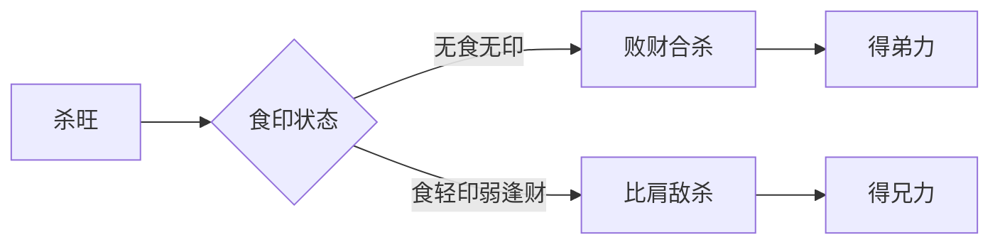

## 兄弟立名

开篇拈"兄弟谁废与谁兴"作问，把"兄弟之数与命主之关系"立为全篇所论之核心。次句"提用财神看重轻"立论断之关键——提纲（月中主气）、用神、财神三者较其轻重。短短十四字，先立题、次立纲，是论命通论体开篇之常格。

"兄弟"在子平体系中并非泛指血缘手足，而是有着严格的五行映射：败财（劫财）、比肩、羊刃三者，皆为同我者，性质虽异（在原注中三者并称兄弟），实则代表争夺、分享、助力的多重关系。

## 较量轻重

> 【原注】败财比肩羊刃,皆兄弟也。要在提纲之神,与财神喜神较其重轻,财官弱,三者显其攘夺之迹,兄弟必强。

原注开宗明义定义：败财、比肩、羊刃皆为兄弟之属。三者皆是与日主同类的力量——比肩为同五行之平等者，劫财（败财）为异阴阳之同类，羊刃为同五行之极旺者。但"兄弟"在此并非温情之血缘隐喻，而是从命主角度所见的同类势力——它们对日主而言既是帮手也是分财者、是助力也是牵制。

判断之准在于"较量轻重"——即提纲之神（通常为月令主气）与财神、喜神三者之间的力量对比。"较量"二字最得命理精髓：它强调的是动态的、相对的力量比较，而非孤立的旺衰判断。

> 财官弱,三者显其攘夺之迹,兄弟必强。

"攘夺"二字极形象——本义为抢夺、侵夺。这里特指兄弟（比劫）势力过旺、财官被克制时，比劫就会"显出抢夺的痕迹"。所谓兄弟"必强"，并非兄弟本身能力强，而是指兄弟数量多、影响命主深重。

## 比劫之格

> 【原注】财官旺,三者出其助主之功,兄弟必美;身与财官平,而三者伏而不出,兄弟必贵;比肩重而伤官财杀亦旺者,兄弟必富。身弱而帮者不显,有印而兄弟必多;身旺而三者又显,无官而兄弟必衰。

原注继而铺陈兄弟之诸般格局——"必强、必美、必贵、必富"四格，与"必多""必衰"形成完整对照：

| 格局 | 命局条件 | 兄弟之象 |
|------|----------|----------|
| 兄弟必强 | 财官弱，比劫显其攘夺 | 兄弟众多而牵制命主 |
| 兄弟必美 | 财官旺，比劫助主 | 兄弟优秀且能助力 |
| 兄弟必贵 | 身与财官平，比劫伏藏 | 兄弟谦退而反主贵显 |
| 兄弟必富 | 比肩重而伤官财杀亦旺 | 兄弟各有发泄，各展所长 |
| 兄弟必多 | 身弱而帮者不显，仍有印 | 反需比劫依靠，兄弟数量多 |
| 兄弟必衰 | 身旺比劫显，无官约束 | 同类相残，兄弟倾轧 |

观此诸格，皆围绕一个核心：**比劫与财官、印绶之间的力量配比，决定了兄弟究竟是助力还是牵制**。"必强"与"必衰"看似相反，实则都源于比劫失序——前者失之于财官过弱，后者失之于官杀全无。一为无力制劫而劫夺，一为同类过旺而无官约束，二者皆兄弟倾轧之象。

## 杀印连环

> 【任氏曰】比肩为兄,败财为弟,禄刃亦同此论。如杀旺无食,杀重无印,得败财合杀,必得弟力;杀旺食轻,印弱逢财,得比肩敌杀,必得兄力。

任氏阐发从最细微处入手——先区分比肩为兄、败财为弟、禄刃亦同此论。原注未作此分，任氏的细化补足了这一层：论命实务中，兄与弟的力量、性质往往有别——比肩为同阴阳之助力、败财为异阴阳之争夺，禄刃则为同五行之极旺。三者虽并称兄弟，作用机制各别。

接下来任氏展开了多重连环关系的推演：

**败财合杀，得弟力**：杀旺无食（食神制杀无效）、杀重无印（印化杀无力），此时若得败财合杀——即败财与七杀形成某种合局，反主得力于弟。任氏的逻辑是：杀本为克身之物，劫财本为分财之物，当二者结合反成制杀之用时，弟之力反能助命主化解危机。

**比肩敌杀，得兄力**：杀旺食轻（食神弱不能制杀）、印弱逢财（财破印而印不能化杀），此时得比肩敌杀——即比肩分杀之力以减轻命主的负担。比肩为同阴阳之同类，与异阴阳之杀相敌，正合阴阳相敌之理，故主得力于兄。

这两条是从"杀"的角度切入——兄弟在杀旺时的不同应对路径，可示意如下：

> 财轻劫重,印绶制伤,不免司马之忧;财官失势,劫刃肆逞,周公之虑。

任氏连用两典，把命理中的兄弟争夺拉到了历史事件的厚度上："司马之忧"借指手足相失、家庭失睦之情状；"周公之虑"用《史记·鲁周公世家》典——周公辅成王，其兄弟管叔、蔡叔等作乱，周公东征三年方平，借指兄弟之间权位争夺。

财轻劫重而印绶制伤（印绶克制伤官，伤官本是泄秀生财的渠道），结果是兄弟无情；财官失势而劫刃肆逞，是兄弟之间的彻底倾轧。

> 财生杀党,比劫帮身,大被可以同眠;

"大被同眠"用《后汉书·光武帝纪》典——光武帝与兄伯升、仲升等共被而眠，形容兄弟友爱。任氏以"大被同眠"对应"财生杀党，比劫帮身"——杀党本为克身，但比劫帮身则化敌为友，兄弟反能共济。

> 杀重无印,主衰伤伏,桑梓料能无兴叹。

"桑梓"借指故乡。杀重无印、主衰伤伏，是命主既无化解之力、又受克伐太过的格局。任氏说"料能无兴叹"——这是以问句形式加重感叹：如此命局，桑梓之间，兄弟离散、家道衰落，是可预料的。

> 杀旺印伏,比肩无气,弟虽敬而兄必衰;官旺印轻,财星得气,兄虽爱而弟无成。

这两句是任氏的精细辨析——兄弟之间的关系并非整齐划一。"弟虽敬而兄必衰"：弟因年幼常怀敬兄之心，但兄本身已衰，难以为弟之依靠。"兄虽爱而弟无成"：兄虽爱弟，但弟因财星得气（财生官而官克身），弟本身亦受克制，难以自立。

> 日主虽衰,印旺月提,兄弟成群;身旺逢枭,劫重无官,独自主持,

"日主虽衰，印旺月提"：印为生身之物，印旺则身反得助，故兄弟成群——这是从反面论证"身弱有印，兄弟必多"的另一种表达。"身旺逢枭，劫重无官"：枭（偏印）夺食，劫（败财）重无官制，则兄弟之间难以合作，命主只能独自主持。

> 财轻劫重,食伤化劫,可无斗粟尺布之谣;财轻遇劫,官得明显,不作煮豆燃萁之咏。

"斗粟尺布"用《史记·淮南衡山列传》典——汉文帝弟淮南王刘长谋反被流放，途中绝食而死，作《淮南王歌》"一尺布，尚可缝；一斗粟，尚可舂；兄弟二人不相容"，后世以"斗粟尺布"喻兄弟不和。"煮豆燃萁"用曹植《七步诗》典——"煮豆燃豆萁，豆在釜中泣"，喻兄弟相残。

任氏在这两条中给出了化解之法：财轻劫重，若食伤化劫（食伤泄秀之气能转化劫财的争夺之性），则可免兄弟不和；财轻遇劫，若官得明显（官星能制劫），则可免兄弟相残。这是任氏在原注基础上的重要补充——他不仅诊断问题，更给出解决方案。

> 枭比重逢,财轻杀伏,未免折翎之悲啼;主衰有印,财星逢劫,反许棠棣之竞秀。

"折翎"喻兄弟折损——枭（偏印）夺食，比劫重重，财轻杀伏，命主本身缺乏化解之力，兄弟必有折损。"棠棣竞秀"用《诗经·小雅·常棣》典——"常棣之华，鄂不韡韡，凡今之人，莫如兄弟"，喻兄弟竞相优秀。

主衰有印（印星扶身）、财星逢劫（虽有劫财但有印化），这种配置下反主兄弟各有成就——任氏以"棠棣"对应"竞秀"，把兄弟和睦而优秀的格局诗意化了。

## 日主爱憎

> 不论提纲之喜忌,全凭日主之爱憎,审察宜精,断之可也。

任氏最后的总结极为精要——"不论提纲之喜忌，全凭日主之爱憎"。这一句方法论意味极浓：

传统论命常以月令（提纲）为枢纽——月令是天地之气的中聚，最为关键。但任氏在此明确指出：**判断兄弟兴衰，不能机械地看提纲是喜是忌，而要看日主本身的喜忌**——日主爱什么、忌什么、能否驾驭什么，这才是根本。

"日主之爱憎"是一个拟人化的表述，实指日主与各类十神的生克关系——日主喜欢的十神（对身弱者为印星、比劫、食伤；对身旺者为财官）能助力，反之则成牵制。提纲虽是天地主气，但日主才是命局的主体，"爱憎"从主体发出，因此论命必以日主为本。

"审察宜精，断之可也"——这是任氏对读者的告诫：兄弟之断，关系复杂、变化多端，必须精细审察，方能下断。

## 两造印证

> 丁亥 壬寅 丙子 丁酉
> 大运:辛丑 庚子 己亥 戊戌 丁酉 丙申
> 丙火生于春初,谓相火有焰,不作旺论。月干壬水通根,亥子杀旺无制,喜其丁壬寅亥合而化印,以化为恩。时支财星,生官坏印,以化为恩。又得丁火盖头,使其不能克木,所以同胞七人,皆就书香,而且兄爱弟敬。

> 癸巳 戊午 丙午 庚寅
> 大运:丁巳 丙辰 乙卯 甲寅 癸丑 壬子
> 此造羊刃当权,又逢生旺,更可嫌者,戊癸合而化火,财为众劫所夺,兄弟六人,皆不成器,遭累不堪。余造年月日皆同,换一壬辰时,弱杀不能相制,亦有六弟,得力者早亡,其余皆不肖,以致拖累破家。总之劫刃太旺,财官无气,兄弟反少,纵有,不如无也。

此两造并列对照，一吉一凶，恰是"日主爱憎"之注脚：

| 项目 | 第一造（丁壬化印） | 第二造（戊癸化火） |
|------|-------------------|-------------------|
| 八字 | 丁亥 壬寅 丙子 丁酉 | 癸巳 戊午 丙午 庚寅 |
| 丙火状态 | 春初不作旺论 | 羊刃当权，三火相连极旺 |
| 合化 | 丁壬寅亥合而化印 | 戊癸合而化火（合后增火势） |
| 兄弟数 | 同胞七人 | 兄弟六人 |
| 兄弟之质 | 皆就书香，兄爱弟敬 | 皆不成器，遭累不堪 |
| 关键差异 | 合化转杀为印，兄弟助力 | 合化后劫刃更旺，兄弟拖累 |

观此两造，同为丙火，前造因合化而转杀为印，兄弟成群且和睦；后造因合化而财星被夺（戊癸合化火，戊土反被火焚，财星被劫），兄弟虽多而尽成拖累。这正是"日主之爱憎"的具体体现——前造日主得印为爱，后造日主遇劫为忌。

第一造之精妙处在于"丁壬寅亥合而化印"——丁（时干）壬（月干）合，寅（月支）亥（年支）合，两组合局化木为印。任氏合化之学的精深运用：原本杀旺无制的格局，因合化而转杀为印，化为生身之物，故称"以化为恩"。时支酉金为财星，财星本可生官（杀）坏印——但时干丁火盖头（丁火在酉金之上），丁壬之合已化，酉金之财不能直接克木（印）。所以"同胞七人，皆就书香"，且"兄爱弟敬"——这是兄弟和睦的典型。

此造印证了任氏所言"杀旺无食，杀重无印，得败财合杀，必得弟力"——此造中丁壬合化，正是合杀的运用，而丁火（劫财之同类）起到了关键作用。

第二造中，丙火生于午月，羊刃当权（丙火以午为羊刃，即日主临帝旺之地），又逢生旺——巳、午、午三火相连，火势极旺。更忌者，戊癸合而化火——戊（时干偏财）癸（年干七杀）合，原本癸水可制火，但合化后反成火势，财星（戊土）反被劫夺。"兄弟六人，皆不成器，遭累不堪"——劫刃太旺，财官无气，兄弟反少（这里"少"指兄弟不成器、不能助力，反而成为拖累）。任氏还补充了同一八字的另造——换壬辰时，弱杀不能制刃，亦有六弟，但得力者早亡、其余不肖，最终拖累破家。

## 篇中所寄

兄弟一系，在子平格局中虽非主导用神，却是论命中不可忽视的一环——它关系日主的助力来源、家庭牵绊、事业分担，乃至心性之孤寂与热闹。本篇以"提用财神"为枢纽，将兄弟（比劫）与财官的较量作为主线，揭示了一个核心命题：**兄弟的兴衰美恶，并非孤立存在，而是命局整体力量配比的外显**。

任氏继承原注而更进一层——他不仅给出判断标准，更通过命造实证、典故化用、合化精研，将兄弟之论推向了方法论的高度。末句"不论提纲之喜忌，全凭日主之爱憎"，是任氏论命学的重要主张——以日主为主位、视全局为配伍，这一原则在前文杀印比劫连环之推演中已处处可见。

至此，本篇所论已非单纯的兄弟数与兄弟质，而是命理中"主体与同类"关系的根本探讨——同类之间是相济还是相夺，取决于整个格局的成与败。