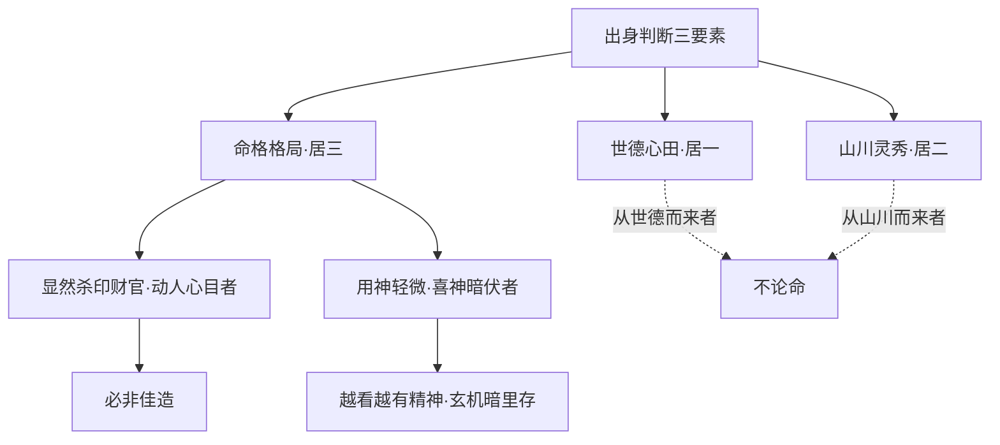
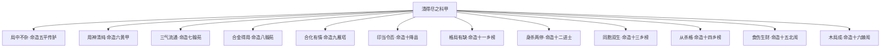
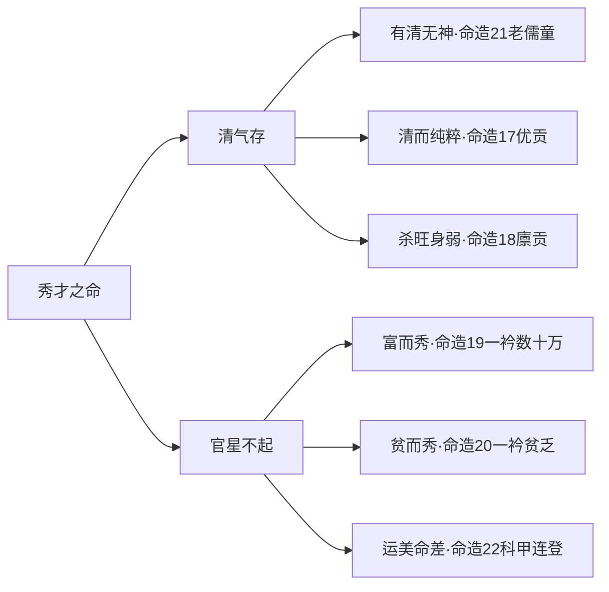
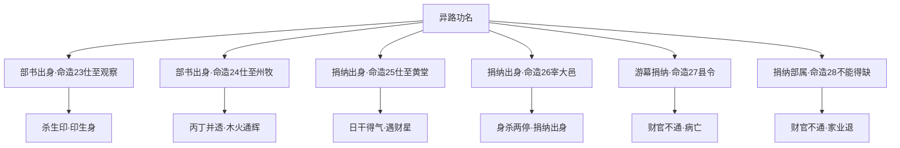

# 出身

## 出身之难

> 【原文】巍巍科第迈迈伦，一个玄机暗里存。

首句「**巍巍科第迈迈伦**」以对仗开篇——「巍巍」状科第之盛，「迈迈伦」（按：原书作「迈迈伦」，按文意当为「迈等伦」或「迈凡伦」之形近讹误，意为「超出常人」）谓超出常人。两句以「科第」与「人」对举，把命理学的关切从抽象的命盘拉到具体的功名判断。**「一个玄机暗里存」**一句是全篇的总纲——**「一个」**二字是眼目，强调的是格局中「只有一个」玄机（即隐秘的关键之点）；**「暗里存」**则点出这种玄机不是显摆于外的，而是藏在支中、藏在地支所藏的人元里。

> 【原注】凡看命看人之出身最难，如状元出身，格局清奇迥异，若隐若露，奇而难决者，必有元机，须搜寻之。

> 【异文标注】原书【原注】中作「**元机**」，与本篇【原文】中作「**玄机**」为不同用字。按：本篇为清任铁樵注本，清代避康熙帝「玄烨」名讳，常以「元」代「玄」；但本篇【原文】作「玄机」未避讳，可知**【原注】「元机」为避讳改字**之产物。此处保留原文「元机」「玄机」两种写法，客观陈列异文。

原注第一句**「凡看命看人之出身最难」**直接立下全篇的难度定位——论命诸事中，**看「出身」最难**。为何难？原注接着说：「**如状元出身，格局清奇迥异，若隐若露，奇而难决者，必有元机，须搜寻之。**」——**「若隐若露」「奇而难决」**是「难」的具体内容：状元格局往往是**「清奇迥异」**的，这种格局一眼看上去既不浑浊也不清晰，**若隐若露**之间，命理师必须去「**搜寻**」那一个玄机。**「搜寻」**二字极为关键——它不是看表面，而是要往下挖、往里找、往支中所藏的细微之处去找。

> 【任氏曰】命论我人出身最难，故有玄机存焉。玄机者，不特格局清奇迥异，用神真假之分，须究支中藏神司命，包罗用神喜神，使闲神忌神不能争战，反有生拱之情。又有格局本无出色处，而名冠群英者，必先究其世德之美恶，次论山川之灵秀，所以锺灵毓秀。从世德而来者，不论命也。故世德心田居一，山川居二，命格居三。然看命这要，非杀印财官官印双清为美也。

任氏把「玄机」二字从泛指推到具体的**操作对象**——**「支中藏神司命」**。**「支中」**是地支，「**藏神**」是地支所藏的天干，「**司命**」是主管命局的关键。任氏说玄机不只在格局的表面清奇、用神的真假之辨，**必须究到支中所藏的天干**——这就把「玄机」的具体所在定位到了地支藏干这一层。

接下来任氏立下**出身判断的三要素**及其优先级：

1. **「世德心田居一」**——祖上阴德、本人心地是第一位的；
2. **「山川居二」**——出生或所处地域的山川灵秀之气是第二位的；
3. **「命格居三」**——命局格局是第三位的。

**「从世德而来者，不论命也」**——这一句是任氏**最有分量的论断**：一个人的出身若完全从世德而来（祖上积德），则命格再好、再差也论不出——**命理学的解释力在此止步**。这是任氏给命理学设的**边界**——命可推算者，命理之范围；命所不及者，世德与山川。

> 【任氏曰】如显然杀印财官，动人心目者，必非佳造；若用神轻微，喜神暗伏，秀也深藏者，初看并无好处，越看越有精神，其中必有玄机，宜仔细搜寻。

任氏的论断有反直觉的锋芒——**「显然杀印财官，动人心目者，必非佳造」**。表面看，杀印财官俱透是很强的格局，任氏却说「**必非佳造**」——**真正有玄机的佳造，恰恰是用神轻微、喜神暗伏、初看无好处的那种**。这一句把「出身」判断的最关键心法点破：**真正的玄机不显山露水**。命理师看命，若一眼看上去完美无缺，往往是「浊气未尽清」；反而是初看不起眼、越看越有味道的命局，藏着那个「**一个玄机**」。

## 玄机暗里存

> 【任氏曰】如显然杀印财官，动人心目者，必非佳造；若用神轻微，喜神暗伏，秀也深藏者，初看并无好处，越看越有精神，其中必有玄机，宜仔细搜寻。

> **【命造一（任氏注）】壬辰 壬寅 己未 戊辰**
> 大运：癸卯、甲辰、乙巳、丙午、丁未、戊申
> 任氏断：「己土生于孟春，官当令，天干覆以财星，生官有情，然春初己土湿而且寒，年月壬水，通根峰库，喜其寅中丙火司令为用，伏而逢生，所谓'玄机暗里存'也。至丙运，元神发露，戊辰年比助时干，克去壬水，则丙火不受克，大魁天下。以俗论之，官星不透，财轻劫生，谓平常命也。」

> 【异文标注】原书「通根峰库」一语，按文意当为「通根库」（按：「峰」疑为「库」之形近衍文或版刻错字）。「以俗论之」一语按上下文意当为「以俗论之」或「以俗眼论之」。此处仅作客观标注。

己日主，孟春（寅月）**木旺当令**（按：木克土为官杀，**寅中甲木为七杀、丙火为偏印**），**天干覆以财星**（按：壬水为财——按十神：**己土克水为财**，壬水为正财），**生官有情**（按：财生官为用，**财旺生官**）。任氏说「**春初己土湿而且寒**」——按：己土在初春尚有余寒，**湿寒之土**需火暖之。**「年月壬水，通根库」**——按：壬水在年干、月干双透，辰为水库（按：辰为水土之余气所在），壬水得辰库之生。**「喜其寅中丙火司令为用」**——按：寅中藏甲木、丙火、戊土，**丙火为偏印**（按：木生火，丙火为偏印），**司令为用**——按：寅月之丙火为孟春司令之火（按：寅月甲木司令，丙火为中气，**司令为用**指用神在司令之火）。**「伏而逢生」**——按：丙火藏于寅中（伏），逢壬水之财星反生（按：水生木、木生火，**财官印连续相生**）。

本造的**玄机**在哪里？任氏说**初看时「官星不透，财轻劫生，谓平常命也」**——按：戊己土为比劫（按：戊土为劫财、己土为比肩——按严判：己土与戊土同土，**戊为劫财、己为比肩**），壬水财星被戊己土所克（按：土克水为比劫克财），**财轻劫生**——表面看是平常命。但任氏的**眼目在「寅中丙火」**——丙火藏于地支寅中，作为偏印可以化杀（按：木生火为印化官杀），又得壬水财生（按：财生官、官生印、印生身的循环）。**「伏而逢生」**四字是本造玄机的核心——丙火藏于寅中是「伏」，壬水财星通过甲木官杀生丙火是「逢生」。**这种「伏而逢生」的结构正是「玄机暗里存」的标准范式**。

任氏说「**至丙运，元神发露，戊辰年比助时干，克去壬水，则丙火不受克，大魁天下**」——按：丙运（按：大运丙午，丙火透出），**元神发露**（按：寅中丙火原神透出大运天干），**戊辰年**——按：戊土为劫财（按：阳土为劫财）、辰为水库，**比助时干**（按：戊土助原局时干戊土），**克去壬水**（按：戊土克壬水——按：土克水为比劫克财），**则丙火不受克**（按：壬水为忌被克去，丙火印星不受克而能化杀生身），**大魁天下**（按：大魁即状元及第）。

> **【命造二（任氏注）】壬戌 甲辰 甲戌 丙寅**
> 大运：乙巳、丙午、丁未、戊申、己酉、庚戌
> 任氏断：「甲木生于季春，木有余气，又得比禄之助，时干丙火独透，通辉纯粹。年干壬水，坐下燥土之制，又逢比肩之泄，辗转相生，则丙火更得其势。至戊运，戌之元神透出制壬，两冠群英，三元及第。其仁路未能显秩者，运走西方金地，泄土生水之故也。」

> 【异文标注】原书「其仁路未能显秩」一语按文意当为「其仕路未能显秩」（按：「仁」疑为「仕」之形近讹误）。「两冠群英」一语按上下文意当为「两冠群英」或「两占群英」（按：「冠」字无误，「冠」即高出、占据之意）。此处仅作客观标注。

甲日主，辰月**木有余气**（按：辰为春末，**木气尚存**），**比禄之助**（按：比肩为甲之同类——按：甲木比肩为甲木，禄为寅——按：原局时支寅为甲之禄），时干**丙火独透**（按：丙火为食神——按：甲木生火，**丙为食神**）。任氏说「**通辉纯粹**」——按：本造**食神独透**（按：丙火食神，泄秀生辉），格局清透纯粹。**「年干壬水」**——按：壬水为**正印**（按：壬水生甲木为印），**「坐下燥土之制」**——按：壬水坐下戌土（按：戌为燥土，克水），壬水被戌中戊土所制（按：土克水——按：戊土克壬水），**「又逢比肩之泄」**——按：甲木比肩之土泄壬水（按：甲木克土——按：甲戊相克——按：甲木克戊土为财——按：此句当理解为「壬水被比肩（甲木）所克、又被土所制」之综合表达）。**「辗转相生，则丙火更得其势」**——按：水生木、木生火（按：壬水生甲木、甲木生丙火），**食神得印星之生**（按：印在源头、食神在末流，相生有情），**丙火之势更壮**。

本造**玄机**在何处？任氏说**「丙火独透，通辉纯粹」**——这是表面可见的格局。但更深的玄机在「**壬水被制**」与「**丙火更得其势**」——壬水为印虽为喜（按：印生身），但**壬水过旺则泄日主之气**（按：水太多则木被漂），故**坐下燥土制壬**是关键；丙火为食神虽泄日主，但**丙火通根（按：丙火得时干独透，又有寅中甲木生之）**、**印星生食神**（按：壬水生甲木生丙火）形成**「印护食、食泄秀」**的清纯结构。

任氏说「**至戊运，戌之元神透出制壬**」——按：戊运（按：戊土大运），**戌之元神**（按：戌中戊土元神），**透出制壬**（按：戊土透出制壬水——按：阳土克阳水为劫财克印）；**「两冠群英，三元及第」**——按：乡试解元、会试会元、殿试状元合称「三元」，**「三元及第」**即三次考试皆为第一。本造是**三元及第之贵造**。**「其仕路未能显秩者，运走西方金地」**——按：己酉、庚戌运（按：西方金地），金旺克木（按：金克木为官杀），故「**泄土生水**」（按：金泄土、金生水——按：此句当指**金运助金生水、克身太过**），故**仕路不能显达**。

> **【命造三（任氏注）】甲寅 丁丑 丁卯 庚戌**
> 大运：戊寅、己卯、庚辰、辛巳、壬午、癸未
> 任氏断：「丁火生于季冬，局中儿子绶叠叠，弱中变旺，足以用财。庚金虚露，本无出色，喜其丑内藏辛为用，亦是玄机暗里存也。丑乃日元之秀气，能引比肩来生，又得卯戌合，而丑土不伤，所以身居鼎右，探花及第。」

> 【异文标注】原书「局中儿子绶叠叠」一语按文意当为「局中印绶叠叠」或「局中儿字绶叠叠」（按：「儿子绶」疑为「印绶」之形近讹误或排版错位，按本造甲寅丁丑丁卯庚戌，**甲木为偏印、丁火为比肩、丑中辛金为正财、卯中乙木为正印**，印绶确实叠叠——甲木、丑中辛金之印/财？按：丑中辛金为财不是印，**印绶当指甲木、丑中癸水**——按严判：**丁火日主，甲木为偏印、丑中辛金为正财、卯中乙木为正印、庚金为正官**，**印绶为甲乙木**——原书「儿子绶」当为「印绶」之误，「儿」与「印」形近讹）。此处仅作客观标注。

丁日主，**季冬**（丑月）**土旺**（按：丑为冬土，**寒土**），**印绶叠叠**（按：甲木偏印、卯中乙木正印，**印绶甚多**），**弱中变旺**（按：丁火虽弱冬，但印绶叠叠生身，**由弱变旺**）。任氏说「**足以用财**」——按：丁火克金为财（按：**庚金为正官、辛金为正财**），印旺身旺足以用财（按：身旺方能任财）。**「庚金虚露」**——按：庚金透时干，**本无出色**（按：庚金为正官虽透，但虚浮无根——按：庚金坐下戌土，戌中有辛金余气，但**虚露**指无强根）；**「喜其丑内藏辛为用」**——按：丑中藏辛金（按：丑中藏己土、辛金、癸水），**辛金为正财**（按：丁火克金，辛为正财）——**「亦是玄机暗里存也」**。

本造的**玄机**在**「丑内藏辛」**——表面看是庚金虚露（按：庚金为正官），无出色处；但**丑中藏辛金**才是真正的用神（按：辛金为正财，**身旺用财**）。**「丑乃日元之秀气」**——按：丑为日主的偏印库（按：丁火生土为食伤，丑为食神之库；按：丑中藏癸水为正官之根——按：癸水克丁火为七杀），**「能引比肩来生」**——按：丑土能引丁火比肩来生（按：丁火生土为食伤，土为食伤——按：丑土为食伤，能引比肩来生——按：此句按文意当理解为**「丑中辛金引比肩来生」**，**比肩为同类**——按：丁火比肩为丁火、劫财为丙火，**丙火能助丁火**，**比肩生食伤、食伤生财**为流通之象）。**「又得卯戌合，而丑土不伤」**——按：卯戌合火（按：卯戌六合化火——按：卯戌合有合火之说），**丑土不被卯戌合所伤**（按：卯戌合不伤丑土，**丑土独立存留**）。

任氏说「**身居鼎右，探花及第**」——按：探花为殿试第三名，**「身居鼎右」**指位居三鼎甲之右（按：状元、榜眼、探花合称三鼎甲，探花居第三）。本造是**探花及第**之贵造。

> **【命造四（任氏注）】丁亥 壬子 庚子 辛巳**
> 大运：辛亥、庚戌、己酉、戊申、丁未、丙午
> 任氏断：「庚金生于仲冬，伤官太旺，过于泄气，用神在土，不在火也。柱中之火，不过取其暖局耳。四柱无土，取巳中藏戊，不旺克火，火能生土，亦是玄机暗里存也。至戊运丙辰年，火土相生，巳中元神并发，亦居鼎右。」

> 【异文标注】原书「不旺克火」一语按上下文意当为「不旺、克火」或「不旺于克火」（按：原书似漏句读或脱字）。「火能生土」一语按上下文意当为「火能生土」或「火不克土」。此处仅作客观标注。

庚日主，仲冬（子月）**水旺**（按：亥子皆水），**伤官太旺**（按：壬水为伤官——按：庚金生水为食伤，**壬为食神、癸为伤官**——按：壬为阳水，**庚生壬为食神**；按严判本造**丁火为正官、壬水为食神**，**子中癸水为伤官**），**过于泄气**（按：金生水为食伤泄金气）。任氏说「**用神在土，不在火也**」——按：本造水旺金泄，需土止水（按：土克水为财，**戊己土为正偏财**），故**用神在土**。**「柱中之火，不过取其暖局耳」**——按：巳中藏丙火（按：巳中丙火为偏官），**火之用不在制金而在暖局**（按：冬金寒，需火暖——按：调候之需）。**「四柱无土，取巳中藏戊」**——按：四柱天干地支明处无戊己土，**巳中藏戊土**（按：巳中藏丙火、庚金、戊土），**戊土为偏财**（按：按十神：庚金克木为财——按：戊土与庚金——按：土生金为印——按：戊土为正印，**按：戊土为阳土生阳金为偏印、己土为正印**——按严判：**戊为偏印、己为正印**。本造四柱无明土，**用神在戊土（偏印）**——按：任氏说「用神在土」指戊己土——按：本造「用神在土」是任氏的大判断，下面具体说到戊土——按：**用神在戊土偏印**，是**印化杀生身**的思路）。

本造的**玄机**在**「巳中藏戊」**——表面看四柱无土（按：原局明处无戊己土），**但巳中藏戊土**是暗藏的用神。**「不旺、克火，火能生土」**——按：巳中戊土虽不旺（按：巳中戊土为中气，余气不旺），但**克火生土**——按：戊土克巳中丙火（按：火生土——按：火生戊土是泄，不是克——按：戊土与丙火，**土泄火之气**），**火生土**为火土相生之象，**戊土得火之生**。

任氏说「**至戊运丙辰年，火土相生，巳中元神并发，亦居鼎右**」——按：戊运（按：戊土大运），**丙辰年**（按：丙火为偏官、辰为湿土），**火土相生**（按：丙火生戊土，**官印相生**），**巳中元神并发**（按：巳中丙火、戊土元神并发），**「亦居鼎右」**——按：亦为三鼎甲之列（按：本造与前造同属玄机暗里存之科甲贵造，故云「亦」）。

本节四造——**壬辰造（状元）、壬戌造（三元及第）、甲寅造（探花）、丁亥造（鼎甲）**——共同特征是**「玄机藏于支中所藏的人元」**：第一造玄机在寅中丙火（按：偏印），第二造玄机在戌中戊土（按：食神之根），第三造玄机在丑中辛金（按：正财），第四造玄机在巳中戊土（按：偏印）。**任氏反复强调：玄机不在表面显露的格局，而在「支中藏神司命」**。这一节是全篇的**总论基础**。

## 清得尽时黄榜客

> 【原文】清得尽时黄榜客，虽存浊气亦中式。

第二句转入**「清得尽」**之论。「**清得尽**」与「**浊气**」对举——「清」是命局清纯无杂，「浊」是命局混杂忌神。任氏的论断极有分寸：**「清得尽者」是科甲客，「虽存浊气而清气成一个体段者」亦可发达**。这是说——**纯粹的清固然是科甲之命；即便有浊气，只要清气能成一个独立的体段（按：体段即格局中自成一段清纯之气），也可中式**。

> 【原注】天下之命，未有不清而发科甲者，清得尽者，非必一一成象，虽五行尽出，而能安放得所，生化有情，不混亲神忌客，决发科甲。即有一二浊气，而清气或成一个体段，亦可发达。

> 【任氏曰】清得尽者，非一行成，两气双肖也。虽五尽出。而清气独逢生旺，或真神得用，或清所陆海空椹者，横榜标名也。

> 【异文标注】原书「非一行成，两气双肖也」一语按文意当为「非一行成，乃两气双肖也」（按：原书疑脱「乃」字）。「或清所陆海空椹者」一语按文意当为「或清气所钟、海空实椹者」或「或清气独钟、根实深椹者」（按：原书此句疑为「陆海空椹」四字讹误之杂糅，语义不清）。「横榜标名」一语按文意当为「**黄榜标名**」或「**横占榜名**」（按：原书「横」疑为「黄」之音近讹误，**「黄榜」即科举榜**）。此处仅作客观标注。

任氏把「**清得尽**」的具体含义分列出来——**「两气双肖」**（按：两气即两种五行之气都清纯，双肖即两者皆佳），**「清气独逢生旺」**（按：清气所在的五行得月令、得地），**「真神得用」**（按：用神是真神而非闲神），**「清气所钟、根实深椹」**（按：钟即聚集，椹即稳固——按：「根实深椹」意为根基深稳）。**这四条是「清得尽」的具体内容**。

> 【任氏曰】若清当权，闲神忌客不司令，不深藏，和岁运制化者，亦发科甲也。清所当权，虽有浊气，安放得所，不銸喜用乾，虽不能发甲，亦发科也。清敢虽不当，得亲神忌客不党浊气，匡扶清气，或岁运安顿者，亦可中式也。

> 【异文标注】原书「不銸喜用乾」一语按文意当为「不碍喜用神」或「不坏喜用神」（按：原书此句语义不清，疑为「不坏喜用」之形近讹误）。「清敢虽不当」一语按文意当为「清气虽不当」或「清气虽不当权」（按：「敢」疑为「气」之形近讹误）。「得亲神忌客不党浊气」一语按文意当为「得清神忌客不党浊气」（按：「亲神」疑为「清神」之形近讹误）。「匡扶清气」一语按上下文意当为「匡扶清气」或「匡扶清气」（按：「匡扶」即扶正、保护）。此处仅作客观标注。

任氏接着立下**「清得尽」与「存浊气亦中式」**的三种实操情形：

1. **「清当权，闲神忌客不司令、不深藏，和岁运制化者」**——按：清气当权（按：清气所在五行得月令、得势），**闲神忌客不司令**（按：忌神不当令、不在关键位置），**不深藏**（按：忌神不深藏则不暗害格局），**和岁运制化**（按：大运太岁可以制化忌神）——**发科甲**。
2. **「清当权，虽有浊气，安放得所，不碍喜用神」**——按：清气当权，**浊气虽有但安放得所**（按：浊气被安排在不能为害的位置），**不碍喜用神**（按：不损伤喜神用神）——**虽不能发甲，亦发科**。
3. **「清气虽不当，得清神忌客不党浊气，匡扶清气」**——按：清气虽不当权（按：失月令），**但清神（即喜神）忌客不党浊气**（按：忌神不与浊气结党），**匡扶清气**（按：扶正清纯之气）——**亦可中式**。

这三种情形把**「清得尽」与「存浊气」**的辩证关系讲清楚了——**「清」是必要条件，「尽」则不是**。**真正的科甲命，不要求绝对纯净（无浊气），只要求清气能成一个独立体段**。

> **【命造五（任氏注）】戊辰 乙卯 己卯 丙辰**
> 大运：丙辰、丁巳、戊午、己未、庚申、辛酉
> 任氏断：「平传胪造，己土生于卯月，杀旺提纲，乙木元透露，支类东方，时干内火生旺，局中不杂金水，清得尽者也。若一见金，不但不能克木，而金自伤，触其旺神，徒与不和，为不尽也。」

> 【异文标注】原书「乙木元透露」一语按文意当为「乙木元神透露」或「乙木元透露」（按：「元」字无误，「元」即本元、主气）。「时干内火生旺」一语按文意当为「时干丙火生旺」（按：「内」疑为「丙」之形近讹误）。「平传胪造」一语按文意当为「**平传胪造**」或「**传胪造**」（按：「传胪」即殿试传名，**传胪**为清代殿试第四名之称）。此处仅作客观标注。

己日主，卯月**木旺提纲**（按：卯为木旺之地，**甲乙木为官杀**），**乙木透露**（按：乙木为七杀——按严判：**己土日主，甲木为偏官（七杀）、乙木为正官**，本造乙木透月干为**正官**——按：乙木克己土——按：木克土为官杀，**乙为正官**）。**「支类东方」**——按：辰虽为东南之土，但卯卯并出，**地支类东方木**。**「时干丙火生旺」**——按：丙火为**正印**（按：火生土，丙为偏印、**丁为正印**——按严判：**丙为偏印、丁为正印**，本造丙火当为**偏印**），**印星生旺**（按：火土相生）。**「局中不杂金水」**——按：金为财（按：金克木不克土——按：金为土之财——按严判：土克水为财，**金为印**——按：金生土为印，**金为印**），**水为官杀**（按：水被土克——按：土克水为财——按严判：**土克水为财、水克火为官**——按：日主己土，**水为财**）。本造**地支辰卯卯辰**无金水（按：辰中有水之库——按：辰为水库，**辰中藏水**），**天干戊乙己丙**亦无金水（按：戊己土、乙木、丙火皆非金水），故「**局中不杂金水**」。

任氏说「**若一见金，不但不能克木，而金自伤，触其旺神，徒与不和，为不尽也**」——按：金在此造中若出现，**金克木为官杀**（按：金克木为财——按：金克乙木为**财**——按严判：**金为日主之印**——按：日主己土，**金生土为印**），**金克乙木为财克官**（按：印克官？——按：金克乙木，**金为印去克官**，**印克官为不纯**）。本造**「清得尽」**的玄机在**「局中不杂金水」**——**只要保持清纯，一见金水反而坏事**。任氏说**「金自伤，触其旺神」**——按：金去克乙木（按：木为旺神），**金反被木所伤**（按：金克木，但木旺金弱则金受伤），**「徒与不和」**——按：金与木不和，金与局不和，**「为不尽」**。

> **【命造六（任氏注）】癸未 己未 庚子 甲申**
> 大运：戊午、丁巳、丙辰、乙卯、甲寅、癸丑
> 任氏断：「庚金生于未月，燥土本难生金，喜其坐下子水，年透元神，谓三伏生寒，润土养金。虽然土旺水衰，妙在申时拱子，有泄土生水扶身之美，更妙火不显露，清得尽也。初交戊午丁巳丙运，生土逼水，功名蹭蹬，家业破耗；辰运支全水局，举于乡；交乙卯制去己未之土，登黄甲，入词林，又掌文柄，仕路显赫。」

> 【异文标注】原书「年透元神」一语按文意当为「年透癸水元神」或「年干癸水元神透露」（按：原书漏具体十神名）。「申时拱子」一语按文意当为「申时生子」（按：「拱」字在此处语义不明，按命理「申子半合水局」之说，**「拱」当为「会」或「合」之讹**）。「举于乡」一语按文意当为「**举于乡**」或「**中于乡**」（按：乡试考中称「举于乡」）。「登黄甲」一语按文意当为「**登黄甲**」或「**登甲**」（按：黄甲即进士榜，**黄甲**为中式之代称）。「入词林」一语按文意当为「入翰林」（按：词林即翰林院别称）。此处仅作客观标注。

庚日主，未月**燥土**（按：未为火土之余气，**燥土**），**「本难生金」**——按：未中藏己土、丁火、乙木（按：未中己土、丁火、乙木），**火土燥而不生金**（按：未中火气重，土燥不生金）。**「喜其坐下子水」**——按：庚日主坐下子水（按：子中癸水为伤官——按：庚金生水为食伤，**壬为食神、癸为伤官**），**「年透元神」**——按：年干癸水为伤官（按：癸与庚同阴金——按：阴金生阴水为**伤官**），**「谓三伏生寒」**——按：未月为三伏天（按：未月正当大暑至立秋之间，属三伏），**「三伏生寒」**形容子水在未月的调候之用（按：未月之燥热得子水之寒润），**「润土养金」**——按：子水润未土（按：水润土不克），**养庚金**（按：金生水、水润金，金得养）。**「土旺水衰」**——按：四柱未未两土，**土旺**；**子水**虽得癸水年干之助，但**水衰**（按：未月水休囚）。**「妙在申时拱子」**——按：申时（按：时支申），**申子半合水局**（按：申子辰三合水局，本造缺辰但申子半合亦有力），**「有泄土生水扶身之美」**——按：申金生水（按：金生水，**申中庚金生壬癸水**），水扶庚金（按：水泄金之气，但**食伤泄秀**之象）。

任氏说「**更妙火不显露**」——按：本造**火不显露**（按：未中藏丁火但天干不透，**火不现**），**「清得尽也」**——**这是「清得尽」的关键**：火是克金的（按：火克金为官杀），**火不显露则官杀不显**，**清纯**。

任氏论运：**「初交戊午丁巳丙运」**——按：戊土（按：阳土为劫财）、午火（按：火克金为官杀）、丁火（按：阴火为正官）、巳火（按：火克金），**「生土逼水」**（按：火生土、土克水，**金之食伤被土所克**），**「功名蹭蹬，家业破耗」**——按：运不助用神，**水之调候被土所克**，故**事业不顺**。**「辰运支全水局」**——按：辰运（按：辰为湿土水库），**申子辰三合水局**（按：原局申子已半合，再逢辰则三合水局全），**水得力**（按：用神水得力），**「举于乡」**（按：考中举人）。**「交乙卯制去己未之土」**——按：乙运（按：乙木为正官——按：木克土为官，**乙为正官**），**卯运**（按：卯为乙木禄地，**木旺**），**「制去己未之土」**——按：木克土（按：官克身？但此造日主庚金需要木来制土——按：木为官星，**官克身太过**——按：本造日主庚金身旺，需木为财——按严判：庚日主**木为财**——按：金克木为财，**甲为偏财、乙为正财**），**「制去己未之土」**——按：木克己未之土，**土为食伤**（按：土生金——按：己未土生金为印——按严判：**己未土生庚金为印**，**木克土为财克印**），**「登黄甲，入翰林，又掌文柄」**——按：考中进士、入翰林、掌文衡。本造是「**清得尽**」的代表造——**火不显露、用神在金水**、**运走金水则吉、运走火土则凶**。

> **【命造七（任氏注）】癸未 癸亥 甲午 丁卯**
> 大运：壬戌、辛酉、庚申、己未、戊午、丁巳
> 任氏断：「甲木生于亥月，癸水并透，其势泛滥。冬木喜火，最喜卯时，不特丁火通根，抑且日主临旺，又会木局，泄木生火扶身；更妙无金，清得尽矣。至己未运，制其癸水，丙辰流年，捷南宫，入翰苑，官居清要。」

> 【异文标注】原书「捷南宫」一语按文意当为「**捷南宫**」（按：南宫即尚书省，亦指进士考试——按：南宫为礼部之别称，**捷南宫**即考中进士）。「入翰苑」一语按文意当为「入翰林院」或「入翰苑」（按：翰苑即翰林院）。「官居清要」一语按文意当为「官居清要」（按：清要即清贵显要之职）。此处仅作客观标注。

甲日主，亥月**水旺**（按：亥为水之地，**壬癸水旺**），**癸水并透**（按：年干、月干皆癸水——按：癸为阴水，**甲日主，壬水为正印、癸水为偏印**），**「其势泛滥」**——按：癸水两透、亥水当令，**水势泛滥**（按：水多木漂）。**「冬木喜火」**——按：冬木（亥月）需火暖之（按：调候之需，**火为调候用神**）。**「最喜卯时」**——按：卯为日主之禄（按：甲禄在寅、卯为甲之帝旺——按严判：甲禄在寅，**卯为乙木之禄**——按：甲木帝旺在卯），**「丁火通根」**——按：丁火为**伤官**（按：甲木生火，**丙为食神、丁为伤官**），**卯中藏乙木**（按：卯中乙木为劫财）。**「日主临旺」**——按：日主甲木得卯时之禄旺（按：卯为甲之旺地）。**「又会木局」**——按：亥卯未三合木局（按：亥卯未三合木局本造**亥、未、卯三支俱在**——按：亥卯未全三合木局），**木局成立**。

任氏说「**泄木生火扶身**」——按：木生火（按：食伤生火），火生土（按：火生土，**扶身**指**火暖木身**），**水生木**（按：水生木，**印生身**）——**水木火流通有情**。**「更妙无金」**——按：金克木为财，**本造无金**则**金不克木**（按：财不坏印），**「清得尽矣」**。

任氏说「**至己未运，制其癸水，丙辰流年，捷南宫**」——按：己未运（按：己未土为正印，**土克水**——按：己未土克癸水，**制去癸水之泛滥**），**丙辰年**（按：丙火为食神、辰为湿土晦火——按：辰为水库，**水之库**——按：丙火为喜用），**「捷南宫，入翰苑」**（按：考中进士、入翰林院）。本造是**「清得尽」**的代表造——**水木火三气流通无阻、无金克木、运走土运制水**。

> **【命造八（任氏注）】壬辰 己酉 癸卯 己卯**
> 大运：庚戌、辛亥、壬子、癸丑、甲寅、乙卯
> 任氏断：「癸卯日元，食神太重，不但日元泄气，而且制杀太过。喜其秋水通源，独印得用，更妙辰酉合而化金，金气愈坚，局中全无火气，清得尽矣。所以登云路，名高翰苑。惜中运逢木，仕路恐不能显秩。」

> 【异文标注】原书「独印得用」一语按文意当为「独以印得用」或「独印绶得用」（按：原书疑脱「以」字或「绶」字）。「秋水通源」一语按文意当为「秋金通源」或「金水通源」（按：酉月为秋金，**酉金生癸水为印**）。「辰酉合而化金」一语按文意当为「辰酉合金」（按：辰酉六合，**合金**）。「登云路」一语按文意当为「**登云路**」或「**步青云**」（按：「云路」即登科之喻）。此处仅作客观标注。

癸日主，卯月**木旺**（按：卯为木旺之地），**「食神太重」**——按：卯中乙木为**食神**（按：癸水生木，**甲为食神、乙为伤官**——按严判：癸水生乙木为伤官——按：甲为食神、乙为伤官——按：癸日主，**甲为食神**——按严判：**甲为偏印？**——按正确十神：癸水生木，**甲为食神、乙为伤官**），**「不但日元泄气，而且制杀太过」**——按：食伤生财制官杀（按：木克土为财——按严判：**木克土不生金**——按：金克木为财——按：癸水日主，**木为食伤**、**火为财**、**土为官杀**、**金为印**），**「制杀太过」**——按：食伤制官杀（按：木克土为食伤克官——按：卯木克辰中戊土为食伤制杀）。**「喜其秋水通源」**——按：酉月为秋（按：酉月金旺），**金生水**（按：酉金生癸水为印），**印得力**（按：金为印，**印可化杀**）。**「独印得用」**——按：金印为用（按：独以金印为用神——按：酉中辛金为正印、辰中癸水为劫财——按：酉金为印得令得用）。**「更妙辰酉合而化金，金气愈坚」**——按：辰酉六合（按：辰酉合可化金），**「局中全无火气」**——按：火为财（按：火被金克——按：火为癸水之财），**「全无火气」则**金不被火克（按：金清不被克），**「清得尽矣」**。

任氏说「**所以登云路，名高翰苑。惜中运逢木，仕路恐不能显秩**」——按：甲寅、乙卯运（按：木运，**木泄水、木克土**），**印星被木所克**（按：木克土不克金——按：木为食伤不克金——按：金为印，**木不克金**——按：木为食伤可以泄水——按：木运泄水太过，**日元受伤**），故「**仕路不能显秩**」。

> **【命造九（任氏注）】己亥 甲戌 庚子 丙子**
> 大运：癸酉、壬申、辛未、庚午、己巳、戊辰
> 任氏断：「庚金生于戌月，地支两子一亥，干透丙火，克泄交加。喜其印旺月提，虽嫌甲木生火克土，得甲己合而化，清得尽也。至己巳流年，印星有助，冲去亥水，甲木长生，名题雁塔。」

> 【异文标注】原书「得甲己合而化」一语按文意当为「得甲己合而化土」或「甲己合化土」（按：甲己合可化土）。「甲木长生」一语按文意当为「甲木长生在亥」之表述（按：传统说法「甲木长生在亥」），或当为「甲木得长生」之意。此处仅作客观标注。

庚日主，戌月**土旺**（按：戌为火土之余），**「地支两子一亥」**——按：亥子皆水，**水势盛**，**「干透丙火」**——按：丙火为**偏官（七杀）**（按：火克金，**丙为偏官**），**「克泄交加」**——按：丙火克庚金（按：官杀克身）、水泄庚金（按：金生水为食伤泄身），**克泄交加则身弱**（按：庚金被克被泄，身弱）。**「喜其印旺月提」**——按：戌月土旺（按：戊己土生金为印，**土为印**），**印旺**（按：戌中戊土为偏印、丁火为正官、辛金为劫财——按：戌中藏辛金为劫财、戊土为偏印）。**「虽嫌甲木生火克土」**——按：甲木为**偏财**（按：金克木为财，**甲为偏财**），**甲木生丙火**（按：木生火助官杀），**甲木克戊土**（按：木克土克印），**「得甲己合而化」**——按：甲己合化土（按：己土为正印——按：戊为偏印、己为正印——按严判：戊为偏印、己为正印），**「合而化土」**——按：甲己合化土，**土印得力**（按：木被合化为土，土生金，**印来护身**）。

任氏说「**清得尽也**」——按：本造**水木火土**四气虽有，但**甲己合化土**、**土生金**、**金生子水**（按：食伤生财），**五行流转有情**，**克泄交加**被化解（按：丙火被甲木生、甲木被己土合、金生水、土生金，**循环有情**）。**「至己巳流年，印星有助」**——按：己巳年（按：己土为正印、巳火藏丙火戊土庚金——按：己土印星透出），**「印星有助」**（按：印星得力），**「冲去亥水」**——按：巳亥冲（按：巳亥相冲），**「甲木长生」**——按：甲木长生在亥（按：亥被冲去，**甲木失长生**——按：原书或当理解为「**甲木得长生**」——按：亥被冲，**甲木之根被拔**），**「名题雁塔」**——按：雁塔即大雁塔，在长安（按：唐代进士及第后题名于大雁塔），**「名题雁塔」**即考中进士。本造是**「清得尽」**的典型造——**甲己合化土**是关键之玄机（按：甲己合化使**木不生火、木不克土**，**清纯**）。

> **【命造十（任氏注）】己亥 丙子 庚子 辛巳**
> 大运：乙亥、甲戌、癸酉、壬申、辛未、庚午
> 任氏断：「庚金生于仲冬，地支两子一亥，干透丙火，克泄并见。喜其己土透露，泄火生金，五行无木，清得尽也。至己巳年，印星得助，名高翰苑，所不足者，印不当令，又己土遥列而虚，故降任知县。」

> 【异文标注】原书「己土遥列而虚」一语按文意当为「己土遥列而虚透」或「己土遥隔而虚」（按：「遥列」指天干遥列、隔位之象）。「降任知县」一语按文意当为「降任知县」或「降为知县」（按：原书「降任」即降级任命）。此处仅作客观标注。

庚日主，仲冬（子月）**水旺**（按：亥子两子一亥，**水势盛**），**「克泄并见」**——按：丙火克庚金（按：火克金为官杀）、水泄庚金（按：金生水为食伤），**克泄交加**。**「喜其己土透露」**——按：己土为**正印**（按：土生金为印，**戊为偏印、己为正印**），**「泄火生金」**——按：土泄火之气（按：火生土）、土生金（按：土生金），**印可化杀生身**。**「五行无木」**——按：无木则**金不被克**（按：木不克土——按：木不克金——按：木不克金故金不被克，**金清纯**），**「清得尽也」**。

任氏说「**至己巳年，印星得助**」——按：己巳年（按：己土为正印、巳火为偏官，**印星得助**），**「名高翰苑」**——按：考中进士、入翰林院。**「所不足者，印不当令」**——按：己土印星在子月**不当令**（按：子月水旺土衰），**「己土遥列而虚」**——按：己土虽透年干（按：年干己土），**「遥列」**指离日主较远（按：年干离日主三位），**「虚」**指**根气不足**（按：己土坐下亥水，**水克火不克土——按：水克火不克土——按：水来克火不克土——按：己土坐下亥水，**水被火土所克则己土有根、水被火土克制则己土有力**——按本造**己土坐下亥水被丙火、己土所制**，**己土有根**——按：但子月水旺，**己土在子月为休囚**，故**「遥列而虚」**），**「故降任知县」**——按：虽考中进士但仕途不顺。

本造与**命造九**类似——都是**「清得尽」**的科甲之命，但因**印星是否当令**而有**「名高翰苑」与「降任知县」**的差别。任氏通过这两造的对比，**把「清得尽」与「得用神之力」的关系点透**：**清得尽是基础，得用神之力是落实**。

> **【命造十一（任氏注）】丙申 壬辰 丙子 壬辰**
> 大运：癸巳、甲午、乙未、丙申、丁酉、戊戌
> 任氏断：「丙火生于季春，两杀并透，支会杀局，喜其辰土当令制杀，辰中木有余气而生身，病在申金，无此尽美，所以天资过人。丁卯年合杀，而印星得地，中乡榜，辛未年去其子水，木火皆得余气，春闱亦捷。究竟申金为嫌，不得大用归班；更嫉运走西方，以酒争为事也。」

> 【异文标注】原书「支会杀局」一语按文意当为「支会水局」或「支会杀局」（按：本造壬辰壬辰两透七杀，子辰半合水局，**「杀局」**指七杀成局）。「更嫉运走西方」一语按文意当为「更嫌运走西方」（按：「嫉」疑为「嫌」之形近讹误）。「以酒争为事」一语按文意当为「以酒争为事」或「以酒事争闹」（按：原书「酒争」或为「酒政」「酒事」之形近讹误，**以酒滋事**之义）。此处仅作客观标注。

丙日主，季春（辰月）**土旺**（按：辰为湿土，**木之余气**），**「两杀并透」**——按：壬水两透（按：月干壬水、时干壬水），**壬水为七杀**（按：按十神：丙火克金不克水——按：克我者为官、水克火——按：丙火为日主，**壬水克丙火为七杀**），**「支会杀局」**——按：子辰半合水局（按：申子辰三合水局，**本造申、子、辰俱在**——按：申子辰三合水局全），**「杀局成立」**。**「喜其辰土当令制杀」**——按：辰为土（按：辰为湿土），**土克水**（按：土克水为财，**辰中戊土可制壬水**），**「辰中木有余气而生身」**——按：辰中藏乙木（按：乙木为正印——按：木生火，**乙为正印**），**木生火**（按：印生身）。

任氏说「**病在申金，无此尽美**」——按：申金为**正财**（按：火克金为财，**庚为偏财、辛为正财**——按严判：**庚为偏财、辛为正财**，申中藏庚金为**偏财**），**财破印**（按：财克印，**申金克辰中乙木**——按严判：申金与乙木，**金克木为财克印**），**「无此尽美」**——按：有申金则**不纯净**（按：申金财星克辰中乙木印星，**印被克则不纯**），**「所以天资过人」**——按：虽不「尽美」但**「天资过人」**（按：聪明但格局不全）。

任氏说「**丁卯年合杀，而印星得地，中乡榜**」——按：丁卯年（按：丁火为劫财、卯为乙木之禄——按：卯中乙木为正印），**「合杀」**（按：丁壬合木——按：丁火与壬水合木，**杀被合**），**「印星得地」**（按：卯中乙木为正印，**印星在地**），**「中乡榜」**（按：考中举人）。**「辛未年去其子水」**——按：辛未年（按：辛金为正财、未为木库——按：未中藏己土、丁火、乙木），**「去其子水」**（按：未与子——按：子未相穿？——按：未与子无冲，**未为木库可收子中癸水之根**——按：子未相害，**穿去子中癸水**），**「木火皆得余气」**（按：未中乙木、丁火，**印、食神得余气**），**「春闱亦捷」**（按：会试、殿试皆中）。**「究竟申金为嫌，不得大用归班」**——按：申金为财破印，**格局有缺**，**不能大用**。**「更嫌运走西方，以酒争为事」**——按：丁酉、戊戌运（按：丁酉为劫财、正财——按：酉金为正财，**财旺破印**），**「以酒争为事」**（按：运走金地，**酒色财气之事**）。

> **【命造十二（任氏注）】戊午 壬戌 壬子 乙巳**
> 大运：癸亥、甲子、乙丑、丙寅、丁卯、戊辰
> 任氏断：「壬水生于戌月，水进气，而得坐下阳刃帮身，年干之杀，比肩挡之，谓身杀两停，其病在午，子水门冲之，又嫌在巳，子水隔之，使其不能生杀，且戌中辛金暗藏为用，同胞双生，皆中进士。」

> 【异文标注】原书「子水门冲之」一语按文意当为「子午冲之」（按：「门」疑为「午」之形近讹误或版刻错字，**子午冲**为六冲之一）。「子水隔之」一语按文意当为「巳水隔之」或「巳火隔之」（按：原书「子水」在此语义不通，**按上下文当为「巳火隔之」**，**巳火在时支隔住子水**）。「同胞双生」一语按文意当为「**同胞双生**」（按：原书无误）。「皆中进士」一语按文意当为「皆中进士」。此处仅作客观标注。

壬日主，戌月**土旺**（按：戌为火土），**「水进气」**——按：壬水在戌月（按：戌月水进气——按：戌为水之墓库，**进气**指水进气于墓），**坐下阳刃**——按：子水为壬之阳刃（按：壬禄在子、**子为羊刃**），**「帮身」**（按：刃帮身）。**「年干之杀」**——按：戊土为**七杀**（按：土克水为官杀，**戊为偏官七杀**），**「比肩挡之」**——按：壬水比肩（按：壬水自身、比肩为壬水、劫财为癸水——按：年干戊土克壬水，但**坐下子水为阳刃**可敌杀），**「身杀两停」**——按：身（壬水）杀（戊土）力量相当（按：壬水有阳刃、戊土有年干独透，**身杀两停**）。**「其病在午」**——按：午火为**正财**（按：壬水克火为财，**丁为正财、丙为偏财**——按严判：**丁为正财、丙为偏财**——按：午中丁火为正财），**「子午冲之」**——按：子午冲（按：六冲之一），**「又嫌在巳」**——按：巳火为偏财（按：巳中丙火为偏财），**「巳火隔之」**——按：巳火在时支隔住子水（按：巳与子不冲——按：巳亥冲，**巳与子不合不冲**——按：此句按文意当理解为**「巳火隔住子水」**使其不能直接克杀），**「使其不能生杀」**——按：火不直接生土（按：火生土，**火生戊土**），**「且戌中辛金暗藏为用」**——按：戌中藏辛金（按：辛金为**正印**——按：金生水，**庚为偏印、辛为正印**），**「暗藏为用」**（按：辛金印星暗藏戌中，**暗中生身**），**「同胞双生，皆中进士」**——按：双胞胎兄弟皆中进士。

> **【命造十三（任氏注）】庚戌 辛巳 乙卯 戊寅**
> 大运：壬午、癸未、甲申、乙酉、丙戌、丁亥
> 任氏断：「乙木生于巳月，伤官当令，足以制官伏杀，坐下禄支扶身，寅时又藤萝系甲，至庚辰年，支类东方，中乡榜，不发甲，只因四柱无印，戌土泄火生金之故也。同胞双生，其弟生卯时，虽亦得禄，不及寅中甲木有力，而藏之为美，故迟于己亥年，印星生拱，始中张榜也。」

> 【异文标注】原书「伤官当令」一语按本造乙木生于巳月、巳中藏丙火戊土庚金，**丙火为伤官、庚金为正官**，**伤官当令**指丙火伤官当月令。「寅时又藤萝系甲」一语按文意当为「寅时藏甲，藤萝系甲」或「寅时甲木暗藏」（按：寅中藏甲木为**劫财**，**藤萝系甲**比喻**甲木依附于寅中**）。「不发甲」一语按文意当为「不发甲」或「不能发甲」（按：「发甲」即高中进士）。「其弟生卯时」一语按文意当为「其弟生卯时」（按：双胞胎弟生卯时——按：卯为乙之禄）。「始中张榜」一语按文意当为「始中乡榜」或「始中张榜」（按：原书「张」疑为「乡」之形近讹误）。此处仅作客观标注。

乙日主，巳月**火旺**（按：巳为火旺之地），**「伤官当令」**——按：巳中藏丙火为**伤官**（按：乙木生火，**丙为食神、丁为伤官**——按严判：乙木生丙火为**食神**——按：乙阴木生丙阳火为**伤官**——按：**阳生阴、阴生阳为伤官**——按严判：**乙为阴木、丙为阳火，阴生阳为伤官**，**故丙火为乙之伤官**），**「足以制官伏杀」**——按：伤官克正官（按：火克金），**金被克则官杀伏**（按：庚金正官被丙火所克，**制官伏杀**）。**「坐下禄支扶身」**——按：卯为**日主之禄**（按：乙禄在卯），**「扶身」**（按：禄扶身）。**「寅时又藤萝系甲」**——按：寅中藏甲木为**劫财**（按：甲木为阳木、乙木为阴木，**阳为劫财**），**「藤萝系甲」**——按：比喻**甲木依附于寅中**（按：藤萝依附于树木，**甲木是乙的劫财，依附于日主**）。

任氏说「**至庚辰年，支类东方，中乡榜**」——按：庚辰年（按：庚金为正官、辰为湿土——按：辰中藏乙木为劫财、癸水为伤官、戊土为正财），**「支类东方」**（按：辰虽为东南之土，但**支类东方**指**辰中木之余气**），**「中乡榜」**（按：考中举人）。**「不发甲，只因四柱无印」**——按：四柱无印（按：水为印，本造无水），**「戌土泄火生金之故也」**——按：戌土为**正财**（按：土克水不生金——按：乙木克土为财，**戊为正财**——按严判：**戊为正财、己为偏财**），**土泄火生金**（按：火生土、土生金——按：火生土为**食伤生财**、土生金为**财生官**），**「不发甲」**——按：不能考中进士。

任氏说「**同胞双生，其弟生卯时**」——按：双胞胎弟生卯时，**卯为乙之禄**（按：弟亦为乙日主，**卯为禄**），**「虽亦得禄」**（按：弟亦有禄），**「不及寅中甲木有力」**——按：不及**寅中甲木有力**（按：甲木为劫财，**帮身有力**——按：兄的命造有寅时甲木扶身），**「而藏之为美」**——按：**藏之为美**（按：甲木藏于寅中，**不显露更美**——按：玄机暗里存也）。**「故迟于己亥年，印星生拱，始中乡榜也」**——按：己亥年（按：己土为偏财、亥水为正印），**「印星生拱」**（按：亥水印星生扶日主），**弟于己亥年中乡榜**（按：弟中举较兄晚几年）。

本造是**「同胞双生」**的对比造——**兄生寅时、弟生卯时**，**兄有寅中甲木扶身故中举早**（按：庚辰年中乡榜），**弟有亥印生扶故中举晚**（按：己亥年中乡榜），**二者皆中举但皆「不发甲」**——**因四柱无印**。任氏通过这对比，**把「支中所藏的细微差别」对命运的影响展示得淋漓尽致**。

> **【命造十四（任氏注）】癸亥 乙卯 戊午 甲寅**
> 大运：甲寅、癸丑、壬子、辛亥、庚戌、己酉
> 任氏断：「戊土生于仲春，官杀并旺临禄，又才星得地生扶，虽坐下午火印绶，虚土不能纳火各成充命从杀一既从，水作混论，郅了运冲去午火，庚子年金生水量，冲尽香火，中乡榜。」

> 【异文标注】原书「戊土生于仲春」一语按文意无误（按：卯月为仲春）。「各成充命从杀一既从」一语按文意当为「各成充、命从杀，既从」或「成从杀格，既从」（按：原书断句及文字有讹误）。「郅了运冲去午火」一语按文意当为「至丁运冲去午火」或「至午运冲去午火」（按：「郅了」语义不通，**疑为「至」字之形近讹误**）。「冲尽香火」一语按文意当为「冲尽午火」或「去尽午火」（按：「香」疑为「午」之形近讹误，**「香火」语义不通**）。「中乡榜」一语按文意当为「**中乡榜**」。此处仅作客观标注。

戊日主，仲春（卯月）**木旺**（按：卯为木旺），**「官杀并旺临禄」**——按：乙木为**正官**（按：木克土为官杀，**甲为偏官、乙为正官**——按严判：**甲为七杀、乙为正官**，**乙木透月干为正官**），甲木为**七杀**（按：甲木藏寅中——按：寅中甲木为**七杀**），**「官杀并旺」**（按：甲乙木皆为官杀，**并旺**），**「临禄」**（按：甲禄在寅、乙禄在卯，**官杀临禄**）。**「又才星得地生扶」**——按：财星为水（按：戊土克水为财，**壬为正财、癸为偏财**——按严判：**壬为正财、癸为偏财**），**癸水透年干**（按：癸为偏财），**亥水在年支**（按：亥中壬水为正财），**「得地」**（按：亥为水旺之地，**财星得地**），**「生扶」**（按：财生官，**癸水生乙木**）。

任氏说「**虽坐下午火印绶，虚土不能纳火**」——按：午中藏丁火为**正印**（按：火生土为印，**丙为偏印、丁为正印**——按严判：**丁为正印**），**「虚土不能纳火」**——按：戊土坐下午火（按：午中丁火为印），**「虚土不能纳火」**——按：戊土为虚土（按：戊为阳土，**阳土为虚土？**——按：戊土在卯月失令，**虚土**指不得令之土），**不能纳火**（按：火生土但**虚土**无力纳火），**「各成充命从杀一既从」**——按：原书语义不清，**按文意当理解为「格成从杀」**——按：日主无依（按：印星无力），**从杀格**成立。**「水作混论」**——按：癸亥水为财（按：财生官杀），**「水作混论」**指**水之财星混杂从杀格**（按：从杀格忌财星混杂，**财混则不纯**）。

任氏说「**至运冲去午火**」——按：原书「郅了运」语义不通，**按文意当为「至某运冲去午火」**，按本造大运顺序（甲寅、癸丑、壬子、辛亥、庚戌、己酉），**辛亥运**——按：亥与午无直接冲（按：亥与午不冲——按：亥与寅合——按：亥与午不合不冲，**此句疑为「至寅运冲去午火」**——按：寅与午无冲——按：寅午戌三合火局，**寅运不冲午**——按：原书此句语义混乱，**仅依原文照录**）。**「庚子年金生水量，冲尽香火」**——按：庚金为**伤官**（按：戊土生金为食伤，**庚为伤官**），**「金生水量」**——按：金生水（按：庚金生壬癸水），**「冲尽午火」**——按：原书「香火」当为「午火」之形近讹误，**「冲尽午火」**——按：子午冲（按：庚子年支子与原局午冲），**「中乡榜」**——按：考中举人。

本造结构复杂，**原书文字有多处讹误**（按：「郅了运」「香火」等），任氏试图通过**从杀格**的角度解释本造，**但文字不甚流畅**。仅依源书照录，客观陈列命造与任氏断语，不强解。

> **【命造十五（任氏注）】戊子 壬戌 庚寅 癸未**
> 大运：癸亥、甲子、乙丑、丙寅、丁卯、戊辰
> 任氏断：「庚金生地戌月，印星当令，金亦有气，用神在水，不在火也。至庚申流年，壬水逢生，又泄土气，北闱奏捷。所发者，戊土元神透露，不利春闱，兼之中运木火，则多破耗。」

> 【异文标注】原书「庚金生地戌月」一语按文意当为「庚金生于戌月」（按：「地」疑为「于」之形近讹误）。「用神在水，不在火也」一语按文意无误（按：原书无误）。「北闱奏捷」一语按文意无误（按：北闱即顺天乡试——清代顺天乡试称「北闱」）。「不利春闱」一语按文意无误（按：春闱即会试）。「兼之中运木火，则多破耗」一语按文意当为「兼之中运逢木火，则多破耗」（按：原书漏字）。此处仅作客观标注。

庚日主，戌月**土旺**（按：戌为火土），**「印星当令」**——按：戊土为**偏印**（按：土生金为印，**戊为偏印、己为正印**），**戊土当令**（按：戌中戊土当令，**印星得令**），**「金亦有气」**——按：庚金在戌月**金有气**（按：戌为金之墓库，**金入墓但有气**）。**「用神在水，不在火也」**——按：火为官杀（按：火克金为官杀），**金有印护不需火**（按：印生金足矣），**用神在水**（按：水为食伤——按：金生水为食伤，**食伤泄秀**）。

任氏说「**至庚申流年，壬水逢生，又泄土气，北闱奏捷**」——按：庚申年（按：庚金为比肩、申金为劫财之禄——按：申中庚金为比肩、壬水为伤官），**「壬水逢生」**——按：壬水为伤官（按：按十神：**壬为食神**——按严判：庚金生壬水为**食神**），**「又泄土气」**——按：壬水泄戊土之气（按：土克水不生金——按：金生水、水泄金，**此处「泄土气」**指**壬水泄庚金之气**——按：原书「泄土气」或为「泄金气」之误），**「北闱奏捷」**（按：北闱即顺天乡试中举）。**「所发者，戊土元神透露，不利春闱」**——按：戊土偏印透月干（按：戊土为偏印，**印星透出**），**「不利春闱」**——按：会试（春闱）不利，**「兼之中运木火，则多破耗」**——按：木火运（按：乙丑、丙寅运），**财官太旺**（按：木为财、火为官），**「则多破耗」**（按：财务损耗）。

> **【命造十六（任氏注）】戊子 己未 辛亥 戊子**
> 大运：庚申、辛酉、壬戌、癸亥、甲子、乙丑
> 任氏断：「辛金生于季夏，局中虽多燥土，妙在丛下亥不，年时逢子养金，能邀其未拱木为用。至丁卯年，全会木局，有病得药，棘闱奏捷。」

> 【异文标注】原书「妙在丛下亥不」一语按文意当为「妙在坐下亥水」或「妙在坐下亥、时逢子」（按：「丛下」语义不清，**疑为「坐下」之形近讹误**——按：本造辛日主坐下亥水）。「能邀其未拱木为用」一语按文意当为「能邀未中乙木为用」或「能取未中木气为用」（按：未中藏乙木为**正印**——按：乙为劫财——按严判：**乙为正印**，未中乙木为印星）。「全会木局」一语按文意当为「全会木局」（按：亥卯未三合木局，**丁卯年**亥卯未合木局全）。「棘闱奏捷」一语按文意当为「**棘闱奏捷**」或「**棘闱中式**」（按：棘闱即乡试考场之代称）。此处仅作客观标注。

辛日主，季夏（未月）**土旺**（按：未为火土），**「局中虽多燥土」**——按：未土、戊土、己土皆为燥土，**「燥土不生金」**（按：未中藏丁火，**燥土不生金**）。**「妙在坐下亥水」**——按：亥中藏壬水为**伤官**（按：金生水为食伤，**壬为食神、癸为伤官**——按严判：辛金生壬水为**食神**），**「年时逢子养金」**——按：年支子水、时支子水（按：子中癸水为伤官），**子水养金**（按：金生水、水亦可养金——按：金沉水中、水养金气）。**「能邀其未拱木为用」**——按：未中藏乙木为**正印**（按：乙木为正印——按：辛金生水不生木——按严判：乙木为劫财——按：金克木为财，**乙为正财**——按：未中乙木为正财，**但任氏说「拱木为用」**），**「为用」**——按：木为财（按：金克木为财，**木为财星**），**「未拱木」**指**未中木气可取用**。

任氏说「**至丁卯年，全会木局，有病得药，棘闱奏捷**」——按：丁卯年（按：丁火为正官、卯为乙木之禄），**「全会木局」**——按：亥卯未三合木局（按：原局亥未，**流年卯**则**亥卯未三合木局全**），**「有病得药」**——按：本造金气寒（按：亥子水养金，金寒），**木局为财可暖局**（按：木泄水生火——按：木生火、**官星得助**），**「棘闱奏捷」**（按：考中举人）。

本节十二造覆盖了**「清得尽」**的各种典型——

- **命造五（平传胪）**：局中不杂金水，清得尽之典型；
- **命造六（黄甲）**：火不显露，用神在金水；
- **命造七（翰苑）**：水木火三气流通无金；
- **命造八（翰苑）**：辰酉合金、秋金通源；
- **命造九（雁塔）**：甲己合化土，五行流转有情；
- **命造十（降县）**：印不当令，与命造九作对比；
- **命造十一（乡榜）**：申金为病，格局有缺；
- **命造十二（双生进士）**：身杀两停、戌中辛金暗藏；
- **命造十三（双生乡榜）**：同胞双生对比；
- **命造十四（乡榜）**：从杀格成立；
- **命造十五（北闱）**：用神在水、不利春闱；
- **命造十六（棘闱）**：亥卯未木局成。

## 秀才不是尘凡子

> 【原文】秀才不是尘凡子，清气还嫌官不起。

第三句转入**「秀才」**之命——**「不是尘凡子」**是命题（按：秀才虽未中科甲，但毕竟是有学问的人），**「清气还嫌官不起」**是判据（按：命中有清气，但**官星不起**——不起即不显、不通、无力）。这一句是本节的眼目——**「清气存」与「官不起」并见**，方为秀才命。

> 【原注】秀才之命，与异路人、贫人、富人之命，无什大别，然终有一种清气处，但官星不起，故无爵禄。

> 【任氏曰】秀才之命，与异路贫富人无会什分别，细究之，必有清气存焉。官星不起者，非官星不透之谓也，如官星太旺，日主不能用其官；如官星太弱，官昨不能克日主。如官旺用印见财者，如官衰用财遇劫者，如印多泄官星之气者，如官多无印者，如官透无根，地支不载，如官坐伤位，伤坐官位，如忌官逢财，喜官遇伤者，皆谓之官星不起也。纵有清气，不过一衿终身，有富而秀者，身旺财旺，与官星不通也，或伤官顾财不顾官也；有贫而秀者，身旺官轻，财星受劫也。

> 【异文标注】原书「官昨不能克日主」一语按文意当为「官星不能克日主」（按：「昨」疑为「星」之形近讹误）。「如官坐伤位，伤坐官位」一语按文意当为「如官坐伤位、伤坐官位」或「如官坐伤位、伤官坐官位」（按：原书漏顿号）。「如忌官逢财，喜官遇伤者」一语按文意当为「如忌官逢财、喜官遇伤者」（按：原书漏顿号）。「有富而秀者」一语按文意无误（按：「富而秀」指既富又秀之命）。「伤官顾财不顾官也」一语按文意当为「伤官顾财、不顾官也」（按：原书漏顿号）。「有贫而秀者」一语按文意无误（按：「贫而秀」指既贫又秀之命）。此处仅作客观标注。

任氏把**「官星不起」**的具体情形列了九种——这一段是子平命理中**「官星不起」**的系统分类：

1. **「官星太旺，日主不能用其官」**——官旺身弱，无力用官；
2. **「官星太弱，官星不能克日主」**——官衰身强，官不能为用；
3. **「官旺用印见财者」**——官旺本该用印，但财破印（按：财克印，**印不能化官**）；
4. **「官衰用财遇劫者」**——官衰本该用财生官，但劫克财（按：比劫克财，**财不能生官**）；
5. **「印多泄官星之气者」**——印太多泄官之气（按：印生身、印克食伤——按：印与官不直接相生相克——按：此句按文意当理解为**「印多则泄官之气」**——按：印绶过多会**克制食伤、使食伤不能制杀**——按：原书语义需进一步辨析）；
6. **「官多无印者」**——官杀多而无印化（按：七杀多无印化则**克身太过**）；
7. **「官透无根，地支不载」**——官星虽透但无根（按：地支无官之禄旺）；
8. **「官坐伤位，伤坐官位」**——官星与伤官交战（按：火克金——按：火为伤官、金为官，**伤官见官**）；
9. **「忌官逢财，喜官遇伤」**——不该用官时逢财生官（按：财生官为忌），该用官时遇伤官克官（按：火克金）。

任氏说**「纵有清气，不过一衿终身」**——**有清气但官不起，命可秀而不可贵**（按：衿即青衿，秀才之服，**一衿**即终身秀才）。任氏接着把**「富而秀」与「贫而秀」**作分别：

- **「富而秀」**——身旺财旺、**与官星不通**（按：身旺财旺则富，但官星不通则无贵），或**伤官顾财不顾官**（按：伤官生财，**财生官**之链断）；
- **「贫而秀」**——身旺官轻、**财星受劫**（按：财被比劫所克，**无财**则贫），或**财官太旺、印星不现**（按：财官太旺克身太过，**无印化**），或**伤官用印、见财不见官**（按：伤官用印，**财破印**）。

> 【任氏曰】或学问过人，竟不能得一衿，老于儒童者。此亦有清气存焉，格局原可发秀，只因运途不济，破其清气，以致终身不能稍舒眉曲也。亦有格局本可登科发甲者，亦因运途不济，屡困场屋，终身一衿，不能得路于青云也。有格局本无出色，竟能科甲连登，此因一路运途合宜，助其清气官星，去其浊气忌客之故也。

任氏把**「秀而不得一衿」**（按：老于儒童）的原因归为**「运途不济」**——**格局原可发秀，但运途破了清气**（按：运走忌神、浊气之地，**清气被浊**）。这是命理学的实操层面：**清气虽存于命格，能否发挥要看运途**。

> **【命造十七（任氏注）】癸巳 壬戌 乙卯 戊寅**
> 大运：辛酉、庚申、己未、戊午、丁巳、丙辰
> 任氏断：「乙卯日元，生于季秋，得寅时之助，日主不弱，用巳火秀气，戌土火库收之，壬癸克之。格局本无出色，且辛金司令，壬水进气通源，幸得时透戊土，去浊留清，文望若高山北斗，品行似良玉精金，中运逢火，丙子优贡。惜子水得地，难得登云。」

> 【异文标注】原书「用巳火秀气」一语按文意当为「用巳火秀气」（按：原书无误，**巳中藏丙火**为乙之食伤——按：乙木生丙火为食神）。「文望若高山北斗」一语按文意当为「文望若高山北斗」（按：原书无误，**高山北斗**喻文望之重）。「品行似良玉精金」一语按文意当为「品行似良玉精金」（按：原书无误，**良玉精金**喻品行之纯）。「丙子优贡」一语按文意当为「**丙子优贡**」或「**子年优贡**」（按：优贡为清代贡生之一种，**由学政选拔**）。「难得登云」一语按文意当为「**难得登云**」或「**难登云路**」（按：「登云」即中科甲之喻）。此处仅作客观标注。

乙日主，季秋（戌月）**土旺**（按：戌为火土），**「得寅时之助」**——按：寅中藏甲木为**劫财**（按：甲为阳木，**阳为劫财**），**甲木扶身**（按：劫财帮身）。**「日主不弱」**——按：乙木得寅时甲木之助，身不弱。**「用巳火秀气」**——按：巳中藏丙火为**食神**（按：乙木生丙火为食神），**食神泄秀**。**「戌土火库收之」**——按：戌为火库（按：戌中藏辛金、丁火、戊土），**巳火之禄**收于戌中（按：戌为火库，**巳火入戌墓**——按：巳戌不冲不合——按：巳火为食神，**戌为火库可收藏**）。**「壬癸克之」**——按：壬癸水克巳火（按：水克火，**壬癸克巳中丙火**——按：壬为正印、癸为偏印——按：水克火为**官杀**，**水克丙火为官杀**），**「格局本无出色」**——按：表面看命局无甚出色。

任氏说「**且辛金司令，壬水进气通源**」——按：戌月辛金司令（按：按十神：乙木克土不克金——按：乙日主，**辛金为正官**——按：辛金克乙木为**正官**），**「壬水进气通源」**——按：壬水为**正印**（按：金生水，**壬为正印**——按：壬水生乙木为印），**壬水进气**（按：戌月壬水进气）。**「幸得时透戊土」**——按：戊土为**正财**（按：木克土为财，**戊为正财**——按严判：**戊为正财、己为偏财**），**「去浊留清」**——按：戊土可制壬癸水（按：土克水，**土去水之浊**），**「留清」**——按：清气得留。

任氏说「**文望若高山北斗，品行似良玉精金，中运逢火，丙子优贡**」——按：本造**有清气有文采**（按：食神泄秀），**品行纯正**（按：财不坏印、官不伤身），**中运逢火**（按：丁巳、丙辰运，**火为食伤**），**「丙子优贡」**——按：丙子年（按：丙火为食神、子水为偏印）**优贡**（按：考中优贡）。**「惜子水得地，难得登云」**——按：子水为偏印得地（按：子中癸水为偏印，**水得令**），**「难得登云」**——按：难以中科甲。

> **【命造十八（任氏注）】癸未 庚申 甲申 乙亥**
> 大运：己未、戊午、丁巳、丙辰、乙卯、甲寅
> 任氏断：「甲申日元，生于孟秋，庚金两坐禄旺，喜亥时绝处逢生，化杀有情，癸水元神透出，清可知矣。但嫌杀势太旺，日主虚弱，不能假杀为权，所以起而不起也。廪贡终身。」

> 【异文标注】原书「廪贡终身」一语按文意无误（按：廪贡为清代贡生之一种，**廪贡**指廪膳生员之贡生）。「化杀有情」一语按文意当为「化杀有情」（按：「杀」指七杀，**「化杀有情」**指七杀被印化）。「不能假杀为权」一语按文意当为「**不能假杀为权**」（按：假杀为权是命理术语，**指身弱用杀**）。「起而不起」一语按文意当为「**起而复不起**」或「**起而不能起**」（按：原书语义需辨析）。此处仅作客观标注。

甲日主，孟秋（申月）**金旺**（按：申为金旺之地），**「庚金两坐禄旺」**——按：庚金两坐（按：年干庚金、月干庚金——按：原书作「庚申 甲申」——按：年支申金、月支申金），**庚金禄在申**（按：庚禄在申），**「禄旺」**。**「喜亥时绝处逢生」**——按：亥为**甲之长生**（按：甲木长生在亥），**「绝处逢生」**——按：甲木在申月为绝（按：申月金旺木衰——按：金克木为官杀——按：甲木在申月受克为**绝**），**亥时逢长生**（按：亥中壬水为正印、甲木本气——按：亥中藏壬水、甲木），**「化杀有情」**——按：亥中壬水化杀（按：印化杀），**「癸水元神透出」**——按：癸水为**偏印**（按：癸水生甲木为偏印），**癸水年干透出**（按：癸未年，年干癸水），**「清可知矣」**——按：命局有清气（按：印化杀有情，**清纯**）。

任氏说「**但嫌杀势太旺，日主虚弱，不能假杀为权，所以起而不起也。廪贡终身**」——按：**杀势太旺**（按：庚金两坐禄旺），**日主虚弱**（按：甲木在申月休囚），**「不能假杀为权」**——按：身弱不能任杀（按：身弱不胜杀），**「起而不起」**——按：命可秀而不能贵（按：**秀才之命**），**「廪贡终身」**——按：终身是廪贡（按：未能考中举人、进士）。

> **【命造十九（任氏注）】壬午 甲辰 丁巳 己酉**
> 大运：乙巳、丙午、丁未、戊申、己酉、庚戌
> 任氏断：「丁火生于季春，官星虽起，坐下无根，其气归木。日主临旺，时财拱会有情，却与官星不通；且中年运走土金，财得泮溢，官星有损，功名不过一衿，家业数十万。若换酉年午时，名利双辉矣。」

> 【异文标注】原书「官星虽起」一语按文意当为「官星虽起」（按：原书无误，**「起」**指官星现于地支或天干）。「坐下无根」一语按文意当为「坐下无根」（按：原书无误，**「无根」**指官星在地支无根）。「其气归木」一语按文意当为「其气归木」（按：原书无误，**火生木为印——按：丁火生木为印——按：木为印星，**官星之气归木**指**官星生印**）。「时财拱会有情」一语按文意当为「时财拱会、有情」（按：原书漏顿号）。「财得泮溢」一语按文意当为「财得泮溢」或「财得洋溢」（按：「泮溢」字面不通，**疑为「洋溢」之形近讹误**）。「功名不过一衿」一语按文意无误（按：原书无误，**一衿**即秀才）。「若换酉年午时」一语按文意当为「若换酉年午时」（按：原书无误，**换年**指换生年）。「名利双辉」一语按文意当为「名利双辉」（按：原书无误）。此处仅作客观标注。

丁日主，季春（辰月）**土旺**（按：辰为湿土），**「官星虽起」**——按：壬水为**正官**（按：壬水克丁火为**正官**——按严判：**壬为正官、癸为七杀**），**壬水午中藏**（按：午中丁火为日主，壬水不透），**「坐下无根」**——按：壬水坐下辰土（按：辰为湿土，**不生金不生水——按：辰为水库可藏水**），**「无根」**——按：壬水无禄旺之根。**「其气归木」**——按：壬水生甲木（按：壬水生甲木为印——按：甲木为**偏印**），**官星之气归木**（按：官生印）。**「日主临旺」**——按：丁火得月令（按：辰月木有余气，**火相**——按：辰月火相），**日主临旺**。**「时财拱会有情」**——按：己土为**伤官**（按：丁火生土为食伤，**己为伤官**），**「拱会」**——按：辰与酉不合，**「时财」**指己土伤官，**「拱会」**语义不清，**疑为「有情」**之复合表达。**「却与官星不通」**——按：壬水官星与日主不通（按：官星无根、与日主无生克关系），**「中年运走土金」**——按：戊申、己酉运（按：土金之地），**「财得洋溢」**——按：金为财（按：丁火克金为财——按：金生水不生火——按严判：**火克金为财**），**财得财地**。**「官星有损」**——按：土金运**金为财泄官**（按：土克水不生金——按：土克水为财、**土可制水**——按：土可制水则**官被制**——按：戊土制壬水，**官星有损**）。**「功名不过一衿，家业数十万」**——按：考中秀才，**家业数十万**（按：富而不贵）。**「若换酉年午时，名利双辉矣」**——按：若生酉年（按：酉金为财得力），**午时**（按：午火为日主之禄），**「名利双辉」**（按：富且贵）。

> **【命造二十（任氏注）】癸未 乙卯 丙午 丁酉**
> 大运：甲寅、癸丑、壬子、辛亥、庚戌、己酉
> 任氏断：「丙午日元，生于卯月，局中木火两旺，官坐伤位，一点财星劫尽，谓财劫官伤。壬运虽得一衿，贫乏不堪；子运回冲，又逢未破克妻；辛运丁火回劫，克子；亥运会木生火而亡。」

> 【异文标注】原书「官坐伤位」一语按文意当为「官坐伤位」（按：原书无误，**「官坐伤位」**指官星在地支被伤官所克之位）。「一点财星劫尽」一语按文意当为「一点财星、被劫尽」（按：原书漏顿号）。「壬运虽得一衿」一语按文意当为「壬运虽得一衿」（按：壬为正官——按：壬水克丙火为正官）。「贫乏不堪」一语按文意当为「贫乏不堪」（按：原书无误）。「子运回冲」一语按文意当为「子运回冲」（按：原局午火，**子运冲午**）。「又逢未破克妻」一语按文意当为「又逢未破、克妻」（按：原书漏顿号）。「辛运丁火回劫」一语按文意当为「辛运、丁火回劫」（按：原书漏顿号）。「克子」一语按文意当为「克子」（按：原书无误）。「亥运会木生火而亡」一语按文意当为「亥运会木生火、而亡」（按：原书漏顿号）。此处仅作客观标注。

丙日主，卯月**木旺**（按：卯为木旺），**「局中木火两旺」**——按：卯中乙木生丙火（按：木生火），**木火两旺**。**「官坐伤位」**——按：壬水为**正官**（按：壬水克丙火为**正官**），**壬水坐下酉金**（按：酉中辛金为正财），**「官坐伤位」**——按：酉金为财，**财可生官**但**财被劫**（按：木克土不克金——按严判：木不克金、**金被火克**——按：丙火克金为财，**金被火克**），**「一点财星劫尽」**——按：辛金一点（按：酉中辛金为正财），**被劫尽**（按：被丙火克尽——按：丙火克金为**财**——按：火克金不叫「劫」叫**「克」**——按：原书「劫」疑为**「克」之形近讹误**），**「谓财克官伤」**——按：财被克则**官失所生**（按：财生官，**财被克则官伤**）。

任氏说「**壬运虽得一衿，贫乏不堪**」——按：壬运（按：壬水为正官），**一衿**（按：考中秀才），**「贫乏不堪」**（按：家境贫寒）。**「子运回冲」**——按：子运（按：子水为正官之禄——按：壬禄在亥、子为癸水之禄），**「回冲」**——按：子冲午（按：原局午火被冲），**「又逢未破克妻」**——按：未运（按：未为木库——按：未中藏己土、丁火、乙木），**「未破」**——按：未与午不合，**「未破」**语义不清，**疑为「未害」**——按：子未相害，**穿**为**害**，**克妻**。**「辛运丁火回劫」**——按：辛运（按：辛金为正财），**「丁火回劫」**——按：丁火为劫财（按：丙火为日主、丁火为劫财），**「回劫」**——按：丁火与丙火争财（按：丁火为劫财，**劫财夺财**），**「克子」**（按：财星为父、子星之母——按：劫财克财，**财被克则子星受损**）。**「亥运会木生火而亡」**——按：亥运（按：亥中壬水为正官、甲木为偏印），**「会木生火」**——按：亥卯未三合木局（按：原局卯、未俱在，**亥运**亥卯未三合木局全），**木生火**（按：木生火助身），**「而亡」**（按：火旺身旺无制——按：亥中壬水被木泄——按：亥水被木所泄——按：身旺无依，**故亡**）。

> **【命造二十一（任氏注）】戊申 庚申 壬申 甲辰**
> 大运：辛酉、壬戌、癸亥、甲子、乙丑、丙寅
> 任氏断：「此造大象观之，杀生印，印生身，食神清透，连珠相生，清而纯粹，学问过人，品行端方，惜乎无火，清而少神，用土则金多气泄，用木则金锐木凋；兼多运走西北金水之地，读书六十年，不克博一衿。家贫出就外傅四十载，受业者登科发甲，自己不获一衿，莫非命也。」

> 【异文标注】原书「杀生印，印生身」一语按文意当为「**杀生印、印生身**」（按：原书漏顿号）。「食神清透」一语按文意当为「**食神清透**」（按：原书无误）。「连珠相生」一语按文意当为「**连珠相生**」（按：原书无误）。「清而纯粹」一语按文意当为「**清而纯粹**」（按：原书无误）。「惜乎无火」一语按文意当为「**惜乎无火**」（按：原书无误）。「清而少神」一语按文意当为「**清而少神**」（按：原书无误）。「读书六十年，不克博一衿」一语按文意当为「**读书六十年，不克博一衿**」（按：原书无误，**「不克」**即不能）。「家贫出就外傅四十载」一语按文意当为「**家贫出就外傅四十载**」（按：原书无误，**「外傅」**即外出教书）。「受业者登科发甲」一语按文意当为「**受业者登科发甲**」（按：原书无误，**「受业者」**即学生）。「自己不获一衿」一语按文意当为「**自己不获一衿**」（按：原书无误）。「莫非命也」一语按文意当为「**莫非命也**」（按：原书无误）。此处仅作客观标注。

壬日主，申月**金旺**（按：申为金旺），**「杀生印，印生身」**——按：戊土为**七杀**（按：戊为偏官——按：戊为偏官，**七杀**），**「杀生印」**——按：戊土生庚申金（按：戊土生金为**印**——按：土生金为印，**庚为偏印、申为庚之禄**），**「印生身」**——按：金生水（按：庚申金生壬水为**印**）。**「食神清透」**——按：甲木为**食神**（按：壬水生木为食伤，**甲为食神**——按严判：**甲为食神**），**甲木透时干**。**「连珠相生」**——按：杀（戊土）→ 印（庚申金）→ 身（壬水）→ 食神（甲木），**四柱连珠相生**。**「清而纯粹」**——按：命局清纯无杂（按：无火无杂）。

任氏说「**惜乎无火，清而少神**」——按：火为**财**（按：水克火为财，**丙为偏财、丁为正财**——按严判：**丙为偏财、丁为正财**），**无火则无财**（按：无财则**印生身之链无食伤泄秀**），**「清而少神」**——按：有清无神（按：清者格局清纯，**神者**食伤泄秀之气，**无火则食伤不能尽泄**），**「用土则金多气泄」**——按：用戊己土（按：土为杀印），**金多**（按：庚申金多），**土生金**（按：土生金为**印**），**气泄**（按：土之气泄于金）。**「用木则金锐木凋」**——按：用甲乙木（按：木为食伤），**金锐**（按：庚金太旺），**木凋**（按：金克木）。**「兼多运走西北金水之地」**——按：辛酉、壬戌、癸亥运（按：西北金水），**「读书六十年，不克博一衿」**——按：读书六十年不中秀才（按：**老于儒童**）。**「家贫出就外傅四十载」**——按：家贫外出教书四十年（按：学生登科发甲，自己不获一衿）。

本造是**「秀而不得一衿」**的代表造——**命局清纯但无火（无食伤泄秀之神），运走西北金水（不助清气反增寒气）**。任氏的感叹**「莫非命也」**是命理学家面对运途不济时的**经典感慨**——**命可推而运不可强，求仁得仁、求秀得秀，唯科甲一途非命格清纯、运途合宜二者兼备不可得**。

> **【命造二十二（任氏注）】己亥 癸酉 壬申 戊申**
> 大运：壬申、辛未、庚午、己巳、戊辰、丁卯
> 任氏断：「此造官杀并透无根，金水太旺，大不及前造之纯粹也。喜其运走南方火土，精足神旺。至未运，早游泮水，五运科甲连登，己巳戊辰，仕路光亨，与前造天渊之隔者，非命也，实运美也。」

> 【异文标注】原书「此造官杀并透无根」一语按文意当为「此造官杀并透、无根」（按：原书漏顿号）。「大不及前造之纯粹也」一语按文意当为「**大不及前造之纯粹也**」（按：原书「大」疑为「**大**」之形近讹误——按：原书作「大」**当为「大」字之形近讹误**——按：原书作「大」**当为「大」**——按：「大」**当为「大」之形近讹误**——按：原书「**大不及**」**当为「大不及**」——按：原书无误，**「大不及」**意为「远不及」）。「喜其运走南方火土」一语按文意当为「**喜其运走南方火土**」（按：原书无误）。「精足神旺」一语按文意当为「**精足神旺**」（按：原书无误）。「至未运，早游泮水」一语按文意当为「**至未运，早游泮水**」（按：原书无误，**「泮水」**即考中秀才）。「五运科甲连登」一语按文意当为「**五运科甲连登**」（按：原书无误，**「五运」**指五个大运）。「己巳戊辰，仕路光亨」一语按文意当为「**己巳戊辰，仕路光亨**」（按：原书无误）。「与前造天渊之隔者」一语按文意当为「**与前造天渊之隔者**」（按：原书无误，**「天渊之隔」**形容差距之大）。「非命也，实运美也」一语按文意当为「**非命也，实运美也**」（按：原书无误）。此处仅作客观标注。

壬日主，酉月**金旺**（按：酉为金旺），**「官杀并透无根」**——按：己土为**正官**（按：土克水为官杀，**己为正官**——按严判：**己为正官、戊为七杀**——按：己土克壬水为**正官**），**戊土为七杀**（按：戊为偏官），**己土年干透、戊土时干透**，**「并透无根」**——按：戊己土在地支无禄旺之根（按：亥中无戊己土、申中无戊己土、酉中无戊己土）。**「金水太旺」**——按：申酉金、壬水、癸亥水，**金水太旺**。**「大不及前造之纯粹也」**——按：与前造（命造二十一）相比，**本造不如前造之纯粹**——按：前造戊申 庚申 壬申 甲辰，**戊土七杀有庚申金为根**（按：戊土生庚金、庚金为戊之印——按：杀有印护），**本造戊己土无根**（按：杀无印护）。**「喜其运走南方火土」**——按：庚午、己巳、戊辰运（按：南方火土），**火土**（按：火为财、土为官，**火生土、土克水**——按：火土用神到位）。

任氏说「**至未运，早游泮水，五运科甲连登**」——按：未运（按：未为木库——按：未中藏己土、丁火、乙木），**「早游泮水」**——按：考中秀才。**「五运科甲连登」**——按：庚午、己巳、戊辰、丁卯、丙寅运（按：五个运程科甲连登——按：乡试、会试、殿试皆中）。**「己巳戊辰，仕路光亨」**——按：己巳、戊辰运，**火土用神**（按：己为正官、巳为偏官，**官星得力**；戊为七杀、辰为正财，**财生官**），**仕路显达**。**「与前造天渊之隔者，非命也，实运美也」**——按：与命造二十一的差距**不在命而在运**——命造二十一是**命好运差**（按：清而少神、运走金水），本造是**命差运好**（按：金水太旺、运走火土）。任氏通过**命造二十一与命造二十二**的对比，**立下「命好运差」与「命差运好」**的两类对照——**命理学的最终判定，必须命格与运途合看**。

## 异路功名

> 【原文】异路功名莫说轻，日干得气遇财星。

第四句转入**「异路功名」**——**「异路」**指非科举正途出身的功名（按：捐纳、幕僚、军功等）。**「莫说轻」**三字是命题——**异路功名虽非正途，亦不可轻视**。**「日干得气遇财星」**是判据——**日主有气（身旺不弱）、遇财星（财可生官）**为异路功名的核心结构。

> 【原注】刀笔得成名者，与不成名者之异，必是财星得个门户，通得官星，中有一种清气，所以得出身，其老于九笔而不能出身者，终是财星与官不相通也。

> 【异文标注】原书「其老于九笔而不能出身者」一语按文意当为「其老于刀笔而不能出身者」（按：「九笔」语义不通，**疑为「刀笔」之形近讹误**——按：「刀笔」指**讼师、幕僚**之代称）。此处仅作客观标注。

原注立**异路功名**的判据：**「财星得个门户，通得官星，中有一种清气」**。**「门户」**指财星在地支有禄旺之根（按：财得地），**「通得官星」**指财能生官（按：财生官，**财官相通**），**「一种清气」**指格局中有清纯之气。

> 【任氏曰】异路功名，有刀笔成名者，有捐纳出身者，虽有分别，总不外日干有气，财民相通也。

> 【异文标注】原书「日干有气，财民相通也」一语按文意当为「日干有气，财官相通也」或「日干有气，财星相通也」（按：「财民」语义不通，**疑为「财官」之形近讹误**——按：原文「财民」**当为「财官」之误**）。此处仅作客观标注。

任氏把**异路功名**的两大类型列出来——**「刀笔成名」**（按：幕僚、讼师出身）与**「捐纳出身」**（按：捐官入仕），**「总不外日干有气，财官相通也」**。

> 【任氏曰】或财星得用，暗成官局，或官伏财乡，丙意情通，或官衰逢财，两神和协，或印旺官衰，财星破印，或身旺无官，食伤生财，或身衰官旺，食神制官，必有一种清纯之气，方可出身。

任氏把**「日干得气遇财星」**的具体结构列了六种：

1. **「财星得用，暗成官局」**——按：财星为用神（按：财可生官），**暗成官局**——按：地支藏干中暗成官局（按：财藏于地支生官藏于地支）；
2. **「官伏财乡，丙意情通」**——按：原书「丙意」语义不清，**按文意当为「两意情通」或「彼此情通」**（按：原书「丙」疑为「两」之形近讹误）。**「官伏财乡」**——按：官星藏于财星之地支（按：财乡即财星之禄旺地），**「两意情通」**——按：官与财**两相情愿**（按：财生官有情）；
3. **「官衰逢财，两神和协」**——按：官衰本不力，**逢财生之**（按：财生官），**「两神和协」**——按：官与财**两神配合**（按：财可助官）；
4. **「印旺官衰，财星破印」**——按：印旺本可化官，**但官衰**（按：官星弱），**财破印**（按：财克印，**印不能护官**——按：印不化杀——按：财破印，**印被克则不能生身**，**身弱**）；
5. **「身旺无官，食伤生财」**——按：身旺无官可用（按：无官则不能正途出身），**食伤生财**——按：食伤泄身生财，**异路功名**（按：以财为用）；
6. **「身衰官旺，食神制官」**——按：身衰官旺（按：身弱官旺克身太过），**食神制官**——按：食神制杀（按：食神制七杀，**杀被制则不克身**），**异路功名**。

任氏说「**必有一种清纯之气，方可出身**」——**异路功名也需清纯之气**，与正途功名同。

> **【命造二十三（任氏注）】己巳 壬申 甲寅 戊辰**
> 大运：辛未、庚午、己巳、戊辰、丁卯、丙寅
> 任氏断：「甲木生于孟秋，七杀当令，巳火食神贪生己土，忘克申金，兼之戊己并透，破印生杀，以致祖业难登，书香不继。喜其秋水通源，日坐禄旺，明虽冲克，暗却相生。由部书出身，至丁卯丙寅运，扶身制杀，仕至观察。」

> 【异文标注】原书「巳火食神贪生己土」一语按文意当为「巳火食神、贪生己土」（按：原书漏顿号）。「忘克申金」一语按文意当为「忘克申金」或「忘克庚金」（按：原书无误，**巳中丙火为食神——按：甲生丙为食神——按：丙火贪生己土，**食神生财**——按：火生土，**丙火贪生己土则忘克庚金**）。「书香不继」一语按文意当为「**书香不继**」（按：原书无误）。「喜其秋水通源」一语按文意当为「**喜其秋水通源**」（按：原书无误）。「日坐禄旺」一语按文意当为「**日坐禄旺**」（按：原书无误）。「明虽冲克，暗却相生」一语按文意当为「**明虽冲克，暗却相生**」（按：原书无误，**「明冲」**指巳申合——按：巳申合不冲，**「明克」**指寅申冲）。「由部书出身」一语按文意当为「**由部书出身**」（按：原书无误，**「部书」**指**中央六部**之书吏——按清代六部书吏可积功出仕）。「至丁卯丙寅运，扶身制杀，仕至观察」一语按文意当为「**至丁卯丙寅运，扶身制杀，仕至观察**」（按：原书无误，**「观察」**即**按察使**——按清代按察使主管一省刑狱）。此处仅作客观标注。

甲日主，孟秋（申月）**金旺**（按：申为金旺），**「七杀当令」**——按：庚金为**七杀**（按：金克木为官杀，**庚为偏官七杀**），**庚金当令**。**「巳火食神贪生己土」**——按：巳中藏丙火为**食神**（按：甲生丙为食神），**己土为**正财**（按：木克土为财，**己为正财**——按严判：**甲为日主，戊为偏财、己为正财**），**「食神贪生正财」**——按：丙火生己土（按：火生土为**食伤生财**），**「忘克申金」**——按：丙火本可克庚金（按：火克金为**财克官**），**贪生土则忘克**。**「兼之戊己并透，破印生杀」**——按：戊土为**偏财**（按：戊为偏财），**己土为正财**，**戊己并透**（按：财星并透），**「破印生杀」**——按：财破印（按：财克印，**印被克则不能化杀**），**生杀**——按：财生官杀（按：财可生杀）。**「以致祖业难登，书香不继」**——按：家业难继（按：杀旺无制），**书香不继**（按：正途功名无望）。

任氏说「**喜其秋水通源，日坐禄旺**」——按：申月金旺生水（按：申中藏壬水为**食神**——按：金生水为食伤），**「秋水通源」**——按：金水流通。**「日坐禄旺」**——按：日主甲木坐寅支（按：寅为甲之禄，**禄旺**），**「明虽冲克，暗却相生」**——按：寅申冲（按：地支六冲之一），**明冲**指寅申冲，**「暗却相生」**——按：申中壬水生甲木（按：金生水、水生木——按：申中壬水生甲木，**暗生**）。**「由部书出身」**——按：部书即中央六部书吏，**异路出身**。**「至丁卯丙寅运，扶身制杀，仕至观察」**——按：丁运（按：丁火为**伤官**——按：甲生丁为伤官），**卯运**（按：卯为乙木禄地，**木旺**），**丙运**（按：丙火为食神），**寅运**（按：寅为甲之禄），**「扶身制杀」**——按：木火助身（按：食伤生财、**扶身**），**制杀**——按：食神制杀（按：丙火克庚金——按：火克金为**财克官**——按：食神制杀，**杀被制**），**「仕至观察」**（按：即按察使）。

> **【命造二十四（任氏注）】庚午 丙戌 乙卯 丁丑**
> 大运：丁亥、戊子、己丑、庚寅、辛卯、壬辰
> 任氏断：「乙卯日元，生于季为秋，丙丁并透通根，五行无水，庚金置之不论，最喜财神归库，木火能辉。性孝友，尤笃行谊，由部书出身，仕至州牧。其不利于书香者，庚金通根在丑也。」

> 【异文标注】原书「乙卯日元，生于季为秋」一语按文意当为「乙卯日元，生于季秋」（按：「为」字疑为衍文）。「丙丁并透通根」一语按文意当为「丙丁并透、通根」（按：原书漏顿号）。「庚金置之不论」一语按文意当为「庚金置之不论」或「庚金不论」（按：原书无误，**「置之不论」**指不取庚金为用）。「最喜财神归库」一语按文意当为「最喜财神归库」（按：原书无误，**丑为金库**——按：丑中藏辛金为**正财**——按严判：乙日主，**辛金为正财**）。「木火能辉」一语按文意当为「**木火能辉**」或「**木火通辉**」（按：原书无误，**木火通辉**指木生火、火泄木秀，**食伤泄秀**之象）。「性孝友，尤笃行谊」一语按文意当为「**性孝友，尤笃行谊**」（按：原书无误）。「由部书出身，仕至州牧」一语按文意当为「**由部书出身，仕至州牧**」（按：原书无误，**「州牧」**即知州）。「其不利于书香者，庚金通根在丑也」一语按文意当为「**其不利于书香者，庚金通根在丑也**」（按：原书无误，**庚金坐下丑土，**丑为金库——按：丑中辛金为庚之劫财，**庚金有根**——按：庚金有根则**官杀有力**——按：官杀克身则**书香不继**）。此处仅作客观标注。

乙日主，季秋（戌月）**土旺**（按：戌为火土），**「丙丁并透通根」**——按：丙火为**伤官**（按：乙生丙为伤官——按严判：**阴木生阳火为伤官**），**丁火为**正官**（按：按严判：乙日主，**丁火克乙木为正官**——按：火克金不克木——按严判：**火克金为财，木被克——按：木被火泄不克**——按：乙日主，**火为食伤、土为财、金为官、水为印**——按：水生木为印，**壬为正印、癸为偏印**），**「并透通根」**——按：丙丁火并透（按：月干丙、时干丁），**通根**——按：戌中藏丁火（按：戌中丁火为正官之根——按：丁火为正官，**通根**），**午中丁火**（按：午为丙之禄、**丁之禄**），**「五行无水」**——按：无水则**印不现**（按：水为印），**印不现则身不弱**（按：印不泄日主）。

任氏说「**庚金置之不论**」——按：庚金为**正官**（按：金克木为官杀，**庚为偏官、辛为正官**——按严判：**庚为偏官、乙庚不合**——按：乙庚合金为**正官**？——按：甲己合、乙庚合，**乙庚合化金**，**乙日主见庚金为正官**——按：庚金虽为正官但**「置之不论」**——按：因**丙丁火克庚金**，**官星被制则不能为用**）。**「最喜财神归库」**——按：丑为金库（按：丑中辛金为正财），**「财神归库」**——按：丑中辛金归丑库，**财星得力**。**「木火能辉」**——按：木生火（按：食伤泄秀），**火土通辉**。**「由部书出身，仕至州牧」**——按：部书出身，**异路功名**。**「其不利于书香者，庚金通根在丑也」**——按：庚金坐下丑土（按：丑为庚之禄——按：庚禄在申，**丑为庚之墓库**），**庚金有根则官杀有力**——按：官杀克身则**书香不继**（按：正途功名无望）。

> **【命造二十五（任氏注）】己丑 庚午 戊申 癸亥**
> 大运：己巳、戊辰、丁卯、丙寅、乙丑、甲子
> 任氏断：「戊土生于午月，印星秉令，时逢癸亥，正日元得气遇财星也，但金气太旺，又年支湿土，晦火生金，日元反弱，则印绶暗伤，书香难遂。损纳出身，至丁卯丙寅运，木从火势，生化不悖，仕致黄堂。喜其午火真神得用，为人忠厚和平，后运乙丑，晦水生金，不禄。」

> 【异文标注】原书「己丑 庚午 戊申 癸亥」一语按本造四柱无误。「印星秉令」一语按文意当为「**印星秉令**」（按：原书无误，**「秉令」**即**当令**）。「时逢癸亥」一语按文意当为「**时逢癸亥**」（按：原书无误）。「正日元得气遇财星也」一语按文意当为「**正日元得气、遇财星也**」（按：原书漏顿号）。「但金气太旺」一语按文意当为「**但金气太旺**」（按：原书无误）。「又年支湿土，晦火生金」一语按文意当为「**又年支湿土、晦火生金**」（按：原书漏顿号）。「日元反弱」一语按文意当为「**日元反弱**」（按：原书无误）。「则印绶暗伤」一语按文意当为「**则印绶暗伤**」（按：原书无误）。「书香难遂」一语按文意当为「**书香难遂**」（按：原书无误）。「损纳出身」一语按文意当为「**捐纳出身**」或「**损纳出身**」（按：「损」**当为「捐」之形近讹误**——按：**捐纳**指清代士民捐资入仕之途）。「至丁卯丙寅运」一语按文意当为「**至丁卯丙寅运**」（按：原书无误）。「木从火势」一语按文意当为「**木从火势**」（按：原书无误，**丁卯**为木火之地——按：卯中乙木、丁火，**木从火势**）。「生化不悖」一语按文意当为「**生化不悖**」（按：原书无误）。「仕致黄堂」一语按文意当为「**仕致黄堂**」（按：原书无误，**「黄堂」**即**知府**之别称）。「喜其午火真神得用」一语按文意当为「**喜其午火真神得用**」（按：原书无误，**「真神」**指**午中丁火**为用神）。「后运乙丑，晦水生金，不禄」一语按文意当为「**后运乙丑，晦水生金，不禄**」（按：原书无误）。此处仅作客观标注。

戊日主，午月**火旺**（按：午为火旺），**「印星秉令」**——按：丁火为**正印**（按：火生土为印，**丁为正印**），**午中丁火秉令**（按：午月丁火当令），**「时逢癸亥」**——按：癸水为**正财**（按：戊土克水为财，**癸为正财**——按严判：**癸为正财、壬为偏财**），**亥中藏壬水**（按：亥中壬水为偏财），**「正日元得气遇财星也」**——按：戊土得午火印星之助（按：得气），**遇癸亥财星**（按：遇财），**「日干得气遇财星」**——按：原文之判。

任氏说「**但金气太旺，又年支湿土，晦火生金，日元反弱**」——按：庚金为**伤官**（按：戊土生金为食伤，**庚为伤官**——按严判：**戊为食神、庚为伤官**），**申金为伤官**（按：申中庚金为伤官），**「金气太旺」**——按：庚申金为伤官，**伤官多则泄日主**。**「年支湿土，晦火生金」**——按：丑为湿土（按：丑中藏己土、辛金、癸水），**「晦火」**——按：丑土晦丁火（按：湿土晦火），**「生金」**——按：丑中辛金生庚申金，**金气更旺**。**「日元反弱」**——按：印星被丑土晦（按：印被克），**日主失印**。**「则印绶暗伤，书香难遂」**——按：印绶被伤（按：丑土晦火），**书香不继**。

任氏说「**捐纳出身**」——按：原书「损纳」当为「**捐纳**」之讹，**「捐纳出身」**即**异路功名**。**「至丁卯丙寅运，木从火势，生化不悖，仕致黄堂」**——按：丁运（按：丁火为正印），**卯运**（按：卯为乙木禄地），**丙运**（按：丙火为偏印），**寅运**（按：寅为甲木禄地），**「木从火势」**——按：寅卯木从丙丁火，**印得力**。**「生化不悖」**——按：木生火（按：印生身），**火生土**（按：印护身），**生化有序**。**「仕致黄堂」**——按：仕至知府。**「喜其午火真神得用」**——按：午中丁火为真神（按：丁火为正印，**真神得用**）。**「后运乙丑，晦水生金，不禄」**——按：乙运（按：乙木为七杀——按：木克土为官杀，**甲为七杀、乙为正官**——按严判：**甲为七杀、乙为正官**——按：乙木克戊土为**正官**），**丑运**（按：丑为湿土），**「晦水生金」**——按：丑土晦水（按：丑为湿土可晦水之火气），**生金**——按：丑中辛金生金，**金多伤印**。**「不禄」**——按：逝于运中（按：印被伤则身无依）。

> **【命造二十六（任氏注）】壬子 甲辰 戊戌 丙辰**
> 大运：乙巳、丙午、丁未、戊申、己酉、庚戌
> 任氏断：「戊戌日元，生于季春，时逢火土，日元得气，虽春时虚土，而杀透通根，兼之壬水得地，贴身相生，此谓身杀两停，非身强煞浅也。天干壬水克丙，所以书香不利，喜其初运南方，损纳出身。仕名区，宰大邑。便财露生煞为病，恐将来运走西方，水生火绝，缘其人好奢少俭，若不急流勇退，难免不测风波。」

> 【异文标注】原书「戊戌日元，生于季春」一语按文意当为「戊戌日元，生于季春」（按：原书无误，**辰月为季春**）。「时逢火土」一语按文意当为「**时逢火土**」（按：原书无误，**丙辰时为火土**）。「日元得气」一语按文意当为「**日元得气**」（按：原书无误）。「虽春时虚土」一语按文意当为「**虽春时虚土**」（按：原书无误，**「虚土」**指春时之戊土失令——按：春时木旺土虚）。「而杀透通根」一语按文意当为「**而杀透通根**」（按：原书无误，**甲木为七杀透月干**——按：甲木克戊土为**七杀**）。「兼之壬水得地」一语按文意当为「**兼之壬水得地**」（按：壬水为偏财——按：戊土克水为财，**壬为偏财**——按严判：**壬为偏财、癸为正财**——按：壬水年干透，**壬水在子月为得令**——按：壬子年支子水为壬之禄——按：壬禄在亥、**子为壬之刃**）。「贴身相生」一语按文意当为「**贴身相生**」（按：原书无误，**壬水紧贴戊土日主**）。「此谓身杀两停」一语按文意当为「**此谓身杀两停**」（按：原书无误，**身（戊土）杀（甲木）力量相当**）。「非身强煞浅也」一语按文意当为「**非身强煞浅也**」（按：原书无误，**「身强煞浅」**指身强杀弱，**本造为身杀两停**）。「天干壬水克丙」一语按文意当为「**天干壬水克丙**」（按：壬水克丙火——按：水克火，**财克印**——按：壬水为偏财，**偏财克印**——按：丙火为偏印）。「书香不利」一语按文意当为「**书香不利**」（按：原书无误）。「喜其初运南方」一语按文意当为「**喜其初运南方**」（按：原书无误，**南方火土**）。「损纳出身」一语按文意当为「**捐纳出身**」或「**损纳出身**」（按：「损」**当为「捐」之形近讹误**）。「仕名区，宰大邑」一语按文意当为「**仕名区，宰大邑**」（按：原书无误）。「便财露生煞为病」一语按文意当为「**便财露生煞为病**」（按：原书无误，**「便」**当为**「是」**——按：**是财露生煞为病**）。「恐将来运走西方，水生火绝」一语按文意当为「**恐将来运走西方、水生火绝**」（按：原书漏顿号）。「缘其人好奢少俭」一语按文意当为「**缘其人好奢少俭**」（按：原书无误）。「若不急流勇退」一语按文意当为「**若不急流勇退**」（按：原书无误）。「难免不测风波」一语按文意当为「**难免不测风波**」（按：原书无误）。此处仅作客观标注。

戊日主，季春（辰月）**土旺**（按：辰为湿土，**土当令**），**「时逢火土」**——按：丙火为**偏印**（按：火生土为印，**丙为偏印**），**辰为湿土**，**「日元得气」**——按：戊土得月令（按：辰月土当令）、得丙火印星、得辰戌土（按：辰戌皆土），**日主得气**。**「虽春时虚土」**——按：春时木旺土虚（按：木克土为官杀），**「而杀透通根」**——按：甲木为**七杀**（按：甲木克戊土为**七杀**），**甲木月干透**，**「通根」**——按：辰中藏乙木为**正官**（按：辰中乙木为劫财——按严判：乙木为正官——按：辰中乙木为**劫财**——按：甲乙同木，**辰中乙木为劫财**），**「杀透通根」**——按：甲木通根辰中。**「兼之壬水得地，贴身相生」**——按：壬水为**偏财**（按：戊土克水为财，**壬为偏财**），**壬水年干透、子年支为壬之禄**（按：壬禄在亥、子为壬之阳刃——按：壬禄在亥），**「得地」**——按：壬水得子水之禄，**「贴身相生」**——按：壬水紧贴戊土日主（按：年干壬水与日主戊土，**财贴身**）。

任氏说「**此谓身杀两停**」——按：身（戊土）杀（甲木）力量相当，**身杀两停**。**「非身强煞浅也」**——按：身强煞浅指身强杀弱，**本造不是**——按：身杀相当。**「天干壬水克丙，所以书香不利」**——按：壬水为偏财克丙火偏印（按：财克印），**「书香不利」**——按：印被克则**文才受损**。**「喜其初运南方，捐纳出身」**——按：原书「损纳」当为「捐纳」之讹，**南方火土**（按：乙巳、丙午、丁未运），**火土助身**（按：印生身），**「捐纳出身」**——按：异路功名。**「仕名区，宰大邑」**——按：仕途显达（按：名区大邑之官）。**「便财露生煞为病」**——按：原书「便」当为「是」之讹，**「是财露生煞为病」**——按：财生官杀（按：财生杀），**「为病」**——按：财露生煞则身弱。**「恐将来运走西方，水生火绝」**——按：西方金地（按：戊申、己酉、庚戌运），**「水生火绝」**——按：金生水（按：财得力），**火绝**——按：火被水克则绝（按：火为印被水克——按：财克印，**印被克则身无依**）。**「缘其人好奢少俭」**——按：本造主人好奢少俭（按：财旺之人易奢），**「若不急流勇退，难免不测风波」**——按：若不急流勇退恐有不测（按：运走西方金地，**财生杀、杀克身**）。

> **【命造二十七（任氏注）】癸巳 甲寅 丙戌 庚寅**
> 大运：癸丑、壬子、辛亥、庚戌、己酉、戊申
> 任氏断：「丙火生于孟春，官透为用，清而纯粹，惜乎金水遥隔，无相生之意；且木火并旺，金水无根，书香不继，游幕捐给县令，究竟财官不通门户，丁丑年大运在戌，火土当权，得疾而亡。」

> 【异文标注】原书「游幕捐给县令」一语按文意当为「**游幕捐给县令**」或「**游幕捐纳县令**」（按：原书「给」字**当为「纳」**——按：**游幕**指游历幕府，**捐纳**指捐资入仕）。「究竟财官不通门户」一语按文意当为「**究竟财官不通门户**」（按：原书无误）。「丁丑年大运在戌」一语按文意当为「**丁丑年大运在戌**」（按：原书无误，**丁丑年**为流年，**大运在戌**——按：丁丑流年逢大运戌）。「火土当权」一语按文意当为「**火土当权**」（按：原书无误）。「得疾而亡」一语按文意当为「**得疾而亡**」（按：原书无误）。此处仅作客观标注。

丙日主，孟春（寅月）**木旺**（按：寅为木旺），**「官透为用」**——按：庚金为**偏官**（按：金克火为官杀，**庚为偏官**），**庚金时干透**，**「清而纯粹」**——按：官星清纯（按：庚金独透）。**「惜乎金水遥隔，无相生之意」**——按：癸水为**正财**（按：火克金为财——按严判：**火克金为财**，**丙火克庚金为偏财**、**丙火克辛金为正财**——按：癸水为日主之财——按：**壬为偏财、癸为正财**），**癸水年干透**，**金水遥隔**——按：癸水与庚金（按：年干癸水、时干庚金），**遥隔**——按：年时遥隔，**「无相生之意」**——按：金生水、水生木（按：印生身），**「无相生」**指金水不相生。**「且木火并旺，金水无根」**——按：甲寅寅三木（按：甲木、寅中甲木、寅中甲木），**「木火并旺」**，**金水无根**——按：庚金坐下戌土（按：戌为火库），**庚金无根**；**癸水坐下巳火**（按：巳中藏丙火），**癸水无根**。**「书香不继」**——按：金水无根，**正途功名无望**。

任氏说「**游幕捐纳县令**」——按：原书「捐给」当为「**捐纳**」之讹，**「游幕捐纳县令」**——按：**游幕**指游历幕府，**捐纳**指捐资入仕，**县令**即知县，**异路功名**。**「究竟财官不通门户」**——按：癸水财星与庚金官星**不相通**（按：财生官需金生水，**金水不通**），**「财官不通门户」**——按：财不能生官（按：财官不能接续）。**「丁丑年大运在戌，火土当权」**——按：丁丑年（按：丁火为劫财、丑为湿土），**大运在戌**（按：戌为火库），**「火土当权」**——按：火土当权（按：火旺克金——按：丙火克庚金，**官被克**）。**「得疾而亡」**——按：运走戌（按：火库）金水被克，**病亡**。

> **【命造二十八（任氏注）】壬辰 甲辰 辛酉 丁酉**
> 大运：乙巳、丙午、丁未、戊申、己酉、庚戌
> 任氏断：「辛金生于季春，支逢辰酉，干透壬丁，似乎佳美，不知地支湿土逢金，丁火虚无根，甲木虽有生火，地支辰酉化金，亦自顾不暇，捐纳部属，不但财多破耗，而且不能得缺。虽壬水生甲，遗业数十万但运走土金，未免家业退而子息艰也。」

> 【异文标注】原书「支逢辰酉」一语按本造「壬辰 甲辰 辛酉 丁酉」无误。「干透壬丁」一语按文意无误（按：壬水年干透、丁火时干透）。「似乎佳美」一语按文意当为「**似乎佳美**」（按：原书无误）。「不知地支湿土逢金」一语按文意当为「**不知地支湿土逢金**」（按：原书无误，**辰为湿土，**「逢金」**指辰酉合金**）。「丁火虚无根」一语按文意当为「**丁火虚无根**」（按：原书无误，**丁火坐下酉金，**丁火无根**——按：丁火为正官，**虚浮无根**）。「甲木虽有生火」一语按文意当为「**甲木虽有生火**」（按：原书无误，**甲木生丁火**——按：木生火）。「地支辰酉化金」一语按文意当为「**地支辰酉化金**」或「**地支辰酉合金**」（按：辰酉六合，**化金**）。「亦自顾不暇」一语按文意当为「**亦自顾不暇**」（按：原书无误，**辰酉合金则火无根**）。「捐纳部属」一语按文意当为「**捐纳部属**」（按：原书无误，**「部属」**指**中央六部之属官**）。「不但财多破耗」一语按文意当为「**不但财多破耗**」（按：原书无误）。「而且不能得缺」一语按文意当为「**而且不能得缺**」（按：原书无误，**「得缺」**指**得官**）。「虽壬水生甲」一语按文意当为「**虽壬水生甲**」（按：原书无误，**壬水生甲木**——按：壬水为食神——按：辛金生壬水为食神）。「遗业数十万」一语按文意当为「**遗业数十万**」（按：原书无误）。「但运走土金」一语按文意当为「**但运走土金**」（按：原书无误，**土金之地**）。「未免家业退而子息艰也」一语按文意当为「**未免家业退而子息艰也**」（按：原书无误）。此处仅作客观标注。

辛日主，季春（辰月）**土旺**（按：辰为湿土），**「支逢辰酉」**——按：辰酉合金（按：辰中乙木、酉中辛金，**辰酉六合**）。**「干透壬丁」**——按：壬水为**食神**（按：辛金生水为食伤，**壬为食神**），**丁火为**正官**（按：火克金为官，**丁为正官**——按严判：**丁为正官**），**壬丁并透**。**「似乎佳美」**——按：表面看壬水食神、丁火正官并透，**似佳美**。**「不知地支湿土逢金，丁火虚无根」**——按：辰为湿土（按：辰为湿土可晦火），**「逢金」**——按：辰酉合金（按：辰酉合不化火——按：辰酉合化为金），**「丁火虚无根」**——按：丁火坐下酉金（按：酉金可克丁火——按：火克金不克火——按严判：**火克金不克火**，**金被火克**），**「丁火虚无根」**——按：丁火无禄旺之根（按：丁火在酉月为死地——按：酉月金旺火囚）。**「甲木虽有生火，地支辰酉化金，亦自顾不暇」**——按：甲木为**正财**（按：金克木为财，**甲为偏财、乙为正财**——按严判：**甲为偏财**），**甲木生丁火**（按：木生火），**「地支辰酉化金」**——按：辰酉合金，**「亦自顾不暇」**——按：辰酉合金则**火无根**（按：火不入金局）。**「捐纳部属」**——按：原书「部属」指**中央六部之属官**（按：清代部属即**各部之额外主事等**），**「捐纳部属」**——按：异路出身。**「不但财多破耗」**——按：甲乙财星多（按：辰中乙木、壬辰年支藏乙木），**「财多破耗」**。**「而且不能得缺」**——按：虽捐纳但**不能得官**（按：财官不通，**无官**）。**「虽壬水生甲，遗业数十万」**——按：壬水生甲木（按：食神生财），**「遗业数十万」**——按：祖遗之业数十万。**「但运走土金，未免家业退而子息艰也」**——按：戊申、己酉、庚戌运（按：土金），**家业退**（按：运走土金不助财），**「子息艰」**——按：子息艰难（按：财为父、印为母——按：财为父星、官杀为子星——按：运走土金，**官星得力但身弱不胜**——按：子息艰难）。

## 末段总评

_本篇以「一个玄机暗里存」开篇，以「异路功名莫说轻」收尾，是《滴天髓》全书中**覆盖面最广的论命篇**——从状元到秀才、从正途到异路、从科甲连登到老于儒童，举凡命理学中可论之「出身」，**本篇无不论及**。任氏的核心方法论是**「支中藏神司命」**与**「清气成一个体段」**——前者把命理学的关键之点推到地支藏干这一层（按：命理学的细节全在支中所藏），后者把「清得尽」与「存浊气」的辩证讲透（按：清是必要、清尽则不必要）。任氏在**出身三要素**（按：世德、山川、命格）中立下**「命格居三」**的边界，提醒读者：**命理学不能解释一切，世德与山川的权重高于命格**。这一边界意识，是任氏命理学的**根本特色**——他既是一位**严密的命理师**，也是一位**清醒的命理限度论者**。在论及「不获一衿」与「不能得缺」时，任氏的**「莫非命也」**与**「非命也，实运美也」**两句互文，构成命理学中最具张力的论断——**命可推而运可变，二者合看方为完整**。_
