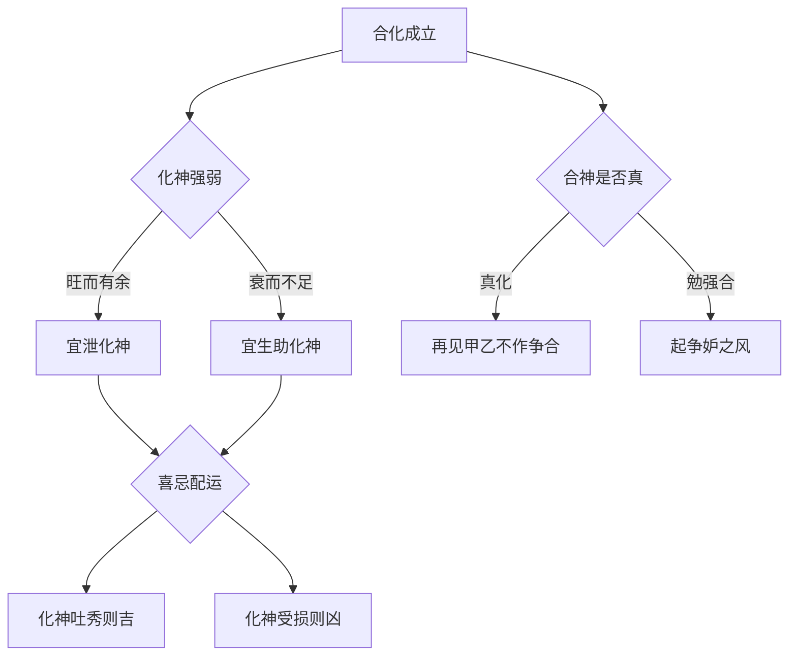

# 化象

## 化之真义

> 【原文】化得真者只论化，化神还有几般话。

第一句立判准——"化得真"才"只论化"：一旦判定为真化，整个格局就以化神为主轴论命，日主原有的属性退居次席。化神既立，喜忌还要细分（"化神还有几般话"）——化神本身的强弱、命局配合的五行走向，都影响最终吉凶。

> 【原注】如甲日主生于四季，单遇一位已土，在月时上合遇壬、癸、甲、乙、戊，而有一辰字，乃为化得真。又如丙辛生于冬月，戊癸生于夏月，乙庚生于秋月，丁壬生于春月，独自相合，又得龙以运之，此为真化矣。

原注分列两类真化的条件：
- **第一类**（甲己合化土）：甲日主生于四季，单遇一位己土在月或时上；月时上合遇壬、癸、甲、乙、戊（皆土之五行相关），且地支有一辰字——辰为龙，辰土居春，三月生物之体，是化神真正发露的位置。
- **第二类**（其它五对合化）：丙辛合化水（冬月）、戊癸合化火（夏月）、乙庚合化金（秋月）、丁壬合化木（春月）——都必须"独自相合"（不杂其它合）、"得龙以运之"（地支有辰字启动化气）。

【异文标注】source.md 此处作"已土"，按"甲己合化土"之义，参之"甲日主"之语，合神当为"己"；"已"与"己"形近易讹，疑传抄刊误。今按源文"已土"录入，存疑不作擅改。

> 既化矣，又论化神。如甲己化土，土阴寒，要火气昌旺；土太旺，又要取水为财，木为官，金为食神。随其所向，论其喜忌，再见甲乙，亦不作争合妒合论。盖真化矣，如烈女不更二夫，岁运遇之皆闲神也。

原注"既化"后的第二步：论化神。甲己化土——土性阴寒，需要火气来暖局（印绶或食伤）；如果土太旺了，反而要取水为财（我克者为财，土克水）、木为官（克我者为官，木克土）、金为食神（我生者为食伤，土生金）。这就是"化神还有几般话"——化神也要再分喜忌。

最后原注给出一个重要原则：真化之后，再见甲乙（合神之原五行）不算"争合妒合"——合已真，如同"烈女不更二夫"，岁运再来同类，只是闲神。

## 化之原与起例——任氏阐微

> 【任氏曰】合化之原，昔黄帝礼天于圜邱，天降十干，爱命大挠作十二支以配之。故日干曰天干，其所由，合即天一、地二、天三、地四、天五、地六、天七、地八、天九、地十之义。依数推之，则甲一、乙二、丙三、丁四、戊五、己六、庚七、辛八、壬九、癸十也。

任铁樵从干支配列说起——十天干与十二支的设定原理（"黄帝礼天""大挠作十二支"，这是命理宇宙论的源头故事）。十天干被赋予"天一地二"等河图之数：甲一、乙二、丙三……癸十。

> 如"洛书"以五居中，一得五为六，故甲与己合；二得五为七，故乙与庚合；三得五为八，故丙与辛合；四得五为九，故丁与壬合；五得五为十，故戊与癸合。

这是十天干相合的数理根据：洛书"五"居中央，一加五得六（甲己合），二加五得七（乙庚合），以此类推。这是子平命理中关于"合"的生成论根据。

> 合则化，化亦必得五土而后成，五土者辰也。辰土居春，时在三阳，生物之体，气辟而动，动则变，变则化矣。且十干之合，而至五辰之位，则化气之元神发露。故甲己起甲子，至五位逢戊辰而化土；乙庚到丙子，至五位逢庚辰而化金；丙辛起戊子，至五位逢壬辰而化水；丁壬起庚子，至五位逢甲辰而化木；戊癸起壬子，至五位逢丙辰而化火。

任氏进一步推演"合化"的启动机制：合了之后还要化，而"化"必须得"五土"（辰）才能成就——辰是地支中唯一属"五"数（辰为龙、位居三方之始）。任氏用五位起例展示：甲己合化土，必须从甲子起推到五位戊辰而化；乙庚合化金，从丙子起五位庚辰而化，等等。

> 此相合相化之真源，近世得传者少，只知逢龙而化，不知逢五而化，辰龙之说，供引之意，如果辰为真龙。则辰年生人为龙，可行雨，而寅年生人为虎，必伤人矣。

任氏点出"逢龙而化"只是俗传——"龙"是辰的象喻（地支三合寅卯辰、辰为龙），但化气的真源在于"五"数之辰，不是迷信意义上的"龙"。这一段澄清常见的讹传——如果按字面把"辰"当龙、"寅"当虎，那辰年生人都能行雨、寅年生人都要伤人了，显然是穿凿。

> 至于化象作用，亦有喜忌配合之理，所以"化神还有几般话"也。非化斯神，喜见斯神，执一而论也，是化象亦要究其衰旺，审其虚实，察其喜忌，则吉凶有验，否泰了然矣。

任氏对"化神还有几般话"的展开：化神也要讲究衰旺、虚实、喜忌——不能简单地"化成什么就喜见什么"。这是对原注"喜忌"原则的进一步落实。

> 至于争合妒合之说，乃谬论也，既合而化，如贞妇配义夫，从一而终，不生二心，见戊己是彼之同类，遇甲乙是我之本气，有相让之谊。合而不化，勉强之意，必非佳偶。见戊己多而起争妒之风，遇甲乙众而更强弱之性。甲己之合如此，余可类推。

任氏对"争合妒合"之论作出明确驳斥：真化之后，如同"贞妇配义夫，从一而终"——再遇同类戊己（土）只作闲神，再遇甲乙（木）也是本气、有"相让"之意。这与原注"烈女不更二夫"是一致的——任氏用更通俗的伦理喻（贞妇、义夫）来重新表述。

## 化神衰旺与喜忌——配运细则

> 【任氏曰】如化神旺而有余，宜泄化神之神为用；化神衰而不足，宜生助化神之神为用。如甲己化土，生于未戌月，土燥而旺，干透丙丁，支藏巳午。谓之有余，再行火土之运，必太过而不吉也。须从其意向，柱中有水，要行金运；柱中有金，要行水运；无金无水，土势太旺，秘要金泄之；火土过燥，要带水之金运以润之。

任氏立下化神喜忌的总则：
- **化神旺而有余**——要"泄化神"为用（火生土、土旺，则泄土之气——金泄土、水淘土皆可）；
- **化神衰而不足**——要"生助化神"为用（扶助化神）；
- 举例：甲己化土，生未戌月（火土燥旺）——化神有余，再走火土运太过；柱中有水（财），要行金运（金生水、引通财气）；柱中有金（食神），要行水运（金生水）；火土过燥，要带水之金运润之。

> 生于丑辰月，土湿为弱，火虽有虚，水木无而实，或干支杂其金水，谓之不足，亦须从其意向。柱中有金，要行火运；柱中有水，要行土运；金水并见，过于虚湿，要带火之土运以实之，助起化神为吉也。

这是化神不足的情况：生丑辰月（土湿为弱），火虽有虚，水木实——化神不足，要"助起化神"。柱中有金（食神），要行火运（火生土扶化神）；柱中有水（财），要行土运（克制太过之水）；金水并见、过于虚湿，要带火之土运以实之。

## 命造实鉴

> 【任氏曰】乙丑 甲申 甲辰 己巳
>
> 癸未 壬午 辛巳 庚辰 己卯 戊寅
>
> 年月两干之甲乙，得当令之申金、丑内之辛金制化，不起争妒之风。时干己土临旺，与日主亲切而合，合神真实，乃谓真化。但秋金当令，化神泄气不足。至午运助化神，中乡榜；辛巳金火土并旺，癸黄甲，宴琼林，入翰苑，仕黄堂，庚辰合乙制化比劫，仕至藩臬。

### 【命造一（任氏注）】乙丑 甲申 甲辰 己巳

日干甲木，生申月（秋金当令），年月两干甲乙木本应争合时干己土——但有申金（克甲乙）、丑中辛金（克甲乙）制化，所以甲乙"不敢"起争合。时干己土临旺（巳火生土），与日主甲木"亲切而合"——任氏判为真化（甲己合化土）。

但秋金当令、化神（土）受克泄（金克木、木克土都受制），化神力量不足。所以到午运（丁火己土旺运）助化神，中乡榜；辛巳运金火土并旺，癸黄年（按：source.md 原字"黄"字面之义存疑，本解读暂作干支年之录），发甲、宴琼林、入翰苑、仕黄堂；庚辰运合乙制化比劫（庚金克乙木、辰土合乙木，乙木不再争合），仕至藩臬。

> 【任氏曰】戊辰 壬戌 甲辰 己巳
>
> 癸亥 甲子 乙丑 丙寅 丁卯 戊辰
>
> 甲木生于季秋，土旺乘权，克去壬水，又无比劫，合神更真，化气有余。惜运走东北水木之地，功名仕路，不及前造，至丑运丁酉年，暗会金局，泄化神而吐秀，登科；戊戌年发甲，仕至州牧。

### 【命造二（任氏注）】戊辰 壬戌 甲辰 己巳

日干甲木，生季秋戌月（土旺乘权），壬水原本是甲之印，但戌月火土当权、壬水被克去，又无比劫争合——合神更真，化气（土）有余。

任氏感叹惜运走东北水木之地（水生木帮身、破坏化神），功名不及前造（命造一）。到丑运丁酉年——丑酉半会金局，泄化神土气而吐秀（食伤泄秀为用），登科；戊戌年（土运助化神）发甲，仕至州牧。

> 【任氏曰】己卯 丁卯 壬午 甲辰
>
> 丙寅 乙丑 甲子 癸亥 壬戌 辛酉
>
> 壬水生于仲春，化象斯真。最喜甲木元神透露，化气有余。余则宜泄，斯化神吐秀，喜其坐下午，午生辰土，秀气流行。少年科甲，翰苑名高，惜乎中运水旺之地，未能显秩，终于县宰。

### 【命造三（任氏注）】己卯 丁卯 壬午 甲辰

日干壬水，生仲春卯月（春木旺），年干己土（合神为土）、月干丁火（壬丁合木），时干甲木——卯月丁壬合木是真化——壬水化为木（丁壬合化木）。

任氏判"化象斯真"——甲木元神透露，时支辰土又可生金（金泄土），化气（木）有余；坐下午火可生辰土（食伤生财），秀气流行。所以少年科甲、翰苑名高。但中运水旺之地（水帮壬水，破化神），未能显秩——最终官阶止于县宰。

> 【任氏曰】己卯 丁卯 壬午 癸卯
>
> 丙寅 乙丑 甲子 癸亥 壬戌 辛酉
>
> 此与前造只换一卯字，化象更真，化神更有余。嫌其癸劫争财，年干己土，透隔无根，不能去其癸水。午火未能流行。此癸水，真乃夺标之客也。虽中乡榜，终不能出仕。

### 【命造四（任氏注）】己卯 丁卯 壬午 癸卯

日干壬水，与前造（命造三）对比，只时支从辰土换成卯木——地支卯卯午卯木火更盛，化象更真（化神木气更有余）。

但任氏指出，时干癸水（比劫）争合——癸水想与年干己土合（己癸合），破坏壬丁合木的化神。年干己土"透隔无根"（自己虚浮），不能克制癸水——任氏直言"此癸水，真乃夺标之客也"——癸水是破坏格局的"夺标"对手。所以虽中乡榜，终不能出仕。

> 【任氏曰】丙戌 戊戌 癸巳 壬戌
>
> 己亥 庚子 辛丑 壬寅 癸卯 甲辰
>
> 癸水生于季秋，丙火透而通根，化火斯真。嫌其时透壬水克丙，只中乡榜，直至卯运，壬水绝地，挑知县，历三任而不升，亦壬水夺财之故也。

### 【命造五（任氏注）】丙戌 戊戌 癸巳 壬戌

日干癸水，生季秋戌月（土旺），时干壬水、月干戊土、年干丙火——丙火（合神为火）通根于巳火（巳中丙火本气），戊癸合化火"化火斯真"。

但任氏指出时干壬水克丙（七杀克财），壬水破坏了化神——只中乡榜（举人），挑知县（小官）后"历三任而不升"——壬水夺财（火为化神、火克金为财，壬水克丙火是"夺财"），仕途天花板明显。

_本篇专论"化"格的真假与喜忌。任氏在原注"逢龙而化"的基础上，把化气的数理根据追到洛书"五"数之辰，澄清俗传"龙"之讹；又立"化神衰旺、虚实、喜忌"的判法，配合五则命造实例系统展示化格的成立要件与喜忌走向。_

_化格与从格同属子平命理中的"变格"范畴——是处理"日主不得月令、气势偏一"等非常规命局的方法群。本篇把"真化"的判法与"假化"的误处系统铺陈，作为化象学理的核心。_
