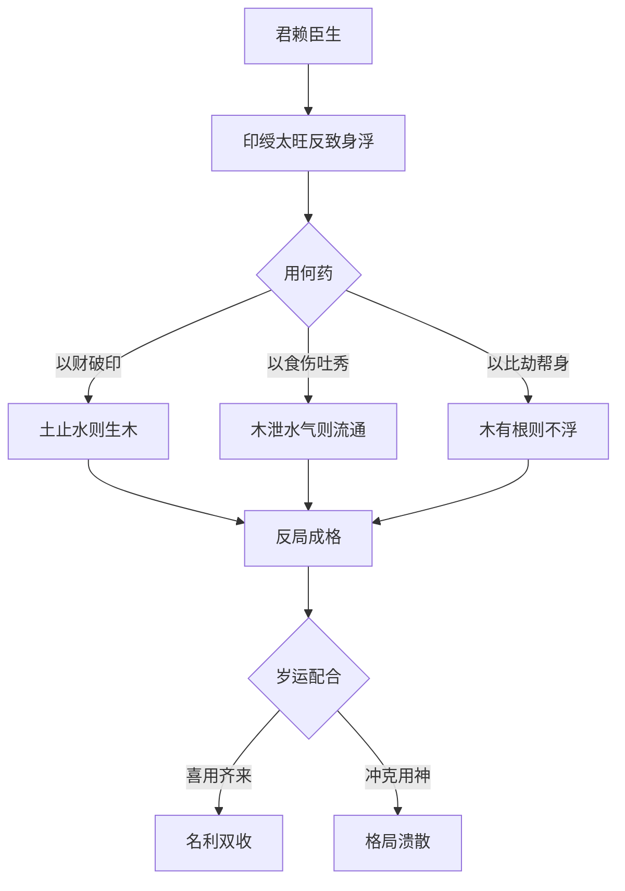

# 反局

> 滴天髓阐微 · 下篇卷六亲论 · 第 51 篇

## 反局四象之统纲

> 【原文】君赖臣生理最微，儿能救母泄天机，母慈灭子关因异，夫健何为又怕妻。

正文以诗诀开篇，把"反局"拆为四种相对独立之格局类型：

- **君赖臣生**——印绶太旺，反来泄身，需要"破其印而就其财"；
- **儿能救母**——食伤（儿）能救印绶（母）之伤，反局之变；
- **母慈灭子**——印绶（母）太旺，反来克食伤（子），与"君赖臣生"相似而不同；
- **夫健怕妻**——日主（夫）身旺，反任财官（妻）之制，颠倒了夫为妻纲之常理。

"理最微""泄天机""关因异"——三个表述都点出"反局"在命理判断中之精微与变通。诗诀"夫健何为又怕妻"一句最为形象——夫本应刚健作主，夫健本应不怕妻，反问"何为又怕"——这一问就把"反局"之核心精神（"反"于常理）凸显出来。

## 君赖臣生

> 【原注】木君也，土臣也。水泛木浮，土止水则生木，木旺火炽，金伐木则生火，火旺土焦，水克火则土；土重金埋，木克土则生金旺则水浊，火克金则生水，皆君赖臣生也，其理最妙。

原注先以"木君土臣"立一组对照，再把"君赖臣生"扩展为五行循环中之"反生"链条：

- 水泛木浮——水太旺则木漂——土止水则生木（土克水、水不再泛木，木得扎根）；
- 木旺火炽——木太旺则火烈——金伐木则生火（金克木、木不再过旺，火得平）；
- 火旺土焦——火太旺则土焦——水克火则土生（水克火、火不再过旺，土得润）；
- 土重金埋——土太旺则金埋——木克土则金生（木克土、土不再过旺，金得显）；
- 金旺水浊——金太旺则水浊——火克金则水生（火克金、金不再过旺，水得清）。

五组链条构成一个完整之五行"反生"循环。任氏概括一句"皆君赖臣生也，其理最妙"——这是命理中"反局"最精妙之一。

> 【任氏曰】君赖臣生者，印绶太旺之意也。此就日主而论，如日主是木为君，局中之土为臣，四柱重逢壬癸亥子，水势泛滥，木气反虚，不但不能生木，抑且木亦不能纳受其水，木必浮泛矣；必须用土止水，则木中托根，而水方能生木亦受其水矣，破其印而就其财，犯上之意，故为反局也。虽就日主而论，四柱亦同此论，如水是官星，木是印绶，水势太旺，亦能浮木，亦须见土而能受水，以成反生之妙，所以理最微也。火土金水，皆同此论。

任氏以"日主是木为君、局中之土为臣"做具体化：四柱水（壬癸亥子）泛滥，木反虚浮——这是"印旺"到了反而不能生身之反局。解法是"用土止水"——土既止水之泛（破印），又托木之根（就财），一石二鸟。

任氏点出"反局"之本质："破其印而就其财，犯上之意"——本来印是生身的，但在印太旺反致木浮时，必须破印才能救木。这是命理中"反生为克、反克为生"之典型例子。

任氏把"君赖臣生"从日主扩展到四柱：即使水是日主之官星（克我者为官），木是印绶（生我者为印），水势太旺也能浮木（破坏印绶），仍需见土止水成"反生之妙"。任氏强调"火土金水，皆同此论"——这一原则在五行任何一组关系上都成立。

### 【命造一（任氏注）】

> 壬辰 壬子 甲寅 戊辰
>
> 癸丑 甲寅 乙卯 丙辰 丁巳 戊午
>
> 甲木生于仲冬，虽日坐禄支，不致浮泛，而水势太旺；辰土虽能蓄水，喜其戊土透露，辰乃木余气。足以止水托根，谓君赖臣生也。所以早登科申，翰苑名高；更妙南方一路火土之运，禄位未可限量也。

甲寅日主甲木生于仲冬（子月），癸水当令。年干壬水、月干壬水皆为偏印（壬阳水生阳甲木为偏印），时干戊土为偏财（甲阳木克阳戊土为偏财）。年支辰中藏戊土、乙木、癸水；时支辰中亦同。

"日坐禄支"——日支寅为甲之禄（甲禄在寅），"不致浮泛"。但单靠日支一个禄还不够，水势太旺须得制。"辰土虽能蓄水，喜其戊土透露"——时干戊土（偏财）透出，是财星用神透出。辰中亦有木之余气（辰中藏乙木），"足以止水托根"——土止水（破印）、木托根（扎根）。

所以"早登科甲，翰苑名高"——早中进士、翰林院任职。"更妙南方一路火土之运"——南方运（巳午未）火土齐来，火暖局、土止水，"禄位未可限量"。

### 【命造二（任氏注）】

> 壬戌 壬子 甲子 戊辰
>
> 癸丑 甲寅 乙卯 丙辰 丁巳 戊午
>
> 甲木生于仲冬，前造坐寅而实，此则从子而虚，所喜年支带火之戌土，较辰土力量大过矣。盖戊土之根固，足以补日主之虚，行运亦同，功名亦同，仕至尚书。

甲子日主甲木生于仲冬（子月），与前一造相似但日支不同——此造日支子是水（甲之死地），"从子而虚"——日主无禄可依。

所喜年支戌土，戌为火库（戌中藏辛金、丁火），"带火之戌土"——戌土比辰土多了火之根，力量更大。戊土（时干）之根固（戌为戊土之根），"足以补日主之虚"。

行运、功名与前一造同——"仕至尚书"（朝廷部院正堂级别）。

### 【命造三（任氏注）】

> 己巳 戊辰 辛酉 己亥
>
> 丁卯 丙寅 乙丑 甲子 癸亥 壬戌
>
> 陈提督造，辛生辰月，土虽重叠，春土究属气辟而松；木有余气，亥中甲木逢生，辰酉辗转相生，反助木之根源，遥冲巳火，使其不生戊巳之土，亦君赖臣生也。其不就书香者，木之元神不透也，然喜生化不悖，运走东北不木之地，故武职超群。

辛酉日主辛金生于辰月（季春），戊土当令。年干己土为正印（己阴土生阴辛金为正印），月干戊土为偏印（戊阳土生阴辛金为偏印），时干己土同为正印。土虽重叠但"春土气辟而松"——春令土松散不实。

地支亥中藏甲木（甲木长生在亥），辰中藏乙木（辰为木之库），辰酉"辗转相生"——辰与酉合（辰酉合金，印绶生金），但酉中辛金、辰中乙木相生——木有根源。

**异文标注**：原文"运走东北不木之地"之"不木"二字，按文意当为"不助木"或"金水之地"之脱误；此处仅客观陈述，不径改。

"遥冲巳火"——亥冲巳（亥巳相冲），巳火被冲去，不再生戊己之土。土不生金，辛金"君"反需木（臣）来"救"——这是"君赖臣生"之另一面：不是印旺反来泄身，而是印绶被破坏，反需食伤（或财）来救。

"其不就书香者，木之元神不透也"——木不透则不能以木为用（不能走文路）。"运走东北不木之地"——按方位东北属艮位，结合"武职超群"一句，应指运程走在不助木之方，金得助而不受木之泄，"故武职超群"。

### 【命造四（任氏注）】

> 戊午 丁巳 己卯 庚午
>
> 戊午 己未 庚申 辛酉 壬戌 癸亥
>
> 已土生于孟夏，局中印星当令，火旺土焦，又能焚木，至庚子年春闱奏捷，带金之水足以制火之烈，润土之燥也。其不能显秩，仁路蹭蹬者，局中无水之故也。

**异文标注**：原文"仁路蹭蹬者"之"仁"字，按文意当为"仕"字之讹（仕路即仕途）；此处仅客观陈述，不径改。

己卯日主己土生于孟夏（巳月），丙火当令。月干丁火为偏印（丁阴火生阴己土为偏印），年干戊土为劫财（戊阳土与己阴土同属土），时干庚金为伤官（己阴土生阳庚金为伤官）。"局中印星当令"——月令巳中藏丙火（正印）、戊土、庚金，火生土，印绶得令极旺。

"火旺土焦"（"焦"字极形象——土被火烤焦燥），且火能焚木（卯中乙木被火焚尽）。

"至庚子年春闱奏捷"——庚金（伤官）子水（正财）齐来，金泄土（食伤吐秀）、水克火（破印）、水润土（解焦），所以"带金之水足以制火之烈，润土之燥"。

但"其不能显秩，仕路蹭蹬"——官位不显。原因是"局中无水"——原局缺水，水不能常来破印润土，只在庚子年得一水之济。所以此造虽能中进士（春闱奏捷），却仕途不顺。

## 儿能救母

> 【原注】木为母，火为子。木被金伤，火克金则生木；火遭水克，土克水则生火；土遇木伤，金克木则生土；金逢火炼，水克炎则生金；水因土塞，木克土则生水，皆儿能生母之意。此意能夺天机。

原注把"儿能救母"展开为五组"儿救母"之链条：

- 木为母、火为子——木被金伤（克），火克金则生木（食伤克官杀护身印）；
- 火为母、土为子——火被水克，土克水则生火（食伤制杀护印）；
- 土为母、金为子——土被木伤，金克木则生土（食伤制财护印）；
- 金为母、水为子——金被火炼，水克火则生金（食伤制杀护印）；
- 水为母、木为子——水被土塞，木克土则生水（食伤制财护印）。

每一组都是"母（印绶）被某种克神所伤，子（食伤）出来克去伤母之物，母转危为安"。原注最后一句"此意能夺天机"——这层机制精妙异常，能识破则"夺天机"。

> 【任氏曰】儿能生母之理，须分时候而论也。如土生冬令，寒而且凋，逢金水必冻，不特金能克木，而水亦能克木也；必须火以克金，解水之冻，木得阳和而发生矣。火遭水克，生于春初冬尽，木嫩火虚，非但火忌水，而木亦忌水，必须土来止水，培木之精神，则火得生，而木亦荣矣。土遇木伤，生于冬末春初，木坚土虚，纵有火，不能生湿土，必须用金伐木，则火有焰而土得生矣。金逢火炼，生于春末夏初，木旺火盛，必须水来克火，又能湿木润土，而金得生矣。水因土寒，生于秋冬，金多水弱，土入坤方，而能塞水，必须木以疏土，则水势通达而无阻隔矣。成母子相依之情。若木生夏秋，火在秋冬，金生冬春，水生春夏，乃休囚之位，自无余气，焉能用生我之神，以制克我之神哉？虽就日主而论，四柱之神，皆同此论。

任氏指出"儿能救母"必须分时候（即五行在四时之旺衰）：

- 土生冬令：土（母）已寒而且凋（冬土冻僵），再逢金水（印绶或财星），金水必冻——金被冻不能克木（克母之物不能被克除），水冻成冰更伤母。须用火（食伤）"以克金，解水之冻"——火克金（去金之克）、解水之冻（化冰为水以生木），母得阳和而发生。
- 火遭水克，生于春初冬尽：木嫩火虚，木也忌水。须用土（财星）来止水，又培木之精神。
- 土遇木伤，生于冬末春初：木坚土虚，火虽能生土，但湿土不纳火。须用金（食伤）伐木，火有焰而土得生。
- 金逢火炼，生于春末夏初：木旺火盛，须用水（食伤）克火，又能湿木润土——金得生。
- 水因土寒，生于秋冬：金多水弱，土入坤方能塞水。须用木（食伤）疏土，水势通达——成母子相依之情。

任氏最后点出"儿能救母"之边界："若木生夏秋"等——食伤在休囚之位（夏秋之木、秋冬之火、冬春之金、春夏之水），自身已无余气，不能"用生我之神，以制克我之神"——食伤自己都弱，怎么能指望它去救母？这是"儿能救母"格局能否成立之关键判准。

### 【命造五（任氏注）】

> 甲申 丙寅 甲申 庚午
>
> 丁卯 戊辰 己巳 庚午 辛未 壬申
>
> 春初木嫩，双冲寅禄，又时透庚金，木嫩金坚，金赖丙火逢生临旺；尤妙五行无水。谓儿有救母，使庚申之金，不伤甲木。至巳运，丙火禄地，中乡榜，庚午运发甲，辛未运仕县宰。总嫌庚金盖头，不能升迁，壬申运不但仕路蹭蹬，亦恐不禄。

甲申日主甲木生于寅月（孟春），甲木当令。月干丙火为食神（甲阳木生阳丙火为食神），时干庚金为七杀（庚阳金克阳甲木为七杀）。年支申中藏庚金（七杀），日支申中亦同。

"春初木嫩"——初春之木尚嫩。年支申金克年干甲木、日支申金克日干甲木——"双冲寅禄"（寅为甲之禄，申冲寅破禄）。

时干庚金（七杀）又来克甲木——"木嫩金坚"。所幸月干丙火（食神）"逢生临旺"——丙火生于寅月，寅中藏甲木、丙火、戊土，丙火得长生。

"尤妙五行无水"——无水则不泄丙火（不破食神用神），丙火专克庚金——"儿有救母"（食神克官杀护身印）。

至巳运（巳为丙火禄地），丙火得禄，"中乡榜"。庚午运（午为丙火旺地）"发甲"（中进士）。辛未运（辛为丙火之财、未为火之墓库）"仕县宰"（出任县令）。

但"总嫌庚金盖头"——庚金透出克甲木（克日主），不能完全克制。壬申运（壬水克丙火破食神，申金冲寅破禄）格局溃散，"不但仕路蹭蹬，亦恐不禄"。

### 【命造六（任氏注）】

> 甲申 丙子 乙酉 丙戌
>
> 丁丑 戊寅 己卯 庚辰 辛巳 壬午
>
> 乙木生于仲冬，虽逢相位，究竟冬凋不茂，又支类西方，财杀肆逞，喜其丙火并透，则金不寒，水不冻，寒木向阳，儿能救母。为人性情慷慨。虽在经营，规模出俗，创业十余万。其不利于书香者，由戌土生杀坏印之故也。

乙酉日主乙木生于仲冬（子月），癸水当令。月干丙火、时干丙火皆为伤官（乙阴木生阳丙火为伤官）。年支申中藏庚金（正官），日支酉中藏辛金（七杀），时支戌中藏辛金（七杀）、丁火（食神）、戊土（偏财）。

"虽逢相位"——虽处相地（乙木生在午、败在卯、冠带在戌、沐浴在亥，但任氏此处"相位"或指沐浴/相地之广义），但冬木凋零不茂。

"支类西方"——申、酉、戌皆西方金土之地，金（财星、官杀）肆逞。

"丙火并透"则金不寒（暖局）、水不冻（解冰）——"寒木向阳，儿能救母"。

"为人性情慷慨。虽在经营，规模出俗，创业十余万"——命主经营商业，慷慨大气，创业十余万（巨资）。

"其不利于书香者，由戌土生杀坏印之故也"——戌为火库又为金之墓库，戌中藏辛金（七杀）、丁火（食神）、戊土（偏财）混杂，戌土生金（生官杀）又坏印（湿土晦火不利食伤护身）——所以不利于读书功名。

### 【命造七（任氏注）】

> 丙辰 乙未 壬辰 甲辰
>
> 丙申 丁酉 戊戌 己亥 庚子 辛丑 壬寅 癸卯
>
> 壬水生于季夏，休囚之地，喜其三逢辰支，通根身库，辰土能蓄水养木，甲乙并透，通根制土，儿能生母。微嫌丙火泄木生土，功名不过一衿；妙在中晚运走东北水木之地，捐出纳出仕，位至藩臬，富有百余万。

壬辰日主壬水生于未月（季夏），己土当令。年干甲木为食神（壬阳水生阳甲木为食神），月干乙木为伤官（壬阳水生阴乙木为伤官），年干丙火为偏财（壬阳水克阳丙火为偏财）。

"壬水生于季夏，休囚之地"——夏水休囚。所喜三逢辰支（年支辰、日支辰、时支辰）——辰为壬水之库（三合水局之库），"通根身库"——日主有根。

"辰土能蓄水养木，甲乙并透，通根制土"——辰为湿土能蓄水、生木；甲乙（食伤）克去戊己之土——"儿能生母"（食伤制财护身印）。

"微嫌丙火泄木生土"——年干丙火泄木（食伤之气）、生土（财星），破食伤、助财星，"功名不过一衿"——一衿指秀才，功名不高。

"妙在中晚运走东北水木之地"——水（财星）木（食伤）齐来，食伤生财流通。"捐出纳出仕"——捐纳出身（以银两买官），"位至藩臬"（布政使、按察使级别），"富有百余万"。

### 【命造八（任氏注）】

> 癸卯 乙卯 己卯 辛未
>
> 甲寅 癸丑 壬子 辛亥 庚戌 己酉
>
> 己土生于仲春，四杀当令，日元虚脱极矣，还喜湿土能生木，不愁木盛，若戊土必不支矣。更妙未土，通根有余，足以用辛金制杀，儿能生母。至癸酉年，辛金得禄，中乡榜，庚戌出仕县令。所嫌者，年干癸水，生木泄金，仕路不显，宦囊如洗。为官清介，人品端方。

己卯日主己土生于卯月（仲春），乙木当令。月干乙木为七杀（乙阴木克阴己土为七杀），年干癸水为七杀（癸阴水克阴己土为七杀），时干辛金为食神（己阴土生阴辛金为食神）。地支卯、卯、卯、未，皆木（卯中乙木）土（未中己土）之地。

"四杀当令"——四柱地支卯、卯、卯皆木（己土之七杀），加上月干乙木（也是七杀）透出，官杀极旺。日元己土虚脱极矣——四柱皆木，土虚。

"还喜湿土能生木，不愁木盛"——己土为阴土、湿土，湿土能生木（不像燥土不能生金）。所以虽四杀当令，日主虚脱，反因湿土能生木而"不愁"。"若戊土必不支矣"——若是戊土（阳土、燥土），干燥不能生木，必不支。

"更妙未土，通根有余"——时支未土是己土的本气之地（未为己土之禄），通根有余。足以用时干辛金（食神）制杀（克去木之官杀）——"儿能生母"（食神制杀护身印）。

"至癸酉年"（酉为辛金之禄），辛金得禄，"中乡榜"（中举）。庚戌运（庚为辛金之助、戌为金库）"出仕县令"（出任县令）。

"所嫌者，年干癸水"（癸水生木助杀、泄金破食神）"仕路不显"（官位不高）、"宦囊如洗"（为官清贫）。"为官清介，人品端方"——清廉正直、端方有守。

## 母慈灭子

> 【原注】木母也，火子也，太旺谓之慈母，反使火炽百焚灭，是谓灭子。火土金水亦如之。

原注给"母慈灭子"下定义："木为母，火为子"——木（印绶）太旺，"谓之慈母"——慈母多败儿（过度的保护反而害了孩子）。木太旺反使火（食伤）炽而被焚灭——是为"灭子"。"火土金水亦如之"——这一原则在五行任何一组上都成立。

> 【任氏曰】母慈灭子之理，与君赖卧生之意相似也，细究这，均是印旺，其关异者，君赖臣生，局中印绶
>
> 虽旺，柱中财星有气，可用财破印也。母慈灭了。纵有财星无气，未可以财星破印也。只得顺母之性，助其子也。岁运仍行比劫之地，庶母慈而子安；一见财星食伤之类，逆母之性，无生育之意，灾咎必不免矣。

**异文标注**：原文"细究这"之"这"字、"君赖卧生"之"卧"字、"母慈灭了"之"了"字，按上下文均有脱误之嫌（"卧"或为"臣"字之讹，"这""了"按文意分别当为"之""子"字之讹）；此处仅客观陈述，不径改。

任氏把"母慈灭子"与"君赖臣生"做对比：两者都是印旺，区别在于：

- 君赖臣生：印虽旺，但柱中财星有气——可用财破印。
- 母慈灭子：纵有财星也无气——不能以财破印。

任氏接着给出"母慈灭子"之解法："只得顺母之性，助其子也"——既然不能破印，就顺着印之性子来，同时帮助食伤（子）。具体到岁运上"仍行比劫之地"——比劫能助食伤（子）不被印（母）完全克去。

"一见财星食伤之类，逆母之性，无生育之意，灾咎必不免矣"——如果岁运再来财星或食伤，是"逆母之性"（印不容子），格局必坏，灾祸立至。

### 【命造九（任氏注）】

> 癸卯 甲寅 丁卯 甲辰
>
> 癸丑 壬子 辛亥 庚戌 己酉 戊申 丁未 丙午
>
> 此造俗谓杀印相生，身强杀浅，金水运名利双收，不知癸水之气，尽归甲木，地支寅、卯、辰全，木多火熄，初运癸丑壬子，生木克火，刑伤破耗；辛亥、庚戌、巳酉、戊申，土生金旺，触卯木之旺神，颠沛异常，夫存生之地，是以六旬以前，一事无成。丁未运助起日元，顺母这性，得际遇，娶妾连生两子：及丙午二十年，发财数万，寿至九旬外。

**异文标注**：原文"顺母这性"之"这"字，按文意当为"之"字之讹；此处仅客观陈述，不径改。

丁卯日主丁火生于寅月（孟春），甲木当令。年干癸水为正官（癸阴水克阴丁火为正官），月干甲木为偏印（丁阴火生阴甲木为偏印），时干甲木亦为偏印。

地支寅、卯、辰全——东方木局极旺。"癸水之气，尽归甲木"——癸水被甲木吸尽（癸甲相生、水生木），水不生丁火，反助木势。

"木多火熄"——木太旺反使丁火熄灭（食伤过旺反克日主）。

"初运癸丑壬子，生木克火"——水运生木助食伤，刑伤破耗（命主早岁困苦）。

"辛亥、庚戌、巳酉、戊申，土生金旺，触卯木之旺神"——这四运走金水（亥、辛为金水、申酉为金），金克木（破食伤），但同时生水（水生木又助食伤）——"触卯木之旺神"。

"颠沛异常，夫存生之地，是以六旬以前，一事无成"——六旬（六十岁）以前，命主一事无成、颠沛流离。

"丁未运助起日元"——丁火比劫（帮身）、未土（财星），助起日主丁火。任氏判此为"顺母之性"——比劫助身，是顺着印绶（母）喜欢帮身之性子。

"得际遇，娶妾连生两子"——至丁未运得佳遇，娶妾生两子。"及丙午二十年"——丙火比劫、午火帮身极盛，"发财数万，寿至九旬外"——发财、长寿。

### 【命造十（任氏注）】

> 戊戌 丙辰 辛丑 戊戌
>
> 丁巳 戊午 己未 庚申 辛酉 壬戌
>
> 辛金生季春，四柱皆土，丙火官星，元神泄尽，土重金坦，母多灭子。初运火土，刑丧破败，荡焉无存：一交庚申，助起日元，顺母之性，大得际遇；及辛酉，拱保辰丑，捐纳出仕；壬戌运，土又得地，诖误落职。

**异文标注**：原文"土重金坦"之"坦"字，按文意当为"埋"字之讹（金被土埋）；此处仅客观陈述，不径改。

辛丑日主辛金生于辰月（季春），戊土当令。月干丙火为正官（丙阳火克阴辛金为正官），年干戊土为偏印（戊阳土生阴辛金为偏印），时干戊土亦为偏印。

"四柱皆土"——戊、辰、丑、戊皆土。"丙火官星，元神泄尽"——丙火生土（印绶），火之元神被土泄尽。

"土重金埋"——土太多把金埋了（金为土之食伤，但土太重反使金不能吐秀）。"母多灭子"——印绶（母）极多，反来克食伤（子）。

"初运火土，刑丧破败，荡焉无存"——初运走火土（巳午未、戊己运），助印绶、克食伤，"刑丧破败"。

"一交庚申，助起日元，顺母之性，大得际遇"——庚金比劫、申金食伤地，助起日主辛金，比劫助身（顺母之性——印绶喜欢帮身）"大得际遇"。

"及辛酉，拱保辰丑"——辛金比劫、酉金食伤，辰酉合金、丑酉半合金，"拱保"印绶不被克（其实是食伤与印绶合，不破格局）。"捐纳出仕"——捐纳得官。

"壬戌运，土又得地，诖误落职"——壬水克丙火（破官星之根）、戌为火库、戌土得地助印绶，"诖误落职"。

### 【命造十一（任氏注）】

> 丙戌 戊戌 辛丑 戊戌
>
> 己亥 庚子 辛丑 壬寅 癸卯 甲辰
>
> 此与前只换一戌字，因初己亥、庚子、辛丑金水，丑土养金，出身富贵辛运加捐；一交壬运，水木齐来，犯母之性，彼以土重逢木必佳，强为出仕，犯事落职。

辛丑日主辛金生于戌月（季秋），戊土当令。此造与前一造（戊戌 丙辰 辛丑 戊戌）只换一字——前一造月支辰土，此造月支戌土（戌为火库，戌中藏辛金、丁火、戊土）。

行运分析：初运己亥、庚子、辛丑——金水运。丑土养金（湿土养金），"出身富贵辛运加捐"——辛运时（辛金比劫助身）"加捐"（再捐纳得官）。

"一交壬运，水木齐来，犯母之性"——壬水透出，壬为辛金之食伤（壬水被辛金所生为伤官）。"水"指壬水（食伤），"木"指运中甲乙木（财星）。水（食伤）木（财星）齐来，"犯母之性"——食伤、财星同来破坏格局（母多灭子之格，最忌食伤财星来破）。

"彼以土重逢木必佳"——彼（命主）以为土重逢木必佳（按一般格局，土重需木疏）。但实际是"母多灭子"格，逢木（财星）反而触犯母之性。

"强为出仕，犯事落职"——命主强自出仕，结果犯事落职。

### 【命造十二（任氏注）】

> 壬子 壬寅 甲子 壬申
>
> 癸卯 甲辰 乙巳 丙午 丁未 戊申
>
> 此俗论木生孟春，时杀独清。许其名高禄重，不知春初嫩木，气又寒凝，不能纳水；时支申金，乃壬水生地，又子申拱水，乃母多灭子也。惜运无木助，逢火运与水战，犹恐名利无成也。初行癸卯甲辰。东方木地，顺母助子。荫庇大好；一交乙巳，运转南方，父母并亡。财散人离；丙行水火交战，家业破尽而逝。

**异文标注**：原文"丙行水火交战"之"丙行"二字，按文意当为"丙午"运（丙火午火齐来）之脱误；此处仅客观陈述，不径改。

甲子日主甲木生于寅月（孟春），甲木当令。年干壬水、月干壬水、时干壬水皆为偏印（壬阳水生阳甲木为偏印），时支申中藏庚金（七杀）。

"时杀独清"——时支申金（七杀）独清。

按"俗论"——时支申金为七杀，七杀有制（食伤制杀）则贵。但任氏驳之：春初嫩木，气寒凝，不能纳水（冬末春初水寒、木不能纳受水之生）。

时支申金是壬水（年干、月干）之生地——"子申拱水"（子申半合水局）——印绶（壬水）极旺。

"乃母多灭子"——印绶（母）极多，反使食伤（子）被克。

"初行癸卯甲辰，东方木地，顺母助子"——癸水（偏印）、甲乙木（食伤之禄地）"顺母助子"——顺着印绶之性子（印绶喜欢比劫帮身），同时木也助食伤（子）。

"荫庇大好"——初运得祖荫庇护。

"一交乙巳，运转南方"——乙木食伤、巳火（财星）齐来。任氏说"父母并亡，财散人离"——按"母多灭子"格局，逢食伤（乙木）、财星（巳火）来犯母之性，灾咎立至。"父母"指印绶（生我者为父母），印绶被克则父母有灾。

"丙行水火交战"——丙火（财星）运，与原局壬水（印绶）交战（丙壬相冲）——家业破尽而逝。

## 夫健怕妻

> 【原注】木是夫也，土是妻也。木虽蛙，土能生金而克木。是谓夫健而怕妻。火土金水和之，其有水逢烈火而生土，之逢寒金而生水。水生金者，润地之燥；火生木者，解天之冻。火楚木而水竭，土渗水而木枯皆反局，学得须细详其玄妙。

**异文标注**：原文"木虽蛙"之"蛙"字，按文意当为"旺"字之讹；"之逢寒金而生水"之"之"字，按文意或为"火"字之脱误；"火楚木而水竭"之"楚"字，按文意当为"焚"字之讹（火焚木则水竭）；此处仅客观陈述，不径改。

原注以"木是夫也、土是妻也"开篇：木（夫）虽旺，土（妻）能生金（克木之物）而克木——这是"夫健而怕妻"。

原注随即点出反局之另一面："水逢烈火而生土"（水遇克水之物反成土之局）"之逢寒金而生水"（按文意当为"火逢寒金而生水"——金生水，金本克木却能生水成局）。

最后三句："水生金者，润地之燥；火生木者，解天之冻。火楚木而水竭，土渗水而木枯皆反局"——四组反局：火焚木而水竭（火旺反克水）、土渗水而木枯（土多反克木）。"皆反局，学得须细详其玄妙"——这些反局都需细详。

> 【任氏曰】木是夫也，土是妻也。木旺土多，无金不怕，一见庚申辛酉字，金克木，是谓夫健而所妻也。岁运逢金，亦同此论。如甲寅乙卯日元，是谓夫健，四柱多土，局内又有金，或甲日寅月，乙日卯月，年时土多，干透庚辛之金。所谓夫健怕妻，如木无气而土重，即不见金。夫衰妻旺，亦是怕妻，五行皆同此论。

**异文标注**：原文"夫健而所妻也"之"所"字，按文意当为"怕"字之讹（"所""怕"形近）；此处仅客观陈述，不径改。

任氏把"夫健怕妻"具体化：木（夫）旺、土（妻）多，本无大碍——土多只是克木，但木旺还能抗。一见庚申、辛酉（金克木），则金来克木、伤日主。

任氏点出"夫健"之两类情形：

1. 日支坐禄（甲寅、乙卯日）——日主有根极旺，是"夫健"；
2. 月令为禄（甲日寅月、乙日卯月）——月令帮身，亦是"夫健"。

任氏补出"夫健怕妻"与"夫衰妻旺"虽然同称"怕妻"，但本质不同——前者是身旺能任财官，后者是身弱不胜财官，需分清。

> 【任氏曰】其有水生土得，制火之烈；火生水者。敌金之寒；水生金者，润土之燥；火生木者，解水之冻。火旺逢燥土而水竭，火能克水矣；土燥遇金重而水渗，土能克木矣；金重见水泛而木枯，金能克木矣；水狂得木盛而火熄，水能克土矣；木众逢火烈而土焦，木能克金矣。此皆五行颠倒之深机，故谓反局，学者宜细详玄妙之理。命学之微奥，其尽泄于此矣。

**异文标注**：原文"火生水者"之"火"字，按上下文当为"金"字之讹（前句"水生土"言土制火，此句按对仗当言"金生水"）；"土能克木矣""水能克土矣""木能克金矣"三处，按前文所论五行链当为"土能克水矣""水能克火矣""木能克土矣"；此处仅客观陈述，不径改。

任氏以四组"反生"补足"夫健怕妻"格局之解法：水生土（湿土）得制火之烈；金生水者敌金之寒；水生金者润土之燥；火生木者解水之冻。

任氏以五组"反克"链条收束"反局"理论：火旺逢燥土而水竭（火克水）；土燥遇金重而水渗；金重见水泛而木枯；水狂得木盛而火熄；木众逢火烈而土焦。

任氏最后归纳："此皆五行颠倒之深机，故谓反局"——反局之本质是"五行颠倒"——本应相生却反生、本应相克却反克。

### 【命造十三（任氏注）】

> 己亥 戊辰 甲寅 辛未
>
> 丁卯 丙寅 乙丑 甲子 癸亥 壬戌
>
> 甲寅日元，生于季春。四柱土多，时透辛金，土生金，金克木谓夫健怕妻。初运木火，去其土金，早游泮水，连登科甲；甲子癸亥，印旺逢生，日元足以任其财官，仕路超腾。

甲寅日主甲木生于辰月（季春），戊土当令。年干己土为正财（己阴土克阳甲木为正财），月干戊土为偏财（戊阳土克阳甲木为偏财），时干辛金为正官（辛阴金克阳甲木为正官）。

"四柱土多"——己、辰、未皆土（财星），"时透辛金"——辛金（正官）透出。土生金（财生官），金克木——"土生金，金克木谓夫健怕妻"。

初运走木火之地（寅卯、巳午），木（比劫）去其土（克土）、火（食伤）去其金（克金）——"去其土金"，格局转清。

"早游泮水，连登科甲"——秀才、进士连中。

甲子、癸亥运（印绶之地）——"印旺逢生"——印绶生身，日元（甲木）足以任财官（财星土、官星金），"仕路超腾"。

### 【命造十四（任氏注）】

> 己巳 戊辰 甲子 辛未
>
> 丁卯 丙寅 乙丑 甲子 癸亥 壬戌
>
> 甲木生于季春，木有余气，坐下印绶，中和之象；财星重叠当令，时透官星，土旺生金，夫健怕妻。初运木火，去其土金，早年入泮，科甲连登。仕路不能显秩者，只因土之病也。前造有亥，又坐-禄，支更健于此，此则子未相穿坏印，彼则寅能制土护印也。

**异文标注**：原文"又坐-禄"之"-"处，按文意当为"甲"字之脱文（甲禄在寅）；此处仅客观陈述，不径改。

甲子日主甲木生于辰月（季春），戊土当令。年干己土为正财，月干戊土为偏财，时干辛金为正官。

"木有余气"——辰中藏乙木，甲木在辰月有余气。

"坐下印绶"——日支子是癸水（正印）之禄——甲木坐子水之上得印生。

"中和之象"——日主不旺不弱（印生、财官并透）。

"财星重叠当令"——辰月为土旺之月，财星当令。"时透官星，土旺生金"——辛金（正官）透出，土生金——"夫健怕妻"。

初运走木火（寅卯、巳午），去其土金（克财破官）——"早年入泮，科甲连登"。

但"仕路不能显秩"——不能任高官。"只因土之病也"——财星（病）太重，不能尽去。

任氏以这一造与前一造做对比：

- 前一造日支寅（甲之禄），此造日支子（癸之禄）。前一造有亥（亥中甲木长生），此造无亥。
- "前造有亥，又坐甲禄"——日主有根更深，能任财官。
- 此造"子未相穿坏印"——子未相害（子未六害），破坏印绶；前一造寅能制土（寅克土护印）。

### 【命造十五（任氏注）】

> 乙亥 辛巳 丁巳 庚戌
>
> 庚辰 乙卯 戊寅 丁丑 丙子 乙亥
>
> 戴尚书造。丁巳日元，生于孟夏，月时两透庚辛，地支又逢生助，巳亥逢冲，去火存金，夫健怕妻。喜其运走东方木地，助印扶身，大魁天下，宦海无波；一交子运，两巳爱制，不禄

**异文标注**：原文"两巳爱制"之"爱"字，按文意当为"受"字之讹（"受制"）；此处仅客观陈述，不径改。

丁巳日主丁火生于巳月（孟夏），丙火当令。年干乙木为偏印（丁阴火生阴乙木为偏印），月干辛金为偏财（丁阴火克阴辛金为偏财），时干庚金为正财（丁阴火克阳庚金为正财）。

"月时两透庚辛"——月干辛金、时干庚金（财星）两透。"地支又逢生助"——巳为金之长生（按巳中藏戊土、庚金，庚金长生在巳）；戌为金库。

"巳亥逢冲，去火存金"——亥冲巳（巳亥相冲），巳中本气丙火被冲去，留庚金（财星）——"去火存金"。

"夫健怕妻"——丁火（夫）身旺（金为财、金为官，巳月金得长生），反需金来制（身旺用官杀）。

"喜其运走东方木地"——东方木（寅卯辰）"助印扶身"——木生火（印绶生身）。

"大魁天下"——大魁指状元。"宦海无波"——仕途平稳。

"一交子运，两巳受制"——子运（北方水地），两巳（年支巳、日支巳）被子水所克——"两巳受制"。

"不禄"——亡故。

### 【命造十六（任氏注）】

> 癸亥 甲子 戊戌 癸丑
>
> 癸亥 壬戌 辛酉 庚申 己未 戊午
>
> 戊戌日元，生于子月亥年，月透甲木逢生，水生木，木克土，夫健怕妻，最喜坐下戌之燥土，中藏丁火印绶，财虽旺，不能破印，所谓"玄机暗里存"也。第嫌支类北方，财势太旺，物极必反，虽位至方伯，宦资不丰。

戊戌日主戊土生于子月（仲冬），癸水当令。月干甲木为七杀（甲阳木克阳戊土为七杀），年干癸水为正财（戊阳土克阴癸水为正财），时干癸水亦为正财。

"月透甲木逢生"——甲木（七杀）透出，甲木生于子月（子为水、水生木），"逢生"——甲木得水之生（印绶生官杀）。

"水生木，木克土"——水（财星）生木（七杀），木克土（日主戊土）——"夫健怕妻"——日主戊土（夫）反被七杀（妻）所克。

"最喜坐下戌之燥土，中藏丁火印绶"——日支戌为燥土（戌中藏戊土、辛金、丁火），丁火（正印）在戌中得藏。

"财虽旺，不能破印"——水（财星）虽极旺，但有戌中丁火（印绶）护身——"所谓'玄机暗里存'也"（按：此与前文"一个玄机暗里存"互文——都是用神藏于地支）。

"第嫌支类北方，财势太旺，物极必反"——亥、子、丑皆北方水地（亥、子为水，丑为湿土），财势太旺反为忌。

"虽位至方伯"（方伯即布政使，省级长官）"宦资不丰"——为官清廉。

### 【命造十七（任氏注）】

> 癸亥 癸亥 戊午 甲寅
>
> 壬戌 辛酉 庚申 己未 戊午 丁巳
>
> 仓提督造。戊午日元，生于亥月亥年，时逢甲寅杀旺，财杀肆逞，财星足以破印，以致难就书香。幸而寅拱午印，克处逢生，以杀化印，所以武职超群。

戊午日主戊土生于亥月（孟冬），壬水当令。年干癸水、月干癸水皆为正财（戊阳土克阴癸水为正财），时干甲木为七杀（甲阳木克阳戊土为七杀）。

"亥月亥年"——年支亥、月支亥皆水地。时支寅中藏甲木（七杀）本气、丙火（偏印）、戊土（比肩）。

"时逢甲寅杀旺"——甲木（七杀）旺于亥月（亥中甲木长生），寅中甲木本气——杀极旺。

"财杀肆逞"——癸水（财星）极旺（两癸两亥），甲木（七杀）极旺。

"财星足以破印"——水（财）克火（印），日主戊午（午为火），印绶（午中丁火）被水克——"以致难就书香"（不能走科举文路）。

"幸而寅拱午印"——寅午半合火（寅午戌三合火局之两半），"克处逢生"——杀（甲木）虽克身，但寅中藏甲木、丙火、戊土，丙火（食伤）能化杀（甲木生丙火）成印（丙火生戊土）——"以杀化印"。

"所以武职超群"——武官出身、显达。

> 【任氏曰】予观夫健怕妻之命，颇多贵显著，少究其理，重在一"健"字之妙也。如主日主不健，为财多身弱，终身困苦矣。夫健所妻，怕而不怕，倡随之理然也。运遇生旺扶身之地，自然出人头地。若夫不健而怕妻，妻必恣性越理。男牵欲而失其刚，妇贪悦而忘其顺，岂能富贵乎？

**异文标注**：原文"夫健所妻"之"所"字，按文意当为"怕"字之讹（"所""怕"形近）；此处仅客观陈述，不径改。

任氏最后归纳"夫健怕妻"之关键："重在一'健'字之妙也"——日主必须真健（身旺），才能"怕而不怕"——身旺任财官（妻），财官虽多反为我用。

若"日主不健"（身弱），为"财多身弱"——则怕妻是真怕，妻（财官）反来克身。"终身困苦矣"。

任氏以"夫健怕妻"喻"倡随之理"——夫唱妇随。夫健（身旺）配妻（财官）则"怕而不怕"，是顺理成章之婚姻；夫不健（身弱）配妻则"妻必恣性越理"——妻（财官）反来凌夫。

"运遇生旺扶身之地，自然出人头地"——身旺运扶，自然显达。

"若夫不健而怕妻，妻必恣性越理。男牵欲而失其刚，妇贪悦而忘其顺，岂能富贵乎"——男（夫）牵于物欲（财）而失其刚，妇（妻）贪图欢悦而忘其顺——这种不健之夫、越理之妻，是"岂能富贵乎"的。

任氏把命理判断与儒家"夫为妻纲"之伦理观做了对照——"夫健"才能任"妻"，"夫不健"则妻反为累。

## 篇章定位

本篇为《滴天髓阐微》下篇六亲论中专论反局之法要。把凡与正生正克规律相悖之格局统归"反局"，共分四类：君赖臣生（印绶太旺反来泄身）、儿能救母（食伤救印绶之伤）、母慈灭子（印绶太旺反克食伤）、夫健怕妻（日主身旺反任财官）。任氏在篇中以五行循环为基础，把"反局"原理逐层扩展到所有五行关系上，并以十七则命造展示了反局格局在命理实践中之判别与取舍。此篇是研习"反生""反克"等非常规格局者所必读之法门。
