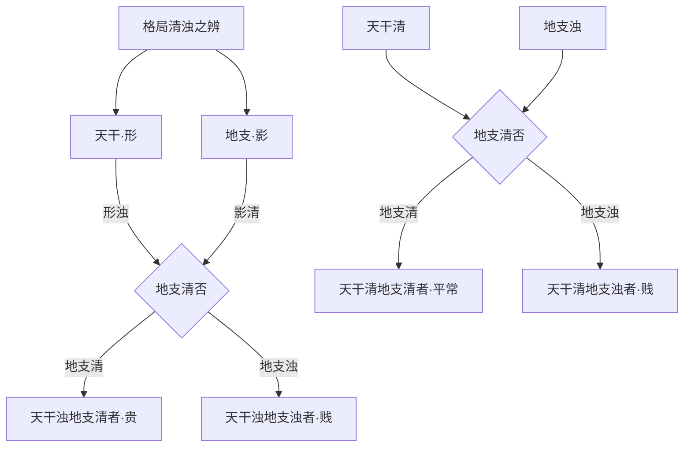

# 地位

## 出身已定，地位更难

> 【原文】台阁勋劳百世传，天然清气发机权。

「天然清气发机权」一句把本篇的关键词直接亮出来——**「清气」与「机权」**。篇首「出身」一篇讲的也是「清气」，但讲的是能不能出得来（科甲、秀才、异路）；本篇则讲出来之后能立多高（台阁、兵权、藩臬、首领）。同样一个「清气」字眼，前篇看的是「清」本身，本篇则看「清」之中能不能发出**「机权」**——机者时机，权者权位。「机权」二字，把命理学从静态的格局判断推到了动态的政治事功。

> 【原注】能如人之出身，至于地位之在小，亦不易推。若夫为独为卿，清中又有一种权势出入矣，不专在一端而论。

原注第一句「能如人之出身，至于地位之在小，亦不易推」是关键的过渡——上承出身篇，下开本篇。**「至于地位之在小」**五字需要细辨：原文当作「地位之高下」（按：原书此处作「之在小」，与上下文义不顺，疑为「之高下」之形近讹误，详见末段标注）。这一句是说，出身已定之后，地位之高下更不易推。出身决定「有没有」，地位决定「多高多大」——这是两个层次的判断。

> 【异文标注】「地位之在小」一语，按上下文「不易推」之意，当作「地位之高下」。「之在小」与「高下」形、义皆不相应，疑原书刻版「高下」二字漫漶或错排。此处不擅自改动原文。

原注第二句「若夫为独为卿，清中又有一种权势出入矣」直接点题——**「为独为卿」**即台阁宰辅之位，其清中又含「权势出入」。「不专在一端而论」一句立下本篇的判别准则：地位高下不专看一端（不是只看官星或只看格局），要看清气之中所发的机权之势。

## 台阁之清气

> 【任氏曰】台阁宰匍以及封疆之任，清气发乎天然，秀气出纯粹，四柱内，且与喜神有情，格局之中并无可嫌之物。所用者皆真神所喜者皆真气，此谓"清气显机权"也。度量宽宏能容物，施为纯正不贪私，有润泽生包之德，怀任重致远之财也。

> 【异文标注】「台阁宰匍」一语，按文意当作「台阁宰辅」（按：原书作「匍」，与「辅」字形近而讹）。「有润泽生包之德，怀任重致远之财也」一语，按上下文意，当作「润泽生民之德，任重致远之才」（按：原书「生包」当为「生民」之误，「财」当为「才」之误）。此处仅作客观标注，不擅自改动原文。

任氏在原注「清中又有一种权势」的基础上，展开**「清气发乎天然」**——天然二字不是虚词，是说这种清气不是后天凑成的，而是四柱中自然形成。

接下来任氏立下台阁之命的几个具体判准：

- **「所用者皆真神」**——八字中所用的字都是真神（真神者，得月令真气的用神），不是闲神、忌客充数；
- **「所喜者皆真气」**——四柱中所喜的字都是真气（真气者，纯粹无杂的吉神），不是混杂之气；
- **「与喜神有情」**——四柱内部结构上，喜神与其他字有情（相生相合），不是孤立的；
- **「格局之中并无可嫌之物」**——格局内部没有闲神、忌客混杂；
- **「度量宽宏能容物」**——这是把命理推到人事层面：台阁之命，其人性情必宽宏大度，能容人容事；
- **「施为纯正不贪私」**——施政处事不偏私。

「润泽生民之德，任重致远之才」是任氏对台阁之命的德性总结——能为生民请命、能为长远布局。「润泽」「任重」对应到命理上，就是四柱中有水之润、有土之载；「生民」「致远」对应到事功上，就是能惠及苍生、能谋划久远。

> **【命造一（任氏注）】庚申 庚辰 戊辰 戊午——董中堂造**
> 任氏断：「此董中堂造，天然清气在庚金也。」

> **【命造二（任氏注）】甲子 丙寅 己丑 甲子——刘中堂造**
> 任氏断：「此刘中堂造，天然清气在丙火也。」

> **【命造三（任氏注）】壬申 壬寅 丙子 乙未——钱尚书造**
> 任氏断：「此钱尚书造，天然清气在乙木也。」

> **【命造四（任氏注）】己亥 丁卯 庚申 庚辰——秦侍郎造**
> 任氏断：「此秦侍郎造，天然清气在丁火也。」

四个台阁之命，任氏都以「天然清气在 XX」一句概之——董中堂在庚金、刘中堂在丙火、钱尚书在乙木、秦侍郎在丁火。**「天然清气」四字**反复出现，等于把本节最核心的判据凝练为这四个字：清气要纯、要真、要天然凑成。读者可对照命造：四柱中庚、丙、乙、丁都恰好是该命局中清纯无杂的用神，且全局配置无闲神忌客混杂——这是台阁之命的结构性特征。

## 兵权之刃煞

> 【原文】兵权獬豸弁冠客，刃煞神清气势特。

「獬豸」是上古神羊，能辨是非——獬豸冠是古代执法官、御史的冠服，**代指掌生杀之权的宪职**。本节与上节（「台阁」）结构对偶：台阁是中央文职之首，兵权是中央与地方武职之要。「刃煞神清气势特」一句把兵刑之命的判据立住——**刃**（羊刃，即日主之帝旺）、**煞**（七杀）、**神清**（清气发越）、**气势特**（气势特出于常人）。

> 【原注】掌生杀之权，其风纪气势，必然超特，清中精神自异又或刃杀两显也。

> 【任氏曰】掌生杀大权，兵刑重任者，其精神清气，自然超特，必以刃旺敌杀，气势出人也。局中杀旺无财，印绶用刃者，或无印而有羊刃者，此谓杀刃神清也。气势特者，刃旺当权也，必文官而掌生杀之任。

任氏先把「掌生杀之权」的范围明确——兵刑重任者，文官而掌生杀之任（按：任氏下文亦提及「武将之命」与之区分）。接下来是兵权之命的结构性判据：

- **「刃旺敌杀」**——七杀强而羊刃亦旺，日主以刃敌杀（按：刃即羊刃，是日主的帝旺之地，气势极盛；杀即七杀，克我之阴阳异性者）；
- **「杀旺无财，印绶用刃」**——七杀旺而不见财星（财生杀更凶），印绶化杀生身，羊刃助身敌杀；
- **「无印而有羊刃者」**——即不取印化杀，而直接以刃敌杀；
- **「气势特者，刃旺当权也」**——气势特出于常人，根源在羊刃当权。

> 【任氏曰】若刃旺敌杀，局中无食神印绶，而有财官者，气势虽特，神气不清，乃武将之命也。

> 【异文标注】原书「獬豸弁冠」一语，按文意当作「獬豸冠」或「獬豸豸冠」（「弁」字疑为衍文或形近讹误）。此处不擅自改动。

任氏对「武将之命」作了明确区分——刃旺敌杀而局中无食神印绶、有财官者，气势虽特但**神气不清**（按：神气者，清气之神；神气不清，则虽有气势而缺乏节制之德），这是武将之命，与文官掌兵刑者不同。这一区分是任氏的精到处——同样是「刃煞神清」，文官掌兵刑与纯粹的武将之命，其清浊之别、气势之别，差在一个「节制之德」上。

接下来任氏列举**羊刃的标准配置**：

> 【任氏曰】刃旺者，如春之甲用卯刃，乙用寅刃；夏之丙用午刃丁用巳刃，秋之庚用酉刃，辛用申刃，冬之用子刃，癸用亥刃是也。

按五行四时把羊刃逐一刻出：春甲卯刃、春乙寅刃、夏丙午刃、夏丁巳刃、秋庚酉刃、秋辛申刃、冬壬（按：原书「冬之用子刃」前脱「壬」字，按「子」为壬之禄位可推）子刃、冬癸亥刃。这一表是子平命理中关于羊刃的标准配法，**「禄前一位为刃」**——禄的下一位帝旺即是羊刃。读者读本段时不必死记名称，只需抓住一个要领：**羊刃是日主本气最旺的极点，是日主性格刚锐的物化**。

> 【任氏曰】若刃不当权，虽能敌杀，不但不能掌兵权，亦不能贵显也。其人疾恶太严，如刃旺杀弱亦然，必傲物而骄慢也。

任氏最后补一笔反例——**刃不当权**（按：刃不当权指羊刃休囚无气、被冲被合），纵能敌杀，亦不能掌兵权、不能贵显。这一句是反证：兵权之命，**刃必须当权**，否则气势不够。同时任氏也提示，刃旺杀弱者容易「傲物而骄慢」——这是从命理推到性情的伦理提醒。

> **【命造五（任氏注）】壬寅 己酉 庚午 丙戌**
> 任氏断：「庚日丙时，支逢生旺，寅纳壬水，不能制杀，全赖酉金羊刃当权为用，隔住寅木，使其不能会局，此正'刃杀神清气势特'也。早登科甲，属掌兵刑生杀之任，仕至刑部尚书。」

庚日主，酉金为刃当权；丙火七杀透时干；寅木藏壬，与酉无直接冲突。**酉金羊刃隔住寅木**——这一笔是命造的精妙处：刃把寅木（杀之长生）隔开，使其不能会局助杀，刃独自敌杀，气势自然清。这是任氏「刃杀神清」的标准造。

> **【命造六（任氏注）】庚戌 壬午 丙子 壬辰**
> 任氏断：「丙子日元，月时两透壬水，日主三面受敌，柱中无木泄水生火，反有庚金生水泄土，金赖午火旺刃当权为用，更喜戌之燥土，制水会火。乡榜出身，丙戌丁亥运仕至按察。」

丙日主，午火为刃当权；壬水两透七杀；庚金生水本为忌，但午火刃能当权敌杀，戌土燥土制水会火——**「制水会火」四字**是命眼：戌土既制壬水之杀，又会午火之刃，一身二用，兵刑之任的格局也成了。

> **【命造七（任氏注）】乙卯 戊子 壬辰 戊申**
> 任氏断：「壬辰日元，天干两煞，通根辰支，年干乙木凋枯，能泄水而不能制土，正克泄交加，最喜子水当权会局，杀刃神情。至酉运生水克木，又能化杀，科甲连登；甲申登运，仕路光亨，至按察；未运羊刃受制，不禄。」

壬日主，**子水为刃**（壬禄在子）；戊土两透七杀；申金生水助刃，辰土虽藏戊但被申子半会水局所化。任氏判「杀刃神情」——按：神、情两字，原书作「神情」，按文意当为「神清」（按：疑为「清」字形近讹误或排版错位，**「刃杀神清」为本篇反复出现之标准术语**），此处仅作客观标注。羊刃当权、化杀有力，故科甲连登、仕至按察。末运「未运羊刃受制」——未土克子水，刃被制则不能敌杀，故「不禄」。

> **【命造八（任氏注）】丙辰 辛卯 甲申 庚午**
> 任氏断：「甲申日元，生于仲春，官杀并透通根，日时临于死绝，必用卯之羊刃。喜其丙火合辛，不但无混杀之嫌，抑且卯木不受其制，刃杀神清，且运走南方火地。科甲出身，仕臬宪。」

甲日主，卯木为刃当权；庚辛官杀并透；丙火合辛——这一笔是本造的精妙：丙辛合则杀不混刃（按：原书作「混杀」，按文意当作「混杀」），卯木刃不受庚金之制。**「丙火合辛」**——合则不动、不冲、不混，刃与杀各得其用。

## 藩司州牧之财官

> 【原文】分藩司牧财官和，清纯格局神气多。

「分藩司牧」代指地方要职——分藩即布政使（省级长官），司牧即州县牧守（按：知州、知县）。与上节「兵权」对应，本节讲的是**地方文职要员**。判据落在「财官和」与「清纯格局神气多」——**「和」字是关键**，财与官必须相和（有情），不能相战。

> 【原注】方面之官，财官为重，必清奇纯粹，格正局全，又有一段精神。

> 【任氏曰】方面之任以及州县之官，虽以财官为重，必须格局清纯，更须日元生旺，神贯气足，然后财官情协，则精气神三者足矣。又加官旺有印，官衰有财，印旺有财，左右相通，上下不悖，根通年月，气贯日时，身杀两停，杀重逢印，杀轻遇财者，皆是也，必有利民济物之心；反此者，非所宜也。

任氏把「方面之官」的判据系统化——**「精气神三者足矣」**是眼目：

- **「精」**——格局清纯；
- **「气」**——日元生旺（气贯日时）；
- **「神」**——神贯气足（有精神）；

三者皆足方为方面之命。任氏接着罗列了几个结构性判据：

- **「官旺有印」**——官星旺有印绶化之；
- **「官衰有财」**——官星弱有财星生之；
- **「印旺有财」**——印绶旺有财星制之（按：印太旺克食伤生身太过，需财制印）；
- **「左右相通，上下不悖」**——四柱左右（年月、日时）相生相扶，上下（天干地支）不冲不战；
- **「身杀两停」**——日主与七杀力量相当；
- **「杀重逢印，杀轻遇财」**——杀重用印化、杀轻用财生。

任氏最后一句「必有利民济物之心；反此者，非所宜也」是伦理收束——方面之任必有利民之心，否则命局虽合而德不配位。这一句与上节「润泽生民之德」呼应。

> **【命造九（任氏注）】丁丑 乙巳 癸酉 壬子**
> 任氏断：「癸水生于巳月，火土虽旺，妙在支会金局，财官印三者皆得生助；更喜子时劫比帮身，精神旺足；尤喜中年运走北方。异路出身，仕至郡守，名利两全，生七子皆出仕。」

癸日主，**子水劫比帮身**（按：壬子时干壬水为劫财，子水为癸水之禄）；巳月火土虽旺，但酉金成局（按：申酉戌三会，巳酉半会金局，财星金旺）；乙木正印、巳火财星（按：按十神，巳中庚金为正财，丙火为正官，戊土为正印）。任氏判「**财官印三者皆得生助**」——按十神，**财=我克者（金克木为财？此造金为财，水克火，水克金？按：金生水、水克火——这里需要小心核验）**：癸水日主，**金**为财（按：按十神口诀「我克者为财」，金生水，水不能克金——此条需更严判，按命理口诀：癸水克丙火为财/克金为印？）

按：子平十神之判以**五行生克**为准，**克我者为官、我克者为财、印为生我者、财为我克者**——

- 癸水，**金**为**印**（金生水，金生我）；
- 癸水，**木**为**财**（水生木，水生我者不为我所生，正确的是：水生木，木为我所生者——这不准确）。 

按正确十神口诀：「克我者为官，我克者为财，我生者为食伤，生我者为印，比和者为比劫」——
- **印 = 生我者**：金生水 → **金为癸水之印**（按：注意，水生木是「我生者」，应为食伤）。
- **财 = 我克者**：水克火 → **火为癸水之财**（即财星为火）。
- **官 = 克我者为官**：土克水 → **土为癸水之官**。
- **食伤 = 我生者**：水生木 → **木为癸水之食伤**。

故此造「财官印三者皆得生助」中，按任氏的判读，**金=印、火=财、土=官**——任氏所说的「财官印」实指「**印（金）、财（火）、官（土）**」。子时壬子为劫比帮身（壬为劫财、子为禄），**「精神旺足」**即此之谓。中年运走北方水地（亥、子、丑），助身敌杀（按：巳月火土为官杀，北方水可敌），故「异路出身、仕至郡守」。本造是「精气神三者足矣」的代表造。

> **【命造十（任氏注）】丙寅 戊戌 丁酉 乙巳**
> 任氏断：「丁火生于戌月，局中木火重重，伤官用财，格局本佳，部书出身，仕至县令。惜柱中无水，戌乃燥土，不能生金晦火，木生火旺，巳酉无拱合之情，所以妻妾生十子皆克。」

丁火日主，乙木伤官，戊土财星（按：丁火之财为金，此处戊土为印——按：丁火生土为泄，土为伤食/食伤之母，更准确：**丁火日主，木为印、土为食伤、金为财、水为官**。戊戌之土为**食伤**，乙木为**印**，酉金为**财**，寅木中藏水为**官**。任氏所说「伤官用财」中，**伤官=乙木（按：乙木生丁火为印——但伤官是「我生者之阴阳异性」：丁火生土，己土为伤官，戊土为食神……）**。

按更精细的十神判读：丁火日主——
- **印**为木（生我者）：甲木为偏印、**乙木为正印**；
- **食伤**为土（火生土）：戊土为食神、己土为伤官；
- **财**为金（火克金）：庚金为偏财、辛金为正财；
- **官**为水（克我者）：壬水为正官、癸水为七杀；
- **比劫**为火（同我者）：丙火为劫财、丁火为比肩。

故此造**乙木为正印**（不是伤官）——任氏「伤官用财」一句按严判应理解为「印星用财」（按：印=乙木，财=辛金在酉），此处可能是源书「伤官」与「印星」混用，**以源书原文为准不擅改**。本造命眼是：木火虽旺但无水（无官杀），戌为燥土不生金——酉金财星无源（戌不能生金、巳酉无拱合），故「妻妾生十子皆克」（财星为父，财破则克子之说，本造非主论命眼所在）。

> 【异文标注】「伤官用财」一语，按本造十神严判，乙木当为正印，非伤官；任氏此句按「印星用财」解读更合十神体系。此处仅依源书原文照录，不擅改。

> **【命造十一（任氏注）】丙子 庚寅 辛巳 戊子**
> 任氏断：「辛金生于寅月，财旺逢食，官透遇财，又逢劫印相扶，中和纯粹，精神两足。初看似乎看弱，细究之，木嫩火虚，印透通根，日元足以用官。中年南方火运，异路出身，仕至黄堂。」

辛日主，**丙火为官**（按：辛金克丙火不合——按：丙火克辛金，**丙火为辛金之官**），**庚金为劫财**（按：庚金与辛金同金，**庚为辛之劫财**），戊土为**印**（按：戊土生金，**戊土为辛金之印**），寅木为**财**（按：金克木，**甲乙寅卯木为辛金之财**），巳中藏干有丙火、庚金、戊土。任氏说「财旺逢食」——按：辛金之食为**壬水**（按：辛金生水，**壬为食神、癸为伤官**），此造壬水不透，**「食」字按广义可指食伤之源头**，**巳中藏壬**可作食神暗藏。任氏说「官透遇财，又逢劫印相扶」——丙火官星透时干（按：辛日主见丙火为正官），寅木财星（月支），庚金劫财（年干），戊土印星（时干），四柱搭配齐整，**「中和纯粹，精神两足」**。

> **【命造十二（任氏注）】丁亥 丙午 戊寅 甲寅**
> 任氏断：「戊土生于午月，局中偏官虽旺，印星太重，木从火势，火必焚木，一点亥水，不能生木克火。交癸运，克丁生甲，北极连登科甲，出宰名区；辛运合丙，仕路顺遂；交丑运，克水告病，致仕。」

戊日主，**丙火、丁火为印**（火生土），甲木为**偏官（七杀）**，亥水为**财**（戊土克水）。任氏说「偏官虽旺，印星太重」——丙火印透月干、丁火印藏时干午中（按：午中藏丁火、己土），**印重则克制食伤**（按：戊土之食伤为金，印旺金不现），**「木从火势，火必焚木」**——按：木为官杀，从火势则官杀之力被印化（按：火印化木七杀），故「一点亥水」财星无大用。任氏说「**交癸运，克丁生甲**」——癸水克丁火（去印）、癸水生甲木（生官），**「去印生官」之运**正合本造所需，故「北极连登科甲」。

> **【命造十三（任氏注）】己巳 戊辰 甲子 辛未**
> 任氏断：「甲子日元，生于季春，木有余气。坐下印绶，官星清透，且子辰拱印有情；更妙运走东北水木之地，名登甲榜。只嫌子未破印，仕路未免有阻，老于教职。」

甲日主，**子水为印**（按：按十神：甲木生火，**水为印、金为官、土为财、火为食伤**——子中藏癸水为正印），辛金为**官**（按：辛金克甲木，**辛为正官**），辰中戊土为**财**（按：戊为偏财、辰中乙木为劫财/帮身），巳中丙火为**食神**（按：丙为食神、戊为偏财）。任氏说「子辰拱印有情」——子水印星得辰土拱（按：子辰半合水局，印星有情），「官星清透」——辛金正官透时干。运走东北水木之地（寅卯辰、亥子丑）助身敌财生官，故「名登甲榜」。

## 杂职与清浊之辨

> 【原文】便是诸司并首领，也从清浊分形离。

「诸司并首领」是中央各部与地方佐贰、首领官之属——比方面之官又低一级。「清浊分形离」一句是全篇的眼目——**「形」「影」二字对举**，把清浊之辨从「清浊」本身推到「清浊之形影」。清浊无形，须从形影上辨之。

> 【原注】至贵者莫如天也，得一以清，而位乎上，故膺一命之荣，莫不得清气。所以杂职或佐二首领等官，岂无一段清气？而与浊气者自别。然清浊之形影难解，不专是堸官印绶内有清浊，凡格局、气象、用神、合神，日主化气、从气、神气、精气，以序收藏发生意向，节度性情，理势源流，主从之间皆有之。生于皮面对其形影，得其形而遂可以寻其精髓，乃论大小尊卑。

> 【异文标注】原书「堸官印绶」一语，按文意当作「财官印绶」（按：「堸」疑为「财」之形近讹误）。此处不擅自改动原文。

> 【任氏曰】命者，天地阳阳五行之所钟也，清者贵也，浊者贱也。所以杂职佐二等官，亦膺一命之荣，虽非格正局清，真神得用，而气象格局之中，冲合理气之内，必有一点清气，虽清浊气之形影难辨，总不外处天清地浊之理。天干象天，地支象地。地支上升于天干者，轻清之气也；天干下降于地支者，重浊之气也。天干之气本清，不忌浊也；地支之气本浊，必要清也，此命理之贵乎变通也。天干浊，地支清者贵；地支浊，天干清者贱也。地支之气上升者影也，天干之气下降者形也，于升降形影，冲合制化中，分其清浊，究其轻重，论其尊卑可也。

任氏的清浊论把本节升华到**宇宙论**的层面。关键论断有五：

1. **「清者贵也，浊者贱也」**——总纲；
2. **「天干象天，地支象地」**——天干为轻清之气（按：天干显露如天在上清轻），地支为重浊之气（按：地支承载如下沉重浊）；
3. **「地支上升于天干者，轻清之气也」**——地支中的藏干上升到天干的位置，是清气之表现；
4. **「天干下降于地支者，重浊之气也」**——天干之气下沉到地支所藏之干，是浊气之表现；
5. **「天干浊，地支清者贵；地支浊，天干清者贱也」**——天干浊但地支藏清纯之气者贵；天干清纯但地支藏浊气者贱。

最后一句「**天干浊，地支清者贵**」是本节最重要的反直觉判据——**不是天干清就一定好**。如果天干看似浊（按：如混杂了忌神），但地支内部藏干清纯（按：如本气、中气皆为清气），这种命局往往格局更高——因为天干显露只是表象，地支内部才是真正的格局之根。这一论断与本篇核心命题「**清浊分形影**」完全契合：形（天干）虽浊而影（地支）清，命局本质为清。

> **【命造十四（任氏注）】壬辰 壬寅 戊戌 丙辰**
> 任氏断：「戊土生于寅月，木旺土虚，天干两壬克丙生寅，此天干之气浊，财星坏印，所以书香不继。喜寅能纳水生火，日主坐戌之燥土，使壬水不致冲奔，其清处在寅也。异路出身，丙运升县令。」

戊日主，壬水两透为**财**（按：按十神：戊土克水，**壬水为正财**），丙火为**印**（按：火生土，**丙火为正印**），寅中甲木为**官杀**（按：木克土，**甲木为七杀**），辰中戊土为**比肩**。任氏说「天干之气浊，财星坏印」——两壬克丙（按：壬克丙火），**印星被财破**（按：财克印为「财星坏印」）；但「寅能纳水生火」——寅中藏丙火（按：寅中甲木、丙火、戊土三藏），**寅的地支藏干把壬水之浊化为丙火之清**——这是「**地支上升于天干者，轻清之气也**」的具体体现。「**其清处在寅也**」一句是任氏本节核心判据的实操示例：清气在地支藏干中。

> **【命造十五（任氏注）】壬午 癸丑 甲寅 丁卯**
> 任氏断：「甲木生于丑月，水生寒凝，本喜火以敌寒，更妙日时寅卯气旺，丁火旺秀，其清在火也。所嫌壬癸透干，丁火受克，难遂书香之志。然地支无水，干虽浊，支从午火留清。异路出身，至戊午运，合癸制壬，升知县。」

甲日主，丁火为**食神**（按：甲木生火，**丙为食神、丁为伤官**——按严判：甲木生丙火为食神，生丁火为伤官；本造丁火为伤官），壬癸水为**印**（按：金生水、水生木——壬癸为印星），午火为**财**（按：木生火不克——按严判：甲木克土为财，此造壬癸为印），寅卯为**比肩劫财**。任氏说「**其清在火也**」「**支从午火留清**」——地支午火为清纯之气（按：午中丁火伤官清纯），**「地支之气本浊，必要清也」**的实操示例。

> **【命造十六（任氏注）】壬辰 乙巳 丙子 己丑**
> 任氏断：「丙火生于巳月，天地煞印留清，所嫌者丑时合去子水，则壬水失势，化助伤官则日元泄气，一点乙木，不能疏土。异路出身，虽获盗有功，而上意不合，竟不能升。」

丙日主，壬水为**偏官（七杀）**（按：水克火，**壬为七杀**），乙木为**印**（按：木生火，**乙木为正印**），巳中丙火为**比肩**。任氏说「**天地煞印留清**」——按：壬水七杀虽现于天干（壬），藏于地支（辰中藏壬），但乙木正印可以化杀（按：印化杀），故「**留清**」。但「丑时合去子水」——按：丑子不合，**丑子有相害之说**——按：子丑合土（按：地支六合中子丑合土），合去子水则**壬水失势**（按：壬水藏于子中，子被丑合则壬水不能通根）；又「**化助伤官**」——按：丙火生土为食伤，丑土合子水后，子中癸水化助己土伤官，**日元泄气**。本造「异路出身、不能升」之因：格局有清气但不纯。

> **【命造十七（任氏注）】乙酉 丙戌 癸酉 丁巳**
> 任氏断：「癸酉日元，生于戌月，地支官印相生，肖可知矣。所嫌者，天士内财得地，兼之乙木助火克金，所以书香难遂。喜秋金有气，异路出身，至巳运逢财坏印，丁艰回籍。」

> 【异文标注】「肖可知矣」一语，按文意当作「效可知矣」（按：「肖」疑为「效」之形近讹误，或「尚可知矣」）。「天士内财」按文意当作「天干内财」（按：「士」疑为「干」之形近讹误）。此处仅作客观标注。

癸日主，丙火为**正官**（按：丙火生土不克——按严判：癸水克丙火为**正财**——按：日干癸水与丙火，**克我者为官、我克者为财**：火克金（癸非金），水克火——按正确十神：**火为癸水之财**。本造丙火当为正财而非正官）。重新核读：癸日主，**丙火为财**（按：水克火），**丁火为七杀偏财**（按：丁火与癸水，**丁壬合木、癸丁相冲**——按：癸水见丁火为冲、为七杀？按：火克金不克水，按十神：克我者为官，癸水被土克——**土为官、火为财、金为印、木为食伤、水为比劫**）。按正确十神：癸水日主——
- **印**为金（金生水）：庚为偏印、辛为正印；
- **食伤**为木（水生木）：甲为食神、乙为伤官；
- **财**为火（水克火）：丙为正财、丁为偏财；
- **官**为土（土克水）：戊为正官、己为七杀；
- **比劫**为水：壬为劫财、癸为比肩。

本造乙木为**伤官**，丙火为**正财**，丁火为**偏财**，巳中藏戊土为**正官**，酉中辛金为**正印**，戌中戊土辛金丁火。

任氏说「**地支官印相生**」——巳酉戌三合金局（按：巳酉半合金），金为印星，戌中戊土为官星，**官印相生**之象。**「效可知矣」**——按：原书作「肖」，当为「效」之误。**「天干内财」**——按：原书作「天士」，当为「天干」之误——丙丁火为天干之财（按：丙丁为癸水之财），**「财得地」**指巳火藏丙火得月令之气（按：戌月火有余气）。任氏说「**乙木助火克金**」——乙木为伤官（按：水生木，乙为伤官），伤官生财（按：木生火），但「助火克金」按本造十神不通——按：乙木与金，**金克木**（按：辛金克乙木），不乙木克金。任氏此句按「伤官生财、财克印」理解更合：乙木伤官生丙丁火财，火财克酉金印星。

> **【命造十八（任氏注）】甲申 戊辰 戊子 戊午**
> 任氏断：「戊子日元，生于辰月午时，天干三戊，旺可知矣。甲木退气临绝，不但无用，反为混论，其精气在地运之申，泄其精英，惜春金不旺，幸子水冲午，润土养金，虽捐纳佐二，仁途顺遂。」

> 【异文标注】「仁途」一语，按文意当作「仕途」（按：「仁」疑为「仕」之形近讹误）。此处仅作客观标注。

> **【命造十九（任氏注）】癸巳 甲子 壬子 庚戌**
> 任氏断：「壬子日元，生于仲冬，天干又透庚癸，其势泛滥。甲木无佷，不能纳水；巳火被众水所克，亦难作用，故屡次加捐，耗财不能得缺。虽时支戌，厎定汪洋，又有庚金之泄，兼之中运辛酉庚申，泄土生水，劫刃肆逞，以致有志难伸。」

> 【异文标注】「厎定汪洋」一语，按文意当作「底定汪洋」（按：「厎」疑为「底」之形近讹误，意为奠定、稳定）。「甲木无佷」一语，按文意当作「甲木无根」（按：「佷」疑为「根」之形近讹误或「恨」字之误）。「屡次加捐」一语，按文意当作「屡次加赀」或「屡次加捐」（按：原文捐字可能是「赀/资」之讹）。此处仅作客观标注。

壬日主，子水为**羊刃**（按：壬禄在子），庚金为**印**（按：按十神：壬水之印按金生水，**庚为偏印、辛为正印**），癸水为**比肩**，甲木为**食伤**（按：水生木，**甲为食神**），巳中丙火为**财**（按：水克火，**丙为正财**），戌中戊土为**官**（按：土克水，**戊为正官**）。任氏说「**劫刃肆逞**」——按：壬癸水比劫、子水羊刃，**水势泛滥**，印星庚金生水更助其势。**「屡次加捐、耗财不能得缺」**——按：此造水旺无制（按：甲木无根、巳火被克、戌土被冲），虽捐纳亦难补格局之不足。任氏说「**有志难伸**」——格局已坏，再加运走金水（按：辛酉庚申运）助纣为虐，命局再无翻盘可能。

## 末段总评

_本篇从「台阁」到「兵权」到「藩司」到「诸司」，是出身篇的延伸——同样一个「清气」，本篇把它推到「地位」层面的不同层级。出身篇讲清气之纯、之真、之天然；本篇讲清气中能发**机权**，能配**兵刑**，能任**方面**，能判**尊卑**。任氏在末段刻意把「清浊」从「财官印绶」的具体名相推升到「天干地支」「升降形影」的宇宙论层面，给全书一个由命盘推人事、由人事返宇宙的双向通道。本篇最大的方法论贡献，是「**天干浊、地支清者贵**」这一反直觉判据——它提醒读者，论命不只看天干显露的表面气象，更要看地支内部藏干是否清纯；这是子平命理中最深、也最容易被忽视的一层。_
