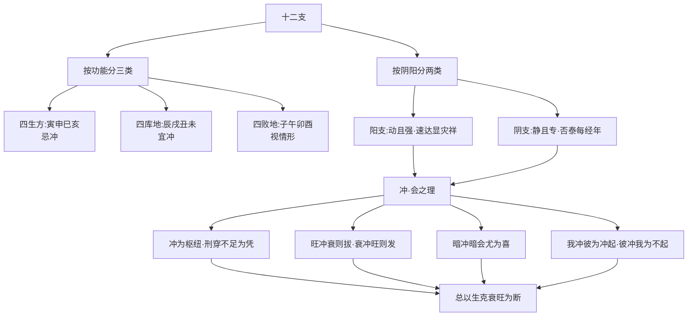

# 地支

## 阳动阴静：地支性情之别

> 【原文】阳支动且强，速达显灾祥；阴支静且专，否泰每经年。
>
> 【原注】子、寅、辰、午、申、戌，阳也，其性动，其势强，其发至速，其灾祥至显；丑、卯、巳、未、酉、亥，阴也，其性静，其气专，发之不速，而否泰之验，每至经年而后见。

首句立定十二支之纲——**子寅辰午申戌为阳支（动且强），丑卯巳未酉亥为阴支（静且专）**。这是地支论的总判据。

- **阳支**：动而势强，吉凶之验**「速达」「立显」**；
- **阴支**：静而气专，吉凶之应**「经年而后见」**。

这一区别在实操中意义重大：原局或行运遇阳支受冲克，吉凶**当年可见**；阴支受冲克，吉凶**累积数年方显**。

> 【任氏曰】地支有以子至巳为阳，午至亥为阴者，此从冬至阳生、夏至阴生论；有以寅至未为阳，申至丑为阴者，此分木火为阳，金水为阴也。命家以子、寅、辰、午、申、戌为阳，丑、卯、巳、未、酉、亥为阴。若子从癸、午从丁，是体阳而用阴也；巳从丙，亥从壬，是体阴而用阳也。分别取用，亦惟刚柔健顺之理，与天干无异，但生克制化，其理多端，盖一支所藏或二干，或三干故耳。然以本气为主，寅必先甲而后及丙，申必先庚而后及壬，余支皆然。阳支性动而强，吉凶之验恒速；阴支性静而弱，祸福之应较迟。在局在运，均以此意消息之。

任氏列出地支分阴阳的**三套体系**——

- **冬至阳生、夏至阴生**：子至巳为阳、午至亥为阴（按节气阴阳划分）；
- **木火为阳、金水为阴**：寅至未为阳、申至丑为阴（按五行划分）；
- **命家通用**：子寅辰午申戌为阳、丑卯巳未酉亥为阴（按**地支本身的奇偶与排列**分）。

任氏特别提出「体用」之分——**子从癸（阴干）、午从丁（阴干），是体阳而用阴；巳从丙（阳干）、亥从壬（阳干），是体阴而用阳**。这一辨别是后续论「冲」的关键铺垫——阳支藏阴干用、阴支藏阳干用，决定了「冲」的能量方向。

「寅必先甲而后及丙，申必先庚而后及壬，余支皆然」——**支藏天干以本气为主**，寅之本气为甲、申之本气为庚，余气（如寅中丙戊、申中壬）次之。

## 生方怕动、库宜开

> 【原文】生方怕动库宜开，败地逢冲仔细推。
>
> 【原注】寅、申、巳、亥生方也，忌冲动；辰、戌、丑、未四库也，宜冲开。子、午、卯、酉四败也，有逢合而喜冲者，不若生地之必不可冲也；有逢冲而喜合者，不若库地之必不可闲也。须仔细详之。

原注把十二支按功能分三类——

| 类别 | 地支 | 喜忌 |
| --- | --- | --- |
| **四生方** | 寅申巳亥 | 忌冲——长生之地，冲则动根不安 |
| **四库地** | 辰戌丑未 | 宜冲——收藏之地，冲则开库启物 |
| **四败地** | 子午卯酉 | 视情形而定——「有逢合而喜冲」「有逢冲而喜合」 |

「四生方不可冲」是铁律，「四库地不可闲（不冲）」也是铁律，「四败地」则需细看。

> 【任氏曰】旧说云，金水能冲木火，木火不能冲金水，此论天干则可，论地支则不可。盖地支之气多不专，有他气藏在内也。须看他气乘权得势，即木火亦岂不能冲金水乎？生方怕动者，两败俱伤也。假如寅申逢冲，申中庚金，克寅中甲木，寅中丙火，未尝不克申中庚金；申中壬水，克寅中丙火，寅中戊土，未尝不克申中壬水。战克不静故也。库宜开者，然亦有宜不宜，详在杂气章中。败地逢冲仔细推者，子、午、卯、酉之专气也，用金水则可冲，用木火则不可冲。然亦须活看，不可执一。倘用春夏之金水，则金水之气休囚，木火之势旺相，金水岂不反伤乎？宜参究之。

任氏破「金水能冲木火、木火不能冲金水」之旧说——**地支藏干复杂，气不专一，木火得势亦能冲金水**。

「生方怕动，两败俱伤」——寅申逢冲时，申中庚克寅中甲、寅中丙亦克申中庚，**互相克伐**，两败俱伤。

「库宜开，亦有宜不宜」——库（辰戌丑未）是否宜冲，要看杂气（所藏之物）是否得用。

「败地逢冲」则更需细看——**用金水则喜冲四败（子午卯酉），用木火则忌冲**；若时令为春夏、金水休囚，则金水冲四败反受其伤。

### 命造一（任氏曰第1例）：甲寅 壬申 癸巳 癸亥——生方逢冲之祸

> 【命造一（任氏曰第1段）】甲寅 壬申 癸巳 癸亥
>
> 癸酉 甲戌 己亥 丙子 丁丑 戊寅 己卯 庚辰
>
> 秋水通源，金当令，水重重，木囚逢冲，不足为用。火虽休而紧贴日支，况秋初余气未息，用神必在巳火。巳亥逢冲，群劫纷争，所以连克三妻，无子。兼之运走北方水地，以致破耗异常；至戊寅己卯，运转东方，喜用合宜，得其温饱；庚运制伤生劫，又逢酉年，喜用两伤，不禄。

**命局结构**——年甲寅、月壬申、日癸巳、时癸亥。天干甲壬癸癸，地支寅、申、巳、亥。

**格局分析**——

- **癸水日主**，生于申月（秋金当令），「秋水通源」——金生水，壬癸水重重；
- **木囚逢冲**：寅中甲木为水之泄（食伤），但寅申一冲，**甲木被庚金所克**，「不足为用」；
- **用神在巳**：火虽休囚（秋金当令、火休），但「紧贴日支」，**巳火为调候用神**；
- **巳亥逢冲**：巳（用神）与亥（时支）相冲，**「群劫纷争」**——亥中壬甲冲巳中丙戊，**用神受伤**。

**任氏判语**——「连克三妻，无子」是「用神受伤」的直观反映（妻星为财、巳中丙火为财，财被冲则克妻；亥中壬水为劫，劫夺食伤则无子）。运走北方水地（亥子丑）加重水势，**「破耗异常」**。至戊寅己卯运，转东方木地，**「喜用合宜」**（木泄水生火），方得温饱。庚运制伤（克甲木食神）生劫（生壬癸水），**「喜用两伤」**，故庚运逢酉年不禄（亡）。

### 命造二（任氏曰第2例）：癸巳 癸亥 甲寅 壬申——生方合救之妙

> 【命造二（任氏曰第2段）】癸巳 癸亥 甲寅 壬申
>
> 壬戌 辛酉 庚申 己未 戊午 丁巳
>
> 甲寅日元，生于孟冬，寒木必须用火。柱中四逢旺水伤用，无土砥定，似乎不美，妙在寅亥临合，巳火绝处逢生，此即兴发之机。然初运西方金地，有伤体用，碌碌风霜，奔驰未遇；四旬外运转南方火土之地，助起用神，弃印就财，财发数万，娶妾，连生四子。由是观之，印绶作用，逢财为祸不小，不如就财，发福最大。

**命局结构**——年癸巳、月癸亥、日甲寅、时壬申。天干癸癸甲壬，地支巳、亥、寅、申。

**格局分析**——

- **甲寅日主**，生于亥月（孟冬十月），**「寒木必须用火」**；
- **柱中四逢旺水**：癸、亥、癸、壬皆水（亥藏壬甲），水势伤火（用神）；
- **无土砥定**：缺土制水，**「似乎不美」**；
- **「妙在寅亥临合」**：寅亥六合木（甲木长生在亥），**亥中壬水被寅合而化**，水势减缓；
- **「巳火绝处逢生」**：巳为甲木之禄，巳中丙火虽处绝地（按：巳中丙火在亥月为「绝」），但得寅木之生，**有救**。

**任氏判语**——寅亥合是此造的关键转折——合化木则水势收、火有源。**初运西方金地**（壬戌、辛酉、庚申、己未），**金来克木**（体）、**生水**（加重水势），**「碌碌风霜、奔驰未遇」**。**四旬外运转南方火土**（戊午、丁巳），**火助起用神、土制旺水**，「弃印就财」（放弃水之印绶用神，转就火土之财），**「财发数万、娶妾、连生四子」**。

**任氏结语**——「印绶作用，逢财为祸不小，不如就财，发福最大」——这是用神取舍的关键论：**印（壬癸水）虽看似生身，但旺水伤用神，反不如用财（火土）之福大**。这是对「印绶必吉」俗见的当头棒喝。

### 命造三（任氏曰第3例）：辛卯 丁酉 戊子 戊午——伤官佩印

> 【命造三（任氏曰第3段）】辛卯 丁酉 戊子 戊午
>
> 丙申 乙未 甲午 癸巳 壬辰 辛卯
>
> 伤官用印，喜神即是官星，非俗论土金伤官忌官星也。卯酉冲，则印绶无生助之神；子午冲，使伤官得以肆逞。地支金旺水生，木火冲克已尽，天干火土虚脱，以致读书未遂，碌碌经营。然喜水不透，为人文采风流，精于书法。更兼中运天干金水，未免有志难伸。凡伤官佩印喜用在木火者，忌见金水也。

**命局结构**——年辛卯、月丁酉、日戊子、时戊午。天干辛丁戊戊，地支卯、酉、子、午。

**格局分析**——

- **戊土日主**，生于酉月（土金伤官月令）；
- **伤官用印**：伤官为金（辛、酉），印为火（丁、午），**土金伤官佩印**格局；
- **卯酉冲**：印绶（丁火）之根在卯（卯中乙木生丁），**卯酉一冲，丁火之根被拔**——**「印绶无生助之神」**；
- **子午冲**：伤官（子中癸水，子为戊土之伤）与日支午冲，**「伤官得以肆逞」**——按：此处任氏以伤官论子水（戊土伤官为壬癸水），子冲午则水火交战，**伤官无制**。

**任氏判语**——「非俗论土金伤官忌官星也」——破「土金伤官忌见官」之俗论。**此造喜神即官星**（按：丁火印绶兼作官星之根，卯木为财生官）。木火冲克已尽（卯酉冲、子午冲），**「天干火土虚脱」**，故读书未遂、碌碌经营。

「更兼中运天干金水（丙申、乙未、甲午、癸巳、壬辰、辛卯多金水运），**有志难伸**」——**金水为伤官之党、印绶之敌**，行金水运加重伤官肆逞。

**任氏结语**——「凡伤官佩印喜用在木火者，忌见金水也」——这是伤官佩印格局的总诀。

### 命造四（任氏曰第4例）：辛未 辛丑 戊辰 壬戌——四库纯清

> 【命造四（任氏曰第4段）】辛未 辛丑 戊辰 壬戌
>
> 庚子 己亥 戊戌 丁酉 丙申 乙未
>
> 此造非支全四库之美，所喜者辛金吐秀，丑中元神透出，泄其精英，更妙木火伏而不见，纯清不混。至酉运，辛金得地，中乡榜；后因运行南方，木火并旺，用神之辛金受伤，由举而进，而不能选。

**命局结构**——年辛未、月辛丑、日戊辰、时壬戌。天干辛辛戊壬，地支未、丑、辰、戌。

**格局分析**——

- **戊土日主**，四支辰戌丑未皆土库，**「支全四库」**；
- **丑中元神（辛金）透出**：丑藏辛癸己，辛金（食神）透出年干与月干，**「辛金吐秀」**；
- **木火伏而不见**：四柱无木火透干，**「纯清不混」**；
- **用神辛金**：食神泄秀为用。

**任氏判语**——至酉运（西方金地），**辛金得禄（酉为辛金禄地）**，**「中乡榜」**。后行南方火地（丁酉、丙申、乙未），**木火并旺、克伤辛金用神**，故「由举而进，而不能选」——考中举人但进士未中（按：明清科举，乡试中举、会试中进士，「举而不能选」即中举未中进士）。

**任氏用意**——此造虽「支全四库」名似壮观，但任氏明言「非支全四库之美」——**「支全四库」不是用神，要看所藏之神能否透出为用**。丑中辛金透出方是用神。

### 命造五（任氏曰第5例）：戊辰 壬戌 辛未 己丑——四库宜冲之谬

> 【命造五（任氏曰第5段）】戊辰 壬戌 辛未 己丑
>
> 癸亥 甲子 乙丑 丙寅 丁卯 戊辰
>
> 此满局印绶，土重金埋，壬水用神伤尽，未辰虽藏乙木无冲，或可借用，以待运来引出，乃被丑戌冲破，藏金暗相砍伐，以至克妻无子。由此论之，四库必要冲者，执一之论也，全在天干调剂得宜，更须用神有力，岁运辅助，庶无偏枯之病也。

**命局结构**——年戊辰、月壬戌、日辛未、时己丑。天干戊壬辛己，地支辰、戌、未、丑。

**格局分析**——

- **辛金日主**，四支皆土（辰戌丑未），**「满局印绶」**——土生金为印，印绶太重则「土重金埋」；
- **壬水用神伤尽**：壬水（食神）被厚土所克，**「用神伤尽」**；
- **未辰藏乙木**：未中乙木、辰中乙木本为**财星（印所克者）**，可作壬水之原神（乙木生壬水）；
- **丑戌冲破**：丑戌相冲，**藏金被冲、暗相砍伐**——按：丑中藏辛、癸、己，戌中藏辛、丁、戊，丑戌一冲，**金（辛）被冲、藏金受损**，**乙木之库被开而库中金被破坏**。

**任氏判语**——「克妻无子」是「满局印绶 + 财星受伤」的直接反映（妻星为财、财被冲则克妻；印太重则克子）。

**任氏总结**——「四库必要冲者，执一之论也」——前文「库宜开」是常理，但**此造丑戌冲反成祸**，证「四库宜冲」不是铁律。**「全在天干调剂得宜」**——**用神是否有力、岁运是否配合**，才是判定吉凶的关键。

## 支神以冲为重，刑穿不动

> 【原文】支神只以冲为重，刑与穿兮动不动
>
> 【原注】冲者必是相克，及四库兄弟之冲，所以必动；至于刑穿之间，又有相生相合者存，所以有动不动之异

原注辨「冲」「刑」「穿」三者的动静之别——

- **冲**：必动（相克或四库相冲）；
- **刑穿**：动静不定（有相生相合者存）。

> 【任氏曰】地支逢冲，犹天干之相克也，须视其强弱喜忌而论之。至于四库之冲，亦有宜不宜，如三月之辰，乙木司令，逢戌冲，则戌中辛金，亦能伤乙木；六月之未，丁火司令，逢丑冲，则丑中癸水，亦能伤丁火。按三月之乙、六月之丁，虽属退气，若得司令，竟可为用，冲则受伤，不足用矣。所谓暮库逢冲则发者，后人之谬也。暮者，坟暮之意；库者，木火金水收藏埋根之地，譬如得气之坟，未开动而发福者也。
>
> 如木火金水之天干，地支无寅、卯、巳、午、申、酉、亥、子之禄旺，全赖辰戌丑未之身库通根，逢冲则微根拨尽，未有冲动而强旺者也。如不用司令，以土为喜神，冲之有益无损，盖土动则发生矣。刑之义无所取，如亥刑亥、辰刑辰、酉刑酉、午刑午，谓之自刑，本支见本支，自谓同气，何以相刑？子刑卯，卯刑子，是谓相生，何以相刑？戌刑未，未刑丑，皆为土气，更不当刑。寅刑巳，亦是相生，寅申相刑，即冲何必再刑？又曰子卯一刑也，寅巳申二刑也，丑戌未三刑也，故称三刑，又有自刑，此皆俗谬，姑置之。穿，即害也，六害由六合而来，冲我合神，故为之害，如子合丑而未冲，丑合子而午冲之类。子未之害，无非相克，丑午寅亥之害，乃是相生，何以为害？且刑既不足为凭，而害之义，尤为穿凿。总以论其生克为是，至于破之义，非害即刑也，尤属不经，削之可也

任氏把命理界流传已久的「三刑」「六害」之说，**几乎全盘否定**——

- **破「暮库逢冲则发」**：「后人之谬也」——库是「得气之坟」，**不是开动而发福**。若天干无禄旺在地支（如甲木无寅卯），全赖库中余气通根，逢冲则「微根拨尽」，**未有冲动而强旺者**。
- **破「三刑」**：亥亥、辰辰、酉酉、午午是**自刑**——本支见本支是同气，何以相刑？子卯是**相生**（水生木），何以相刑？戌未、丑未是**土气同类**，不当刑。寅巳是**相生**（木生火），寅申是**相冲**，「即冲何必再刑」？任氏直斥「子卯一刑、寅巳申二刑、丑戌未三刑」之说为**「俗谬，姑置之」**。
- **破「六害」**：子未、丑午、寅亥之害多是**相生或相克**而非真「害」，**「害之义，尤为穿凿」**。
- **破「破」**：破不是独立的概念，**「非害即刑」**，「尤属不经，削之可也」。

**任氏立场**——**论地支之动，只看「冲」与「生克」足矣；「刑」「害」「破」皆不足为凭**。这是对命理界几百年传承的「三刑六害」体系的根本性挑战。

### 命造六（任氏曰第6例）：丙子 辛卯 壬子 癸卯——子卯相刑之谬

> 【命造六（任氏曰第6段）】丙子 辛卯 壬子 癸卯
>
> 壬辰 癸巳 甲午 乙未 丙申 丁酉
>
> 壬子日元，支逢两刃，干透癸辛，五行无土，年干丙火临绝，合辛化水，最喜卯旺提纲，泄其菁英，能化劫刃之顽。秀气流行，为人恭而有礼，和而中节。至甲运，木之元神发露，科甲连登；午运得卯木泄水生火，及乙未丙运，官至郡守，仕途平顺。以俗论之，子卯为无礼之刑，且伤官羊刃逢刑，必至傲慢无礼，凶恶多端矣。

**命局结构**——年丙子、月辛卯、日壬子、时癸卯。天干丙辛壬癸，地支子、卯、子、卯。

**格局分析**——

- **壬子日主**，支逢子卯子卯，**「支逢两刃」**（按：子为壬水之羊刃，月时卯木为劫财之刃——此处任氏以刃为子卯合木所成之旺木而言）；
- **干透癸辛**：癸为劫财、辛为食神；
- **五行无土**：缺土制水通关；
- **年干丙火临绝、合辛化水**：丙火在子月为「绝」，丙辛合化水——**「无土则火被合而化水」**，看似无火可救；
- **「最喜卯旺提纲」**：卯为月令（仲春），**卯木当令泄水生火**——按五行，水生木、木生火，**卯木是水之泄（食伤）、火之根**。

**任氏判语**——「秀气流行，为人恭而有礼，和而中节」——这是「子卯相生」（水生木）流通有情的吉象。

至甲运（甲木透出），**「木之元神发露」**——卯木在月令又遇甲木透干，**食伤泄秀成格**——**「科甲连登」**（接连考中）。午运得卯木泄水生火（卯午破，子午冲但子中癸水在午运得火制），**「官至郡守」**。乙未、丙运继续火木之乡，**「仕途平顺」**。

**任氏破俗**——「以俗论之，子卯为无礼之刑，且伤官羊刃逢刑，必至傲慢无礼，凶恶多端矣」——按「子卯相刑」之俗说，此造必为凶恶之徒；**然任氏以实战证其谬**：此造实为**恭而有礼、和而中节、科甲联登、官至郡守**之贵格。**「子卯相刑」之俗说，与事实完全相反。**

### 命造七（任氏曰第7例）：辛未 乙未 庚辰 丁亥

> 【命造七（任氏曰第7段）】辛未 乙未 庚辰 丁亥
>
> 甲午 癸巳 壬辰 辛卯 庚寅 己丑
>
> 庚辰日元，生于季夏，金进气，土当权，喜其丁火司令，元神发露而为用神，能制辛金之劫。未为火之余气，辰乃木之余气，财官皆通根有气，更妙亥水润土养金而滋木，四柱无缺陷。运走东南，金水虚，木火实，一生无凶无险。辰运午年，财、印皆有生扶，中乡榜，由琴堂而迁司马。寿至丑运。

**命局结构**——年辛未、月乙未、日庚辰、时丁亥。天干辛乙庚丁，地支未、未、辰、亥。

**格局分析**——

- **庚辰日主**，生于未月（季夏六月），**「金进气、土当权」**；
- **丁火司令**：未月丁火当令（按：未中藏己丁乙，丁火为月令本气之一），**「元神发露而为用神」**——丁火为正官，**制辛金之劫**（按：辛金为劫财，丁火克辛护庚）；
- **未为火之余气**：未中藏丁火之余；
- **辰为木之余气**：辰中藏乙木之余；
- **财官皆通根**：财（乙木）根在未、辰，官（丁火）根在未——**「皆通根有气」**；
- **亥水润土养金滋木**：亥中壬水克火（不利官星）但亦润土养金滋木——**「四柱无缺陷」**。

**任氏判语**——运走东南（甲午、癸巳、壬辰、辛卯、庚寅、己丑多为东南木火地），**「金水虚、木火实」**，**「一生无凶无险」**。**辰运午年**（运走辰、年走午），财、印皆生扶（午火生土、辰土蓄水），**「中乡榜」**。「由琴堂而迁司马」——按：明清职官，「琴堂」指县令（古县令称「琴堂」），**「司马」指州府佐官或府学教授**（明清「司马」常作兵备道或知州别称），即由县令升任州府佐官。**寿至丑运**（丑运为西北金水地，庚金得禄，寿元延续）。

### 命造八（任氏曰第8例）：辛丑 乙未 庚辰 丁丑——丑未冲之辨

> 【命造八（任氏曰第8段）】辛丑 乙未 庚辰 丁丑
>
> 甲午 癸巳 壬辰 辛卯 庚寅 己丑
>
> 此与前造大同小异，财官亦通根有气，前则丁火司令，此则己土司令。更嫌丑时，丁火熄灭，则年干辛金肆逞，冲去未中木火微根，财官虽有若无。初运甲午，木火并旺，荫庇有余；一交癸巳，克丁拱丑，伤劫并旺，刑丧破耗；壬辰运，妻子两伤，家业荡然无存，削发为僧。以俗论之，丑未冲开财官两库，名利两全也。

**命局结构**——年辛丑、月乙未、日庚辰、时丁丑。天干辛乙庚丁，地支丑、未、辰、丑。

**格局分析**（与命造七对照）——

- **庚辰日主**，**「己土司令」**（月令未土中己土为月令本气，丁火为余气，故己土司令而非丁火）；
- **丁火熄灭**：时支丑，丑中癸水晦丁火，**丁火被伤**；
- **辛金肆逞**：年干辛金为劫财，**丁火既伤则辛金无制，劫财肆逞**；
- **丑未冲**：年支丑与月支未相冲，**「冲去未中木火微根」**——未中乙木（财）、丁火（官）被冲而散。

**任氏判语**——「财官虽有若无」——乙木（财）、丁火（官）虽透干但根被冲，**名存实亡**。

**运程分析**——

- **初运甲午**：甲木生丁火、午火为丁火之禄，**木火并旺，荫庇有余**；
- **癸巳运**：癸克丁（克官星），巳与丑拱金（巳酉丑三合金局，巳丑半合金），**伤劫并旺**——**「刑丧破耗」**；
- **壬辰运**：壬水劫财、辰为水库，**「妻子两伤、家业荡然」**，最终**「削发为僧」**。

**任氏破俗**——「以俗论之，丑未冲开财官两库，名利两全也」——按「库宜开」之俗说，丑未冲是开财官两库之吉格；**然任氏以实战证其谬**：此造库虽冲开但**财官之根被冲散、用神受伤**、运又逢伤劫之运，**终至削发为僧**。

**任氏用意**——**「库宜开」不是铁律**——开库要看得用之神是否受伤、时令是否得所。**「四库必要冲者，执一之论」**（与前文命造五呼应）。

## 暗冲暗会尤为喜

> 【原文】暗冲暗会尤为喜，彼冲我兮皆冲起
>
> 【原注】如柱中无所缺之局，取多者暗冲暗会，冲起暗神，而来会合暗神，比明冲明会尤佳，子来冲午，寅与戌会午是也。是日为我，提纲为彼；提纲为我，年时为彼；四柱为我，运途为彼；运途为我，岁月为彼。如我寅彼申，申能克寅，是彼冲我；我子彼午，子能克午，是我冲彼。皆为冲起

原注给「暗冲暗会」下定义——

- **暗冲暗会**：四柱本身无冲会之神，**岁运暗来冲会**，比明冲明会更佳（更隐蔽、不露形迹）；
- **「彼冲我」「我冲彼」之分**：日为我、提纲（月令）为彼；或年时为彼；或岁运为彼。

> 【任氏曰】支中逢冲，固非美事，然八字缺陷者多，停匀者少。木火旺，金水必乏矣；金水旺，木火必乏矣。若旺而有余者冲去之，衰而不足者会助之为美。如四柱无冲会之神，得岁运暗来冲会尤为喜也。盖有病得良剂以生也。然冲有彼我之分，会有去来之理。彼我者，不必分年时为彼，日月为我，亦不必分四柱为我，岁运为彼也，总之喜神是我，忌神为彼可也。如喜神是午，逢子冲，是彼冲我，喜与寅戌会为吉；喜神是子逢午冲，是我冲彼，忌寅与戌会为凶。如喜神是子，有申得辰会而来之为吉；喜神是亥，有未得卯会而去之则凶。宁可我去冲彼，不可彼来冲我。我去冲彼，谓之冲起；彼来冲我，谓之不起。水火之冲会如此，余可类推

任氏把「冲」与「会」的吉凶判据理清——

- **「冲起」**（我去冲彼）：我去冲忌神，**吉**；
- **「不起」**（彼来冲我）：忌神来冲喜神，**凶**；
- **「会来」**（申辰会子水来生身）：**吉**；
- **「会去」**（未卯会木散去水局）：**凶**。

**「宁可我去冲彼，不可彼来冲我」**——这是冲的总诀。

### 命造九（任氏曰第8例）：庚戌 乙酉 甲寅 庚午——暗冲破局

> 【命造九（任氏注）】庚戌 乙酉 甲寅 庚午
>
> 丙戌 丁亥 戊子 己丑 庚寅 辛卯
>
> 此造干透两庚，正当秋令，支会火局，虽制杀有功，而克泄并见。且庚金锐气方盛，制之以威，不若化之以德。化之以德者，有益于日主也；制之以威者，泄日主之气也。由此推之，不喜会火局也，反以火为病矣。故子运辰年大魁天下。子运冲破火局，去午之旺神也，引通庚金之性，益我日主之气；辰年湿土，能泄火气，拱我子水，培日主之根源也。

**命局结构**——年庚戌、月乙酉、日甲寅、时庚午。天干庚乙庚，地支戌、酉、寅、午。

**格局分析**——

- **甲寅日主**，生于酉月（秋金当令）；
- **两庚透干**：年干庚、时干庚，**七杀（庚金）重重**；
- **支会火局**：寅午戌三合火方（按：寅午戌本为三合火），**火局制杀**（火克金）——按：火制金有「制之以威」之效；
- **「不若化之以德」**：任氏以人事语言比喻——庚金锐气正盛，**强行克制（制之以威）反泄日主之气**（火制金需木生火、火生土、土生金之循环，循环中木与土皆耗日主），**不如顺势化之**。

**任氏判语**——「不喜会火局也，反以火为病矣」——原局寅午戌会火，**克泄并见**（火克金泄木），**「火为病」**。故子运（戊子运）子冲午、**冲破火局**，**「去午之旺神」**，**「引通庚金之性」**（火不制金则金气顺畅）——**「大魁天下」**（会试第一名——会元/状元）。辰年（戊辰年）湿土泄火、拱子水，**「培日主之根源」**。

**任氏用意**——「暗冲其忌神（火局），暗会其喜神（金气），发福不浅」——前一节判语之具现。

### 命造十（任氏曰第9例）：丁巳 癸丑 丁卯 丙午——暗冲暗会之祸福

> 【命造十（任氏注）】丁巳 癸丑 丁卯 丙午
>
> 壬子 辛亥 庚戌 己酉 戊申 丁未
>
> 丁火虽生季冬，比劫重重，癸水退气，无力制劫，不足为用。必以丑中辛金为用，得丑土包藏，泄劫生财，为辅用之喜神也。所嫌者，卯木生劫夺食为病，以致早年妻子刑伤。初运壬子辛亥，暗冲巳午之火，荫庇有余。庚戌运暗来拱合午火，刑伤破耗；至己酉会金局冲去卯木之病，财发十余万。由此观之，暗冲其忌神，暗会其喜神，发福不浅；暗冲其喜神，暗会其忌神，为祸非轻。暗冲暗会之理，其可忽乎？

**命局结构**——年丁巳、月癸丑、日丁卯、时丙午。天干丁癸丁丙，地支巳、丑、卯、午。

**格局分析**——

- **丁火日主**，生于丑月（季冬十二月）；
- **比劫重重**：年干丁、时干丙，**比肩劫财多**；
- **癸水退气**：癸水（正官）在丑月为「墓」——**无力制劫**；
- **丑中辛金为用**：丑中藏辛癸己，**辛金（偏财）可用**——**「泄劫生财」**（金泄火之劫、生水之财——按：金生水为财之原神）；
- **卯木为病**：卯木生丁火之劫（卯中乙木生丁），**「生劫夺食」**——按：卯木泄水、夺食（食神为火所生），故卯为病。

**任氏判语**——「初运壬子、辛亥：暗冲巳午之火」——壬子、辛亥运中，运支子冲午（暗冲）、运干壬癸水冲丁丙火，**火受冲则劫减**——**「荫庇有余」**。

「庚戌运：暗来拱合午火」——戌与午半合火（寅午戌三合火，午戌半合），**午火被拱旺则劫财肆逞**——**「刑伤破耗」**。

「己酉运：会金局冲去卯木之病」——己酉运，**酉与原局丑半合金局**（按：巳酉丑三合金局之半合），**金旺冲卯**——**「冲去卯木之病」**，**「财发十余万」**。

**任氏总结**——「暗冲其忌神，暗会其喜神，发福不浅；暗冲其喜神，暗会其忌神，为祸非轻」——**这是暗冲暗会一节的总诀**。

### 命造十一（任氏曰第10例）：庚寅 辛巳 丙寅 辛卯——暗冲之双面

> 【命造十一（任氏注）】庚寅 辛巳 丙寅 辛卯
>
> 壬午 癸未 甲申 乙酉 丙戌 丁亥
>
> 丙火生于孟夏，地支两寅一卯，巳火乘权，引出寅中丙火，天干虽逢庚辛，皆虚浮无根。初运壬午癸未无根之水，能泄金气，地支午未南方，又助旺火，财之气克泄已尽，祖业虽丰，刑丧早见。甲运临申，本无大患，因流年木火，又刑妻克子，家计萧条。一交申字，暗冲寅木之病，天干浮财通根，如枯苗得雨，勃然而兴。及乙酉十五年，自财数倍于祖业，申运驿马逢财，出外大利，经营得财十余万。丙戌运丙子年，凶多吉少，得风疾不起，比肩争财，乃临绝地，子水不足以克火，反生寅卯之木故也。

**命局结构**——年庚寅、月辛巳、日丙寅、时辛卯。天干庚辛丙辛，地支寅、巳、寅、卯。

**格局分析**——

- **丙火日主**，生于巳月（孟夏四月），**「巳火乘权」**；
- **两寅一卯**：寅中藏甲丙戊，卯中藏乙，**寅卯辰东方木局之势**（虽缺辰，三支合东方木）；
- **天干庚辛虚浮无根**：庚辛金在地支无根（按：寅中藏甲丙戊无金，巳中藏丙戊庚只有巳中戊土余气藏庚）——**金虚**；
- **「财之气克泄已尽」**：木（寅卯）为火之食伤泄气，**「财之气」（金）被克泄**。

**任氏判语**——

- **初运壬午癸未**：壬癸水泄庚辛金之气，**金更弱**；午未南方火地**助火势**——**「祖业虽丰、刑丧早见」**；
- **甲运临申**：甲木为食神、申金为财，**本无大患**；但流年遇木火（甲运多木火流年），**「刑妻克子、家计萧条」**；
- **一交申运（甲申运）**：申与原局寅相冲，**「暗冲寅木之病」**——按：寅中甲木为食伤、丙火为比肩，**寅木被冲则食伤（泄气）减**——**「天干浮财通根」（庚辛金得申中庚壬为根）**——**「如枯苗得雨，勃然而兴」**；
- **乙酉运十五年**：乙木食神、酉金财星，**「自财数倍于祖业」**。**「申运驿马逢财」**（按：申为驿马星，寅申冲为驿马之象），**「出外大利、经营得财十余万」**；
- **丙戌运丙子年**：丙火比肩争财（按：丙与日主丙同），**「凶多吉少」**；戌为火库、**「得风疾不起」**。**「比肩争财，乃临绝地」**——按：丙火比肩夺财，**子水不足以克火、反生寅卯之木**（子水生寅卯木，木生火），**火势愈旺、财被夺尽**。

**任氏用意**——**申运（冲寅）之发与丙运（争财）之败**，**皆暗冲暗会之双面验证**。

## 旺者冲衰衰者拔，衰神冲旺旺神发

> 【原文】旺者冲衰衰者拔，衰神冲旺旺神发
>
> 【原注】子旺午衰，冲则午拔不能立；子衰午旺，冲则午发而为福。余仿此

原注以子午冲为例——

- **子旺午衰**：冲则**午被拔**（午之根被冲尽）；
- **子衰午旺**：冲则**午发**（午因冲而势增）。

> 【任氏曰】十二支相冲，各支中所藏互相冲克，在原局为明冲，在岁运为暗冲。得令者冲衰则拔，失时者冲旺无伤。冲之者有力，则能去之，去凶神则利，去吉神则不利；冲之者无力，则反激之，激凶神则为祸，激吉神虽不为祸，亦不能获福也。如日主是午，或喜神是午，支中有寅卯巳未戌之类，遇子冲谓衰神冲旺，无伤；日主午，或喜神是午，支中有申酉亥子丑辰之类，遇子冲，谓旺者冲衰则拔。余支皆然。然以子、卯、午、酉、寅、申、巳、亥八支为重，辰、戌、丑、未较轻。如子午冲，子中癸水冲午中丁火，如午旺提纲，四柱无金而有木，则午能冲子；卯酉冲，酉中辛金，冲卯中乙木，如卯旺提纲，四柱有火而无土，则卯亦能冲酉；寅申冲，寅中甲木丙火，被申中庚金壬水所克，然寅旺提纲，四柱有火，则寅亦能冲申矣；巳亥冲，巳中丙火戊土，被亥中甲木壬水所克，然巳旺提纲，四柱有木，则巳亦能冲亥矣。必先察其衰旺，四柱有无解救，或抑冲，或助泄，观其大势，究其喜忌，则吉凶自验矣。至于四库兄弟之冲，其蓄藏之物，看其四柱干支，有无引出。如四柱之干支，无所引出，及司令之神，又不关切，虽冲无害，合而得用亦为喜。原局与岁运皆同此论

任氏把「冲」的吉凶判据系统化——

- **「得令者冲衰则拔」**：冲者得令（旺）能拔去被冲者（衰）；
- **「失时者冲旺无伤」**：冲者失时（衰）冲旺者无伤，反被激怒；
- **「冲之有力则去之」**：冲者有力能去被冲者；**去凶神利，去吉神不利**；
- **「冲之无力则激之」**：冲者无力反被激；**激凶神为祸、激吉神无福**；
- **「日主是午、喜神是午」**：支中见寅卯巳未戌（帮身之同类）遇子冲，**「衰神冲旺无伤」**；支中见申酉亥子丑辰（克泄之异类）遇子冲，**「旺者冲衰则拔」**。

**任氏细分**——子午卯酉、寅申巳亥「八支」为重，辰戌丑未「四库」较轻。八支是「专气」（藏干较纯），四库是「杂气」（藏干较杂）。

### 命造十二（任氏曰第11例）：戊辰 辛酉 丙午 癸巳——旺者冲衰之祸

> 【命造十二（任氏注）】戊辰 辛酉 丙午 癸巳
>
> 壬戌 癸亥 甲子 乙丑 丙寅 丁卯
>
> 此造旺财当令，加以年上食神生助，日逢时禄，不为无根，所以身出富家。时透癸水，巳火失势，逢酉邀而拱金矣。五行无木，全赖午火帮身，则癸水为病明矣。一交子运，癸水得禄，子辰拱水，酉金党子冲午，四柱无解救之神，所谓"旺者冲衰衰者拔"，破家亡身。若运走东南木火之地，岂不名利两全乎？

**命局结构**——年戊辰、月辛酉、日丙午、时癸巳。天干戊辛丙癸，地支辰、酉、午、巳。

**格局分析**——

- **丙午日主**，生于酉月（秋金当令）；
- **「旺财当令」**：酉金（偏财）当令；
- **戊土食神生助**：年干戊土生酉金，**食神生财**；
- **日逢时禄**：时支巳为丙火之禄，**「不为无根」**——按：丙火禄在巳；
- **「身出富家」**：日主有禄、食神生财、偏财当令，**家富**。

**任氏判语**——

- **癸水为病**：时干癸水（正官）克丙火日主，**「癸水为病」**；
- **巳火失势、逢酉邀而拱金**：巳与酉半合金（按：巳酉丑三合金之半合），**巳火被合而失势**——**巳中丙火被金局所困**；
- **五行无木**：无木（食神）通关金水之克；
- **一交子运（壬子运）**：子与辰半合水（申子辰三合水之半合），**「子辰拱水」**——水势加力；**「酉金党子冲午」**——酉与子酉三会西方金、**子冲午**（用神受伤）；**「四柱无解救之神」**——**「旺者冲衰，衰者拔」**，**「破家亡身」**。

**任氏假想**——「若运走东南木火之地，岂不名利两全乎」——若运走东南（甲乙寅卯木、丙丁巳午火），**木生火、火克金护身**，**当为名利两全之造**——**「命好不如运好」**之另一面验证。

### 命造十三（任氏曰第12例）：庚寅 壬午 丁卯 癸卯——衰神冲旺之发

> 【命造十三（任氏注）】庚寅 壬午 丁卯 癸卯
>
> 癸未 甲申 乙酉 丙戌 丁亥 戊子
>
> 此财官虚露无根，枭比当权得势，以四柱观之，贫夭之命。前造身财并旺，反遭破败无寿，此则财官休囚，劫业有寿，不知彼则无木，逢水冲则拔，此则有水，遇火劫有救。至甲申乙酉运，庚金禄旺，壬癸逢生，又冲去寅卯之木，所谓"衰神冲旺旺神发"，骤然发财巨万。"命好不如运好"，信斯言也！

**命局结构**——年庚寅、月壬午、日丁卯、时癸卯。天干庚壬丁癸，地支寅、午、卯、卯。

**格局分析**（与命造十二对照）——

- **丁火日主**，生于午月（夏火当令），**比肩旺**；
- **庚金（正财）虚露无根**：庚金在午月为「死」（按：午中丁火克庚金），**「虚露无根」**；
- **壬癸水（官杀）虚露无根**：壬癸水在午月休囚，**「虚露无根」**；
- **「枭比当权得势」**：寅中藏甲丙戊（甲为食神、丙为劫财），**枭（偏印）比（劫财）当权**；
- **「以四柱观之，贫夭之命」**：按常理论，**财官虚露、枭比当权，**似为贫夭之格。

**任氏判语**——

- **「前造身财并旺反遭破败」**（指命造十二）：命造十二身财并旺，**运走北方子水**反破败；
- **「此则财官休囚，劫业有寿」**（指命造十三）：命造十三财官休囚，但**「有水，遇火劫有救」**——水（壬癸）为火之官杀，**有官杀护身**；
- **至甲申乙酉运**：甲木（食神）制庚金（财）、**庚金禄旺在申**；壬癸水（官杀）逢申金（财生水）生；**申冲寅**——**「冲去寅卯之木」**（寅卯为枭比之根）——**「所谓'衰神冲旺旺神发'」**——按：申为衰（秋金之禄在申但申与日主丁卯相距远），寅卯为旺（寅卯木在午月当令），**衰申冲旺寅卯**——按任氏「衰神冲旺」之理，**被冲之旺神（寅卯木）反而因冲而势发**——然此处「冲去」是消解寅卯之病（枭比），故**凶神被去、喜用（财官）得用**——**「骤然发财巨万」**。

**任氏结语**——「命好不如运好，信斯言也」——这是对「命」「运」关系的精辟总结：命造本身不完美（甚至有贫夭之象），**但行运配合得当**（衰神冲旺去病），**仍能骤然发福**。

## 本篇定位

地支之论，是子平八字实操的关键一环。任铁樵以十二支的「阴阳、动静、生、库、败」四种分类为基，建立「冲为重、刑穿不足为凭」的总判据，再以「旺冲衰拔、衰冲旺发」「暗冲暗会尤为喜」两套口诀，把「冲」与「会」在原局与岁运中的吉凶辨清。

**本篇的核心方法论意义在于**——地支之论不是「看冲」「看合」「看刑」各立一派，而是**「以本气为主、以冲为枢纽、以衰旺为权衡」**的一贯之理。「暮库逢冲则发」「子卯相刑为无礼」「三刑六害为定数」之类的俗说，**在任氏的实战验证下几乎全部破产**。

**本篇为《滴天髓》上篇通神论系列之一，专论十二地支之「动与用」**。任铁樵一面以十二支的「生、库、败」三类展开「冲」「会」的吉凶之理，一面以「刑穿不足为凭」「暗冲暗会尤为喜」「旺冲衰拔、衰冲旺发」三层口诀，把地支论的实操从「形迹之说」拉回「衰旺权衡」。十三命造之证，多面证验「冲」之双面性——**冲忌神为吉、冲喜神为凶；衰冲旺为发、旺冲衰为拔**——一以贯之。
