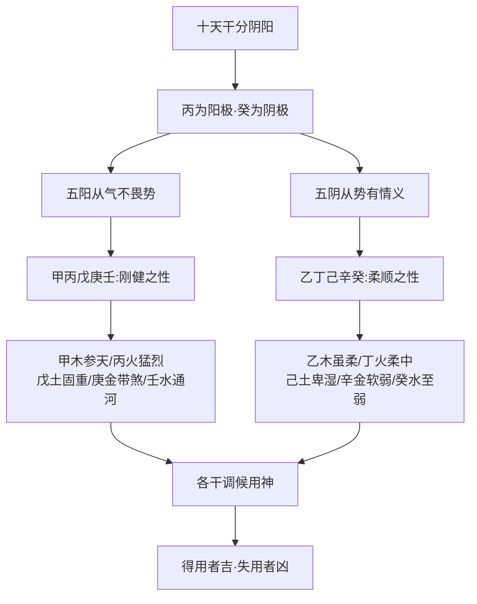

# 天干

## 五阳五阴之理

> 【原文】五阳皆阳丙为最，五阴皆阴癸为至。
>
> 【原注】甲、丙、戊、庚、壬为阳，独丙火秉阳之精，而为阳中之阳；乙、丁、己、辛、癸为阴，独癸水秉阴之精，而为阴中之阴。

首句以两句对仗立定十干之纲：**丙为阳之极，癸为阴之极**。原注指出十天干分阴阳，丙为阳干之最（阳中之阳），癸为阴干之最（阴中之阴）。这个排位并非随意——「丙辛合化水」「戊癸合化火」是后世命理常谈的两组合化，丙为阳极、癸为阴极，正是这两组「阴阳交感」的起点。

> 【任氏曰】丙乃纯阳之火，万物莫不由此而发，得此而敛；癸乃纯阴之水，万物莫不由此而生，得此而茂。阳极则阴生，故丙辛化水；阴极则阳生，故戊癸化火。阴阳相济，万物有生生之妙。

任氏把「阳极」「阴极」从十干排位的抽象概念，落到万物生成论的层面：**丙为「发」之始，癸为「生」之根**。「发而敛」「生而茂」——火主施发、水主润生，但阳极必转阴、阴极必转阳，故「丙辛化水」「戊癸化火」是自然之理（按：丙辛合化水、戊癸合化火，是十干合化中两组有名之合）。

> 【任氏曰】夫十干之气，以先天言之，固一原同出，以后天言之，亦一气相包。甲乙一木也，丙丁一火也，戊己一土也，庚辛一金也，壬癸一水也，即分别所用，不过阳刚阴柔，阳健阴顺而已。窃怪命家作歌为赋，比拟失伦，竟以甲木为梁栋，乙木为花果；丙作太阳，丁作灯烛；戊作城墙，己作田园；庚为顽铁，辛作珠玉；壬为江河，癸为雨露。相沿已久，牢不可破，用之论命，诚大谬也。如谓甲为无根死木，乙为有根活木，同是木而分生死，岂阳木独禀死气，阴木独禀生气乎？又谓活木畏水泛，死木不畏水泛，岂活木遇水且漂，而枯槎遇水反定乎？论断诸干，如此之类，不一而足，当尽避之，以绝将来之谬。

任氏此处做了一件重要工作：把十干重新拉回「一气」论。

- **先天一原，后天一气**：甲乙同属木、丙丁同属火……分开用时只是「阳刚阴柔、阳健阴顺」之别。
- **破斥俗比**：当时命界流行「甲为梁栋、乙为花果」「丙为太阳、丁为灯烛」之类的形物比拟，任氏斥为「比拟失伦」——甲乙同是木，何来「死木」「活木」之分？何以「活木畏水泛」而「死木不畏」？这些比拟是后世歌赋的累积，**用之论命，诚大谬也**。

任氏立下**「同类不分生死」**的铁则——这是对当时命界形物论、当令论的根本纠偏。

## 五阳从气、五阴从势

> 【原文】五阳从气不从势，五阴从势无情义。
>
> 【原注】五阳得阳之气，即能成乎阳刚之势，不畏财杀之势；五阴得阴之气，即能成乎阴顺之义，故木盛则从木，火盛则从火，土盛则从土，金盛则从金，水盛则从水。于情义之所在者，见其势衰，则忌之矣，盖妇人之情也。如此，若得气顺理正者，亦未必从势而忘义，虽从亦必正矣。

原注区分两类禀性——

- **五阳「从气」**：得阳刚之气，便能自守其健，**不畏财官七杀之势**——这是阳干刚健的本分；
- **五阴「从势」**：得阴柔之气，便随外势流转，**见势衰则忌**——但「情义之所在」还有底线，「虽从亦必正」。

> 【任氏曰】五阳气避，光亨之象易观；五阴气翕，包含之蕴难测。五阳之性刚健，故不畏财煞，而有测隐之心，其处世不苟且；五阴之性柔顺，故见势忘义，而有鄙吝之心，其处世多骄谄。是以柔能克制刚，刚不能制克柔也。大抵趋利忘义之徒，皆阴气之为戾也；豪侠慷慨之人，皆阳气之独钟。然尚有阳中之阴、阴中之阳，又有阳外阴内、阴外阳内，亦当辨之。阳中之阴，外仁义而内奸诈；阴中之阳，外凶险而内仁慈；阳外阴内者，包藏祸心；阴外阳内者，秉持直道。此人品之端邪？故不可以不辨。要在气势顺正，四柱五行停匀，庶不偏倚，自无损人利己之心。凡持身涉世之道，趋避必先知人，故云"择其善者而从之"，即此意也。

任氏把「从气/从势」从五行论推到人伦论——

- **阳干人性**：刚健、不畏财煞、有恻隐之心、处世不苟且；
- **阴干人性**：柔顺、见势忘义、有鄙吝之心、处世多骄谄。

「柔能克制刚，刚不能制克柔」——这一句是对前句「五行停匀」的具体注解：阴干之柔能克阳干之刚，但阳干之刚反不能制克阴干之柔，这是阴阳气性的本然之理。

任氏更细分「阳中之阴、阴中之阳、阳外阴内、阴外阳内」四种组合——这是把十干从「阴阳二大类」推到「阴阳之内的细分」，与下文逐干论述首尾相接。

## 甲木参天

> 【原文】甲木参天，脱胎要火。春不容金，秋不容土。火炽乘龙，水宕骑虎。地润天和，植立千古。
>
> 【原注】纯阳之木，参天雄壮。火者木之子也，旺木得火而愈敷荣。生于春则欺金，而不能容金也；生于秋则助金，而不能容土也。寅午戌，丙丁多见而坐辰，则能归；申子辰，壬癸多见而坐寅，则能纳。使土气不干，水气不消，则能长生矣。

**甲木总象**——纯阳之木，体本坚固、参天之势、雄壮之极。其生旺需「脱胎要火」——火为木之子，木旺得火泄秀而愈敷荣。

**四时喜忌**——

| 季节 | 喜忌 | 释义 |
| --- | --- | --- |
| 春 | 不容金 | 春木当令，金来克木，反激其怒——春木已旺，不畏金克；金若来克，木坚金缺 |
| 秋 | 不容土 | 秋木失时，枝叶凋落，根气收敛；土生金泄气，秋土虚薄，反遭木克 |
| 寅午戌全 + 坐辰 | 归 | 火势过旺则焚木，坐辰（辰为水库、湿土）能蓄水泄火 |
| 申子辰全 + 坐寅 | 纳 | 水势过旺则木浮，坐寅（寅为木禄、含火土）能纳水培根 |

> 【任氏曰】甲为纯阳之木，体本坚固，参天之势，又极雄壮。生于春初，木嫩气寒，得火而发荣；生于仲春，旺极之势，宜泄其菁英。所谓强木得火，方化其顽。克之者金，然金属休囚，以衰金而克旺木，木坚金缺，势所必然，故春不容金也。生于秋，失时就衰，但枝叶虽凋落渐稀，根气却收敛下达，受克者土。秋土生金泄气，最为虚薄。以虚气之土，遇下攻之木，不能培木之根，必反遭其倾陷，故秋不容土也。柱中寅午戌全，又透丙丁，不惟泄气太过，而木且被焚，宜坐辰，辰为水库，其土湿，湿土能生木泄火，所谓火炽乘龙也。申子辰全又透壬癸，水泛木浮，宜坐寅，寅乃火土生地，木之禄旺，能纳水气，不致浮泛，所谓水宕骑虎也。如果金不锐，土不燥，火不烈，水不狂，非植立千古而得长生者哉！

任氏把四时宜忌讲透——

- **春金**：「衰金克旺木，木坚金缺，势所必然」——春木正旺，金来克是「以弱攻强」；
- **秋土**：「虚气之土，遇下攻之木，不能培木之根」——秋土本身虚薄（木克土），加之秋金泄土气，土更弱；
- **火炽乘龙**：寅午戌三会火方，木被焚，须坐辰收火；
- **水宕骑虎**：申子辰三合水局，木上浮，须坐寅纳水（寅为甲木禄地，又藏火土）。

「植立千古」之甲木，**「金不锐、土不燥、火不烈、水不狂」**——四行皆要中和，是甲木能「脱胎要火」之根本条件。

## 乙木虽柔

> 【原文】乙木虽柔，刲羊解牛。怀丁抱丙，跨凤乘猴。虚湿之地，骑马亦忧。藤萝系甲，可春可秋。
>
> 【原注】乙木者，生于春如桃李，夏如禾稼，秋如桐桂，冬如奇葩。坐丑未能制柔土，如割宰羊、解割牛然，只要有一丙丁，则虽生申酉之月，亦不胃之；生于子月，而又壬癸发透者，则虽坐午，亦能发生。故益知坐丑未月之为美。甲与寅字多见，弟从兄义，譬之藤萝附乔木，不畏斫伐也。

**乙木总象**——阴木柔顺，随四时而变其形态：春桃李、夏禾稼、秋桐桂、冬奇葩。**无固定体质，唯随所处而化**——这是乙木与甲木的根本区别（甲木「参天雄壮」是不变之象，乙木「随四时」是随顺之象）。

**乙木四诀**——

- **「刲羊解牛」**：乙木生于丑未月，丑未为柔土（湿土），乙木得丑未之培，犹「割宰羊牛」——乙木扎根、得气。
- **「怀丁抱丙，跨凤乘猴」**：乙木生于申酉月（猴、凤为申酉之借喻），天干透丙丁，**食伤生财制杀**——金虽强，丙丁可制。
- **「虚湿之地，骑马亦忧」**：乙木生于亥子月（四柱无丙丁又无戌未燥土），即使年支有午火（马），亦难发荣——「骑马亦忧」。
- **「藤萝系甲」**：天干甲透、地支寅藏，乙木攀附甲木，「弟从兄义」，春秋皆可得助。

> 【任氏曰】乙木者，甲之质，而承甲之生气也。春如桃李，金克则凋；夏如禾稼，水滋得生；秋如桐桂，金旺火制；冬如奇葩，火湿土培。生于春宜火者，喜其发荣也；生于夏宜水者，润地之燥也；生于秋宜火者，使其克金也；生于冬宜火者，解天之冻也。割羊解牛者，生于丑未月，或乙未乙丑日，未乃木库，得以蟠根，丑乃湿土，可以受气也。怀丁抱丙，跨凤乘猴者，生于申酉月，或乙酉日，得丙丁透出天干，有水不相争克，制化得宜，不畏金强。虚湿之地，骑马亦忧者，生于亥子月，四柱无丙丁，又无戌未燥土，即使年支有午，亦难发生也。天干甲透，地支寅藏，此谓藤萝系松柏，春固得助，秋亦合扶，故可春可秋，言四季皆可也。

任氏点出乙木本性——**「甲之质，而承甲之生气」**。乙为阴木，本质仍是木，是甲的「生气」（甲为阳木，乙为阴木，同出一气）。

「割羊解牛」更细的释义——丑为「湿土可受气」，未为「木库可蟠根」。乙丑、乙未日主之所以为美，**因丑未皆可培乙之根**。

## 丙火猛烈

> 【原文】丙火猛烈，欺霜侮雪。能煅庚金，逢辛反怯。土众成慈，水猖显节。虎马犬乡，甲木若来，必当焚灭（一本作虎马犬乡，甲来成灭）。
>
> 【原注】火阳精也，丙火灼阳之至，故猛烈，不畏秋而欺霜，不畏冬而晦雪。庚金虽顽，力能煅之，辛金本柔，合而反弱。土其子也，见戊己多而成慈爱之德；水其君也，遇壬癸旺而显忠节之风。至于未遂炎上之性，而遇寅午戌三位者，露甲木则燥而焚灭也。

**丙火总象**——纯阳之火，猛烈之极，**不畏霜雪**（秋冬之寒不害其势）。

**丙火四性**——

- **欺霜侮雪**：丙火猛烈，秋霜、冬雪皆不畏；
- **能煅庚金、逢辛反怯**：庚金虽顽，丙可煅之；辛金柔弱，丙辛合化水而反怯；
- **土众成慈**：火生土，戊己多则火之气转生土（慈爱之德）；
- **水猖显节**：壬癸旺则丙受制而显节义（按：任氏后文详论）；
- **虎马犬乡（寅午戌）**：三会火方，火势已极，再见甲木生火，则「焚灭」之祸生。

> 【任氏曰】丙乃纯阳之火，其势猛烈，欺霜侮雪，有除寒解冻之功。能煅庚金，遇强暴而施克伐也；逢辛反怯，合柔顺而寓和平也。土众成慈，不凌下也；水猖显节，不援上也。虎马犬乡者，支坐寅午戌，火势已过于猛烈，若再见甲木来生，转致焚灭也。由此论之，泄其威，须用己土；遏其焰，必要壬水；顺其性，还须辛金。己土卑湿之体，能收元阳之气；戊土高燥，见丙火而焦坼矣。壬水刚中之德，能制暴烈之火；癸水阴柔，逢丙火而涸干矣。辛金柔软之物，明作合而相亲，暗化水而相济；庚金刚健，刚又逢刚，势不两立。此虽举五行而论，然世事人情，何莫不然！

任氏阐明丙火「用神」之理——

| 丙火之情 | 所需调候 | 释义 |
| --- | --- | --- |
| 泄其威 | 己土 | 己土卑湿能收丙之元阳 |
| 遏其焰 | 壬水 | 壬水刚中之德能制暴烈之火 |
| 顺其性 | 辛金 | 辛金柔软与丙合化水，阴阳相济 |

任氏同时排比「戊与己」「壬与癸」「庚与辛」在调候丙火时的不同——戊高燥见丙焦坼、己卑湿可纳；壬刚能制、癸弱涸干；辛柔可合、庚刚相敌。这是**同类分两性**的细致判法。

## 丁火柔中

> 【原文】丁火柔中，内性昭融。抱乙而孝，合壬而忠。旺而不烈，衰而不穷，如有嫡母，可秋可冬。
>
> 【原注】丁干属阴，火性虽阴，柔而得其中矣。外柔顺而内文明，内性岂不昭融乎？乙非丁之嫡母也，乙畏辛而辛抱之，不若丙抱甲而反能焚甲木也，不若乙抱丁而反能晦丁火也，其孝异乎人矣。壬为丁之正君也，壬畏戊而丁合之，外则抚恤戊土，能使戊土不欺壬也，内则暗化木神，而使戊土不敢抗乎壬也，其忠异乎人矣。生于秋冬，得一甲木，则倚之不灭，而焰至无穷也，故曰可秋可冬。皆柔之道也。

**丁火总象**——阴火柔中，外柔顺而内文明。**「柔中」二字最吃紧**——与丙火「猛烈」对看，丙为阳之发、丁为阴之藏。

**丁火四德**——

- **抱乙而孝**：乙木为丁之母（按：丁火生乙木之说与「乙为丁之嫡母」之说有内在关系），丁合乙能护乙；辛金克乙时，丁火能制辛护母——「孝」之喻。
- **合壬而忠**：壬水为丁之正官（按：丁壬合木之说），丁合壬能护壬；戊土克壬时，丁合戊使戊不能克壬——「忠」之喻。
- **旺而不烈、衰而不穷**：阴火之性，旺不至赫炎、衰不至熄灭；
- **可秋可冬**：秋冬有甲木（嫡母）透出，则丁有根，**可秋可冬**。

> 【任氏曰】丁非灯烛之谓，较丙火则柔中耳。内性昭融者，文明之象也。抱乙而孝，明使辛金不伤乙木也；合壬而忠，暗使戊土不伤壬水也。惟其柔中，故无太过不及之弊，虽时当乘旺，而不至赫炎；即时值就衰，而不至于熄灭。干透甲乙，秋生不畏金；支藏寅卯，冬产不忌水。

任氏开篇破「丁为灯烛」之俗见（与破「甲为梁栋」「乙为花果」「壬为江河」等俗比同条）。丁与丙之别——**「较丙火则柔中耳」**，一字之别，「柔中」二字画出阴火与阳火的体性差异。

「干透甲乙，秋生不畏金；支藏寅卯，冬产不忌水」——这是丁火调候的总诀：**有甲乙寅卯为根，秋金冬水皆不害**。

## 戊土固重

> 【原文】戊土固重，既中且正。静翕动辟，万物司命。水润物生，火燥物病。若在艮坤，怕冲宜静。
>
> 【原注】戊土非城墙堤岸之谓也，较己特高厚刚燥，乃己土发源之地，得乎中气而且正大矣。春夏则气辟而生万物，秋冬则气翕而成万物，故为万物之司命也。其气属阳，喜润不喜燥，坐寅怕申，坐申怕寅。盖冲则根动，非地道之正也，故宜静。

**戊土总象**——阳土固重，居中得正。**「万物司命」**——春夏气动而辟（生）、秋冬气静而翕（成），是万物生化的主持者。

**戊土四性**——

- **高厚刚燥**：与己土（卑湿）不同，戊为高厚之土；
- **喜润不喜燥**：水润则万物生、火燥则万物病；
- **坐寅怕申、坐申怕寅**：寅申相冲，戊土坐寅或申则根动不安；
- **宜静**：冲则根动，戊土宜静不宜冲。

> 【任氏曰】戊为阳土，其气固重，居中得正。春夏气动而避，则发生，秋冬气静而翕，则收藏，故为万物之司命也。其气高厚，生于春夏，火旺宜水润之，则万物发生，燥则物枯；生于秋冬，水多宜火暖之，则万物化成，湿则物病。艮坤者，寅申之月也。春则受克，气虚宜静；秋则多泄，体薄怕冲。或坐寅申日，亦喜静忌冲。又生四季月者，最喜庚申辛酉之金，秀气流行，定为贵格，己土亦然。如柱见木火，或行运遇之，则破矣。

任氏细化戊土之用——

- **春夏**：火旺，再加燥则物枯，故「宜水润之」；
- **秋冬**：水多，再加湿则物病，故「宜火暖之」；
- **艮（寅）坤（申）月**：春寅月，戊土气虚（春木克土），**宜静**；秋申月，戊土多泄（秋金泄土），**怕冲**。

「四季月（辰戌丑未）最喜庚申辛酉之金」——这是任氏给的一个具体吉格判法：戊（或己）生四季月，天干透庚辛金，**秀气流行定为贵格**。

## 己土卑湿

> 【原文】己土卑湿，中正蓄藏。不愁木盛，不畏水狂。火少火晦，金多金光。若要物旺，宜助宜帮。
>
> 【原注】己土卑薄软湿，乃戊土枝叶之地，亦主中正而能蓄藏万物。柔土能生木，非木所能克，故不愁木盛；土深而能纳水，非水所能荡，故不畏水狂。无根之火，不能生湿土，故火少而火反晦；湿土能润金气，故金多而金光彩，反清莹可观。此其无为而有为之妙用。若要万物充盛长旺，惟土势深固，又得火气暖和方可。

**己土总象**——阴土卑湿，中正蓄藏。与戊土对看——**戊为高厚刚燥，己为卑薄软湿**。任氏谓「己土乃戊土枝叶之地」，一主一副。

**己土四性**——

- **不愁木盛**：柔土能生木（按：木克土之说，己土性柔可顺木之生），不为木克；
- **不畏水狂**：土深能纳水，不为水荡；
- **火少火晦**：无根之火（丁火阴火）不能生湿土，反被己土晦火；
- **金多金光**：湿土能润金，金多反「清莹可观」；
- **物旺需助帮**：要万物旺盛，己土需深固 + 火暖和。

> 【任氏曰】己土为阴湿之地，中正蓄藏，贯八方而旺四季，有滋生不息之妙用焉。不愁木盛者，其性柔和，木藉以培养，木不克也。不畏水狂者，其体端凝，水得以纳藏，水不冲也。水少火晦者，丁火也，阴土能敛火，晦火也。金多金光者，辛金也，湿土能生金，润金也。柱中土气深固，又得丙火去其阴湿之气，更足以滋生万物，所谓宜助宜帮者也。

任氏补充「丙火去其阴湿」的妙用——**己土本湿，得丙火暖之方能滋生万物**。这是与戊土「喜润不喜燥」相反——己土本身即湿，故需要**火来去其阴湿**。

## 庚金带煞

> 【原文】庚金带煞，刚健为最。得水而清，得火而锐。土润则生，土干则脆。能赢甲兄，输于乙妹。
>
> 【原注】庚金乃天上之太白，带杀而刚健。健而得水，则气流而清；刚而得火，则气纯而锐。有水之土，能全其生；有火之土，能使其脆。甲木虽强，力足伐之；乙木虽柔，合而反弱。

**庚金总象**——阳金带煞（「天上之太白」），**刚健为最**。五行之中，金之刚健以庚为最。

**庚金四性**——

- **得水而清**：壬水淘洗庚金之淬厉晶莹；
- **得火而锐**：丁火煅炼庚金之剑戟锋砧；
- **土润则生、土干则脆**：丑辰湿土生庚，未戌燥土使庚脆；
- **能赢甲兄、输于乙妹**：庚克甲为「赢」，庚合乙为「输」（乙庚合金，庚反被乙合而失其刚）。

> 【任氏曰】庚乃秋天肃杀之气，刚健为最。得水而清者，壬水也，壬水发生，引通刚杀之性，便觉淬厉晶莹。得火而锐者，丁火也，丁火阴柔，不与庚金为敌，良冶销熔，遂成剑戟，洪炉煅炼，时露锋砧。生于春夏，其气稍弱，遇丑辰之湿土则生，逢未戌之燥土则脆。甲木正敌，力能伐之；与乙相合，转觉有情。乙非尽合庚而助暴，庚亦非尽合乙而反弱也，宜详辨之。

任氏点出庚金调候之理——

- **壬水淬厉、丁火煅炼**：一清一锐，是庚金成器之关键；
- **春夏气弱**：遇丑辰之湿土生之、忌未戌之燥土脆之；
- **「宜详辨之」**：任氏提醒——乙庚合有「助暴」「反弱」之别，不可一概而论。

## 辛金软弱

> 【原文】辛金软弱，温润而清。畏土之叠，乐水之盈。能扶社稷，能救生灵。热则喜母，寒则喜丁。
>
> 【原注】辛乃阴金，非珠玉之谓也。凡温软清润者，皆辛金也。戊己土多而能埋，故畏之；壬癸水多而必秀，故乐之。辛为丙之臣也，合丙化水，使丙火臣服壬水，而安扶社稷；辛为甲之君也，合丙化水，使丙火不焚甲木，而救援生灵。生于九夏而得己土，则能晦火而存之；生于隆冬而得丁火，则能敌寒而养之。故辛金生于冬月，见丙火则男命不贵，虽贵亦不忠；女命克夫，不克亦不和。见丁男女皆贵且顺。

**辛金总象**——阴金软弱，温润而清。与庚金对看——**庚为刚健、辛为温润**。「非珠玉之谓」是任氏要破的俗见（破「辛为珠玉」之说）。

**辛金四性**——

- **畏土之叠**：戊己土多则埋辛金（按：土重金埋之理）；
- **乐水之盈**：壬癸水多则润金养金；
- **能扶社稷、能救生灵**：辛丙合化水，可制丙护壬（社稷），可制丙护甲（生灵）——这是辛金「有用」之象；
- **热则喜母、寒则喜丁**：九夏得己土晦火存金、隆冬得丁火温水养金。

> 【任氏曰】辛金乃人间五金之质，故清润可观。畏土之叠者，戊土太重，而涸水埋金；乐水之盈者，壬水有余，而润土养金也。辛为甲之君也，丙火能焚甲木，合而化水，使丙火不焚甲木，反有相生之象；辛为丙之臣也，丙火能生戊土，合丙化水，使丙火不生戊土，反有相助之美。岂非扶社稷救生灵乎？生于夏而火多，有己土则晦火而生金；生于冬而水旺，有丁火则温水而养金。所谓热则喜母，寒则喜丁也。

任氏把「扶社稷」「救生灵」两句展开——

- **辛为甲之君**：辛丙合化水，制丙火不伤甲木——**「救生灵」**；
- **辛为丙之臣**：辛丙合化水，制丙火不生戊土——**「扶社稷」**（壬水之官星不被戊土所夺）。

## 壬水通河

> 【原文】壬水通河，能泄金气，刚中之德，周流不滞。通根透癸，冲天奔地。化则有情，从则相济。
>
> 【原注】壬水即癸水之发源，昆仑之水也；癸水即壬水之归宿，扶桑之水也。有分有合，运行不息，所以为百川者此也，亦为雨露者此也，是不可歧而二之。申为天关，乃天河之口，壬水长生于此，能泄西方金气。周流之性，冲进不滞，刚中之德犹然也。若申子辰全而又透癸，则其势冲奔，不可遏也。如东海本发端于天河，复成水患，命中遇之，若无财官者，其祸当何如哉！合丁化木，又生丁火，则可谓有情；能制丙火，不使其夺丁之爱，故为夫义而为君仁。生于九夏，则巳、午、未、申火土之气，得壬水熏蒸而成雨露，故虽从火土，未尝不相济也。

**壬水总象**——阳水通河（天河），**刚中之德、周流不滞**。与癸水对看——**壬为发源（昆仑之水）、癸为归宿（扶桑之水）**。原注说「不可歧而二之」——壬癸虽分，实为一体。

**壬水四性**——

- **能泄金气**：长生在申，申为天关、天河之口，壬水能泄西方金气；
- **刚中周流**：易进而难退，**刚中之德**；
- **通根透癸则泛滥**：申子辰三合水局又透癸，「冲天奔地」；
- **化则有情**：合丁化木（壬丁合），能生丁火，**有情**；
- **从则相济**：生于九夏，火土并旺，壬水「熏蒸而成雨露」——**从火土而不害**。

> 【任氏曰】壬为阳水。通河者，即天河也，长生在申，申在天河之口，又在坤方，壬水生此，能泄西方肃杀气，所以为刚中之德也。百川之源，周流不滞，易进而难退也。如申子辰全，又透癸水，其势泛滥，纵有戊己之土，亦不能止其流，若强制之，反冲激而成水患，必须用木泄之，顺其气势，不至于冲奔也。合丁化木，又能生火，不息之妙，化则有情也。生于四、五、六月，柱中火土并旺，别无金水相助。火旺透干则从火，土旺透干则从土，调和润泽，仍有相济之功也。

任氏补足壬水「用神」之理——

- **泛滥之壬**：申子辰全透癸，水势冲奔，戊己土不能止，**须用木泄之**（顺其气势）；
- **四、五、六月**：火土并旺、别无金水，壬水「从火」「从土」皆有「相济之功」——**从得其所**。

## 癸水至弱

> 【原文】癸水至弱，达于天津。得龙而运，功化斯神。不愁火土，不论庚辛。合戊见火，化象斯真。
>
> 【原注】癸水乃阴之纯而至弱，故扶桑有弱水也。达于天津，随天而运，得龙以成云雨，乃能润泽万物，功化斯神。凡柱中有甲乙寅卯，皆能运水气，生木制火，润土养金，定为贵格，火土虽多不畏。至于庚金，则不赖其生，亦不忌其多。惟合戊土化火也，戊生寅，癸生卯，皆属东方，故能生火。此固一说也，不知地不满东南，戊土之极处，即癸水之尽处，乃太阳起方也，故化火。凡戊癸得丙丁透者，不论衰旺，秋冬皆能化火，最为真也。

**癸水总象**——阴水至弱，「扶桑有弱水」之喻。**「至弱」二字是癸水之纲**——与壬水「刚中周流」对看。

**癸水四性**——

- **达于天津**：癸水随天运行（天津即天河渡口）；
- **得龙而运**：得辰（龙）则能化——「逢龙即化」是癸水调候的关键；
- **不愁火土、不论庚辛**：癸至弱，见火土多即从化；庚辛金不生癸亦不忌癸（金多反浊）；
- **合戊见火、化象斯真**：戊癸合化火，须得丙丁透干（化神透出）方为真化。

> 【任氏曰】癸水非雨露之谓，乃纯阴之水。发源虽长，其性极弱，其势最静，能润土养金，发育万物，得龙而运，变化不测。所谓逢龙即化，龙即辰也，非真龙而能变化也。得辰而化者，化辰之原神发露也，凡十干逢辰位，必干透化神，此一定不易之理也。不愁火土者，至弱之性，见火土多即从化矣；不论庚辛者，弱水不能泄金气，所谓金多反浊，癸水是也。合戊见火者，阴极则阳生，戊土燥厚，柱中得丙火透露，引出化神，乃为真也。若秋冬金水旺地，纵使支遇辰龙，干透丙丁，亦难从化，宜细详之。

任氏点出三个关键点——

- **「癸非雨露」**：破「癸为雨露」之俗见（与「壬为江河」同条）；
- **「逢龙即化」之理**：龙即辰，**十干逢辰位必干透化神**——这是化格成立之硬条件；
- **「秋冬金水旺地难从化」**：即便支遇辰龙、干透丙丁，**若行运至秋冬金水旺地，从化亦难**——这是化格成败的关键判据。

## 本篇定位

十干之论，是子平八字的根基。原注以最简的字句画出丙（阳之极）、癸（阴之极）的纲领，任铁樵则把十干从「形物比拟」（甲为梁栋、壬为江河之类）的俗见中拉回「一气相包、阳刚阴柔」的本然之理，并以「五阳从气、五阴从势」立人伦与五行相通之论，再逐干分述「总象—四时喜忌—调候用神」。

本篇的方法论意义在于：**十干不是孤立的字符，每个天干都有自己的「阴阳之体」与「调候之用」**。命理学的「灵活」在十干这里表现为「同类分阴阳、阴阳各有时」的细致判法，而不在「死守俗比」。

**本篇为《滴天髓》上篇通神论系列之一，专论十天干之「体与用」**。任铁樵一面破「甲为梁栋、丙为太阳」之类的形物俗比，一面以「五阳从气、五阴从势」建立阴阳干的人伦与五行相通之论，再逐干铺陈「总象—四时喜忌—调候用神」三层。十干之论不止是排盘工具，更是论命者观象取用的第一道关口。
