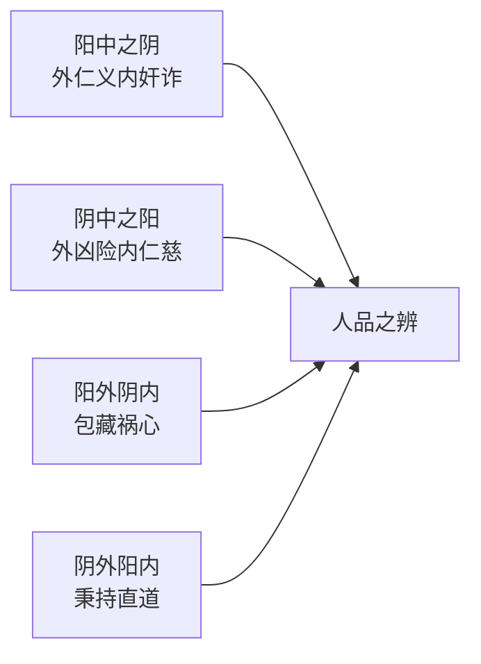

## 阴阳之极与十干统绪

> 【原文】五阳皆阳丙为最，五阴皆阴癸为至。

> 【原注】甲、丙、戊、庚、壬为阳，独丙火秉阳之精，而为阳中之阳；乙、丁、己、辛、癸为阴，独癸水秉阴之精，而为阴中之阴。

> 【任氏曰】丙乃纯阳之火，万物莫不由此而发，得此而敛；癸乃纯阴之水，万物莫不由此而生，得此而茂。
>
> 阳极则阴生，故丙辛化水；阴极则阳生，故戊癸化火。
>
> 阴阳相济，万物有生生之妙。

此节为《滴天髓》论十天干之总纲。原文仅十字「五阳皆阳丙为最，五阴皆阴癸为至」，以最简练的韵语定下全书的极至之位——丙火为五阳之中阳精所聚，癸水为五阴之中阴精所凝。二者并非普通意义上的「最强」「最弱」，而是阴阳两端各趋其极的代表。

原注的贡献在于分类定位：把十天干分为阴阳两队（甲丙戊庚壬为阳，乙丁己辛癸为阴），再各立「最」「至」之标杆——「秉阳之精」「秉阴之精」四字点明丙、癸之所以能居极位，在于其所禀为同气之精粹，而非仅凭数量之多寡。原注克制在分类，未展开化机。

任氏注解较原注有明显的义理推进，可分三层：其一，将丙、癸与万物生化直接对接——「万物莫不由此而发」「万物莫不由此而生」，由此十干由「符号」上升为「生成论」意义上的本体要素；其二，引入「阳极则阴生、阴极则阳生」的辩证机括，并具体落到天干化合——「丙辛化水」「戊癸化火」，这是把抽象的阴阳转化论化为十天干之间可操作的化合机制；其三，以「阴阳相济，万物有生生之妙」一句收束全段，将十干理论由五行生克框架提升到阴阳互根的本体论高度。

「阳极则阴生，故丙辛化水」一语值得留意：丙火虽为阳之极，因其极而能转生阴水；同理癸水虽为阴之极，因其极而能转生阳火。此即后文各干论述中反复出现的「化机」之本——气至于极必反，造化之妙正在此反转之间。

## 批驳旧说比拟之失

> 【原文】夫十干之气，以先天言之，固一原同出；以后天言之，亦一气相包。
>
> 甲乙一木也，丙丁一火也，戊己一土也，庚辛一金也，壬癸一水也，即分别所用，不过阳刚阴柔，阳健阴顺而已。
>
> 窃怪命家作歌为赋，比拟失伦，竟以甲木为梁栋，乙木为花果；丙作太阳，丁作灯烛；戊作城墙，己作田园；庚为顽铁，辛作珠玉；壬为江河，癸为雨露。
>
> 相沿已久，牢不可破，用之论命，诚大谬也。

> 【任氏曰】如谓甲为无根死木，乙为有根活木，同是木而分生死，岂阳木独禀死气，阴木独禀生气乎？又谓活木畏水泛，死木不畏水泛，岂活木遇水且漂，而枯槎遇水反定乎？
>
> 论断诸干，如此之类，不一而足，当尽避之，以绝将来之谬。

此段在《滴天髓》全书中罕见地承担「破」的任务——破斥旧说、立新论。其立论结构清晰：先立本体（「一原同出」「一气相包」），次立判别标准（「阳刚阴柔，阳健阴顺」），再破斥比拟之说（「梁栋花果」「太阳灯烛」等），最后定谳（「用之论命，诚大谬也」）。

破斥的核心对象是当时命理界流行的「以物象比拟十干」之法：甲为梁栋、乙为花果、丙为太阳、丁为灯烛、戊为城墙、己为田园、庚为顽铁、辛为珠玉、壬为江河、癸为雨露。这种比拟之法的根本问题在于「失伦」——把十干之气等同于具体物象的物理属性。原文中两个反问是典型的归谬法：若甲为「无根死木」、乙为「有根活木」，岂非「阳木独禀死气、阴木独禀生气」？若「活木畏水泛、死木不畏水泛」，岂非「活木遇水且漂，枯槎遇水反定」？这两个反问将旧说推到自相矛盾之处，使「气」与「形」的混淆暴露无遗。

此处的破立具有方法论的根本意义：命理研究的对象是「气」而非「形」，因此以具体物象比拟十干必然陷入「拟于不伦」的困境——同样是木，甲乙之别不在「梁栋与花果」之形，而在「阳刚阴柔」之气质差异。这种从「物象论」向「气质论」的转向，是《滴天髓》全书的理论基调，也是其区别于早期命理著作中大量保留物象比喻之法的根本标志。

任氏此节基本承袭原文之破，立场完全一致而无新义之推阐。所补充者主要是论证之扩展与态度之严厉——「不一而足，当尽避之，以绝将来之谬」，语气较原文更为决绝。

| 旧说比拟 | 十干气质正解 |
| --- | --- |
| 甲为梁栋，乙为花果 | 甲乙皆木，阳刚阴柔 |
| 丙作太阳，丁作灯烛 | 丙丁皆火，阳烈阴柔 |
| 戊作城墙，己作田园 | 戊己皆土，阳燥阴润 |
| 庚为顽铁，辛作珠玉 | 庚辛皆金，阳刚阴温 |
| 壬为江河，癸为雨露 | 壬癸皆水，阳刚阴柔 |

此表对比旧说与正论之别，可直观见出「物象」与「气质」两种方法论的分野。

## 五阳从气不从势、五阴从势无情义

> 【原文】五阳从气不从势，五阴从势无情义。

> 【原注】五阳得阳之气，即能成乎阳刚之势，不畏财杀之势；五阴得阴之气，即能成乎阴顺之义。
>
> 故木盛则从木，火盛则从火，土盛则从土，金盛则从金，水盛则从水。
>
> 于情义之所在者，见其势衰，则忌之矣，盖妇人之情也。
>
> 如此，若得气顺理正者，亦未必从势而忘义，虽从亦必正矣。

> 【任氏曰】五阳气辟，光亨之象易观；五阴气翕，包含之蕴难测。
>
> 五阳之性刚健，故不畏财煞，而有恻隐之心，其处世不苟且；五阴之性柔顺，故见势忘义，而有鄙吝之心，其处世多骄谄。
>
> 是以柔能克制刚，刚不能制克柔也。
>
> 大抵趋利忘义之徒，皆阴气之为戾也；豪侠慷慨之人，皆阳气之独钟。
>
> 然尚有阳中之阴、阴中之阳，又有阳外阴内、阴外阳内，亦当辨之：阳中之阴，外仁义而内奸诈；阴中之阳，外凶险而内仁慈；阳外阴内者，包藏祸心；阴外阳内者，秉持直道。此人品之端邪？故不可以不辨。
>
> 要在气势顺正，四柱五行停匀，庶不偏倚，自无损人利己之心。
>
> 凡持身涉世之道，趋避必先知人，故云「择其善者而从之」，即此意也。

此节为全书最富争议亦最见深度之论断。原文仅十字：「五阳从气不从势，五阴从势无情义」，语气斩截，几近武断。然细绎原注与任注，则可见其立论并非简单的「扬阳抑阴」，而是基于「气」与「势」之辨的精细分析。

原注的展开逻辑分四层：其一，阳干因「得阳之气」而能成「阳刚之势」，故不被外在财杀之势所屈服；其二，阴干因「得阴之气」而成「阴顺之义」，故随外势流转；其三，以「木盛则从木，火盛则从火……」的五行排比，把「从势」具体化为五行随旺而从的格局判断依据，这是从「五行流通」角度对「从势」的客观描述；其四，「见其势衰则忌之矣，盖妇人之情也」一句，是把「从势」与「人情」做了类比——人情亦趋利避害、见衰则弃，犹如妇人之情。原注末句「若得气顺理正者，亦未必从势而忘义，虽从亦必正矣」是关键的修正——并非所有阴干皆无情义，关键在「气」是否顺正。

任氏注解较原注有明显的「义理外推」与「义理收束」两端的工作：

义理外推体现在社会伦理层面的延伸——把五阳五阴的「气」之别推广到「人品」：「五阳之性刚健，故有恻隐之心，其处世不苟且；五阴之性柔顺，故有鄙吝之心，其处世多骄谄。」并以「趋利忘义之徒皆阴气之为戾」「豪侠慷慨之人皆阳气之独钟」二句，将「气」之别直接对接为人格高下之别。这种「以气论人」的做法，承自先秦汉魏「气禀论」的传统。

义理收束则体现在「阳中之阴、阴中之阳、阳外阴内、阴外阳内」四类的复杂分疏——任氏承认阴阳并非绝对的二元对立，而是有「中」「外内」之别，因此「外仁义而内奸诈」「外凶险而内仁慈」「包藏祸心」「秉持直道」四种人格类型并存，不可一概而论。这种细分是对原注「盖妇人之情」一类偏激表述的修正与缓和。

任氏最后归到「气势顺正，四柱五行停匀，庶不偏倚，自无损人利己之心」与「择其善者而从之」两层结论——前者是命理操作层面的「中和」要求，后者是修身涉世层面的儒家化引申。这种由「气」至「理」至「人」的层层上推，使本节成为全书最具哲学深度的人性论段落。

需指出：原注与任注中确有「扬阳抑阴」的倾向（「盖妇人之情」「趋利忘义之徒皆阴气之为戾」），但二者并非全无回旋——原注末句、任注中段「阳外阴内」之分疏都体现了对「阴」的客观认知。读者宜将本节理解为「在一般取向上阳主刚正、阴主柔顺」的常态判断，而非绝对褒贬。「阴外阳内者，秉持直道」一句尤其值得玩味——表面凶险而内怀仁慈的阴中之阳，在任氏看来反而是「秉持直道」之象，可见任氏绝非简单扬阳抑阴者。

```mermaid
graph LR
    A[阳中之阴<br>外仁义内奸诈] --> X[人品之辨]
    B[阴中之阳<br>外凶险内仁慈] --> X
    C[阳外阴内<br>包藏祸心] --> X
    D[阴外阳内<br>秉持直道] --> X
```

此图示任氏所揭四种人格类型——四者之别皆在「阳」「阴」之表里配置不同，而不可单以「阳刚阴柔」一概论之。

## 甲木

> 【原文】甲木参天，脱胎要火。春不容金，秋不容土。火炽乘龙，水宕骑虎。地润天和，植立千古。

> 【原注】纯阳之木，参天雄壮。火者木之子也，旺木得火而愈敷荣。
>
> 生于春则欺金，而不能容金也；生于秋则助金，而不能容土也。
>
> 寅午戌，丙丁多见而坐辰，则能归；申子辰，壬癸多见而坐寅，则能纳。
>
> 使土气不干，水气不消，则能长生矣。

> 【任氏曰】甲为纯阳之木，体本坚固，参天之势，又极雄壮。
>
> 生于春初，木嫩气寒，得火而发荣；生于仲春，旺极之势，宜泄其菁英。
>
> 所谓强木得火，方化其顽。
>
> 克之者金，然金属休囚，以衰金而克旺木，木坚金缺，势所必然，故春不容金也。
>
> 生于秋，失时就衰，但枝叶虽凋落渐稀，根气却收敛下达，受克者土。秋土生金泄气，最为虚薄。以虚气之土，遇下攻之木，不能培木之根，必反遭其倾陷，故秋不容土也。
>
> 柱中寅午戌全，又透丙丁，不惟泄气太过，而木且被焚，宜坐辰，辰为水库，其土湿，湿土能生木泄火，所谓火炽乘龙也。
>
> 申子辰全又透壬癸，水泛木浮，宜坐寅，寅乃火土生地，木之禄旺，能纳水气，不致浮泛，所谓水宕骑虎也。
>
> 如果金不锐，土不燥，火不烈，水不狂，非植立千古而得长生者哉！

此节立甲木之体性。先看原文四十字：「甲木参天，脱胎要火」——立其体（纯阳雄壮）与用（火为泄秀之关键）；「春不容金，秋不容土」——按时令定其忌；「火炽乘龙，水宕骑虎」——以格局之变论调候之需；「地润天和，植立千古」——总归中和之境。

原注之解按四层展开：其一，立体——「纯阳之木，参天雄壮」；其二，定用——「火者木之子也，旺木得火而愈敷荣」，点明「脱胎要火」之理在于子星泄秀（命理中「儿」可生财，故火泄木气反使木之精英外显）；其三，按时辨忌——春木旺极，金来克之反被木伤（「欺金」即木强金弱），故不容金；秋木失时，土亦虚薄，培木无力反遭木倾，故不容土；其四，定格局之用——「寅午戌全而坐辰」「申子辰全而坐寅」，是两组具体格局的补救之法。

任氏注解在原注基础上大幅推进，主要体现在三个层次：

一是「分时之详」——把春分为「春初」「仲春」两段。春初木嫩气寒，需火发荣；仲春旺极，宜泄菁英。这种细分较原注「春不容金」笼统之论更为精微。

二是「秋土之解」——任氏对「秋不容土」的解释尤为精彩：「秋土生金泄气，最为虚薄。以虚气之土，遇下攻之木，不能培木之根，必反遭其倾陷。」虚薄的秋土不仅不能扶木，反而会被强木反克致倾，此理若非精研五行生克之机，难以拈出。

三是「火炽乘龙、水宕骑虎」之具体操作——「乘龙」指坐辰，辰为水库湿土，既能泄火又能生木，故火旺之时以辰为救；「骑虎」指坐寅，寅为甲木禄旺之地，能纳水气，故水旺之时以寅为护。这种格局化的补救之法，是命理操作的核心技术。

「地润天和，植立千古」一句，任氏以「金不锐、土不燥、火不烈、水不狂」四不字作解，将「中和」之理落到最具体——任何一行过亢皆非甲木所宜，唯有五行停匀方得「长生」之境。此即《滴天髓》全书之旨：「中和为上」。

## 乙木

> 【原文】乙木虽柔，刲羊解牛。怀丁抱丙，跨凤乘猴。虚湿之地，骑马亦忧。藤萝系甲，可春可秋。

> 【原注】乙木者，生于春如桃李，夏如禾稼，秋如桐桂，冬如奇葩。
>
> 坐丑未能制柔土，如割宰羊、解割牛然，只要有一丙丁，则虽生申酉之月，亦不畏之；生于子月，而又壬癸发透者，则虽坐午，亦能发生。
>
> 故益知坐丑未月之为美。
>
> 甲与寅字多见，弟从兄义，譬之藤萝附乔木，不畏斫伐也。

> 【任氏曰】乙木者，甲之质，而承甲之生气也。
>
> 春如桃李，金克则凋；夏如禾稼，水滋得生；秋如桐桂，金旺火制；冬如奇葩，火湿土培。
>
> 生于春宜火者，喜其发荣也；生于夏宜水者，润地之燥也；生于秋宜火者，使其克金也；生于冬宜火者，解天之冻也。
>
> 割羊解牛者，生于丑未月，或乙未乙丑日，未乃木库，得以蟠根，丑乃湿土，可以受气也。
>
> 怀丁抱丙，跨凤乘猴者，生于申酉月，或乙酉日，得丙丁透出天干，有水不相争克，制化得宜，不畏金强。
>
> 虚湿之地，骑马亦忧者，生于亥子月，四柱无丙丁，又无戌未燥土，即使年支有午，亦难发生也。
>
> 天干甲透，地支寅藏，此谓藤萝系松柏，春固得助，秋亦合扶，故可春可秋，言四季皆可也。

乙木为阴木，原文以「柔」字定其体性，与甲木之「参天雄壮」形成鲜明对比。全文四十字皆围绕「柔」字展开：柔而能「刲羊解牛」（制丑未之柔土），柔而需「怀丁抱丙」（以火为用），柔而「跨凤乘猴」（申酉之月得火则不畏金），柔而「骑马亦忧」（水旺之地无助则忧），柔而「藤萝系甲」（依附甲木则可春可秋）。

原注的贡献在于建立乙木的「四时形象」：春如桃李、夏如禾稼、秋如桐桂、冬如奇葩——四季之喻，既显乙木「柔」之本体，又暗示其「随遇而安」之性。并以「割宰羊、解割牛」喻坐丑未之妙——丑为湿土、未为木库，皆能蓄养乙木之根气；乙木虽柔，坐丑未则能「制柔土」而自立。原注还点出「藤萝附乔木」的意象——甲乙同透，弟从兄义，乙木依附甲木则不畏斫伐。

任氏注解较原注有两层重要推进：

一是「承甲生气」的本体定位——「乙木者，甲之质，而承甲之生气也」。这一定位把乙木从「独立的阴木」提升为「甲之延续」——乙木之本质就是甲木之「质」（材质、形体），同时承载甲木之「生气」（生机、气势）。这是从五行生成论的角度为乙木定性，与一般仅视乙木为「花草之木」的说法划清界限。

二是「四季用神」的系统化——「生于春宜火者，喜其发荣也；生于夏宜水者，润地之燥也；生于秋宜火者，使其克金也；生于冬宜火者，解天之冻也。」春夏秋冬四时之用，任氏皆点明其理。这种系统化的用神论，是命理操作的核心方法。

「虚湿之地，骑马亦忧」一句任氏解得最透：「生于亥子月，四柱无丙丁，又无戌未燥土，即使年支有午，亦难发生也。」亥子为水旺之地，乙木本质柔弱，再加湿土不见，则根气漂浮，纵有午火（马）亦难救——这是从五行气势的全局着眼论乙木之成败。

## 丙火

> 【原文】丙火猛烈，欺霜侮雪。能煅庚金，逢辛反怯。土众成慈，水猖显节。虎马犬乡，甲木若来，必当焚灭（一本作虎马犬乡，甲来成灭）。

> 【原注】火阳精也，丙火灼阳之至，故猛烈，不畏秋而欺霜，不畏冬而晦雪。
>
> 庚金虽顽，力能煅之，辛金本柔，合而反弱。
>
> 土其子也，见戊己多而成慈爱之德；水其君也，遇壬癸旺而显忠节之风。
>
> 至于未遂炎上之性，而遇寅午戌三位者，露甲木则燥而焚灭也。

> 【任氏曰】丙乃纯阳之火，其势猛烈，欺霜侮雪，有除寒解冻之功。
>
> 能煅庚金，遇强暴而施克伐也；逢辛反怯，合柔顺而寓和平也。
>
> 土众成慈，不凌下也；水猖显节，不援上也。
>
> 虎马犬乡者，支坐寅午戌，火势已过于猛烈，若再见甲木来生，转致焚灭也。
>
> 由此论之，泄其威，须用己土；遏其焰，必要壬水；顺其性，还须辛金。
>
> 己土卑湿之体，能收元阳之气；戊土高燥，见丙火而焦坼矣。
>
> 壬水刚中之德，能制暴烈之火；癸水阴柔，逢丙火而涸干矣。
>
> 辛金柔软之物，明作合而相亲，暗化水而相济；庚金刚健，刚又逢刚，势不两立。
>
> 此虽举五行而论，然世事人情，何莫不然！

丙火为纯阳之火，原文「猛烈」二字定其体性，与乙木之「柔」截然相反。「欺霜侮雪」四字最具气势——丙火之烈，不畏秋霜之肃杀、不畏冬雪之寒凝，正显其「纯阳」之刚。

原注立三层：其一，定体——「火阳精也，丙火灼阳之至，故猛烈」，与开篇「五阳皆阳丙为最」呼应；其二，明用——丙对庚辛的关系：能煅庚金之顽（克刚），逢辛金反怯（合柔）；其三，定忌——「虎马犬乡」（寅午戌三合火局）若再见甲木，则燥而焚灭。

任氏注解的最大推进是「丙火之用」的体系化：

其一，「土众成慈，水猖显节」之解——「土众成慈，不凌下也；水猖显节，不援上也」。原注仅以「子」「君」论关系，任氏则进一步揭其理：土为火之子，火见土旺则「不凌下」而成慈爱之德；水为火之财，火得水制则受制于「君」而显忠节之风——这是从「人格伦理」的角度论丙火之德性，与乙木「藤萝系甲」之依附性形成对比。

其二，「用神三要」的系统化——「泄其威，须用己土；遏其焰，必要壬水；顺其性，还须辛金。」任氏明确点出丙火之三用：己土泄火之烈、壬水制火之暴、辛金顺火之性。三者之中任氏还细分阴阳之别：己土卑湿能收元阳、戊土高燥反致焦坼；壬水刚中能制暴烈、癸水阴柔逢丙而涸；辛金柔软明合暗化水而相济、庚金刚健势不两立。这种阴阳细分，是任氏对原注体系的精细化推进。

其三，由「五行」推及「世事人情」——「此虽举五行而论，然世事人情，何莫不然！」任氏将五行之理推到普遍性的人情物理层面，使本节不止于命理操作，而具有社会观察的普遍意义。

## 丁火

> 【原文】丁火柔中，内性昭融。抱乙而孝，合壬而忠。旺而不烈，衰而不穷，如有嫡母，可秋可冬。

> 【原注】丁干属阴，火性虽阴，柔而得其中矣。外柔顺而内文明，内性岂不昭融乎？
>
> 乙非丁之嫡母也，乙畏辛而辛抱之，不若丙抱甲而反能焚甲木也，不若乙抱丁而反能晦丁火也，其孝异乎人矣。
>
> 壬为丁之正君也，壬畏戊而丁合之，外则抚恤戊土，能使戊土不欺壬也，内则暗化木神，而使戊土不敢抗乎壬也，其忠异乎人矣。
>
> 生于秋冬，得一甲木，则倚之不灭，而焰至无穷也，故曰可秋可冬。
>
> 皆柔之道也。

> 【任氏曰】丁非灯烛之谓，较丙火则柔中耳。
>
> 内性昭融者，文明之象也。抱乙而孝，明使辛金不伤乙木也；合壬而忠，暗使戊土不伤壬水也。
>
> 惟其柔中，故无太过不及之弊，虽时当乘旺，而不至赫炎；即时值就衰，而不至于熄灭。
>
> 干透甲乙，秋生不畏金；支藏寅卯，冬产不忌水。

丁火为阴火，与丙火之「猛烈」形成对比。原文「柔中」二字定其体性——外柔而内有「昭融」之文明之光。「抱乙而孝，合壬而忠」二语最具特色，将丁火与乙木、壬水的关系喻为「孝」「忠」之人伦。

原注之解层层推入：

其一，定体——「丁干属阴，火性虽阴，柔而得其中矣」。阴而有中，是丁火区别于一般阴火的关键——丁不是纯阴之火，而是「柔而得中」之火，所以能「外柔顺而内文明」。

其二，「抱乙而孝」之解——「乙非丁之嫡母也，乙畏辛而辛抱之，不若丙抱甲而反能焚甲木也，不若乙抱丁而反能晦丁火也，其孝异乎人矣」。原注指出，丁火之「抱乙」并非「嫡母」之亲，而是通过合化之机（丁壬合木可使辛金之气转而不伤乙木）使辛金不伤乙木。换言之，丁火「孝」乙的方式是「使辛金不伤乙木」，这是一种「舍己为人」的护持之孝，与一般人伦之「嫡母」之孝不同，故曰「异乎人矣」。

其三，「合壬而忠」之解——「壬为丁之正君也，壬畏戊而丁合之，外则抚恤戊土……内则暗化木神……」丁壬合木，丁火通过化合之机，既外抚戊土使不欺壬，又内化木神使戊土不敢抗壬，故曰「忠异乎人」。这种人伦化的解读，与丙火节「土众成慈、水猖显节」的伦理化解读一脉相承。

其四，「可秋可冬」之解——「生于秋冬，得一甲木，则倚之不灭，而焰至无穷也」。秋冬金水旺地，丁火柔弱本难持久；得一甲木则木生火，丁火有根，故可秋可冬。

任氏注解在原注基础上推进两层：

一是「丁非灯烛之谓」——明确否定前文（开篇批驳的）旧说中将丁比作「灯烛」的说法，定丁火为「柔中」之火，与丙火同属阳精而非阴火之弱。这是接续开篇「批驳比拟之失」的方法论延伸。

二是「柔中」之德的体系化——「惟其柔中，故无太过不及之弊，虽时当乘旺，而不至赫炎；即时值就衰，而不至于熄灭。」柔中即能中和——既不过亢也不至于熄，这是丁火区别于丙火之「猛烈」的根本。「干透甲乙，秋生不畏金；支藏寅卯，冬产不忌水」两句，是把「可秋可冬」的判断具体化为天干地支的格局条件。

## 戊土

> 【原文】戊土固重，既中且正。静翕动辟，万物司命。水润物生，火燥物病。若在艮坤，怕冲宜静。

> 【原注】戊土非城墙堤岸之谓也，较己特高厚刚燥，乃己土发源之地，得乎中气而且正大矣。
>
> 春夏则气辟而生万物，秋冬则气翕而成万物，故为万物之司命也。
>
> 其气属阳，喜润不喜燥，坐寅怕申，坐申怕寅。
>
> 盖冲则根动，非地道之正也，故宜静。

> 【任氏曰】戊为阳土，其气固重，居中得正。
>
> 春夏气动而辟，则发生；秋冬气静而翕，则收藏，故为万物之司命也。
>
> 其气高厚，生于春夏，火旺宜水润之，则万物发生，燥则物枯；生于秋冬，水多宜火暖之，则万物化成，湿则物病。
>
> 艮坤者，寅申之月也。春则受克，气虚宜静；秋则多泄，体薄怕冲。或坐寅申日，亦喜静忌冲。
>
> 又生四季月者，最喜庚申辛酉之金，秀气流行，定为贵格，己土亦然。如柱见木火，或行运遇之，则破矣。

戊土为阳土，原文「固重，既中且正」定其体性——固实厚重，居中而正。「万物司命」一句最重——戊土为中央土，主四时之化育，故能司万物之命。「静翕动辟」四字概括戊土之动静二相：春夏气动而辟（生发），秋冬气静而翕（收藏）。

原注立四层：其一，立体——「戊土非城墙堤岸之谓也，较己特高厚刚燥，乃己土发源之地」——戊土非城墙（物象说之失）而是「高厚刚燥」的纯阳之土，且为阴土（己土）之发源地；其二，定用——「春夏气辟而生万物，秋冬气翕而成万物」，动态地定戊土之化育功能；其三，定喜忌——「喜润不喜燥」；其四，定冲忌——「坐寅怕申，坐申怕寅」，寅申相冲则戊土根动失静。

任氏注解较原注之推进主要体现在三方面：

一是「水火调候」的体系化——「生于春夏，火旺宜水润之，则万物发生，燥则物枯；生于秋冬，水多宜火暖之，则万物化成，湿则物病。」春夏火旺需水润，秋冬水旺需火暖——这种「调候」的思路，是命理操作中调候用神法的具体应用，与《穷通宝鉴》的调候体系一脉相承。

二是「艮坤之辨」的细化——「艮坤者，寅申之月也。春则受克，气虚宜静；秋则多泄，体薄怕冲。」任氏把「艮坤」从笼统的「寅申」具体化为月份：春寅月土受木克，故气虚宜静；秋申月土多泄金气，故体薄怕冲。这种按月细分的方法，使「怕冲宜静」的判断更具操作性。

三是「四季月之喜金」——「生四季月者，最喜庚申辛酉之金，秀气流行，定为贵格，己土亦然。」辰戌丑未四季月（墓库月），戊己土本气即旺，最喜金来泄秀——金泄土气而显其华，故定为贵格。这是把「土多金埋」与「土金相得」两种情形的细分，对实际操作至为关键。

「如柱见木火，或行运遇之，则破矣」一句的提醒尤为必要——四季月之喜金，最忌木火再来克泄，使格局破坏。

## 己土

> 【原文】己土卑湿，中正蓄藏。不愁木盛，不畏水狂。火少火晦，金多金光。若要物旺，宜助宜帮。

> 【原注】己土卑薄软湿，乃戊土枝叶之地，亦主中正而能蓄藏万物。
>
> 柔土能生木，非木所能克，故不愁木盛；土深而能纳水，非水所能荡，故不畏水狂。
>
> 无根之火，不能生湿土，故火少而火反晦；湿土能润金气，故金多而金光彩，反清莹可观。
>
> 此其无为而有为之妙用。若要万物充盛长旺，惟土势深固，又得火气暖和方可。

> 【任氏曰】己土为阴湿之地，中正蓄藏，贯八方而旺四季，有滋生不息之妙用焉。
>
> 不愁木盛者，其性柔和，木藉以培养，木不克也。
>
> 不畏水狂者，其体端凝，水得以纳藏，水不冲也。
>
> 火少火晦者，丁火也，阴土能敛火，晦火也。
>
> 金多金光者，辛金也，湿土能润金，润金也。
>
> 柱中土气深固，又得丙火去其阴湿之气，更足以滋生万物，所谓宜助宜帮者也。

己土为阴土，与戊土之「固重」形成对比。原文「卑湿」二字定其体性——卑下湿润，故能「中正蓄藏」「不愁木盛」「不畏水狂」。

原注立四层：其一，立体——「己土卑薄软湿，乃戊土枝叶之地」——己土为戊土之延伸（「枝叶」），本质是卑湿柔顺之土；其二，定能——「柔土能生木，非木所能克，故不愁木盛；土深而能纳水，非水所能荡，故不畏水狂」——以柔顺之性，反而能容木（受木克反能养木）、容水（蓄水而不被冲）；其三，定喜忌之反——「火少而火反晦」「金多而金光彩」——一般以为火多金多有害，己土反而喜金（金来泄秀则显）忌火（无根火生湿土反而晦火）；其四，归结——「若要万物充盛长旺，惟土势深固，又得火气暖和方可」。

任氏注解较原注之推进主要在三方面：

一是「阴土之德」的提升——「己土为阴湿之地，中正蓄藏，贯八方而旺四季，有滋生不息之妙用焉。」任氏把己土从「卑湿」之消极性质提升为「贯八方而旺四季」的积极作用——己土虽卑湿，但因其卑湿反能滋养八方、贯穿四季，体现「无为而有为之妙用」（原注语）。

二是「不愁木盛」「不畏水狂」的机制说明——「不愁木盛者，其性柔和，木藉以培养，木不克也。不畏水狂者，其体端凝，水得以纳藏，水不冲也。」原注仅言现象，任氏进一步揭其机制：己土之柔和使木能借以培养（反养木而非被木克）；己土之端凝使水能纳藏（反蓄水而非被水冲）。这种「弱者反强」的辩证逻辑，是任氏注经常揭示的深层理。

三是「金多金光」的细解——「金多金光者，辛金也，湿土能润金，润金也。」原注笼统言「金多而金光彩」，任氏则具体点出是辛金（阴金），因湿土能润之使金气清莹可观。

「若柱中土气深固，又得丙火去其阴湿之气」——任氏此句点出己土之用神的另一层：己土虽「宜助宜帮」，但若土气已深固，则需丙火去其阴湿之气，方能滋生万物。丙火对己土之作用，犹如日光对湿地——光照则燥，万物始生。这是调候用神的具体应用。

## 庚金

> 【原文】庚金带煞，刚健为最。得水而清，得火而锐。土润则生，土干则脆。能赢甲兄，输于乙妹。

> 【原注】庚金乃天上之太白，带杀而刚健。
>
> 健而得水，则气流而清；刚而得火，则气纯而锐。
>
> 有水之土，能全其生；有火之土，能使其脆。
>
> 甲木虽强，力足伐之；乙木虽柔，合而反弱。

> 【任氏曰】庚乃秋天肃杀之气，刚健为最。
>
> 得水而清者，壬水也，壬水发生，引通刚杀之性，便觉淬厉晶莹。
>
> 得火而锐者，丁火也，丁火阴柔，不与庚金为敌，良冶销熔，遂成剑戟，洪炉煅炼，时露锋砧。
>
> 生于春夏，其气稍弱，遇丑辰之湿土则生，逢未戌之燥土则脆。
>
> 甲木正敌，力能伐之；与乙相合，转觉有情。
>
> 乙非尽合庚而助暴，庚亦非尽合乙而反弱也，宜详辨之。

庚金为阳金，原文「带煞，刚健为最」定其体性——金之肃杀之气聚于庚金，故最为刚健。「得水而清，得火而锐」是庚金之二用：水淬则清、火炼则锐。「能赢甲兄，输于乙妹」一语最具戏剧性——庚金克甲木为「赢」，与乙木相合反「弱」，这是从天干阴阳之合机论庚金之成败。

原注立三层：其一，立体——「庚金乃天上之太白，带杀而刚健」，以太白金星喻庚金之刚；其二，定用——「健而得水，则气流而清；刚而得火，则气纯而锐」；其三，定土之喜忌——「有水之土（丑辰湿土）能全其生，有火之土（未戌燥土）能使其脆」；其四，定木之关系——「甲木虽强，力足伐之；乙木虽柔，合而反弱」。

任氏注解较原注之推进主要在三方面：

一是「得水得火」的具体化——「得水而清者，壬水也」「得火而锐者，丁火也」。任氏明确点出所喜为壬水（阳水、刚水，能引通庚金之刚杀）与丁火（阴火、柔火，不与庚金为敌，能销熔成器）。阴阳之辨精细：若得癸水（阴水）则可能浊而非清；得丙火（阳火）则可能焚而非炼。

二是「刚健为最」的延伸——「洪炉煅炼，时露锋砧」「遂成剑戟」，任氏用「剑戟」「锋砧」之象，将抽象的「刚健」落到具体的兵器意象中，使庚金之「刚健」有了可感的形象。

三是「合乙之辨」的深化——「乙非尽合庚而助暴，庚亦非尽合乙而反弱也，宜详辨之。」任氏明确反对简单视乙庚合为「反弱」的说法——合之强弱需视具体格局而定。这种「不可一概而论」的态度，是任氏注的典型立场——不武断、不极端，留出细分空间。

「甲木正敌，力能伐之」一句尤见力度——「伐」字精准——庚金克甲木为斧斤伐木，是刚对刚的正面交战；「与乙相合，转觉有情」则是柔对刚的化解，故曰「输于乙妹」。这一刚一柔、一敌一合的对比，将庚金之体性表现得淋漓尽致。

## 辛金

> 【原文】辛金软弱，温润而清。畏土之叠，乐水之盈。能扶社稷，能救生灵。热则喜母，寒则喜丁。

> 【原注】辛乃阴金，非珠玉之谓也。凡温软清润者，皆辛金也。
>
> 戊己土多而能埋，故畏之；壬癸水多而必秀，故乐之。
>
> 辛为丙之臣也，合丙化水，使丙火臣服壬水，而安扶社稷；辛为甲之君也，合丙化水，使丙火不焚甲木，而救生灵。
>
> 生于九夏而得己土，则能晦火而存之；生于隆冬而得丁火，则能敌寒而养之。
>
> 故辛金生于冬月，见丙火则男命不贵，虽贵亦不忠；女命克夫，不克亦不和。见丁男女皆贵且顺。

> 【任氏曰】辛金乃人间五金之质，故清润可观。
>
> 畏土之叠者，戊土太重，而涸水埋金；乐水之盈者，壬水有余，而润土养金也。
>
> 辛为甲之君也，丙火能焚甲木，合而化水，使丙火不焚甲木，反有相生之象；
>
> 辛为丙之臣也，丙火能生戊土，合丙化水，使丙火不生戊土，反有相助之美。
>
> 岂非扶社稷、救生灵乎？
>
> 生于夏而火多，有己土则晦火而生金；生于冬而水旺，有丁火则温水而养金。所谓热则喜母，寒则喜丁也。

辛金为阴金，与庚金之「刚健」形成鲜明对比。原文「软弱，温润而清」定其体性——辛金虽软，但温润清雅，是「人间五金之质」（任氏语）而非「天上之太白」（庚金）。

「能扶社稷，能救生灵」一句最具人文关怀——辛金之「扶社稷」是其合丙化水使丙火不伤甲木（甲为参天之木，象征社稷）；「救生灵」是其合丙化水使丙火不焚甲木（甲木生火即生灵受难，辛金护之即是救生灵）。这种将五行关系推及社会伦理的解读，与丙火节「土众成慈、水猖显节」、丁火节「抱乙而孝、合壬而忠」一脉相承。

原注较任氏注解多出一段「辛金生于冬月，见丙火则男命不贵、虽贵亦不忠；女命克夫、不克亦不和。见丁男女皆贵且顺」的特殊判断。这是原注独有的、任注未录的经验性论断——辛金冬生见丙（男命）则贵而不忠，见丙（女命）则克夫不和；见丁则皆贵且顺。这种判断虽带有明显的时代伦理色彩（「忠」「克夫」等观念与特定社会背景相关），但作为原注独立经验之记录，应客观保留，不予抹杀。

任氏注解较原注之推进主要在两方面：

一是「畏土之叠」「乐水之盈」的机制说明——「畏土之叠者，戊土太重，而涸水埋金；乐水之盈者，壬水有余，而润土养金也。」原注仅言「畏」「乐」，任氏则进一步揭其机制：戊土太重会埋金（这是「土多金埋」的细化），壬水有余则养金（这是「金水相涵」的具体应用）。

二是「扶社稷」「救生灵」的深化——任氏把「扶社稷」「救生灵」二者做了层次区分：「扶社稷」是辛金作为「甲之君」（保护甲木不受丙火之克），「救生灵」是辛金作为「丙之臣」（通过合化使丙火不生戊土反助壬水）。二者虽然都通过辛丙合化之机，但所护对象与机制不同——「扶社稷」护甲木，「救生灵」护壬水（壬水为生灵之源）。

「热则喜母，寒则喜丁」一句最见操作智慧——夏火旺则辛金需己土晦火而生金（己土为辛金之母），冬水旺则辛金需丁火温水而养金。这种按四时调候的精细化用神论，与前文各干之用神论一脉相承。

## 壬水

> 【原文】壬水通河，能泄金气，刚中之德，周流不滞。通根透癸，冲天奔地。化则有情，从则相济。

> 【原注】壬水即癸水之发源，昆仑之水也；癸水即壬水之归宿，扶桑之水也。有分有合，运行不息，所以为百川者此也，亦为雨露者此也，是不可歧而二之。
>
> 申为天关，乃天河之口，壬水长生于此，能泄西方金气。
>
> 周流之性，冲进不滞，刚中之德犹然也。
>
> 若申子辰全而又透癸，则其势冲奔，不可遏也。如东海本发端于天河，复成水患，命中遇之，若无财官者，其祸当何如哉！
>
> 合丁化木，又生丁火，则可谓有情；能制丙火，不使其夺丁之爱，故为夫义而为君仁。
>
> 生于九夏，则巳、午、未、申火土之气，得壬水熏蒸而成雨露，故虽从火土，未尝不相济也。

> 【任氏曰】壬为阳水。通河者，即天河也，长生在申，申在天河之口，又在坤方，壬水生此，能泄西方肃杀气，所以为刚中之德也。
>
> 百川之源，周流不滞，易进而难退也。
>
> 如申子辰全，又透癸水，其势泛滥，纵有戊己之土，亦不能止其流，若强制之，反冲激而成水患，必须用木泄之，顺其气势，不至于冲奔也。
>
> 合丁化木，又能生火，不息之妙，化则有情也。
>
> 生于四、五、六月，柱中火土并旺，别无金水相助。火旺透干则从火，土旺透干则从土，调和润泽，仍有相济之功也。

壬水为阳水，原文「通河」「刚中之德」「周流不滞」定其体性——壬水为天河之水，刚健周流，能泄西方金气。

原注与任注合观，壬水之体性最为复杂——壬水既是「百川之源」（周流不滞），又是「水患之根」（冲天奔地）；既能「化则有情」（合丁化木），又能「从则相济」（从火土）。

原注立四层：其一，立体——「壬水即癸水之发源，昆仑之水也」——壬水为水源，「癸水即壬水之归宿，扶桑之水也」——癸水为水之归宿；二者一源二流，「不可歧而二之」。其二，定生——「申为天关，乃天河之口，壬水长生于此，能泄西方金气」——壬水长生在申（金气肃杀之地），故能泄金。其三，定势——「申子辰全而又透癸，则其势冲奔，不可遏也」——申子辰三合水局又透癸水，则水势泛滥不可遏；「若强制之，反冲激而成水患」——此理推及人事：「命中遇之，若无财官者，其祸当何如哉」——这是从五行之势推到命理吉凶。其四，定情——「合丁化木，又生丁火，则可谓有情；能制丙火，不使其夺丁之爱，故为夫义而为君仁」——壬丁合木，壬水制丙火（保护丁火），故「为夫义而为君仁」。

任氏注解较原注之推进主要在三方面：

一是「通河」的本体深化——「通河者，即天河也，长生在申，申在天河之口，又在坤方，壬水生此，能泄西方肃杀气，所以为刚中之德也。」任氏明确「申」为天关、天河之口、坤方三重定位——使壬水长生之理有了具体的宇宙图式（天河——天关——坤方）。

二是「水患之治」的方法论——「如申子辰全，又透癸水，其势泛滥，纵有戊己之土，亦不能止其流，若强制之，反冲激而成水患，必须用木泄之，顺其气势，不至于冲奔也。」任氏明确指出水势泛滥时的处理方法：不能用土强止（强制反成灾），必须用木泄之（顺其势而引导）。这种「疏导优于阻塞」的思路，是任氏注中反复出现的辩证思想。

三是「从火土」的调和论——「生于四、五、六月，柱中火土并旺，别无金水相助。火旺透干则从火，土旺透干则从土，调和润泽，仍有相济之功也。」壬水虽刚，但若遇火土并旺而无金水相助，亦能从化——这是承接开篇「五阳从气不从势」之论的具体应用：阳干虽刚，仍有从化之时，关键在气势是否顺正。

## 癸水

> 【原文】癸水至弱，达于天津。得龙而运，功化斯神。不愁火土，不论庚辛。合戊见火，化象斯真。

> 【原注】癸水乃阴之纯而至弱，故扶桑有弱水也。
>
> 达于天津，随天而运，得龙以成云雨，乃能润泽万物，功化斯神。
>
> 凡柱中有甲乙寅卯，皆能运水气，生木制火，润土养金，定为贵格，火土虽多不畏。
>
> 至于庚金，则不赖其生，亦不忌其多。
>
> 惟合戊土化火也，戊生寅，癸生卯，皆属东方，故能生火。
>
> 此固一说也，不知地不满东南，戊土之极处，即癸水之尽处，乃太阳起方也，故化火。
>
> 凡戊癸得丙丁透者，不论衰旺，秋冬皆能化火，最为真也。

> 【任氏曰】癸水非雨露之谓，乃纯阴之水。发源虽长，其性极弱，其势最静，能润土养金，发育万物，得龙而运，变化不测。
>
> 所谓逢龙即化，龙即辰也，非真龙而能变化也。得辰而化者，化辰之原神发露也，凡十干逢辰位，必干透化神，此一定不易之理也。
>
> 不愁火土者，至弱之性，见火土多即从化矣；
>
> 不论庚辛者，弱水不能泄金气，所谓金多反浊，癸水是也。
>
> 合戊见火者，阴极则阳生，戊土燥厚，柱中得丙火透露，引出化神，乃为真也。
>
> 若秋冬金水旺地，纵使支遇辰龙，干透丙丁，亦难从化，宜细详之。

癸水为阴水，原文「至弱」二字定其体性——癸水与壬水之「刚中」形成鲜明对比，「至弱」是十干之中最柔弱之一。「达于天津」一句最具宇宙图式意味——癸水虽弱，但能「达于天津」（与壬水同源，壬水之天关即癸水之天津），「随天而运」「得龙以成云雨」，故能「润泽万物」「功化斯神」。

原注立五层：其一，立体——「癸水乃阴之纯而至弱，故扶桑有弱水也」——癸水为「扶桑之弱水」（神话中太阳所出之处），与壬水「昆仑」之阳刚形成对照。其二，定用——「得龙以成云雨，乃能润泽万物，功化斯神」——「得龙」（逢辰）则能化育。其三，定格局之用——「凡柱中有甲乙寅卯，皆能运水气，生木制火，润土养金，定为贵格」——甲乙寅卯为东方木气，能运癸水之气，使癸水不致太弱反成贵格，「火土虽多不畏」。其四，定金之关系——「至于庚金，则不赖其生，亦不忌其多」——癸水至弱，金来泄之反浊（金多反浊），故「不赖其生」（不依赖金的生扶），「亦不忌其多」（金多也不为害）。其五，定化——「合戊见火，化象斯真」——戊癸合火，「戊生寅，癸生卯，皆属东方，故能生火」，且「地不满东南，戊土之极处即癸水之尽处，乃太阳起方也，故化火」。原注末段「凡戊癸得丙丁透者，不论衰旺，秋冬皆能化火，最为真也」是化格的判定条件——化格最易在丙丁透干时成真。

任氏注解较原注之推进主要在三方面：

一是「逢龙即化」的精确定义——「所谓逢龙即化，龙即辰也，非真龙而能变化也。得辰而化者，化辰之原神发露也，凡十干逢辰位，必干透化神，此一定不易之理也。」任氏明确「龙」即「辰」，并非神话之龙；化机的关键是「化辰之原神发露」（即干透化神）。这是把神秘的「龙」字落到实处，具有方法论意义。

二是「不愁火土」的机制——「至弱之性，见火土多即从化矣」——癸水至弱，见火土旺则从化；「不论庚辛」的机制——「弱水不能泄金气，所谓金多反浊，癸水是也」——弱水不仅不能泄金，反而被金所浊。这种「弱者反被制」的辩证论，是命理中「从格」理论的细化。

三是「化象斯真」的判定——「合戊见火者，阴极则阳生，戊土燥厚，柱中得丙火透露，引出化神，乃为真也。若秋冬金水旺地，纵使支遇辰龙，干透丙丁，亦难从化，宜细详之。」任氏明确化格之「真」需在气势顺正（春夏木火旺地）时才能成立；秋冬金水旺地即使有辰龙、丙丁透干，亦难从化——这是对原注「不论衰旺，秋冬皆能化火」的修正与限定，体现任氏「不可一概而论」的严谨态度。

「合戊见火」一段最具理论深度——将「戊癸合火」从单纯的阴阳合化，提升到「阴极则阳生」的本体论高度：癸水为阴之至，因阴极而能转生阳火；戊土为阳之燥厚，与癸水之至阴相遇而化火。这是开篇「阳极则阴生、阴极则阳生」的具体应用——阴阳两端各趋其极而能互转，是《滴天髓》全书的核心辩证机括。

## 十干通贯与全章之旨

合观此章，可得《滴天髓》论十天干之三层要旨：

其一，「破物象而立气质」——开篇即批驳「比拟失伦」之说，定十干之别在「阳刚阴柔、阳健阴顺」之气质，而非「梁栋花果、太阳灯烛」之物象。这一从「物象论」到「气质论」的转向，是《滴天髓》区别于早期命理著作的根本标志，也是全书理论的方法论基点。

其二，「立极位而推化机」——以丙为阳之极、癸为阴之极，定十干之极至标杆；由此推阐「阳极则阴生、阴极则阳生」的辩证机括，具体落到天干化合（丙辛化水、戊癸化火、壬丁合木等）。这种「极则反」的辩证思维，是全书论命的核心逻辑——十干格局的吉凶转化往往在「极」处发生。

其三，「重中和而忌偏倚」——每干之论皆以「中和」为终：甲木「地润天和，植立千古」，乙木「藤萝系甲，可春可秋」，丙火「水猖显节」，丁火「可秋可冬」，戊土「水润物生，火燥物病」，己土「宜助宜帮」，庚金「土润则生，土干则脆」，辛金「热则喜母，寒则喜丁」，壬水「化则有情，从则相济」，癸水「得龙而运，功化斯神」。中和即五行停匀、气势顺正，是命理操作的根本目标。

作为《滴天髓》全书之开篇章，此处奠定的方法论基点（「破物象」「立气质」「推化机」「重中和」）贯穿于本书论命之通论。可以说，「天干」一章虽论具体十天干之体性，实为全书理论体系之总纲，其论命之基线意义不容忽视。