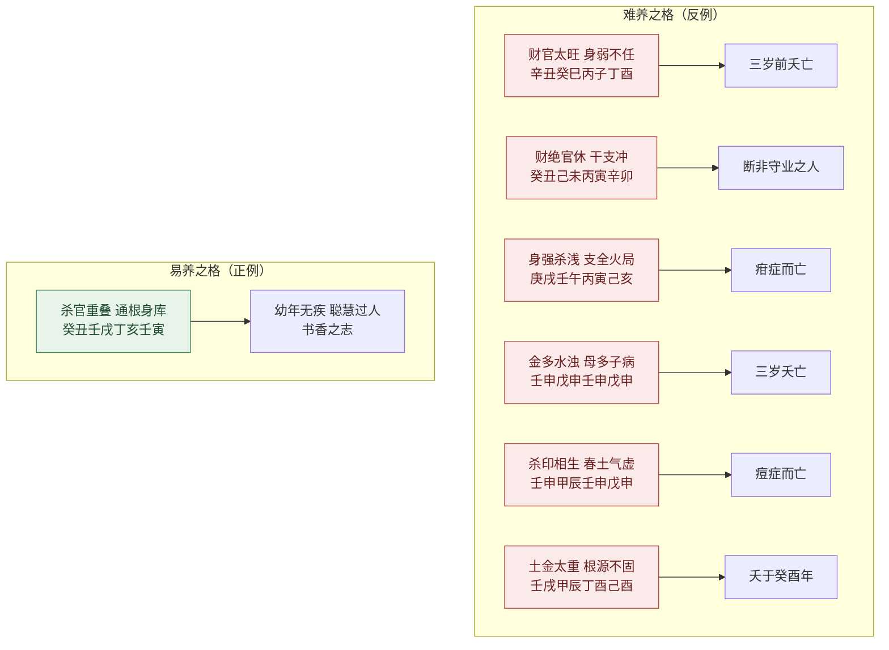

# 小儿

> 【原文】论财论杀论精神，四柱和平易养成，气势攸长无削丧，杀关虽有不伤身。

《滴天髓》将「小儿」单列一篇，紧接「女命」之后。下篇六亲论从「何知」之总论到「夫妻」「女命」，已覆盖了夫妇、子女两端；「小儿」独立成篇，意在把命理判断的视角从「成人」前推到「童年」——一个人能否顺利长大，本身就是一个需要单独验证的命题。

原文以诗诀形式立纲，四句各立一义：①「论财论杀论精神」——断小儿命的核心是财、杀、精神三项；②「四柱和平易养成」——吉的基本条件是四柱和平；③「气势攸长无削丧」——气势连续无破即无夭折之虞；④「杀关虽有不伤身」——即有关杀，亦不伤身才算安全。四句把「小儿」篇的判读要素全部纳入。

任氏开篇即言：「小儿之命，每见清奇可爱者难养，混浊可憎者易成」——这是与世俗直觉相悖的观察：清奇的命反难养，混浊的命反易成。这一观察引出本篇的核心命题：看小儿命不能套用成人标准，须回到「气数、根源、培植、关杀」的具体情境。

## 财杀精神之论

> 【原注】财神不党七杀，主旺精神贯足，干支安顿和平。又要看气势，如气势在日主，而日主雄壮者；气势在财官，而财官不叛日主；气势在东南，而五七岁之前，不行西北；气势在西北，而五七岁之前，不行东南。行运不逢前丧，此为气势攸长，虽有关杀，亦不伤身。

原注先点「财神不党七杀」——财不助杀方为吉格；再点「主旺精神贯足」——日主旺则精神足；末点「干支安顿和平」——四柱干支不冲不合。「气势」一词是原注的关键：气势在日主则日主雄壮，气势在财官则财官不叛，气势在东南而五七岁前不行西北则不夭折。末段「行运不逢前丧，此为气势攸长」一句是对「气势」作时间维度的展开——五七岁前是关键节点。

> 【任氏曰】小儿之命，是犹果苗之初出，宜乎培植得好，固不待言。然未生之前，父母不禁房事，毒受胎中；既生之后，过于爱惜，或饮食无忌，或寒暖不调，因之疾病多端，每至无成。尚有积恶之家，而无余忧，虽小儿之命，清奇纯粹者，所以难养也。有第关于坟墓阴阳之忌，迁改损坏，以致夭亡。故小儿之命。不易看也。

任氏把小儿命难判的原因归结为三类：①父母未生前胎教失当（房事不禁、毒受胎中）；②既生后养护失当（饮食无忌、寒暖不调）；③坟墓阴阳之忌迁改损坏。这三类因素都是「命」之外的环境变量。任氏末句「故小儿之命。不易看也」是全篇的认知定位：判读小儿命必须先排除这三类环境因素，再看命局本身。

> 除此数端之外，然后论命，必须四柱和平，不偏不枯，无冲无克，根通月之，气贯生时，杀旺有印，印弱有官，官衰有财，财轻有食伤，生化有情，流通不悖，或一神得用，始终相托，或两意相通，互相庇护，未交运而流年平顺，既交运而运途安祥，此谓气势攸长，自然易养成人，反此则难养矣。

任氏此段是「气势攸长」的正面定义。所需条件可拆为五组：①四柱和平（不偏不枯、无冲无克）；②根气通贯（根通月令、气贯生时）；③生化有情（杀旺有印、印弱有官、官衰有财、财轻有食伤）；④流通不悖（一神得用、两意相通）；⑤运途安祥（未交运流年平顺、既交运运途安祥）。任氏末句「反此则难养矣」是反面定论。

> 其余关杀多端，尽皆谬妄，欲以何等惑人，则造何等神杀，必宜一切扫除，以绝将来之谬。

任氏末段直斥「关杀」为谬妄——这一立场与原文「杀关虽有不伤身」看似冲突，实则一致：原文不是说「关杀」之理，而是说「虽有」关杀级别的力量，亦不伤身才算安全；任氏把「关杀」彻底斥为「惑人之论」，是把「关杀多端」从方法论中扫除。这一立场与本卷「女命」篇中「二德三奇、咸池驿马」的处理方式一脉相承。

## 易养与难养之别

> 【任氏曰】小儿之命，每见清奇可爱者难养，混浊可憎者易成，虽关家门之气数，亦看根源之浅深。

任氏开篇抛出的命题，是贯穿本篇的反直觉观察：清奇可爱者反难养，混浊可憎者反易成。这一观察意味着看小儿命不能只看格局清浊，须看「根源浅深」——清奇者若根源浅（如早夭），则反不如混浊者之易成。任氏以「家门气数」与「根源浅深」并列，点出命与运两条线索。

### 【命造一（任氏注）】

> 辛丑 癸巳 丙子 丁酉
>
> 壬辰 辛卯 庚寅 己丑 戊子 丁亥

丙火生于巳月，虽云建禄，五行无木生助。天干既透财官，地支不宜再见酉子，更不宜再会金局，则巳火之禄，非日干有也。虽丁火可以帮身，癸水伤之，谓财多身弱，兼之官星又旺，日主虚弱极矣。且初交壬运逢杀，辛亥年天干逢壬癸克丙丁，地支亥冲巳破禄，运根拔尽，得疳疾而亡。

丙火日主生于巳月，本是建禄；任氏却指出「五行无木生助」——印（甲乙木）缺位；「天干既透财官、地支不宜再见酉子、不宜再会金局」——财官太重；「巳火之禄，非日干有也」是任氏的精细观察：巳火虽是日主之禄（建禄），但被酉金合走，反为财官所用。「财多身弱、兼之官星又旺」是「财神不党七杀、主旺精神贯足」的反例。任氏「初交壬运逢杀、辛亥年天干逢壬癸克丙丁、地支亥冲巳破禄、运根拔尽」是行运层面的具体死因——「得疳疾而亡」对应「疳积」类小儿常见重症。

### 【命造二（任氏注）】

> 癸丑 己未 丙寅 辛卯
>
> 戊午 丁巳 丙辰 乙卯 甲寅 癸丑

前造因财官太旺，以致夭亡，此则日坐长生，又生夏令，财官为用，伤官为喜，伤生财，财又生官，似乎生化有情。殊不知前则财多身弱，以官作杀，此则财绝官休，恐难厚享。癸水官星生未月，火土枯干，余气在丑，蓄水藏金，然己土当头伤癸，丑未冲去金水根源，时上辛又临绝，虽有若无，焉能生远隔之水？则己土亦不能生隔绝之金。且运走东南木火这地，断非守业之人也。

此造与上造对比而立——任氏特意以「前造因财官太旺、以致夭亡，此则……」作对照。任氏指出本造「日坐长生、又生夏令、伤生财、财又生官、似乎生化有情」——表面看是连环相生的佳格；但「财绝官休」是病根：「癸水官星生未月、火土枯干、余气在丑、蓄水藏金、然己土当头伤癸」——己土（伤官）当头克癸水（官星），使「官绝」；「丑未冲去金水根源」——地支冲使财官皆失根。「时上辛又临绝、虽有若无」是任氏对「绝处逢生」的不信；末段「且运走东南木火之地、断非守业之人也」是行运层面的预测。

### 【命造三（任氏注）】

> 庚戌 壬午 丙寅 己亥
>
> 癸未 甲申 乙酉 丙戌 丁亥 戊子

丙用壬杀，身强杀浅，以杀化权；更喜财滋弱杀，定然名利双全。惜支全火局，寅亥又化木而生火，年月之庚壬无根而少生扶，至丁巳年，巳亥冲去壬水之禄，丁火合去壬水之用，死于疳症。

丙火日主「身强杀浅、以杀化权」——以壬水（七杀）为用神；「财滋弱杀」是格局的关键——庚金（财）生壬水（杀），杀有源则力强。但「支全火局、寅亥又化木而生火」——地支全火使日主极旺，反致「年月之庚壬无根而少生扶」。任氏「丁巳年、巳亥冲去壬水之禄、丁火合去壬水之用」是行运层面的死因——丁火（比劫）合去壬水（用神）、巳亥冲去壬水之禄（亥为壬水长生），用神尽失，故「死于疳症」。

### 【命造四（任氏注）】

> 壬申 戊申 壬申 戊申
>
> 己酉 庚戌 辛亥 壬子 癸丑 甲寅

壬水生于秋令，地支皆坐长生，天干两戊两壬，大势观之，支全一气，两干不杂，且杀印相生，为大贵之格。不知金多水浊，母多子病，四柱无火克金，金反不能生水，戊土之菁华尽泄于金，谓偏枯之象，必然难养，名利皆虚，果死于三岁甲戌年。

壬水日主「地支皆坐长生（申为壬水长生）、天干两戊两壬、支全一气、两干不杂、且杀印相生」——表面看是「大贵之格」；任氏却直断「金多水浊、母多子病、四柱无火克金、金反不能生水、戊土之菁华尽泄于金」——「金多水浊」是经典术语，指五行过偏则浊而不清；「母多子病」是任氏的特殊表述：印（戊土）为母神，过多则反夺食伤（子），使日主无精气。「谓偏枯之象」是任氏的方法论术语——偏则枯，枯则不寿。「死于三岁甲戌年」是行运流年的具体应验。

### 【命造五（任氏注）】

> 壬申 甲辰 壬申 戊申
>
> 乙巳 丙午 丁未 戊申 己酉 庚戌

壬水生于季春，似乎杀印相生，地支三遇长生，食神制杀为权，定为贵格。不知春土气虚，月透甲木，不但辰土受制，而时干之戊，亦受其克。五行无火，未得生生之妙，亦母多子病，偏枯之象，必然难养也。后死于痘症。

此造与上造「壬申甲辰壬申戊申」与「壬申戊申壬申戊申」在结构上相似——皆为壬水日主、戊土（七杀）当令、地支多申金（壬水长生）。任氏「春土气虚、月透甲木、不但辰土受制、而时干之戊、亦受其克」——甲木（食神）克戊土（七杀），杀被克则格局失衡；「五行无火、未得生生之妙、亦母多子病、偏枯之象」是结构层面的判断。「后死于痘症」是病种的具体标注。

### 【命造六（任氏注）】

> 癸丑 壬戌 丁亥 壬寅
>
> 辛酉 庚申 己未 戊午 丁巳 丙辰

此造丁火阴柔，生于深秋，杀官重叠，必不能养。殊不知官杀虽旺，妙在戌月，通根身库，足以制水；更妙无金，时支寅木不伤，气贯生时，足以纳水，不但易养成人，可遂书香之志。然官杀一类，勿以官为喜，杀为憎，身弱者官皆是杀，身旺者杀皆是官，只要无财有印，便为佳造。如云丁火死寅，谬之极矣。寅中甲木，乃丁之嫡母，何以为死？凡阴干以生地为死，死地为生，非正论也。果幼年无疾，聪慧过人，至甲戌年入泮后。运走南方火土，制杀扶身，未可限量也。

此造任氏在「反例」中给出反面的破执。表面看「丁火阴柔、生于深秋、杀官重叠、必不能养」，但任氏指出「妙在戌月、通根身库、足以制水」——戌为火库，丁火通根则可担官杀；「更妙无金、时支寅木不伤」——无财（庚金）则不党杀；「气贯生时、足以纳水」——寅木（印）纳水生火，使格局稳定。任氏「身弱者官皆是杀、身旺者杀皆是官、只要无财有印、便为佳造」一句是全段方法论的提炼。末段对「丁火死寅」的反驳是任氏的破执之言——「寅中甲木乃丁之嫡母，何以为死？凡阴干以生地为死、死地为生、非正论也」。任氏认为小儿命「果幼年无疾、聪慧过人、至甲戌年入泮后、运走南方火土、制杀扶身、未可限量也」。

### 【命造七（任氏注）】

> 壬戌 甲辰 丁酉 己酉
>
> 乙巳 丙午 丁未 戊申 己酉 庚戌

此造概云木透月干，春木足以生火，年干壬水生木，日时两坐长生，皆作旺论。惜地支土金太重，天干水木之根必浅，水木无气，则丁火之荫不固。夫甲木生于季春，退气之神也，辰酉合而化金，则甲木之余气已绝；戌土隔之，使金不能生水，戌土足以制之，壬水受克，不能生木；辰酉化金，必能克木，日主根源不固可知，如谓酉是丁火长生，五行颠倒矣。酉中纯辛，无他气所杂，金生水，无生火之理。火到酉位，死绝之地；更嫌时干己土，窃去命主元神，生金泄火，而水木火三字皆虚矣。由此论之，小儿之命，不易看也。

此造任氏用来驳斥世俗「五行颠倒」之说。世俗以为「酉是丁火长生」——任氏直斥「五行颠倒矣。酉中纯辛，无他气所杂，金生水，无生火之理。火到酉位，死绝之地」。任氏末句「由此论之，小儿之命，不易看也」收束全篇方法论——本造与前六造对看，前造（癸丑壬戌丁亥壬寅）是「四柱和平易养成」的正面样板；本造则是「水木火三字皆虚、根源不固」的反面典型。两造对照，恰好印证任氏开篇「小儿之命不易看也」的方法论自觉。

## 易养与难养对照

下表把本篇七则命造的「命局—结果」对应关系压缩到一张图，便于与原文逐条对照。

---

_本篇是下篇六亲论中独立成篇的最后一篇，与「女命」形成对照——「女命」专论成年女性命运的伦理维度，「小儿」专论童年存亡的命运维度。两篇的共同点是都不以格局美恶作单一直线判定：「女命」以「命理」与「闺门教养」并列思考；「小儿」以「命局」与「胎教、养护、坟墓」三类环境因素并列思考。任氏反复强调「小儿之命不易看也」——这一自觉的认知定位，把本篇从单纯的吉凶判断，提升为带有方法论反思的篇章。_
