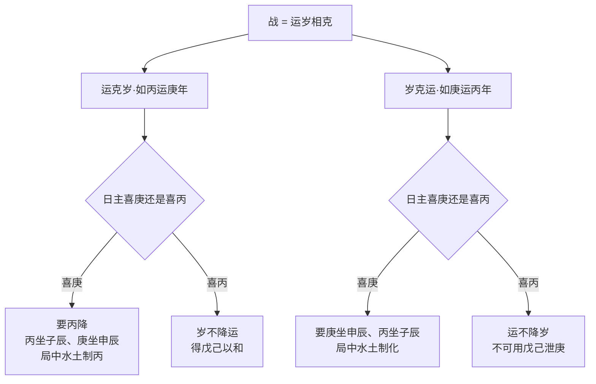
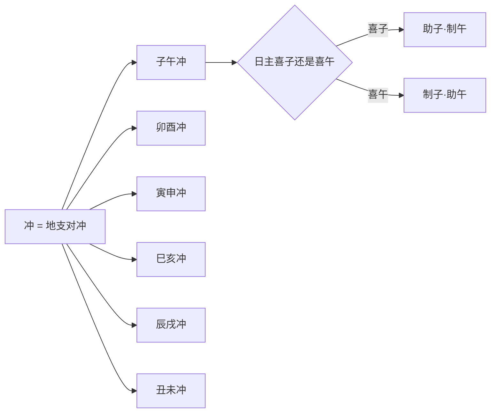
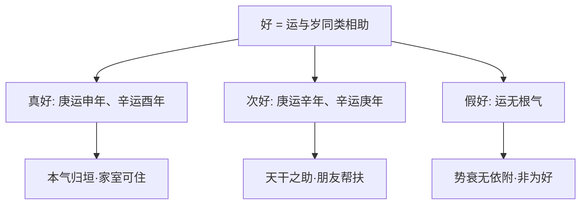

# 岁运

## 运与岁的轻重

> 【原文】休囚系乎运，尤系乎岁，战冲视孰降，和好视孰切。

首句「休囚系乎运，尤系乎岁」是典型的递进复句——前半句点出大运影响命局休囚，后半句用「尤」字一推，把决定权推到大运之上：太岁的影响比大运更直接、更紧要。三四句「战冲视孰降，和好视孰切」则把运岁的关系落到**「战」「冲」「和」「好」**四种状态上——这是本篇的方法论骨架，全文都围绕这四字展开。

> 【原注】日主譬如吾身，局中之神，譬之舟马引从之人，大运譬所到之地，故重地支，未尝无天干。太岁譬所遇之人，故重天干，未偿无地支。必先明一日主，配合七字，权其轻重，看喜行何运，忌行何运。

> 【异文标注】原书「太岁一至，休咎即显，于是详论战冲和好之势」一段中「未偿无地支」按文意当作「未尝无地支」（按：「偿」疑为「尝」之形近讹误）。原书「遇庚辛申酉字面」中「新伐其生生之机」一语按文意当作「斫伐其生生之机」（按：「新」疑为「斫」之形近讹误）。此处仅作客观标注。

原注用比喻立论——**日主喻「吾身」、局中之神喻「舟马引从之人」、大运喻「所到之地」、太岁喻「所遇之人」**。这四个比喻各自承担了方法论的功能：

- **日主为吾身**——命主是判断中心；
- **局中之神为引从**——四柱中的喜神、用神、闲神、忌神是命主身旁的助力或阻力；
- **大运为所到之地**——大运是命主所经历的环境背景，**重地支**（按：地支主环境、主地理、主物质基础），「未尝无天干」——地支虽重，但天干仍需兼顾；
- **太岁为所遇之人**——太岁是命主所遇到的具体事件、具体人，**重天干**（按：天干主事象、主人物），「未尝无地支」——天干虽重，地支仍需兼顾。

这一组比喻是本篇方法论的根基：**大运是「地」层面的运，太岁是「天」层面的运**。两者各有所重，合看才不失偏颇。

> 【任氏曰】富贵虽定乎格局，穷通实系乎运途，所命好不好运也。日主如我之身，局中喜神用神是我所用之人，运途乃我所临之地，故以地支为重。要天干不背，相生相扶为美，故一运看十年切勿上下截看，不可使盖头截脚。

> 【异文标注】原书「所命好不好运也」一语，按文意当作「所谓命好不好，运也」（按：原书疑脱「谓」字、「命」字前后顺序颠倒）。「如上下截看，不论盖头截脚，则吉凶不验矣」一段文字按上下文意需与下文连贯理解。此处仅作客观标注。

任氏把原注的比喻推得更直接——**「富贵虽定乎格局，穷通实系乎运途」**是子平命理中的重要论断。**「命好不好，运也」**——把命运的可变部分从「格局」转到了「运途」。这是岁运篇的总纲：**格局定富贵之等，运途定穷通之时**。

任氏接着立**运途的三条规矩**：

1. **「以地支为重」**——一运十年，重在坐下地支；
2. **「要天干不背」**——天干不与地支相悖（按：不背即不相冲、相克、相战）；
3. **「切勿上下截看」**——一运十年须贯通看，不能「盖头截脚」（按：盖头者天干克伐地支，截脚者地支不载天干——任氏下文详论）。

> 【任氏曰】如喜行木运，必要甲寅乙卯，次则甲辰乙亥；喜行火运，必要丙午丁未，次则丙寅丁卯丙戌丁巳；喜行土运，必要戊午己未戊戌己巳，次则戊辰己丑；喜行金运，必要庚申辛酉，次则戌申己酉庚辰辛巳；喜水运，必要壬子癸亥，次则壬申癸酉辛亥庚子。

> 【异文标注】原书「喜行金运，必要庚申辛酉，次则 戌申 己酉」一语，按木火土水四运类比顺序及字形推测，当作「戊申己酉」（按：原书「戌」疑为「戊」之形近讹误）。此处仅作客观标注。

任氏列出**喜行各运的最佳配置**：

| 喜行 | 最佳 | 次之 |
|------|------|------|
| 木运 | 甲寅、乙卯 | 甲辰、乙亥 |
| 火运 | 丙午、丁未 | 丙寅、丁卯、丙戌、丁巳 |
| 土运 | 戊午、己未、戊戌、己巳 | 戊辰、己丑 |
| 金运 | 庚申、辛酉 | 戊申、己酉、庚辰、辛巳 |
| 水运 | 壬子、癸亥 | 壬申、癸酉、辛亥、庚子 |

**最佳配置的规律**：天干地支皆为同五行之禄旺本气（如甲木禄在寅、旺在卯；丙火禄在巳、旺在午）——**「地支为本气归垣」**。**次之配置**则是地支为本气之库（如辰为水库、乙为木之墓？——按：辰为水库，乙木不墓于辰，乙木墓在未；此处「甲辰乙亥」按甲辰为水库中木之余气、乙亥为木生旺之地——按：此表不必细究字面，重点是**「最佳」为本气之禄旺，「次之」为延伸之有用之气**）。

> 【任氏曰】宁使天干生地支，弗使地支生天干；天干生地支而荫厚，地支生天干而气泄。

任氏补一句**天干地支的方向之论**——「**宁使天干生地支，弗使地支生天干**」。**「荫厚」**与**「气泄」**对举：地支所藏是基础、是根本，天干生地支等于把天干之气直接灌注到根本中去（荫厚）；地支生天干则是把根本之精向上发散（气泄）。**这一句判的是运干与运支的相互关系**——喜运须让运干生地支，不要让运支生运干。

## 盖头与截脚

> 【任氏曰】何谓盖头？如喜木运而遇庚寅辛卯，喜火运而遇壬午癸巳，喜土运而遇甲戌甲辰乙丑乙未，喜金运而遇丙申丁酉，喜水运而遇戊子己亥。

> 【任氏曰】何谓截脚？如喜木运而遇甲申乙酉乙丑乙巳，喜火运而遇丙子、丁丑、丙申、丁酉、丁亥，喜土运而遇戊寅、乙卯、戊子、己酉、戊申，喜金运而遇庚午、辛亥、庚寅、辛卯、庚子，喜水运而遇壬寅、癸卯、壬午、癸未、壬辰、癸巳是也。

> 【异文标注】原书「喜金运而遇庚午、辛亥、庚寅、辛卯、庚子」一语，按上下文意当有「辛亥」（按：原书作「辛亥」可能为「辛亥」之形近讹误），此处照录不擅改。截脚段中「喜火运而遇」后罗列项，与上下文类比，部分干支配对可能有木刻本之讹脱，此处仅依源书照录不擅改。

任氏把运干与运支的关系立为两条**结构性法则**：

**盖头**——**天干克伐地支**。喜木运遇庚辛（按：金克木），喜火运遇壬癸（按：水克火），喜土运遇甲乙（按：木克土），喜金运遇丙丁（按：火克金），喜水运遇戊己（按：土克水）。**「盖头」**字面意为「盖在地支上的天干」，即日干克地支——这是「天干之气压住地支」之象。**盖头则吉凶减半**：喜用运的吉气被压，喜神打折扣；忌用运的凶气被压，凶神也打折扣。

**截脚**——**地支克伐天干**。喜木运遇申酉丑巳（按：申酉金克木，丑中有金余气，巳中有金余气），喜火运遇子丑申酉亥（按：子亥水克火，丑中有癸余气，申酉金被火克不合——按：子亥水克火为截脚），喜土运遇寅卯子酉申（按：寅卯木克土，子辰不克——按：木克土），喜金运遇午亥寅卯子（按：午火克金，寅卯木不克金——按：火克金），喜水运遇寅卯午未辰巳（按：木克土不克水——按：木泄水、土克水、火不克水——按：截脚应是「地支克天干」即**水运遇土克**——喜水运遇戊己等土克水之支：寅卯木不克水，午火不克水，未土不克水，辰土克水，巳火不克水——**原书所列似为更广义「地支不载天干」之截脚**）。**「截脚」**字面意为「截去天干之脚」，即日支克天干——这是「地支之气截断天干」之象。**截脚则十年皆否**：吉凶不验。

> 【任氏曰】盖干头喜支，运以重支，财吉凶减半；截脚脚喜干，支不载干，则十年皆否。

> 【异文标注】原书「盖干头喜支，运以重支」一语按上下文意当为「盖头者，干头之天干克伐地支，喜行地支之运，被天干盖住，吉凶减半；截脚者，地支之支克伐天干，支不载干，则十年皆否」之缩写，原文疑有讹脱。此处仅作客观标注。

> 【任氏曰】假如喜行木运，而遇庚寅辛卯，庚辛本为凶运，而金绝寅卯，谓之无根，虽有十分之凶，而减其半。如原局天干有丙丁透露，得回制之能，又减共半，或再遇太岁逢丙丁，制其庚辛，则无凶矣。寅卯本为吉运，因盖头有庚辛之克，虽有十分之吉，亦减其半。如原局地支有申酉之冲，不但无吉，而反凶矣。

任氏用**「喜行木运遇庚寅辛卯」**为案例，立出盖头减半的具体算法：

- 庚辛本为凶运（按：金克木），但「**金绝寅卯**」（按：庚金绝在寅、辛金绝在卯——按绝地之位），谓之无根，故**十分之凶减其半**；
- 若原局天干有丙丁火透出（按：火克金），得回制之能，又**减其半**；
- 若再遇太岁逢丙丁制庚辛（按：流年天干为火），则**无凶**；
- 寅卯本为吉运（按：木旺之地），因盖头庚辛之克，**十分之吉减其半**；
- 若原局地支有申酉之冲（按：金冲木），**不但无吉而反凶**。

这一段把**「盖头减半」法则**展开成三层判断：盖头本身减半、原局回制再减半、太岁回制再减半；三层叠加则凶可化为无凶、吉可化为反凶。**这是子平命理中关于「运的吉凶如何被原局/太岁调节」的最精细论述**。

> 【任氏曰】又如喜木运，遇甲申乙酉，木绝于申酉，谓之不载，故甲乙之运不吉。如原局天干又透庚辛，或太岁干头遇庚辛，必凶无疑所以十年皆凶。如原局天干透壬癸，或太岁干头逢壬癸，能泄金生木，则和平无凶矣。故运逢吉不见其吉，运逢凶不见其凶者，缘盖头截脚之故也。

任氏用**「喜木运遇甲申乙酉」**为案例，立出截脚凶相的具体算法：

- 甲乙本为喜用之木（按：木），但「**木绝于申酉**」（按：甲木绝在申、乙木绝在酉——按绝地之位），**「不载」**——天干之气在地支无根，**「不载」则十年皆凶**；
- 若原局天干又透庚辛（按：金克木，更凶），或太岁干头遇庚辛（按：流年更凶），**必凶无疑**；
- 若原局天干透壬癸（按：水生木），或太岁干头逢壬癸，**能泄金生木**（按：癸水泄庚辛金而生甲乙木），则**和平无凶**。

「**运逢吉不见其吉，运逢凶不见其凶者，缘盖头截脚之故也**」——这是本节最警策的论断。**许多看似吉的运不吉、看似凶的运不凶，命理师若不细辨盖头截脚，必然误判**。

## 战冲和好

> 【任氏曰】太岁管一年否泰，如所遇之人，故以天干为重，然地支不可不究，虽有与神之生克，不可与日主运途之冲战。最凶者天克地冲，岁运冲克，日主旺相虽凶无碍，日主凶必罹凶咎。

任氏转入**太岁与大运的关系**——最凶者为**「天克地冲」**。**天克**：太岁天干克大运天干；**地冲**：太岁地支冲大运地支。两者合看，若日主旺相（按：日主得月令、得地），则虽凶无碍；若日主休囚（按：日主失月令、失地），**必罹凶咎**。

> 【任氏曰】日犯岁君，日主旺相无咎，日主休囚必凶；岁君犯日，亦同此论，故太峧宜和，不可与大运一端论也。

> 【异文标注】原书「太峧宜和」一语，按文意当作「太岁宜和」（按：「峧」疑为「岁」之形近讹误或版刻错字）。此处仅作客观标注。

任氏接着立**「日犯岁君」「岁君犯日」**两种关系：

- **「日犯岁君」**——日主冲克太岁。日主旺相则无咎（按：旺则能敌），休囚则凶（按：弱则被克）；
- **「岁君犯日」**——太岁冲克日主。同论：日主旺相无咎，休囚必凶。

「**太岁宜和**」一句是本节方法论的归结——命理师看太岁与大运的关系，**不能一端而论**（按：不能只看天干或只看地支），要合看冲克生合、盖头截脚。

### 何为战

> 【原注】如丙运庚年，谓之运伐岁。若日主喜庚，要丙降，得丙者吉，日主喜丙，则岁不降运，得戊己以和为妙。如庚坐寅午，丙之力量大，则岁运亦不得不降，降之亦保无祸。庚运丙年，谓之岁伐运，日主喜庚，得戊己以和丙者吉；日主喜丙，则运不降岁，又不可用戊己泄助庚。若庚坐寅午，丙之力量大，则运自降岁，亦保无患。

> 【任氏曰】战者克也。如丙运庚年，谓之运克岁，日主喜庚，要丙坐子辰，庚坐申辰，又局中得戊己泄丙，得壬癸克丙则吉；如丙坐午寅，局中又无水土制化，必凶。

> 【异文标注】原书「调之岁克运」一语，按文意当作「谓之岁克运」（按：「调」疑为「谓」之形近讹误）。此处仅作客观标注。

「**战者克也**」——任氏给「战」下的定义：战即克。**「运克岁」**（如丙运庚年）与**「岁克运」**（如庚运丙年）是战的两大类型。任氏立出断法：

- **运克岁**（丙运庚年）：日主喜庚（按：庚金为喜用）则要**丙降**（按：丙火被克制不克庚金）。要丙坐子辰（按：子辰水，水克丙火）、庚坐申辰（按：申辰金，金旺），又局中得戊己土泄丙（按：土泄火之气）、得壬癸水克丙（按：水克火），则**吉**。如丙坐午寅（按：午火生丙火、寅木生丙火，丙火得势），局中又无水土制化，**必凶**。
- **岁克运**（庚运丙年）：日主喜庚则凶（按：丙克庚，喜用被克），喜丙则吉（按：喜用即丙，岁助喜用）。喜庚者要庚坐申辰（按：金旺）、丙坐子辰（按：水克丙），又局中逢水土制化者吉，反此必凶。

> **【命造一（任氏注）】辛卯 甲午 丙辰 庚寅**
> 任氏断：「丙火生于午月，旺刃当权，支全寅，卯，辰，土从木类，庚辛两不通根，初交癸巳壬辰，金逢生助，家业铙裕，其乐自如；辛卯金截脚，刑丧破耗，家业十败八九。庚运丙寅年克妻，庚坐寅支截脚，丙寅岁克运，又庚绝丙生，局中无制化之神，于甲午月木从火势，凶祸连绵，得疾而亡。」

> 【异文标注】原书「土从木类」一语，按本造四柱「辛卯甲午丙辰庚寅」地支无土之配置，按文意当为「木从火类」或「支全寅卯辰，木从火类」（按：原书「土从木类」与本造实际地支配置不符，疑为「木从火类」之形近讹误）。「金逢生助」一语按上下文意当为「木火逢生助」或「命局逢生助」（按：此段任氏所论命主辛卯甲午丙辰庚寅，辛金虽年干但弱，本段核心在丙火旺刃，原书「金逢生助」与下文「辛卯金截脚」呼应，存疑不擅改）。此处仅作客观标注。

丙日主，**午火为刃**（按：丙禄在巳、午为帝旺），**寅卯辰**为木局（按：寅卯辰会东方木局），**庚金七杀**透时干，**辛金正官**透年干。任氏说「**旺刃当权**」——丙火日主得月令午火、得刃地支寅卯辰木局之助，**刃旺当权**。**「土从木类」**（按：原文有讹，本造地支无土）当为「木从火类」之形近讹误——按：本造寅卯辰为木，木生火，**地支木从火势**。任氏论运：初交癸巳壬辰（按：癸壬水、巳辰支），按本造火旺水为用，**初运水木**尚可（按：命理上癸壬水为官杀，辰为湿土晦火生金，本造喜火不宜金水——此段任氏「金逢生助，家业铙裕」按文意当为「木火逢生助」更合本造格局，原文存疑）；辛卯运**金截脚**（按：辛金天干克卯木地支——按：辛金克乙木、卯木为乙木禄地，金克木，**截脚**），「**刑丧破耗**」；庚运丙寅年**克妻**——庚坐寅支**截脚**（按：庚金被寅木截脚，庚为喜用被毁，故克妻）；**丙寅岁克运**（按：丙火克庚金），又庚**绝**（按：庚金绝在寅）、**丙生**（按：丙火得寅木生），局中无制化，**甲午月木从火势**（按：甲木生丙火），**凶祸连绵、得疾而亡**。本造是「截脚凶相」的代表造——辛卯、庚寅两运皆截脚，喜用之木皆被金克，十年皆凶。

> **【命造二（任氏注）】辛卯 甲午 乙卯 乙酉**
> 任氏断：「乙木生于午月，卯酉紧冲日禄，月干甲木临绝，五行无水，夏火当权泄气，伤官用劫，所忌者金。初运壬辰癸巳，印透生扶，平顺之境；辛卯运，惟辛酉年冲去卯木，刑丧克破，至庚运丙寅年，所忌者金，而丙火克去之，局中无土水泄制丙火，又火逢生，金坐绝，入泮，得舒眉曲也。」

乙日主，**午月火旺泄木**（按：木生火为食伤），**卯酉冲**（按：卯为乙木之禄，被酉金冲——**日禄被冲**），**甲木劫财**（按：甲木与乙木同木为劫财）月干。任氏说「**伤官用劫**」——按：乙木生火为食伤（按：丙为食神、丁为伤官——本造无丙丁火，午中藏丁火为伤官），用神在劫财甲木（按：同类相助敌财官）。**「所忌者金」**——按：金克木为官杀，金为忌。**「初运壬辰癸巳」**——按：壬癸水为印（按：水生木，壬为正印、癸为偏印），辰为湿土、巳火藏金——初运水木生扶日主，故「**平顺之境**」；**辛卯运**——辛金天干克卯木地支（按：辛金为忌，卯木为日主之禄），「**辛酉年冲去卯木**」——按：辛酉流年再冲卯木（按：卯酉冲），**「刑丧克破」**；**庚运丙寅年**——按：庚金为忌，但「**丙火克去之**」（按：丙火食神制庚金七杀——按：火克金），**「金坐绝」**（按：庚金绝在寅，寅年绝地），又**火逢生**（按：丙火得寅木生），「**入泮，得舒眉曲也**」——按：制杀得力，反而**功名成就**。本造的关键在**「所忌者金」**的判断——金为忌，制金者火为喜用；丙寅年天干丙火制庚金，地支寅木生日主，**正是「岁克运」中得回制之利的案例**。

### 何为冲

> 【原注】如子运午年，谓之运冲岁，日主喜子，则要助子，又得年之干头，遇制午之神，或午之党多，干头遇戊甲字者必凶。如午运子年，谓之岁冲运，日主喜午，而子之党多，干头助子者必凶；日主喜子，而午之党少，干头助子者必吉，若午重子轻，则不降，亦无咎。

> 【任氏曰】冲者破也，如子运午年，谓之运冲岁。日主喜子，要干头逢庚壬，午之干头逢甲丙，亦无咎；如子之干头遇丙戊，午之干头遇庚壬，亦有咎。日主喜午，子之干头逢甲戊，午之干头遇甲丙，则吉；如子之干头遇庚壬，午之干头遇丙戊，子之干头遇甲丙，则吉；如午之干头遇丙戊，子之干头遇庚壬，必凶。余可类推。

「**冲者破也**」——任氏给「冲」下的定义：冲即破。**冲**与**战**的区别：战是克（按：天干克地支或地支克天干），冲是地支对地支的方位相破（按：子午冲、卯酉冲、寅申冲、巳亥冲、辰戌冲、丑未冲，共六冲）。

任氏把冲断法系统化——**日主喜子、喜午**两大类，配以**「子之干头」「午之干头」**的不同五行：

- **喜子**（日主以子水为喜用）：
  - **子之干头逢庚壬**（按：庚金、壬水生助子水），**午之干头逢甲丙**（按：甲木泄水、丙火克金，金被制则不能生水不利——按：本句当理解为「子之干头逢庚壬」助子、**「午之干头逢甲丙」制午**，两相配则**无咎**）；
  - 如**子之干头遇丙戊**（按：丙火克金、戊土克水，不利子水），**午之干头遇庚壬**（按：庚壬助子不利午），**亦有咎**。
- **喜午**（日主以午火为喜用）：
  - **子之干头逢甲戊**（按：甲木泄子、戊土克子），**午之干头遇甲丙**（按：甲木生丙火、丙火助午），**吉**；
  - 如**子之干头遇庚壬**（按：助子不利午），**午之干头遇丙戊**（按：助午），**必凶**。

任氏以**子午冲**为代表案例，立出**「干头冲」**的判断方法：单看地支冲不够，须看地支所藏天干（干头）所属五行的力量对比。

### 何为和

> 【原注】如乙运庚年，庚运乙年则和，日主喜金则吉，日主喜木则不吉，子运丑年，丑运子年，日主喜土则吉，喜水则不吉。

> 【任氏曰】和者合也。如乙运庚年，庚运乙年，合而能化，喜金则吉，合而不会，反为羁绊，不顾日主之喜我，则不吉矣。喜庚亦然，所以喜庚者必要木金得地，乙木无根，则合化为美矣，若子丑之合，不化亦是克水，喜水者必不吉也。

「**和者合也**」——任氏给「和」下的定义：和即合。**和**与**战、冲**的区别：和是地支六合（按：子丑合、寅亥合、卯戌合、辰酉合、巳申合、午未合）或天干五合（按：甲己合、乙庚合、丙辛合、丁壬合、戊癸合）。

任氏的判法：

- **合而能化**——如乙庚合金（按：乙木为日主，庚金为喜用），**喜金则吉**（按：合化为金，正合喜用）；
- **合而不会**——乙庚合但不化（按：木金之力量对比不足以化），**反为羁绊**（按：合住则不动），「**不顾日主之喜我**」（按：合住之后反不能为日主所用），**不吉**；
- **子丑之合**——子丑合土（按：土克水），「**不化亦是克水**」——按：子水被丑土所克而合，喜水者（按：日主喜水为用）则**不吉**。

本节的关键论断是**「合而能化」与「合而不会」**的区分——**命理上，合比冲更隐蔽**：合住则两失其用，看似相安，实则把喜用的力量也「合」没了。

### 何为好

> 【原注】如庚运辛年，辛运庚年，申运酉年，酉运申年，则好。日主喜阳，则庚与申为好，喜阴，则辛与酉为好，凡此皆宜类推。

> 【任氏曰】好者，类相同也。如庚运申年，辛运酉年，是为真好，乃支之禄旺，自我本气归垣，如家室之可住，如庚运辛年，辛运庚年，乃天干之助，如朋友之帮扶，究竟不甚关切，必先要旺运通根，自然依附为好。如运无根气，其见势衰而无依附之情，非为好也。

「**好者，类相同也**」——任氏给「好」下的定义：好即同类。**好**与**战、冲、和**的区别：好是天干地支的同类相助（按：阴阳相同、五行相同）。

任氏把「好」分为两层：

- **「庚运申年，辛运酉年」**——**天干地支皆为本气归垣**（按：庚禄在申、辛禄在酉），**「真好」**——按：日主庚金得庚运申年之助，是本气之禄旺相助，**「如家室之可住」**——这是命理中力量最大的「好」；
- **「庚运辛年，辛运庚年」**——**天干之助**（按：庚辛同类相助，但天干之力不如地支厚实），**「如朋友之帮扶」**——这是次一层的「好」；
- **「必先要旺运通根，自然依附为好」**——按：好运也要有根有气才能真正发力，**「运无根气，其见势衰而无依附之情，非为好也」**——无根之运看似好，实则无力。

任氏最后一句**「如运无根气……非为好也」**是本节最警策的论断——**「好」必须有根，浮面的同类相助无大用**。

> **【命造三（任氏注）】庚辰 丁亥 庚辰 丁丑**
> 任氏断：「庚辰日主，生于亥天干丁火并透，辰亥皆藏甲乙，足以用火。初运戊子己丑，晦火生金，未遂所愿。庚运丙午年，庚坐寅支截脚，天干两丁，足可敌一庚，又逢丙午年，捷。搒下知县，寅运官资颇丰；辛卯截脚，局中丁火回克，仕至郡守；壬辰水生库根，笃壬申年，两丁皆伤，不禄。」

> 【异文标注】原书「生于亥天干丁火并透」一语，按文意当为「生于亥月，天干丁火并透」或「生于亥，天干丁火并透」（按：原书疑脱「月」字）。「庚坐寅支截脚」一语按四柱庚辰丁亥庚辰丁丑无寅支，按文意当为「庚坐寅支」（按：原书疑指流年庚寅而非原局庚坐寅）。「笃壬申年」一语按文意当为「至壬申年」（按：「笃」疑为「至」之形近讹误）。此处仅作客观标注。

庚日主，丁火两透为**正官**（按：按十神：庚金克乙木为财、克甲木为偏财——按：火克金，**丁火为正官**——按：火克金，丙为偏官、丁为正官），亥月甲乙木长生。任氏说「**足以用火**」——按：本造丁火为用神（按：火克金为官星，**官星为用**）。**「初运戊子己丑」**——按：戊己土泄火生金（按：火生土、土生金——火被泄、金被生，**火之忌、土金之喜**），「**晦火生金**」——按：戊己土晦丁火之气而生庚金，故「**未遂所愿**」；**庚运丙午年**——按：庚金运逢丙午年（按：丙火为偏官、午火为官之禄旺），天干**两丁**（按：原局两丁火透）足以敌一庚，**捷**（按：捷即考运顺捷）；**寅运**——按：寅木生火（按：寅中甲木、丙火、戊土），火旺敌金，「**官资颇丰**」；**辛卯运**——按：辛金天干克卯木地支（按：辛金为忌克卯木为日主劫财之禄——按：卯木为乙木之禄），**截脚**（按：辛克卯为截脚），但「**局中丁火回克**」（按：原局两丁克辛金），「**仕至郡守**」；**壬辰运**——按：壬水为食伤（按：壬水泄庚金——按：庚金生壬水为食伤），辰为水库，**「水生库根」**（按：壬水得辰水库之生），**壬申年**——按：壬水食伤再见、申金生壬水（按：申金生壬水为枭印夺食——按：庚金生壬水本为食伤，但若原局有戊己土枭神，则枭神夺食），「**两丁皆伤**」（按：壬水克丁火、申金中壬水亦克丁火），「**不禄**」。

> **【命造四（任氏注）】乙未 戊子 庚辰 丁丑**
> 任氏断：「庚辰日元，生于子月，未土破子水，天干木火，皆得辰未之余气，足以用木生火。丙运入泮。癸酉年行乙运，癸合戊化火，酉是丁火长生，均以此年必中，殊不知乙酉截脚之木，非木也；实金也。癸酉年水逢金生，又在冬令，焉能合戊化火？必克丁火无疑酉中纯金，乃火之死地，阴火长生之说，俗传之谬也；恐今八月又建辛酉，局中木火皆伤，防生不测之灾。竟卒于省中。」

> 【异文标注】原书「酉是丁火长生」一语，按子平命理常识，**丁火（阴火）长生在西、壬水（按阴干）长生在卯**为传统说法（按「阴干逆行长生」说），但任氏明确否定此说——**「阴火长生之说，俗传之谬也」**，认为「酉中纯金，乃火之死地」。此为任氏**对流行「阴干逆行长生」说的驳正**，是本段最值得关注的学术争议点。

庚日主，**乙未月**——按：乙未为劫财（按：乙木为庚之偏财？——按：庚金克乙木为**正财**——按：阴金克阴木为正财），未中己土为**伤官**（按：按十神：庚金生土为食伤，己土为伤官）；**戊子时**——按：戊土为**食神**（按：戊为阳土，庚金生戊土为食神），子水为**七杀**（按：按十神：水泄金——按严判：子水泄庚金为**食伤**而非七杀——按：水生木、水克火——按：克我者为官，金被火克——**水为官杀**）；**辰丑**——按：辰丑为湿土，辰中乙木为劫财（按：乙木为劫财/帮身），丑中辛金为**劫财**（按：辛金与庚金同金，辛为劫财）。本造天干乙戊庚丁——**乙木劫财、戊土食神、庚金日主、丁火正官**，**任氏说「足以用木生火」**——按：乙木生丁火（按：木生火），本造**用神在木火**（按：木生火为食神制杀——按：丁火克庚金为正官，木为财星生官——按：乙木为庚金之正财，财生官为用）。

**「丙运入泮」**——按：丙火为偏官（按：阳火克阳金为偏官），丙运入泮（按：入泮即入学，考取秀才）；**「癸酉年行乙运」**——按：癸水为伤官（按：阴水泄阴金为伤官），酉金为**比肩**（按：阴金同阴金为比肩——按严判：酉中辛金为劫财，酉为阴金，按「同我者」为比劫），**任氏说「癸合戊化火」**——按：戊癸合化火（按：戊为阳土、癸为阴水，戊癸合可化火），**「酉是丁火长生」**——按：传统说法「丁火（阴火）长生在西」为**阴干逆行长生**之说（按：甲木长生在亥，逆行则乙木长生在午，丙火长生在寅，丁火长生在酉，戊土长生在寅，己土长生在酉，庚金长生在巳，辛金长生在子，壬水长生在申，癸水长生在卯——按：任氏明确否定此说，认为「酉中纯金，乃火之死地」）。**任氏驳正**——**阴火长生在西乃俗传之谬**，酉中纯金本为火之死地（按：火克金，酉金被火克不合，酉为金的本气之地而非火的长生）；**「乙酉截脚之木，非木也；实金也」**——按：乙木为天干，酉金为地支，**乙木被酉金截脚**（按：地支金克天干木），**「实金也」**——表面看是木运，实则被金截脚，是金不是木；**「癸酉年水逢金生，又在冬令」**——按：癸水在子月（冬令）得旺，酉金又生癸水（按：金生水），**水势更旺**；**「焉能合戊化火」**——按：水势旺则戊癸合不能化火（按：化火需火旺水弱，今水旺火弱则不能化）；**「必克丁火无疑」**——按：癸水克丁火（按：阴水克阴火为七杀克正官），**「防生不测之灾」**；**「八月又建辛酉」**——按：流年八月（按：酉月）再遇辛金，**辛金克乙木**（按：阴金克阴木为正财克劫财？——按：乙木为庚之正财，辛金为劫财，**辛克乙为劫财克财**），**「局中木火皆伤」**（按：乙木被克、丁火被克），**「不测之灾」**。本造是**「截脚凶相」与「合而不化」双重凶相叠加**的代表案例。

> **【命造五（任氏注）】戊子 乙卯 丙寅 丁酉**
> 任氏断：「丙寅日元，生于卯月，木火并旺，土金皆伤，水亦休囚。运丙辰丁巳，遗业消靡戊午己未燥土，不能生金泄火，经营亏空万金，逃出外方；交庚申辛酉运，竟获居奇之利，发财十余万。」

> 【异文标注】原书「遗业消靡戊午己未燥土」一语，按文意当为「遗业消靡；戊午己未燥土」（按：原书漏标句读，导致句子前后文意杂糅）。「居奇之利」一语按文意当为「居积之利」或「居奇之利」（按：源书保留原文，「居奇」一词为古代商业用语，意为囤积居奇以获利）。此处仅作客观标注。

丙日主，卯月木旺，**木火并旺**（按：寅卯木局，丙火得禄在巳、卯中乙木生丙火）；**土金皆伤**（按：戊己土被木克、庚辛金被火克）；**水亦休囚**（按：子月已过，水在卯月休囚）。任氏说「**运丙辰丁巳，遗业消靡**」——按：丙辰运（按：丙火比肩、辰为湿土晦火生金——按：辰为水库晦火，本造火旺不宜再见火——按：丙火比肩劫财分财），**遗业消靡**（按：家产耗散）；**「戊午己未燥土」**——按：戊午运（按：戊土食神、午火比肩——按：火土皆燥），**「不能生金泄火」**（按：火旺土燥，金无水不能生、火旺土不能泄），**「经营亏空万金」**（按：生意大亏）；**「交庚申辛酉运」**——按：庚金为偏财、申金为财之禄旺（按：丙火克金为财，庚为偏财、申为庚之禄），**金运为财**（按：本造木火太旺需金为财星），「**竟获居奇之利，发财十余万**」——按：此段任氏所断**「金为财、火为用、金运为喜」**——**这是用运干运支的「同类相助」**说明：好者类相同也——金运得金之禄旺（庚申、辛酉），是「**真好**」之运。

> **【命造六（任氏注）】丙申 癸巳 丙午 甲午**
> 任氏断：「丙午日元，生于巳月午时，群比争财，逼干癸水。初运甲午刃劫猖狂，父母早亡；乙未助刃家业败尽；交丙申丁酉，贫乏不堪，交戊戌稍能立脚。」

> 【异文标注】原书「群比争财」一语按本造四柱丙申癸巳丙午甲午看，丙火日主、月支巳火、时支午火、年支申金——**「群比」**指丙火比肩（巳、午中藏丙火），**「争财」**指争申金之财（按：丙火克金为财，申金为丙火之财）。原书「交丙申丁酉，贫乏不堪」按文意与「初运甲午」「乙未」之凶相一致，但与下句「戊戌稍能立脚」之渐好相承，疑为「**交丙申丁酉，贫乏不堪**；交戊戌稍能立脚」之分句。此处仅依源书照录。

丙日主，巳午月时，**群比争财**（按：巳、午皆火，丙火比肩夺财），**逼干癸水**（按：癸水七杀被群火所逼而无立足之地）。**「初运甲午」**——按：甲木为偏印（按：木生火，甲为偏印、寅卯为偏印地支），午为比肩，**「刃劫猖狂」**（按：劫财猖狂分财），**「父母早亡」**；**「乙未」**——按：乙木为正印（按：阴木生阴火为正印），未为木库，**「助刃」**（按：印生身更旺，劫财更猖），**「家业败尽」**；**「丙申」**——按：丙火比肩、申金为财（按：申金中庚金为偏财、壬水为七杀），**比肩争财**（按：群比争财格局未改），**「贫乏不堪」**；**「丁酉」**——按：丁火劫财（按：阴火为劫财）、酉金为财（按：辛金为正财），**劫财更甚**；**「交戊戌稍能立脚」**——按：戊土为食神（按：火生土，戊为食神），戌为火库，**食神泄火**（按：火生土泄火之气），**比劫之气稍减**（按：食神可以制杀——按：戊土制壬癸水杀，使日主有喘息之机），故「**稍能立脚**」。本造是**「群比争财」**格局——比劫太多，财被分光，必须食神（戊土）泄身生财，方可缓口气。

## 末段总评

_本篇以「战冲和好」四字为骨架，把子平命理中最难捉摸的「运与岁的关系」系统化、规则化。任氏承原注「舟马引从」之喻，立下**盖头减半、截脚皆凶、运克岁、岁克运、运冲岁、岁冲运、合而化、合而不化、真好、次好、假好**十一大法则，是《滴天髓》全书中操作性最强的一篇。**本篇最大的方法论贡献是把「运的吉凶如何被原局/太岁调节」量化、规则化**——这是子平命理从「看感觉」到「看法则」的关键一步。任氏在「岁运」一段中特意驳正了「阴干逆行长生」之说，认为「酉中纯金乃火之死地」，这是他对流行命理的**一次学术正本**，提醒后学：命理之学不能盲从俗传，必须以经典原文与实战案例为判准。_
