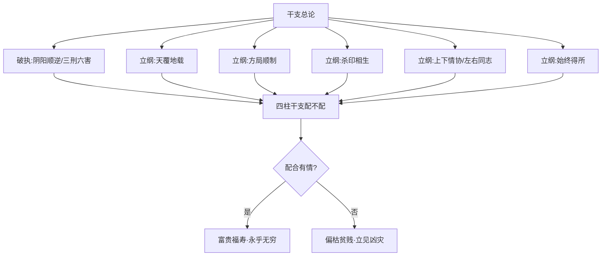

# 干支总论

## 阴阳顺逆——长生十二宫之破执

> 【原文】阴阳顺逆之说，《洛书》流行之用，其理信有之也，其法不可执一。
>
> 【原注】阴生阳死，阳顺阴逆，此理出于《洛书》。五行流行之用，固信有之，然甲木死午，午为泄气之地，理固然也，而乙木死亥，亥中有壬水，乃其嫡母，何为死哉？凡此皆详其干支轻重之机，母子相依之势，阴阳消息之理，而论吉凶可也。若专执生死败绝之说，推断多误矣。

原注破「阴生阳死、阳顺阴逆」之执——

- **「其理信有之」**：承认《洛书》五行流行之理的存在；
- **「其法不可执一」**：但**不可执定**阴阳顺逆推断吉凶。
- **「乙木死午」之疑**：按阳生阴死之说，乙木死在午——然**午为泄气之地**尚可说，**若乙木死在亥**，则亥中有壬水为乙之嫡母，**何为死哉**？

> 【任氏曰】阴阳顺逆之说，其理出《洛书》，流行之用，不过阳主聚，以进为退，阴主散，以退为进。若论命理，则不专以顺逆为凭，须观日主之衰旺，察生时之浅深，究四柱之用神，以论吉凶，则了然矣。至于长生沐浴等名，乃假借形容之辞也。长生者，犹人之初生也；沐浴者，犹人之初生而沐浴以去垢也；冠带者，形气渐长，犹人年长而冠带也；临官者，由长而旺，犹人之可以出仕也；帝旺者，壮盛之极，犹人之辅帝而大有为也；衰者，盛极而衰，物之初变也；病者，衰之甚也；死者，气之尽而无余也；墓者，造化有收藏，犹人之埋于土也；绝者，前之气绝而后将续也；胎者，后之气续而结胎也；养者，如人之养母腹也，自是而复长生，循环无端矣。

任氏把十二宫（长生、沐浴、冠带、临官、帝旺、衰、病、死、墓、绝、胎、养）**重新定义为「假借形容之辞」**——这是对命理界「长生十二宫」的根本性重塑。任氏以人事（人之初生、年长、出仕、辅帝、衰变、埋土、续气、养母腹）为喻，把十二宫从「固定吉凶位」**拉回「气之循环的描述」**。

> 【任氏曰】人之日主不必生逢禄旺，即月令休囚，而年日时中，得长生禄旺，便不为弱，就使逢库，亦为有根。时说谓投墓而必冲者，俗书之谬也。古法只有四长生，从无子、午、卯、酉为阴长生之说。水生木，申为天关，亥为天门，天一生水，即生生不息，故木皆生在亥。木死午为火旺之地，木至午发泄已尽，故木皆死在午。言木而余可类推矣。

任氏再做两层破执——

- **「日主不必生逢禄旺」**：月令休囚者，年日时中得长生禄旺便不算弱；
- **「投墓而必冲者，俗书之谬也」**：投墓（辰戌丑未）**未必需冲**；
- **「古法只有四长生」**：**只有四长生（寅申巳亥）之说，从无子午卯酉为阴长生之说**——这又是对命理界「阴干另有长生」之说的根本破斥。

> 【任氏曰】夫五阳育于生方，盛于本方，弊于泄方，尽于克方，于理为顺；五阴生于泄方，死于生方，于理为背。即曲为之说，而子午之地，终无产金产木之道；寅亥之地，终无灭火灭木之道。古人取格，丁遇酉以财论，乙遇午、己遇酉、辛遇子、癸遇卯，以食神泄气论，俱不以生论。乙遇亥、癸遇申以印论，倶不以死论。即己遇寅岁之丙火，辛遇巳藏之戊土，亦以印论，不以死论。由此观之，阴阳同生同死可知也，若执定阴阳顺逆，而以阳生阴死，阴生阳死论命，则大谬矣。

任氏的总结——

- **「阴阳同生同死」**：五阳（五阴）虽有「顺」「背」之别，但**「子午之地终无产金产木之道、寅亥之地终无灭火灭木之道」**——五行之物**不能无中生有**；
- **古人取格的依据**：丁遇酉（财论）、乙遇午（食神论）、乙遇亥（印论）——**古人论命从「五行生克」入手，而非从「阴阳生死」入手**；
- **「执定阴阳顺逆……大谬矣」**：再次重申——**「顺逆」是死法，**「生克」是活法**。

### 命造一（任氏曰第1例）：丙子 己亥 乙亥 丙子——阳春向暖之清

> 【命造一（任氏曰第1段）】丙子 己亥 乙亥 丙子
>
> 庚子 辛丑 壬寅 癸卯 甲辰 乙巳
>
> 乙亥日元，生于亥月，喜其天干两透丙火，不失阳春之景。寒木向阳，清而纯粹，惜乎火土无根，水木太重，读书未售；兼之中年一路水木，生扶太过，局中火土皆伤，以致财鲜聚而志未伸。然喜无金，业必清高。若以年时为乙木病位，月日为死地，岂不休囚已极，宜用生扶之运？今以亥子之水作生论，则不宜再见水木也。

**命局结构**——年丙子、月己亥、日乙亥、时丙子。天干丙己乙丙，地支子、亥、亥、子。

**格局分析**——

- **乙亥日主**，生于亥月（十月），「寒木向阳」——**需火调候**；
- **「天干两透丙火」**：年干丙、时干丙，**两透调候用神**；
- **「火土无根」**：丙火在亥月为「绝」（按：丙火长生在寅，亥为绝地），**火无根**；己土亦虚浮；
- **「水木太重」**：亥、亥、子、子皆水木，**水木成党**；
- **「读书未售」**：火土（财官）受伤，**仕途难遂**；
- **「中年一路水木」**：庚子、辛丑、壬寅、癸卯多水木运，**生扶太过**——**「财鲜聚而志未伸」**；
- **「喜无金」**：四柱无金，**不泄秀太过**——**「业必清高」**。

**任氏破执**——

- **「若以年时为乙木病位、月日为死地」**：按「乙木病在子、死在亥」之长生十二宫，**日主休囚已极，宜用生扶之运**；
- **「今以亥子之水作生论」**：任氏反其道——以亥子水为生扶乙木之物，**则不宜再见水木**（生扶太过反为害）。

**任氏用意**——**以「水为生」与「水为害」两面证「执生死则误」**——同一五行之物，在衰旺不同的格局中可作吉神或凶神，**不可执定长生十二宫位**。

### 命造二（任氏曰第2例）：戊午 乙卯 癸卯 癸亥——食神生旺之疑

> 【命造二（任氏曰第2段）】戊午 乙卯 癸卯 癸亥
>
> 丙辰 丁巳 戊午 己未 庚申 辛酉
>
> 此春水多木，过于泄气，五行无金，全赖亥时比劫帮身。嫌其亥卯拱局，又透戊土，克泄并见，交戊午运不寿。若据书云，癸水两坐长生，时逢旺地，何以不寿？又云"食神有寿妻多子,食神生旺胜财官"，此名利两全，多子有寿之格也。总以阴阳生死之说，不足凭也。

**命局结构**——年戊午、月乙卯、日癸卯、时癸亥。天干戊乙癸癸，地支午、卯、卯、亥。

**格局分析**——

- **癸卯日主**，生于卯月（仲春二月），**木旺**；
- **「春水多木，过于泄气」**：癸水日主、癸水时干，**水被卯木（食伤）泄**；
- **「五行无金」**：无金生水；
- **「全赖亥时比劫帮身」**：时支亥中壬水（劫财）帮身；
- **「亥卯拱局」**：亥卯未三合木局之半合，**木势愈旺**；
- **「戊土克泄并见」**：年干戊土（官星）克癸水，**官星又泄于木**（木克土）；
- **「交戊午运不寿」**：戊午运，**戊癸合火、午火泄木生土**——克泄交加，**不寿**。

**任氏破执**——

- **「癸水两坐长生，时逢旺地」**：按「癸水长生在卯」之说，**癸水两坐卯木长生之地，时逢亥旺（按：壬水禄在亥，癸水亦借亥为旺）**——**似为身旺之格**；
- **「食神有寿妻多子，食神生旺胜财官」**：按此俗说，**此造为「名利两全、多子有寿」之格**；
- **「总以阴阳生死之说，不足凭也」**：实战验证（戊午运不寿）证**俗说之谬**。

**任氏用意**——**同一命造，按「长生十二宫」与「食神生旺」之说皆判为吉格**，**实则不寿**——「生死」「食神」之俗说，**不可为论命之根**。

## 天覆地载——干支配合之大法

> 【原文】天地顺遂而精粹者昌，阴阳乖悖而混乱者亡。
>
> 【原注】不论有根无根，俱要天覆地载。

原注极简——「天覆地载」是干支配合的总则。**不论日主有根无根，俱要天覆地载**。

> 【任氏曰】取用干支之法，干以载之支为切，支以覆之干为切。如喜甲乙，而载以寅卯亥子，则生旺，载以申酉，则克败矣；忌丙丁，载以亥子则制伏，载以巳午寅卯，则肆逞矣。如喜寅卯，而覆以甲乙壬癸则生旺，覆以庚辛，则克败矣；忌巳午，而覆以壬癸则制伏，覆以丙丁甲乙，是肆逞矣。不特此也，干通根于支，支逢生扶，则干之根坚，支逢冲克，则干之根拔矣。支受荫于干，干逢生扶，则支之荫盛；干逢克制，则支之荫衰矣。凡命中四柱干支，则显然吉神而不为吉，确乎凶神而不为凶者，皆是故也，此无论天干一气，地支双清，总要天覆地载。

任氏把「天覆地载」讲透——

- **「干以载之支为切」**：天干喜忌，需看**所坐之地支**是否生扶；
- **「支以覆之干为切」**：地支喜忌，需看**所透之天干**是否生扶；
- **「干通根于支、支受荫于干」**：天干需地支之根、地支需天干之荫——**根坚则干强、荫盛则支旺**；
- **「显然吉神而不为吉、确乎凶神而不为凶者」**：吉神凶神**看天覆地载是否配合**，**配合得宜则吉神为吉、凶神化吉**；**配合失宜则反之**。

### 命造三（任氏曰第3例）：己亥 丁卯 庚申 庚辰——天覆地载之美

> 【命造三（任氏曰第3段）】己亥 丁卯 庚申 庚辰
>
> 丙寅 乙丑 甲子 癸亥 壬戌 辛酉
>
> 庚金虽生春令，支坐禄旺，时逢印比，足以用官。地支载以卯木财星，又得亥水生扶有情，丁火之根愈固，所谓"天地顺遂而精粹者昌"也。岁运逢壬癸亥子，干有己印卫官，支得卯财化伤，生平履险如夷，少年科甲，仕至封疆。经云："日主最宜健旺，用神不可损伤"，信斯言也。

**命局结构**——年己亥、月丁卯、日庚申、时庚辰。天干己丁庚庚，地支亥、卯、申、辰。

**格局分析**——

- **庚申日主**，生于卯月（仲春），**木旺金囚**——按：庚金在卯月为「胎」或「绝」（按：庚金长生在巳，卯为绝地），**日主本弱**；
- **「支坐禄旺」**：申为庚金禄地，**日支坐禄**；
- **「时逢印比」**：时干庚（比肩）、时支辰（湿土生金），**印比扶身**；
- **「足以用官」**：丁火（正官）可用；
- **「地支载以卯木财星」**：卯木为财，**财可生官**；
- **「亥水生扶有情」**：亥中壬水（食神）生卯木（财），**食神生财**；
- **「丁火之根愈固」**：卯木（财）生丁火（官），**财旺官根固**。

**任氏判语**——「天地顺遂而精粹者昌」——**财（卯木）生官（丁火）、食（壬水）生财（卯木）、印（己土）护官**——**循环相生、配合得宜**。

- **「岁运逢壬癸亥子」**：壬癸水（食神）生财（卯木），**「干有己印卫官」（己土护丁火不伤）**；
- **「支得卯财化伤」**：卯木化泄伤官之气；
- **「生平履险如夷、少年科甲、仕至封疆」**：一生顺利，**少年中进士**（按：「科甲」明清指进士出身），**仕至封疆大员**（按：「封疆」指巡抚、总督等省级大员）。

**任氏结语**——「日主最宜健旺，用神不可损伤」——**天覆地载、日主健旺、用神有护**——三者是富贵之格的关键。

### 命造四（任氏曰第4例）：己酉 丁卯 庚辰 甲申——地支不载之病

> 【命造四（任氏曰第4段）】己酉 丁卯 庚辰 甲申
>
> 丙寅 乙丑 甲子 癸亥 壬戌 辛酉
>
> 此亦以丁火官星为用，地支亦载以卯木财星，与前造大同小异。只为卯酉逢冲，克败丁火之根，支中少水，财星有克无生。虽时透甲木临于申支，谓地支不载，虽有若无。故身出旧家，诗书不继，破耗刑伤；一交戌运，支类西方，贫乏不堪。

**命局结构**（与命造三对照）——年己酉、月丁卯、日庚辰、时甲申。天干己丁庚甲，地支酉、卯、辰、申。

**格局分析**——

- **庚辰日主**，生于卯月；
- **「以丁火官星为用」**：丁火正官为用神；
- **「地支亦载以卯木财星」**：卯木（财）可生丁火（官）——与命造三同；
- **「卯酉逢冲」**：年支酉与月支卯相冲，**「克败丁火之根」**——按：卯中乙木为丁火之母、卯木为财，**财被冲则官星之根被拔**；
- **「支中少水」**：地支无水（食神），**财星有克无生**——按：卯木被冲后，**无食神（壬癸水）生财**；
- **「时透甲木临于申支」**：时干甲木（财）坐申，**甲木在申月（按：此为时支）绝地**——**「地支不载」**；
- **「虽有若无」**：甲木虽透但无根，**等于虚浮**。

**任氏判语**——

- **「身出旧家，诗书不继，破耗刑伤」**：家世虽好（按：年支酉为日主禄地，庚金有根），但**印绶（己土）被冲（卯酉冲木克土）、官星（丁火）之根（卯木）被冲**——**「破耗刑伤」**；
- **「一交戌运」**：戌运，戌与辰冲、戌与酉合（辰戌冲、酉戌害或半会）——**「支类西方」**（按：戌为西方金库，辰戌冲则开金库，金水加重）——**「贫乏不堪」**。

**任氏用意**——**同一日主（庚辰）、同一用神（丁火官星）、同一月令（卯月），因年支一字之差（亥→酉），天覆地载之配合全异**——一者卯木（财）有亥水生扶、配合有情；一者卯木被冲、孤根无援。

### 命造五（任氏曰第5例）：庚申 壬午 辛酉 癸巳——金水双清之失

> 【命造五（任氏曰第5段）】庚申 壬午 辛酉 癸巳
>
> 癸未 甲申 乙酉 丙戌 丁亥 戊子
>
> 此庚辛壬癸，金水双清，地支申酉巳午，煅炼有功，谓午火真神得用，理应名利双辉。所惜者五行无木，金虽失令而党多，火虽当令而无辅；更嫌壬癸覆之，紧贴庚辛之生，而申中又得长生，则壬水愈肆逞矣。虽有巳火助午，无如巳酉拱金，则午火之势必孤。所以申酉两运，破耗异常；丙戌运中，助起用神，大得际遇；一交亥运，壬水得禄，癸水临旺，火气克尽，家破身亡。

**命局结构**——年庚申、月壬午、日辛酉、时癸巳。天干庚壬辛癸，地支申、午、酉、巳。

**格局分析**——

- **辛酉日主**，生于午月（夏火当令）；
- **「金水双清」**：庚辛金、壬癸水皆透干，**金白水清**；
- **「地支申酉巳午，煅炼有功」**：申酉金、巳午火，**金火相煅**——按：火煅金成器，故「煅炼有功」；
- **「午火真神得用」**：午火（正官）为用神——**理应名利双辉**。

**任氏判语**——

- **「五行无木」**：无木（食神）通关金火；
- **「金虽失令而党多」**：午月火旺金囚，**但庚辛申酉金多成党**；
- **「火虽当令而无辅」**：午火虽当令，**但无木生火**；
- **「壬癸覆之」**：壬癸水（食神）覆于庚辛之上，**食神泄秀太过**；
- **「紧贴庚辛之生」**：壬癸紧贴庚辛，**金生水、水势盛**；
- **「申中又得长生」**：壬水长生在申，**申中壬水得禄**——**「壬水愈肆逞」**；
- **「巳酉拱金」**：巳与酉半合金，**巳中丙火被合**——**「午火之势必孤」**。

**运程分析**——

- **申酉两运（癸未、甲申、乙酉）**：金水运加重，**「破耗异常」**；
- **丙戌运**：丙火（劫财）助午火（官）、戌为火库，**「助起用神、大得际遇」**；
- **丁亥运**：亥为壬水之禄，**「壬水得禄、癸水临旺」**——**「火气克尽、家破身亡」**。

**任氏用意**——**金水双清之格，名似清贵，**实则金水成党、食神泄秀太过、午火（用神）被合而孤**——**「清」不等于「贵」**。

### 命造六（任氏曰第6例）：庚申 壬午 辛酉 甲午——毫厘千里之差

> 【命造六（任氏曰第7段）】庚申 壬午 辛酉 甲午
>
> 癸未 甲申 乙酉 丙戌 丁亥 戊子
>
> 此亦用午中丁火之杀，壬水亦覆之于上，亦有庚金紧贴之生。所喜者午时一助，更妙天干覆以甲木，则火之荫盛。且壬水见甲木而贪生，不来敌火，四柱有相生之谊，无争克之风，中乡榜，仕至观察。与前造只换得先后一时，天渊之隔，所谓毫厘千里之差也。

**命局结构**（与命造五对照）——年庚申、月壬午、日辛酉、时甲午。天干庚壬辛甲，地支申、午、酉、午。

**格局分析**——

- **辛酉日主**，生于午月；
- **「用午中丁火之杀」**：午中丁火（七杀）为用神——按：辛金以丁火为七杀；
- **「壬水亦覆之于上」**：月干壬水（食神）覆于日主之上；
- **「庚金紧贴之生」**：年干庚金（劫财）生壬水；
- **「所喜者午时一助」**：时支午火，**用神（午中丁火）得力**；
- **「天干覆以甲木」**：时干甲木（正财）透出，**甲木生丁火**——**「火之荫盛」**；
- **「壬水见甲木而贪生」**：壬水（食神）遇甲木（财）则**贪生不克火**——按：壬水本克丁火（合化木是另说），**但壬水见甲木则生木、不再克火**——**「不来敌火」**。

**任氏判语**——**「四柱有相生之谊，无争克之风」**——金（庚）生水（壬）、水生木（甲）、木生火（丁），**循环相生、配合有情**。

- **「中乡榜，仕至观察」**：中举人后**官至按察使/道台**（按：明清「观察」为按察使或分巡道、兵备道之别称）；
- **「与前造只换得先后一时」**：与命造五仅时干一字之差（癸→甲）；
- **「天渊之隔」**：命造五不寿、家破；命造六中乡榜、仕至观察——**「毫厘千里之差」**。

**任氏用意**——**甲木（财）一透，火有荫、壬水贪生——一字转关，天地翻覆**——这是「天覆地载」精微之至的验证。

## 天全一气——纯清与偏枯之辨

> 【原文】天全一气，不可使地德莫之载。
>
> 【原注】四甲四乙，而遇寅申卯酉，为地不载。

原注点出「天全一气」之病——天干四甲或四乙一气，**若地支遇寅申卯酉（地支与天干无生化），为地不载**。

> 【任氏曰】天全一气者，天干四甲、四乙、四丙、四丁、四戊、四己、四庚、四辛、四壬、四癸，皆是也。地支不载者，地支与天干无生化也。非特四甲四乙而遇申酉寅卯为不载，即全受克于地支。或反克地支，或天干不顾地支，或地支不顾天干，皆为不载也。如四乙酉者，受克于地支也；四辛卯者，反克地支也。必须地支之气上升，天干之气下降，则流通生化，而不至于偏枯，又得岁运安顿，非富亦贵矣。如无升降之情，反有冲克之势，皆为偏枯而贫贱矣。

任氏把「天全一气」与「地支不载」系统化——

- **「天全一气」**：十天干各有四字全之格（四甲、四乙……四癸）；
- **「地支不载」**：四层——
  1. **受克于地支**（地支克天干）；
  2. **反克地支**（天干克地支）；
  3. **天干不顾地支**（干支气不通）；
  4. **地支不顾天干**（地支不生天干）。
- **「地支之气上升、天干之气下降」**：干支**气机交流**，方为「天覆地载」；
- **「无升降之情，反有冲克之势，皆为偏枯」**：**偏枯之病**——**贫贱之格**。

### 命造七（任氏曰第8例）：甲申 甲戌 甲寅 甲戌——四甲一寅之拔

> 【命造七（任氏曰第8段）】甲申 甲戌 甲寅 甲戌
>
> 乙亥 丙子 丁丑 戊寅 己卯 庚辰
>
> 年支申金，冲去日主寅木，加以戌土乘权重见，生金助杀，谓地支不顾天干。夫四甲一寅，似乎强旺，第秋木休囚，冲去禄神，其根已拔，不作旺论。故寅卯亥子运中，衣食颇丰，一交庚辰，杀之元神透出。四子俱伤，破家不禄。干多不如支重，理固然也。

**命局结构**——年甲申、月甲戌、日甲寅、时甲戌。天干四甲，地支申、戌、寅、戌。

**格局分析**——

- **四甲一寅**：天干四甲一气，地支寅申戌戌；
- **「年支申金冲去日主寅木」**：申冲寅，**甲木禄神（寅）被冲去**；
- **「戌土乘权重见」**：月支戌、时支戌皆土库（戌为火库，藏戊辛丁），**土重**；
- **「生金助杀」**：戌中辛金（七杀）得土生，**杀旺**；
- **「谓地支不顾天干」**：地支申戌戌皆克泄甲木（日主），**地支不顾天干**；
- **「秋木休囚」**：戌月（九月）秋土旺，**甲木休囚**；
- **「不作旺论」**：四甲虽多，**但寅禄被冲、戌土乘权**——**不作旺论**。

**运程分析**——

- **寅卯亥子运（乙亥、丙子、丁丑、戊寅、己卯、庚辰的前段）**：寅运**重逢日主之禄**、亥子水生木——**「衣食颇丰」**；
- **庚辰运**：庚金（七杀）透出，**「杀之元神透出」**，**辰又为水库**（按：辰为湿土，可蓄水）——**「四子俱伤、破家不禄」**（按：四子即四柱四甲被庚金所克而伤）。

**任氏判语**——「干多不如支重，理固然也」——**「四甲」看似壮盛，**实则支不载干、禄被冲去、杀得地**——**天全一气若地支不载，反为偏枯**。

### 命造八（任氏曰第9例）：戊子 戊午 戊戌 戊午——四戊之熬

> 【命造八（任氏曰第9段）】戊子 戊午 戊戌 戊午
>
> 己未 庚申 辛酉 壬戌 癸亥 甲子
>
> 此满局火土，子衰午旺，冲则午发而愈烈，熬干滴水，是谓天干不覆。初交己未，孤苦万状；至庚申辛酉运，引通戊土之性，大得际遇，娶妻生子，立业成家；一交壬戌，水不通根，暗拱火局，遭祝融之变，一家五口皆亡。如天干透一庚辛，或地支藏一申酉，岂至若是之结局乎？

**命局结构**——年戊子、月戊午、日戊戌、时戊午。天干四戊，地支子、午、戌、午。

**格局分析**——

- **四戊一子三午戌**：天干四戊一气，地支子午午戌；
- **「满局火土」**：午戌半会火方、戊土成党——**火土旺**；
- **「子衰午旺，冲则午发而愈烈」**：子午相冲，**午（旺）冲子（衰）则子被拔**——**「熬干滴水」**（按：子水中藏癸水，癸水被火熬干）；
- **「天干不覆」**：天干四戊皆土，**无水（壬癸）润泽**——**天干不覆**。

**运程分析**——

- **己未运（己未、庚申、辛酉、壬戌、癸亥、甲子的前段）**：己未土仍助火土，**「孤苦万状」**；
- **庚申辛酉运**：庚辛金（食伤）透出，**「引通戊土之性」**（食伤泄秀为吉）——**「大得际遇、娶妻生子、立业成家」**；
- **壬戌运**：壬水（财）透出，戌为火库——**「水不通根、暗拱火局」**（按：壬水无根、戌为火库则火局暗助）——**「遭祝融之变，一家五口皆亡」**（按：祝融为火神，「祝融之变」即火灾）。

**任氏判语**——「如天干透一庚辛，或地支藏一申酉，岂至若是之结局乎」——**若天干有庚辛金（食伤）泄秀、或地支有申酉金（食伤之根）**，**当不至于此**——**「天干不覆」是此造之病根**。

### 命造九（任氏曰第10例）：戊申 戊午 戊戌 戊午——一申之转关

> 【命造九（任氏曰第11段）】戊申 戊午 戊戌 戊午
>
> 己未 庚申 辛酉 壬戌 癸亥 甲子
>
> 此与前造只换一申字，而天干之气下降，地支之水有源，午火虽烈，究不能伤申金，用金明矣，况有子水为去病之喜神。交申运，戊辰年四月入学，九月登科，盖得太岁辰字，暗会水局之妙。惜将来壬戌运中，天干群比争财，地支暗会火局，未见其吉矣。

**命局结构**（与命造八对照）——年戊申、月戊午、日戊戌、时戊午。天干四戊，地支申、午、戌、午。

**格局分析**——

- **四戊一申三午戌**：与命造八仅年支一字之差（子→申）；
- **「天干之气下降」**：申中藏庚壬戊，**庚金（食伤）生壬水（财）**——**天干之气有降路**；
- **「地支之水有源」**：申中壬水（长生），**壬水有根**；
- **「午火虽烈，究不能伤申金」**：午与申无冲无合（按：寅午戌三合火，申与午不合不冲），**申金不被火伤**；
- **「用金明矣」**：庚辛金（食伤）为用——**泄秀**；
- **「子水为去病之喜神」**：按：此造原局无子，但行运中可能有子。

**运程分析**——

- **交申运（己未、庚申、辛酉、壬戌、癸亥、甲子的申运段）**：申运与原局申并临，**「庚金得禄」**——**「戊辰年四月入学，九月登科」**（按：辰年辰为湿土、水库，**「暗会水局」**——按：申子辰三合水局，辰为水库，**戊辰年太岁辰与原局申合，引出壬水财星为喜**）——**科甲成名**；
- **壬戌运**：壬水（财）透出，戌为火库——**「天干群比争财」（四戊争一壬）**——**「地支暗会火局」**（按：午戌半会火）——**「未见其吉」**。

**任氏用意**——**与命造八仅年支一字之差（子→申），一者家破人亡、一者登科成名**——**「毫厘千里」又一验证**——**「天覆地载」之配合，全在地支一气之流转**。

### 命造十（任氏曰第11例）：辛卯 辛卯 辛卯 辛卯——四辛之绝

> 【命造十（任氏曰第12段）】辛卯 辛卯 辛卯 辛卯
>
> 庚寅 己丑 戊子 丁亥 丙戌 己酉
>
> 此造四木当权，四金临绝，虽曰反克地支，实无力克也。如果能克，可用财矣，若能用财，岂无成立乎？彼此母腹，数年间父母皆亡，与道士为徒；己丑戊子运，印绶生扶，衣食无亏；一交丁亥，生火克金，即亡其师，所有微业，嫖赌扫尽而死。

**命局结构**——年辛卯、月辛卯、日辛卯、时辛卯。天干四辛，地支卯、卯、卯、卯。

**格局分析**——

- **四辛四卯**：天干四辛金一气，地支四卯木一气；
- **「四木当权」**：卯木（仲春）当令，**木旺**；
- **「四金临绝」**：辛金在卯月为「绝」（按：辛金长生在子，卯为绝地），**金绝**；
- **「虽曰反克地支，实无力克也」**：辛金虽可克卯木，**但金绝无力**——**「金不能克木」**；
- **「如果能克，可用财矣」**：若金真能克木则财（木）可用；
- **「若能用财，岂无成立乎」**：然金不能克木，**财不能用**——**「岂无成立」**。

**运程分析**——

- **「彼此母腹」**：出生不久（按：「彼此母腹」指在父母怀抱中）；
- **「数年间父母皆亡，与道士为徒」**：幼失怙恃，**入道观**；
- **己丑、戊子运**：己丑土（印绶）、戊子土水（印比）生扶辛金，**「衣食无亏」**；
- **丁亥运**：丁火（正官）克金、亥中壬水（食神）泄金——**「生火克金」**——**「即亡其师」**；
- **「所有微业，嫖赌扫尽而死」**：家业荡尽，**潦倒而亡**。

**任氏判语**——**「反克」之名而无反克之实**——**「金绝无力克木」**是此造之病根——**「天全一气、地全一气」之格，**虽似壮盛，**实则「彼此无力、偏枯无依」**。

## 地全三物——方局之顺制

> 【原文】地全三物，不可使天道莫之容。
>
> 【原注】寅卯辰、亥卯未而遇甲庚乙辛，则天不覆。然不特全一气与三物者，皆宜天覆地载，不论有根无根，皆要循其气序，干支不反悖为妙。

原注点出「地全三物」之病——地支三会（寅卯辰、亥卯未等）若遇天干克泄（如甲木遇庚金），**则天不覆**。**「不特全一气与三物者，皆宜天覆地载」**——**「天覆地载」是普遍之理**。

> 【任氏曰】地支三物者，支得寅卯辰、巳午未、申酉戌、亥子丑之方是也。如寅卯辰日主是木，要天干火多；日主是火，要天干金旺；日主是金，要天干土重。大凡支全三物，其势旺盛。如旺神在提纲，天干必须顺其气势，泄之可也；如旺神在别支，天干制之有力，制之可也。何以旺神在提纲，只宜泄而不宜制？夫旺神在提纲者，必制神之绝地也，如强制之，不得其性，用激而肆逞矣。旺神者，木方提纲得寅卯也是也；制神者，庚辛金也，寅卯乃庚辛之绝地也。如辰在提纲，四柱干支又有庚辛之助，方可制矣。所谓循其气序，调剂得宜，斯为全美。

任氏把「地全三物」分两类——

- **旺神在提纲**（月令）：**只宜泄、不宜制**——按：制神在提纲是绝地，**强制之反激其怒**；
- **旺神在别支**：**可制之有力**——按：制神在提纲（如辰月）有庚辛之助，**可制**。

「循其气序、调剂得宜」——**这是论方局之格的总诀**。

### 命造十一（任氏曰第13例）：辛卯 庚寅 甲辰 丙寅——方局不可制

> 【命造十一（任氏曰第13段）】辛卯 庚寅 甲辰 丙寅
>
> 己丑 戊子 丁亥 丙戌 乙酉 甲申
>
> 此寅卯辰东方，兼之寅时，旺之极矣。年月两金临绝，旺神在提纲，休金难克，而且丙火透时，木火同心，谓强众而敌寡，势在去庚辛之寡。早行土运生金，破耗异常，进京入部办事；至丙戌运，分发广东，得军功，升知县，喜其克尽庚辛之美；至酉，庚辛得地，不禄宜矣。

**命局结构**——年辛卯、月庚寅、日甲辰、时丙寅。天干辛庚甲丙，地支卯、寅、辰、寅。

**格局分析**——

- **甲辰日主**，地支寅卯辰东方木局（寅卯辰三会木），**「旺之极矣」**；
- **「年月两金临绝」**：辛金（年干）、庚金（月干）**在寅卯辰月皆绝**——**金无力**；
- **「旺神在提纲」**：寅卯辰方局的旺神（寅卯木）在提纲（月支寅），**「只宜泄、不宜制」**；
- **「丙火透时，木火同心」**：丙火（食神）泄木秀，**木火同心**——**「强众而敌寡」**；
- **「势在去庚辛之寡」**：去庚辛之金（七杀），**去寡扶众**。

**运程分析**——

- **早行土运（己丑、戊子、丁亥、丙戌的前段）**：土生金，**「破耗异常」**——按：土运生金，金来克木反激木怒；
- **丙戌运**：丙火（食神）助木火之势、戌为火库，**「克尽庚辛之美」**——**「分发广东、得军功、升知县」**；
- **乙酉、甲申运**：乙木（比肩）助木、申金（官杀）**「庚辛得地」**——**「不禄宜矣」**（按：申酉金得地则金有力克木，木旺神被制——但命主已克尽庚辛，复行庚辛之运，必受金克而亡）。

**任氏判语**——**「方局之旺在提纲，只宜泄、不宜制」**——这是任氏对方局论的总判——**早运土生金反激木怒**，**火运助木火之势则吉**，**金运来制则凶**。

### 命造十二（任氏曰第14例）：庚寅 庚辰 甲寅 丁卯——方局可制之例

> 【命造十二（任氏曰第14段）】庚寅 庚辰 甲寅 丁卯
>
> 辛巳 壬午 癸未 甲申 乙酉 丙戌
>
> 此亦寅、卯、辰东方。旺神不是提纲，辰土归垣，庚金得载，力量足以克木，丁火虽透，非庚金之敌，用杀明矣。至甲申运，庚金禄旺暗冲寅木，科甲联登，仕至郡守；一交丙运制杀，降职归田。

**命局结构**——年庚寅、月庚辰、日甲寅、时丁卯。天干庚庚甲丁，地支寅、辰、寅、卯。

**格局分析**（与命造十一对照）——

- **甲寅日主**，地支寅辰寅卯，**寅卯辰东方木局**；
- **「旺神不是提纲」**：提纲（月支）是辰土而非寅卯，**旺神在年支寅与时支卯（不在提纲）**；
- **「辰土归垣，庚金得载」**：辰为湿土，可生金；庚金（年干、月干）得辰土之载，**金有力**；
- **「丁火虽透，非庚金之敌」**：丁火（正官）虽透，**但庚金（杀）两透且得载，**「杀强而官弱」**；
- **「用杀明矣」**：以庚金（七杀）为用——**制之**。

**运程分析**——

- **甲申运**：甲木（比肩）助日主，申金（七杀之禄）冲寅木——**「庚金禄旺暗冲寅木」**——**「科甲联登，仕至郡守」**；
- **乙酉运**：乙木（劫财）助日主、酉金（七杀之禄）助杀，**「杀强身旺」**——**继续升迁**；
- **丙运**：丙火（食神）制杀，**「降职归田」**。

**任氏判语**——**「旺神在提纲，只宜泄；旺神不在提纲，可制」**——**「循其气序、调剂得宜」**——**辰土归垣、庚金得载**，**方可制**。

## 阳乘阳位、阳乘阴位——局之寒暖与行运

> 【原文】阳乘阳位阳气昌，最要行程安顿。
>
> 【原注】六阳之位，独子、寅、辰为阳方，为阳位之纯。五阳居之，如若是旺神，最要行运阴顺安顿之地。

> 【任氏曰】六阳皆阳，非子、寅、辰阳之纯也，须分阳寒阳暖而论也。西北为寒，东南为暖，如若申、戌、子全，为西北之阳寒，最要行运遇卯、巳、未东南之阴暖是也；如寅、辰、午全，为东南之阳暖，最要行运酉亥丑西北之阴寒是也。此举大局而论，若遇日主之用神喜神，或木，或火，或土，是东南之阳暖，岁运亦宜配西北之阴水、阴木、阴火，方能生助喜神用神，而欢如酬酢。若岁运遇西北之阳水、阳木、阳火，则为孤阳不生，纵使生助喜神，亦难切当，不过免崎岖而趋平坦也。阳暖之局如此，阳寒之局亦如此论，所谓"阳盛光昌刚健之势，须配以阴盛包含柔顺之地"是也。

任氏把「阳乘阳位」进一步分「阳寒」「阳暖」——

- **西北（申戌子全）**：**阳寒**，行运需东南（卯巳未）之阴暖；
- **东南（寅辰午全）**：**阳暖**，行运需西北（酉亥丑）之阴寒；
- **「阳盛光昌刚健之势，须配以阴盛包含柔顺之地」**——**阳局行运需阴，方为「安顿」**。

> 【原文】阳乘阴位气盛，还须道路光亨。
>
> 【原注】六阴之位，独酉亥丑为阴方，乃阴位之纯。五阴居之，如若是旺神，最要行运阳顺光亨之地。

> 【任氏曰】六阴皆阴，非酉、亥、丑为阴之盛也，须分阴寒阴暖而论也。承上文西北为寒，东南为暖，假如酉、亥、丑全，为西北之阴寒，最要行运遇东南寅、辰、午之阳暖是也。如卯、巳、未全，为东南之阴暖，最要行运遇申、戌、子西北之阳寒是也。此举大局而论，若日主之用神，喜神，或金，或水，或土，是西北之阴寒，岁运亦宜配东南之阳金、阳火、阳土，方能助用神喜神，而福力弥增。若岁运遇东南之阴金、阴火、阴土，则为纯阴不育，难获厚福，不过和平而无灾咎也。阴寒之局如此论，阴暖之局亦如此论，所谓"阴盛包含柔顺之气，须配以阳盛光昌刚健之地"者是也。

任氏把「阳乘阴位」分「阴寒」「阴暖」——

- **西北（酉亥丑全）**：**阴寒**，行运需东南（寅辰午）之阳暖；
- **东南（卯巳未全）**：**阴暖**，行运需西北（申戌子）之阳寒；
- **「阴盛包含柔顺之气，须配以阳盛光昌刚健之地」**——**阴局行运需阳，方为「光亨」**。

### 命造十三（任氏曰第15例）：癸巳 丙辰 丙午 庚寅——东南阳暖之配

> 【命造十三（任氏曰第15段）】癸巳 丙辰 丙午 庚寅
>
> 乙卯 甲寅 癸丑 壬子 辛亥 庚戌
>
> 此东南之阳暖。天干金水，似乎无根，喜月支辰土，泄火蓄水而生金，庚金挂角逢生，则庚金可用。癸水即庚金之喜神。初运乙卯甲寅，金绝火生而水泄，孤苦不堪；一交癸丑北方阴湿之地，金水通根，又得巳丑拱金之妙，出外大得际遇，骤然发财十余万。阳暖逢寒，配合之美也。

**命局结构**——年癸巳、月丙辰、日丙午、时庚寅。天干癸丙丙庚，地支巳、辰、午、寅。

**格局分析**——

- **丙午日主**，地支巳、辰、午、寅——**寅午戌（缺戌）三合火方**、巳午火方，**东南阳暖之局**；
- **「天干金水似乎无根」**：癸水（正官）、庚金（偏印）看似虚浮；
- **「喜月支辰土」**：辰为湿土，**「泄火蓄水而生金」**（按：辰为水库蓄水、辰为土生金、辰为湿土泄火）——**「庚金挂角逢生」**；
- **「庚金可用」**：庚金（偏印）有辰土之生，**可用**；
- **「癸水即庚金之喜神」**：癸水为庚金之助，**金水皆可用**。

**运程分析**——

- **初运乙卯、甲寅**：木运生火，**「金绝火生而水泄」**——**「孤苦不堪」**；
- **癸丑运**：癸水（官星）透出，丑为金库（按：丑中藏辛癸己）——**「北方阴湿之地，金水通根」**；**「巳丑拱金」**（按：巳酉丑三合金，巳丑半合）——**「出外大得际遇，骤然发财十余万」**。

**任氏判语**——「阳暖逢寒，配合之美也」——**东南阳暖之局行北方阴湿运，阴阳配合、骤然发福**。

### 命造十四（任氏曰第16例）：戊寅 乙丑 丙寅 庚寅——东南不遇之困

> 【命造十四（任氏曰第17段）】戊寅 乙丑 丙寅 庚寅
>
> 丙寅 丁卯 戊辰 己巳 庚午 辛未
>
> 丙寅日元，虽支遇三寅，最喜丑土乘权，财星归库。若运走西北土金，财业必胜前造，惜一路东南木火之地，祖业破尽，遍历数省，奔驰不遇，至午运暗会劫局，死于广东。一事无成，莫非运也。

**命局结构**——年戊寅、月乙丑、日丙寅、时庚寅。天干戊乙丙庚，地支寅、丑、寅、寅。

**格局分析**（与命造十三对照）——

- **丙寅日主**，地支寅丑寅寅；
- **「三寅」**：寅中藏甲丙戊，**木火成党**；
- **「丑土乘权，财星归库」**：丑为金库（藏辛）、为财星之库（按：丑为己土之禄、辛金之库），**「财星归库」**；
- **「庚金可用」**：时干庚金（偏印）可用。

**运程分析**（与命造十三对照）——

- **若运走西北土金（庚午、辛未的前段）**：**「财业必胜前造」**（按：若行庚辛申酉金运，庚金得禄、辛金得用，**财业当胜命造十三**）；
- **惜一路东南木火（丙寅、丁卯、戊辰、己巳）**：木火运**「祖业破尽、奔驰不遇」**——按：东南木火加重火势、克金伤财，**命主无财可用**；
- **至午运暗会劫局**：午与寅半合火（寅午戌三合火，寅午半合），**「暗会劫局」**——按：劫财为火（丙火比肩），**「死于广东」**。

**任氏判语**——「若运走西北土金，财业必胜前造」——**命造与命造十三同属东南阳暖、丑辰皆有用**，**然命造十三行北方阴湿运（癸丑）发福、命造十四行东南木火运（丙寅、丁卯、戊辰、己巳）潦倒**——**「命好不如运好」**。

### 命造十五（任氏曰第18例）：丙子 己亥 乙酉 壬午——西北阴寒之调

> 【命造十五（任氏曰第18段）】丙子 己亥 乙酉 壬午
>
> 庚子 辛丑 壬寅 癸卯 甲辰 己巳
>
> 此全酉、亥、子西北之阴寒。寒木更宜向阳，以丙火为用，壬水即其病也。然喜壬水远隔，与日主紧贴，日主本衰，未尝不喜其生，又有己土透干，亦能砥定中流。且喜天干水木火土，各立门户，相生有情；地支午火紧制七杀，年月火土，通根禄旺。更喜行运东南阳暖之地，不但四柱有情，而且行运光亨，早年联登甲第，仕至封疆，皆阴阳配合之妙也。

**命局结构**——年丙子、月己亥、日乙酉、时壬午。天干丙己乙壬，地支子、亥、酉、午。

**格局分析**——

- **乙酉日主**，地支子、亥、酉、午——**西北（酉亥子全）阴寒之局**；
- **「寒木向阳」**：乙木日主在酉月（秋金）寒气重，**需丙火调候**；
- **「丙火为用」**：年干丙火（食神）为用神；
- **「壬水即其病也」**：时干壬水（正官）克丙火，**「壬水为病」**；
- **「喜壬水远隔，与日主紧贴」**：壬水（时干）与日主（乙）紧贴，**虽为病但生身**；
- **「己土透干」**：己土（偏财）可制壬水、**「砥定中流」**；
- **「天干水木火土，各立门户」**：壬水生乙木、乙木生丙火、丙火生己土——**「相生有情」**；
- **「地支午火紧制七杀」**：时支午火（七杀）紧制酉金（七杀，乙木以金为杀）；
- **「年月火土，通根禄旺」**：年支子（丙火在子为绝）、月支亥（己土在亥为绝）——按：此处任氏说「通根禄旺」可能是指年干丙火通根于时支午（月己亥通根于月支亥己土禄地）——

**任氏判语**——「早年联登甲第，仕至封疆」——**少年中进士、官至封疆大员**。

**任氏用意**——**「西北阴寒之局，行东南阳暖之地」**——**「行运光亨」**——**阴阳配合之妙**。

### 命造十六（任氏曰第19例）：己亥 丙子 乙丑 壬午——阴寒不遇之困

> 【命造十六（任氏曰第19段）】己亥 丙子 乙丑 壬午
>
> 乙亥 甲戌 癸酉 壬申 辛未 庚午
>
> 此与前只换一酉子。以俗论之，酉换丑更美，酉乃七杀克我，丑乃偏财我克，又能止水，何其妙也。不知丑乃湿土，能泄火不能止水，酉虽七杀，午火紧克，不泄火之元神；彼则丙火在年，壬水遥远，又得己土一隔，此则丙火在月，壬水相近，已土不能为力，子水又逼近相冲。而且运走西北阴寒之地，丙火一无生扶，乙木何能发生？十干体象去："虚湿之地，骑马亦忧"，斯言不谬也。所以屈志芸窗，一贫如洗，克妻无子，至壬申运，丙火克尽而亡。所谓"阴乘阴位阴气盛"也。

**命局结构**（与命造十五对照）——年己亥、月丙子、日乙丑、时壬午。天干己丙乙壬，地支亥、子、丑、午。

**格局分析**（与命造十五对照）——

- **乙丑日主**，地支亥、子、丑、午——**西北阴寒之局**（亥子丑北方水局）；
- **「丙火在月、壬水相近」**：与命造十五（「丙火在年、壬水遥远」）形成对照；
- **「己土不能为力」**：己土（年干）虽可制壬水，**但壬水近丙火、己土远隔**——**己土制水之力减弱**；
- **「子水又逼近相冲」**：月支子与时支午冲，**「水火交战」**；
- **「运走西北阴寒之地」**：乙亥、甲戌、癸酉、壬申、辛未、庚午多西北金水运，**加重阴寒**；
- **「丙火一无生扶」**：丙火（用神）在西北阴寒运中无根无助，**「克尽而亡」**。

**任氏判语**——「屈志芸窗，一贫如洗，克妻无子，至壬申运，丙火克尽而亡」——**「阴乘阴位阴气盛」**——**「虚湿之地，骑马亦忧」**（按：虚湿之地为乙木之象，与本节「阴乘阴位」之理可互参，本篇不展开）。

## 地生天——印绶之根

> 【原文】地生天者，天衰怕冲。
>
> 【原注】如丙寅、戊寅、丁酉、壬申、癸卯、己酉，皆长生日主，甲子、乙亥、丙寅、丁卯、己巳，皆自生日主，如主衰逢冲，则根拔而祸更甚。

原注把「地生天」分两类——

- **「长生日主」**：如丙寅（丙火长生在寅）、戊寅、丁酉（按：丁火长生在酉）、壬申、癸卯、己酉（按：己土长生在酉）；
- **「自生日主」**：如甲子（按：甲木生在子）、乙亥、丙寅、丁卯、己巳。

**「如主衰逢冲，则根拔而祸更甚」**——日主若衰而印（地生天）被冲，**根被拔、祸更甚**。

> 【任氏曰】地生天者，如甲子、丙寅、丁卯、己巳、戊午、壬申、癸酉、乙亥、庚辰、辛丑是也。日主生于不得令之月，柱中又少帮扶，用其身印，冲则根拔，生机绝矣，为祸最重。若日主得时当令，或年时皆逢禄旺，或天干比劫重叠，或官星衰弱，反忌印绶之泄，则不怕冲破矣。总之看日主之气势，旺相者喜冲，休囚者怕冲。虽以日主而论，岁运冲亦然。

任氏把「地生天」展开为十组地支——甲子、丙寅、丁卯、己巳、戊午、壬申、癸酉、乙亥、庚辰、辛丑，皆是「地支藏有日主之长生或禄地」之配。

**「日主得时当令……反忌印绶之泄，则不怕冲破」**——**日主旺时反忌印绶**——这是对「印绶必吉」俗见的反例。

### 命造十七（任氏曰第20例）：甲寅 戊辰 丙寅 丙申——乘印就财

> 【命造十七（任氏曰第20段）】甲寅 戊辰 丙寅 丙申
>
> 乙巳 庚午 辛未 壬申 癸酉 甲戌
>
> 此坐下印缓，生于季春，印气有余，又年逢甲寅，则太过矣。土虽当令，而木更坚，喜其寅申逢冲，财星得用，第嫌比肩盖头，冲之无力。早年运走南方，起倒异常；至壬申癸酉二十年，申冲寅木，克去比肩，创业兴家。此谓乘印就财也。

**命局结构**——年甲寅、月戊辰、日丙寅、时丙申。天干甲戊丙丙，地支寅、辰、寅、申。

**格局分析**——

- **丙寅日主**，地支寅、辰、寅、申——**「坐下印绶」**（按：寅中藏甲丙戊，丙火之禄在寅）；
- **「生于季春，印气有余」**：辰月（季春三月），**土印当令**；
- **「年逢甲寅，则太过矣」**：年干甲木（食神）、年支寅，**木火成党**——**「印气太过」**；
- **「喜其寅申逢冲，财星得用」**：时支申与原局寅冲，**「财星（申金）得用」**——按：申金为丙火之财（七杀或偏财）；
- **「第嫌比肩盖头」**：时干丙（比肩）盖于申之上，**「冲之无力」**——比肩夺财。

**运程分析**——

- **早年运走南方（乙巳、庚午、辛未）**：火运助比劫，**「起倒异常」**；
- **壬申、癸酉运**：壬癸水（官杀）制比肩，**申冲寅木、克去比肩**——**「创业兴家」**。

**任氏判语**——「乘印就财」——**印绶（寅中甲木丙火）虽旺而太过，**行运去印就财**（去比肩、用申财）方成大业。

### 命造十八（任氏曰第21例）：壬申 甲辰 丙寅 丙申——独杀用印

> 【命造十八（任氏曰第22段）】壬申 甲辰 丙寅 丙申
>
> 乙巳 丙午 丁未 戊申 己酉 庚戌
>
> 此坐下印绶亦在季春，印绶未尝无余气，年干壬杀生印有情，不足畏也，所嫌者，两申冲寅，甲木之根拔。还喜壬水泄金生木，运走丙午劫去申财，入学补廪登科；丁未合去壬水，三走春闱不捷；戊申克去壬水，三冲寅木而死于途。此造之壬水，乃甲木之原神，断不可伤，壬水受伤，甲木必孤。凡独杀用印者，最忌制杀也。

**命局结构**——年壬申、月甲辰、日丙寅、时丙申。天干壬甲丙丙，地支申、辰、寅、申。

**格局分析**——

- **丙寅日主**，地支申、辰、寅、申——**「坐下印绶亦在季春」**（与命造十七同月令）；
- **「年干壬杀生印有情」**：年干壬水（七杀）生甲木（印），**「杀印相生」**；
- **「两申冲寅，甲木之根拔」**：年支申、时支申皆冲寅，**「甲木之根拔」**——按：寅中藏甲丙戊，甲木为丙火之母、印绶之根；
- **「壬水泄金生木」**：壬水（七杀）泄申金、**生甲木**（印）——**「独杀用印」**格局。

**运程分析**——

- **丙午运**：丙火（比肩）劫去申财（七杀）——**「入学补廪登科」**（按：补廪为明清秀才补入廪膳生员，登科为中举或中进士）；
- **丁未运**：丁火（劫财）合去壬水（七杀）——**「三走春闱不捷」**（按：春闱为会试，三次未中）；
- **戊申运**：戊土（伤官）克去壬水（七杀）——**「三冲寅木」（原局两申+戊申运三申冲寅）**——**「死于途」**。

**任氏判语**——「独杀用印者，最忌制杀也」——**壬水（七杀）虽为忌，**却是甲木（印）之原神——**制壬水则甲木孤、印绶失源**——**「壬水受伤、甲木必孤」**。

**任氏用意**——**与命造十七同月令、坐下印绶，**然命造十七**「乘印就财」**可行，命造十八**「独杀用印」**不可制杀——**「去印就财」与「独杀用印」是两种完全不同的格局**。

## 天合地——合而从之

> 【原文】天合地者，地旺喜静。
>
> 【原注】如丁亥、戊子、甲午、己亥、辛巳、壬午、癸巳之类，皆支中人元，与天干相合者。此乃坐下财官之地，财官若旺，则宜静不宜冲。

原注给「天合地」下定义——**支中藏干与天干相合**——丁亥（丁壬合——亥中壬与丁合）、戊子（戊癸合——子中癸与戊合）、甲午（甲己合——午中己与甲合）、己亥（甲己合——亥中甲与己合，但甲藏亥中）、辛巳（丙辛合——巳中丙与辛合）、壬午（丁壬合——午中丁与壬合）、癸巳（戊癸合——巳中戊与癸合）——共七日。

**「坐下财官之地，财官若旺，则宜静不宜冲」**——**「地旺喜静」是此节总诀**。

> 【任氏曰】十干之合，乃阴阳相配者也。五阳合五阴为财，五阴合五阳为官，所以必合。尚有阴旺不从阳，阳旺不从阴，虽合不化，有争合、妒合、分合之别。若露干合支中暗干，则随局无所不合，无所不分争妒忌矣。此节本有至理，只因原注少变通耳。天合地三字，须活看轻看，重在下句"地旺喜静"四字，夫地旺者，天必衰也；喜静者。四支无冲克之物，有生助之神也。天干衰而无助，地支旺而有生，天干心怀忻合之意。若得地支元神透出，缘上天下地，升降有情，此合似从之意也，合财似从财，合官似从官，非十干合化之理也。所以静则居安，尚堪保守，动则履危，难以支持。然可言合者，只有
> 戊子 辛巳 丁亥 壬午四日耳，若甲午日，则午必先丁而后己，己土岂能专权而合甲？己亥日，亥必先壬而后甲，甲岂能出而合己？癸巳日，巳必先丙而后戊，戊岂能越过而合癸？此三日不论，至于十干，应合而化，则为化格，另有作用，解在化格章中。

任氏把「天合地」具体化为**四个真合日**——戊子、辛巳、丁亥、壬午。

理由是——

- **戊子日**：子中癸与戊合，**戊癸合**（按：戊癸合火，子中癸为水，与戊合化火）；
- **辛巳日**：巳中丙与辛合，**丙辛合**（按：丙辛合水，巳中丙与辛合化水）；
- **丁亥日**：亥中壬与丁合，**丁壬合**（按：丁壬合木，亥中壬与丁合化木）；
- **壬午日**：午中丁与壬合，**丁壬合**（按：壬午日，午中丁与壬合化木）。

而**甲午、己亥、癸巳**三日，**因支藏本气优先**（午先丁后己、亥先壬后甲、巳先丙后戊），**非天合地**——**「此三日不论」**。

### 命造十九（任氏曰第23例）：己巳 辛未 壬午 乙巳——地旺合从

> 【命造十九（任氏曰第24段）】己巳 辛未 壬午 乙巳
>
> 庚午 己巳 戊辰 丁卯 丙寅 乙丑
>
> 支类南方，乘权当令，地旺极矣；火炎土燥，脆金难滋水源，天衰极矣，故日干之情，不在辛金，其意向必在午中丁火而合从矣。己巳戊辰运，生金泄火，刑耗有之；丁卯丙寅，木火并旺，克尽辛金，经营发财巨万。

**命局结构**——年己巳、月辛未、日壬午、时乙巳。天干己辛壬乙，地支巳、未、午、巳。

**格局分析**——

- **壬午日主**，地支巳、未、午、巳——**「支类南方」**（按：巳午未南方火局，虽缺未，已有巳、午、巳、未），**火旺**；
- **「地旺极矣」**：地支火土成党，**地极旺**；
- **「天衰极矣」**：天干壬水被火土所克（按：壬水在午月为「死」），**天极衰**；
- **「日干之情，不在辛金」**：辛金（正印）在火旺之局中**被克**（按：巳中丙克辛），**日主不向辛金**；
- **「其意向必在午中丁火而合从」**：壬水（天干）**意向在午中丁火**——**丁壬合**——**「合从」**（按：壬午日，午中丁与壬合，此为天合地真四日之一）。

**运程分析**——

- **己巳、戊辰运**：土运生金泄火，**「刑耗有之」**；
- **丁卯、丙寅运**：木火并旺，**「克尽辛金」**——**「经营发财巨万」**。

**任氏判语**——**「合从」之真——地旺、天衰、日主意向在合**——**行木火运加重合势，故发福**。

### 命造二十（任氏曰第25例）：己丑 丙子 丁亥 庚子——天地合而从官

> 【命造二十（任氏曰第26段）】己丑 丙子 丁亥 庚子
>
> 乙亥 甲戌 癸酉 壬申 辛未 庚午
>
> 此造支类北方，地旺极矣；天干火虚，无木生扶，又有湿土晦火，天衰极矣。人皆论其杀重身轻。取火帮身敌杀。戊寅岁，金绝火生，又合去亥水，必有大凶，果卒季夏。此地支官星乘旺，又类官方，天干无印，己土泄丙，未足帮身，此为天地合而从官也。甲戌运生火克水，刑丧破耗，家业已尽；癸酉壬申克尽丙火，助起财官，获利五万；未运丙子年遭回禄，破去二万。人皆取其火土帮身，以午未运为美，殊不知比劫夺财，反致大凶。

**命局结构**——年己丑、月丙子、日丁亥、时庚子。天干己丙丁庚，地支丑、子、亥、子。

**格局分析**——

- **丁亥日主**，地支丑、子、亥、子——**「支类北方」**（按：亥子丑北方水局），**水旺**；
- **「地旺极矣」**：地支水成党，**地极旺**；
- **「天干火虚」**：丙火（正印）在亥子月**虚浮无根**（按：丙火在亥月为「绝」）；
- **「己土泄丙」**：己土（年干）泄丙火，**「未足帮身」**；
- **「天地合而从官」**：壬水（七杀）旺、**丁火（身）从壬水**——**「从官」**格局（按：从杀）。

**运程分析**——

- **戊寅岁（年）**：戊土合去亥中壬水（按：戊癸合，亥中壬与戊合化火）——**「金绝火生」**——**「必有大凶，果卒季夏」**（按：金绝火生，金指官杀——金为水之母、金绝则水无源；火生则火势起而与水战）；
- **甲戌运**：甲木生火、戌为火库——**「刑丧破耗，家业已尽」**；
- **癸酉、壬申运**：癸壬水（财官）克尽丙火，**「助起财官」**——**「获利五万」**；
- **未运丙子年**：未为木库（未中乙木）、丙子年又加重水——**「遭回禄」**（火灾）——**「破去二万」**。

**任氏判语**——**「从官」（从杀）之格，最忌比劫**——**「比劫夺财」**——**「人皆取其火土帮身，以午未运为美，殊不知比劫夺财，反致大凶」**。

**任氏用意**——**「从官」（从杀）之格**与**「比劫夺财」**之关系——**从杀格行比劫运，**「比劫」是「劫财之神」**——**反致大凶**。

## 杀印相生——两神兼顾

> 【原文】甲申戊寅，真为杀印相生；庚寅癸丑，也作两神兴旺。
>
> 【原注】两神者，杀印也。庚金见寅中火土，却多甲木，而以财论；癸见丑中土金，却多癸水，则帮身，不如甲见申中壬水庚金、戊见寅中甲木丙火之为真也。

原注点出四组「杀印相生」日柱——

- **甲申、戊寅**：甲木日主坐申（庚壬）、戊土日主坐寅（甲丙）——**杀印真**；
- **庚寅、癸丑**：庚金日主坐寅（甲丙戊）、癸水日主坐丑（辛己癸）——按：原注说「庚见寅多甲木而以财论、癸见丑多癸水而帮身」，**故庚寅、癸丑不真**。

> 【任氏曰】支坐杀印，非止此四日，如乙丑、辛未、壬戌之类，亦是两神也。癸丑多比肩，戊寅岂无比肩乎？庚寅多财星，甲申岂无财星乎？非惟庚寅癸丑不真，即甲申戊寅，亦难作据，若只以日主一字论格，财年月时中，作何安顿理会耶？不过将此数日为题，用杀则扶之，不用则抑之。须观四柱气势，日主衰旺之别，如身强杀浅，则以财星滋杀；身杀两停，则以食神制杀；杀强身弱，则以印绶化杀，论局中杀重身轻者，非贫即夭；制杀太过者，虽学无成。论行运杀旺，复行杀地者，立见凶灾；制杀再行制乡者，必遭穷乏。书云"格格推祥，以杀为重"；又云"有杀只论杀，无杀方论用"，杀其可忽乎？

任氏把「杀印相生」推得更广——**「支坐杀印，非止此四日」**——乙丑、辛未、壬戌等也是两神。

任氏驳「以日主一字论格」之弊——**「若只以日主一字论格，财年月时中，作何安顿理会耶」**——**四柱整体的配合才是论格之根**。

**「杀」的四种格局**——

- **身强杀浅**：以财星滋杀；
- **身杀两停**：以食神制杀；
- **杀强身弱**：以印绶化杀；
- **杀重身轻**：非贫即夭；
- **制杀太过**：虽学无成；
- **行运杀旺复行杀地**：立见凶灾；
- **制杀再行制乡**：必遭穷乏。

**「书云'有杀只论杀，无杀方论用'」**——**「杀」在命理中的地位极高**。

### 命造二十一（任氏曰第27例）：壬午 己酉 甲申 甲子——制官留杀

> 【命造二十一（任氏曰第28段）】壬午 己酉 甲申 甲子
>
> 庚戌 辛亥 壬子 癸丑 甲寅 乙卯
>
> 甲申日元，生于八月，官杀当权，喜其午火紧制酉金，子水化其申金，所谓去官留煞。煞印相生，木凋金旺，印星为用，甲第联登，由郎署出为观察，从臬宪而转封疆。

**命局结构**——年壬午、月己酉、日甲申、时甲子。天干壬己甲甲，地支午、酉、申、子。

**格局分析**——

- **甲申日主**，生于酉月（仲秋八月），**「官杀当权」**（按：庚金七杀在酉月当令）；
- **「喜其午火紧制酉金」**：年支午火制酉金（按：午酉相破），**制杀**；
- **「子水化其申金」**：时支子水泄申金（按：申中庚金生子水壬水），**「化杀」**——**「去官留煞」**；
- **「煞印相生」**：壬水（偏印）化杀、**生甲木**——**「印星为用」**。

**任氏判语**——「甲第联登，由郎署出为观察，从臬宪而转封疆」——**「郎署」明清指六部各司的主事或员外郎等中级京官**；**「观察」明清为按察使或分巡道**；**「臬宪」指按察使**（按：臬司为按察使别称）；**「封疆」指巡抚或总督**——**即从中央中层官（六部主事）逐步升至地方大员（按察使、巡抚/总督）**。

### 命造二十二（任氏曰第29例）：壬辰 己酉 甲申 甲子——合官留杀之失

> 【命造二十二（任氏曰第30段）】壬辰 己酉 甲申 甲子
>
> 庚戌 辛亥 壬子 癸丑 甲寅 乙卯
>
> 此与前造只换一辰字，以俗论之，前则制官留杀，此则合官留杀，功名仕路，无所高下，殊不知有天渊之隔。夫制者克而去之，合者有去有不去也。如以辰土为财，则化金而助杀；以酉金为官，仍化金而党杀。由此观之，清中带浊，且以财为病者，不但功名蹭蹬，而且刑耗难辞。惟亥运逢生，可获一衿，壬子如逢木，秋闱有望；癸丑合去子印，一阻去程，有凶无吉；甲寅运被申冲破，寿元有碍矣。

**命局结构**（与命造二十一对照）——年壬辰、月己酉、日甲申、时甲子。天干壬己甲甲，地支辰、酉、申、子。

**格局分析**（与命造二十一对照）——

- **甲申日主**，生于酉月；
- **「只换一辰字」**：与命造二十一仅年支一字之差（午→辰）；
- **「合官留杀」**：辰与酉合（按：辰酉合金），**「合」而非「制」**；
- **「合者有去有不去也」**：合不若制之彻底——**「清中带浊」**；
- **「辰土为财，则化金而助杀」**：辰为湿土（财），**化金**（辰酉合金）则**助杀**；
- **「以酉金为官，仍化金而党杀」**：酉金（官）**党杀**（按：酉与申并临，杀强）；
- **「以财为病」**：辰（财）化金助杀，**「以财为病」**。

**任氏判语**——

- **「亥运逢生」**：亥运**「可获一衿」**（按：一衿指秀才，即「入泮」）；
- **壬子运**：壬水（偏印）生木，**「如逢木，秋闱有望」**（秋闱为乡试）；
- **癸丑运**：癸丑合去子印（按：癸合戊、子丑合）——**「一阻去程、有凶无吉」**；
- **甲寅运**：申冲寅（寅申冲），**「寿元有碍」**。

**任氏用意**——**「制」与「合」一字之差——「制」是克而去之（「去官留杀」）、「合」是有去有不去（「清中带浊」）**——**「功名仕路，无所高下」之俗见被证伪**。

## 上下情协——干支相生

> 【原文】上下贵乎情协。
>
> 【原注】天干虽非相生，宜有情而不反背。

> 【任氏曰】上下情协者，互相卫护，干支不反背者也。如官衰伤旺财星得局，官旺财多比劫得局，杀重用印，忌财者财临劫地，身强杀浅，喜财者财坐食乡，财轻劫重，有官而官星制劫，无官而食伤化劫，皆谓有情。如官衰遇伤，财星不现，官旺无印，财星得局，杀重用印，忌财者财坐食位，身旺煞轻，喜财者财坐劫地，财轻劫重，无食伤而官失令，有食伤而印当权，皆为不协。

任氏把「上下情协」展开为八种有情之配与八种不协之配（**此处取其要旨**）——

- **有情**：官衰伤旺——财星得局（财化伤）；官旺财多——比劫得局（劫护官）；杀重用印——忌财者财临劫地（劫护印）；身强杀浅——喜财者财坐食乡（食生财）……
- **不协**：官衰遇伤、财星不现；官旺无印、财星得局；杀重用印、忌财者财坐食位……

### 命造二十三（任氏曰第31例）：己巳 癸酉 丙寅 庚寅——情协之美

> 【命造二十三（任氏曰第32段）】己巳 癸酉 丙寅 庚寅
>
> 壬申 辛未 庚午 己巳 戊辰 丁卯
>
> 此日主两坐长生，年支又逢禄旺，足以用官。癸水官星被己土贴身一伤，喜得官临财位，尤妙巳酉拱金，则己土之气已泄，而官星之根固矣。所以一生不遭凶险，名利两全也。

**命局结构**——年己巳、月癸酉、日丙寅、时庚寅。天干己癸丙庚，地支巳、酉、寅、寅。

**格局分析**——

- **丙寅日主**，地支巳、酉、寅、寅——**「两坐长生」**（按：丙火长生在寅，日支寅、时支寅皆长生）；
- **「年支又逢禄旺」**：年支巳为丙火之禄；
- **「足以用官」**：癸水（正官）可用；
- **「癸水官星被己土贴身一伤」**：己土（年干）克癸水（月干），**「贴身之伤」**；
- **「喜得官临财位」**：癸水（官）坐酉（财，酉为辛金之禄），**「官临财位」**；
- **「巳酉拱金」**：巳与酉半合金（按：巳酉丑三合金之半合），**「己土之气已泄」**（按：己土之气被金泄）；
- **「官星之根固」**：癸水（官）之根（酉金）**不被己土所伤**——**「官星之根固」**。

**任氏判语**——「一生不遭凶险，名利两全」——**「上下情协」之功**——己土虽伤癸水，但巳酉拱金泄己土之气，**癸水（官）之根反固**。

### 命造二十四（任氏曰第33例）：癸亥 癸亥 丙辰 甲午——食神制杀

> 【命造二十四（任氏曰第34段）】癸亥 癸亥 丙辰 甲午
>
> 壬戌 辛酉 庚申 己未 戊午 丁巳
>
> 此官杀乘旺，原可畏也，然喜午时生食制煞，时干透甲，生火泄水。旺杀半化为印，衰木两遇长生，赖此木根愈固，上下情协，不诬也。白手成家发财数万。

**命局结构**——年癸亥、月癸亥、日丙辰、时甲午。天干癸癸丙甲，地支亥、亥、辰、午。

**格局分析**——

- **丙辰日主**，地支亥、亥、辰、午——**「官杀乘旺」**（按：亥中壬水七杀当令）；
- **「喜午时生食制煞」**：时支午火（食神）制杀（壬癸水）；
- **「时干透甲，生火泄水」**：时干甲木（枭神）生午火（食神）、泄亥水（七杀）；
- **「旺杀半化为印」**：壬水（七杀）被甲木（印）所化，**「杀印相生」**；
- **「衰木两遇长生」**：甲木（时干）坐午（甲木之禄）、丙火（日主）坐辰（按：丙火在辰为「衰」），然甲木两遇长生——按：甲木在亥月为「长生」，月令亥为甲木长生；
- **「赖此木根愈固」**：甲木（印）有根，**「印绶之用神」**。

**任氏判语**——「白手成家发财数万」——**「上下情协」**之验——食神制杀、杀印相生、配合有情。

### 命造二十五（任氏曰第35例）：甲寅 庚午 乙卯 丙子——用神不协之困

> 【命造二十五（任氏曰第36段）】甲寅 庚午 乙卯 丙子
>
> 辛未 壬申 癸酉 甲戌 乙亥 丙子
>
> 专禄日主，时支子水生之，年干甲木，亦坐禄旺，用庚金则火旺无土，坐干火地，用丙火则子冲去其旺支，即或用火，亦无安顿之运。所以一败如灰，至乙亥运，水木齐来，竟为乞丐。

**命局结构**——年甲寅、月庚午、日乙卯、时丙子。天干甲庚乙丙，地支寅、午、卯、子。

**格局分析**——

- **乙卯日主**，地支寅、午、卯、子——**「专禄日主」**（按：卯为乙木之禄）；
- **「时支子水生之」**：子水（食神）生乙木；
- **「年干甲木，亦坐禄旺」**：甲木（劫财）坐寅（甲木之禄）；
- **「用庚金则火旺无土」**：庚金（七杀）可用，**但火旺（午火）无土（按：四柱无土），金无生扶**；
- **「用丙火则子冲去其旺支」**：丙火（时干、伤官）可用，**但子午冲则水火交战**；
- **「即或用火，亦无安顿之运」**：火运（甲戌、丙子）**「子冲午」**（丙子年与月支午冲），**无安顿**。

**运程分析**——

- **早年运走火地（辛未、壬申、癸酉、甲戌）**：火运助劫财、克金，**「一败如灰」**；
- **乙亥运**：水（亥）木（乙）齐来，**水木太旺**——**「竟为乞丐」**。

**任氏判语**——**「上下不协」之验**——用神庚金（金）无土生、用神丙火（火）被子水冲，**两用神皆不得力**。

### 命造二十六（任氏曰第37例）：乙丑 己卯 乙亥 壬午——上下无情

> 【命造二十六（任氏曰第38段）】乙丑 己卯 乙亥 壬午
>
> 戊寅 丁丑 丙子 乙亥 甲戌 癸酉
>
> 此己土之财，通根在丑，得禄于午，似乎身财并旺，不知己土之财，比肩夺去，丑土之财，卯木克破，午火食神，亥水克之。壬水盖之，无从引化，所谓上下无情也。初逢戊寅丁丑，财逢生助，遗业颇丰；一交丙子，冲去午火，一败而尽；乙亥运，妻子俱卖，削发为僧，又不守清规，冻饿而死。

**命局结构**——年乙丑、月己卯、日乙亥、时壬午。天干乙己乙壬，地支丑、卯、亥、午。

**格局分析**——

- **乙亥日主**，地支丑、卯、亥、午；
- **「己土之财」**：己土（月干）为财，**「通根在丑、得禄于午」**——按：己土禄在午；
- **「身财并旺」**：日主乙木有禄（卯）、财星己土有禄（午）——**似身财并旺**；
- **「己土之财，比肩夺去」**：乙木（年干、日主皆乙木）**比肩夺财**；
- **「丑土之财，卯木克破」**：丑（财库）被卯（日主之禄）**「卯丑相害」**或**「卯木克丑」**（按：卯为木，丑为土库，木克土），**财库受伤**；
- **「午火食神，亥水克之」**：午火（食神）被亥水（壬水之禄）所克；
- **「壬水盖之，无从引化」**：壬水（时干）盖于午火之上，**克食神**。

**任氏判语**——**「上下无情」**之验——

- **初逢戊寅、丁丑运**：土运生财，**「遗业颇丰」**；
- **丙子运**：丙火（劫财）合去、**子午冲**——**「一败而尽」**；
- **乙亥运**：水木齐来，**「妻子俱卖、削发为僧」**；
- **末运**：**「不守清规，冻饿而死」**。

**任氏用意**——**与命造二十四对照**：命造二十四「上下情协」白手起家，命造二十六「上下无情」冻饿而死——**「情协与不协，富贵贫贱，遂判天渊」**。

## 左右同志——制化得宜

> 【原文】左右贵乎同志。
>
> 【原注】上下左右，虽不全一气之物，须生化不错。

> 【任氏曰】左右同志者，制化得宜，左右生扶，不杂乱者也。如杀旺身弱，有羊刃合之，或印绶化之；身旺杀弱，有财星生之，或官星助之；身杀两旺，有食神制之，或伤官敌之，此谓同志。若身弱而杀有财滋，财几为累矣；身旺而劫将官合，财官已忘矣。总之，日主所喜之神，必要贴身透露，喜杀而杀与财亲，忌杀而煞逢食制，喜印而印居官后，忌印而印让财先，喜财而遇食伤，忌财而遭比劫，日主所喜之神，得闲神相助，不争不忌，所忌之神，被闲神制伏，不肆不逞，此谓同志。

任氏把「左右同志」展开为「喜神/忌神/闲神」三类与日主的关系——

- **喜神**：贴身透露、得闲神相助、不争不忌；
- **忌神**：被闲神制伏、不肆不逞；
- **同志**：**「制化得宜，左右生扶，不杂乱」**。

### 命造二十七（任氏曰第39例）：壬申 丙午 庚午 庚辰——同志之贵

> 【命造二十七（任氏曰第40段）】壬申 丙午 庚午 庚辰
>
> 丁未 戊申 己酉 庚戌 辛亥 壬子
>
> 此丙火之杀虽旺，壬水之根亦固，日主有比肩之助，辰土之生，谓身杀两停。用壬制杀，天干之同志者；地支之同志者，辰土也，一制一化，可谓有情。运喜金水之乡，仕途显赫，位至封疆。

**命局结构**——年壬申、月丙午、日庚午、时庚辰。天干壬丙庚庚，地支申、午、午、辰。

**格局分析**——

- **庚午日主**，地支申、午、午、辰；
- **「丙火之杀虽旺」**：丙火（年干、月干）七杀两透，**杀旺**；
- **「壬水之根亦固」**：壬水（年干）坐申（壬水之禄）；
- **「日主有比肩之助」**：庚金（时干）比肩帮身；
- **「辰土之生」**：辰（时支）生金；
- **「身杀两停」**：日主与杀两强；
- **「用壬制杀」**：壬水（食神）制杀；
- **「天干之同志者」**：壬水（制杀）；
- **「地支之同志者」**：辰土（泄火生金）；
- **「一制一化，可谓有情」**：壬水制杀、辰土化杀生金——**天干地支皆同志**。

**任氏判语**——「运喜金水之乡，仕途显赫，位至封疆」——**「左右同志」之验**——**「身杀两停、食神制杀、印绶化杀」**——**大贵之格**。

### 命造二十八（任氏曰第41例）：壬午 丙午 庚申 戊寅——同志之失

> 【命造二十八（任氏曰第42段）】壬午 丙午 庚申 戊寅
>
> 丁未 戊申 己酉 庚戌 辛亥 壬子
>
> 此造与前合观，大同小异，况乎日坐禄旺，壬水亦紧制杀，何彼则名利双收，此则终身不发？盖彼则壬水逢申之生地，制杀有权，此则壬水坐午之绝地，敌杀无力；彼则时干比劫帮身，又可生水，此则时上枭神克水，而不能生食。所谓左右不能同志者也。

**命局结构**（与命造二十七对照）——年壬午、月丙午、日庚申、时戊寅。天干壬丙庚戊，地支午、午、申、寅。

**格局分析**（与命造二十七对照）——

- **庚申日主**，地支午、午、申、寅——**「日坐禄旺」**（按：申为庚金之禄）；
- **「壬水亦紧制杀」**：壬水（年干）制丙火（七杀）；
- **「壬水坐午之绝地」**：壬水（年干）坐午（壬水在午为「绝」），**「敌杀无力」**——与命造二十七（壬坐申为「生地」）形成对照；
- **「时干比劫帮身」vs「时上枭神克水」**：命造二十七时干庚（比肩）帮身且可生水；命造二十八时干戊（枭神、偏印）**「克水」**（按：戊土克壬水）**「而不能生食」**（按：戊土虽可生金，但克制壬水使食神制杀失效）。

**任氏判语**——

- **命造二十七**：壬水得禄（申）、比肩帮身——**「左右同志」**——**「名利双收」**；
- **命造二十八**：壬水坐绝（午）、枭神克水——**「左右不能同志」**——**「终身不发」**。

**任氏用意**——**「大同小异」之造，因年支（申→午）、时干（庚→戊）两字之差，**富贵悬殊**——**「左右同志」与否，决定终身之成败**。

## 始终——干支流通之归宿

> 【原文】始其所始，终其所终，富贵福寿，永乎无穷。
>
> 【原注】年月为始，日时不反背之日地为终，年月不妒忌之，凡局中所喜之神，引于时支，有所归者，为始终得所，则富贵福寿，永乎无穷矣。

原注给「始终」下定义——

- **「始」**：年月为始；
- **「终」**：日时不反背为终；
- **「始终得所」**：年月不妒忌、时支有所归——**「富贵福寿，永乎无穷」**。

> 【任氏曰】始终之理，要干支流通，四柱生化不息之谓也。必须接续连珠，五行俱足，即多缺乏，或有合化之情，互相护卫，纯粹可观，所喜者逢生得地，所忌者受克无根。闲神不党忌物。忌物合化为功，四柱干支，一无弃物，纵有伤枭劫刃，亦来辅格助用。喜用有情，日元得气，未有不富贵福寿者也。

任氏把「始终」展开为五层——

- **干支流通**：四柱生化不息；
- **接续连珠**：五行俱足（有合化之情亦可）；
- **喜神逢生得地、忌神受克无根**；
- **闲神不党忌物、忌物合化为功**；
- **「四柱干支，一无弃物」**：**纵有伤枭劫刃，亦来辅格助用**。

### 命造二十九（任氏曰第43例）：壬寅 甲辰 丁亥 己酉——始终得所

> 【命造二十九（任氏曰第44段）】壬寅 甲辰 丁亥 己酉
>
> 乙巳 丙午 丁未 戊申 己酉 庚戌 辛亥 壬子
>
> 年干壬水为始，是支亥水为终。官生印，印生身，食神发用吐秀，财得食之覆，官逢财星之生。伤官虽当令，印缓制之有情，年月不反背，日时不妒忌，始终得所。贵至二品，富有百万，子孙济美，寿至八旬。

**命局结构**——年壬寅、月甲辰、日丁亥、时己酉。天干壬甲丁己，地支寅、辰、亥、酉。

**格局分析**——

- **丁亥日主**，地支寅、辰、亥、酉；
- **「年干壬水为始」**：年干壬水（正官）为始——**「官」**；
- **「支亥水为终」**：日支亥水为终——**亥中壬水（七杀）**；
- **「官生印，印生身」**：壬水（官）生甲木（印）、甲木生丁火（日主）——**「官印相生」**；
- **「食神发用吐秀」**：丁火日主生食神（己土，时干）；
- **「财得食之覆」**：己土（食神）生财（按：财为金，辛金，酉中辛金为偏财）——**「食神生财」**；
- **「官逢财星之生」**：财（辛金、酉金）生官（壬水）——**「财生官」**；
- **「伤官虽当令」**：丁火日主，**亥中甲木为伤官**（丁火伤官为乙木，按：丁壬合木之象，亥中甲木亦可作伤官看）；
- **「印绶制之有情」**：甲木（印）制伤官（按：印绶克食伤，但此处任氏以「制」作「有情之制」）——**有情**；
- **「年月不反背、日时不妒忌」**——**「始终得所」**。

**任氏判语**——「贵至二品，富有百万，子孙济美，寿至八旬」——**「始终得所」之验证**。

### 命造三十（任氏曰第45例）：戊戌 庚申 癸亥 乙卯——干支同流

> 【命造三十（任氏曰第46段）】戊戌 庚申 癸亥 乙卯
>
> 辛酉 壬戌 癸亥 甲子 乙丑 丙寅 丁卯 戊辰
>
> 此造土生金，金生水，水生木，干支同流，但有相生之谊，而无争妒之风、戊戌中财星归库，官司清印正分明，食神吐秀逢生。乡榜出身，仕至黄堂，一妻二妾，子有十三，科第连绵，富有百万，寿过九旬。

**命局结构**——年戊戌、月庚申、日癸亥、时乙卯。天干戊庚癸乙，地支戌、申、亥、卯。

**格局分析**——

- **癸亥日主**，地支戌、申、亥、卯；
- **「土生金、金生水、水生木」**：戊戌（土）生庚申（金）、庚申生癸亥（水）、癸亥生乙卯（木）——**「干支同流」**；
- **「但有相生之谊，而无争妒之风」**：四柱五行一气相生，**无冲克**；
- **「戊戌中财星归库」**：戌为火库，**财（辛金）归库**（按：戌中藏辛金）；
- **「官清印正分明」**：庚金（印）生癸水（日主）——**印绶分明**；
- **「食神吐秀逢生」**：乙木（食神）逢癸亥生——**食神生旺**。

**任氏判语**——「乡榜出身，仕至黄堂，一妻二妾，子有十三，科第连绵，富有百万，寿过九旬」——

- **「乡榜」**：举人；
- **「黄堂」**：明清知府别称（按：古代知府衙门正堂用黄色油饰，称「黄堂」）；
- **「一妻二妾、子有十三」**：多妻多子；
- **「科第连绵、富有百万、寿过九旬」**——**「始终得所」**。

### 命造三十一（任氏曰第47例）：甲子 丙寅 己巳 辛未——天地同流

> 【命造三十一（任氏曰第48段）】甲子 丙寅 己巳 辛未
>
> 丁卯 戊辰 己巳 庚午 辛未 壬申 癸酉 甲戌
>
> 此造天干木生火，火生土，土生金，地支水生木，木生火，火生土，土生金。且由支而生干，从地支则以年支子水生寅木为始，至时干辛金为终；从天干亦以年支子水生甲木为始，至时干辛金为终。天地同流。正所谓始其所始，终其所终也，是以科甲联登，仕至极品，夫妇齐美，子孙衍，科甲不绝，寿至九旬。

**命局结构**——年甲子、月丙寅、日己巳、时辛未。天干甲丙己辛，地支子、寅、巳、未。

**格局分析**——

- **己巳日主**，地支子、寅、巳、未；
- **「天干木生火、火生土、土生金」**：甲木（年干）生丙火（月干）、丙火生己土（日主）、己土生辛金（时干）——**天干流通**；
- **「地支水生木、木生火、火生土」**：子水（年支）生寅木（月支）、寅木生巳火（日支）——**地支流通**；
- **「火生土、土生金」**：巳火生未土（时支）、未土生辛金（时干，辛金藏于未中）——**地支与天干会合**；
- **「由支而生干」**：地支子水生寅木、寅木生巳火、巳火生未土、未土生辛金——**地支流转至天干**；
- **「天地同流」**：**天干与地支的五行流转同条共贯**。

**任氏判语**——「科甲联登，仕至极品，夫妇齐美，子孙衍，科甲不绝，寿至九旬」——**「始终得所」之极致**——**「天地同流」**。

## 本篇定位

本篇为上篇通神论系列中铺陈干支配合法的大章，以「阴阳顺逆」「天覆地载」「天全一气」「地全三物」「阳乘阳位、阳乘阴位」「地生天」「天合地」「杀印相生」「上下情协」「左右同志」「始终」十一节，**把论命的所有要素——干支、阴阳、衰旺、冲合、方局、格局、配合、生化——作了全面系统的铺陈**。

本篇的方法论意义在于三层推进——

- **第一层：破执**——破「阴阳生死」之执、破「暮库逢冲则发」之执、破「三刑六害为定数」之执；
- **第二层：立纲**——立「天覆地载」之纲、立「方局顺制」之纲、立「杀印相生」之纲、立「上下情协、左右同志」之纲、立「始终」之纲；
- **第三层：证验**——三十一命造之证，**「毫厘千里」反复验证**——同一日主、同一用神、同一月令，因一字之差，**富贵悬殊、寿夭立判**。

**本篇位于《滴天髓》上篇通神论末段，专论干支配合之「大法」**。任铁樵以十一节、三十一命造，把论命的所有要素作系统铺陈——**「天覆地载」是干支配合之根、**「杀印相生」是格局论之核、**「上下情协、左右同志」是配合之要、**「始终得所」是归宿。**从「破执」到「立纲」到「证验」三层推进，**这是任铁樵对干支配合方法论的总结**。
