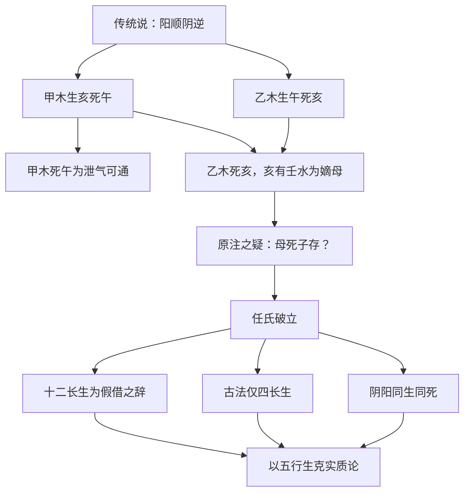
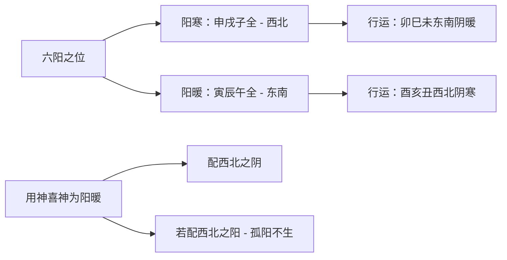

## 阴阳顺逆之辨

> 【原注】阴生阳死，阳顺阴逆，此理出于《洛书》。五行流行之用，固信有之，然甲木死午，午为泄气之地，理固然也，而乙木死亥，亥中有壬水，乃其嫡母，何为死哉？凡此皆详其干支轻重之机，母子相依之势，阴阳消息之理，而论吉凶可也。若专执生死败绝之说，推断多误矣。

原注一反传统命理通行之"阳生阴死、阴生阳死"框架，提出尖锐诘问：甲木死午，午为泄气之地尚可勉强说通；乙木死亥则扞格不通——亥中壬水乃乙木之嫡母，母旺则子安，焉得言死？原注之意，五行之"死"实为"泄"、"墓"、"绝"之变形，专用"死"字以断命易致误判。

> 【任氏曰】阴阳顺逆之说，其理出《洛书》，流行之用，不过阳主聚，以进为退，阴主散，以退为进。若论命理，则不专以顺逆为凭，须观日主之衰旺，察生时之浅深，究四柱之用神，以论吉凶，则了然矣。

任氏首揭纲宗：阴阳顺逆作为《洛书》之流行概念，在命理应用上须以"日主衰旺、时生浅深、用神"三大判准为归，不可执一端以概全局。

> 【任氏曰】至于长生沐浴等名，乃假借形容之辞也。长生者，犹人之初生也；沐浴者，犹人之初生而沐浴以去垢也；冠带者，形气渐长，犹人年长而冠带也；临官者，由长而旺，犹人之可以出仕也；帝旺者，壮盛之极，犹人之辅帝而大有为也；衰者，盛极而衰，物之初变也；病者，衰之甚也；死者，气之尽而无余也；墓者，造化有收藏，犹人之埋于土也；绝者，前之气绝而后将续也；胎者，后之气续而结胎也；养者，如人之养母腹也，自是而复长生，循环无端矣。

任氏将十二长生之"长生、沐浴、冠带、临官、帝旺、衰、病、死、墓、绝、胎、养"全数降为"假借形容之辞"——以人之一生十二阶段喻五行循环之理，使"死"非真死而仅一阶段之喻。任氏较原注更进一步，不仅疑"乙木死亥"之说，更将整个十二长生体系从"硬断命"之神器还原为"假借之喻"。

> 【任氏曰】人之日主不必生逢禄旺，即月令休囚，而年日时中，得长生禄旺，便不为弱，就使逢库，亦为有根。时说谓投墓而必冲者，俗书之谬也。古法只有四长生，从无子、午、卯、酉为阴长生之说。水生木，申为天关，亥为天门，天一生水，即生生不息，故木皆生在亥。木死午为火旺之地，木至午发泄已尽，故木皆死在午。言木而余可类推矣。

此段任氏限定古法正轨：四长生为寅申巳亥（地支三合之四角），无子午卯酉为阴长生之说；木皆生在亥、死在午，"言木而余可类推"。所谓"投墓而必冲"为俗书之谬，盖墓中有余气可养命主。

> 【任氏曰】夫五阳育于生方，盛于本方，弊于泄方，尽于克方，于理为顺；五阴生于泄方，死于生方，于理为背。即曲为之说，而子午之地，终无产金产木之道；寅亥之地，终无灭火灭木之道。古人取格，丁遇酉以财论，乙遇午、己遇酉、辛遇子、癸遇卯，以食神泄气论，俱不以生论。乙遇亥、癸遇申以印论，俱不以死论。即己遇寅岁之丙火，辛遇巳藏之戊土，亦以印论，不以死论。由此观之，阴阳同生同死可知也，若执定阴阳顺逆，而以阳生阴死，阴生阳死论命，则大谬矣。故《知命章》中"顺逆之机须理会"，正为此也。

任氏在此节集其大成为"阴阳同生同死"之总判：五阳之生即五阴之生，五阳之死即五阴之死；实证为"子午之地终无产金产木之道，寅亥之地终无灭火灭木之道"。古人取格皆从五行生克实质论——丁遇酉以财论、乙遇午以食神论、乙遇亥以印论——无一取"生死"字面义。

观此两节——原注以"乙木死亥"之矛盾启其疑；任氏则将其扩展为系统理论，以"假借之辞"重新定性十二长生，以"阴阳同生同死"作最终判。原注之疑为破，任氏之论为立，义理层层递进。

【命造一（阴阳顺逆）】

> 丙子 己亥 乙亥 丙子
> 大运：庚子 辛丑 壬寅 癸卯 甲辰 乙巳

此乙木生于亥月当令，天干两透丙火，丙为太阳之火照暖寒木，本清贵之象。然火土无根，亥子水重，寒木向阳而阳力不足；中年壬寅癸卯甲辰一路水木，生扶太过，财星无力聚集，志业未伸。任氏指出：若按"年时为乙木病位、月日为死地"之传统说法，此造休囚极矣，须用生扶之运；然实际中年所行之运即水木之地，反而财运不至、功名不就——此证"乙木死亥"之说不通，亥子水实为生扶之物，再行水木则太过。

【命造二（阴阳顺逆）】

> 戊午 乙卯 癸卯 癸亥
> 大运：丙辰 丁巳 戊午 己未 庚申 辛酉

此造癸水两坐卯木食神，亥时比劫帮身。按传统说法，癸水生卯（卯为帝旺），时逢亥（比肩），双坐长生——似应"名利双全、多子有寿"。然实际命局木多水漏，戊午运中戊土七杀得禄、午火财星得禄，克泄并见而不寿。任氏反诘："癸水两坐长生，时逢旺地，何以不寿？"——此造实证"阴阳生死之说，不足凭也"。

```mermaid
flowchart TD
A[传统说：阳顺阴逆] --> B[甲木生亥死午]
A --> C[乙木生午死亥]
B --> D[甲木死午为泄气可通]
B --> E[乙木死亥，亥有壬水为嫡母]
C --> E
E --> F[原注之疑：母死子存？]
F --> G[任氏破立]
G --> H[十二长生为假借之辞]
G --> I[古法仅四长生]
G --> J[阴阳同生同死]
H --> K[以五行生克实质论]
I --> K
J --> K
```

---

## 天地顺遂精粹

> 【原注】不论有根无根，俱要天覆地载。

原注立纲一句：天干地支俱要"天覆地载"——即干支相互生化有情，不可支空干散或干绝支枯。

> 【任氏曰】取用干支之法，干以载之支为切，支以覆之干为切。如喜甲乙，而载以寅卯亥子，则生旺，载以申酉，则克败矣；忌丙丁，载以亥子则制伏，载以巳午寅卯，则肆逞矣。如喜寅卯，而覆以甲乙壬癸则生旺，覆以庚辛，则克败矣；忌巳午，而覆以壬癸则制伏，覆以丙丁甲乙，是肆逞矣。不特此也，干通根于支，支逢生扶，则干之根坚，支逢冲克，则干之根拔矣。支受荫于干，干逢生扶，则支之荫盛；干逢克制，则支之荫衰矣。凡命中四柱干支，则显然吉神而不为吉，确乎凶神而不为凶者，皆是故也，此无论天干一气，地支双清，总要天覆地载。

任氏将"天覆地载"细化为一组干支互依之理：

- **干以载之支为切**：天干所喜所忌，须看地支之载——喜甲乙须载以寅卯亥子方生旺，载以申酉则克败；
- **支以覆之干为切**：地支所喜所忌，须看天干之覆——喜寅卯须覆以甲乙壬癸方生旺，覆以庚辛则克败；
- **干通根于支**：支逢生扶则干根坚，支逢冲克则干根拔；
- **支受荫于干**：干逢生扶则支荫盛，干逢克制则支荫衰。

任氏最后归纳：凡命运中"显然吉神而不为吉、确乎凶神而不为凶"者，皆因天覆地载之理失和。无论天干一气、地支双清，总须天覆地载方成格局。

【命造一（天地顺遂）】

> 己亥 丁卯 庚申 庚辰
> 大运：丙寅 乙丑 甲子 癸亥 壬戌 辛酉

此庚金生春令失令，然支坐申辰（申为庚禄、辰为庚印），时逢庚金比肩，印比得地则日主可用。丁火七杀为用，地支载以卯木财星，又得亥水生扶有情，丁火之根因此愈固——亥卯之水木生丁火之根，庚申之金比帮身任杀。任氏判："所谓'天地顺遂而精粹者昌'也。"岁运逢壬癸亥子，干有己土印绶卫官，支得卯木财星化伤，故"生平履险如夷，少年科甲，仕至封疆"。

【命造二（天地顺遂）】

> 己酉 丁卯 庚辰 甲申
> 大运：丙寅 乙丑 甲子 癸亥 壬戌 辛酉

此与前造皆以丁火官星为用，地支亦载以卯木财星，结构大同。然卯酉逢冲，酉金克败卯木，丁火之根遭冲而摇；支中少水，财星有克无生。再看甲木临于申支，申为庚金之禄、甲木之绝，甲木绝于申则"地支不载，虽有若无"。任氏判："故身出旧家，诗书不继，破耗刑伤；一交戌运，支类西方，贫乏不堪。"——前造与本造天覆地载之差即在卯酉一冲，毫厘千里。

【命造三（天地顺遂）】

> 庚申 壬午 辛酉 癸巳
> 大运：癸未 甲申 乙酉 丙戌 丁亥 戊子

此庚辛壬癸金水双清，地支申酉巳午煅炼有功——巳午火克申酉金、而成金火相停之势。任氏判"理应名利双辉"——所惜者五行无木通关，金虽失令而党多，火虽当令而无辅。更嫌壬癸覆之紧贴庚辛之生（壬癸生庚辛则金愈旺），而申中又得壬水长生，则壬水愈肆逞矣。虽有巳火助午，无如巳酉拱金，则午火之势必孤。任氏断："申酉两运，破耗异常；丙戌运中助起用神，大得际遇；一交亥运，壬水得禄，癸水临旺，火气克尽，家破身亡。"——此造之病在金水太重、覆压午火，丁火用神被壬癸覆压而失势。

【命造四（天地顺遂）】

> 庚申 壬午 辛酉 甲午
> 大运：癸未 甲申 乙酉 丙戌 丁亥 戊子

此亦用午中丁火之杀，壬水亦覆之于上，亦有庚金紧贴之生。所喜者午时一助，更妙天干覆以甲木，则火之荫盛（甲木生丁火），且壬水见甲木而贪生不来敌火，四柱有相生之谊、无争克之风。任氏判："中乡榜，仕至观察。"与前造"只换得先后一时，天渊之隔"——前造（庚申壬午辛酉癸巳）以癸水覆午，癸水生金而敌火；本造以甲木覆午，甲木生火而化敌。一癸一甲之差，致格局天壤。

---

## 天全一气须地载

> 【原注】四甲四乙，而遇寅申卯酉，为地不载。

原注点出"天全一气"之病：四甲或四乙成局，若地支载以寅申卯酉（冲克之地），则为"地不载"。

> 【任氏曰】天全一气者，天干四甲、四乙、四丙、四丁、四戊、四己、四庚、四辛、四壬、四癸，皆是也。地支不载者，地支与天干无生化也。非特四甲四乙而遇申酉寅卯为不载，即全受克于地支。或反克地支，或天干不顾地支，或地支不顾天干，皆为不载也。如四乙酉者，受克于地支也；四辛卯者，反克地支也。必须地支之气上升，天干之气下降，则流通生化，而不至于偏枯，又得岁运安顿，非富亦贵矣。如无升降之情，反有冲克之势，皆为偏枯而贫贱矣。宜细究之。

任氏将"天全一气"扩展为完整体系：四甲四乙四丙四丁至四壬四癸皆为天全一气。然"地支不载"非止"四甲四乙遇申酉寅卯"四字——凡地支与天干无生化、全受克于地支、或反克地支、或天干不顾地支、或地支不顾天干，皆为不载。任氏从"地支不载"中分辨出三态：

- **受克于地支**（如四乙酉，酉金克乙木）；
- **反克地支**（如四辛卯，辛金虽克木，然四卯木坚反克辛金）；
- **不顾**（天干不顾地支，或地支不顾天干）。

任氏判准：必须"地支之气上升、天干之气下降"——即干支顺接流通，方为"天覆地载"。若"无升降之情，反有冲克之势"，则为偏枯而贫贱。

【命造一（天全一气）】

> 甲申 甲戌 甲寅 甲戌
> 大运：乙亥 丙子 丁丑 戊寅 己卯 庚辰

此四甲成局，年支申金冲去日主寅木（寅申冲），加之戌土乘权重见（两戌），生金助杀。任氏判："谓地支不顾天干。"——四甲一寅，似乎强旺（寅为甲禄），然秋木休囚，冲去禄神则根已拔，不作旺论。寅卯亥子运中（乙亥丙子丁丑戊寅己卯），水木扶持尚可，衣食颇丰；一交庚辰，杀之元神（庚金）透出，四甲俱伤（甲庚冲克），破家不禄。任氏最后断言："干多不如支重，理固然也"——四甲虽多不敌地支申戌之重克。

【命造二（天全一气）】

> 戊子 戊午 戊戌 戊午
> 大运：己未 庚申 辛酉 壬戌 癸亥 甲子

此满局火土，四戊四支火土全备，子水孤而无援。任氏判："子衰午旺，冲则午发而愈烈，熬干滴水，是谓天干不覆。"——子午冲则午火愈烈（一子不敌四午），水被熬干。初交己未，孤苦万状（运支未土帮身可，但子水仍危）；至庚申辛酉运，引通戊土之性（庚辛泄戊土），大得际遇，娶妻生子，立业成家；一交壬戌，水不通根（壬水坐戌为墓），暗拱火局（戌午午三合火），祝融之变，家破身亡。任氏判："如天干透一庚辛，或地支藏一申酉，岂至若是之结局乎？"——若有一金泄火止水，皆不至于此。

【命造三（天全一气）】

> 戊申 戊午 戊戌 戊午
> 大运：己未 庚申 辛酉 壬戌 癸亥 甲子

此与前造只换一申字，而局势迥异。任氏判："天干之气下降，地支之水有源"——申藏壬水（戊之财），为命局之水根；午火虽烈，究不能伤申金（金亦不畏火），用金明矣。交申运，戊辰年四月入学，九月登科——盖得太岁辰字，暗会水局（申子辰三合水）之妙。惜将来壬戌运中，天干群比争财（壬与戊不合），地支暗会火局（戌午午三合火），未见其吉。此与前造（戊子戊午戊戌戊午）之差仅在"子"换"申"——一子纯受克则败，一申得载则成。

【命造四（天全一气）】

> 辛卯 辛卯 辛卯 辛卯
> 大运：庚寅 己丑 戊子 丁亥 丙戌 乙酉

此四辛四卯成局。任氏判："四木当权，四金临绝，虽曰反克地支，实无力克也。"——卯为辛金之绝地，四辛虽多，至四卯木坚之地则反为木所困。彼此母腹数年间父母皆亡（绝地之金无力护身），与道士为徒；己丑戊子运，印绶生扶（己丑戊子皆土金之地），衣食无亏；一交丁亥，丁火克金、亥卯合木（亥卯合则木愈旺），生火克金，即亡其师，所有微业，嫖赌扫尽而死。

---

## 地全三物须天容

> 【原注】寅卯辰、亥卯未而遇甲庚乙辛，则天不覆。然不特全一气与三物者，皆宜天覆地载，不论有根无根，皆要循其气序，干支不反悖为妙。

原注点出"地全三物"之病：寅卯辰、亥卯未等三会局，遇甲庚乙辛则为"天不覆"。原注亦明确：不论天全一气与地全三物，皆宜天覆地载，干支不反悖为妙。

> 【任氏曰】地支三物者，支得寅卯辰、巳午未、申酉戌、亥子丑之方是也。如寅卯辰日主是木，要天干火多；日主是火，要天干金旺；日主是金，要天干土重。大凡支全三物，其势旺盛。如旺神在提纲，天干必须顺其气势，泄之可也；如旺神在别支，天干制之有力，制之可也。何以旺神在提纲，只宜泄而不宜制？夫旺神在提纲者，必制神之绝地也，如强制之，不得其性，用激而肆逞矣。旺神者，木方提纲得寅卯也是也；制神者，庚辛金也，寅卯乃庚辛之绝地也。如辰在提纲，四柱干支又有庚辛之助，方可制矣。所谓循其气序，调剂得宜，斯为全美。木方如此，余可类推。

任氏立"地全三物"之系统：

- 地支三会为一方（寅卯辰东方木、巳午未南方火、申酉戌西方金、亥子丑北方水），其势旺盛；
- **旺神在提纲**（月令为旺神），须顺其气势而**泄之**——不宜制之，盖制神至提纲已处绝地（如寅卯为庚辛之绝地），强制则激而肆逞；
- **旺神在别支**（月令非旺神），天干制之有力方可制之——此谓"循其气序、调剂得宜"。

以寅卯辰东方木为例：

- 日主为木，喜火泄木之气；
- 日主为火，寅卯辰木生火，则木为印绶，无须再要金；
- 日主为金，须土重（辰土之印）以生金，再得金以成势。

【命造一（地全三物）】

> 辛卯 庚寅 甲辰 丙寅
> 大运：己丑 戊子 丁亥 丙戌 乙酉 甲申

此寅卯辰东方，兼之寅时，旺之极矣。年月两金（辛庚）临绝（寅卯为庚辛之绝地），旺神在提纲，休金难克，而且丙火透时，木火同心。任氏判："谓强众而敌寡，势在去庚辛之寡。"早行土运（己丑戊子）生金破耗异常，进京入部办事；至丙戌运（丙火克金），分发广东，得军功升知县，喜其克尽庚辛之美；至酉运（庚辛得地），不禄宜矣。

【命造二（地全三物）】

> 庚寅 庚辰 甲寅 丁卯
> 大运：辛巳 壬午 癸未 甲申 乙酉 丙戌

此亦寅卯辰东方。然与前造之差：旺神不是提纲（戊辰月令，辰土虽为木之根而非木旺），辰土归垣，庚金得载（辰为庚之余气），力量足以克木。丁火虽透，非庚金之敌，用杀（庚金）明矣。任氏判："至甲申运，庚金禄旺（申为庚禄）暗冲寅木（寅申冲），科甲联登，仕至郡守；一交丙运制杀（丙火克庚金），降职归田。"两造对比可知：前造旺神在提纲（寅月），金处绝地难克；本造旺神在别支（辰月），金得载则可制。

---

## 阳乘阳位气昌

> 【原注】六阳之位，独子、寅、辰为阳方，为阳位之纯。五阳居之，如若是旺神，最要行运阴顺安顿之地。

原注限定"阳位之纯"为子、寅、辰——六阳之位中此三位为纯阳。五阳（甲丙戊庚壬）居之，须行阴顺安顿之运。

> 【任氏曰】六阳皆阳，非子、寅、辰阳之纯也，须分阳寒阳暖而论也。西北为寒，东南为暖，如若申、戌、子全，为西北之阳寒，最要行运遇卯、巳、未东南之阴暖是也；如寅、辰、午全，为东南之阳暖，最要行运酉亥丑西北之阴寒是也。此举大局而论，若遇日主之用神喜神，或木，或火，或土，是东南之阳暖，岁运亦宜配西北之阴水、阴木、阴火，方能生助喜神用神，而欢如酬酢。若岁运遇西北之阳水、阳木、阳火，则为孤阳不生，纵使生助喜神，亦难切当，不过免崎岖而趋平坦也。阳暖之局如此，阳寒之局亦如此论，所谓"阳盛光昌刚健之势，须配以阴盛包含柔顺之地"是也。若不深心确究，孰能探其精微，而得其要诀乎？

任氏于原注之外另开"阳寒阳暖"之分：

- **阳寒**（申戌子全，西北之阳寒）：行运须遇卯巳未东南之阴暖；
- **阳暖**（寅辰午全，东南之阳暖）：行运须遇酉亥丑西北之阴寒。

任氏再深一层：若日主用神喜神为东南之阳暖（木火土），岁运宜配西北之**阴**（阴水阴木阴火）以生助——盖"阳盛光昌刚健之势，须配以阴盛包含柔顺之地"；若岁运遇西北之阳水阳木阳火，则为"孤阳不生"，虽生助喜神亦难切当。

```mermaid
flowchart LR
A[六阳之位] --> B[阳寒：申戌子全 - 西北]
A --> C[阳暖：寅辰午全 - 东南]
B --> D[行运：卯巳未东南阴暖]
C --> E[行运：酉亥丑西北阴寒]
F[用神喜神为阳暖] --> G[配西北之阴]
F --> H[若配西北之阳 - 孤阳不生]
```

【命造一（阳乘阳位）】

> 癸巳 丙辰 丙午 庚寅
> 大运：乙卯 甲寅 癸丑 壬子 辛亥 庚戌

此东南之阳暖（寅辰午全）。天干金水（癸庚）似乎无根，喜月支辰土泄火蓄水而生金，庚金挂角逢生则庚金可用。癸水即庚金之喜神。初运乙卯甲寅，金绝火生而水泄，孤苦不堪；一交癸丑北方阴湿之地，金水通根，又得巳丑拱金之妙，出外大得际遇，骤然发财十余万。任氏判："阳暖逢寒，配合之美也。"

【命造二（阳乘阳位）】

> 戊寅 乙丑 丙寅 庚寅
> 大运：丙寅 丁卯 戊辰 己巳 庚午 辛未

此丙寅日元，支遇三寅（寅辰午不全，非纯阳暖），最喜丑土乘权（丑为金库），财星归库。若运走西北土金（财官之地），财业必胜前造（癸巳丙辰丙午庚寅）。惜乎一路东南木火之地（丙丁火运、陈己土运、庚辛金运之前），祖业破尽，遍历数省奔驰不遇；至午运暗会劫局（寅午戌三合火），死于广东。任氏判："一事无成，莫非运也。"——前造癸巳丙辰丙午庚寅以阳暖配西北阴寒发家，本造丙寅三寅虽非纯阳暖，然一路火木东南之行运失配，故穷困。

---

## 阳乘阴位气盛

> 【原注】六阴之位，独酉亥丑为阴方，乃阴位之纯。五阴居之，如若是旺神，最要行运阳顺光亨之地。

原注限定"阴位之纯"为酉亥丑。五阴（乙丁己辛癸）居之，须行阳顺光亨之运。

> 【任氏曰】六阴皆阴，非酉、亥、丑为阴之盛也，须分阴寒阴暖而论也。承上文西北为寒，东南为暖，假如酉、亥、丑全，为西北之阴寒，最要行运遇东南寅、辰、午之阳暖是也。如卯、巳、未全，为东南之阴暖，最要行运遇申、戌、子西北之阳寒是也。此举大局而论，若日主之用神喜神，或金，或水，或土，是西北之阴寒，岁运亦宜配东南之阳金、阳火、阳土，方能助用神喜神，而福力弥增。若岁运遇东南之阴金、阴火、阴土，则为纯阴不育，难获厚福，不过和平而无灾咎也。阴寒之局如此论，阴暖之局亦如此论，所谓"阴盛包含柔顺之气，须配以阳盛光昌刚健之地"者是也。

任氏立"阴寒阴暖"之分（与上节阳寒阳暖对照）：

- **阴寒**（酉亥丑全，西北之阴寒）：行运须遇东南寅辰午之阳暖；
- **阴暖**（卯巳未全，东南之阴暖）：行运须遇西北申戌子之阳寒。

若日主用神喜神为西北之阴寒（金水土），岁运宜配东南之**阳**（阳金阳火阳土）以助之；若岁运遇东南之阴金阴火阴土，则为"纯阴不育"——阴阴相济只能和平无灾，难以获厚福。

【命造一（阳乘阴位）】

> 丙子 己亥 乙酉 壬午
> 大运：庚子 辛丑 壬寅 癸卯 甲辰 乙巳

此全酉亥子西北之阴寒。寒木更宜向阳，以丙火为用，壬水即其病也。然喜壬水远隔（日主之下），与日主紧贴（紧贴日主者为丙火），日主本衰，未尝不喜其生（壬水生乙木），又有己土透干亦能砥定中流（己土克水）。且天干水木火土各立门户，相生有情——壬生乙、乙生丙、丙生己，无争克之意；地支午火紧制七杀（午冲子），年月火土通根禄旺。更喜行运东南阳暖之地（壬寅癸卯甲辰乙巳），不但四柱有情，而且行运光亨。任氏判："早年联登甲第，仕至封疆，皆阴阳配合之妙也。"

【命造二（阳乘阴位）】

> 己亥 丙子 乙丑 壬午
> 大运：乙亥 甲戌 癸酉 壬申 辛未 庚午

此与前造只换一酉子。以俗论之：酉换丑更美——酉乃七杀克我，丑乃偏财我克，又能止水，何其妙也。然任氏驳："不知丑乃湿土，能泄火不能止水；酉虽七杀，午火紧克（午酉破），不泄火之元神。"两造对比：

- 前造（丙子己亥乙酉壬午）：丙火在年，壬水遥远，又得己土一隔——丙火有护；
- 本造（己亥丙子乙丑壬午）：丙火在月，壬水相近，己土不能为力，子水又逼近相冲——丙火无护。

且运走西北阴寒之地（乙亥甲戌癸酉壬申），丙火一无生扶，乙木何能发生？任氏引"十干体象曰"："虚湿之地，骑马亦忧"——湿寒之地纵乘骏马亦难行驰。任氏判："所以屈志芸窗，一贫如洗，克妻无子，至壬申运丙火克尽而亡。"——所谓"阴乘阴位阴气盛"也。

---

## 地生天者衰怕冲

> 【原注】如丙寅、戊寅、丁酉、壬申、癸卯、己酉，皆长生日主，甲子、乙亥、丙寅、丁卯、己巳，皆自生日主，如主衰逢冲，则根拔而祸更甚。

原注点出"地生天"的两类日柱：一为长生日主（如丙寅、戊寅等），二为自生日主（如甲子、乙亥等）。日主若衰，则逢冲根拔祸甚。

> 【任氏曰】地生天者，如甲子、丙寅、丁卯、己巳、戊午、壬申、癸酉、乙亥、庚辰、辛丑是也。日主生于不得令之月，柱中又少帮扶，用其身印，冲则根拔，生机绝矣，为祸最重。若日主得时当令，或年时皆逢禄旺，或天干比劫重叠，或官星衰弱，反忌印绶之泄，则不怕冲破矣。总之看日主之气势，旺相者喜冲，休囚者怕冲。虽以日主而论，岁运冲亦然。

任氏界定"地生天"为甲丙丁己戊壬癸乙庚辛坐于子寅卯巳午申酉亥辰丑——即坐于生方之干。日主生于不得令之月（休囚），柱中又少帮扶，用其身印——此时逢冲则根拔，生机绝矣，祸最重。然若日主得时当令、或年时皆逢禄旺、或天干比劫重叠、或官星衰弱反忌印绶之泄，则不怕冲。

任氏总判："旺相者喜冲，休囚者怕冲"——盖旺者逢冲则激发而动，休者逢冲则根拔而亡。

【命造一（地生天）】

> 甲寅 戊辰 丙寅 丙申
> 大运：己巳 庚午 辛未 壬申 癸酉 甲戌

此坐下印绶（丙寅，丙火坐寅），生于季春（辰月），印气有余（戊土为印、辰土亦为印），又年逢甲寅（甲为丙之母），则太过矣。任氏判："土虽当令（辰月土旺），而木更坚（寅木）。喜其寅申逢冲，财星得用"——寅申冲则财星（申金为财）被冲动，可为我用。第嫌比肩盖头（甲木为比肩），冲之无力。早年运走南方（己巳庚午辛未），起倒异常；至壬申癸酉二十年，申冲寅木（壬申运中再逢申），克去比肩，创业兴家。任氏判："此谓乘印就财也"——借印就财，印虽重而财得冲可用。

【命造二（地生天）】

> 壬申 甲辰 丙寅 丙申
> 大运：乙巳 丙午 丁未 戊申 己酉 庚戌

此坐下印绶（丙寅）亦在季春（辰月），印绶未尝无余气（辰为湿土）。年干壬水七杀生印有情（壬水生甲木、甲木生丙火），不足畏也。所嫌者两申冲寅（年支申冲日支寅、时支申又冲），甲木之根拔。还喜壬水泄金生木——壬水泄申金之气、生甲木之力，金气不致太重。任氏判："运走丙午劫去申财（丙火克申金），入学补廪登科；丁未合去壬水（丁壬合），三走春闱不捷；戊申克去壬水（戊土克壬水），三冲寅木（戊申运中再逢申），死于途。"任氏最后明示："此造之壬水乃甲木之原神，断不可伤。壬水受伤，甲木必孤。凡独杀用印者，最忌制杀也。"——此造壬水为杀、为印之原神，制杀则杀之原神被伤，印随之不固。

---

## 天合地者旺喜静

> 【原注】如丁亥、戊子、甲午、己亥、辛巳、壬午、癸巳之类，皆支中人元，与天干相合者。此乃坐下财官之地，财官若旺，则宜静不宜冲。

原注点出"天合地"乃支中人元与天干相合之日（如丁亥、戊子、甲午、己亥、辛巳、壬午、癸巳）。坐下财官之地，财官若旺，则宜静不宜冲。

> 【任氏曰】十干之合，乃阴阳相配者也。五阳合五阴为财，五阴合五阳为官，所以必合。尚有阴旺不从阳，阳旺不从阴，虽合不化，有争合、妒合、分合之别。若露干合支中暗干，则随局无所不合，无所不分争妒忌矣。此节本有至理，只因原注少变通耳。天合地三字，须活看轻看，重在下句"地旺喜静"四字，夫地旺者，天必衰也；喜静者，四支无冲克之物，有生助之神也。天干衰而无助，地支旺而有生，天干心怀忻合之意。若得地支元神透出，缘上天下地，升降有情，此合似从之意也，合财似从财，合官似从官，非十干合化之理也。所以静则居安，尚堪保守，动则履危，难以支持。然可言合者，只有戊子、辛巳、丁亥、壬午四日耳，若甲午日，则午必先丁而后己，己土岂能专权而合甲？己亥日，亥必先壬而后甲，甲岂能出而合己？癸巳日，巳必先丙而后戊，戊岂能越过而合癸？此三日不论，至于十干应合而化，则为化格，另有作用，解在化格章中。

任氏深辨"天合地"之内涵：

- 十干之合乃阴阳相配，五阳合五阴为财、五阴合五阳为官，乃"合"之所以成立；
- 然有阴旺不从阳、阳旺不从阴之分，故有争合、妒合、分合之别；
- "天合地"三字须活看——天干衰而无助，地支旺而有生，天干因衰而"心怀忻合之意"（非真正之合，乃因孤弱而依从地支之旺）；
- 地支元神透出（即地支主气透于天干），上下升降有情，则为"合似从"——合财似从财、合官似从官，非十干合化之理；

任氏明示：可言合者仅戊子、辛巳、丁亥、壬午四日——盖此四日支中人元与天干之配属单一（戊子则戊土专配子中癸水、辛巳则辛金专配巳中丙火等），甲午、己亥、癸巳三日则非（因午中先藏丁火己土，亥中先藏壬水甲木，巳中先藏丙火戊土）。任氏总判："静则居安，尚堪保守，动则履危，难以支持"——地旺喜静，最忌冲动。

【命造一（天合地）】

> 己巳 辛未 壬午 乙巳
> 大运：庚午 己巳 戊辰 丁卯 丙寅 乙丑

支类南方（巳午未），乘权当令，地旺极矣。火炎土燥，脆金难滋水源（辛金被火克），天衰极矣。故日干之情不在辛金（辛金被克不堪用），其意向必在午中丁火而合从矣（壬丁合）。任氏判："己巳戊辰运，生金泄火，刑耗有之；丁卯丙寅，木火并旺，克尽辛金，经营发财巨万。"——此造壬水日元坐于午（合丁），地支火旺而天干无金水之援，壬水从丁火之合似从财（合财似从财），运行木火则合从之意愈显。

【命造二（天合地）】

> 己丑 丙子 丁亥 庚子
> 大运：乙亥 甲戌 癸酉 壬申 辛未 庚午

此造支类北方（亥子丑），地旺极矣。天干火虚，丙火无木生扶（甲乙木不见），又有湿土晦火（己丑湿土），天衰极矣。任氏判："人皆论其杀重身轻，取火帮身敌杀。戊寅岁，金绝火生，又合去亥水（寅亥合），必有大凶，果卒季夏。"——此造支类北方水旺，丁火坐亥（合壬），庚金七杀在天干，无印帮身（己丑为湿土不能助火），则为"天地合而从官"（合官似从官）。任氏续判："甲戌运生火克水，刑丧破耗，家业已尽；癸酉壬申克尽丙火，助起财官，获利五万；未运丙子年遭回禄（火灾），破去二万。"——人皆取其火土帮身以午未运为美，殊不知比劫夺财（丙火比肩夺财星庚金），反致大凶。

---

## 杀印相生两神旺

> 【原注】两神者，杀印也。庚金见寅中火土，却多甲木，而以财论；癸见丑中土金，却多癸水，则帮身，不如甲见申中壬水庚金、戊见寅中甲木丙火之为真也。

原注辨"两神"之真假：庚寅虽为杀印之地，然寅中甲木多则庚金为财（甲木为财）而非真杀印；癸丑虽藏土金，然多癸水则帮身而非真杀印；唯甲申（申中壬水庚金）、戊寅（寅中甲木丙火）为真杀印相生。

> 【任氏曰】支坐杀印，非止此四日，如乙丑、辛未、壬戌之类，亦是两神也。癸丑多比肩，戊寅岂无比肩乎？庚寅多财星，甲申岂无财星乎？非惟庚寅癸丑不真，即甲申戊寅，亦难作据，若只以日主一字论格，财年月时中，作何安顿理会耶？不过将此数日为题，用杀则扶之，不用则抑之。须观四柱气势，日主衰旺之别，如身强杀浅，则以财星滋杀；身杀两停，则以食神制杀；杀强身弱，则以印绶化杀，论局中杀重身轻者，非贫即夭；制杀太过者，虽学无成。论行运杀旺，复行杀地者，立见凶灾；制杀再行制乡者，必遭穷乏。书云"格格推祥，以杀为重"；又云"有杀只论杀，无杀方论用"，杀其可忽乎？

任氏深辨"杀印相生"之真伪：原注所举四日中，庚寅癸丑不真（多比劫多财星），甲申戊寅亦难作据（须看四柱整体），若仅以日主一字论格则失。任氏提出"支坐杀印"之法则：

- **身强杀浅**：以财星滋杀（财生杀）；
- **身杀两停**：以食神制杀（食神克杀）；
- **杀强身弱**：以印绶化杀（印化杀生身）。

任氏总判：杀重身轻者非贫即夭；制杀太过者虽学无成；行运杀旺再行杀地立见凶灾；制杀再行制乡必遭穷乏。任氏引书云"格格推祥以杀为重""有杀只论杀、无杀方论用"，明示杀格之重。

【命造一（杀印相生）】

> 壬午 己酉 甲申 甲子
> 大运：庚戌 辛亥 壬子 癸丑 甲寅 乙卯

甲申日元，生于八月（酉月），官杀当权（七杀庚金、酉金）。喜其午火紧制酉金（午克酉），子水化其申金（申子半合水），所谓"去官留煞"——杀留而官去。煞印相生（子水化申金之杀而生甲木），木凋金旺（甲木虽凋但秋金更旺），印星为用（子水印绶）。任氏判："甲第联登，由郎署出为观察，从臬宪而转封疆。"

【命造二（杀印相生）】

> 壬辰 己酉 甲申 甲子
> 大运：庚戌 辛亥 壬子 癸丑 甲寅 乙卯

此与前造只换一辰字。以俗论之：前则制官留杀（午克酉），此则合官留杀（辰酉合金），功名仕路无所高下。殊不知任氏判："有天渊之隔。夫制者克而去之，合者有去有不去也。"——制为克去（彻底去之），合为合住（藕断丝连）。本造：

- 辰土为财（戊土），则化金而助杀（辰土生申酉金）；
- 酉金为官，仍化金而党杀（酉金本是杀之根）。

任氏判："清中带浊，且以财为病者，不但功名蹭蹬，而且刑耗难辞。"——此造之病在辰土财星化金助杀。任氏续判："惟亥运逢生，可获一衿；壬子如逢木，秋闱有望；癸丑合去子印，一阻去程，有凶无吉；甲寅运被申冲破，寿元有碍矣。"——子印被癸丑合去则印失，寿元有碍。

---

## 上下情协

> 【原注】天干虽非相生，宜有情而不反背。

原注点出"上下情协"之纲：天干虽非相生（如金木相克），宜有情而不反背。

> 【任氏曰】上下情协者，互相卫护，干支不反背者也。如官衰伤旺财星得局，官旺财多比劫得局，杀重用印，忌财者财临劫地，身强杀浅，喜财者财坐食乡，财轻劫重，有官而官星制劫，无官而食伤化劫，皆谓有情。如官衰遇伤，财星不现，官旺无印，财星得局，杀重用印，忌财者财坐食位，身旺煞轻，喜财者财坐劫地，财轻劫重，无食伤而官失令，有食伤而印当权，皆为不协。

任氏列出"有情"之八态：

1. 官衰伤旺，财星得局；
2. 官旺财多，比劫得局；
3. 杀重用印，忌财者财临劫地；
4. 身强杀浅，喜财者财坐食乡；
5. 财轻劫重，有官而官星制劫；
6. 财轻劫重，无官而食伤化劫。

任氏又列"不协"之八态：

1. 官衰遇伤，财星不现；
2. 官旺无印，财星得局；
3. 杀重用印，忌财者财坐食位；
4. 身旺杀轻，喜财者财坐劫地；
5. 财轻劫重，无食伤而官失令；
6. 有食伤而印当权。

任氏之论即"协"与"不协"乃一一相对——"有情"则干支互相卫护以成格，"不协"则干支反背以败格。

【命造一（上下情协）】

> 己巳 癸酉 丙寅 庚寅
> 大运：壬申 辛未 庚午 己巳 戊辰 丁卯

此日主两坐长生（丙寅、丙坐寅为丙之长生），年支又逢禄旺（己巳，巳为丙之禄），足以用官（癸水官星）。癸水官星被己土贴身一伤（己克癸），喜得官临财位（癸水坐酉，酉为财），尤妙巳酉拱金（巳酉半合金局），则己土之气已泄（己土生金），而官星之根固矣（金生水）。任氏判："所以一生不遭凶险，名利两全也。"

【命造二（上下情协）】

> 癸亥 癸亥 丙辰 甲午
> 大运：壬戌 辛酉 庚申 己未 戊午 丁巳

此官杀乘旺（双癸水七杀），原可畏也。然喜午时生食制煞（午中丁火食神制杀），时干透甲（甲木印绶），生火泄水——旺杀半化为印（癸水生甲木、甲木生丙火），衰木两遇长生（甲木寅为丙之长生，寅中甲木又生丙火），赖此木根愈固。任氏判："上下情协，不诬也。白手成家发财数万。"

【命造三（上下不协）】

> 甲寅 庚午 乙卯 丙子
> 大运：辛未 壬申 癸酉 甲戌 乙亥 丙子

专禄日主（乙木坐卯为专禄），时支子水生之（子为乙之印），年干甲木亦坐禄旺（甲寅），用庚金则火旺无土（庚金受火克无土通关），坐干火地（庚午月午火克庚）；用丙火则子冲去其旺支（丙子时子午冲），即或用火亦无安顿之运。任氏判："所以一败如灰，至乙亥运，水木齐来，竟为乞丐。"

【命造四（上下不协）】

> 乙丑 己卯 乙亥 壬午
> 大运：戊寅 丁丑 丙子 乙亥 甲戌 癸酉

此己土之财通根在丑（丑为己之财库），得禄于午（午为己之禄），似乎身财并旺。不知己土之财（己土所克之土）比肩（另一己土）夺去，丑土之财（丑中所藏）卯木克破（卯克丑），午火食神（丁火己土之食神）亥水克之（亥中壬水克午中丁火）。壬水盖之（癸水坐亥，壬坐亥则壬水覆盖于亥），无从引化——所谓"上下无情"也。任氏判："初逢戊寅丁丑，财逢生助，遗业颇丰；一交丙子，冲去午火（子午冲），一败而尽；乙亥运，妻子俱卖，削发为僧，又不守清规，冻饿而死。"

任氏以两造对比作结："合此两造观之，则上下之情协与不协，富贵贫贱，遂判天渊，即于此证验焉。"

---

## 左右同志

> 【原注】上下左右，虽不全一气之物，须生化不错。

原注点出"左右同志"之纲：上下左右虽非一气之物，须生化不错。

> 【任氏曰】左右同志者，制化得宜，左右生扶，不杂乱者也。如杀旺身弱，有羊刃合之，或印绶化之；身旺杀弱，有财星生之，或官星助之；身杀两旺，有食神制之，或伤官敌之，此谓同志。若身弱而杀有财滋，财几为累矣；身旺而劫将官合，财官已忘矣。总之，日主所喜之神，必要贴身透露，喜杀而杀与财亲，忌杀而煞逢食制，喜印而印居官后，忌印而印让财先，喜财而遇食伤，忌财而遭比劫，日主所喜之神，得闲神相助，不争不忌，所忌之神，被闲神制伏，不肆不逞，此谓同志。宜细究之。

任氏立"左右同志"之体系：左右（年月为左、日时为右）制化得宜、左右生扶不杂乱。任氏列同志之六态：

- **杀旺身弱**：羊刃合之、或印绶化之；
- **身旺杀弱**：财星生之、或官星助之；
- **身杀两旺**：食神制之、或伤官敌之。

任氏又列不同志之反态：身弱杀有财滋（财反累身）、身旺劫将官合（财官被合忘）。任氏总判："日主所喜之神必要贴身透露……闲神相助不争不忌，所忌之神被闲神制伏不肆不逞"——此谓同志。

【命造一（左右同志）】

> 壬申 丙午 庚午 庚辰
> 大运：丁未 戊申 己酉 庚戌 辛亥 壬子

此丙火之杀虽旺（丙火七杀），壬水之根亦固（壬坐申为长生），日主有比肩之助（庚金两透），辰土之生（辰为庚之印），谓身杀两停。用壬制杀（壬水克丙火），天干之同志者壬水也；地支之同志者辰土也（辰土生金、泄火），一制一化可谓有情。任氏判："运喜金水之乡，仕途显赫，位至封疆。"

【命造二（左右不同志）】

> 壬午 丙午 庚申 戊寅
> 大运：丁未 戊申 己酉 庚戌 辛亥 壬子

此造与前造大同小异——日坐禄旺（庚申），壬水亦紧制杀（壬克丙），然任氏判："何彼则名利双收，此则终身不发？"——盖彼则壬水逢申之生地（壬坐申为长生），制杀有权；此则壬水坐午之绝地（壬坐午为胎地），敌杀无力。彼则时干比劫帮身（庚金时干），又可生水；此则时上枭神（戊土）克水（戊克壬），而不能生食（戊土不生金？此义待参）。任氏判："所谓左右不能同志者也。"

---

## 始终得所富贵永无穷

> 【原注】年月为始，日时不反背之日地为终，年月不妒忌之，凡局中所喜之神，引于时支，有所归者，为始终得所，则富贵福寿，永乎无穷矣。

原注点出"始终得所"之纲：年月为始，日时不反背之日地为终；凡局中所喜之神引于时支有所归者，为始终得所。

> 【任氏曰】始终之理，要干支流通，四柱生化不息之谓也。必须接续连珠，五行俱足，即多缺乏，或有合化之情，互相护卫，纯粹可观，所喜者逢生得地，所忌者受克无根。闲神不党忌物，忌物合化为功，四柱干支一无弃物，纵有伤枭劫刃，亦来辅格助用。喜用有情，日元得气，未有不富贵福寿者也。

任氏深阐"始终得所"之体系：干支流通、四柱生化不息；接续连珠、五行俱足；或虽有缺乏而有合化之情互相护卫；所喜者逢生得地、所忌者受克无根；闲神不党忌物、忌物合化为功。任氏最终判："喜用有情，日元得气，未有不富贵福寿者也"——此为对"始终得所"之最高级总结。

【命造一（始终得所）】

> 壬寅 甲辰 丁亥 己酉
> 大运：乙巳 丙午 丁未 戊申 己酉 庚戌 辛亥 壬子

此造年干壬水为始（壬水官星），时支亥水为终（亥中壬水为官星之根）。任氏细析其气序：

- 官生印（壬水生甲木），印生身（甲木生丁火）；
- 食神发用吐秀（己土食神）；
- 财得食之覆（己土生酉金之财）；
- 官逢财星之生（酉金生壬水）。

伤官虽当令（甲木伤官），印绶制之有情（壬水印绶制伤官）；年月不反背（壬水与甲木相生），日时不妒忌（丁与己不相悖）。任氏判："始终得所。贵至二品，富有百万，子孙济美，寿至八旬。"

【命造二（始终得所）】

> 戊戌 庚申 癸亥 乙卯
> 大运：辛酉 壬戌 癸亥 甲子 乙丑 丙寅 丁卯 戊辰

此造土生金（戊土生庚金），金生水（庚金生癸水），水生木（癸水生乙木），干支同流——戊戌中财星归库（戌为财库），官星清（庚金为官），印正分明（亥中壬水为印），食神吐秀逢生（乙木食神）。任氏判："但有相生之谊，而无争妒之风。乡榜出身，仕至黄堂，一妻二妾，子有十三，科第连绵，富有百万，寿过九旬。"

【命造三（始终得所）】

> 甲子 丙寅 己巳 辛未
> 大运：丁卯 戊辰 己巳 庚午 辛未 壬申 癸酉 甲戌

此造天干木生火（甲木生丙火），火生土（丙火生己土），土生金（己土生辛金）；地支水生木（子水生寅木），木生火（寅木生巳火），火生土（巳火生未土），土生金（未土生酉金中之辛）。任氏判："且由支而生干，从地支则以年支子水生寅木为始，至时干辛金为终；从天干亦以年支子水生甲木为始，至时干辛金为终。天地同流。正所谓始其所始，终其所终也。"任氏判："科甲联登，仕至极品，夫妇齐美，子孙衍，科甲不绝，寿至九旬。"

---

《滴天髓》"干支总论"一篇，统摄命理分析之根本大端——阴阳顺逆之辨、天地顺遂之理、天全一气与地全三物之成毁、阳寒阳暖与阴寒阴暖之调候、地生天与天合地之动静、杀印相生之真伪、上下情协与左右同志之配合、始终得所之归宿，凡此十二端皆为格局建立之基础。任氏阐微不限于注字解词，更以大量实例印证、修正、发挥原注之论，使干支之理由"假借之辞"返归"五行生克实质"，由"阴阳顺逆"返归"阴阳同生同死"，由"机械取格"返归"四柱整体流通"。其方法论贯穿《滴天髓》全书，为后续论格、论用神、论化气等各章之纲维。