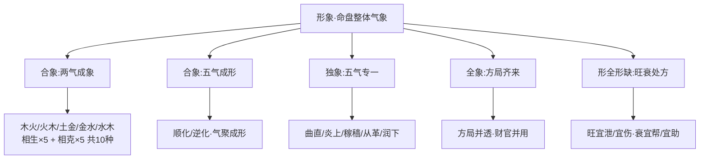

# 形象

本篇专论命盘整体气象之观察。所谓「形象」，是把命盘当作一个有机整体来观察其气势的偏全聚散——「象」偏于两两相对的气势组合，「形」则偏于五行聚结的具体形态。任铁樵在原注「两气成象」「五气成形」的基础上，把它细分为合象、独象、全象、形全形缺四种格式，并以二十命造一一对照，将这一论域推到了相当系统的高度。

## 两气合而成象的相生相克

> 【原文】两气合而成象，象不可破也。

> 【原注】天干属木，地支属火，天干属火，地支属木，其象则一。若见金水则破，余仿此。

原注把「两气成象」的判据收得极紧——天干一气、地支一气，仅有两种五行。木火、火木同象，相生相克皆然。一旦出现破象的第三种五行（如木火局见金水），象即破。

> 【任氏曰】两气双清，非独木火二形也，如土金、金水、水木，木火、火土，相生各半五局。即相克之五局亦是也，如木土、土水、水火、火金、金木之各半用敌也。相克务须均敌，切忌偏重偏轻。若用金水，则火土不宜夹杂；如取水木，则火金不可交争。木火成象者，最怕金水破局。水火既济者，尤忌土来止水。各既如此，取运亦仿此而行。一路澄清，必位高而禄重；中途混乱，恐职弃而家倾。故此格最难全美，而看法贵在至精。若生而复生，乃是流通之妙；倘克而遇化，亦为和合之情。或谓理仅两神，似嫌狭少，不知格分十种，尽费推详。

任氏对原注作了实质性的扩充。原注只举木火一例，任氏把它推到了十种——相生五种（木火、火土、土金、金水、水木）与相克五种（木土、土水、水火、火金、金木）。前者顺生成势，后者克中求平。任氏特别提醒，相克的两气务须均敌——一旦偏重偏轻，象就不成立。任氏的进一步推进在于强调「看法贵在至精」：两气成象虽然结构简单，但运程一旦混乱、一字异类闯入，整盘即倾。

任氏还点出两种气势的精微差别——「生而复生」是流通之妙（气势顺出），「克而遇化」是和合之情（克中带化）。两气虽少，但内部的气势变化却极为微细。

### 【命造一（任氏注）】甲午 丁卯 甲午 丁卯——木火两气取伤官秀气

> 甲午 丁卯 甲午 丁卯
>
> 戊辰 己巳 庚午 辛未 壬申 癸酉
>
> 此造木火各半，两气成象，取丁火伤官，秀气为用。四柱金水全无，纯粹可观。巳运丁火临官，南宫奏捷，名高翰苑；庚运官杀混局，降知县。夫南方之金，尚有不足，将来西方之水，难言无咎。

天干甲丁甲丁、地支午卯午卯——木火各半，两气清纯，且四柱无金水来破。甲木为日主，丁火为伤官，木旺生火，秀气全出于丁火——这便是任氏所说的「生而复生」。

格局判定上，此造身旺无疑，需取食伤泄秀。日主向丁火求出路，意味着此人不靠官星建功，而靠才华显发——故大运行至巳火（丁火临官之地）便南宫奏捷，由翰林一脉走出。但庚运一来，金气搅入木火清纯之局，「官杀混局」即此象破之始——任氏断言西方水运（壬申、癸酉）「难言无咎」，正应「象不可破」之总诀。

### 【命造二（任氏注）】丁卯 乙巳 丁卯 乙巳——炎上之象忌金运

> 丁卯 乙巳 丁卯 乙巳
>
> 甲辰 癸卯 壬寅 辛丑 庚子 己亥
>
> 此亦木火各半，两气成象，非前伤官之比。日主是火，长于夏令，木从火势，格成炎上，更不宜见金运。火逢生助。巡抚浙江；至辛运水年，木火皆伤。故不能免祸。所谓"二人同心，可顺而不可逆也。"

同样木火两气，但日主由甲改丁。日主既为火，又生巳月（火当令），木气全部从属于火势——「木从火势，格成炎上」。这是关键的格局判定差异：命造一是身旺取伤官泄秀的两气成象；命造二则因日主自身为火、月令又当火令，已升格为独象（炎上格）。两造干支同类、判语却完全相反。

任氏所引「二人同心，可顺而不可逆也」（语出《周易·系辞》），是说炎上之局已成一气，唯有顺其势（火土运）方为吉，逆其势（金水运）必败。至辛丑运后水年来到，木火齐伤，故难免其祸。

### 【命造三（任氏注）】丙午 戊戌 丙午 戊戌——火土取食神之秀

> 丙午 戊戌 丙午 戊戌
>
> 己亥 庚子 辛丑 壬寅 癸卯 甲辰
>
> 此火土各半，两气成象，取戌土食神，秀气为用。辛丑运湿土晦火，秀气流行，登乡榜；壬运壬年，赴会试，死于都中，盖水激丙火，则火灭也。如两戌换以两辰，不致燥烈，虽逢水运，亦不至大凶也。

天干丙戊丙戊、地支午戌午戌——火土两气，取戌土食神泄秀。辛丑运湿土晦火、不烈不燥，秀气流行而中举；壬水运、壬水年水来激烈火，应了「水激火灭」之险——这并非火怕水，而是火势过烈遇水如油遇泼，故有都中之祸。

任氏的反例假设极具启发——「如两戌换以两辰，不致燥烈」。同样的火土两气，戌为燥土与火同党，辰为湿土能承水。一字之换，运程吉凶随之翻转。这是「象不可破」之外的另一层精义：象之结构相同，象之燥湿差异，决定了对运程冲击的承受力。

### 【命造四（任氏注）】戊戌 辛酉 戊戌 辛酉——土金成象忌火破

> 戊戌 辛酉 戊戌 辛酉
>
> 壬戌 癸亥 甲子 乙丑 丙寅 丁卯
>
> 此土金各半，两气成象，取辛金伤官为用。喜其一路北方运，秀气流行，少年科甲，仕至黄堂；交丙破辛金之用，不禄。凡两气成象者，要日主去生，或食或伤。谓英华秀发，多致富贵；所不足者，运破局，不免于祸。如金水水木之印绶格，无秀可取，故无富贵，试之屡验。

天干戊辛戊辛、地支戌酉戌酉——戊土日主，取月时辛金伤官泄秀。运行北方水地、秀气流行，故官至府台。一交丙寅运，丙火破辛——丁火回头克金，象遂破，命亦绝。

任氏借此造引出一条贯通全节的总诀：两气成象，必要日主去生（食神或伤官），方能英华秀发、致富贵；若是水木、金水那种印绶式的两气（印生身），无秀气可取，难显富贵——这是任氏几十年实测所验的统计性结论。从日主出发能不能「向外发」是两气成象富贵与否的根本。

### 【命造五（任氏注）】戊戌 癸亥 戊戌 癸亥——水土两气得财命

> 戊戌 癸亥 戊戌 癸亥
>
> 甲子 乙丑 丙寅 丁卯 戊辰 己巳
>
> 此水土各半，两气成象，喜其通根燥土，财命有一。然气势稍寒，所以运至丙寅，寒逢阳，运登科甲，更妙亥中甲木暗生，仕至郡守，宦途平坦。

天干戊癸戊癸、地支戌亥戌亥——戊土日主，癸水为财。两气成象虽属相克之类，但燥土通根、能克水而不被冲散，故「财命有一」——身能任财。任氏抓住「气势稍寒」一节作为重点：水土两气在冬令偏寒，必须等到火运调候才能起势——所以丙寅运一到、阳气透回，命主登科甲。亥中甲木暗生火，又为内部的转关之机——既助调候，又化水势——故宦途平坦。

此造与命造一对照可见：同是两气成象，命造一取食伤秀气，重在外发；此造取身财相敌，重在调候。看法各别，但「象不可破」与「贵在至精」的根本则同。

### 【命造六（任氏注）】癸亥 己未 癸亥 己未——纯杀克身待运转

> 癸亥 己未 癸亥 己未
>
> 戊午 丁巳 丙辰 乙卯 甲寅 癸丑
>
> 此土水相克，两气成象，纯杀无制，日主受伤。初走火土之乡，生助七杀，正是明月清风谁与共，高山流水少知音；一交乙卯，运转东方，制杀化权，得奇遇，飞升县令。由此观之，生局必须食为美，印局无秀气，不足为佳。财局身财均敌，日主本气无伤，然又要运程安顿得好，斯为全美，一遇破局，则祸生矣。

天干癸己癸己、地支亥未亥未——癸水日主、己土两透为杀。两气相克的格局中，未中含丁、己为水之七杀的根基，杀重无制，日主受伤。初年火土运助杀，命主蹭蹬不遇；至乙卯运转东方木地，乙木来克己土（食神制杀），方制杀化权、飞升县令。

任氏在此处作了全节的总结：相生之局须以食伤为用方为美；印局无秀气可取，富贵难成；财局须身财均敌、运程安顿方为全美——一句话点出三类两气格的高下序列，把「象不可破」从单点判语提升为完整的分类法。

## 五气聚而成形的相生流通

> 【原文】五气聚而成形，形不可害也。

> 【原注】木必得水以生之，火以行之，土以培之，金以成之。是以成形于要紧之地，或过或缺，则害。余皆仿之。

原注以木为例：木的「成形」需要五行齐备——水生之、火行之（食伤泄秀）、土培之（财来养命之根）、金成之（官杀修之成器）。五行皆备且在「要紧之地」（关键位置），木方成形。若五行过偏或缺一，便是「害」。

> 【任氏曰】木之成形，食伤泄气，水以生之；官杀交加，火以行之；印绶重叠，土以培之；财轻劫重，金以成之。成形于得用之地，庶无偏枯之病，何患名利不遂乎？即举木论，五行皆可成形，变仿此而推。若四柱无成，成之于岁运又无成处，则终身碌碌，凶多吉少，有志难伸矣。

任氏的推进在于把原注的「成形条件」翻成「应病施治的处方」——食伤过旺则以水（印）生扶日主、官杀过旺则以火（食伤）行之、印绶过重则以土（财）培根、财轻劫重则以金（官杀）来成之。同样是「水以生之，火以行之，土以培之，金以成之」十六字，原注用作平铺直叙的条件，任氏改成针对四种偏枯之病的对症之法。这是从描述性陈述到方法论操作的转换。

任氏并补充：原文只举木为例，五行皆可仿此而推。若四柱本身无「成」、岁运又无「成处」，则终身有志难伸——把「形不可害」从象的描述提升到了一生事业的判语。

### 【命造七（任氏注）】壬戌 壬子 甲子 戊辰——水猖戊培之妙

> 壬戌 壬子 甲子 戊辰
>
> 癸丑 甲寅 乙卯 丙辰 丁巳 戊午 己未
>
> 此造水势猖狂，独戊土以培之，以作砥柆之功，不致浮泛也。然戊土亦赖有戌土而根固，若有辰而无戌，辰乃湿土，见水则荡，戊土不能植根而虚矣。无根之土，岂能止百川之源？故此造所重者，戌之燥土也。但寒木无阳，必须火以温之，则木方可发荣，所以运至南方火旺之乡，发财数万，名成异路也。

甲木日主、子月生人，水势猖狂——若无戊土制水，木便浮泛无依。戊土能否「砥柱」，关键在它有没有根。任氏抓住戌土与辰土的差别作了精细的辨析：戌是燥土，能止水；辰是湿土，遇水则荡。若此造换辰为戌，戊土便无根可植——一字之差，整盘崩塌。

寒木无阳，又必须火以温之——所以南方火运一到，木气方真正发荣，命主发财数万。任氏所说「成形于要紧之地」，在此造便落实为戌土的「要紧」与南方火运的「要紧」——二者缺一不可。

### 【命造八（任氏注）】戊寅 乙卯 甲辰 辛未——东方木劫赖辛成

> 戊寅 乙卯 甲辰 辛未
>
> 丙辰 丁巳 戊午 己未 庚申 辛酉
>
> 此造支类东方，劫刃肆逞，一点微金，成之不足，故书香不继，初运火土，不失化之情，财源通裕；至庚申辛酉，辛金得地，而成之异路，加捐仕至州牧；癸运生木泄金，不禄。

甲木日主，地支寅卯辰东方一气，劫刃肆逞——这是典型的「财轻劫重」之局。原局只一点辛金透出，根浅无气，故「成之不足」。书香（科举正途）因此不继。但初运火土，泄木生金，财源尚通；至庚申辛酉运，辛金得地，金真正能成木之器——故「加捐仕至州牧」（按：以钱财捐纳得官位）。一交癸运，水来生木、又泄金——辛金不能再成，命数遂终。

此造正合任氏所说「财轻劫重，金以成之」的处方——原局成之不足，运程补之而成；运一离，成又散——形之成败，全在金能不能站住。

### 【命造九（任氏注）】癸未 乙卯 甲戌 乙亥——四柱无成终身蹭蹬

> 癸未 乙卯 甲戌 乙亥
>
> 甲寅 癸丑 壬子 辛亥 庚戌 己酉
>
> 此造柱中，未土深藏，戌土自坐，谓财来就，未尝不美。只因四柱无金以成之，五行无火以行之，再加亥时，癸水通根生劫，亥卯未全，助起劫刃猖狂。查其岁运，又无成地，以致祖业消磨，克妻无子。由此推之，命之所重在运，运其可忽乎谚云："人有凌云志，无运不能自达也。"

甲木日主，未戌两土皆藏，本属「财来就我」之美象。然而四柱既无金（无以成之）又无火（无以行之），亥时一来又激起亥卯未三合木局——劫刃猖狂，财反被夺。最致命的是岁运一路水木，竟无一「成处」——形终身不立，故克妻无子、祖业消磨。

任氏以此造作为「四柱无成、岁运又无成处」的典型反例，并引谚语「人有凌云志，无运不能自达也」收束——这是从「形之有成」推到「运之有成」，把形的命题延伸到了一生境遇的命题。同时也是对前两造的反衬：命造七有戌土砥柱、命造八有金运补成，故各得其位；此造形与运皆无成，故一无所立。

## 独象与化神的乘权流通

> 【原文】独象喜行化地，而化神要昌。

> 【原注】一者为独，曲直炎上之类也。所生者为化神，化神宜旺，则其气流行，然后行财官之地方可。

原注把「独」字定义得极为简练——「一者为独」，即一气专旺之格。木全为曲直、火全为炎上、土全为稼穑、金全为从革、水全为润下——五者皆是。日主一气当权，所生之物（食伤）便是「化神」。化神宜旺，气方流行；化神得力之后，再去行财官之地，方可成大势。

> 【任氏曰】权在一人，曲直炎上之类是也。化者，食伤也，局中化神昌旺，岁运行化神之地，名利皆遂也。八字五行全备，固为合宜，而独象乘权，亦主光亨。木日，或方或局全，不杂金为曲直；火日，或方或局全，不杂水为炎上；土日，四库皆全，不杂木为稼穑；金日，或方或局全，不杂火为从革；水日，或方或局全，不杂土为润下。皆从一方之秀气，不同六格之常情。必要得时当令，遇旺逢生。但体质过于自强，须以引通为妙，而气势必有所关，务须审察其情。

任氏先从形象上厘清五个独象的成立条件——曲直需木日且不杂金、炎上需火日且不杂水、稼穑需土日且四库齐全且不杂木、从革需金日且不杂火、润下需水日且不杂土。这些都是「破象之物」——一旦掺入，独象便不再独。任氏还指出独象与寻常六格的关系：六格讲究五行平衡，独象偏要五行集中——「皆从一方之秀气，不同六格之常情」。

> 【任氏曰】如木局见土运，斯虽财神资养，先要四柱有食有伤，庶无分争之虑。见火运，谓英华发秀，须看原局有财无印，方免反克为殃，名利可遂；见金运，谓破局，凶多吉少；见水运，而局中无火，误用生助强神，亦主光亨，故旧有从强之说，再行生旺为佳，若四柱先有食伤，必主凶祸临身；如原局徽伏破神，须运有合冲之妙；若本主失时得局，要运遇生旺之乡，亦主功名小就。苟行运偶逢殺地，独象立见凶灾，若局有食伤反克之能，方无大害。总之干乃领袖之神，阳气为强，阴气为弱；支乃会格之物，方力较重，局力较轻。独象虽美，只怕运途破局；合象虽难，即喜制化成功。

任氏紧接着把独象的运程吉凶细分为四种处境——见土（财）运须先有食伤通关、见火（食伤）运须无印星挡道、见金（官杀）运为破局凶多吉少、见水（印星）运若无火则可光亨、有火则反激为祸。这五种处境的差异，是后面五命造（曲直、稼穑、炎上、从革、润下各一）的判语之根。

任氏的总结句尤为重要——「独象虽美，只怕运途破局；合象虽难，即喜制化成功」。这是把独象与合象（两气成象、五气成形之类）作了一个反向对照：独象本身好，但运一坏即败；合象本身难成，但只要制化得宜即成。两种格局的脆弱性与韧性恰好相反。

### 【命造十（任氏注）】甲寅 丁卯 甲辰 丙寅——曲直格化神发秀

> 甲寅 丁卯 甲辰 丙寅
>
> 戊辰 己巳 庚午 辛未 壬申 癸酉
>
> 支全寅卯辰，东方一气，化神者，丙丁也。发泄菁华，少年科甲，早遂仕路之光；行财地，得过且过有食伤化劫之功；行金运，又得丙丁回克之能；交壬破局伤秀，降职归田不禄。

甲木日主，地支寅卯辰三会东方一气，天干两透丙丁（食伤），化神昌旺——这是完整的曲直格。少年科甲、早登仕路，正是「化神得力则名利可遂」之验。

任氏分运的判语颇见层次：行财（土）运得食伤化劫之功（丙丁泄木生土，劫不夺财）；行金（官杀）运得丙丁回克之能（食伤克官杀以护身）；唯独壬运一来——壬水克伤丙丁，化神被破，独象遂亡。「破局伤秀」四字，正是独象最忌的画面。

### 【命造十一（任氏注）】己未 丁丑 戊子 己未——稼穑真象苦无金引

> 己未 丁丑 戊子 己未
>
> 丙子 乙亥 甲戌 癸酉 壬申 辛未
>
> 费中堂造，天干戊已逢丁，地支重午丑未。子丑化土，斯真格象，已成稼穑。所不足者，丑中辛金无从引出，且局中丁火三见，辛金暗伤，未得生化之妙，所以嗣息艰难。若天干透一庚辛，地支藏一申酉，必多子矣。

戊土日主，地支子丑化土、年时两未，土已成稼穑。任氏判断「真格象」三字下得极重——此造已是真稼穑无疑。然而所不足者，是丑中辛金无从引出，化神（金，土之食伤）不能上达天干。再加丁火三见，丑中辛金被暗伤——化神不昌，故「嗣息艰难」（按：传统观念以食伤为子息之神，化神受伤即应在子嗣上）。

任氏假设「若天干透一庚辛，地支藏一申酉，必多子矣」——一字之透与不透，子息之有无悬隔。这是化神昌不昌的具体应验。本造与命造十（曲直化神昌旺、少年科甲）形成鲜明对比：同是独象、化神位次不同——前者化神得透、后者化神被伏——结局自异。

### 【命造十二（任氏注）】丙寅 甲午 丙戌 乙未——炎上犯金运而免祸

> 丙寅 甲午 丙戌 乙未
>
> 乙未 丙申 丁酉 戊戌 乙亥 庚子
>
> 支全火局，木从火势，格成炎上。惜木旺克土，秀气有伤，书香难就，武甲出身，仕至副将。行申酉运，运亦有戌未之化，所以无咎；亥运，幸得未会寅合，不过降职；交庚子，干无食伤，支逢冲激，死在军中。

丙火日主，地支寅午戌三合火局加未土，木从火势——炎上格成立。本应英华发秀，但化神（土）虽得戌未，又被甲乙木所克——「木旺克土，秀气有伤」——故文途（书香）难就，转入武甲，仕至副将。

申酉金运本是破局之地，但戌未化金（土生金）反成调和，故无咎；亥运幸得未会寅合（寅亥合木、亥未拱木），亥水被木势消纳，故仅降职；唯独庚子运一到——干无食伤护身、支逢子午冲、子又激起午火——独象立见凶灾，遂死于军中。

此造正应任氏前文所说「苟行运偶逢杀地，独象立见凶灾，若局有食伤反克之能，方无大害」——化神（土）被木伤的炎上格，遇到金运还能靠戌未应付，遇到水冲就再无回旋之地了。

### 【命造十三（任氏注）】庚申 乙酉 庚戌 庚辰——从革无水阵亡之祸

> 庚申 乙酉 庚戌 庚辰
>
> 丙戌 丁亥 戊子 己丑 庚寅 辛卯
>
> 此造天干乙庚化合，地支申酉戌全，格成从革，惜无水，肃杀之气太锐，不但书香不利，而且不能善终。行伍出身，官至参将，一交寅运，阵亡。盖局无食伤之故耳；又寅戌暗拱，触其旺神也。

庚金日主，地支申酉戌三会西方一气，天干乙庚合化（按：乙庚合化金）——格成从革。然而最关键的化神（水）一片皆无，肃杀之气太锐——从革之金不能引通，便如利刃无鞘。书香不利、仕途虽至参将，终不能善终。寅运一到，触其旺神（金最忌木来撩拨）、寅戌又暗拱火局回头克金——独象立见凶灾，遂阵亡。

任氏一针见血指出败因——「局无食伤之故耳」。这与命造十曲直格有食伤丙丁、命造十二炎上格有食伤土，恰好形成阶梯：化神昌则名利皆遂，化神缺则败局立见。

### 【命造十四（任氏注）】壬子 辛亥 癸丑 壬子——润下化神得宜

> 壬子 辛亥 癸丑 壬子
>
> 壬子 癸丑 甲寅 乙卯 丙辰 丁巳
>
> 地支亥子丑，干透壬癸辛，局成润下。喜行运不背，书香早遂；甲寅运气流行，登科发甲；乙卯宦途平坦，由县令而迁州牧；丙辰原局无食伤之化，群劫争财，不禄。

癸水日主，地支亥子丑三会北方水方，天干壬癸辛——润下格。「喜行运不背」是说运程顺其气势——甲寅、乙卯一路东方木运，正是化神（木）所在之地，故书香早遂、登科发甲、由县令迁州牧。

丙辰运一到：丙火透干，原局却无食伤（木）通关、丙火便直接被群劫（水）所争——「群劫争财，不禄」（按：财即丙火，比劫即水，水多火灭）。

任氏的用意是把「独象喜行化地」推到极致——同是独象，命造十三从革因原局无化神（水）而败，此造润下因化运（甲乙寅卯）得宜而显贵。一败一兴，全在化神有无、化运到与不到。

## 全象的财官并用与变通

> 【原文】全象喜行财地，而财神要旺。

> 【原注】三者为一，有伤官而又有财也，主旺喜财旺，而不行官杀之地方可。

原注把「全象」定义为「三者为一」——日主旺（一者）、有伤官（二者）、又有财（三者）。三者俱备方为全。主旺喜财旺，但不可行官杀运——因伤官见官，灾祸立见。

> 【任氏曰】三者为全，非专论伤官与财也。伤官生财，固为全矣，而官印相生，财官并见，岂非全乎？伤官生财，日主旺相，固宜财运，倘四柱比劫多见，财星被劫，官运必佳，伤官运更美。须观局中意向为是。日主旺，伤官轻，有印绶，喜财而不喜官；日主旺，财神轻，有比劫，喜官而不喜财；财官并见，日主旺相，喜财而不喜官；官印相生，日主休囚，喜印缓而不喜比劫。大凡论命，不可执一，须全局之意向，日主之喜忌为的。

任氏对原注作了根本性的扩充——「全」不必只是伤官生财一种。官印相生、财官并见，皆是「全」。任氏列出四组喜忌的处方：

- 日主旺、伤官轻、有印绶——喜财不喜官
- 日主旺、财神轻、有比劫——喜官不喜财
- 财官并见、日主旺相——喜财不喜官
- 官印相生、日主休囚——喜印不喜比劫

四组处方背后只有一个原则——「须观全局之意向，日主之喜忌为的」。任氏把原注「主旺喜财旺」的单一判语扩展为基于全局意向的灵活处方。这与命造五（水土两气取财命）所示的「身能任财」原理一脉相承，唯此处更精细——「全」不在形式上的三者齐备，而在意向上的层次配合。

### 【命造十五（任氏注）】戊申 丙辰 丁卯 甲辰——伤官化劫成就财业

> 戊申 丙辰 丁卯 甲辰
>
> 丁巳 戊午 己未 庚申 辛酉 壬戌
>
> 丁卯日元，生于季春。伤官生财，嫌其木盛土虚，书香难就。土得其伤官化劫，使丙火无争财之意，所以运至庚申辛酉，承先人事业虽微，而自创规模颇大，财发十余万。

丁火日主，生于辰月——伤官生财之局成立。但嫌「木盛土虚」（木为印、土为伤官，印旺克伤反而泄秀不力），故文途难就。

任氏抓住的关键转关在于戊土（伤官）化丙火（劫财）的作用——这一化使丙火不至于争夺财星（申金、辰土生金），故运至庚申辛酉金旺之地，财业方真正起来。这是「伤官化劫」一笔的妙处：劫财被伤官泄去，财便能稳坐。任氏所说「日主旺，财神轻，有比劫，喜官而不喜财」并非铁律——此造是另一种处方：以伤官化劫，则财运可享。

### 【命造十六（任氏注）】己巳 辛未 丙午 丁酉——晚运得地大器晚成

> 己巳 辛未 丙午 丁酉
>
> 庚午 己巳 戊辰 丁卯 丙寅 乙丑 甲子 癸亥
>
> 此造火长夏天，支类南方，旺之极矣，火土伤官生财。格所嫌者，丁火羊刃透干，局中全无湿气，劫刃肆逞，祖业无恒，父母早亡，幼遭孤苦，中受饥寒。六旬之前，运走东南木火之地，妻财子禄，一字无成。至丑运，北方湿土，晦火生金，暗会金局，从此得际遇，立业发财，至七旬又买妾，连生二子。及甲子癸亥，北方水地，获利数万，寿至九旬。

丙火日主，地支巳午未三会南方，旺极。「火土伤官生财」本是好格，但丁火羊刃透干、原局全无湿气——劫刃肆逞，财（辛金、酉金）易被丁火所争。所以六旬以前运走东南木火，反助劫刃，妻财子禄无一可成，幼时孤苦中年饥寒。

至丑运——北方湿土，「晦火生金」（湿土泄火又生金），又与酉巳暗会金局——财方稳立，从此立业发财。七旬之后甲子癸亥水运一到，更得财数万、寿至九旬。任氏借此造再次印证「全象」的关键不在年少早发，而在运程能否「行财地」、化神（伤官）能否「要旺」——一旦运到，七旬之后亦可起家。这是对前一造（庚申辛酉财发十余万）的更极端例证。

## 形全形缺的损补辨析

> 【原文】形全者宜损其有余，形缺者宜补其不足。

> 【原注】如甲木生于寅、卯、辰月，丙火生于已、午未月，皆为形全；戊土生于寅、卯、辰月，庚金生于巳、午、未月，缺。余仿此。

原注把「形全」「形缺」与月令挂钩——日主在生旺之地（甲木生寅卯辰、丙火生巳午未）为形全；日主在死绝之地（戊土生寅卯辰、庚金生巳午未）为形缺。形全宜损（泄克之）、形缺宜补（生扶之）。

> 【任氏曰】形全宜损，形缺宜补之说，即子平"旺则宜泄宜伤，衰则喜帮喜助"之谓也。命书万卷，总不外此二句，读之直捷痛快，显然明白，故人人得而知之。究之深奥异常，其中作用实有至理，庸俗只知旺用泄伤，衰用帮助，以致吉凶颠倒，宜忌淆乱也。以余论之，须将四字分用为是，通变在一"宜字"。

任氏首先把原注的判语接回到子平的原话——「旺则宜泄宜伤，衰则喜帮喜助」。但他随即指出，这十二字虽人人能背，却深奥异常——「庸俗只知旺用泄伤，衰用帮助，以致吉凶颠倒」。任氏的批评相当直接：照搬这两句必出错。

> 【任氏曰】宜泄则泄之为妙，宜伤则伤之有功。泄者食伤也，伤者官杀也。均是旺也，或泄之有害，而伤之有利；或泄之有利，而伤之有害，所以泄伤两字，宜分而用之也。

> 宜帮则帮之为切，宜助则助之为佳。帮者比劫也，助者印绶也。均是衰也，帮之则凶，而助之则吉；或帮之则吉，而助之则凶，所以帮助两字，亦宜分而用之也。

任氏把「泄」「伤」「帮」「助」拆开来用——同样是身旺，有的局宜泄（食伤）、有的局宜伤（官杀）；同样是身弱，有的局宜帮（比劫）、有的局宜助（印绶）。一个「宜」字便是分辨的标尺。这是把模糊的二分法（旺/衰）精细化为四种处方，是对子平原句的根本深化。

> 【任氏曰】如日主旺相，柱中财官无气，泄之则官星有损，伤则去比劫之有余，补官星之不足，所谓伤之有利，而泄之有害也。

> 日主旺相，柱中财官不见，满局比劫，伤之则激而有害，不若泄之以顺其气势，所谓"伤之有害，而泄之有利"也。

> 日主衰弱，柱中财星重叠，印绶助之反坏，帮则去财星之有余，补日主之不足，所以帮之则吉，而助之则凶也。

> 日主衰弱，柱中官杀交加，满盘杀势，帮之恐反克无情，不若助之以化其强暴，所以帮之则凶，而助之则吉也。

任氏给出四组对照处方——每组都把「旺/衰」与「泄/伤/帮/助」的搭配解释清楚。第一组：旺日主财官无气，宜伤不宜泄（克比劫以护官）；第二组：旺日主满局比劫，宜泄不宜伤（激比劫则祸）；第三组：弱日主财多，宜帮不宜助（印反生财之党）；第四组：弱日主杀多，宜助不宜帮（印化杀方为正法）。每条处方都对应一种典型局面。

> 【任氏曰】此补前人所未发之言也。至于木生寅卯辰月，火生巳午未月为形全，亦偏论也。如木生寅卯辰月，干露庚辛，支藏申酉，莫非乃作全形而损之乎？火生巳午未月，干透壬癸，支藏亥子，莫非仍作全形而损之乎？土生于寅卯辰月为形缺，干丙丁而支己午莫非有作缺形而补之乎？凡此须究其旺中变弱、弱中变旺之理，不可执一而论。是以实似所当损者，而损之反有害，实似所当补者，而补之反无功，须说察焉。

任氏紧接着把对原注的批评推向更深处——「木生寅卯辰月为形全」也是偏论。木生寅卯辰本应身旺当损，但若干露庚辛、支藏申酉（满盘金克），木已弱，岂可再损？火生巳午未本应身旺当损，但若干透壬癸、支藏亥子（水势压火），火已弱，岂可再损？土生寅卯辰本应形缺当补，但若干透丙丁、支藏巳午（火生土），土已旺，岂可再补？

任氏指出关键——「旺中变弱、弱中变旺」之理。形之全缺不能只看月令一字，必须看四柱整体的旺衰转换。这是对原注简单挂钩月令的根本性纠正。下面四造，恰对应任氏所说的四种处方。

### 【命造十七（任氏注）】丁丑 庚戌 庚子 甲申——伤之有功

> 丁丑 庚戌 庚子 甲申
>
> 己酉 戊申 丁未 丙午 乙巳 甲辰
>
> 此秋金坚锐，官星虚脱，不能相制，财星临绝，何暇生官！初运土金，晦火生金，形伤破耗，无所不见；丁未丙午助起官星，家业鼎新；乙巳晚景优游，所谓伤之有功也。

庚金日主、戌月当令——金已坚锐。丁火（官星）虚脱无根、甲木（财星）临绝（按：甲木在申为绝），财不能生官——官星无援。

初运土金（己酉、戊申），晦火生金——把唯一的官星彻底压住，故形伤破耗。一交丁未、丙午——南方火运助起官星，家业鼎新。乙巳晚景优游，是因巳为金长生（按：巳中藏丙戊庚，庚长生于巳）又是丙火之禄——既不太克金、又能助官，进退两宜。

任氏判定为「伤之有功」——日主旺、宜伤不宜泄（食伤泄秀则官星无生）。此造对应任氏前文「日主旺相，柱中财官无气，泄之则官星有损，伤则去比劫之有余」的处方。

### 【命造十八（任氏注）】戊申 壬戌 庚申 乙酉——泄之有益伤之有害

> 戊申 壬戌 庚申 乙酉
>
> 癸亥 甲子 乙丑 丙寅 丁卯 戊辰
>
> 此造乙从庚化，官星不见，支类西方，又坐禄旺，权在一人。从其强势，虽有壬，戊土紧克，不能引通泄其杀气。初交癸亥，财喜如心，一交丙寅，触其旺神，一败如灰，衣食难度，自缢而死。

庚金日主，地支申酉戌全（与命造十三从革类似），又乙从庚化（按：乙庚合化金）——官星不见、独象成立。然而最关键的是壬水（食神）被戊土紧克，化神不得引出。

初交癸亥，水透出泄金气，「财喜如心」（按：泄秀引通故顺利）；一交丙寅——丙火直接克金、寅冲申破局——「触其旺神」，从强格局立时崩塌，自缢而死。

任氏判定为「泄之有益、伤之有害」——日主旺极，宜顺其势以泄（食神），最忌「触其旺神」的伤（官杀）。此造对应任氏「日主旺相，柱中财官不见，满局比劫，伤之则激而有害」的处方。

### 【命造十九（任氏注）】庚申 辛巳 丙辰 乙未——帮之有功

> 庚申 辛巳 丙辰 乙未
>
> 壬午 癸未 甲申 乙酉 丙戌 丁亥
>
> 此造以俗论之，丙火生于巳月，建禄必要用财，无如庚辛重叠根深，独印受伤，弱可知矣。运至甲申乙酉，金得地，木无根，破耗异常；丙戌丁运，重振家声。此财多身弱，所谓帮之则有功也。

丙火日主、生于巳月（按：建禄）——俗法判为身旺当用财。但任氏指出实情：庚辛金（财）重叠根深，乙木（印）独受其伤——日主反而是弱的。「旺中变弱」之理在此造典型呈现。

运至甲申、乙酉，金继续得地（按：申、酉为庚辛之禄），木（印）无根可立，破耗异常。丙戌、丁亥运南方火土——丙丁比劫透干、戌未藏火——「帮之」（比劫帮身）方使家声重振。

任氏判定为「帮之有功」——日主衰弱、财星重叠，宜帮（比劫）以去财之有余、补日主之不足。此造对应任氏「日主衰弱，柱中财星重叠，印绶助之反坏」的处方。值得注意的是，此造正应了任氏对原注「丙火生巳午未月为形全」的批驳——丙火虽生巳月，财多克印反成弱身，不可一律作形全论。

### 【命造二十（任氏注）】壬子 癸丑 丙午 壬辰——助之则吉

> 壬子 癸丑 丙午 壬辰
>
> 甲寅 乙卯 丙辰 丁巳 戊午 己未
>
> 此造满局官星，日主孤弱，虽食伤未见，但丑辰皆湿土，能蓄水，不能止水。初交甲寅乙卯，化杀生身，早游泮水，财炡有余：后交丙辰，不但不能帮身，反受官杀回克，刑妻克子，家业耗散；申年暗拱杀局而亡。

丙火日主，年时两壬、月癸——满盘水势压火。日主孤弱，仅日支午为禄；食伤未见、丑辰湿土只蓄水不止水——杀势汹涌而无制。

初交甲寅、乙卯——印绶透干，化杀生身，故早游泮水（按：泮水即入学为生员）。后交丙辰——比劫透干本似帮身，但实际反招官杀回克（水多火灭）——这就是任氏所说的「帮之则凶」。申年暗拱申子辰水局，杀气尽起，命主遂亡。

任氏判定为「助之则吉、帮之反害」——日主衰弱、满盘杀势，宜助（印绶化杀）不宜帮（比劫激杀）。此造对应任氏「日主衰弱，柱中官杀交加，满盘杀势，帮之恐反克无情」的处方。

四造对照——一伤一泄一帮一助——把任氏对「形全宜损、形缺宜补」的精细修正完整呈现：旺与衰只是表层判断，泄伤帮助才是真正的处方，而一个「宜」字便是处方与病情对症与否的关键。

---

本篇为上篇通神论中专论命盘整体气象的一章，进一步把命盘从局部组合推到整体气势（合象、独象、全象、形全形缺）的观察。任铁樵以二十命造层层验证「象不可破、形不可害」之诀——同一日主因一字之差、富贵悬殊；同一格局因运程异同、寿夭立判。本篇方法论的核心在于：象与形的判定不能停留在形式上「几气几行」的数数，而要回到日主与化神（食伤）的关系、回到旺衰宜忌的精细分辨——这正是任氏将子平「旺则宜泄宜伤，衰则喜帮喜助」十二字翻成「四字分用、通变在一宜字」的根本用意所在。
