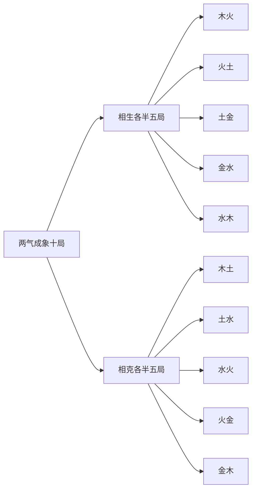

## 两气合而成象，象不可破也

「两气成象」者，干支二气相贯而偏于两端；或相生各半，或相克各半，皆可成「象」。

> 【原注】天干属木，地支属火，天干属火，地支属木，其象则一。若见金水则破，余仿此。

原注揭其端：「成象」之要，在于气势归于一端，譬如木火之两气相贯，无论干属木而支属火（或反之），皆归木火一象；若有金水介入，则破其象，余可类推。

【任氏广说】相生之五局（木火、火土、土金、金水、水木）与相克之五局（木土、土水、水火、火金、金木）皆可成象。

> 【任氏曰】两气双清，非独木火二形也，如土金、金水、水木，木火、火土，相生各半五局。即相克之五局亦是也，如木土、土水、水火、火金、金木之各半用敌也。相克务须均敌，切忌偏重偏轻。

相生之局，气势流畅，取顺势之美；相克之局，须「均敌」——双方力量等齐方能成象，偏重偏轻则不成。

任氏又示破局之例：

> 【任氏曰】若用金水，则火土不宜夹杂；如取水木，则火金不可交争。木火成象者，最怕金水破局。水火既济者，尤忌土来止水。各既如此，取运亦仿此而行。一路澄清，必位高而禄重；中途混乱，恐职弃而家倾。故此格最难全美，而看法贵在至精。若生而复生，乃是流通之妙；倘克而遇化，亦为和合之情。或谓理仅两神，似嫌狭少，不知格分十种，尽费推详。

由此提出「象不可破」之两条原则：其一，局象宜清，忌破局之五行介入；其二，运途亦须澄清，中途若遇破局之气冲入，前功尽弃。末句「此格最难全美，而看法贵在至精」——成象虽可致贵，而守护更难。

至若「生复生」「克遇化」，象中更有流通转化之妙：相生局再见生旺之神，是为「流通」；相克局遇合化之机（如戊癸化火），仇雠反成和合。

```mermaid
graph LR
    A[两气成象十局]
    A --> P[相生各半五局]
    A --> K[相克各半五局]
    P --> P1[木火]
    P --> P2[火土]
    P --> P3[土金]
    P --> P4[金水]
    P --> P5[水木]
    K --> K1[木土]
    K --> K2[土水]
    K --> K3[水火]
    K --> K4[火金]
    K --> K5[金木]
```

### 第一命造·木火成象取伤官

> 【命造一（任氏附例）】甲午 丁卯 甲午 丁卯
> 大运：戊辰 己巳 庚午 辛未 壬申 癸酉

四柱两组甲午、两天丁卯，干支皆木火。任氏取丁火伤官为用——甲木日主两见，旺相纯粹；伤官者，我生之英华，主聪明才艺外发。

满局无金水破象，「纯粹可观」。运至巳，丁火临官，「南宫奏捷，名高翰苑」。庚运一入，官杀（金）混局，庚金克甲木、庚金泄火气，故「降知县」。任氏预断「南方之金，尚有不足，将来西方之水，难言无咎」——金运甫动，水运随之，金水同行，则两气之象全破。

观此造可知：两气成象之忌，首在运来破局；初行旺运虽享名禄，终途混乱则前功尽弃。

### 第二命造·木火成象格成炎上

> 【命造二（任氏附例）】丁卯 乙巳 丁卯 乙巳

干支皆木火，与第一命造同气。然日主丁火两透（前一造为甲木），且丁火生于夏令当令，全局「木从火势」——非以木为主，乃以火为君、木为臣。任氏谓「非前伤官之比……格成炎上，更不宜见金运」。

运至寅卯巳午等木火旺乡，火势更增，「巡抚浙江」。一交辛运，天干辛金透出、地支水气萌动，金水破其炎上之局，「木火皆伤，故不能免祸」。末句「二人同心，可顺而不可逆也」——两气相依之势，顺则同盛，逆则俱伤。

两造对比：同一木火之象，日主（甲木与丁火）与取用（伤官与从势）不同，吉凶节奏随之而异。此即任氏「看法贵在至精」之实指——非徒辨象之有无，更须辨象中之主客。

### 第三命造·火土成象取食神

> 【命造三（任氏附例）】丙午 戊戌 丙午 戊戌

火土各半之象。丙火两透、戌土两藏（戊土本气兼藏火），任氏取戌土食神为用——火生土，食神主性情温厚、福禄平和，与前数造伤官之外放有别。

运至辛丑：辛金官星初动，丑为湿土能晦火，「秀气流行，登乡榜」——湿土暗蓄水气，不立即伤火。至壬运壬年，「赴会试，死于都中，盖水激丙火，则火灭也」——水激烈焰，卒然崩散。

任氏反面推演：两戌若易两辰，「不致燥烈，虽逢水运，亦不至大凶」——辰为湿土，能缓蓄而不激。盖燥土逢水立即崩冲，湿土则徐徐润下。此造提示：火土成象之关键，「燥湿」二字须审。

### 第四命造·土金成象取伤官

> 【命造四（任氏附例）】戊戌 辛酉 戊戌 辛酉

土金各半。戊土两透、辛金两透，土金纯粹。任氏取辛金伤官——土生金，英华外发，性质与第三命造之食神相近而取用各依局势。

运至北方水地（甲子、乙丑）：水生木、木克土、土生金，秀气周流，「少年科甲，仕至黄堂」。交丙运，丙火克破辛金之用（「伤官见官」），故「不禄」。

任氏由此推广：「凡两气成象者，要日主去生，或食或伤，谓英华秀发，多致富贵」。所不足者，「如金水、水木之印绶格，无秀可取，故无富贵，试之屡验」——两气之局，必取我生者（食伤），方见英华；若取生我者（印），则为印绶格，与两气成象有别，不可混论。

### 第五命造·水土成象通根燥土

> 【命造五（任氏附例）】癸亥 己未 癸亥 己未

水土各半，癸水两透、己未两藏。水势虽旺，妙在未中藏己土（燥土本气兼藏丁火），可作「通根」。任氏谓「喜其通根燥土，财命有一」——水土相克，水为我财、土为我身，未中燥土乃日主立根之处。

然「气势稍寒」——亥、未皆寒，缺火暖之。运至丙寅（丙火阳暖、寅木生火），「寒逢阳，运登科甲」；亥中、寅中甲乙木暗中生扶，仕至郡守，宦途平坦。

观此造：两气相克成象而日主不弱，关键在「通根」二字。无根之水或无根之土，不能自立成象；必待燥润相济、阴阳交暖，方可成局。

### 第六命造·土水相克纯杀无制

> 【命造六（任氏附例）】戊戌 癸亥 戊戌 癸亥

形似第五命造（皆水土）而用神迥异。两戊两癸，癸水七杀透出克戊土；戊土日主孤立，无食伤制杀、无从化之机。任氏判为「纯杀无制，日主受伤」。

初运火土（戊己、巳午未），与戊土同气，然于此局反助七杀之威，故「明月清风谁与共，高山流水少知音」，孤冷之象。一交乙卯，乙木克戊土之官杀系统，而乙木为日主之敌（七杀）所忌，「制杀化权」之机现，「得奇遇，飞升县令」——盖制杀者，与杀为敌者也。

任氏以六案收束两条公理：「生局必须食为美，印局无秀气，不足为佳。财局身财均敌，日主本气无伤，然又要运程安顿得好，斯为全美，一遇破局，则祸生矣。」生、财、印三局各有取用门径，不可一概而论；运程辅弼得当方为全美，破局则祸不旋踵。

## 五气聚而成形，形不可害也

「成形」与「成象」之别：成象者两气偏聚，成形者五气会聚而成「形」，以日主所喜用之元素为体。原注既揭木之成形须五行齐备：

> 【原注】木必得水以生之，火以行之，土以培之，金以成之。是以成形于要紧之地，或过或缺，则害。余仿之。

木欲成形，须以水生（养其本根）、以火行（暖其寒性）、以土培（立其根柢）、以金成（铸其器用），四者缺一则偏，过盛则溢。「害」者，偏枯失衡也。

> 【任氏曰】木之成形，食伤泄气，水以生之；官杀交加，火以行之；印绶重叠，土以培之；财轻劫重，金以成之。

任氏化原注之义为更细之辨：木若食伤过旺（泄气太过），以水济之；官杀交加（克身太过），以火制之；印绶重叠（生身太过），以土培之而通根；财轻劫重（金受克），则以金成之——皆所以救其偏而全其形也。

末段总论：「若四柱无成，成之于岁运又无成处，则终身碌碌，凶多吉少，有志难伸矣」——成形在于得用之地，最忌四柱既偏而运途又无补偏救弊之机。

### 第七命造·水势以戊土培之

> 【命造七（任氏附例）】壬戌 壬子 甲子 戊辰

壬水两透、子辰半合水局，水势汹涌。日主甲木生于水势之中，若无土培则漂浮无根。任氏谓「独戊土以培之，以作砥柱之功，不致浮泛也」——戊土一透，坐于辰中（湿土），通根戌土（燥土），戌土为根固之钥。

然戊土「亦赖有戌土而根固，若有辰而无戌，辰乃湿土，见水则荡，戊土不能植根而虚矣。无根之土，岂能止百川之源？故此造所重者，戌之燥土也」——辰为湿土、戌为燥土，二者形似而质异；戌之燥土方能植根而立，辰之湿土逢水则荡。

然「寒木无阳」，须火暖之。运至南方火旺（丙丁、巳午），「发财数万，名成异路」——盖形得火而成，木得火而发荣。

观此造，「成形」之要在「根固」与「温暖」两端：水土对峙须有根可立，寒木向荣须有火可发。

### 第八命造·劫刃肆逞微金成之

> 【命造八（任氏附例）】戊寅 乙卯 甲辰 辛未

支全寅卯辰，东方一气；日主甲木极旺，劫刃肆逞。一点辛金，「成之不足」——金受木克、土泄、火制，难以立足。

初运火土（甲寅癸丑），水木之地助劫旺，「故书香不继」；火土之乡有化之情（印绶化劫），「财源通裕」。至庚申辛酉运，「辛金得地，而成之异路」——西方金运助起微金，金方能成器成财，「加捐仕至州牧」。癸运，癸水生木泄金，微金再受克泄，「不禄」。

任氏提示：四柱之形虽「成之不足」，运途可补；成形之机贵在运来扶持。

### 第九命造·五行无金难成局

> 【命造九（任氏附例）】癸未 乙卯 甲戌 乙亥

支藏未戌，财星（戊土）深藏。然而：
- 柱中无金以「成」之（财无官护）
- 柱中无火以「行」之（戌中藏火可借，但无明火透出）
- 亥时癸水通根生劫、亥卯未合助劫

故「劫刃猖狂」，财星纵有而不受。任氏谓「祖业消磨，克妻无子」。「查其岁运，又无成地」——运途亦无补偏之机，故「终身碌碌」之象。

任氏结以警句：「命之所重在运，运其可忽乎。谚云：『人有凌云志，无运不能自达也。』」——重形无运，纵有志难伸；反之，四柱虽偏，运来补救，亦可致身。

---

## 独象喜行化地，而化神要昌

「独象」与「两气成象」之别：两气者干支各居其一，独象则支聚一方（曲直寅卯辰、炎上巳午未、稼穑辰戌丑未、从革申酉戌、润下亥子丑），干透或不透皆「乘权」一方。

> 【原注】一者为独，曲直炎上之类也。所生者为化神，化神宜旺，则其气流行，然后行财官之地方可。

原注总论：「独」者一方秀气，「化神」者我所生（食伤）之神，须旺方能流通。

> 【任氏曰】权在一人，曲直炎上之类是也。化者，食伤也，局中化神昌旺，岁运行化神之地，名利皆遂也。

任氏解「化神」即食伤——盖独方之局气势过旺，须食伤泄其英华为用。

> 【任氏曰】八字五行全备，固为合宜，而独象乘权，亦主光亨。木日，或方或局全，不杂金为曲直；火日，或方或局全，不杂水为炎上；土日，四库皆全，不杂木为稼穑；金日，或方或局全，不杂火为从革；水日，或方或局全，不杂土为润下。皆从一方之秀气，不同六格之常情。必要得时当令，遇旺逢生。但体质过于自强，须以引通为妙，而气势必有所关，务须审察其情。

任氏分列五方秀气：曲直（木局不杂金）、炎上（火局不杂水）、稼穑（土局不杂木）、从革（金局不杂火）、润下（水局不杂土）。要在于「得时当令、从一方秀气」，与常格取用有别。

「体质过于自强，须以引通为妙」——独方之局日主或气势过刚，须以食伤（引通）化解其英华为功名所用。

随后任氏分述独象喜忌：

- 见土运（木局）：「虽财神资养，先要四柱有食有伤，庶无分争之虑」——食伤先泄木势，财方为我有。
- 见火运（木局）：「英华发秀，须看原局有财无印，方免反克为殃」——印夺食，火反伤用。
- 见金运：破局，凶多吉少。
- 见水运（木局）：「局中无火，误用生助强神，亦主光亨，故旧有从强之说」；但「若四柱先有食伤，必主凶祸临身」。
- 「原局徽伏破神，须运有合冲之妙」——暗中破局之神，须运来合冲解之。
- 「若本主失时得局，要运遇生旺之乡，亦主功名小就」——日主虽失时，得局秀气，亦可借运补成。

### 第十命造·木局曲直化神昌

> 【命造十（任氏附例）】甲寅 丁卯 甲辰 丙寅

支全寅卯辰，东方一气。化神者丙丁也——食伤（火）泄木之英华。任氏评：「发泄菁华，少年科甲，早遂仕路之光」。

运途：「行财地，得过且过有食伤化劫之功」——财运（戊己土）虽来，然食伤化劫在前，可过得去；「行金运，又得丙丁回克之能」——金来破局，丙丁回克之，可抗衡；「交壬破局伤秀，降职归田不禄」——壬水克破化神，秀气尽失。

观此造，木局一气、丁火化神透出，「少年科甲」之象显然；末交壬运则如任氏所云「运途破局则凶」——独象之美，终于运途之持守。

### 第十一命造·稼穑格丁火伤金

> 【命造十一（任氏附例）】己未 丁丑 戊子 己未

费中堂造。天干戊己逢丁，地支子丑未相会，「子丑化土，斯真格象，已成稼穑」。稼穑者，土局也。

然「所不足者，丑中辛金无从引出，且局中丁火三见，辛金暗伤，未得生化之妙」——丁火食神透出本可秀气流通，然丑中藏辛金（印绶）被丁火克制，印星受伤，故「嗣息艰难」（印代表母亲、生育）。

任氏反推：「若天干透一庚辛，地支藏一申酉，必多子矣」——印星得力，则生化之机全矣。

此造提示：稼穑虽为土局，喜见秀气（食伤）流通；然不可过伤印绶——印为生化之源，护之方能传嗣。

### 第十二命造·火局炎上惜克土

> 【命造十二（任氏附例）】丙寅 甲午 丙戌 乙未

支全寅午戌，火局炎上。任氏谓「惜木旺克土，秀气有伤」——寅午戌火局本纯粹，然甲乙木泄火气之力过盛（木多火塞之象），食伤（木）克破印绶（土），故「书香难就」（印主文）。

「武甲出身，仕至副将」——火势猛烈而入武途。行申酉运，「运亦有戌未之化，所以无咎」；亥运「幸得未会寅合」，反有解救，「不过降职」；交庚子，「干无食伤，支逢冲激」，亥子冲激火局之根，「死在军中」。

观此造，炎上之格需食伤（木）流通英华，然木过旺则克土破印——「秀气有伤」即指此。

### 第十三命造·从革格肃杀太锐

> 【命造十三（任氏附例）】庚申 乙酉 庚戌 庚辰

「乙庚化合」于干，「地支申酉戌全」于支，格成从革。然「惜无水，肃杀之气太锐」——金局从革本需水（食伤）泄其英华，柱中无水，则杀气太盛。

任氏评：「不但书香不利，而且不能善终」——肃杀无食伤化，必横死之象。「行伍出身，官至参将」。一交寅运，「阵亡。盖局无食伤之故耳；又寅戌暗拱，触其旺神也」——寅运，寅午戌暗拱火局、暗伤金气，且寅中藏火克金，「触其旺神」。

任氏总结：从革之格，喜水食伤泄其英华；无水则杀气外露，易遭凶祸。

### 第十四命造·润下格秀气流行

> 【命造十四（任氏附例）】壬子 辛亥 癸丑 壬子

亥子丑北方一气，干透壬癸辛，格成润下。任氏评：「喜行运不背，书香早遂」——润下喜金水之乡，初运不背书香之格。

「甲寅运气流行，登科发甲」——寅中藏丙火食伤泄水之秀气，「运气流行」；乙卯运，「宦途平坦，由县令而迁州牧」。「丙辰，原局无食伤之化，群劫争财，不禄」——丙火食神透出，然辰为湿土晦火、食伤无力，群劫（亥子丑比肩）争财（庚辛金）。

观此造，润下虽美，须食伤（火）引通英华——运来食伤则显达，运去则凶。

## 全象喜行财地，而财神要旺

「全象」与「成象」「成形」之别：「三者为一」之局，不限于干支偏聚，亦含官印相生、财官并见等组合。

> 【原注】三者为一，有伤官而又有财也，主旺喜财旺，而不行官杀之地方可。

原注释「全」之要：须有伤官（食伤）与财星并见，且日主旺，喜行财地，忌入官杀之乡。

> 【任氏曰】三者为一，非专论伤官与财也。伤官生财，固为全矣，而官印相生，财官并见，岂非全乎？

任氏扩「全」之义：不仅伤官生财，凡命局中三元素（伤官+财；或官+印；或财+官）相生相成，皆为「全」。

> 【任氏曰】伤官生财，日主旺相，固宜财运，倘四柱比劫多见，财星被劫，官运必佳，伤官运更美。须观局中意向为是。

任氏强调「意向」之辨——日主、伤官、财星、官印之间的关系，须依具体格局而定：

- 日主旺、伤官轻、有印：喜财不喜官——印夺食伤，财可制印护食。
- 日主旺、财轻、有比劫：喜官不喜财——比劫争财，须官来制劫护财。
- 财官并见、日主旺相：喜财不喜官——官多反成杀。
- 官印相生、日主休囚：喜印不喜比劫。

「大凡论命，不可执一，须全局之意向，日主之喜忌为的」——任氏末句画龙点睛，破除死格。

### 第十五命造·伤官生财运至庚申

> 【命造十五（任氏附例）】戊申 丙辰 丁卯 甲辰

丁卯日元，生于季春（三月辰月）。伤官（乙木藏卯中）生财（戊土），格局本佳。然「嫌其木盛土虚」——卯木当令，土受木克，财星虚弱；甲木透干亦助伤官之势，「书香难就」（木克土、文途有损）。

运至庚申辛酉：「承先人事业虽微，而自创规模颇大，财发十余万」——金运来制甲乙木之伤官，护起戊土之财星，伤官生财流转而成。此即任氏「伤官生财，日主旺相，固宜财运，倘四柱比劫多见，财星被劫，官运必佳」之印证——金官运制劫护财，财方为我所发。

### 第十六命造·火土伤官劫刃肆逞

> 【命造十六（任氏附例）】己巳 辛未 丙午 丁酉

丙火生于午月，支全巳午南方一气，「旺之极矣」。火土伤官生财（己土食神生辛金）。

然「嫌者，丁火羊刃透干，局中全无湿气」——丁火劫刃，劫夺辛金之财，且无水润金，金被火克。所谓「劫刃肆逞，祖业无恒，父母早亡，幼遭孤苦」。

六旬前运走东南木火之地（甲乙寅卯），木生火、火助劫，「妻财子禄，一字无成」。

至丑运：「北方湿土，晦火生金」——丑为湿土晦丁火之光，金气得养，劫刃受制。「暗会金局」（丑与酉半会金），财星得势，「从此得际遇，立业发财」。七旬买妾连生二子（湿土生金，金得子息），及甲子癸亥北方水地，「获利数万，寿至九旬」。

任氏末以警句收束：「谚云：『有其运，必得其福』，为人岂可限量哉。」——此造前半生困顿、后半生发达，全在运途之转换（湿土、水地之助金制劫）。

---

## 形全宜损、形缺宜补

此节为子平之通论，与前几节「形象」之具体格局相呼应——盖形象诸格皆本「旺衰补泻」之理。

> 【原注】如甲木生于寅、卯、辰月，丙火生于巳、午、未月，皆为形全；戊土生于寅、卯、辰月，庚金生于巳、午、未月，缺。余仿此。

原注以出生月令论形之全缺——月令得令为形全，失令为形缺。然任氏随即驳其偏：

> 【任氏曰】形全宜损，形缺宜补之说，即子平「旺则宜泄宜伤，衰则喜帮喜助」之谓也。命书万卷，总不外此二句，读之直捷痛快，显然明白，故人人得而知之。究之深奥异常，其中作用实有至理，庸俗只知旺用泄伤，衰用帮助，以致吉凶颠倒，宜忌淆乱也。以余论之，须将四字分用为是，通变在一「宜字」。

任氏点出全节总纲：「形全宜损、形缺宜补」即子平八字核心法则之概括。命书虽多，要旨不外此八字。然八字之下又有深义，任氏层层剖析「宜」字之精微：

#### 泄与伤之分

> 【任氏曰】宜泄则泄之为妙，宜伤则伤之有功。泄者食伤也，伤者官杀也。均是旺也，或泄之有害，而伤之有利；或泄之有利，而伤之有害，所以泄伤两字，宜分而用之也。

同是「旺」，宜用食伤泄（顺其气势）还是官杀伤（去其旺势），须察具体格局：
- 日主旺，财官无气：伤（去比劫之有余，补官星不足）有利，泄（财星反被比劫所夺）则有害。
- 日主旺，财官不见，满局比劫：泄（顺其气势、流通劫财之性）有利，伤（激之则怒而反凶）则有害。

#### 帮与助之分

> 【任氏曰】宜帮则帮之为切，宜助则助之为佳。帮者比劫也，助者印绶也。均是衰也，帮之则凶，而助之则吉；或帮之则吉，而助之则凶，所以帮助两字，亦宜分而用之也。

同是「衰」，宜用比劫帮（增加同类）还是印绶助（生扶日主），亦须辨明：
- 日主衰，财星重叠：助（印绶化财生身）则吉，帮（比劫与日主同类但分财）则凶。
- 日主衰，官杀交加：助（印绶化杀生身）则吉，帮（比劫反激杀怒）则凶。

任氏结以「通变在一『宜』字」——「宜」者，审局而断，非执一端。

末段任氏驳原注以月令定形全形缺之偏：

> 【任氏曰】如木生寅卯辰月，干露庚辛，支藏申酉，莫非乃作全形而损之乎？火生巳午未月，干透壬癸，支藏亥子，莫非仍作全形而损之乎？土生于寅卯辰月为形缺，干丙丁而支己午莫非有作缺形而补之乎？凡此须究其旺中变弱、弱中变旺之理，不可执一而论。是以实似所当损者，而损之反有害，实似所当补者，而补之反无功，须说察焉。

形虽当令，若有克破之物，亦须另作计较。盖「实似所当损者，而损之反有害；实似所当补者，而补之反无功」——「宜」字之难，正在此处。

### 第十七命造·秋金坚锐伤之有功

> 【命造十七（任氏附例）】丁丑 庚戌 庚子 甲申

庚金生于戌月（九月），金当令。「秋金坚锐，官星虚脱」——庚金太旺，官杀（丁火）虽透而无气；财星（甲木）坐申金死地，亦无气。

初运土金（己酉、戊申），「形伤破耗」——土金助金，金更坚锐而财官愈弱；丁未、丙运助起官星（火克金），「家业鼎新」——火来伤金（去坚锐之气），反成调候，「伤之有功」。乙巳运，「晚景优游」。

任氏印证：「所谓伤之有功也」——秋金当令宜伤不宜泄，金过旺则须火制。

### 第十八命造·从革泄之有益

> 【命造十八（任氏附例）】戊申 壬戌 庚申 乙酉

「乙从庚化」于干，「支类西方，又坐禄旺」——申酉戌西方一气，庚金日主坐禄（申为庚禄），「权在一人」，从革格成。

虽有壬、戊，然「戊土紧克，不能引通泄其杀气」——戊土制壬水太过，食伤（壬水）不得流通。初运癸亥（北方水地），「财喜如心」——亥中壬水得长生之地，食伤泄金之秀气流行。

一交丙寅（东南木火之地），「触其旺神」——丙火克金、寅中藏火克金，从革之金局被破；「一败如灰，衣食难度，自缢而死」。所谓「泄之有益，伤之有害」——金旺本宜水泄其英华，火来克金则破局。

### 第十九命造·财多身弱帮之有功

> 【命造十九（任氏附例）】庚申 辛巳 丙辰 乙未

「丙火生于巳月，建禄」——丙火当令于巳。然「必要用财……庚辛重叠根深，独印受伤」——印绶（乙木）被庚辛金之财克尽；「弱可知矣」——印不生身，日主虽月令建禄而孤立无助。

运至甲申乙酉，金得地、木无根，「破耗异常」——财（金）来克木印，印受伤则日主无助。丙戌丁运，重振家声——丙丁火助日主比劫之力，与财（金）对抗。

任氏评：「此财多身弱，所谓帮之则有功也」——日主衰而印受伤，宜比劫帮身，不可再助印（印已被克，助亦受伤）。

### 第二十命造·官星满局助之则吉

> 【命造二十（任氏附例）】壬子 癸丑 丙午 壬辰

「满局官杀」——壬癸水透干、亥子丑会北，水势浩荡，丙火孤立无依。虽食伤未见（无甲乙木），然「丑辰皆湿土，能蓄水，不能止水」——湿土止不住水。

初交甲寅乙卯，「化杀生身」——甲乙木（食伤）既泄丙火之气，又制壬癸水之杀；更兼木能生火（印），一举两得，故「早游泮水，财旺有余」——杀有制，身有养，财（北方）得用。

后交丙辰，「不但不能帮身，反受官杀回克」——丙火虽帮身，然引发壬癸水来克（比劫引杀），「刑妻克子，家业耗散」。申年「暗拱杀局」——申与亥暗拱，杀局成立而亡。

任氏评：「所谓助之则吉，帮之反害也」——日主衰而杀重，宜印绶（甲乙木）化杀，不宜比劫（丙火）帮身反激杀。

## 形象一系在命学体系中的统摄位置

形象一论，统摄特殊格局之成与用。「两气成象」论干支偏聚之气——相生、相克各半，气势均敌而成一象；「五气聚形」论日主五行得用之地——水以生、火以行、土以培、金以成，五气周全；「独象」论一方秀气——曲直、炎上、稼穑、从革、润下五方之局；「全象」论三元素相生之局——伤官生财、或官印相生、或财官并见；「形全宜损、形缺宜补」论旺衰补泻之通则——五节相承，由象而形，由形而理，层层递进。

任氏于此篇反复申一义：「命书万卷，总不外此二句」之「形全宜损、形缺宜补」八字；然八字之下，「泄伤」、「帮助」各有分用，「宜」字最关紧要。此即子平之活法，亦即形象一系所统摄之总枢纽。任氏末以警句云：「命之所重在运，运其可忽乎」——理固重要，运尤为关键；理与运合，方成全美。

观二十案，格局之变化虽繁，要不外「得时当令、遇旺逢生」与「形全宜损、形缺宜补」两端之配合。形象之美，在于「成」与「成」之圆满；形象之难，在于「护」与「运」之周全。任氏警语「看法贵在至精」「人有凌云志，无运不能自达也」「有其运，必得其福」三句，实为此篇三段总结——精于理、勤于运、终归于福，亦形象一系之所归宿。