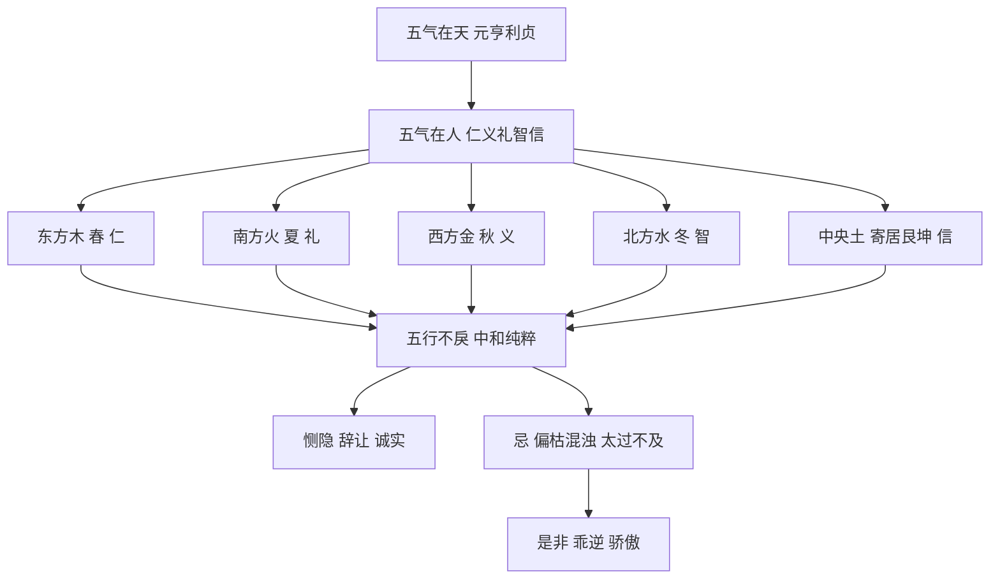

# 性情

## 篇名与总纲

"五气不戾，性情中和；浊乱偏枯，性情乖逆"——此十六字为《滴天髓阐微·性情》之总纲。"五气"指五行之气，"戾"意为乖违、违逆。全篇立论建立在核心命题上：命主五行之气若不乖戾、流通有情，则性情人格趋向中和仁义；若浊乱偏枯（污浊混乱或偏于一端而枯竭），则性情必然乖违悖逆。这一开篇把"性情"从伦理学层面的抽象概念，落实到五行生克、阴阳流转的具体格局判读。

## 原注要义

> 【原注】五气在天，则为元亨利贞；赋在人，则仁、义、礼、智、信之性，恻隐，羞恶，辞让，是非诚实之情，五所不戾者，则其存之而为性，发之而为情，莫不中和矣，反此者乖戾。

原注以"元亨利贞"配"仁义礼智信"为骨架，把天道的四德与人性的五常打通——五气对应五常，五行不戾则五常存于中、达于外，便是"中和"；反之则"乖戾"。这是中国古典哲学中典型的"天人合一"式立论，根基于《周易·乾·文言》"元者善之长也，亨者嘉之会也，利者义之和也，贞者事之干也"以及《中庸》《孟子》等儒家元典对五常的阐发。

## 任氏补注

> 【任氏曰】五气者，先天《洛书》之气也。阳居四正，阴居四隅，土寄居于艮坤，此后天定位之应。东方属木，于时为春，于人为仁南方属火，于时为夏，于人为礼；西方属金，于时为秋，于人为义；北方属水，于时为冬，于人为智。坤艮为主，坤居西南者，以火生土，以土生金也；艮居东北者，万物皆主于土，冬尽春来，非土不能止水，非土不能栽木，犹仁、义、礼、智之性，非信不能成。故圣人易艮于东北者，即信以成之之旨也。赋于人者，须要五行不戾，中和纯粹，则有恻隐、辞让、诚实之情；若偏枯混浊，太过不及，则有是非、乖逆、骄傲之性矣。

任铁樵把"五气"溯源于《洛书》图书之学：阳居四正（东南西北），阴居四隅（东南、西南、东北、西北），土寄居艮（东北）坤（西南）。这与后世流行的"洛书九宫"方位图一致，是把五行纳入空间方位系统的传统做法。

更重要的是，任氏把"信"（土）作为贯通四德的关键——"犹仁、义、礼、智之性，非信不能成"。这是接续《中庸》"诚者天之道也"与《易传》"成性存存"之旨，把"土"提升为五常之基。任氏点出："故圣人易艮于东北者，即信以成之之旨也"——这是引《周易·说卦》"艮，东北之卦也，万物之所成终而所成始也"，为"信"为五常之本的论断找经典依据。

## 五气与五常的对应框架

任氏把五行方位、五常、五脏、四时整合为一个天人对应的完整图式。下文各小节，便是从五行不同状态（火烈、水奔、木奔南、金见水、西水还南、东火转北、顺生逆生、阳明阳浊、羊刃伤官）展开"性情"的具体判读。

### 【命造一（任氏注）：五行不戾、中和纯粹】

> 己丑 丙寅 甲子 戊辰
>
> 乙丑 甲子 癸亥 壬戌 辛酉 庚申
>
> 甲子日元，生于孟春，木当令而不太过，火居相位不烈，土虽多而不燥，水虽少而不涸，金本无而暗蓄，则不受火之克，而得土之生，无争战之风，有相生之美。为人不苟，无骄谄刻薄之行，有廉恭仁厚之风。

此造为"五行不戾"的范例。日主甲木生于寅月（木当令），时干透出丙火（火居相位），地支辰丑土多但不燥，癸水虽不透却暗蓄于支中。任氏用"不太过""不烈""不燥""不涸"四个否定词勾勒五行各得其所的状态。

按命理判读：木（甲寅）得令而旺，火（丙）有气可泄木之秀，土（戊辰丑）能培木、生金、蓄水；金虽不透但藏于丑土之中，得火生土、土生金而"暗蓄"。整局构成木生火、火生土、土生金、金生水的连续相生，即所谓"无一气偏胜"。

任氏所断"为人不苟，无骄谄刻薄之行，有廉恭仁厚之风"——正与"恻隐、辞让、诚实"三德相对应，验证了"五行不戾则性情中和"的命题。

### 【命造二（任氏注）：土虚寡信、信义皆虚】

> 己酉 丁卯 己卯 乙丑
>
> 丙寅 乙丑 甲子 癸亥 壬戌 辛酉
>
> 己卯日元，生于仲春，土虚寡信，木多金缺，阴火不能生湿土，信义皆虚。且八字纯阴，一味趋炎附势，其心存损人利己之事，萌幸灾乐祸之意。

此造为"浊乱偏枯"的反例。日主己土生于卯月（木旺克土，土虚），天干乙木透出克土，己土身弱。丁火为阴火（与丙火相别），见湿土不能生金；金（酉金虽在地支）缺而无力。整局"土虚寡信"——土为信之官，信义俱虚。

任氏用"趋炎附势""损人利己""幸灾乐祸"三组词描述此种格局之人格特征，正与"是非、乖逆、骄傲"三恶性相对应。值得玩味的是"八字纯阴"一句——天干己丁己乙皆阴干（甲己合化土，乙为阴木，丁为阴火），地支卯卯酉丑亦多阴性（仅酉为阳金），阴阳失调使整局偏向阴柔阴沉，任氏所谓"信义皆虚"与此有直接关联。

### 【命造三（任氏注）：偏枯混乱、性情乖张】

> 丙戌 乙未 丙子 甲午
>
> 丙申 丁酉 戊戌 己亥 庚子 辛丑
>
> 丙生季夏，火炎土燥，天干甲乙，枯木助火之烈，更嫌子水冲激之急，偏枯混乱之象。性情乖张，处世多骄傲，且争躁如风火，顺其性千金不惜，逆其性一芥中分。因之家业破败无存。

此造更进一步：丙火生于未月（季夏），年支戌为火库、月支未为木库干土，三合火局；天干甲乙木反助火势；地支子午冲激。整局火炎土燥，阴阳失调。

任氏判"偏枯混乱"——火炎是"偏"（偏于火），土燥木枯是"枯"（气机枯竭），子午冲是"乱"（水火交战）。"性情乖张"对应的是"争躁如风火"的躁急性格；"千金不惜、一芥中分"是讲情绪随顺逆而极端——这是"浊乱偏枯"在具体行为层面的表现。

## 火烈而性燥者，遇金水之激

> 【原注】火烈而能顺其性，必明顺，惟金水激之，其燥争不可御矣。

> 【任氏曰】火燥而烈，其炎上之性，只可纯用湿土润之，则知礼而成慈爱之德；若遇金水激之，则火势愈烈而不知礼，灾祸必生也。湿土者，丑辰也，晦其光，敛其烈，则明矣。

此节切入"火"这一行气的具体性情表现。火本炎上，燥而猛烈——若纯用湿土（丑辰）以收其光、敛其烈，则火能明礼而成慈爱之德；但若遇金水激之（金来克木、火失木之助力而孤立；水来克火、火被直接扑灭），则火势反而暴烈而不知礼。

任氏把"湿土"的调和作用讲得很具体——丑辰两位能晦火、蓄水、养木、收金，使五行各得其所。

### 【命造四（任氏注）】

> 丙戌 甲午 丙午 己丑
>
> 乙未 丙申 丁酉 戊戌 乙亥 庚子
>
> 丙午日元，生于午月，年月又逢甲丙，猛烈极矣，最喜丑时，干支皆湿土，能收丙之烈，能晦午之光，顺其性，悦其情，不凌下也。其人威而不猛，严而不恶，名利双辉。

此造日主丙午，年支戌为火库，月支午火、当令午火——三火合一，天干又透甲丙，火势猛烈极矣。最妙时支丑为湿土，"能收丙之烈，能晦午之光"——丑土晦火、蓄水、养木，恰好把火之燥气化开。

任氏所判"威而不猛，严而不恶"——这是"用湿土顺其性"的性情效果：威而不暴、严而有情，正是儒家"威而不猛"的理想人格。

### 【命造五（任氏注）】

> 辛巳 甲午 丙子 甲午
>
> 癸巳 壬辰 辛卯 庚寅 己丑 戊子
>
> 丙火生于午月午时，木从火势烈之极矣，无土以顺其性，金无根，水无源，激其猛烈之性，所以幼失父母，依兄嫂居。好勇不安分，年十六七，身材雄伟，膂力过人，好习拳棒，乐与里党无赖交游，放宕无忌，兄嫂不能禁，后因搏虎，而被虎噬。

此造与命造四形成鲜明对比。丙火生于午月午时，两午夹一子（月支午、时支午、年支巳皆火），木（甲木两透）从火势——火势极烈。

关键在"无土以顺其性"——四柱无丑辰湿土，无法收火之烈；金（辛金虽透坐巳火之上）无根；水（子水被午火所冲所克）无源。"激其猛烈之性"——这一句把"金水之激"的具体作用讲透了：金无根则不能生水，水无源则不能济火，反而激起火的暴烈之性。

"幼失父母，依兄嫂居"——父母星受损；"好勇不安分""搏虎而被虎噬"——火烈无制的极端表现，是火之"不知礼"的具体落实。

## 水奔而性柔者，当火土之神

> 【原注】水盛而奔，其性至刚至急，惟有金以行之，木以泄之，则柔矣。

> 【任氏曰】水性本柔，其冲奔之势，刚急为最，若逢火冲之，土激之，逆其性而更刚矣。奔者，旺极之势也，用金以顺其势，用木以疏其淤塞，所谓从其旺势，纳其狂神，其性反柔。刚中之德，易进难退之意也，虽智巧多能，而不失仁义之情矣。

此节论"水"。水本柔，但旺极则"冲奔"——气势刚急。任氏区分"顺其势"与"激其势"两种处置：顺其势则用金（金生水、金之气可顺水之流）；疏其淤则用木（木泄水之力，使水有所出）。若逢火冲、土激——"逆其性而更刚"——水会变成滔天洪水。

"从其旺势，纳其狂神"——这是任氏提出的关键方法论：当水旺极时，不可正面克制，而要顺其势、纳其神。顺其势则水得用，激其势则水成灾。

### 【命造六（任氏注）】

> 癸亥 甲子 壬申 庚子
>
> 癸亥 壬戌 辛酉 庚申 己未 戊午
>
> 壬申日元，生于子月，年时亥子，干透癸庚，其势冲奔，不可遏也。月干甲木凋枯，又被金伐之，不能纳水，反用庚金顺其气势。为人刚柔相济，仁德兼资，积学笃行，不求名誉。

此造壬水生于子月，三水（壬癸亥子）一气冲奔。甲木本可"纳水"（泄水生木，使水有所出），但甲木凋枯又被庚金所克，反不能纳水。任氏以庚金为用——庚金是壬水的"顺神"（金生水为顺），顺其奔势则水之性反柔。

"刚柔相济，仁德兼资"——水之刚与金之柔、木之仁相合，构成"虽智巧多能，而不失仁义之情"的理想人格。

但此造仍见凶——"初运癸亥，从其旺神，荫庇大好；壬戌水不通根，戌土激之，刑丧破耗……一交己未，激其冲奔之势，连克三子，破耗异常，至戊运而亡。"任氏特意提示：顺其势不等于可任意妄为，若行运遇"激神"（戌未等土运），仍会触发水之暴烈本性。

### 【命造七（任氏注）】

> 壬寅 壬子 壬辰 壬寅
>
> 癸丑 甲寅 乙卯 丙辰 丁巳 戊午
>
> 天干四壬，生于子月，冲奔之势。最喜寅时，疏其辰土之於塞，纳其壬水之旺神，所以不骄不傲，赋性颖异，读书过目不忘，为文倚马万言。甲寅入泮，乙卯登科。

此造为"水奔有木纳"的范例。天干四壬、地支子辰——水势冲奔。寅木两透（年支、时支），甲乙寅卯运木气旺盛，能"疏其辰土之淤塞，纳其壬水之旺神"——木为水之泄气，水得木之疏通则不至于漫溢为患。

"不骄不傲，赋性颖异"——任氏把水之智与木之仁相配，得到"智仁双彰"的人格。

### 【命造八（任氏注）】

> 癸未 癸亥 壬子 戊申
>
> 壬戌 辛酉 庚申 乙未 戊午 丁巳
>
> 壬子日元，生于亥月申时，年月两透癸水，只可顺其势，不可逆其流。所嫌未戊两字，激水之性，敌其为介非倒置，作事不端，无所忌惮。初运壬戌，支逢土旺，父母皆亡；辛酉庚申，泄土生水，虽无赖邪僻之行，幸免凶咎；一交己未，助土激水，一家五口，回禄烧死。

此造为"水奔有土激"的反面教材。壬子生于亥月申时，三水（壬亥子）一气，未戊两土杂于其中。"所嫌未戊两字，激水之性"——土为水之克（财星），水旺见土则成激战之势。

"敌其为介非倒置，作事不端，无所忌惮"——任氏用很重的词描述此种格局之人格。"回禄烧死"是水火交战在结局层面的极端呈现：火（回禄之火）虽烧，水亦因激而失控。

三造合看，"水奔"格局判读要点：一看是否有金（顺神）以顺其势，二看是否有木（泄神）以纳其旺，三看是否有土（激神）以激之。有金有木则水之性柔智圆，遇土激则水之性刚而失控。

## 木奔南而软怯

> 【原注】木之性见火为慈，奔南则仁之性行于礼，其性软怯。得其中者，为恻隐辞让，偏者为姑息，为繁缛矣。

> 【任氏曰】木奔南，泄气太过，柱中有金，必得水以通之，则火不烈；如无金，必得辰土以收火气，得其中矣，为人恭而有礼，和而中节。如无水以济土，土以晦火，发泄太过，则聪明自恃，又多迁变不常，而成妇人之仁矣。

此节论"木"。木之性本仁，木见火则为"慈"（火泄木为食伤，食伤主才华表达与慈爱外现）。但若木奔南（火旺方）太过，则泄气太过而"软怯"——即"仁之性行于礼"的过度表达，变成姑息、繁缛、妇人之仁。

任氏把"得其中"与"偏者"区分得非常清楚：得中为恻隐辞让，偏为姑息繁缛。处置方法：若柱中有金，必得水以通之（金生水、水克火，使火不烈）；若无金，必得辰土以收火气（辰为湿土，能蓄水、晦火、养木）。

### 【命造九（任氏注）】

> 庚辰 壬午 甲午 丙寅
>
> 癸未 甲申 乙酉 丙戌 丁亥 戊子
>
> 甲午日元，生于午月，木奔南方，虽时逢禄旺，丙火逢生，寅午拱火，非日主有矣。最喜月透壬水以济火，然壬水庚金之生，不能克丙为用，庚金无辰土，亦不能生水。此造所妙者辰也，晦火，养木，蓄水，生金，使火不烈，木不枯，金不熔，水不涸，全赖辰之一字，得中和之象。

此造为"木奔南有辰"的范例。甲午生于午月，丙火时透，寅午拱火——木奔南之极。任氏特别点出"全赖辰之一字"——年支辰为湿土，能晦火、养木、蓄水、生金，使火、木、金、水四行各得其所。

"申运壬水逢生，用乙酉金旺水生，入泮补廪而举于乡；丙戌火土并旺，服制重重；丁亥壬水得地，出宰闽中，德教并行，改成民化。所谓刚柔相济，仁德兼资也。"

任氏在此造把辰土一字的"调候枢纽"作用讲得透彻——这是命理中"通关""调候"理论的活案例。

### 【命造十（任氏注）】

> 丙戌 甲午 甲申 丙寅
>
> 乙未 丙申 丁酉 戊戌 己亥 庚子
>
> 甲申日元，生于午月，两透丙火，支会火局，木奔南方，燥土不能晦火生金，无水则申金克尽，柔软极矣。其人为昵私恩，不知大体，作事狐疑，少决断，所为心性多疑，贪小利，背大义，一事无成。

此造与命造九对比，是"木奔南无水"的反例。甲申生于午月，丙火两透、支会火局（寅午戌）——木奔南之极。燥土（戌、未）不能晦火生金；又无水以济——任氏说"无水则申金克尽，柔软极矣"。

注意"柔软极矣"的具体表现："昵私恩，不知大体，作事狐疑，少决断"——这是"软怯"的负面版本：木奔南泄气太过，日主元气不足，表现为性格上的优柔寡断、贪小利而背大义。"妇人之仁"在这里变成了具体的人格缺陷。

## 金见水以流通

> 【原注】金之性，最方正，有断制执毅，见水则义之性行而为智，智则元神不滞，故流通。得气之正者，是非不苟，有斟酌，有变化；得气之偏者，必泛滥流荡。

> 【任氏曰】金者，刚健中正之体也，能任大事，能决大谋，见水则流通刚前面之性，能用智矣。得气之正者，金旺遇水也，其人内方外圆，能知权变，处世不伤廉惠，行藏自合中庸；得气之偏者，金衰水旺也，其人作事荒唐，口是心非，有挟术待人之意也。

此节论"金"。金之性本方正、刚毅、果断；见水则"义之性行而为智"——金主义、水主智，金水相涵则人既能坚持原则（义），又能圆融变通（智）。

任氏判"得气之正"与"得气之偏"：金旺遇水为正，金衰水旺为偏。正者"内方外圆"，偏者"作事荒唐，口是心非"。

### 【命造十一（任氏注）】

> 甲申 癸酉 庚子 乙酉
>
> 甲戌 乙亥 丙子 丁丑 戊寅 己卯
>
> 庚生酉月，又年时申酉，秋金锐锐，喜其坐下子水，透出癸水元神，流通金性，泄其菁华。为人任大事而布置有方，处烦杂而主张不靡，且慷慨好施，克己利人也。

此造为"金见水流通"的范例。庚金生于酉月（秋金锐锐），年支申、时支酉——金气极盛。坐下子水、癸水透干——水之元神充足，能"流通金性、泄其菁华"。

"为人任大事而布置有方，处烦杂而主张不靡"——这是"内方外圆，能知权变"的具体写照：金之刚毅体现在"任大事"上，水之智圆体现在"布置有方"上。

### 【命造十二（任氏注）】

> 壬申 壬子 庚辰 丙子
>
> 癸丑 甲寅 乙卯 丙辰 丁巳 戊午
>
> 庚生仲冬，天干两透壬水，支会水局，金衰水旺，本属偏象，更嫌时透丙火混局。金主义而方，水司智而圆，金多水少，智圆行方，水泛金衰，方正之气绝，圆智之心盛矣。中年运逢火土，冲激壬水之性，刑伤破耗，财散人离，半生奸诈，诱人财物，尽付东流。

此造为"金衰水旺"的偏象。庚金生于仲冬（子月），天干两壬透出、地支申子辰会水局——金衰水旺，"水泛金衰"。时透丙火本可调候，但任氏说"更嫌时透丙火混局"——火在这里反而搅乱金水之性。

"方正之气绝，圆智之心盛"——这是"金衰水旺"在人格层面的具体表现。"半生奸诈，诱人财物"——圆智变成了奸诈，正气荡然无存。

任氏在结尾特意发议论："凡人穷达富贵，数已注定，君子乐得为君子，小人枉自为小人"——这一句把命理判定与道德修养分开，避免落入"命定论"的陷阱：命格可判，但人格修养仍需个人努力。

## 最拗者西水还南

> 【原注】西方之水，发源最长，其势最旺，无土以制之，木以纳之，如浩荡之势。不顺行，反行南方，则逆其性，非强拗而难制乎？

> 【任氏曰】西方之水，发源昆仑，其势浩荡，不可遏也。亦可顺其性，用木以纳之，则智之性行于仁矣。如用土制之，若不得其情，有反冲奔之患，其性仍逆而强拗。

此节论"西水入南"——即金水旺而行南方火运的特殊情形。西方之水（庚辛申酉戌亥）气势浩荡，本该顺行西方或北方（金水之地）；若反行南方（火地），则逆其性而成"强拗"之格。

任氏强调"用木以纳之"——木为水之泄神，使水有所出、有所归，则智（水）之性能行于仁（木）。"如用土制之，若不得其情，有反冲奔之患"——土虽可制水，但若土不当令（不得其情），则水之冲奔反成激战之势。

### 【命造十三（任氏注）】

> 癸亥 庚申 壬申 甲辰
>
> 己未 戊午 丁巳 丙辰 乙卯 甲寅
>
> 壬申日元，生于亥年申月，亥为天门，申为天关，即天河之口，正西方之水，发源最长。所喜者，时干甲木得辰土，通根养木，足以纳水，则智之性行而为仁，礼亦备矣。为人有惊奇之品汇，无巧利之才华。中年南方火运，得甲木生化，名利两全。

此造为"西水入南有木纳"的范例。壬申生于申月、亥年——天关（申为水之生处）、天门（亥为水之成处），西方之水发源最长。时干甲木得辰土之养，能"纳水"——把水之旺势引向木的成长。

"智之性行而为仁，礼亦备矣"——这是水（智）、木（仁）、火（礼）三德俱全的理想格局。"中年南方火运，得甲木生化，名利两全"——南方火运本应逆水之性，但因有甲木居中"生化有情"，火能生土、土能养木、木能纳水，构成木火通明的连环流通。

### 【命造十四（任氏注）】

> 癸亥 庚申 壬子 丙午
>
> 己未 戊午 丁巳 丙辰 乙卯 甲寅
>
> 壬子日元，生于申月亥年，西方之水，浩荡之势，无归纳之处，时逢丙午，冲激以逆其性。为人强拗无礼，兼这运走南方火土，家业破败无存。至午运，强人妻，被人殴死。俗以丙火为用，运逢火土为佳，不知金水同心。可顺而不可逆。须逢木运，生化有情，可免凶灾，而人亦知礼矣。

此造为"西水入南无木纳"的反例。壬子生于申月亥年，西方之水浩荡无归。时逢丙午——火来冲激水之性——"逆其性"而成"强拗"。"至午运，强人妻，被人殴死"——逆性至极的极端行为后果。

任氏特意点出时人误解："俗以丙火为用，运逢火土为佳"——这是当时常见的一种误判。任氏纠正："不知金水同心，可顺而不可逆"——金水之气应顺其势，不可强行用火土克制。真正化解之道是"逢木运，生化有情"——木居中作通关之神，使金水之刚与火土之燥都得到调和。

## 至刚者东火转北

> 【原注】东方之火，其气焰欲炎上，局中无土以收之，水以制之，焉能安焚烈之势？若不顺行而反行北方，则逆其性矣，能不刚暴耶？

> 【任氏曰】东方之火，火逞木势，其炎上之性，不可御也，只可顺其刚烈之性，用湿土以收之，则刚烈之性，化为慈爱之德矣。一转北方，焉制焚烈之势？必刚暴无礼。若无土以收这，仍行火木之运，顺其气势，亦不失慈让恻隐之心矣。

此节论"东火转北"——东方之火（丙丁寅卯巳）气势炎上，本该顺行南方火地；若反行北方（水地），则逆其性而成"刚暴"。

任氏把"东方之火"与"南方之火"区分开来：东方之火带木气（寅卯），木生火更助其势；南方之火是纯粹的火气。这种细分在论命时很关键——东方木火是"生发"之火，南方火土是"燥烈"之火。

### 【命造十五（任氏注）】

> 丙寅 甲午 丙午 己丑
>
> 乙未 丙申 丁酉 戊戌 乙亥 庚子
>
> 丙午日元，生于午月寅年，年月又透甲丙，其焚烈炎上之势，不可遏也。最妙支在丑时，湿土收其猛烈之性，为人有容有养，骄谄不施。运逢土金，仍得丑土之化。科甲连登，仕至郡守。

此造与命造四"火烈"一节丙戌甲午丙午己丑实为同一格局（按：原注所列两造一致）。日主丙午、时干己丑——丑土为湿土收火之烈。任氏判"有容有养，骄谄不施"——这是"刚烈化为慈爱"的人格化呈现。

### 【命造十六（任氏注）】

> 丁卯 丙午 丙午 庚寅
>
> 乙巳 甲辰 癸卯 壬寅 辛丑 庚子
>
> 丙午日元，生于午月，年时寅卯，庚金无根，置之不用，格成炎上；局中无土吐秀，书香不利，行伍出身。至卯运得官，壬运失职；寅运得军功，骤升都司；辛丑运生化之机无气，一交庚子，冲激午刃，又逢甲子年双冲羊刃，死于军中。

此造为"东火转北"无土的凶象。丙午生于午月，年时寅卯——东方木气助火。庚金无根（庚坐午火、寅木），置之不用。格成炎上——纯粹从火势。

"局中无土吐秀"——没有丑辰湿土，火气无以宣泄。任氏所断"行伍出身"——这种"炎上格"在命理上往往对应武职、军功。

"辛丑运生化之机无气，一交庚子，冲激午刃，又逢甲子年双冲羊刃，死于军中"——"东火转北"的凶险：火势本炎上，一遇北方水运，水来激火、火性暴烈，最终反主凶亡。

## 顺生之机，遇击神而抗

> 【原注】如木生火，火生土，一路顺其性情次序，自相和平：中遇击神，而不得遂其顺生之性，则抗而勇猛。

> 【任氏曰】顺则宜顺，逆则宜逆，则和平而性顺矣。如木旺得火以通之，顺也；土以行之，生也，不宜见金水之击也。木衰，得水以生之，反顺也；金以助水，逆中之生也，不宜见火土之击也。我生者为顺，生我者为逆；旺者宜顺，衰者宜逆，则性正情和。如遇击神，旺者勇急，衰者懦弱。

此节论"顺生之机"——即五行按序相生（木→火→土→金→水→木）的流转。顺生之机本身是"和平"的，但若遇"击神"（金克木、水克火等反向冲击），则平和被打破，"抗而勇猛"。

任氏的方法论纲领："顺则宜顺，逆则宜逆"——顺势则顺行相生，逆势则逆行相生（即衰者得生）。"我生者为顺，生我者为逆"——这一句给出了生克关系中"顺逆"的判读标准。

### 【命造十七（任氏注）】

> 己亥 丙寅 甲寅 壬申
>
> 乙丑 甲子 癸亥 壬戌 辛酉 庚申
>
> 甲寅日元，生于寅月，木旺得丙火透出，顺生之机，通辉之象，读书过目成诵。所嫌者时遇金水之击，年干己土虚脱，不制其水；兼之初运北方水地，不但功名难遂，而且破耗刑伤，一交辛酉，助水之击，合去丙火而亡。

此造为"顺生遇击"的范例。甲寅生于寅月，丙火透出——木生火，顺生之机明显，主人聪明好学。但时支申金、壬水透干——金水为木火之"击神"。"合去丙火而亡"——金（辛）合去火（丙），顺生之机被切断。

### 【命造十八（任氏注）】

> 庚寅 戊寅 甲午 壬申
>
> 己卯 庚辰 辛巳 壬午 癸未 甲申
>
> 甲午日元，生于寅月，戊土透出，寅午拱火，顺生之机，德性慷慨，襟情磊落。亦嫌时逢金水之击，读书未售，破耗多端；兼之中运不济，有志未伸。还喜春金不旺，火土通根，体用不伤，后昆继起。

此造与命造十七结构相似但命运不同，关键在于戊土（财星）透出护火，且"春金不旺"——金之击力不强，火土尚能"通根"。"后昆继起"——本人虽有志未伸，但后代能继其业。

两造合看，"顺生遇击"格局的吉凶判读要点：一看击神（金水）的力量与位置，二看是否有通关之神（土或木的化泄）护住顺生之机。

## 逆生之序，见闲神而狂

> 【原注】如木生亥，见戌酉申则气逆，非性之所安，一遇闲神若巳酉丑逆之，则必发而为狂猛。

> 【任氏曰】逆则宜逆，顺则宜顺，则性正情和矣，如木旺极得水以生之，逆也；金以成之，助逆之生也，不宜见己丑之闲神也。如木衰极，得火以行之，反逆也；土以化之，逆中之顺也，不宜见辰未闲神也。此旺极衰极，乃从旺从弱之理，非前辈旺衰得中之意。如旺极见闲神，必为狂猛；衰极见闲神，必为姑息。

此节论"逆生之序"——与"顺生"相对的另一种流转。"从旺从弱"是命理中特殊的格局：旺极从旺、衰极从弱，类似于"顺势格"。

任氏把"闲神"的作用讲得很透：旺极见闲神必为狂猛，衰极见闲神必为姑息。"闲神"是指破坏整个"从格"统一性的杂气——比如从旺格中见克泄之气的"闲神"，会让本来专一的旺势突然失衡。

### 【命造十九（任氏注）】

> 壬子 辛亥 甲寅 甲子
>
> 壬子 癸丑 甲寅 乙卯 丙辰 丁巳
>
> 甲寅日元，生于亥月，水旺木坚，旺之极矣。一点辛金，从水之势，不逆其性，安而且和，逆生之序，更妙无土，不逆水性。初运北方，入泮登科；甲寅乙卯，从其旺神，出宰名区；丙辰尚有拱合之情，虽落职而免凶咎；丁巳遇闲神冲击，逆其性序而卒。

此造为"逆生之序"的范例。甲寅生于亥月，水旺木坚——木极旺。辛金一点，从水之势不逆木性。"无土，不逆水性"——印星（土）不出现破坏水木的清纯之气。

"丁巳遇闲神冲击，逆其性序而卒"——巳火（闲神）的出现冲击了水木的清纯之性，使原本的"安而且和"瞬间失控。

### 【命造二十（任氏注）】

> 壬寅 辛亥 甲寅 己巳
>
> 壬子 癸丑 甲寅 乙卯 丙辰 丁巳
>
> 甲寅日元，生于寅年亥月，辛金顺水，不逆木性，逆生之序。所嫌巳时为闲神，火土冲克逆其性，又不能制水。初交壬子，遗绪丰盈；癸丑地支闲神结党，刑耗多端；甲寅乙卯，丁财并益；一交丙辰，助起火土，妻子皆伤，又遭回禄，自患颠狂之症，投水而亡。

此造与命造十九对比，是"逆生遇闲神"的反面教材。己巳时——火土已经出现在命局中（不像命造十九"无土"），这是闲神已经潜伏在命局本身。

"自患颠狂之症，投水而亡"——这是"旺极见闲神必为狂猛"的极端结果。任氏用"颠狂"二字直接描述此种格局之人格状态。

### 【命造二十一（任氏注）】

> 戊戌 丁巳 甲寅 己巳
>
> 戊午 己未 庚申 辛酉 壬戌 癸亥
>
> 甲寅日元，生于巳月，丙火司令，虽坐禄支，其精泄尽，火旺木焚，喜土以行之，此衰极从弱之理。初运戊午己未，顺其火土之性，祖业颇丰，又得一衿；庚申逆火之性，泄土之气；至癸亥年，冲激火势而亡。

此造为"衰极从弱"之象。甲寅生于巳月（丙火司令），木之精气被火泄尽——木衰极。喜土以行之（火生土、土能化解火的暴烈之气），构成"衰极从弱"的格局。

"庚申逆火之性，泄土之气"——金来逆火、土被金泄，从弱之格被打破。"至癸亥年，冲激火势而亡"——水火交战、命局崩溃。

三造合读，任氏把"从旺从弱"格局的判读系统化了：一看旺衰是否到极，二看是否有"闲神"破坏格局的统一性，三看行运是顺势还是逆势。

## 阳明遇金，郁而多烦

> 【原注】寅午戌为阳明，有金气伏于内，则成其郁郁而多烦闷。

> 【任氏曰】阳明之气，本多畅遂，如遇湿土藏金，则火不能克金，金又不能生水，而成忧郁。一生得意者少，而失意者多，则心郁志灰，而多烦闷矣。必要纯行阴浊之运，引通金水之性，方遂其所愿也。

此节论"阳明遇金"——寅午戌三合火局为"阳明"之象。阳明本应畅遂，但若金气伏于内（金被火所克而深藏），则火不能克金（克不动），金又不能生水（金被火困而不能引通水气），形成"郁"的格局。

任氏的"阳明"与"阴浊"是命理中一对重要概念：寅午戌为阳明（纯阳之火局），酉丑亥为阴浊（阴金阴水汇聚）。前者贵在畅遂，后者贵在包藏。

### 【命造二十二（任氏注）】

> 乙丑 丙戌 丙午 庚寅
>
> 乙酉 甲申 癸未 壬午 辛巳 庚辰
>
> 丙火日主，支全寅午戌，食神生旺，真神得用，格局最佳。初运乙酉甲申，引通丑内藏金，家业颇丰，又得一衿。所嫌者，支会火局，时上庚金临绝，又有比肩争夺，不能作用。丑中辛金伏郁于内，是以十走秋闱不第；且少年运走南方，三遭回禄，四伤其妻，五克其子，至晚年孤贫一身。

此造表面看是"食神生旺"的好格局（丙火日主、寅午戌火局、食神得用），但"时上庚金临绝、丑中辛金伏郁"——金气被困于火局之中，阳明遇金而"郁"。

"十走秋闱不第"——科举不顺，正是"一生得意者少"的实证。"三遭回禄"——火旺无制，火患频繁。"四伤其妻，五克其子"——妻（财）为火所焚、子（官）为金所困。

### 【命造二十三（任氏注）】

> 壬戌 丙午 丙寅 己丑
>
> 丁未 戊申 己酉 庚戌 辛亥 壬子
>
> 丙寅日元，生地午月，支全火局，阳明之气，第此缘劫刃当权，壬水无根，置之不用，不及前造多矣。丑中辛金伏郁，所喜者，运走西北阴浊之地。出身吏部，发财十余万；异路出仕，升州牧，名利两全，而多畅遂也。

此造与命造二十二对比。虽同为"丑中辛金伏郁"之象，但所喜在"运走西北阴浊之地"——西北为金水之方，正好引通金水之性，使"阳明遇金"的郁结得以化解。

"出身吏部""发财十余万""异路出仕""名利两全"——同样是"金伏郁于内"的格局，行运方向不同则命运天壤之别。这一对照极有方法论意义：命局本身的吉凶是相对的，行运的顺逆才是关键。

## 阳浊藏火，包而多滞

> 【原注】酉、丑、亥为阴浊，有火气藏于内，则不发辉而多滞。

> 【任氏曰】阴晦之气，本难奋发，如遇湿木藏火，阴气太盛，不能生陷之火，而成湿滞之患。故心欲速而志未逮，临事而模棱少决，所以心性多疑。必须纯行阳明之运，引通木火之气，则豁然而通达矣。

此节论"阳浊藏火"——酉、丑、亥为阴浊（与"阳明"相对），有火气藏于内则不发扬而多滞。与"阳明遇金"互为镜像：阳明遇金需"阴浊运"引通，阳浊藏火需"阳明运"引通。

"湿滞"是阳浊藏火的具体表现：心欲速而志未逮、临事模棱少决、心性多疑——这种性格状态与"果断""刚毅"恰好相反。

### 【命造二十四（任氏注）】

> 癸亥 辛酉 癸丑 壬戌
>
> 庚申 己未 戊午 丁巳 丙辰 乙卯
>
> 陈榜眼造，癸水生于仲秋，支全酉、亥、丑为阴浊，天干三水一辛，逢戌时，阴浊藏火，亥中湿木，不能生无焰之火。喜其运走东南阳明之地，引通包藏之气，身居鼎甲，发挥素志也。

此造为"阳浊藏火"行东南运的范例。日主癸水生于酉月（仲秋），地支酉亥丑——典型的阴浊之局。天干三水（壬癸亥）一辛（阴金），加上戌时藏火——火气被阴浊包围，亥中湿木又不能生火。

"喜其运走东南阳明之地"——东南为木火之方，引通木火之气，使包藏的阴浊得以化解。"身居鼎甲，发挥素志"——陈榜眼（清代名臣陈澧）能在科甲中夺魁、发挥其学术才能，正是"行运引通"的具体表现。

### 【命造二十五（任氏注）】

> 丁丑 辛亥 癸亥 癸亥
>
> 庚戌 己酉 戊申 丁未 丙午 乙巳
>
> 地支三亥一丑，天干二癸一丁，阴浊之至，年干丁火，不能包藏，虚而无焰，亥中甲木，无从引助，喜其运走南方阳明这地，又逢丙午丁未流年，科甲连登，仁至观察。

此造阴浊更甚：地支三亥一丑（三水一土）、天干二癸一丁——纯阴至浊之局。丁火（年干）虚而无焰，亥中甲木又"无从引助"。但行运走南方阳明之地，又逢丙午丁未火旺流年——火气终于突破阴浊的包围。

"科甲连登，仁至观察"——观察为清代道员，是省一级的重要官职。

### 【命造二十六（任氏注）】

> 辛丑 己亥 辛酉 癸巳
>
> 戊戌 丁酉 丙申 乙未 甲午 癸巳
>
> 支全丑、亥、酉，月干湿土逢辛癸阴浊之气，时支巳火，本可暖局，大象似比前造更美，不知己酉丑全金局，则亥中甲木受伤，巳火丑土之财官，竟化枭而生劫矣。纵运火土，不能援引，出家为僧。

此造为"阳浊藏火"无法引通的反例。表面看时支巳火可暖局，月干己土又可化阴——但任氏点出"己酉丑全金局，则亥中甲木受伤"——金局成则木受伤，木为火之母（木生火），木伤则火失其源。

"巳火丑土之财官，竟化枭而生劫"——巳火（财之禄）本可生土（官），但被金局（劫财）夺去力量，反而生起劫财（比劫夺财）。任氏用"化枭生劫"这一句把格局反转讲得很透。

"出家为僧"——这是格局最差的归宿，反映了"阳浊藏火、阴浊太盛"在人生层面的极端结果。

## 羊刃局、伤官格、用神多、时支柘

> 【原注】羊刃局，凡羊录，如是午火，干头透丙，支又会戌会寅，或得卯以生之，皆旺。透丁为露刃，子冲为战，未合为藏，再逢亥水之克，壬癸水之制，丑辰土之泄，则弱矣。伤官格，如支会伤局，干化伤角，不重出，无食混，身旺有财，身弱有印，谓之清，反是则浊，夏木之见水，冬金之得火，清而且秀，富贵非常。

> 【任氏曰】羊刃局，旺则心高志傲，战则恃势逞威，弱则多疑怕事，合则矫情立异。如丙日主，以午为羊刃，干透丁火为露刃。支会寅戌，或逢卯生，干透甲乙，或逢丙助，皆谓之旺。支逢子为冲，遇亥申为制，得丑辰为泄，干透壬癸为克，逢己土为泄，皆谓之弱。支得未为合，遇巳为帮，则中和矣。

此节为「性情」篇的收束综合论述，涵盖"羊刃局"与"伤官格"两大特殊格局，以及"用神多"和"时支柘"两种常见但有缺陷的格局。此节居于全篇最后，统摄前文各小节的核心命意。

任氏对"羊刃"给出五行细判：丙日以午为刃（按：羊刃是阴阳同五行而阴阳异性之位，丙午是丙之阳刃），透丁为露刃；旺则心高志傲，战则恃势逞威（子冲则战），弱则多疑怕事（壬癸克则弱），合则矫情立异（未合则藏）。

"伤官格"分真假：真者身弱有印、不见财为清；假者身旺有财、不见印为贵。任氏特别强调"清"——格局清纯则人品端方；浊则傲而多骄。

"用神多者，少恒之志，多迁变之心"——用神多说明命局复杂、多元诉求多，难以专注。"时支柘者，狐疑少决，始勤终怠"——时支为归宿、子女、晚运之宫位，柘（错乱）则主晚年进退失据。

### 【命造二十七（任氏注）：羊刃旺】

> 丙寅 甲午 丙申 壬辰
>
> 乙未 丙申 丁酉 戊戌 己亥 庚子
>
> 丙火生于午月，阳刃局逢寅申，生拱又逢比助，旺可知矣。最喜辰时，壬水透露更妙，申辰泄火生金而拱水，正得既济，所以早登科甲，仕版连登，掌兵刑重伤，执生杀大权。

此造为羊刃旺而有制的范例。丙午月令本为阳刃，年支寅、时支申——寅午半会火局，申辰半会水局，构成"水火既济"之势。任氏所判"掌兵刑重伤，执生杀大权"——这是武职显贵的标准格局。

### 【命造二十八（任氏注）：羊刃同局异运】

> 丙申 甲午 丙寅 壬辰
>
> 乙未 丙申 丁酉 戊戌 己亥 庚子
>
> 此与前八字皆同，前则坐下申金，生拱壬水有情，此则申在年支远隔，又被比劫所夺，至申运生杀，又甲子流年会成杀局，冲去羊刃，中乡榜，以后一阻云程，与前造天渊之隔者，申金不接壬水之气也。

此造与命造二十七天干完全相同（皆为丙甲丙壬），仅地支午位（坐下午 vs 年支申）有别——但命运天差地别：命造二十七"早登科甲、仕版连登"，命造二十八"中乡榜以后一阻云程"。

任氏特别点出"申在年支远隔，又被比劫所夺……申金不接壬水之气也"——同样是申金（与壬水相生），在年支远隔则不能直接接壬水之气，被中隔的比劫夺去力量。位置之差决定格局之高下。

### 【命造二十九（任氏注）：羊刃弱】

> 戊子 戊午 丙辰 戊戌
>
> 己未 庚申 辛酉 壬戌 癸亥 甲子
>
> 丙日午提，刃强当令，子冲之，辰泄之，弱可知矣。天干三戊，窃日主之精华；兼之运走西北金水这地，则羊刃更受其敌，不便功名蹭蹬，而且 财源鲜聚。至甲寅年，会火焗，疏厚土，恩科发榜。

此造为"羊刃弱"的反例。丙午月令本为阳刃，但子午冲（年支子冲月支午）、辰午泄（时支辰泄火）——刃被冲泄而弱。天干三戊（财星）透出，"窃日主之精华"——日主被财耗尽。

"功名蹭蹬、财源鲜聚"——羊刃弱则既无刚毅果决之力，也无立业发家之财。"至甲寅年，会火焗，疏厚土，恩科发榜"——甲寅年火土会合，激起羊刃的本气，才有机会得中。

### 【命造三十（任氏注）：和中堂造】

> 庚午 乙酉 庚午 壬午
>
> 丙戌 丁亥 戊子 己丑 庚寅 辛卯
>
> 和中堂造，庚生种秋，支中官星三见，则酉金是刃受制，五行无土，弱可知矣。喜其时上壬水为辅，吐其秀气，所以聪明，权势为最。第月干乙木透露，恋财而争合，一生所爱者财，不知急流勇退。但财临刃地，日在官乡，官能制刃财必生官，官为君象，故运走庚寅，金逢绝地，官得生拱，其财仍归官矣。由此观之，财乃害人之物，所谓欲不除，似蛾扑灯，焚身乃止；如猩嗜洒，鞭血方休。悔无及矣。

此造为"羊刃弱"但有壬水辅的范例。庚金生于酉月（阳刃），但三午一酉——官星（午中丁火）三见克金，酉金为刃但受制。五行无土（无印），金弱。

"喜其时上壬水为辅，吐其秀气"——壬水泄金之气，主人聪明权势。"但月干乙木透露，恋财而争合"——乙木合庚化金，乙为财星，庚贪合则"恋财"。"财临刃地，日在官乡，官能制刃财必生官"——官星（午中丁火）制刃（酉金）、财（乙木）生官，构成官财相生之局。

任氏在结尾发议论："财乃害人之物，所谓欲不除，似蛾扑灯，焚身乃止；如猩嗜洒，鞭血方休"——这一段引自《楞严经》《法句经》等佛教经典的比喻，把贪财之害讲得极为警辟。任氏借此提醒读者：命理格局虽可判读吉凶，但贪欲之害乃心性之病，非命理所能根治。

### 【命造三十一（任氏注）：印提台造】

> 己丑 丙子 壬辰 戊申
>
> 乙亥 甲戌 癸酉 壬申 辛未 庚午
>
> 印提台造，壬不生于子月，官杀并透通根，全赖支会水局，助起羊刃，谓杀刃两旺。
>
> 惜乎无木，秀气未哇，身出寒微。喜其丙敌寒解冻，为人宽厚和平，行伍出身。癸酉运助刃帮身，得官；壬申运，正谓一岁九迁，仕至极品；一交未运制刃，至丁丑年火土并旺，又克合子水，不禄。

此造为"杀刃两旺"之局。壬水生于子月（阳刃），天干丙（杀）戊（官）并透通根。支会水局（申子辰）助刃——刃旺则身强，可任官杀。

"惜乎无木，秀气未哇"——木为食伤，是日主才华的外现。无木则才华不出，"身出寒微"。但"丙敌寒解冻"——丙火既可调候（解水之寒），又可作七杀（贵气之源）。

"一岁九迁，仕至极品"——壬申运是水最旺之地，刃旺身强任杀，所以官运亨通。但"一交未运制刃"——未土克水制刃，身弱不胜杀，"不禄"。

### 【命造三十二（任氏注）：稽中堂造】

> 辛卯 乙未 甲子 庚午
>
> 甲午 癸巳 壬辰 辛卯 庚寅 己丑
>
> 稽中堂造，甲子日元，生于未月午时，谓夏木逢水，伤官佩印。所喜者卯木克住未土，则子水不受其伤，足以冲午有病得药，去浊留清。天干甲乙庚辛，各立门户，不作混论，乃滋印之喜神。更妙运走东北水木之地，体有合宜，一生宦途平顺。

此造为"伤官佩印"格局。日主甲木生于未月（己土当令），时支子水（正印）。木克土为伤官（甲伤己），子水能化杀生身——是"伤官佩印"的标准格局。

"卯木克住未土，则子水不受其伤"——卯未半合木局，使未土之己不能克子水（子水为印）。"冲午有病得药"——子冲午是"有病"，但子水之印能化杀生身，是"得药"。

"更妙运走东北水木之地"——水木之地助身助印，"体有合宜，一生宦途平顺"。

### 【命造三十三（任氏注）：伤官肆逞】

> 庚午 壬午 甲戌 庚午
>
> 癸未 甲申 乙酉 丙戌 丁亥 戊子
>
> 甲木生于午月，支中三午一戌，火炎土燥，伤官肆逞，月壬水无根，全赖庚金滋水，所以科甲联合。其仕路蹭蹬者，只因地支皆火，无干金水，木无托根之地，神有余而足之故也。

此造为"伤官无制"的反例。甲木生于午月，三午一戌——火炎土燥。壬水（印）无根——印不能制伤官。庚金虽透，但地支皆火（庚被火克）——金不能生水。

"神有余而足之故也"——任氏此句略含异文色彩，按文意指才华有余而立足之地不足（"足"疑为"立"或"地"之通假/传抄异文）。整句意思是：命主才华横溢（神有余），但没有托根立足之地（无土金水之养），所以仕路蹭蹬。

### 【命造三十四（任氏注）：周侍朗造】

> 甲子 丙子 庚辰 庚辰
>
> 丁丑 戊寅 己卯 庚辰 辛巳 壬午
>
> 周侍朗造，庚金生于仲冬，金水寒冻，月干丙火，得年之甲木生扶，解其寒冻之气，谓冬金得火。但子辰双拱，日元必虚，用神不在丙火而在辰土，比肩佐之，所以运至庚辰辛巳，仕版连登。

此造为"冬金得火"的范例。庚金生于子月（仲冬），金寒水冷（地支子辰）。月干丙火得年干甲木生扶——木生火、火暖金，是"冬金得火"的标准格局。

但任氏特别点出"日元必虚，用神不在丙火而在辰土"——丙火虽可调候，但用神在辰土（土生金，扶助日主）。"比肩佐之"——两庚自坐辰土，比肩帮身。

"运至庚辰辛巳，仕版连登"——金运土运助身，是仕途亨通的关键。

### 【命造三十五（任氏注）：熊中丞造】

> 丁巳 壬子 辛巳 丁酉
>
> 辛亥 庚戌 己酉 戊申 丁未 丙午
>
> 熊中丞学鹏造，辛金生于仲冬，金寒不冷，遇于泄扫，全赖酉时扶身，己酉拱而佐这。天干丁火，不过取其敌寒解冻，非用丁火也。用神必在酉金，故运至土金之地，仁路显赫，一交丁未败事矣。凡冬金喜火取其暖局之意，非作用神也。

此造与命造三十四结构相似——辛金生于子月（仲冬），同样为"冬金得火"格局。但任氏强调"天干丁火，不过取其敌寒解冻，非用丁火也"——丁火（阴火）只取调候之用，并非用神；用神在酉金（时支）。

"运至土金之地，仁路显赫"——土金运助身。"一交丁未败事矣"——丁未运火土齐来，破坏冬金喜火的清纯之气。

"凡冬金喜火取其暖局之意，非作用神也"——任氏在此给出方法论纲领：冬金遇火是"暖局"之用（调候），但用神仍需以扶身为主（酉金）。这一判读规则可与前几节互相印证。

## 篇章定位

「性情」一篇以"五气"立论，把五行配五常、阴阳、方位、四时、五脏整合为完整的天人对应系统；从火、水、木、金、东南西北方位、顺生逆生、阳明阴浊、羊刃伤官等多维视角，展开对人格性情的格局化判读。本篇把"五行配五常"的伦理系统与命理格局判读贯通，作为性情格局化的总框架而存在。
