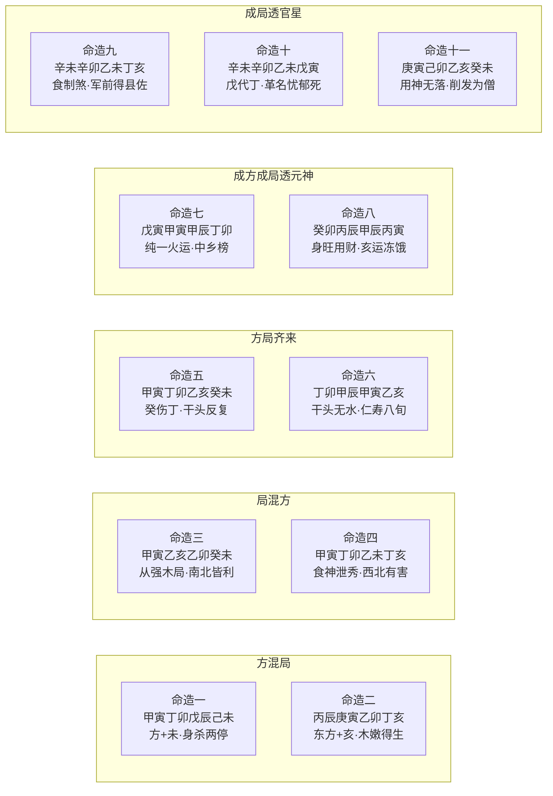

# 方局

「方」与「局」是地支组合的两种基本形态——方是季节连续的三位（如寅卯辰为东方），局是隔位的三合（如亥卯未合木局）。本篇以「方局莫混」为引，铺开方与局之间四种典型关系——方混局、局混方、方局齐来、成方/成局透元神——并用十一命造把每种关系的吉凶取舍论得相当透彻。任铁樵在原注极简的判语之上做了大量补充与反驳，使本节成为「形象」之后讨论地支整体结构的关键一节。

## 方局之辨——莫混局的真假

> 【原文】方是方兮局是局，要得方兮莫混局。

> 【原注】寅卯辰，东方也，搭一亥或卯或未，则太过，岂不为混局哉！

原注下笔极硬——寅卯辰已成方，再搭一亥（生地）、卯（旺地之重复）或未（库地），便成「方混局」之太过。原注的立场显然是「混则太过、必有所损」。

> 【任氏曰】十二支，寅卯辰东方，巳午未南方，申酉戌西方，亥子丑北方。凡三字全为成方，如寅卯辰全，其力量较胜于亥卯未木局。戊日遇寅月，见三字，俱以杀论；遇卯月，见三字，俱以官论，己日反是。遇辰月，视寅卯之势，较量轻重，以发杀，其余仿此。若只二字，则竟不取，所言方局莫混之量，愚意以为不然，且如木而见亥字，为生旺之神；见未字，为我克之财，又是木盘根之地，亦何不可？即用三合木局，则有所损累耶？至于作用，则局之用多，而方之用狭，弗以论方而别生穿凿也。

任氏对原注作了明确反驳——「方局莫混之量，愚意以为不然」。他的理由分三层：

第一层是力量上的厘清——寅卯辰三方齐全，力量胜过亥卯未三合木局。这是任氏对方与局力量对比的基本判断，与一般人「合局力大于方」的直觉相反。

第二层是字位上的辨析——以木方寅卯辰为基础，再搭一亥（木之生地）、未（我克之财、木盘根之地），并非如原注所说「太过为害」，反而各有用处。亥是生扶之神、未是财库之根。任氏在此把原注的笼统判语精确化：要看搭的是哪个字、对全局有何贡献。

第三层是「方」与「局」的功用分别——「局之用多、方之用狭」。这是说三合局的应用面广（凡有意向、皆可成局），方的成立条件却严格（必须季节连续三位齐全）。这两句反过来纠正了原注「方既成则不可混」的立场——正因为方狭、局活，方之中适当混入局之关键字，反能增添其用，而不是损减其力。

### 【命造一（原注）】甲寅 丁卯 戊辰 己未——方混局而身杀两停

> 甲寅 丁卯 戊辰 己未
>
> 戊辰 己巳 庚午 辛未 壬申 癸酉
>
> 此木方全，搭一未字为混，然无未字，则日主虚脱，且天干甲木透出作杀而不作官，必要未字日主气贯，身杀两停，名利双辉。鼎甲出身，仕至极品，可知方混局之无害也。

戊土日主，地支寅卯辰东方全，时支未——正是原注所谓「方混局」之太过。但任氏的判语恰恰相反：若无未字，戊土日主便虚脱无根。未为戊土之库，未一来，日主气贯——加上甲木透干作杀（戊以甲为偏官），方真正成「身杀两停」。

「鼎甲出身，仕至极品」是此造的注脚——按：明清「鼎甲」指殿试一甲（状元、榜眼、探花）。任氏借此明白指出——「方混局之无害也」。这是对原注「太过为害」的正面反驳。一字之混与不混，决定的不是格局太过与否，而是日主气贯与否。

### 【命造二（原注）】丙辰 庚寅 乙卯 丁亥——东方木嫩亥生为美

> 丙辰 庚寅 乙卯 丁亥
>
> 辛卯 壬辰 癸巳 甲午 乙未 丙申 丁酉
>
> 此支类东方，火明木秀，最喜丙火紧克庚金之浊，然春初木嫩，必得亥时生助。为人风流潇洒，学问渊深。丁亥生木助火，采芹攀桂；巳运南宫报捷，名高翰苑；午运拱寅合卯，采梁栋于邓林，是难哲匠，搜琳琅于瑶圃；爰藉宗工；至酉，乙木无根，金得地，冲破东方秀气，犯事落职，若无亥水化之，岂能免大凶！

乙木日主，地支辰寅卯——东方木方全；时支亥——又是木之生地。原注的眼光来看，此造混局更甚于命造一。但任氏抓住「春初木嫩」一节立判：寅卯辰虽全，初春之木气尚嫩，须得亥水之生方能挺立。又有丙火克庚金之浊（庚金为木之七杀，丙火合金可以护木）——木火相辉、秀气流行。

运程的层次很清楚——丁亥助木火便采芹（按：入泮即生员）；巳运南宫报捷、入翰林；午运寅午半合、卯午破而不破——「采梁栋于邓林」（按：邓林是上古传说的森林，喻人才之地），仕途达到顶峰；至酉运一来，金得地、冲破东方秀气，故犯事落职。任氏最后一句尤为重要——「若无亥水化之，岂能免大凶」。亥水不仅是原局生木的生地，更是后期化解酉金冲克的关键。

此造把任氏「混亥未无害」的判断推到了极致——亥不仅无害，而且是全造关键的转关之神。

## 局混方与运程取舍

> 【原文】局混方兮有纯疵，行运喜南或喜北。

> 【原注】亥卯未木局，混一寅辰，则太强，行运南北，则有纯疵，不能俱利。

原注说三合木局混入寅或辰会「太强」，运南运北各有「纯疵」（纯净与瑕疵）——意思是无论南北都难以两全。

> 【任氏曰】地支有三位相合而成局者，亥卯未木局，寅午戌火局，巳酉丑金局，申子辰水局，皆取生旺墓，一气始终也。柱中遇三支合势，吉凶之力较大。亦有取二支者，然以旺支为主，或亥卯，或卯未，皆可取，亥未次之。凡会忌冲，如亥卯未木局，杂一酉丑字于其中，而以与所冲之神紧贴，是为破局。虽冲字杂地其中，而不紧贴，或冲字处于其外而紧贴，则会局与损局瘐论，其二支会局者，以相贴为妙，逢冲即破，他字间之，亦遥隔无力，须天干领出可用。至于"局混方兮有纯疵"之说，与"方要得方莫混局"，之理相似，究其理亦无所害。见寅字是谓同气，见辰字是谓余气，又是东方湿土，能生助木神，又何损累耶？"行运南北之分须看局中意向为是。如木局，日主是甲乙，四柱纯木，不杂别字，运行南方，谓秀气流行，则纯；运行北方，谓之生助强神，无疪。或干支有火吐秀，运行南方，名利裕如；运行北方，凶灾立见。木论如此，余者可知。

任氏的回应分三段——

先从三合局的结构讲起——三合是生旺墓一气始终之势，会忌冲（与冲字紧贴则破局），二支会者必相贴方有力。这是三合局成立与破坏的基本规则。

然后落到对原注「局混方」之说的反驳——「与方要得方莫混局之理相似，究其理亦无所害」。任氏把寅与辰对亥卯未的关系厘得很清楚：寅是同气（与卯同属木）、辰是余气（东方湿土能生木）——两者皆能助木神，何来「太强」之害？

最后把运程取舍翻成基于「局中意向」的判断——纯木无杂别字，南方运是秀气流行（火泄木为秀）、北方运是生助强神（水生木），两运皆纯。若干支已有火吐秀，则南方运更助秀气而名利可裕、北方运反而克火秀气而凶灾立见。「行运南北之分须看局中意向」——这是任氏把原注「运南运北各有纯疵」的笼统判语精细化的关键。

### 【命造三（原注）】甲寅 乙亥 乙卯 癸未——从强木局南北皆利

> 甲寅 乙亥 乙卯 癸未
>
> 丙子 丁丑 戊寅 己卯 庚辰 辛巳 壬午 癸未
>
> 此木局全，混一寅字，然四柱无金，其势从强，谓深得一方秀气。少年科第，惟庚辰辛巳运，虽有癸水之化，仍不免刑丧起倒，仕路蹭蹬。至六旬外，运走壬午癸未，由县令而迁司马，履黄堂而升观察，直如扬帆大海，谁能御之！由此观之，从强之木局，东南北运皆利，惟忌西方金运克破耳。

乙木日主，地支亥卯未三合木局全，又混一寅字——按原注当为「太强」。但四柱无金，木势从强成势——这便是任氏所说「干支有火吐秀」之外的另一种格局：纯强无杂之局。

少年科第（按：少年中举）是初运水木东方之地的应验。庚辰、辛巳金运一来——虽有癸水之化（金生水、水生木），仍不免刑丧起倒，仕途蹭蹬。六旬外壬午、癸未运——北方水生木、南方午未泄秀——「履黄堂（知府）而升观察（按察使、分巡道）」。

任氏的总结尤值得注意——「从强之木局，东南北运皆利，惟忌西方金运克破耳」。这与原注「行运南北各有纯疵」截然相反。从强木局南北运皆为「纯」，唯西方金运为「疵」——「纯疵」的判定不在南北方向，而在是否克破强神。

### 【命造四（原注）】甲寅 丁卯 乙未 丁亥——食神泄秀北运反害

> 甲寅 丁卯 乙未 丁亥
>
> 戊辰 己巳 庚午 辛未 壬申 癸酉
>
> 此亦木局全，混一寅字，取丁火食神秀气，非前造从强论也。至巳运，丁火临官，登科发甲；庚午辛未，南方金败之地，不伤体用，仕途平坦；壬申，木火皆伤，破局，死于军中。前则从强，南北皆利；此则木火，西北有害。由此两造观之，局混方之无害也。

同样亥卯未木局全、混一寅字，但天干透出丁火——这造便不能按从强论，而是「木火相辉」的食神泄秀格。运至巳——丁火临官，登科发甲；庚午、辛未南方金败之地（按：庚金败于午、辛金败于未）——金来不能伤体用，仕途平坦；至壬申一交，木火皆伤——壬克丁、申冲寅——食神之秀与日主之根同时受创，破局而死于军中。

任氏把命造三与命造四对照得极清楚——「前则从强，南北皆利；此则木火，西北有害」。同样的木局混寅、同样月令卯月，只因天干透火与否，运程喜忌完全相反。这正是「行运南北之分须看局中意向」一诀的最佳印证：从强者南北皆利、有火者西北有害——意向不同，处方迥异。

任氏的总结一句——「局混方之无害也」——把对原注的反驳收得极硬。两造皆混寅而皆无害，原注「太强、不能俱利」的判语，至此彻底被翻转。

## 方局齐来与干头反复

> 【原文】若然方局一齐来，须是干头无反复。

> 【原注】木局木方全者，须要天干全顺得序，行运不背乃好。

原注说方与局俱全的格局，天干必须「全顺得序」——意思是天干五行顺生而不悖，行运不背才好。原注的判语很简，强调的是「顺」。

> 【任氏曰】方局齐来者，承上文方混局局混方之谓也。如寅卯辰兼未，亥卯未兼寅辰，巳午未兼戌，寅午戌兼巳未，申酉戌兼巳丑，巳酉丑兼申戌，亥子丑兼申辰，申子辰兼丑亥子类是也。干头无反复者，方局齐来，其气旺盛，要天干顺其气势为妙。若地支寅卯辰，日主是木，或再见亥之生，未之库，如地支亥卯未，日主是木，或再逢寅之禄、辰之余，旺之极矣，非金所能克也，须要天干有火，泄其精英，不见金水，则干头无反复，然后行土运，乃为全顺得序而不悖矣。如天干无火而仍生木，逢凶有解。苟有火而见水，或无火而见金，此谓干头反复，如得运程安顿，遇土则可止其逆水，遇火则可去其微金，亦不失为吉耳。如日干是土，别干得火，相生之谊，亦不反复；见金以寡敌众，见水生助强神则反复矣。所以制之以盛，不若化之以德，则其流行全顺矣。余仿此。

任氏先把「方局齐来」的具体形态列得很全——五行各方与其相应三合局都可对应出方局齐来的组合（如寅卯辰兼未、亥卯未兼寅辰，火土金水亦各有其例）。这种气势旺极的格局，天干的取舍变得至关重要。

「干头无反复」的精义在于——

- 正法：方局齐来已极旺，须以食伤（如木旺以火）泄其精英，又不见金水（食伤之忌神与原局之破神）——天干顺其气势，方为「全顺得序」；
- 退一步法：天干无火（无食伤）但仍是水木一气，亦能逢凶有解；
- 反复之病：有火又见水（水克火、火无法泄秀），或无火又见金（金来激旺神）——这便是「干头反复」；
- 救法：反复之病若得运程安顿（土止逆水、火去微金），尚能转吉。

任氏最后一句尤为重要——「制之以盛，不若化之以德」。化（食伤泄秀）胜于制（官杀克身）。这是把「干头无反复」的根本精神点出：方局齐来已是强势，不可硬抗，唯有顺其势而泄之化之。这一精神与前篇形象论中「独象喜行化地、化神要昌」可作互参。

### 【命造五（原注）】甲寅 丁卯 乙亥 癸未——癸伤丁秀干头反复

> 甲寅 丁卯 乙亥 癸未
>
> 戊辰 己巳 庚午 辛未 壬申 癸酉
>
> 此方局齐来，得月干丁火独透，发泄菁英，何其妙也。惜乎时干癸水透露，通根亥支，紧伤丁火秀气，谓干头反复，所以一衿尚不能博，贫乏无子。设使癸水换一火土，名利皆遂矣。

乙木日主，地支寅卯亥未——寅卯方与亥卯未局齐来，月干透丁火，本是「发泄菁英」的好局。但时干癸水通根亥支，紧贴丁火——癸克丁，秀气被伤。这正是任氏所说「有火而见水」的反复之病。

「一衿尚不能博」是说连秀才（按：「衿」指秀才的青衿）都考不上——食伤秀气被伤，文星不立。「贫乏无子」更甚——秀气全无、生路阻断。

任氏给出救方——「设使癸水换一火土，名利皆遂矣」。火土便不反复——癸为水忌，换火则化神昌、换土则止水。一字之异，「名利皆遂」与「贫乏无子」之隔。这正是「干头反复」的极端反例。

### 【命造六（原注）】丁卯 甲辰 甲寅 乙亥——曲直仁寿天年九旬

> 丁卯 甲辰 甲寅 乙亥
>
> 癸卯 壬寅 辛丑 庚子 己亥 戊戌
>
> 此亦方局齐来，干头无水，丁火秀气流行，行运不甚反悖。中乡榜，仕至州牧，子多财旺，赋性仁慈，品行端方，寿越八旬，夫妇齐眉。所谓木主仁，仁者寿，格名曲直仁寿者，信斯言也。由此两造观之，干头反复与全顺得序者，天渊也。

甲木日主，地支卯辰寅亥——方与局齐来，天干年透丁火（食伤秀气）、无水来反复。行运虽走北方，但干无水通天而支偏寒，故只算「不甚反悖」而非全顺。

「中乡榜，仕至州牧」即举人出身、官至知州（按：明清「州牧」为知州别称）。「赋性仁慈、品行端方、寿越八旬」是任氏在此造特别拈出的人格与寿数评价。他引「木主仁，仁者寿」（语本《论语·雍也》「知者乐，仁者寿」），把曲直仁寿这一格名的内涵讲透——木之曲直之气，外显为仁慈品德、内化为长寿之根。

任氏的总结一句——「干头反复与全顺得序者，天渊也」。命造五与命造六同是方局齐来、同有食伤丁火透干，唯一字之差（癸/无水），便是一者「贫乏无子」、一者「子多财旺、寿越八旬」的天渊之别。这是对原注「干头全顺得序」一句最有力的实证。

## 成方透元神的生地库地之忌

> 【原文】成方干透一元神，生地库地皆非福。

> 【原注】寅卯辰全者，日主甲乙木，则透元神，而又遇亥之生，未之库，决不发福，惟纯一火运略好。

原注的判语硬而直——成方又透元神（日主即方之气），再遇生地（亥）库地（未），决不发福，唯火运略好。原注的立场是「成方透元神已极旺、不可再助」。

> 【任氏曰】成方干透元神者，日主即方之气也。如木方日主是木，火方日主是火，即为元神透出也。生地库地皆非福者，身旺不宜再助也，然亦要看其气势，不可一例而推。成方透元神，旺可知矣，固不宜再行生地库地，以帮方也。倘年月时干不杂财官，又有劫印，谓之从强，则生地库地，亦能发福。如逢纯一火运，真谓秀气流行，名利皆遂。如年月时干，财官无气，再行生地库地之运，不但不能发福，而且刑耗多端。此屡试屡验，故志之。

任氏先承接原注的基本立场——成方透元神身旺不宜再助。但他立即开出例外——

- 从强之例：年月时干不杂财官、又有劫印（比劫与印绶皆有），便是从强格——生地库地反能发福；
- 火运之例：纯一火运，秀气流行，名利皆遂；
- 反例验证：若财官无气、再行生地库地——非但不能发福，刑耗多端。

任氏的结论是「屡试屡验，故志之」——他特别强调这一节是实测所得，可见对此一节的体会之深。这是把原注的死规矩翻成两种相反的处方：从强者助之有功、有财官无力者助之有害。

### 【命造七（原注）】戊寅 甲寅 甲辰 丁卯——透元秀气木多火炽

> 戊寅 甲寅 甲辰 丁卯
>
> 乙卯 丙辰 丁巳 戊午 己未 庚申
>
> 此成方，干透元神，四柱不杂金水，时干丁火吐秀，纯粹可观。初中行运火土，中乡榜，出宰名区；惜木多火炽，丁火不中以泄之，所以运至庚申，不能免祸。

甲木日主，地支寅辰寅卯——成方透元神，又有时干丁火吐秀，四柱不杂金水——这正是任氏所说「纯一火运、秀气流行」的格局。初中运火土，故中乡榜（举人）、出宰名区（按：「出宰」指出任县令）。

但任氏特别拈出此造的隐病——「木多火炽，丁火不中以泄之」。木气过旺，区区一丁火不足以充分泄秀，秀气有所积压。所以一交庚申运（西方金运冲破东方木方），便不能免祸。

此造对任氏「成方透元神、纯一火运略好」的判语作了细腻的修正——纯一火运虽好，若火力不及泄木之全部，西方金运仍会触其旺神。生地库地之忌之外，原局食伤的强度同样决定着运程承受力。

### 【命造八（原注）】癸卯 丙辰 甲辰 丙寅——身旺用财亥运冻饿

> 癸卯 丙辰 甲辰 丙寅
>
> 乙卯 甲寅 癸丑 壬子 辛亥 庚戌
>
> 此造财旺提纲，丙食生助，当以财星为用，丙火为喜，癸水为忌。身旺用财，遗业十余万。初年水木运，一败如灰：至辛亥运，火绝木生，水临旺，冻饿而死。以此观之，不论成方成局，必先察财官之势。若财旺提纲，则以财为用；或官得财助，则以官为用；如财不通月支，官无旺财生，必须弃其寡而从其众也。余皆仿此。

甲木日主，地支卯辰辰寅——本是成方透元神（甲木为东方之元神）。但任氏的判语让人意外：他不按「成方透元神身旺无疑」走，而是抓住辰为「财旺提纲」（辰中藏戊为偏财）这一关键——丙火食神生助财星——故以「财星为用，丙火为喜，癸水为忌」。

「身旺用财，遗业十余万」是初年财运的应验。初年水木运（乙卯、甲寅）——水生木、木盛而财被劫，「一败如灰」；至辛亥运——「火绝木生、水临旺」（按：火被亥水克绝、木得亥水生扶、水气得禄）——食神丙火被克尽，财源彻底断绝，遂冻饿而死。

任氏的总结尤为重要——「不论成方成局，必先察财官之势」。这一句把成方透元神的判定从「是否再行生地库地」推到了更高的层级——必先看财官之势：财官旺提纲则以财官为用，财官无力则弃寡从众。这是把任氏「不可一例而推」的开放立场推到极致——成方透元神之吉凶，不在格局是否成立，而在用神是否对路。

## 成局透官星的左右支援

> 【原文】成局干透一官星，左边右边空碌碌。

> 【原注】甲乙日遇亥卯未全者，庚辛乃木之官也，又见左辰右寅，则名利无成。甲乙日单遇庚辛，则亦无成。

原注的判语转向另一方向——三合局已成，日主即局之元神，天干再透官星（官杀），左右又有方之同气（左辰右寅），官星便如孤悬之针——名利无成。

> 【任氏曰】如地支会木局，日主元神透出，别干见辛之官、庚之杀，虚脱无气，即余干有土，土亦休囚，难以生金，须地支有一申酉丑字为美。若无申酉丑，反加之寅辰字，则木势愈盛，金势愈衰矣，故碌碌终身，名利无成也。若得岁运去其官星，亦可发达，必要柱中先见食伤，然后岁运去净官煞之根，名利遂矣。本局如此，余局仿此论之可也。

任氏对原注的处理是细化而非反驳——把「左右空碌碌」的内在机制讲清楚。三合木局成势，官星（庚辛金）孤透干头便已虚脱；纵有土星生金，土在木旺月令也是休囚之地，难以生金；地支须有申酉丑（金之根库）方为美。若反而加寅辰（同气、余气），木势愈盛而金势愈衰。

任氏的救法分两步——

- 第一步：柱中先见食伤（火）——这是为日后「去官」铺路；
- 第二步：岁运去净官杀之根——名利方遂。

为何要「先见食伤」再「去官」？因为没有食伤，去官只是去一个虚浮的字，去无可去；先有食伤护身、化木势、敌官星，再加岁运去其根，方是有序的救法。这一处方与前节「干头无反复」的「化之以德」一脉相承。

### 【命造九（原注）】辛未 辛卯 乙未 丁亥——透官化煞反成贵

> 辛未 辛卯 乙未 丁亥
>
> 庚寅 己丑 戊子 丁亥 丙戌 乙酉
>
> 此乙木归垣，亥卯未全，木势旺盛，金气虚脱，最喜时透丁火，制煞为用。故初运土金之乡，奔驰未遇；至于亥运，生木制煞，军前效力，得县佐；丙戌运中帮丁克辛，升县令。此所谓强众而敌寡，势在去其寡，非煞旺宜制而推也。至酉运，煞逢禄旺，冲破木局不禄。

乙木日主，地支亥卯未三合木局，年月两辛——正合「成局干透一官星」之态（按：乙以辛为偏官/七煞）。但此造关键在于时干透丁火——食神制杀——这是任氏所说「柱中先见食伤」的关键条件已具。

初运土金之地（庚寅、己丑），土生金、金党杀，奔驰未遇；至丁亥运——亥水生木制煞（按：亥助木势压煞），得县佐；丙戌运——「帮丁克辛」（丙火帮丁、戌中辛被丙制），升县令。

任氏的判语尤值得注意——「强众而敌寡，势在去其寡，非煞旺宜制而推也」。这一句把此造与寻常「煞旺宜制」格区分开——此处是「寡敌不过众」的格局，不是煞旺需制，而是煞寡需去。一字之差，处方迥异。至酉运——西方金旺地，冲破亥卯未木局，煞反逢禄——遂不禄。

### 【命造十（原注）】辛未 辛卯 乙未 戊寅——寅时无亥反成破败

> 辛未 辛卯 乙未 戊寅
>
> 庚寅 己丑 戊子 丁亥 丙戌 乙酉
>
> 此乙木归垣，虽无全会，然寅时比亥之力量胜数倍矣。以大象观之，局中三土两金，似乎财生煞旺，不知卯旺提纲，支中皆木之根旺，非金之在地也。初运土金之乡，采芹食廪，家业丰裕：一交丁亥，制煞会局，刑妻克子，破耗异常，犯事革名，忧郁而死。

与命造九对照——仅时支一字之差（亥→寅）。乙木日主、年月两辛、月卯——结构相同。寅时之力胜亥时数倍（按：寅是乙之根、亥只是水生木），但缺了亥便缺了「亥卯未三合」之局，且时干换戊（与丁不同）——食伤之火消失。

初运土金之地——「采芹食廪」（按：「采芹」指秀才入泮、「食廪」指补廪膳生员）——任氏认为这是因为支中木根旺，初年虽走土金，土金不能真正克木。家业丰裕是这阶段的应验。

但一交丁亥——「制煞会局」（丁火制辛、亥来与卯未会木局），木势暴起反夺其妻子——刑妻克子、破耗异常、犯事革名、忧郁而死。

与命造九一比照——同样亥卯未结构、同样辛辛透干，命造九因丁火透出而能「军前效力、得县佐」，命造十因换为戊土而「忧郁而死」。任氏「先见食伤、再去官煞」的两步处方至此完整呈现：少一步皆不能成。

### 【命造十一（原注）】庚寅 己卯 乙亥 癸未——五学皆败为僧而终

> 庚寅 己卯 乙亥 癸未
>
> 庚辰 辛巳 壬午 癸未 甲申 乙酉
>
> 此造正合本文成局，干透官星，左右皆空，四柱一无情致，用财则财会劫局，用官则官临绝地，用神无所着落，为人少恒一之志，多迁变之心，以致家业破耗。读书未就，而学医；医又不就，又学堪舆；自以为仲景再世，杨赖复生，而人终不信；又学巫，学易，学命，所学甚多，不能尽述。不但一无所就，而且财散人离，削发为僧矣。

乙木日主，地支寅卯亥未——亥卯未木局成、又混寅；年干透庚（七杀）——正是「成局干透一官星，左边右边空碌碌」原文最精准的写照。

任氏分析此造的病在于无所着落——

- 用财：财（己土）会劫局（按：己土被卯木所克、又会成木局——财不能立）；
- 用官：官（庚金）临绝地（按：庚在寅为绝），又无食伤护身去官——孤透虚脱。

故用神无所着落。落实到人事，便是「少恒一之志、多迁变之心」——读书不成转学医、医不成转堪舆、再转巫易命——「所学甚多，不能尽述」。任氏特别拈出此造的心性论断——这是命盘结构没有定盘星（用神无落）的直接外应：心无所主、事无所成。最终「财散人离、削发为僧」。

任氏此造的笔墨之重，是因为它最完整地展现了「成局透官星而左右空碌碌」之命的内在机制——不仅是事业上的无成，而且是心性上的飘摇。无食伤之化、无地支之根、无运程之救——便是这一节的反面铁证。

## 十一命造四组对照

各组对照之眼：方混局二造皆有「未」或「亥」一气相生而无忌；局混方二造同为亥卯未加寅，因天干是否透火而处方迥异；方局齐来二造同人异命，悬于「时干」一字；成方成局透元神二造则展示同是「旺」却因财官审察不同而吉凶悬隔；成局透官星三造演示「去寡」与「无食伤化、无地支根」三重机制的各自下场。

---

本篇为上篇通神论中专论地支方与局两类组合的核心一章，承前篇「形象」之后转入地支结构的精细考察。任铁樵以十一命造把方与局的四种典型关系一一论证——方混局、局混方、方局齐来、成方成局透元神——并对原注的几条硬性判语作了系统性的反驳与修正。本节方法论的核心在三处：一是「方与局力量的对比与功用差异」（方狭局活、方力胜局），二是「干头反复与化之以德」（化神昌于制神），三是「成方成局透元神时的财官审察」（必先察财官之势，不可一例而推）。这些方法论的关键，都不是从原注硬规矩中读出来的，而是从十一命造的对照实测中归纳出来的——这正是任氏注法的根本特色。
