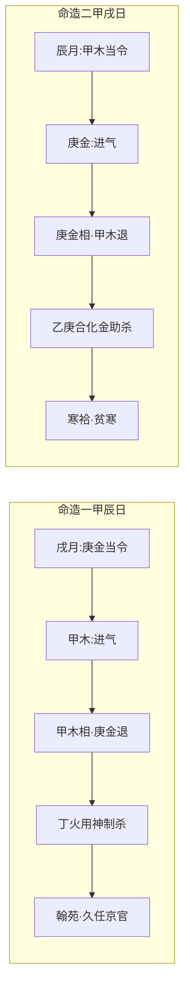

# 理气

## 「理承气行岂有常」——句式与用字

> 【原文】理承气行岂有常，进兮退兮宜抑扬。

本篇正文十字，以两个反诘句立论。先看句式：「理承气行岂有常」是反诘——「岂有常」三字直接否定了「理气有固定规律」这一潜在预设；「进兮退兮宜抑扬」是承接——既然无常，那进退便是常态，学者应当「抑扬其浅深」。

「理承气行」四字是本篇的核心命题。「气」是流动的五行之气，「理」是气中承载的规律。「承」字最重——不是「理生气」「理驭气」，而是「理承气」——理是气的承载者，气是理的流动者。这一字之差，把命理学的本体论点明了：不是先有一套固定不变的「理」等着气去填充，而是气在流动中自呈其理，理不能脱离气而独存。

「进兮退兮」用楚辞式的「兮」字——这种古雅的句式，正与全书的复古风格相合。进与退不是二选一，而是同一股气的两面：进之极便是退之机，退之极便是进之机。这与《周易·系辞》「一阖一辟谓之变，往来不穷谓之通」是同一思路。

「抑扬」二字最妙——「抑」是压抑、收敛、潜藏，「扬」是发扬、舒展、上达。抑扬之间，便是用神取用的浅深——用神浅取则扬、用神深取则抑。这是任铁樵所注「宜抑扬其浅深」的实操维度。

## 阖关往来皆是气

> 【原注】阖关往来皆是气，而理行乎其间。行之始而进，进之极则为退之机，如三月之甲木是也；行之盛而退，退之极则为进之机，如九月之甲木是也。学者宜抑扬其浅深，斯可以言命也。

原注顺接原文，从宇宙论角度把「理气」再申一遍——「阖关往来皆是气」。「阖」「关」二字出自《周易·系辞》「一阖一辟谓之变」「阖户谓之坤，辟户谓之乾」。阖是闭合（收藏、归藏），关是开启（释放、舒展）——「阖关往来」便是气的一开一合、一收一放。注家从《系辞》取喻，把命理学的「气」直接接到《易传》的宇宙论上。

紧接着给出两个时令的实例——

- **三月之甲木「行之始而进」**：三月（辰月）甲木由衰转旺，是「进之始」；
- **九月之甲木「行之盛而退」**：九月（戌月）甲木由盛转衰，是「退之盛」。

「进之极则为退之机」「退之极则为进之机」——这是注家给出的核心命题，与《周易》「物极必反」义理相通。

末句「学者宜抑扬其浅深，斯可以言命也」——「斯可以言命也」的反诘意味是：若不能「抑扬浅深」，便不足与言命。这是原注给「抑扬」二字的具体落地：命学不是死记旺衰表，而是要「抑扬」五行进退的「浅深」——同一五行在三月与九月，浅深天壤。

## 进退四态——相妙于旺，休甚乎囚

> 【任氏曰】进退之机，不可不知也。非长生为旺，死绝为衰，必当审明理气之进退，庶得衰旺之真机矣。

任铁樵注一开篇便破一个流弊——「非长生为旺，死绝为衰」——这是命学初学者最常犯的毛病：把「长生」直接当作「旺」，把「死绝」直接当作「衰」。任氏明言：不能这么简单判定，必须「审明理气之进退」。

紧接着任氏给出五行旺衰的四态——

| 状态 | 释义 | 进退之机 |
| --- | --- | --- |
| **相（将来者进）** | 将来者进，是谓相——气方来而未盛 | 进 |
| **旺（进而当令）** | 进而当令，是谓旺——气极盛而当令 | 极盛 |
| **休（功成者退）** | 功成者退，是谓休——气已过盛而退 | 退 |
| **囚（退而无气）** | 退而无气，是谓囚——气已退尽而无余 | 极衰 |

任氏接着给日主、喜神、凶煞、忌神各定其宜——

- **日主、喜神**：宜旺相，不宜休囚；
- **凶煞、忌神**：宜休囚，不宜旺相。

这与一般命理口诀无异，但任氏接下来两段才是核心——

> **「然相妙于旺，旺则极盛之物，其退反速，相则方长之气，其进无涯也。」**

——「相」比「旺」更妙。旺是极盛之物，物极必反，其退反速；相是方长之气，正在上升期，其进无涯。任氏这一判法非常关键：命学上以「相」为用神往往比以「旺」为用神更稳更长——旺极则退速，相方则进长。

> **「休甚乎囚，囚则既极之势，必将渐生；休则方退之气，未能遽复也。」**

——「休」比「囚」更差。囚是既极之势，反将渐生（物极必反，穷则变）；休是方退之气，未能遽复（刚刚开始退，要恢复很难）。这一判法与上段对应：相妙于旺、休甚乎囚——这是任氏对「进退」之机的精细分级。

任氏相较原注的推进：原注立「进之极则为退之机」的命题，任氏则把「进退」具体化为「相/旺/休/囚」四态，并对四态作精细比较（相妙于旺、休甚乎囚）。这一推进让「进退之机」从抽象命题落到可操作的分级判法。

任氏文末说「爰举两造为例」——下面紧接着给出两个甲木命造做实证。

## 命造一：丁亥 庚戌 甲辰 壬申

> 【任氏曰】丁亥 庚戌 甲辰 壬申
>
> 己酉 戊申 丁未 丙午 乙巳 甲辰 癸卯 壬寅
>
> 甲木休困已极，庚金禄旺克之，一点丁火，难以相对，加之两财生杀，似乎杀重身轻，不知九月甲木进气，壬水贴身相生，不伤丁火。丁火虽弱，通根身库，戌乃燥土，火之本根，辰乃湿土，木之余气。天干一生一制，地支又遇长生，四柱生化有情，五行不争不妒。至丁运科甲连登，用火敌杀明矣。虽久任京官，而宦资丰存，皆一路南方运也。

【命造一（任氏曰第2段）】丁亥 庚戌 甲辰 壬申

- **日主**：甲木。生于戌月（九月），戌为火库、秋金当令之时。
- **生克结构**：干透丁火（伤官）、庚金（七煞）、壬水（偏印）；支有亥（壬水之禄）、戌（火库）、辰（癸水之库）、申（庚金之禄）。
- **表面凶象**：「甲木休困已极，庚金禄旺克之」——戌月甲木本已休囚（秋令金旺克木），庚金又透出当令克之；「一点丁火，难以相对」——丁火虽透，但单丁难敌庚金之旺；「两财生杀」——戌中藏戊土（偏财）、辰中藏戊土（偏财），两财生庚金（七煞）。
- **表面结论**：似乎「杀重身轻」——七煞庚金当令旺而日主甲木休囚弱。

任氏的格局判定——

- **「不知九月甲木进气」**——这是本造的关键判语。九月（戌月）虽是秋金当令，但甲木有「进气」之机——甲木长生在亥，九月甲木虽处休囚，但已开始「进气」，向着亥月（十月）长生之位进发。这是「相」的精微之处：甲木虽不在最旺之时，但已在「相」的上升期，「其进无涯」。
- **「壬水贴身相生」**——壬水在时干，紧贴日主甲木，印绶贴身生身，给休囚之甲木一线生机。
- **「不伤丁火」**——壬水虽能克丁火（印绶克伤官），但壬水坐申（申为壬水之禄），水势不弱，不至于彻底克灭丁火。这是「天干一生一制」——壬水生甲木、克丁火，一制之间，护了日主、不绝伤官。
- **「丁火虽弱，通根身库」**——丁火虽在天干一点，但通根于戌（戌为火库，丁火之根在戌）。这与「壬癸水通根于申亥」是同一思路：弱神要通根方有力。
- **「戌乃燥土，火之本根，辰乃湿土，木之余气」**——任氏进一步细化戌辰两库：戌为燥土（秋金之余气变燥）、是火之本根；辰为湿土（春木之余气变湿）、是木之余气。两个库都对本造有间接助益。
- **「天干一生一制，地支又遇长生」**——天干壬水生甲木、克丁火（一制），地支亥为壬水之禄、申为庚金之禄、辰戌为库，但亥中藏甲木（甲木之长生在亥），这是甲木在地支的「长生」之机——「地支又遇长生」。
- **「四柱生化有情，五行不争不妒」**——这是任氏对此造的总体定调：四柱之间生化流通有情，五行不争不妒。

任氏的应期——

- **「至丁运科甲连登」**——大运至丁未（地支未中藏丁火），丁火运到，伤官制煞（丁火制庚金），科甲连登（考中进士、仕途顺畅）。
- **「用火敌杀明矣」**——丁火是用神，制庚金（七煞）之敌。「敌」字用得精当——七煞本为「敌」日主之煞，伤官制之、护身有力。
- **「虽久任京官，而宦资丰存，皆一路南方运也」**——命主长期任京官（中央官）、财资丰足，皆因自丁运起一路行南方火运（丁未、丙午、乙巳），南方火运助丁火用神。

任氏的格局判定精彩之处——表面「杀重身轻」实为「杀有制、身有扶」：壬水扶身（不伤丁火）、丁火制煞（不伤日主）、亥为甲木长生（进气之机）。三个支点撑住全局。

## 命造二：乙亥 庚辰 甲戌 壬申

> 【任氏曰】乙亥 庚辰 甲戌 壬申
>
> 己卯 戊寅 丁丑 丙子 乙亥 甲戌 癸酉 壬申
>
> 此与前大同小异。以俗论之，「甲以乙妹妻庚，凶为吉兆」，含合忘冲，较之前造更佳，何彼则翰苑，此则寒袷？不知乙庚合而化金，反助其暴。彼则甲辰，辰乃湿土，能生木，此则甲戌，戌燥土不能生木；彼则申辰拱化，此则申戌生杀；彼则甲木进气，而庚金退，此则庚金进气，而甲木退。推此两造，天渊之隔，进退之机，不可不知也。

【命造二（任氏曰第3段）】乙亥 庚辰 甲戌 壬申

- **日主**：甲木。生于辰月（三月），辰为湿土。
- **生克结构**：干透乙木（劫财）、庚金（七煞）、壬水（偏印）；支有亥（壬水之禄）、辰（湿土）、戌（燥土）、申（庚金之禄）。
- **俗论**：「甲以乙妹妻庚，凶为吉兆，含合忘冲」——俗以甲乙木为兄弟、庚金为官（七煞），乙庚合金（乙为甲之妹，嫁庚金为妻），「含合忘冲」——乙庚合则庚金不冲克甲木，似为吉兆。俗论因此判此造「较之前造更佳」。

任氏的格局判定（直接反驳俗论）——

- **「乙庚合而化金，反助其暴」**——乙庚合化金（须辰戌丑未月或金旺之地方可化），化金则庚金更旺，反助七煞之暴。
- **「彼则甲辰，辰乃湿土，能生木，此则甲戌，戌燥土不能生木」**——两造同日主（甲木），但日支不同：前造是甲辰（辰为湿土，含水生木），后造是甲戌（戌为燥土，秋金之余气，无水生木）。这一字之差，导致戌不能生甲木，反而脆金生金。
- **「彼则申辰拱化，此则申戌生杀」**——前造地支申辰半会水局（水气增旺），后造地支申戌，戌为火库、申为金，相生金（戌中藏戊土、辛金、丁火，其中辛金与申金相涵，反助金势）——「申戌生杀」。
- **「彼则甲木进气，而庚金退；此则庚金进气，而甲木退」**——这是两造最核心的差异：
  - 前造（甲辰日主、戌月生）：戌月庚金当令，但甲木有「进气」之机（戌后是亥，甲木长生在亥），庚金已开始退势——「甲木进气，庚金退」；
  - 后造（甲戌日主、辰月生）：辰月甲木当令，但庚金有「进气」之机（辰后是巳，金长生在巳），庚金已开始上升势——「庚金进气，甲木退」。

任氏最后一句是压轴定论——

> **「推此两造，天渊之隔，进退之机，不可不知也。」**

——两造「大同小异」（同日主、同有庚壬、支有申亥），但「天渊之隔」——一个翰苑之贵（科甲连登、久任京官），一个寒袷之贫（粗布衣裘、家境贫寒）。差异不在表面干支，而在「进退之机」——甲木与庚金谁在「进气」、谁在「退气」。

任氏的判法精微——他不停留在「辰月甲木当令、庚金休囚」的表面，而是看到辰月甲木当令时，庚金也已经在「进气」（向金长生巳进发），是「相」的上升期；戌月庚金当令时，甲木也已经在「进气」（向木长生亥进发），是「相」的上升期。两造同为「相」，但所「相」者不同——前造是甲木「相」而庚金「退」，后造是庚金「相」而甲木「退」。这正是任氏所论的「相妙于旺、休甚乎囚」——前造甲木虽不当令（戌月木不当令），但「相」在「进气」，可成贵格；后造甲木虽当令（辰月木当令），但庚金「相」在「进气」，反成杀重。

【命造一 vs 命造二】同月（戌月）还是同月（辰月），同日主、同煞、同印——两造看似结构相同，进退之机却有天壤之别。任氏用两造做「进退之机」的实证，意在告诉读者：命学不是看表面的当令不当令，而是看「进退之机」——五行处于「相」的上升期还是「休」的下降期，这才是判断旺衰的关键。

## 命造一与命造二之对照

下表把两造的关键差异并列出来：

| 项目 | 命造一（甲辰日·戌月） | 命造二（甲戌日·辰月） |
| --- | --- | --- |
| 日支 | 甲辰（湿土，能生木） | 甲戌（燥土，不能生木） |
| 月令 | 戌月（火库，秋金当令） | 辰月（湿土，春木当令） |
| 煞（庚金） | 戌月庚金当令，但甲木有进气 | 辰月庚金不当令，但庚金有进气 |
| 身（甲木） | 甲木休囚，但有进气 | 甲木当令，但庚金也在进气 |
| 乙庚关系 | 无乙，庚金无合绊 | 有乙，乙庚合化金反助杀 |
| 申辰/申戌 | 申辰拱水局（水气增旺） | 申戌生金（助金势） |
| 格局判定 | 杀有制、身有扶，可成贵 | 杀无制、身虽旺，但庚金进气 |
| 现实应事 | 翰苑、久任京官、宦资丰存 | 寒袷、贫寒 |
| 用神 | 丁火（伤官制杀） | 难以取用（杀旺无制） |

## 进退之机——本篇要旨

本篇提出「理承气行岂有常」的核心命题。原注立「进之极为退之机、退之极为进之机」的辩证之理；任氏则进一步把「进退」具体化为「相/旺/休/囚」四态，并给出「相妙于旺、休甚乎囚」的精细判法。

任氏以两造实证「进退之机」——

- **命造一**：甲木虽不当令（戌月木不当令），但「相」在「进气」（向亥月长生进发），庚金虽当令但已在「退气」（向冬水进发）——故甲木得扶、丁火得制煞，可成贵格。
- **命造二**：甲木虽当令（辰月木当令），但庚金「相」在「进气」（向巳月长生进发），甲木反而「退气」（辰月木虽旺，但辰为春末，木已开始向退气走）——故庚金得助、乙庚合化反助杀，难成贵格。

两造同月（戌月 vs 辰月）相反、同煞（庚金）相同、同印（壬水）相同——但因日主所处月令的「进退」不同，结果天壤之别。

任氏最后一句的压轴定论——「推此两造，天渊之隔，进退之机，不可不知也」——既点出本篇核心，又回应开篇「岂有常」之反诘：「理」不在表面干支，「理」在「气」的进退之机。

**本篇为《滴天髓》上篇通神论系列之一，专论「理气进退」——亦即命学辨析五行旺衰的精微方法。** 任铁樵一面立「相妙于旺、休甚乎囚」的精细分级，一面以甲辰、甲戌两造实证「进退之机」的具体应用。任氏以「相妙于旺、休甚乎囚」一句，把命学从「静态旺衰表」推进到「动态进退论」——命理之要，不在死记旺衰，而在辨识「气」之进退深浅。
