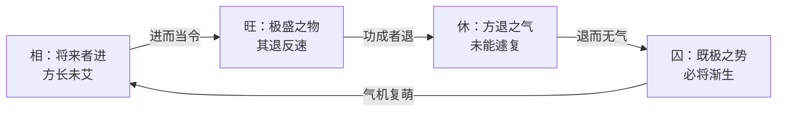

## 理与气：命理之纲

此篇以"理气"二字命题，开篇即立总纲：

> 理承气行岂有常，进兮退兮宜抑扬。

按文意，"理"与"气"乃命理学之两根本范畴。气者，五行流转之质；理者，气中所固有之条理与节律。"承"字明示二者关系——理依气而行，非气外别有一理；然气之运行绝非恒常，故有进退、抑扬之变。

此两句是全篇眼目：命理之要，不在死定格套，而在观其"进退"之机、施其"抑扬"之断。后文原注、任氏疏解、两造比对，皆是此"进退抑扬"四字之具体展开。

## 阖辟往来：进退之初义

> 【原注】阖辟往来皆是气，而理行乎其间。行之始而进，进之极则为退之机，如三月之甲木是也；行之盛而退，退之极则为进之机，如九月之甲木是也。学者宜抑扬其浅深，斯可以言命也。

原注先用"阖辟往来"四字点出气之动态本性——气如门户之开合，无时无刻不在运动；而理即寓于这往来阖辟之中，是气运行所遵循的内在节律。

继以木气为例，论"进退"之机：
- 三月（辰月）之甲木：木气初萌，正当伸展之时，是"进"之始
- 九月（戌月）之甲木：木气已盛，盛极而衰，是"退"之机

此处要特别留意：原注并未断言三月甲木为"旺"、九月甲木为"衰"——而是说三月是"进"之始，九月是"退"之端倪。"进"与"退"是气的运动方向，非静止之强弱判断。这正是后文任氏"相妙于旺"之先声。

末句"抑扬其浅深"，是方法论提示：命理之学非法术，乃要根据气之进退浅深，加以人为之权衡取舍——该扬者扬之，该抑者抑之。

## 旺相休囚：四态之辨

> 【任氏曰】进退之机，不可不知也。
>
> 非长生为旺，死绝为衰，必当审明理气之进退，庶得衰旺之真机矣。

任氏开宗明义：欲知进退之机，必先破一常见误解——即以"长生为旺、死绝为衰"的简单对应。

按传统五行十二宫之说，长生、帝旺为"旺"，死、绝为"衰"，似乎一目了然。然任氏指出，此乃死执长生十二宫之表，未审"理气之进退"——五行之气在四时中有其自身进退之节律，仅看长生十二宫则失之胶柱。

> 凡五行旺相休囚，按四季而定之。将来者进，是谓相；进而当令，是谓旺；功成者退，是谓休；退而无气，是谓囚。

任氏重新界定"旺相休囚"四态，独以"进退"为纲：

```mermaid
graph LR
    A["相：将来者进<br/>方长未艾"] -->|进而当令| B["旺：极盛之物<br/>其退反速"]
    B -->|功成者退| C["休：方退之气<br/>未能遽复"]
    C -->|退而无气| D["囚：既极之势<br/>必将渐生"]
    D -->|气机复萌| A
```

此一界定突破传统以月令单一判旺衰之法，将五行之气视为"将来—当令—功成—退尽"之动态过程。换言之，"旺"虽是气的顶峰，但已是"进而当令"之时；而"相"虽不及"旺"盛，却是"将来者进"——方长之气，进无止境。

## 喜忌宜忌：进退之用

> 须辨其旺相休囚，以知其进退之机。为日主，为喜神，宜旺相，不宜休囚；为凶煞，为忌神，宜休囚，不宜旺相。

此节为方法论之落地：辨明四态后，落到具体命局之用。

- 若某五行在命局中为**日主**（命主自身）或**喜神**（所喜用之神）：宜处旺相——气方进或正盛，意味着命主或喜用神有持续上升之力
- 若某五行在命局中为**凶煞**（如七杀、伤官见官等不利之神）或**忌神**（所忌讳之神）：宜处休囚——气已退或无气，则凶煞忌神无力作恶

此一原则看似平实，实为子平"扶抑法"之根基——日主弱则扶之，喜神弱则助之，忌神旺则制之。然任氏此处之精微在于：不单论"旺衰"，而将"进退"引入——即使某五行当前偏弱，若其"气方来"（即处于"相"态），则前途可期；若"气已退"（处于"休"态），则虽暂存亦将衰。

## 相妙于旺，休甚乎囚

> 然相妙于旺，旺则极盛之物，其退反速，相则方长之气，其进无涯也。休甚乎囚，囚则既极之势，必将渐生；休则方退之气，未能遽复也。
>
> 此理气进退之正论也，爰举两造为例。

此为任氏本篇最精辟之论，亦是理解全篇之关键。

先论"相妙于旺"：
- "旺"虽极盛，但盛极必衰——"其退反速"
- "相"虽不及"旺"盛，却是方长之气——"其进无涯"
- 故曰"相妙于旺"——相态优于旺态，因为相有未来，旺已临顶点

再论"休甚乎囚"：
- "囚"虽极衰，但已至极——"必将渐生"（气已尽则将复生）
- "休"虽不及"囚"衰，却是方退之气——"未能遽复"（尚在退势中，未到转折点）
- 故曰"休甚乎囚"——休态比囚态更不利，因为囚有转机，休尚无望

这两句蕴含着极为深邃之辩证思想：盛极转衰、衰极转盛，是气之必然规律；而判断吉凶不能仅看当下之旺衰，须观其"进退之势"——正在前进的弱胜过已达顶峰的强，正在退却的强不如已至低谷的弱。

此处义理与先秦哲学中"反者道之动""亢龙有悔"诸命题相发明——盛极而衰、否极泰来，是华夏传统宇宙观之根本识见。任氏将此识见注入命理之学，使"旺相休囚"不再只是死板之四类划分，而成为动态流转之四种态势。

末句"爰举两造为例"，将理论落地于实例——以下两造皆甲木日元九月所生，看似相似，实则因进气退气之别而有天壤之分。

## 命造一：九月甲木之进气

> 丁亥 庚戌 甲辰 壬申
>
> 己酉 戊申 丁未 丙午 乙巳 甲辰 癸卯 壬寅

此造日主甲木，生于九月戌月，天干透出丁火、庚金、壬水，地支为亥、戌、辰、申。

乍看此造：
- 甲木生于九月，木气已过，看似"休囚"
- 庚金透出且通根于申（庚金在申为"禄"——临官之地，最为强旺），杀星有力
- 壬水透出，丁火亦透，水火木三神并透，关系纠缠

任氏批断关键在"进气"二字——九月甲木，按原注所论，是"退之机"；然任氏进一步指出：九月乃**甲木进气**之时，非真个休囚已极。

> 甲木休囚已极，庚金禄旺克之，一点丁火，难以相对，加以两财生杀，似乎杀重身轻。

任氏先依俗见立靶：若按一般看法，九月甲木休囚、庚金当令、又有戌辰中财星（戊土为甲木偏财）生杀——这正是"杀重身轻"（即代表命主的日主甲木弱而克身的七杀庚金强）的凶象，似乎难以抵挡。

> 不知九月甲木进气，壬水贴身相生，不伤丁火。

然任氏指明关键：九月甲木虽看似休囚，实为"进气"——正处于"相"的状态，方来未盛却持续上升。而壬水"贴身"（紧贴日主甲木，在天干与之相邻），化泄庚金之杀（庚金生壬水，壬水生甲木，形成"通关"——即用印化杀生身的连续相生），同时不伤丁火——丁壬虽相合（丁壬合木），但此造中丁火与壬水之间隔着庚金，不成紧贴之合，且壬水化金生木之力强于合木之倾向。

> 丁火虽弱，通根火库，戌乃燥土，火之本根，辰乃湿土，木之余气。

继续深论：丁火虽为一点，力量看似单薄，但丁火有根——戌为火库（戌中藏丁火、戊土、辛金，对火而言是蓄藏之地），是火之根本；辰中余气（乙木）亦可助木。

> 天干一生一制，地支又遇长生，四柱生化有情，五行不争不妒。

总结此造结构之妙：
- 天干壬水化杀生身（庚→壬→甲），丁火制杀（丁火克庚金），一生一制，配合有情
- 地支亥为甲木长生之地，辰为湿土可生木，申为庚金禄旺但被辰中癸水化泄——地支配置亦佳
- 五行流转有序，各归其位，不相争不相妒

> 至丁运科甲连登，用火敌杀明矣。

行至丁运（丁火大运）时，丁火得力，制杀（庚金）有力——杀被制则不伤身，正是读书中举（科甲连登）的吉运。命理中"用神"者，即命局中最能平衡五行、护卫日主之神。此造用神为火，以火敌杀（用食伤制杀），是子平"用神"理论之典型示范。

> 虽久任京官，而宦资丰存，皆一路南方运也。

此造后运一路南方（南方属火），火旺制杀，故不仅科甲显达，且仕途平稳、俸禄丰厚。

## 命造二：甲木退气之异

> 乙亥 庚辰 甲戌 壬申
>
> 己卯 戊寅 丁丑 丙子 乙亥 甲戌 癸酉 壬申

此造日主同为甲木，亦生于戌月，天干透出乙木、庚金、壬水，地支为亥、辰、戌、申。

乍看此造与命造一极为相似：同为甲木日元、九月所生、庚金七杀透出、壬水透出。一般俗见或以为"甲以乙妹妻庚，凶为吉兆"（甲乙为同根兄妹，乙木与庚金合，是"以亲制敌"之象——用与日主同类的劫财去合住七杀），且乙庚合可化解庚金之杀冲，似乎比命造一更佳。

任氏驳俗见，逐条辨析此造之退：

> 不知乙庚合而化金，反助其暴。

第一层关键：乙庚合而化金。乙木与庚金相合，在某些条件下可"合化"——若条件成立而化为金，则乙木反成金之助，庚金得乙木之合而气势更盛，是"助纣为虐"——劫财非但不制杀，反被杀同化。这是与命造一的天壤之别。

> 彼则甲辰，辰乃湿土，能生木，此则甲戌，戌燥土不能生木。

第二层关键：地支辰戌之异。命造一是甲辰日，辰为湿土，能涵养甲木之根；命造二是甲戌日，戌为燥土，不仅不能生木，反可能燥木之根——戌中藏戊土、辛金、丁火，对甲木而言并非良好根基（戌为火库、辛金之墓、戊土之位，独少木之气息）。

> 彼则申辰拱化，此则申戌生杀。

第三层关键：地支组合之别。命造一申辰有暗拱水局之意（申子辰合水，此处虽缺子，但申辰相邻有拱合之势），可化杀（庚金）生身；命造二申戌相配，戌中藏火本可制杀，但戌为九月当令之土，申金仍处本禄之旺（庚金在申为本气之地），申戌相配反成金火交战、杀星得助之局。

> 彼则甲木进气，而庚金退，此则庚金进气，而甲木退。

第四层关键，亦是最核心者——进退之势完全相反：

| 比较项 | 命造一（甲辰日） | 命造二（甲戌日） |
|--------|----------------|----------------|
| 甲木气运 | **进气**（方生方长，有未来） | **退气**（已过当令，无前途） |
| 庚金气运 | **退气**（虽当令而将退） | **进气**（正方来而未艾） |
| 日支根基 | 辰为湿土可生木 | 戌为燥土不能生木 |
| 配合之势 | 一进一退，吉 | 两俱退气，凶 |

虽然两造都生于九月，看似甲木休囚、庚金当令，但因日支不同（辰与戌）、天干配合不同（丁火与乙木），导致两造中甲庚之进退之势完全相反——命造一是甲进庚退，命造二是庚进甲退。

> 推此两造，天渊之隔，进退之机，不可不知也。

任氏最后点明：此两造表面相似而实际吉凶天壤，正因进退之机不同。命理之学，断不可仅看月令表面之旺衰，必须深察五行之"进退之势"。

## 进退之机：全篇之旨

通观全篇，从"理承气行"之总纲，至原注三月九月甲木之例，至任氏旺相休囚之新解、"相妙于旺"之精论，再至两造之实证对比，可知"进退"二字实为命理断命之关键枢机。

命理之学，非死定格套之学，乃观气机流转之学。一行有一行之进退，一局有一局之进退；当时之旺衰易判，未来之进退难测。任氏此论，将五行旺衰从静态判别推向动态观照，使"相妙于旺，休甚乎囚"成为断命之重要原则——不是看其当下之盛衰，而是观其未来之进退。此一识见，是子平命理方法论中颇为精要之一环。