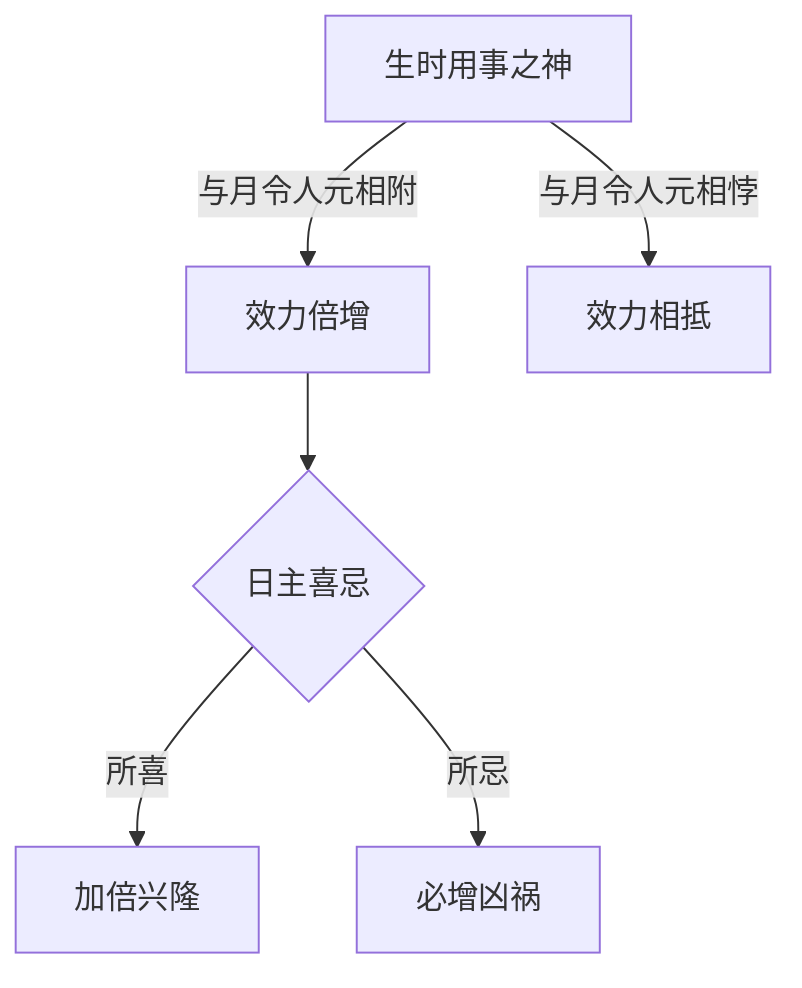
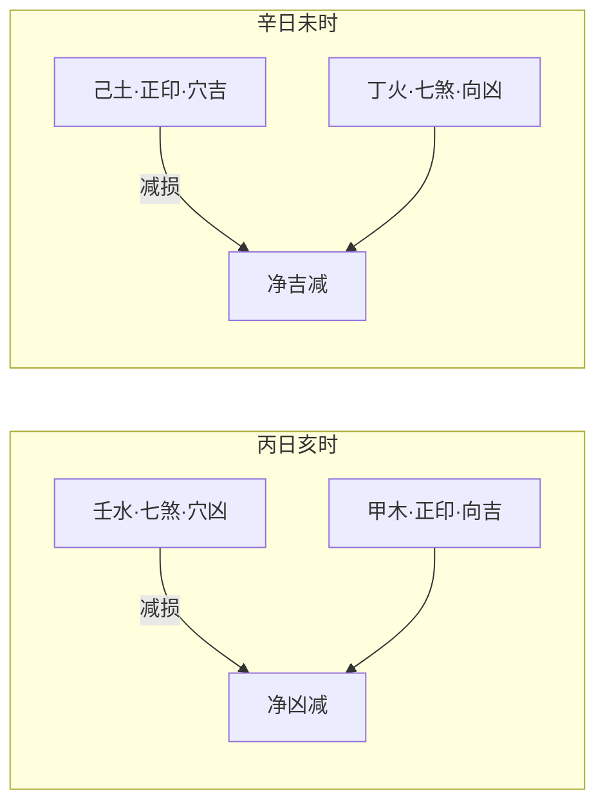
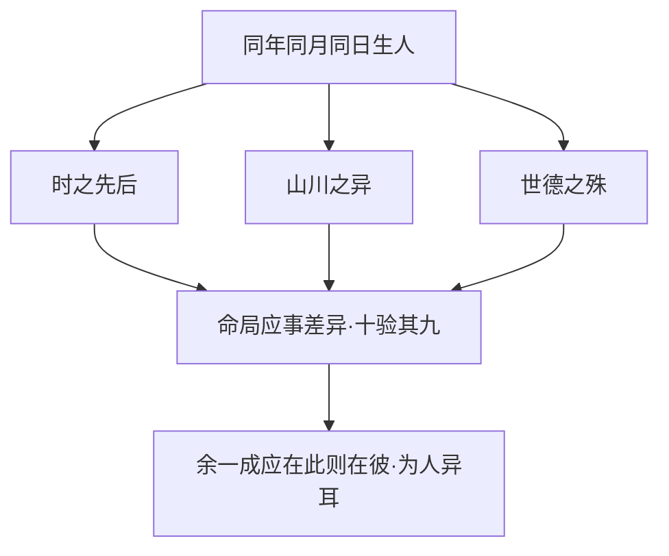

# 生时

## 生时归宿，定方为要

> 【原文】生时乃归宿之地，譬之墓也，人元为用事之神，墓之定方也，不可以不辨。

原文一开篇便设喻：把"生时"比作"墓穴"——是命造的归宿坐标；把"时支中所藏的天干"（人元）比作"用事之神"，是此刻真正起支配作用的力量；把人元比作"墓之定方"（朝向）——墓穴的好坏、坐向、得气与否，落到操作上就是"可不可以不辨"的问题。这个比喻把"时柱"在四柱（年月日时）中的位置说得具体：归宿、收束、定型，是命造最末一环的吉凶落点。

## 一时之内，分刻用事

> 【原注】子时生人，前三刻，三分壬水用事；后四刻，七分癸水用事。评其与寅月生人，戊土用事何如，丙火用事何如，甲木用事何如，局所用之神，与壬水用事者何如，癸水用事者何如，穷其浅深如坟墓之定方道，斯可以断人之祸福。

原注选最关键的换日节点——子时——来展示"一时之内还有用事分刻"的细致功夫。子时前三刻（约 23:00–23:40）壬水用事，后四刻（约 23:40–00:20）癸水用事。同一个"子时"标签底下，气到截然不同。

紧接着原注给出比较法门：不要孤立看子时用壬还是用癸，要把它放到整个八字里去比较——与月令人元（如寅月的戊土、丙火、甲木）生克关系如何？与"局所用之神"配合如何？穷究"用壬"与"用癸"的浅深差异，等于把墓穴的坐向彻底辨清，方可断人祸福。这一段的核心命题是：时辰吉凶不能孤断，必须与月令、与命局喜忌联动比较。

## 夜子时正解

> 【任氏曰】子时前三刻三分壬水用事者，乃亥中余气，即所谓夜子时也，如大雪十日前壬水用事之谓也。余时亦有前后用事，须从司令一例而推。

任铁樵对"子时前三刻壬水"给出明确定性：这是亥中壬水的余气，即"夜子时"（夜里的子时，仍属亥月司令，大雪节气交接前的十天里仍是壬水用事）。这是子平体系中关于"夜子时"归属问题的经典定调。

任氏接着推论：不止子时如此，凡时之交接处都有类似的分刻之辨，都应当从"司令"（月令当令）一例而推。这是把"子时特例"上升为通用方法。

任氏相较原注的推进：原注仅指出"子时前三分壬水、后四分癸水"的现象，任氏则给出**节气—月令—司令**的理论归因（"亥中余气"），并把这一现象抽象为所有时辰交接的普遍规律。

## 时月相附，喜忌倍增

> 【任氏曰】如生时用事，与月令人元用事相附，是日主之所喜者，加倍兴隆；是日主之所忌者，必增凶祸。

任氏立下生时断法的总则：若时支所藏人元与月令所藏人元在五行属性上相附（同属一气或一气相生），则其力量成倍放大——日主所喜者加倍兴隆，所忌者必增凶祸。这是把"提纲（年/月）+ 归宿（时）"打通的关键判法，比单看月令或单看时支都要锐利。

## 穴道与朝向——吉凶互见

> 【任氏曰】生时之美恶，譬坟墓之穴道；人地之用事，如坟墓之朝向。不可以不辨。谓穴吉向凶，必减其吉；穴凶向吉，必减其凶。

任氏把"时支"比作"穴道"（墓穴本身的位置与气脉），把"人元用事"比作"朝向"（墓穴所对的方向好坏），二者必须合看——

- 穴好而向凶，吉处要打折扣；
- 穴凶而向吉，凶处要减损；
- 但不论哪一组合，净效应都不是"吉就是吉、凶就是凶"的简单线性，而是**吉凶相互削减后**的复合值。

任氏相较"喜忌倍增"判法的推进：倍增是同向叠加，穴向之喻则引入**反向相减**的复合情形——把命理从"叠加"思维推向"合断"思维。

### 两造对照

> 【任氏曰】如丙日亥时，亥中壬水，乃丙之煞，得甲木用事，谓穴凶向吉；辛日未时，未中已土，乃辛金之印，得丁火用事，谓穴吉向凶。

**【命造一（任氏注）】丙日亥时**
- 日干丙火，时支亥。亥中本气壬水（七煞，克身为忌）、中气甲木（正印，生身为喜）。
- 壬水为丙之煞——**穴凶**；甲木为丙之印，用事于时——**向吉**。
- 判：穴凶向吉，凶处减损，印绶护身，命运主基调虽受煞压而不致倾覆。

**【命造二（任氏注）】辛日未时**
- 日干辛金，时支未。未中本气己土（正印，生身为喜）、中气丁火（七煞，克身为忌）。
- 己土为辛之印——**穴吉**；丁火为辛之煞，用事于时——**向凶**。
- 判：穴吉向凶，吉处减损，煞星用事，命运主基调虽得印护而易招官非。

两造一为"凶减"、一为"吉减"，正反互证穴向合断的复合效应。

## 时之不的与提纲为重

> 【任氏曰】理虽如此，然时之不的当者，十有四五；夫时沿有不的，又何能辨其生克乎？如果时的，纵不究其人元，亦可断其规模矣。譬如天然之龙，天然之穴，必須天然之向；天然之向，必有天然之水，只要时支不错，则吉凶自验。然人元用事，到底不比提纲司令之为重也。

任氏转入实操分寸的交代，坦率承认三个现实：

1. **时之不的当者，十有四五**——古代凭记忆、习俗报时辰，误差大，时不准的命例近半。
2. **如果时准，纵不究人元亦可断规模**——时支（地支层面）准确是基础，只要时支不差，格局吉凶可验；不必然深入人元用事。
3. **人元用事，到底不比提纲司令之为重**——月令（提纲司令）主宰全局气运，时人元只是细节调整。

这是诚实的实操表态：时支准不准是断命准确率的关键前提；人元用事是在时准基础上的精细化二级工具；即便精细化做到位，其权重仍低于月令。

## 同年同月同日百人异应

> 【原注】至同年同月同日而百人各一应者，当究其时之先后，又论山川之异，世德之殊，十有九验，其有一验者，不过此则有官，彼则子多，此则多财，彼则妻美，为人异耳。夫山川之异不惟东西南北，迥乎不同者，宜辨之，即一邑一家，而风声气习，不能一律也。世德之殊，不惟富贵贫贱，绝乎不侔得者宜辨之，即同门共户，而善恶邪正，不能尽齐也。学者察此，可以知其与替矣。

原注面对最尖锐的诘问：同年同月同日生者众多，为何吉凶各应？答案归为三层因素叠加——

1. **时之先后**——同一时辰内部还有先后，气到有别；
2. **山川之异**——不仅东南西北迥异，即一邑一家之内，风声气习也不能一律；
3. **世德之殊**——不仅富贵贫贱绝然不同，即同门共户之内，善恶邪正也难尽齐。

原注明言"十有九验"，剩下的一成左右差异，是"此则有官、彼则子多、此则多财、彼则妻美"的个人应事之别——同样命局，应在何处因人而异。

任氏以"学者察此，可以知其与替矣"作小结——兴替之机，可由此察也。

## 命之可推与德之不拘

> 【任氏曰】至于山川之异，世德之殊，因之发福有厚薄，见祸有重轻，而况人品端邪，亦可转移祸福，此又非命之所得而拘者矣。宜消息之。

任氏最终把视野从技术层面拉升到哲学层面。山川异气、世德殊禀，让同命者发福有厚薄、见祸有重轻——这是客观差异，任凭推算可察。而"人品端邪"则能"转移祸福"——这是主观能动，超出命理可推的范畴。

"非命之所得而拘"一句，任氏直接把命理学从宿命论的陷阱中拉出来。结尾"宜消息之"（宜细细体察斟酌）既是实操提醒，也是哲学留白——命可推算而德可修为，这是子平命理中常被忽略的人文维度。

_本篇是《滴天髓》上篇"通神论"中"月令"之后的承接之作，专论"时柱"在四柱推断中的实际权重。任铁樵阐微一面系统立论（人元用事、穴向之喻、喜忌倍增），一面明示其限度（"十有四五不的当""不比提纲司令为重""非命之所得而拘"），既避免夸大生时之用，也不一笔抹杀其重要性。_

_任氏以"墓穴—朝向"之喻将抽象命理具象化，是子平命理中少有的空间化思维；其"夜子时"定性、"时月相附"判法、"穴向合断"三层递进，构成一套完整的实操小体系。这套思路在《滴天髓》后续篇章中作为隐线反复出现，是任氏注本有别于其他注本的核心特色之一。_

_本篇末段关于"命之可推与德之不拘"的议论，与开篇"墓穴归宿"之喻构成完整呼应：归宿虽是命定，但归宿之中的"人品端邪"是命所不能拘的——这就把命理学从断吉凶的技艺层面，提升到劝人修德的伦理层面。_
