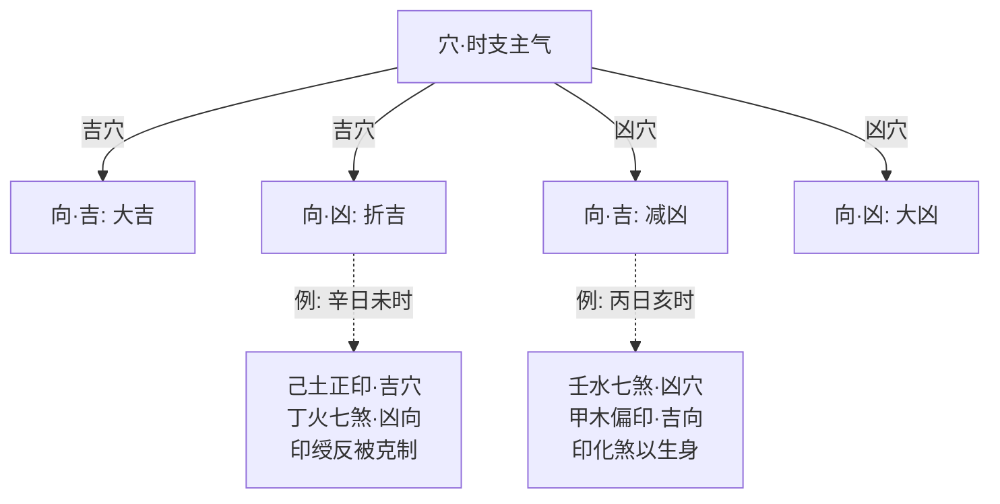

## 生时为归宿之地

> 【原文】生时乃归宿之地,譬之墓也,人元为用事之神,墓之定方也,不可以不辨。

此言以"墓"为喻，把生时在命局中的位置骤然提升至与丧葬选址同等的高度。何以如此？盖"归宿"二字，乃生命流转之最终停泊——生时为四柱之末，恰是人一生命格之收束与定型。所谓"人元"者，时支中所藏天干之引申义，即该时辰内真正主事之五行；"用事"则是当令施力之意。"定方"即朝向，犹如坟墓之坐向决定后代兴衰，时支若误，则命局之格局、用神、喜忌皆随之偏移。故原文再三叮咛"不可以不辨"，可见生时一柱看似处末，实为收局之笔，断不可草草放过。

## 时中分刻与人元用事

> 【原注】子时生人,前三刻,三分壬水用事;后四刻,七分癸水用事。评其与寅月生人,戊土用事何如,丙火用事何如,甲木用事何如,局所用之神,与壬水用事者何如,癸水用事者何如,穷其浅深如坟墓之定方道,斯可以断人之祸福。

原注首以子时为切入点，揭示古时计时之精细——一时之内并非均质之七刻半，而有前后之分。壬水、癸水虽同为水，然壬为阳水主刚猛奔放，癸为阴水主柔静内敛；二者力量与性情迥别，所主之人事自亦悬殊。推命者须逐一比对局中所喜所忌之神，与该时之人元用事何者契合、何者相悖——恰如观坟墓之穴道与朝向，须"穷其浅深"方能定祸福之机杼。所谓"定方道"三字最可玩味，非仅言方位，更兼言朝向、路径与深浅，一语而包数义。

此节实开后世"时中分刻"法门之先河——一柱之内细辨阴阳、刚柔、主次之差，不可一概以时支五行笼统论之。

## 同生异命与山川世德

> 【原注】至同年同月同日而百人各一应者,当究其时之先后,又论山川之异,世德之殊,十有九验,其有一验者,不过此则有官,彼则子多,此则多财,彼则妻美,为人异耳。

此节正面回应命理学千古之惑——同年同月同日出生者，命谱理应相同，何以现实各别？原注给出三层递进之解答：其一"时之先后"，同一天内不同时刻之差，已足以让人元用事不同；其二"山川之异"，地理方位之差影响水土气场与体质禀赋；其三"世德之殊"，祖辈阴德与家风教化之异。三者由近及远、由天及人、由形质及神气，层层展开。

"十有九验"四字下得极为审慎——命理之应验可达九成，剩下一成之例外，则是人生具体面向的偏重不同（此则有官、彼则子多、此则多财、彼则妻美），即"为人异耳"。此句暗含一重要认识：命局所定型者，乃祸福之总体格局与基调；具体人生际遇，则可侧重不同面向而呈现差异。

> 【原注】夫山川之异不惟东西南北,迥乎不同者,宜辨之,即一邑一家,而风声气习,不能一律也。世德之殊,不惟富贵贫贱,绝乎不侔者宜辨之,即同门共户,而善恶邪正,不能尽齐也。学者察此,可以知其兴替矣。

最末"学者察此"一句，原注进一步收束：地理与家世乃命理推断中不可忽略的两大辅佐变量。"一邑一家"而风声气习不齐、"同门共户"而善恶邪正不一——命理非孤立之机械推演，须于细密处见辨析，方能真正"知其兴替"。此一节尤可注意者，原注将"世德"（即祖辈与当世之德行教化）与"山川"并举，已暗含命理非纯宿命之端绪。

## 穴向之喻与月时相附

> 【任氏曰】子时前三刻三分壬水用事者,乃亥中余气,即所谓夜子时也,如大雪十日前壬水用事之谓也。余时亦有前后用事,须从司令一例而推。

任铁樵接续原注，首解子时前刻之谜——所谓"前三刻三分壬水用事"，实即亥月之余气延续至此，时辰学谓之"夜子时"。"大雪十日前壬水用事"一句，引冬季壬水司令之理以为印证——大雪节气之前，壬水尚在亥月司令之位，子时前刻犹带其气。此一辨析，为后世处理跨日时辰归属（夜子归亥日抑或子日）确立了根本依据：前刻属亥日之延续，壬水犹在司令；后刻方为子日之始，癸水正式主事。

> 【任氏曰】如生时用事,与月令人元用事相附,是日主之所喜者,加倍兴隆;是日主之所忌者,必增凶祸。生时之美恶,譬坟墓之穴道;此地之用事,如坟墓之朝向。不可以不辨。

任氏进一步引入"穴道—朝向"之喻，将生时一柱之辨析细化为两层结构："穴"喻生时本身的五行属性吉凶（即时支主气），"向"喻该时内人元用事之具体施力（即分刻细气）。两相配合，须与月令人元用事相较——若时之人元与月令用事相附和，则是日主所喜者"加倍兴隆"，为日主所忌者"必增凶祸"。换言之，时之人元既可增益月令之力，亦可倍增其害，二者同向则气势弥满，二者异向则彼此牵制。

> 【任氏曰】谓穴吉向凶,必减其吉;穴凶向吉,必减其凶。如丙日亥时,亥中壬水,乃丙之煞,得甲木用事,谓穴凶向吉;辛日未时,未中已土,乃辛金之印,得丁火用事,谓穴吉向凶。

"穴吉向凶"与"穴凶向吉"二语，正是上述两层结构之双向应用。任氏举二造以明其理：

**观丙日亥时之造**：亥中壬水乃丙火之七煞（偏官），是凶穴；然亥中甲木用事，甲木乃丙火之偏印（枭神），印能化杀生身，是吉向。凶穴得吉向所护，煞气受印化解，"穴凶向吉"之实例也。

**观辛日未时之造**：未中己土乃辛金之正印，是吉穴；然未中丁火用事，丁火乃辛金之七煞，用事逢煞直克日主兼伤印绶，是凶向。吉穴遭凶向所伤，印绶反被克制，"穴吉向凶"之实例也。

二造之妙，在于揭示主气与用事可正可反——主气既定大局之基调，用事则施力于细节之吉凶。两层结构不可混同视之，须分而观之、合而参之，方能得穴向相配之真机。

```mermaid
graph TD
    A[穴·时支主气] -->|吉穴| B[向·吉: 大吉]
    A -->|吉穴| C[向·凶: 折吉]
    A -->|凶穴| D[向·吉: 减凶]
    A -->|凶穴| E[向·凶: 大凶]
    C -.->|例: 辛日未时| F[己土正印·吉穴<br>丁火七煞·凶向<br>印绶反被克制]
    D -.->|例: 丙日亥时| G[壬水七煞·凶穴<br>甲木偏印·吉向<br>印化煞以生身]
```

## 时之不的与月令为纲

> 【任氏曰】理虽如此,然时之不的当者,十有四五;夫时亦有不的,又何能辨其生克乎?如果时的,纵不究其人元,亦可断其规模矣。譬如天然之龙,天然之穴,必天然之向;天然之向,必有天然之水,只要时支不错,则吉凶自验。

任氏此节注入一层冷峻的实证理性——前述理论虽精，时辰之记录却"十有四五"难以确凿。古时计时凭漏刻、观星象，寻常百姓之家未必能精确至刻；时柱不准，则一切人元用事之辨皆失其凭据。故任氏坦言："如果时的，纵不究其人元，亦可断其规模"——若时支无误，仅按时支之五行定性已可推命大概；唯有精确至刻，方有再论人元之必要。"天然之龙、天然之穴，必天然之向；天然之向，必有天然之水"——此句以地理家言为喻，强调"时支不错"乃命理推断之最低必要门槛，非可深研之精微，而是入门之底线。

> 【任氏曰】然人元用事,到底不比提纲司令之为重也;至于山川之异,世德之殊,因之发福有厚薄,见祸有重轻,而况人品端邪,亦可转移祸福,此又非命之所得而拘者矣。宜消息之。

最末任氏明确轻重之序："人元用事，到底不比提纲司令之为重也"——时之人元虽细密，终不敌月令司权之神。月柱为提纲，主宰全年五行之气；时柱虽为归宿之地，仅为收束之力。两相比较，提纲司令之权重远在人元之上。推命者须先论提纲，次及年日，方及于时——此一轻重次第，正是《滴天髓》全书一以贯之之法度。

末句"人品端邪，亦可转移祸福，此又非命之所得而拘者矣"尤为关键——任氏明示：命理非宿命论，人之品行可改移祸福之实际呈现。山川异则发祸有厚薄，世德殊则见祸有重轻；人品端邪则可"转移"之。此一层认识，为子平命学注入儒家道德自主性之内核，亦是其区别于纯宿命论之标识。末以"宜消息之"四字收束，留予学人涵咏玩味之余地。

## 深化洞见：时柱辨析的学术坐标与命理伦理

此篇位居《滴天髓》论时柱之专章，其核心主张可归为三义：

其一，**时为归宿之象，非开局之主**。生时为四柱之末，所主者乃归宿——非事业之起、非时运之转，乃生命整体之定型与收束。此与月柱"提纲"主全年气运、年柱主祖荫根基者层级有别。时柱之吉凶，常在暮年景况、归宿之地、子女成就、下属缘分、晚年运势等层面显化；而非青年建功立业之首要凭据。古人以生时为墓穴之喻，正取其收束、归藏、终定之义。

其二，**时中分刻的精细化处理**。原注以子时为例，揭示一时之中尚有壬癸之别；任氏更进一步点明子时之前三刻实为亥月余气之延续，此为命理界千古聚讼之焦点——夜子时究竟归亥日还是子日，各派主张不一。任氏以"亥中余气"定之，明确归属亥日之延续，为后世处理跨日时辰立下方法典范。此一节之贡献，已超出单纯论时之范畴，实为时辰学断代史之重要坐标。

其三，**命理非宿命论的儒家精神**。任氏末句"人品端邪，亦可转移祸福，此又非命之所得而拘"，与《了凡四训》《阴骘文》之命理观一脉相承——命理推演乃知命之具，非认命之辞；君子知命而不委命，修德以转祸，福自可回。此说为子平命学区别于纯宿命论之关键标识，亦为其在士大夫阶层立足之伦理基础。命理之学若失此一层道德主体性，则沦为机械之宿命推演；若失五行生克之专业精度，则流于空疏之道德说教——任氏此篇正于两端之间立一圆融之论。

盖命理之学，本为抉发天人之几；而人之几，又在于德行之转移。原注辨析山川世德，任氏推演人元用事，末则收束于人品之端邪——三层结构层层递进，从外境到内境、从气运到心性，构成一套完整之命理观。读者若能于"宜消息之"四字中涵泳玩味，则知命而不囿于命之旨，自可悠然心会。