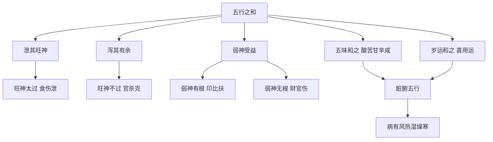

# 疾病

## 篇名与总纲

"五行和者，一世无灾"——此句为《滴天髓阐微·疾病》之总纲。一个"和"字，统摄全篇。"和"非"全"，非"齐"，非"生而不克"——而是"泄其旺神，泻其有余"——五行之气流通有情、各得其平，方为"和"。本篇论疾病，并非中医病理论，而是命理框架下以五行生克解释疾病成因的格局论。

## 原注要义

> 【原注】五行和者，不特全而不缺，生而不克，只是全者宜全。缺者宜缺，生者宜生，克者宜克，则和矣。主一世无灾。

原注短短几句，已把"和"的真义讲透。一般人以为"五行齐全不缺、生而不克"才是"和"，原注纠正：所谓"和"，是"全者宜全、缺者宜缺、生者宜生、克者宜克"——即各随其性、勿使偏倚。比如"缺者宜缺"——如果命中某行原本就缺，强行补之反而失和；"克者宜克"——克也是五行流通的一部分，不可一味避克。

## 任氏补注

> 【任氏曰】五行在天为五气青、赤、黄、白、黑也；在地为五行，木、火、土、金、水也；在人为五脏，肚、心、脾、肺、肾也。人为万物之灵，得、五行之全，表于头面，象天之五敢，裹于脏腑，象地之五行，故为一小天地也。是以脏腑各酏五地之服阳而属焉，凡一脏配一腑，腑皆属阳，故为甲、丙、戊、庚、壬；脏皆属阴，故为乙、丁、己、辛、癸。或不和，或太过不及，则病有风、热、湿、燥、寒之症矣。必得五味调和，亦有可解者。五味者，酸、苦、甘、辛、咸也。酸者属木，多食伤筋；苦者属火，多食伤骨；甘者属土，多食伤肉；辛者属金，多食伤气：咸者属水，多食伤血，比五味之相克也。故曰"五行和者，一世无灾"。不特八字五行宜和，即脏腑五行，亦宜和也。八字五行之和，以岁运和之；脏腑五行之和，以五味和之。和者，解之意也。若五地和，五味调，而灾病无矣。故五行之和，非生而不克，全而不缺为和也，其要贵在泄其旺神，泻其有余，有余之旺神泻，不足之弱神受益矣，此之谓和也。若强制旺神，寡不敌众，触怒其性，旺神不能损，弱神反家伤矣。是以旺神太过者宜泄，不太过宜克；弱神有根者宜扶，无根者反宜伤之。凡八字须得一神有力，制化合宜，主一世无灾。非全而不缺为美，生而不克为和也。

任氏的注疏是「疾病」全篇的理论基石，把五行—五脏—六腑—五味打通为一个完整的天人对应系统。

关键论点有四：

其一，五行在天、在地、在人三才一贯。"在天为五气青、赤、黄、白、黑"——这是把五行配五色（青赤黄白黑）；"在人为五脏，肚、心、脾、肺、肾也"——五行配五脏（按：任氏"肚"字疑为"肝"之传抄之误，下文亦见，详见后）；"裹于脏腑，象地之五行"——五脏六腑皆五行之化。

其二，五脏配十干。"凡一脏配一腑，腑皆属阳，故为甲、丙、戊、庚、壬；脏皆属阴，故为乙、丁、己、辛、癸"——这一对应表是：甲胆乙肝、丙小肠丁心、戊胃己脾、庚大肠辛肺、壬膀胱癸肾。这是传统中医藏象学说与命理天干配脏腑的标准对应。

其三，五味调和之说。"酸者属木，多食伤筋；苦者属火，多食伤骨；甘者属土，多食伤肉；辛者属金，多食伤气：咸者属水，多食伤血"——此段以《黄帝内经·素问·五脏生成论》"多食咸，则脉凝泣而变色；多食苦，则皮槁而毛拔；多食辛，则筋急而爪枯；多食酸，则肉胝䐛而唇揭；多食甘，则骨痛而发落"为依据，把五味过食与五脏损伤对应起来。

其四，"和"的真正内涵。"其要贵在泄其旺神，泻其有余，有余之旺神泻，不足之弱神受益矣，此之谓和也"——任氏把"和"重新定义：不是"齐"（五行齐备），而是"平"（旺神得泄、弱神得扶）。这一论断打破了一般命理书中"五行齐备为贵"的俗见。

"若强制旺神，寡不敌众，触怒其性，旺神不能损，弱神反家伤矣"——这是任氏对"克"之法的限制：克制旺神需要"神足"（克神要有力），否则强行克制反而触怒旺神、伤及弱神。

"是以旺神太过者宜泄，不太过宜克；弱神有根者宜扶，无根者反宜伤之"——这一句给出了"和"的具体操作法：旺神太过用泄（食伤），旺神不过用克（官杀），弱神有根用扶（印比），弱神无根用伤（财官）。这一规则贯穿全篇，是命理"扶抑"与"通关"的核心方法论。

### 【命造一（任氏注）：五行和、九旬无病】

> 癸未 甲寅 戊戌 庚申
>
> 癸丑 壬子 辛亥 庚戌 己酉 戊申 丁未 丙午
>
> 戊生寅月，木旺土虚，喜其坐戌通根，足以用金制杀。况庚金办坐禄支，力能伐木，所谓不太过者宜克也。虽年干癸水生杀，得未土制之，使其不能生木，喜者有扶，憎者得去，五行和矣。且一路运程与体用不背，寿至九旬，耳目聪明，行止自如。子旺孙多，名利福寿俱全，一世无灾无病。

此造为"五行和"的范例。戊土日主生于寅月（甲木七杀当令），戊土虽坐戌通根但"木旺土虚"——身弱杀旺。

任氏判此造的"和"在于：庚金（食神）坐禄支申，力能伐木——"不太过者宜克"。癸水（财星）虽生杀（癸生甲），得未土（癸之七杀）制之——"喜者有扶，憎者得去"。整局"五行和矣"。

"寿至九旬"——九十高龄仍"耳目聪明、行止自如"，是"一世无灾"的实证。

### 【命造二（任氏注）：七杀五见、运走木火】

> 甲寅 庚午 戊寅 甲寅
>
> 辛未 壬申 癸酉 甲戌 乙亥 丙子
>
> 局中七杀五见，一庚临午无根，所谓弱神无根，宜去之，旺神太过，宜泄之也。且午火则和矣。喜其午火当令，全无水气，虽运逢金水，不能破局而无疑。运走木火，名利两全。此因神足，精气自生，是以富贵福寿，一世无灾，子广孙多，后嗣济美。

此造与命造一结构相似（戊土日主、七杀当令），但格局判读不同。日主戊土生于午月（午中丁火为正印、己土为比肩），时支午火当令、午火通根——戊土得午火之生而不弱。

"七杀五见"——甲木七杀在年、月、时三支寅中皆藏，加上天干甲木透出——杀极旺。"一庚临午无根"——庚金（食神）被午火所克，根气尽失。"弱神无根，宜去之"——庚金是弱神且无根，应"去之"。

"旺神太过，宜泄之也"——七杀（甲木）太过，用午火（印星）泄木生土——这正是"以印化杀"的标准格局。

"运走木火，名利两全"——木火运助杀助印，"神足、精气自生"，故能"富贵福寿，一世无灾"。

### 【命造三（任氏注）：无土金之混、年登耄耋】

> 甲子 丙子 癸亥 乙卯
>
> 丁丑 戊寅 己卯 庚辰 辛巳 壬午
>
> 癸亥日元，年月坐子，旺可知矣。最喜卯时泄其菁英，里发于表，木气有余，火虚得用，谓精足神旺。喜其无土金之杂，有土则火泄，不能止水，反与木不和，有金则木损，更助共汪洋。其一生无灾者，缘无土金之混也。年登耄耋。而饮啖愈壮，耳目聪明，步履康健，见者疑五十许人，名利两全，子孙众多。

此造为"五行纯和一气"的范例。癸亥生于子月，年月支子、时支卯木——水旺木秀。无土（不晦火）、无金（不克木、不助水势）——整局清纯。

任氏判"有土则火泄，不能止水，反与木不和；有金则木损，更助共汪洋"——土金是忌神（按：土克水、晦火；金助水势、克木）。"无土金之混"是此造一世无灾的关键。

"年登耄耋"（八九十岁）"饮啖愈壮"——耄耋之年仍有壮年的饮食精力，是"精足神旺"的实证。

三造合看，"五行和"格局的判读要点：一看旺神是否得泄（食伤或印化），二看弱神是否得扶（印比），三看是否有清纯之气（无杂乱之混）。

## 血气乱者，生平多疾

> 【原注】血气乱者，不特火胜水，水克火之类；五气反逆，上下不通，往来不顺，谓之乱，主人多病。

> 【任氏曰】血气乱者，五行悖而不顺之谓也。五行论水为血，人身论脉即血也。心胞主血，故通手足厥阴经，心属丁火，心胞主血，膀胱属壬水。丁壬相合，故心能下交于肾，则丁壬化木，而神气自足，得既济相生，血泳流通而无疾病矣。故八字贵乎克处逢生，逆中得顺而为美也。若左右相战，上下相克，喜逆逢顺，则火旺水涸，火能焚木；水旺土荡，水能沉金；土旺木折，土能晦火；金旺火虚，金能伤土；木旺金缺，木能渗水。此五行颠倒相克之理，犯此者，必多灾病。

任氏把"血气乱"定义为"五行悖而不顺"。"水为血"——以五行的水对应人体血脉；"心胞主血"——以中医藏象学对应（任氏此处"心胞"即心包，中医认为心包代心受邪）；"心属丁火，膀胱属壬水"——把心肾、命门、膀胱的水火关系以丁壬天干配之。

"丁壬相合，故心能下交于肾，则丁壬化木"——这是命理中"丁壬合化木"的来源之一：心火下交于肾水，水火既济，丁壬合化而神气自足。这一论断源于《周易·既济》卦"水在火上，既济"以及《中庸》"中也者，天下之大本也；和也者，天下之达道也"。

"若左右相战，上下相克……五行颠倒相克之理，犯此者，必多灾病"——任氏把五行颠倒相克的各种组合（火旺水涸、水旺土荡、土旺木折、金旺火虚、木旺金缺）一一列出，是"血气乱"的具体病机清单。

### 【命造四（任氏注）：血气乱、痰火吐血】

> 丙申 乙未 丁未 庚戌
>
> 丙申 丁酉 戊戌 己亥 庚子 辛丑
>
> 丁生季夏，未戌燥土，不能晦火生金，丙火足以焚木克金，则土愈燥而不泄。申中壬水涸而精必枯，故初患痰火。亥运水不敌火，反能生木助火，正杯水车薪，火势愈烈，吐血而亡。

此造为"血气乱"的范例。丁火生于未月（季夏），地支未戌燥土、月干乙木（被丙克）、时干庚金（被火克）——火旺、土燥、木枯、金伤。申中壬水被火蒸干——水（血）枯。

"初患痰火"——火旺伤金（肺主气、司呼吸，金为肺之象），痰火为常见病。"亥运水不敌火，反能生木助火"——亥水（壬水之禄）虽来助水，但被火蒸腾，"杯水车薪"。"吐血而亡"——火旺水枯，血脉爆裂。

### 【命造五（任氏注）：遗泄痰嗽、吐血而亡】

> 壬寅 丁未 丙申 甲午
>
> 戊申 己酉 庚戌 辛亥 壬子 癸丑
>
> 丙火生于未月午时，年干壬水无根，申金远隔，本不能生水，又被寅冲午劫，则肺气愈亏。兼之丁壬相合化木，从火则心火愈旺，肾水必涸，所以病犯遗泄，又有痰嗽。至戌运全会火局，肺愈绝，肾水燥，吐血而亡。

此造病机更复杂。丙火生于未月午时（年支寅、日支申、时支午），火势本旺。年干壬水坐申金（壬水之长生）本可助水，但"寅冲午劫"——寅冲申、午克申，申金被破坏，壬水失去源头。

"丁壬相合化木，从火则心火愈旺，肾水必涸"——丁壬合化木的条件是木当令或木旺（按：此处任氏取"合而不化"或"合化"两可之说）；心火旺、肾水涸是心肾不交的具体表现。

"病犯遗泄"——肾水（精）亏虚；"痰嗽"——肺金（申金）受伤。"至戌运全会火局，肺愈绝，肾水燥，吐血而亡"——戌运寅午戌三合火局，火势最旺，五脏俱焚。

### 【命造六（任氏注）：木火同心、初运无碍】

> 甲辰 丙寅 丙寅 壬辰
>
> 丁卯 戊辰 己巳 庚午 辛未 壬申
>
> 木当令，火逢生，辰本湿土，能蓄水，被丙寅所克，脾胃受伤，肺金自绝，木多渗水，而肾水亦枯。至庚运，木旺金缺，金水并见，木火金肆逞矣，吐血而亡。此造木火同心，可顺而不可逆，反以壬水为忌，故初逢丁卯、戊辰、己巳等运，反无碍。

此造病机在于"木火同心"——甲丙寅寅木火并旺。辰虽为湿土能蓄水，但被丙寅所克，辰土之功用尽失。"脾胃受伤"（辰为土、为脾胃），"肺金自绝"（金被火克），"肾水枯"（木多渗水）。

"至庚运，木旺金缺"——庚金来克木，但木极旺反克金（按：此处任氏判"金缺"指金本无根见庚金亦无力），"金水并见"反助木火之势。"吐血而亡"——金水（肺肾）两伤。

任氏特意点出"初逢丁卯、戊辰、己巳等运，反无碍"——这是"木火同心可顺而不可逆"的反证：行木火运是顺其势，反而无事；行金水运是逆其势，反而出事。

三造合看，"血气乱"格局的判读要点：一看五行是否有左右相战、上下相克的结构，二看是否出现颠倒相克（火旺水涸、水旺土荡等）的具体病机，三看行运是顺势还是逆势。

## 忌神入五脏而病凶

> 【原注】柱中所忌之神，不制不化，不冲不散，隐伏深固，相克五脏，则其病凶。忌木而入土则脾病，忌火而入金则肺病，忌土而入水则肾病，忌金而入木则肝病，忌水而入火则心病。又看虚实，如木入土，土旺者，则脾自有余之病，发于四季月；土衰者，则脾有不足之病，以于春冬月。余皆仿之。

> 【任氏曰】忌神入五脏者，阴浊之气，埋藏于地支也。阴浊深伏，难制难化，为病最凶。如其为喜，一世无灾；如其为忌，生平多病。土为脾胃，脾喜缓，胃喜和，忌木而入土，则不和缓而病矣。金为大肠肺，肺宜收，大肠宜畅，忌火而入金，则肺气上逆，大肠不畅而病矣。水为膀胱肾，膀胱宜润，肾宜坚，忌土而入水，则贤枯膀胱燥而病矣。木为肝胆，肝宜条达胆宜平，忌金而入木，则肝急而生火，胆寒而病矣。火为不肠心，心宜宽，小肠宜收，忌水而入火，则心不宽，小肠缓而病矣。又要看有余不足，如土太旺，木不能入土，是脾胃自有余之病。

任氏的"忌神入五脏"理论把原注的五脏配十干表具体化，并进一步用"阴浊之气埋藏于地支"——这是把"地支藏干"作为"忌神入脏"的载体。地支藏干深伏难制，比天干透出的忌神更为凶险。

任氏给出"忌神—五脏"对应表：忌木入土（脾胃病）、忌火入金（肺病）、忌土入水（肾病）、忌金入木（肝病）、忌水入火（心病）。这一对应与"五行生克"和"中医藏象"双重对应。

"又要看有余不足"——任氏强调判读"忌神入脏"还要看脏腑本身的有余（实证）和不足（虚证）：有余者病发于本脏所忌的时令（如脾本忌湿，若土湿而有余则病发于春夏，反忌火以燥之），不足者病发于相反的时令（按：任氏"以于春冬月"一句疑为"发于春冬月"之传抄之误）。

### 【命造七（任氏注）：忌神入五脏、肚肾两亏】

> 庚寅 己丑 丙子 乙未
>
> 庚寅 辛卯 壬辰 癸巳 甲午 乙未
>
> 丙火生于季冬，坐下子水，火虚无焰，用神在木。木本凋柘，虽处两阳，萌芽未动，庚透临绝，为病甚浅，所嫌者月支丑土，使庚金通根，丑内藏辛，正忌神深入五脏，又己土乃庚金嫡母，晦火生金，足以破寅。子水为肾，丑合之不能生木，化土反能助金，丑土之为病，不但生金，抑且移累于水，是以病患肚肾两亏。

此造为"忌神入五脏"的范例。丙火生于季冬（丑月），坐下子水——火虚无焰。用神在木（乙未、寅卯），但"木本凋柘"——冬木本弱。

关键在"月支丑土，使庚金通根"——丑为庚金之库（按：丑藏辛金，丑为辛金之墓库），使庚金有了藏根之处。丑内藏辛（庚金同类），"正忌神深入五脏"——金（忌神）入丑土（脾胃之位），脾胃被金所克。

"己土乃庚金嫡母，晦火生金"——己土（年干）为阴土，是金之母（按：传统五行中土生金），己土晦火使火更弱，生金使金更旺。

"子水为肾，丑合之不能生木，化土反能助金"——子丑合本为土（按：子丑合化土，但条件是丑当令），命局中子丑合绊，子水不能生木，反而化土助金。"丑土之为病，不但生金，抑且移累于水"——丑土之病，从脾胃（水谷之海）连累到肾水（先天之本）。

"是以病患肚肾两亏"——肚（疑为"脾"之传抄之误，或为"肚"指腹部消化系统）肾两亏，是"忌神入五脏"的典型症状。

### 【命造八（任氏注）：忌神入五脏归六腑】

> 丁亥 辛亥 辛未 壬辰
>
> 庚戌 己酉 戊申 丁未 丙午 乙巳
>
> 辛金生于孟冬，丁火克去比肩，日主孤立无助，伤官透而当令，窃去命主元神，
>
> 用神在土不在火也。未为木之库根，辰乃木之余气，皆藏乙木之忌；年月两亥，又是木之生地，亥未拱木，此忌神入五脏归六腑。由此论之，谓脾虚肾泄，其病患头眩遗泄，又更盛于胃腕痛，无十日之安。至己酉运，日主逢禄，采芹得子，戊运克去壬水补廪；申运壬不逢生，病势愈重，丁运日主受伤而卒。

此造为"忌神入五脏归六腑"的复杂病机。辛金生于亥月（孟冬），丁火透克比肩（按：丁火克辛金之比劫），日主孤立。伤官（按：按金日主论，火为伤官）透而当令——伤官泄金，元气被耗。

"用神在土不在火也"——任氏特别点明用神是土（火生土、土能泄火生金）而非火（食伤）。

"未为木之库根，辰乃木之余气，皆藏乙木之忌"——未（未中乙木）、辰（辰中乙木）皆藏乙木（按：乙木为财星之官，金克木为财），但此处任氏将木（乙）作为忌神看待。

"年月两亥，又是木之生地，亥未拱木"——亥未拱木局（亥未拱合木），进一步加强了忌神木的力量。

"此忌神入五脏归六腑"——忌神木（肝胆之象）入未辰土（脾胃之位），又归亥（肾水之方），形成"肝—脾—肾"三脏联病的格局。

"脾虚肾泄"——脾（未辰）虚则运化失常，肾（亥）泄则精关不固。"头眩遗泄"——肾精亏虚、虚火上扰；"胃腕痛"（"腕"字疑为"脘"之传抄之误）——胃脘痛是脾胃病的典型症状。

"无十日之安"——病势缠绵，任氏以此反证"忌神入五脏"之凶。

"至己酉运，日主逢禄，采芹得子"——己酉运，己土生金、酉金为辛之禄地，运助日主，得中秀才、得子。"戊运克去壬水补廪"——戊土制水（壬为食神、为忌），水去则金得助，补廪（考取廪膳生员）"申运壬不逢生，病势愈重"——申运壬水被引出，食伤泄金，病重。"丁运日主受伤而卒"——丁火克金最重，日主被克殆尽。

## 客神游六经而灾小

> 【原注】客神比忌神为轻，不能理没，游行六道，则必有灾。如木游于土之地而胃灾。火游于金之地而大肠灾，土行水地膀胱灾，金行木地胆灾。水行火地上肠灾。

> 【任氏曰】客神游六经者，阳虚之所，浮于天干也。阳而虚露，易制易化，为灾必小，犹病之在表，外感易于发散，不至大患，故为小也。究其病源，仍从五行阴阳，以分脏腑，而五脏论法，亦勿以天干为客神论虚，地支为忌神论实。必须究其虚中有关，实处反虚之理，其灾祥了然有验矣。

"客神"与"忌神"的区别是本节核心。"客神"是浮于天干的阳气（虚露），易制易化，为灾必小；"忌神"是埋藏于地支的阴浊（深伏），难制难化，为病最凶。

"犹病之在表，外感易于发散"——任氏用中医外感病的比喻，把"客神"比为外感表证（病在皮肤经络），把"忌神"比为内伤脏腑（病在五脏）。这一比喻直接源自《黄帝内经·素问》的"善治者治皮毛，其次治肌肤，其次治筋脉，其次治六腑，其次治五脏"——外感病易治，内伤病难治。

"勿以天干为客神论虚，地支为忌神论实"——任氏提醒判读者：不能机械地把天干都当虚、地支都当实。要"究其虚中有关、实处反虚之理"——虚中可能有关键（虚神实脉），实中可能藏虚（实邪伤正）。

### 【命造九（任氏注）】

> 壬辰 甲辰 庚午 丙戌
>
> 乙巳 丙午 丁未 戊申 己酉 庚戌 辛亥
>
> 庚午日元，生于辰月戌时，春金杀旺，用神在土。月干甲木，本是客神，得两土，所以脾胃无病，然熬水炼金，而患弱症。至戊申运，土金并旺，局以木为病，木主风，金能克木；接连己酉庚与三十载，发财十余万，辛亥运金不通根，木得长生，忽患风疾而卒。

此造为"客神游六经"的典型。庚金生于辰月（春金杀旺），月干甲木透出为客神（浮于天干）。"得两土（辰、戌），所以脾胃无病"——客神虽透，但被地支辰戌两土所制，不入脾胃之脏。

"然熬水炼金，而患弱症"——甲木（客神）虽不能入脏，但能克土、耗金——庚金被甲木所克（财损印、比劫夺财之变体），主人体弱。

"至戊申运，土金并旺"——戊土制水、申金助庚，日主得力，故"发财十余万"。"辛亥运金不通根，木得长生"——亥运甲木得长生（木长生在亥），客神被激活；"忽患风疾而卒"——木为风象，客神游胆经（按：胆与肝为表里，胆主决断、木气伤胆则中风）。

### 【命造十（任氏注）：客神化忌】

> 癸丑 戊午 壬寅 庚戌
>
> 丁巳 丙辰 乙卯 甲寅 癸丑 壬子
>
> 壬寅日元，生于五月戌时，杀旺又逢财局，杀愈肆逞，所以客神不在午火，反在寅木，助其火势；客神又化忌神，戊癸化火，则金水相伤。运至乙卯，金水临绝，得肺肾两亏之症，声哑而嗽，于甲戌年正月木火并旺而卒。

此造为"客神化忌"的复杂情形。壬寅生于午月戌时，七杀（丁火、戊土）当令，寅午戌三合火局——火势极旺。任氏判"客神不在午火，反在寅木"——本来午火（杀）是忌神，但寅木才是客神（按：寅木助火生火，使火势更盛）。

"客神又化忌神"——寅木客神在某些行运下会化忌（按：此处任氏可能指"寅午戌合火局"，木化为火，原本是客神的木反而加强了忌神火的力量）。"戊癸化火"——按十干合化，戊癸合化火。

"运至乙卯，金水临绝"——乙木运、卯木运，乙木为日主壬水之七杀（按：乙为阴木，克壬水之阴金），卯为木旺之方，金水气绝。"得肺肾两亏之症"——肺属金，肾属水，金水临绝则肺肾两伤。"声哑而嗽"——肺（声门）受损之象。

### 【命造十一（任氏注）：客神不能深入、一生无疾】

> 乙亥 庚辰 丙子 庚寅
>
> 己卯 戊寅 丁丑 丙子 乙亥 甲戌
>
> 丙子日元，生于季春，湿土司令，蓄水养木，用神在木，得亥之生，辰之余，寅之助。乙木虽与庚金合而不化，庚金浮露天干为客神，不能深入脏腑，而游六经也。水为精，亥子两见，辰又拱而蓄之，木余为气，春令有余，寅亥生合火为旺神，时在五阳进气，通根年月，气贯生时，精气神三者俱足，则邪气无从而入。

此造为"客神不能深入"的范例。丙子生于辰月（湿土司令），地支亥子辰蓄水、寅亥合木——水木皆旺。乙庚合而不化（按：乙庚合金需金旺之条件，此处木旺金弱不合）——庚金（客神）浮于天干，不能深入。

"精气神三者俱足"——水（精）有亥子辰，木（气）有寅亥，火（神）有丙——三才皆备。"则邪气无从而入"——正气得天独厚，客神无法致病。

"行运又不背，一生无疾"——任氏强调"行运不背"是此造一生无疾的关键。行运若背（伤及精气神三才），客神也会借势为患。

## 木不受水者血病

> 【原注】水东流而木逢冲，或虚脱，皆不受水也，必主血病。盖肝属木，缄而不纳则病。

> 【任氏曰】春木不受水者，喜火之温暖也；冬木不受水者，喜火之解冻也。夏木之有根而受水者，去火之烈，润地之燥也；秋木得地而受水者，泄金之锐，化杀之顽也。春冬生旺之木，要其衰而受水；夏秋休囚之木，要其旺而受水。反此则不受，不受则血不流行，故致血病矣。

此节专论"木"与"水"的关系对血病的影响。"肝属木"——按中医藏象，肝藏血、主疏泄、属木。"缄而不纳"——按字面意为"封缄而不接纳"，引申为肝气郁结、不纳血之象。

任氏把"木受水"分四时而论：春木（生旺）喜火温暖，冬木（凋柘）喜火解冻——春冬生旺之木本身就不需要水，水来反成"不受"。夏木（休囚）有根而受水——水去火之烈、润地之燥。秋木（得地）受水——水泄金之锐、化杀之顽。"春冬要衰、夏秋要旺"——这是木受水的时令要诀。

"不受则血不流行，故致血病"——肝木不纳水（血不归肝），血不循经，则致血病。这一论断与中医"肝藏血""脾统血""心主血"理论相通。

### 【命造十二（任氏注）：木受水生、科甲连登】

> 丁亥 丁未 乙亥 己卯
>
> 丙午 乙巳 甲辰 癸卯 壬寅 辛丑
>
> 乙木生于未月，休囚之位，年月两透丁火，泄气太过。最喜时禄通根，则受亥水之生，润其燥烈之土；更妙会局帮身，通辉之象。至甲辰运，虎榜居首，科甲连登，格取食神用印也。

此造为"木受水生"的范例。乙木生于未月（休囚之位），地支亥卯未合木局（按：亥卯未三合木局，乙木得禄于卯、得长生于亥）——木气旺。

"最喜时禄通根"——时支卯为乙木之禄，木有根。"则受亥水之生"——亥水生木，水被木纳，则"血归肝"。

"润其燥烈之土"——亥水润未土之燥。"格取食神用印"——丁火（食神）配亥水（印星），食神生财、印星护身，是"食神用印"的标准格局。

"甲辰运，虎榜居首，科甲连登"——甲辰运，甲乙木、辰土（水之库），木土两助，仕途亨通。

### 【命造十三（任氏注）：木不受水、膨胀而亡】

> 丙戌 乙未 乙巳 丁亥
>
> 丙申 丁酉 戊戌 己亥 庚子 辛丑
>
> 乙木生于未月，干透丙丁，通根巳戌，发泄太过，不受水生，反以亥水为病，格成顺局从儿。初交丙申丁酉，得丙丁盖头，平顺之境；戊戌运克尽亥水，名利两得；至己亥水地，病患膨胀。只因四柱火旺又逢燥土，水无所归，故得此病而亡。

此造为"木不受水"的反例。乙木生于未月，地支未巳戌一片燥土（按：巳为火之禄、未为木之库、戌为火之库），天干丙丁（食伤）透出——火势极旺。乙木泄气太过，本身已弱。

"不受水生，反以亥水为病"——乙木极弱，反不能纳水（按：弱木见水不仅不能纳，反而被水"漂浮"）。"格成顺局从儿"——"从儿"是命理特殊格局，指日主极弱从食伤之势。食伤（丙丁火）为"儿"，从儿即放弃自身、随顺食伤之势。

"戊戌运克尽亥水，名利两得"——戊戌运燥土克尽亥水，水（血）被制，仕途反而亨通（按：从此格之理，火旺为用，水为忌神）。

"至己亥水地，病患膨胀"——己亥运引出水来，水被火灼、又被土制，"水无所归"——血病发为膨胀（按：膨胀即腹水、水肿，属血水不归经之象）。

"只因四柱火旺又逢燥土，水无所归，故得此病而亡"——任氏用"水无所归"四字把病机讲透：火旺灼水、燥土夺水，水（血）失其归藏之所（肝、肾、脾），发为膨胀而亡。

## 土不受火者气伤

> 【原注】土逢冲而虚脱，则不受火，必主气病，盖脾属土而容火，不容则病矣。

> 【任氏曰】燥实之土不受火者，喜水之润也；虚湿之土不受火者，忌水之克也；春土有根而受火者，解天之冻，去地之湿也；秋土得地而受火者，制金之有余，补土之泄气也。过燥则地不润，过湿则天不和，是以火不受，木不容。过燥必气亏，过湿必脾虚，不受则病矣。

此节专论"土"与"火"的关系对气病的影响。"脾属土"——按中医藏象，脾为气血生化之源、属土。"容火而不容则病"——按字面意为"容纳火而不能容纳则病"，实指脾土本喜火（温煦运化）但过燥或过湿之土不容火。

任氏把"土受火"分四时与性质而论：燥实之土（过燥）不受火（反喜水润）；虚湿之土（过湿）不受火（反忌水克）。春土有根受火（解冻去湿），秋土得地受火（制金补土）。

"过燥必气亏，过湿必脾虚"——任氏把土的过与不及与具体的病机对应：过燥（火旺）则气（脾肺之气）亏，过湿（水旺）则脾（运化之能）虚。

### 【命造十四（任氏注）：土燥气伤】

> 己巳 辛未 戊戌 己未
>
> 庚午 己巳 戊辰 丁卯 丙寅 乙丑
>
> 戊土生于未月，重叠厚土，喜其天干无火，辛金透出，谓里发于表，其精华皆在辛金。运走己巳戊辰，生金有情，名利裕如。丁卯运辛金受伤，地支火土并旺，不能疏土，反从火势，则土愈旺，辛属肺，肺受伤，血脉不能流通，病患气血两亏两亡。

此造为"土燥气伤"的范例。戊土生于未月（己土当令），地支未戌未（按：两未夹戌）——土重且燥。年干己、月干己——土重身强。

"喜其天干无火，辛金透出"——本局天干无火（仅己己辛），辛金（食神）能泄土之秀。"其精华皆在辛金"——土的精粹在金。

"运走己巳戊辰，生金有情，名利裕如"——己巳戊辰运，土生金（按：戊土生辛金），主人事业顺利。

"丁卯运辛金受伤"——丁火克辛金（按：丁为阴火，克辛阴金），辛金（肺）受损。"地支火土并旺，不能疏土，反从火势"——丁卯运卯木疏土、土被疏而散，本应"土疏有用"，但任氏判"反从火势"——丁火（阴火）力量足够反克庚金之阳金。"则土愈旺"——土本重，愈旺则愈燥。

"辛属肺，肺受伤，血脉不能流通"——辛为肺（按：辛金为阴金，肺属金），肺主气、司呼吸，肺伤则气虚不能推动血脉。"病患气血两亏两亡"——"两"字疑为"而"之传抄之误（或强调气血双亏），气血两亏而亡。

### 【命造十五（任氏注）：土虚湿、假从财】

> 庚辰 己丑 己亥 壬申
>
> 庚寅 辛卯 壬辰 癸巳 甲午 乙未
>
> 己亥日元，生于丑月虚湿之地，辰丑蓄水藏金，庚壬透而通根，只得任其虚湿之气，反以水为用而从财也。初运庚寅辛卯，天干逢金生水，地支遇水克土，荫疪有余；壬辰癸巳，不但财业日增，抑且名列宫墙；巳运克妻破财。

此造与命造十四对比，是"土虚湿"的反例。己亥生于丑月（季冬），地支辰丑亥申（辰丑蓄水、亥申生水）——土虚而水旺。

"庚壬透而通根"——庚金（印星）、壬水（财星）皆透且通根。"只得任其虚湿之气，反以水为用而从财也"——己土身弱不能任财（水），反以水（财）为用，"格成假从财"——这是命理中"假从"格局的一种（按：假从财指日主虽弱但有根气，不真从）。

"荫疪有余"——任氏将"荫庇"写为"荫疪"（按：疑为"庇"字传抄之误），指祖业庇荫有余。"壬辰癸巳……名列宫墙"——壬辰癸巳运，水木助财（按：壬癸水、辰巳火土），财生官（按：辰为水库、巳为火土），读书成名。

"至甲午运，木无根而从火，己巳年火土并旺，气血必伤，病患肠胃血症而亡"——甲午运木被火泄、土被火生，火旺土燥；己巳年（1999年或类似年份，引出火土）火土并旺。"病患肠胃血症"——按中医藏象，肠胃属土，火旺灼土则肠胃出血——"土不受火"的具体表现。

"若一见火，为财多身弱，一事无成"——任氏特意点出："假从财"格最忌见火（比劫）——火生土、土克水、破格局，所以"一见火"则功名破败。

## 金水伤官与火土印绶——寒热燥湿的具体病证

> 【原注】凡此皆五行不和之病，而知其病，知其人，则可以断其吉凶。如木之病何如，又看木是日主之何神，若木是财而能发土病，则断其财之衰旺，妻之美恶，父之兴衰。亦不必显验，然有可应则六亲与事体又不相符者，殆以病而免其咎者也。

> 【任氏曰】金水伤官，过于寒者，其气辛凉，真气有亏，必主冷嗽；过于热者，水不胜火，火必克金。水不胜火者，心肾不交也；火能克金者，肺家受伤也。冬令虚火上炎，故主痰火。
>
> 火土印绶，过于热者，木从火旺也。火旺焚木，木属风，故主风痰；过于燥者，火炎土焦也。土润则血脉流行，而营卫调和。皮属土，土喜暖，暖即润也，所以过燥则皮痒，过湿则生疮。夏土宜湿，冬土宜燥，在人则无病，在物则发生。总之火多主痰，水多主嗽。
>
> 木火多痰者，火旺逢木，木从火势，则金不能克木，水不能胜火，火必克金而伤肺，不能下生肾水，木又泄水气，肾水必燥，阴虚火炎，痰则生矣。
>
> 生毒郁火金者，火烈水涸，火必焚木；木被火焚，土必焦燥；燥土能脆金，金郁于内，脆金逢火，肺气上逆；肺气逆财肝肾两亏，肝肾亏财血脉不行，加以七情忧郁而生毒矣。
>
> 土燥不能生金，火烈自能枯水，肾经必虚；土虚不能制水，木旺自能克土，脾胃必伤。凡此五行不和之病，细究之必验也。

任氏此节是「疾病」全篇病机论的大综合，以"金水伤官"与"火土印绶"两大格局为纲，把前面分散的寒、热、燥、湿病证系统化。

"金水伤官"分寒热：过于寒则冷嗽（金寒水冷、肺气不宣），过于热则痰火（水不胜火、肺家受伤）。"火土印绶"分热燥：过于热则风痰（火旺焚木生风），过于燥则皮痒（火炎土焦、土不润皮）。

"火多主痰，水多主嗽"——任氏给出痰嗽的总判：火旺炼液为痰，水旺浸肺为嗽。

"木火多痰者……火必克金而伤肺，不能下生肾水，木又泄水气，肾水必燥"——这是"痰证"病机链：火旺→金伤→水涸→木泄→水更燥。

"生毒郁火金者……脆金逢火，肺气上逆"——这是"郁火金"病机链：火旺→水涸→木焚→土燥→金脆→金被火克→肺气上逆。任氏在结尾补充："加以七情忧郁而生毒矣"——把命理病机与中医"七情内伤"理论打通。

"土燥不能生金，火烈自能枯水"——这两句是前面"土不受火""金水伤官"的小结，也是「疾病」全篇的收束。

### 【命造十六（任氏注）：金水伤官寒、冷嗽弱症】

> 壬辰 壬子 辛酉 己丑
>
> 癸丑 甲寅 乙卯 丙辰 丁巳 戊午
>
> 辛金生于仲冬，金水伤官，局中全无火气，金寒水冷，土湿而冻，初患冷漱。然伤官佩印，格局纯清，读书过目成诵，早年入泮。甲寅乙卯，泄水之气，家业大增；至丙辰运，水火相克而得疾，丙寅年火金旺，水愈激，竟成弱症而亡。

此造为"金水伤官过于寒"的范例。辛金生于子月（仲冬），地支辰子酉丑（金寒水冷、土湿而冻）——金水伤官格局。局中全无火气（仅己土透出），故"过于寒"。

"初患冷嗽"——金寒水冷、肺气不宣，故冷嗽。"伤官佩印，格局纯清"——酉丑（食伤）配己土（印星），伤官配印的清纯格局。

"甲寅乙卯，泄水之气，家业大增"——甲乙寅卯木运，水生木（食伤生财之变体），主人事业顺遂。

"至丙辰运，水火相克而得疾"——丙火运本应暖局，但辰为湿土晦火、丙又被壬水所克（壬丙冲）——"水火相克"。"丙寅年火金旺，水愈激"——丙寅年火（丙）金（寅中金）并旺，水被激而失控。"竟成弱症而亡"——"弱症"是中医病名（按：肺痨、虚劳之类），与肾精亏虚、肺气虚弱相关。

### 【命造十七（任氏注）：金水伤官用火、暖局非用】

> 己丑 丙子 辛酉 壬辰
>
> 乙亥 甲戌 癸酉 壬申 辛未 庚午
>
> 金水伤官，丙火透露，去其寒凝，故无冷嗽之病；癸酉入学补廪，而举于乡，问曰：金水伤官喜官星，何以癸酉水之运而得功名？余曰：金水伤官喜火，不过要其暖局，非取以为用也。取火为用者，十无一二，取水为用者十有八九；取火者必要木火齐来，又要日元旺相，此造日元虽旺，局中少木，虚火无根，必以水为用神也。壬申运由教习得知县，辛未支丁丑年，火土并旺，合取壬水，子水亦伤，得疾而亡。

此造为"金水伤官"取水的范例。辛金生于子月，丙火（时干）透露去其寒凝——本有冷嗽之病机，但丙火暖之。

任氏特意以问答形式澄清一个常见误解："金水伤官喜官星，何以癸酉水之运而得功名？"——一般认为金水伤官喜见官（按：官即火，伤官见官为祸），但任氏纠正："金水伤官喜火，不过要其暖局，非取以为用也"——火只作调候（暖局），非用神。

"取火为用者，十无一二，取水为用者十有八九"——任氏给出命理界的统计观察：金水伤官用火（食神配印之变体）极少（十无一二），用水（食神生财）居多（十有八九）。

"此造日元虽旺，局中少木，虚火无根，必以水为用神也"——此造丙火无根（按：地支无木之禄），必以壬水（食神）为用。

"壬申运由教习得知县"——壬申运水旺助食伤生财，由教习（教谕）升知县。"辛未支丁丑年，火土并旺，合取壬水"——辛未运（按：地支未为木之库，可助火）、丁丑年（丑为金库）——火土并旺。丁壬合木、子丑合土——壬水被绊合，子水亦被合。"得疾而亡"——食伤（用神）被绊合，则格局崩溃，疾而亡。

### 【命造十八（任氏注）：金水伤官过于热、谈火症】

> 甲戌 丙子 庚子 丙戌
>
> 丁丑 戊寅 己卯 庚辰 辛巳 壬午
>
> 庚金生于子，丙火并透，地支两戌燥土，乃丙这库根，又得甲木生丙，过于热也。运至戊寅己卯，而患
>
> 谈火之症；庚辰经肩帮身，支逢湿土，其病勿药而愈，加捐出仕辛巳长生之地，名利两全。其不用火者，身衰之故也。凡金水伤官用火，必要身旺逢财，中和用水，衰弱有土也。

此造为"金水伤官过于热"的范例。庚金生于子月，丙火两透（按：丙为阳火、为食神），地支两戌（戌为火库）——火势极盛。甲木生丙（按：甲为庚之财，财生官/食神）——火势更旺。

"过于热也"——火旺过极，是"金水伤官过于热"的格局。

"运至戊寅己卯，而患谈火之症"——戊寅己卯运，火土并旺（按：戊己土、寅卯木，木生火），谈火（按：痰火、谵语、不眠等热证）发作。

"庚辰经肩帮身，支逢湿土，其病勿药而愈"——庚辰运，庚金帮身（按：庚与日主同五行），辰为湿土晦火——火势被制，痰火之症不治而愈。

"加捐出仕辛巳长生之地"——辛巳运，辛金为日主之印（按：辛为阴金、为印），巳为庚金之长生——日主得禄（按：巳中庚金本气），"加捐出仕"——通过捐纳获得官职。

"其不用火者，身衰之故也"——任氏点明：此造不用火（用神不在火）是因为日主庚金"身衰"（按：庚金生于子月、申子戌会水局者本不衰，但任氏说"身衰"是指相对火势而言）。这一句要结合整篇上下文看：此造丙火并透为用神，但因日主庚金相对偏弱，所以丙火只作"暖局"而非用神。

"凡金水伤官用火，必要身旺逢财，中和用水，衰弱有土也"——任氏在此给出金水伤官用火的方法论：身旺有财（按：身旺则可任火；财生火），中和用水（按：不旺不弱则用食伤生财），衰弱有土（按：身弱则用印，土印可扶身）。这一判读规则可与前几节互相印证。

### 【命造十九（任氏注）：火土印绶热、风疾遗泄】

> 己巳 庚午 己亥 丙寅
>
> 己巳 戊辰 丁卯 丙寅 乙丑 甲子
>
> 己土生于仲夏，火土印绶，已本湿土，又坐下亥水，丙火透而逢生，年月又逢禄旺，此之谓热，非燥也。寅亥化生火，夏日可畏；兼之运走东南木地，风属木，故患风疾。且巳亥本阴用阳也，得午助，心与小肠愈旺，亥逢寅泄，庚金不能下生，肾气愈亏，又患遣泄之症，幸善调养，而病势无增，至乙丑运转北方，前病皆愈甲子癸亥水地，老而益壮，又纳妾生子，发财数万。

此造为"火土印绶过于热"的范例。己土生于午月（仲夏），地支巳午亥寅（按：巳午火旺、亥水、寅木）——火土印绶格局。丙火透出、寅亥合木生火——火势极盛。

"此之谓热，非燥也"——任氏特意区分"热"与"燥"：热是有火无水（湿土仍有），燥是火旺土焦（湿土已尽）。

"寅亥化生火，夏日可畏"——寅亥合木、木生火，夏日（午月）火势更猛。"风属木，故患风疾"——按中医藏象，肝木生风、火旺生风——风疾（如中风、眩晕、抽搐）属木火之病。

"巳亥本阴用阳也"——按地支阴阳，巳亥皆阴支（按：巳为阳之始、亥为阴之始，此处任氏"阴用阳"指巳亥为阴阳交接之处）。"得午助，心与小肠愈旺"——午为心之禄（按：丁火禄在午）、小肠亦属火（按：丙火配小肠），心与小肠之火愈旺。

"亥逢寅泄，庚金不能下生，肾气愈亏"——亥水被寅木泄，庚金（印）又被火克不能生水——肾水（精）亏虚。"又患遣泄之症"——按中医"肾藏精""遗泄"为肾精不固之象。

"至乙丑运转北方，前病皆愈"——乙丑运，丑为北方水位（按：丑为湿土蓄水），丑中癸水能克制火势，前病皆愈。

"甲子癸亥水地，老而益壮，又纳妾生子，发财数万"——甲子癸亥运，水地制火，老而益壮，纳妾生子、发财数万。

### 【命造二十（任氏注）：火土印绶燥、痰症皮痒】

> 辛未 戊戌 戊戌 丁巳
>
> 丁酉 丙申 乙未 甲午 癸巳 壬辰
>
> 戊土生于戌月，未戌皆带火燥土，时逢丁巳，火土印绶，戌本燥土，又助其凶，时在季秋，此之谓燥，非热也。年干辛金，丁火劫之，辛属肺，燥土不能生金。初患痰症，肺家受伤之故也。其不致不害者，运走丙申丁酉，西方金地。至乙未甲午，木火相生，土愈燥，竟得蛇皮疯，所谓皮痒也。癸巳运水无根，不能克火及激其焰，其疾卒以亡身。此火土逼干癸水，肾家绝也。

此造为"火土印绶过于燥"的范例。戊土生于戌月（季秋），地支未戌戌巳（火燥土）、天干辛戊丁——火土印绶格局，且燥极。

"时在季秋，此之谓燥，非热也"——戌月已是秋季金气当令之时，所以是"燥"（火土焦枯）非"热"（火旺有水）。

"年干辛金，丁火劫之"——辛金被丁火克制（按：丁为阴火，劫辛阴金之财），辛为肺（火克金、燥土不生金）。"初患痰症，肺家受伤"——痰症属肺，肺伤则痰生。

"运走丙申丁酉，西方金地"——丙申丁酉运，申酉为金之方，主人平安。"至乙未甲午，木火相生，土愈燥"——乙未甲午运，木生火、火生土，土燥之极。"竟得蛇皮疯，所谓皮痒也"——蛇皮疯（按：即鱼鳞病、银屑病之类皮肤病）属"皮痒"的具体表现，按中医"肺主皮毛"、火旺克金则皮毛焦枯。

"癸巳运水无根，不能克火及激其焰，其疾卒以亡身"——癸巳运，癸水无根（按：巳为火之禄、癸水坐火被克），水不能制火。"其疾卒以亡身"——疾而亡。"此火土逼干癸水，肾家绝也"——火旺水枯、肾水绝。

### 【命造二十一（任氏注）：土寒湿、疮毒】

> 己丑 丁丑 己亥 乙丑
>
> 丙子 乙亥 甲戌 癸酉 壬申 辛未
>
> 己土生于季冬，支逢三丑，日主本旺，过于寒湿，丁火无根，不能去其寒湿之气。乙木凋枯，置之不用，书香难就；己土属脾，寒而且湿，故幼多疮毒。癸酉壬申运，财虽大旺，两脚寒湿疮。数十年不愈，又中气大亏，亦乙木凋柘之意也。

此造为"土虚湿、脾寒"的反例。己土生于丑月（季冬），地支三丑一亥——土本重，但寒湿之极。丁火（印）无根（按：丁坐丑为墓库、丁火被克），不能暖土。乙木（官）凋枯（按：木被金克被土壅）。

"己土属脾，寒而且湿，故幼多疮毒"——脾属土，土寒湿则脾阳不振，运化失常，湿毒蕴于皮肤，发为疮毒（按：湿疹、疮疡之类）。

"癸酉壬申运，财虽大旺，两脚寒湿疮"——癸酉壬申运，金水旺，财（按：癸水为财）虽大旺，但湿寒更甚。两脚（按：足三阴经循行之处）寒湿疮数十年不愈。

"中气大亏"——脾阳（中气）大亏。"亦乙木凋柘之意也"——乙木为官、克身为忌，本该凋枯，但乙木凋枯说明无官制身——身旺无制则任意妄为，反而生灾。

### 【命造二十二（任氏注）：郁火金、肺疽】

> 丙戌 己亥 甲戌 庚午
>
> 庚子 辛丑 壬寅 癸卯 甲辰 乙巳
>
> 甲木生于亥月，印虽当令，四柱土多克水，天干庚金无根，又与亥水远隔，戌中辛金郁而爱騻，午丙引出戌中丁火，亥水被戌土制定，不能克火，所谓郁火金也。庚为大肠，丙火克之；辛为肺，午火攻之；壬为膀胱，戌土伤之，谓火毒攻内。甲辰运木又生火，冲戌中辛金，被午克之，生肺疽而亡。

此造为"郁火金"的复杂病机。甲木生于亥月（壬水当令，印绶得令）。地支戌亥戌午——土多克水（按：戌为土之库，克亥水）。天干丙己庚——火土金混杂。

"戌中辛金郁而爱騻"——任氏此处用"郁而爱騻"（按："爱騻"二字疑为传抄之误或生僻用法，疑为"受制"或"受戕"之音误）形容辛金（藏于戌中）被困。"午丙引出戌中丁火"——午火（丁火之禄）、丙火（丁火之同类）引出戌中丁火（按：戌藏丁火）。"亥水被戌土制定"——亥水（甲木之印）被戌土所制，不能克火。

"所谓郁火金也"——"郁火金"是任氏给出的病机命名：火郁于金（按：金本克木、火本克金，但火势过旺反而"郁"金），金被火郁则金（肺）受伤。

"庚为大肠，丙火克之；辛为肺，午火攻之；壬为膀胱，戌土伤之"——任氏把庚（按：庚为大肠——大肠属金、庚金配大肠）、辛（按：辛为肺——肺属金、辛金配肺）、壬（按：壬为膀胱——膀胱属水、壬水配膀胱）三阳的受伤路径讲得很具体：大肠被丙火克、肺被午火攻、膀胱被戌土伤。

"谓火毒攻内"——火毒内攻，是"郁火金"的本质。"甲辰运木又生火，冲戌中辛金"——甲辰运，甲木生火、辰为湿土冲戌（按：辰戌冲），辛金被冲又被克。"生肺疽而亡"——肺疽（按：肺脓肿、肺痈之类）而亡。

### 【命造二十三（任氏注）：木火伤官用印、弱症】

> 庚寅 癸未 甲午 甲戌
>
> 甲申 乙酉 丙戌 丁亥 戊子 己丑
>
> 木火伤官用印，得庚金贴身，生癸水之印，纯粹可观，读书过目不忘。惜庚癸两字，地支不载，又嫌戌时会起火局，不例题
>
> 金不柘伤，而且火能热木，命主元神泄尽。幼成弱症，肺肾两亏，至丙戌运，逼水克金而夭。

此造为"木火伤官用印"的范例。甲木生于未月（按：未月木之库），地支寅午戌三合火局（按：寅午戌合火），天干庚甲甲癸——庚金（印之根）贴身生癸水（印星），"纯粹可观"。

"惜庚癸两字，地支不载"——庚癸皆浮于天干，地支不藏。"又嫌戌时会起火局"——戌为火库，与寅午合火。"金不柘伤"——金不受伤（按：柘疑为"被"之传抄之误）。"而且火能热木"——火反能暖木生木（按：木火伤官的另一种解读）。

"命主元神泄尽"——日主甲木被火（伤官）泄尽元神。"幼成弱症，肺肾两亏"——弱症（按：肺痨、虚劳之类）、肺肾两亏。"至丙戌运，逼水克金而夭"——丙戌运，丙火克庚金（按：丙为庚之阳火阳金之克）、戌为火库——金水（肺肾）皆伤而夭。

### 【命造二十四（任氏注）：木旺金缺、无病但子不肖】

> 癸酉 乙卯 庚戌 戊寅
>
> 甲寅 癸丑 壬子 辛亥 庚戌 己酉
>
> 春木当权，卯酉虽冲，木旺金缺，土亦受伤；更嫌卯戌寅砘拱合化杀，木主脾虚肺伤疾，然竟一生无病。便酉弱卯强，妻虽不克，而中深难言。生二子，皆不肖卒，为匪类，故免其病，财亦旺也。

此造是"无病但六亲有咎"的特殊情形。庚金生于卯月（春木当权），地支酉卯戌寅——卯酉冲（按：金木交战）、卯戌合（按：六合化火或木）、寅卯会木——木极旺、金极弱。

"木旺金缺，土亦受伤"——木旺克土（按：木克土为财），土亦受伤。"更嫌卯戌寅砘拱合化杀"——任氏"砘"字疑为"砧"或"叠"之传抄之误；卯戌合、寅卯会木，木多成杀（按：木为庚之财，但旺极反成克身之杀）。

"木主脾虚肺伤疾"——按中医，肝木过旺则克脾土、侮肺金——脾虚肺伤之疾。"然竟一生无病"——奇怪的是，这种本该多病的格局却"一生无病"。

"便酉弱卯强，妻虽不克，而中深难言"——任氏判"妻（中深难言）"——妻星（按：木为庚之财为妻）虽存但被木旺所困，夫妻关系有难言之隐。

"生二子，皆不肖卒，为匪类"——子星（按：按火土为子——火为庚之食伤、土为庚之印）不肖且为匪类。"故免其病，财亦旺也"——任氏点出关键：因"子不肖、财有亏"等六亲之咎"免其病"——疾病与六亲吉凶之间存在某种"转移"或"抵消"关系。

"殆以病而免其咎者也"——这一句是原注的方法论纲领：命理吉凶是综合的，某一方面有咎可能"抵消"另一方面的灾病。

## 篇章定位

「疾病」一篇是《滴天髓阐微》体系下以五行生克论疾病的核心篇章。它以"和"为总纲，建立"五行—五脏—五味—十干"完整的天人对应系统；以"血气乱""忌神入五脏""客神游六经""木不受水""土不受火""金水伤官""火土印绶"七大病机类型，把五行不和的具体表现系统化、格局化。任氏的注疏既援引《黄帝内经》《周易》《中庸》等儒家元典的理论框架，又结合命理实战中的格局判读，把"医理"与"命理"贯通为一个有机整体。本篇以五行之和与不和的辩证为枢，把疾病作为格局失衡的具体表现来论。
