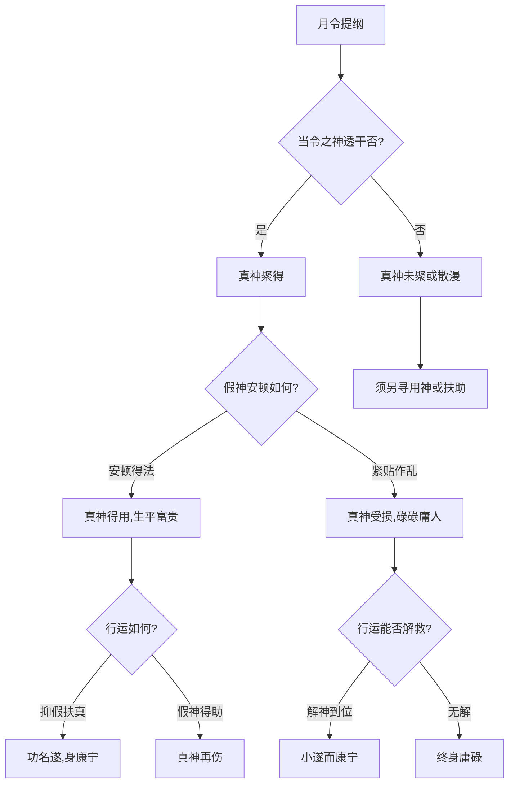

## 真神聚得与用神得用

> 【原文】令上寻其聚得真,假神休要乱真神,真神得用生平贵,用若无为碌碌人。

此四句为全篇之纲。"令"指月令提纲，"聚得真"言月令所藏之本气透出天干而聚于一柱；"假神"乃失时退气之神，即不当令者。"得用"者，真神既立且不为假神破损，复得行运扶助也。全篇义理围绕"真神"二字展开：何为真、何为假，如何辨别真神，如何安顿假神，如何运中扶抑——四者备则富贵可期，四者缺一则庸碌可虑。

> 【原注】如木火透者,生寅月,聚得真,不要金水乱之。真神得用,不为忌神所害则贵。如参以金水猖狂,而用金水,是金水又不得令,徒与木火不和,乃为碌碌庸人矣。

原注举寅月为例：寅为木之禄地、火之长生，若天干透出甲木或丙火，是月令真神透干，故云"聚得真"。此时最忌金水来克泄——金克木、水克火，皆为破坏真神之物。若反用金水，而金水在寅月不得令（春月木旺金囚水休），则金水既无力制木火，反而与真神作对，此为"碌碌庸人"之象。

此段已揭示全篇两大要点：一为"月令聚真"乃真神成立之根本依据；二为"假神破损真神则贵气受碍"。后续任氏之论，皆由此二点生发。

按：原注以寅月木火为例，仅示一隅；任氏注则将此推广为通用法则，凡月令当令之神透干，皆可称"真神"。原注贵在简明切要，任氏贵在系统周密——两者相辅，不可偏废。

## 真假之辨：得时秉令与失时退气

> 【任氏曰】真者,得时秉令之神也;假者,失时退气之神也。言日主所用之神,在提纲司令,又透出天干,谓聚得真,不为假神破损,生平富贵矣。

任氏开篇即给"真""假"下定义："真者得时秉令"——得四时旺气、掌月令司令之神；"假者失时退气"——已过旺时、退处休囚之地。月令提纲为人元司令所在，五行于此处决其旺衰——寅卯月木旺、巳午月火旺、申酉月金旺、亥子月水旺、辰戌丑未月土旺，此即"得令"。

判定真神之关键须二者兼备：一者，所用之神须在月令提纲处当令；二者，当令之神须透出天干（"透出"方为"聚得真"）。前者为根，后者为显。透而不司，犹无根之木，浮而不实；司而不透，犹有根而藏，难以措用。唯有根深而显、真神聚而不散，方可言"聚得真"。

按：任氏此定义较原注更为系统。原注仅以寅月木火为例，任氏则推广为通用法则。后世论"真神"者，多承任氏之定义而衍为定说。

## 假神安顿之法

> 【任氏曰】纵有假神,安顿得好,不与真神紧贴,或被闲神合住,或遥隔无力,亦无害也。

真神既立，假神虽不能绝无（命局中五行杂处，势难尽除），然其安顿得法，亦不碍真神之用。任氏列出三种无害之安顿法：

其一，"不与真神紧贴"——假神与真神隔位而不紧邻，纵有克冲之力亦不能直达。譬如用木火真神，金水假神居于年时而不与木火同柱，中间隔以闲神土之类，此谓隔位无害。

其二，"或被闲神合住"——假神被闲神（不直接影响格局之神）合化，不能再行克冲真神之实。譬如金神为假，原局有乙木合之，则金神贪合忘克，真神木火得安。

其三，"或遥隔无力"——假神虽与真神同局，然其力弱而难施，如春月之金、水处休囚，纵有心克木泄火，亦力有未逮。

此三者之外尚有更深一层：任氏所谓"安顿得好"，非仅消极避害，更须积极扶真——真神所喜之神当令透干，假神所忌之神亦当令制化，此为"抑假扶真"之全功，待下文详论。

按：假神"安顿"之论，前人多略而不详。任氏特立此条，盖因命局组合千变万化，真神常立而假神难除，故安顿之法尤为实用关键。后世论命者多重真神之用而忽假神之安，实则真神得力与否，半由假神安顿是否得法。

## 假神乱真之害

> 【任氏曰】倘与真神紧贴,或相克相冲,或合真神,暗化忌神,终为碌碌庸人矣。

与前节安顿法对看，此节言假神失安之害。任氏列出三种作乱之态：

其一，"与真神紧贴"——假神与真神同柱或相邻，紧贴而力能直达，前节"不紧贴"之效尽失。

其二，"相克相冲"——假神直接克真神（如金克木、水克火），或与真神所居之地支相冲（如寅申冲、卯酉冲），使真神动摇。

其三，"合真神暗化忌神"——此节最为深细。假神合住真神（如乙木合庚金、丁火合壬水），本为合留之象，看似无害；然若所合之神为忌神，则真神反被合化为忌神所用，真神之性尽失。所谓"暗化"者，即真神于不知不觉中失去本来属性，转从忌神之性，此为真神最大之害，亦最难辨识。

按：任氏于"安顿"与"作乱"两节中，反复以"无害"与"碌碌"对举，强调真神用与不用，全在假神处置得法与否。"碌碌庸人"四字，与诗中"用若无为碌碌人"相呼应——庸人与贵人之分，非关命局大小，而在真神是否得用、假神是否得安。

## 行运解神：抑假扶真

> 【任氏曰】如行运得助,抑假扶真,亦可功名小遂,而身获康宁。

此节由"命局"转入"行运"，论大运流年与命局之配合。命局真神既定，若大运得助而抑假神、扶真神，则命主可于运中得益。所谓"得助"者，运中地支为真神所喜（如真神为木火，运至寅卯辰东方木地或巳午未南方火地），天干亦顺真神之意，则真神愈旺。任氏此句用"小遂"二字，意味深长——若命局本佳而运程稍逊，可"小遂"而"康宁"；若命局真神已破，则虽大运亦难救。此即"命好运好，命坏运坏"之常理，亦是命理与运理合参之关键。

> 故喜宜四生,忌神宜四绝,局内看真神,行运看解神。

此为全篇方法论之总诀。"四生"指五行长生所寄之四位地支——亥为甲木长生、寅为丙火戊土长生、巳为庚金长生、申为壬水长生（按阳顺阴逆之规），此四位皆五行生气初萌之处。"四绝"则与"四生"对言，指五行绝处所寄之四位地支（甲绝在申、丙绝在亥、戊绝在亥、庚绝在寅、壬绝在巳），真神之忌神行至此处则气数已尽、不能为害。真神喜走"四生"之地，犹如嫩苗得雨；忌神宜入"四绝"之位，犹如强弩之末。

按：此处"喜宜四生"之"宜"字，当解为"最宜"而非"必宜"——若真神强旺至极，反不喜再生之地，恐过犹不及；若真神稍弱，则四生之运如旱苗得雨。任氏用"宜"字，正留此缓冲之机。

末句"局内看真神，行运看解神"，更为全篇方法论之眼目——命局中重点观察真神之聚散真假，行运中重点观察能否"解"假神之乱。所谓"解神"，即化解假神作乱之神也，或合住假神、或冲散假神、或克去假神，皆为"解"。后文三命造中，第三造壬午运"制化庚金"即为"解神"之实例。

## 三元之法：先天地纪、中天人纪与后之三式

> 【任氏曰】是先天之地纪。所以测地,先看提纲以定格局;中天则为人纪,所以范人,次看人元司令而为用神;后之三式,合而用之,则造化之功成矣。

此节任氏提出"三元"之说，为命理方法论之大框架。所谓"三元"者，乃论命之三个次第，非玄奥之术语：

一者"先天之地纪"——"先看提纲以定格局"。提纲即月令，月令为天地运行之节律所在、五行旺衰之总枢纽，故曰"地纪"（地之纲纪）。由此入手，先定格局之高低（如正官格、七杀格、财格等）。

二者"中天则为人纪"——"次看人元司令而为用神"。"人元"指月令所藏之人元（天干），司令者即其中最得令之神。人元司令者，介于天地与人之间，故曰"人纪"（人之纲纪）。由此入手，定格局中之用神喜忌。

三者"后之三式，合而用之"——前二者既定格局与用神，再合以"三式"方成完整之判断。所谓"三式"者，盖指"审其真假""察其喜忌""究冲合之爱憎"三方面之综合应用（详见下节）。三者合一，则造化之功方成。

按：任氏此节乃方法论之总纲，与前文"真神"之论相为表里——前文论真神之辨、用、运，此节论论命之次第与方法。前者偏于内容，后者偏于程序。后世研命者，往往只重前者而忽略后者，故断命常流于片段；任氏特以"三元"统之，正欲纠此偏。

## 审察四事：真假、喜忌、冲合、岁运

> 【任氏曰】造化功成,则富贵之机定矣;然后再定运程之宜忌,则穷通了然矣。后学者须究三元之正理,审其真假,察其喜忌,究冲合之爱憎,论岁运之宜否,斯为的当。故法度虽可言传,妙用由人心悟也。

此节为治命学者之方法纲要。任氏将"三元之正理"具体化为四事：

其一，"审其真假"——辨别真神假神。详前文"真假之辨"节。

其二，"察其喜忌"——察真神所喜所忌之神，以及格局所喜所忌之运。

其三，"究冲合之爱憎"——此句最为精要。"冲合"者，五行之冲（如六冲：子午冲、丑未冲、寅申冲、卯酉冲、辰戌冲、巳亥冲）与合（如六合：子丑合、寅亥合、卯戌合、辰酉合、巳申合、午未合；以及三合局之半合如申子半合水局等）。"爱憎"者，五行对于冲合之好恶反应也。一般而言：合有合留、合化、合绊之别；冲有冲开、冲散、冲破之异。同为冲合，吉凶转化需视所冲所合之双方为何神而定——若冲去忌神则为吉（如冲去金神以护木神），若冲散真神则为凶（如冲散寅木以破真神）；若合住忌神则为吉，若合住真神则须辨其合化后所从之神为何。

按：此句任氏用"究"字，正言其难。"冲合之爱憎"实为命理中最易混淆、最需精辨之处——非可一概而论，须逐局逐神审之。后世论命者多有"逢冲即凶""逢合即吉"之浅说，任氏此句即针砭此弊。

其四，"论岁运之宜否"——总论大运流年与命局之宜忌。详前文"行运解神"节。

任氏末以"斯为的当"作结，四事并举而穷究之，方为治命之正道。末句"故法度虽可言传，妙用由人心悟"正点出命理之学"理可穷而变无穷"之特性——法则可以言授，而运用之妙则存乎一心。

## 三造示例：真神用事之机

任氏于理论阐述之后，附三命造以证其说。三造皆格局清晰、真神突出，然吉凶各异，正可印证前论真神用与不用之微妙差异。

### 观其一：刘中堂己丑造

> 甲子 丙寅 己丑 甲子
>
> 大运:丁卯 戊辰 己巳 庚午 辛未 壬申
>
> 【任氏曰】山东刘中堂造,己土卑薄,生于春初,寒湿之体,其气虚弱,得甲丙并透,印正官清,聚得真也。柱中金不现而不得化,假神不乱;更喜运走东南印旺之地,仕至尚书,有尊君庇民之德,负经邦论道之才也。

此造己土日主，生于寅月（立春后），木旺土囚，故己土本气卑弱。柱中甲木两透（年干甲、子中藏癸之甲隐，年支子中藏癸——按：四柱干支为甲子、丙寅、己丑、甲子，其中甲木两透于年干与时干），丙火（藏于寅中）亦透——寅月木火皆当令，甲木为正官、克我之异性五行，丙火为正印、生我之同性五行，二者并透，故任氏曰"印正官清"。

此处"印正官清"之"正"非仅"正确"之意，乃"正印、正官"之简称——印为生我者（丙火生己土），官为克我者（甲木克己土），皆"正"而不"偏"，格局清纯无杂之谓。"聚得真"者，月令寅中甲丙皆当令而透干，真神俱聚于命局。

原注"柱中金不现而不得化"一句，需细辨其双层语义：所谓"金不现"者，金神（假神）不见于四柱天干地支之明位，不能直接克破木火真神；所谓"而不得化"者，金虽隐而不现于柱中，亦未为原局木火或其他字所化去，仍保持其金的本性而不被转变为其他五行。合而言之，金处于一种"潜伏而不活动"的状态——既不能主动作乱，亦未被彻底消除，故"假神不乱"也。

按：此处"金不现而不得化"之论，最易误解为"金根本不存于局中"。实则原文明言"不现"（不见于四柱）而非"不在"（不存在），且"不得化"明示金尚未被化去——这是对假神状态的双重描述，不可作单一层理解。

此造关键在于运程：行运丁卯、戊辰、己巳、庚午、辛未、壬申，前四运丁卯（丁火、寅卯木地）、戊辰（戊土、辰为湿土）、己巳（己土、巳火）、庚午（庚金、午火）皆东南木火之地居多，与原局甲丙真神同气相助，故仕至尚书（部长级高官）。"印正官清"之格配合东南木火之运，正"真神得用"之典型。

### 观其二：铁制军丙子造

> 壬申 壬寅 丙子 乙未
>
> 大运:癸卯 甲辰 乙巳 丙午 丁未 戊申
>
> 【任氏曰】铁制军造,杀逞财势,嫩木逢生,最喜寅木真神当令,时干透出乙木元神。寅申之冲,谓之有病。运至南方火地,去申金之病,仕至封疆,声名赫弈。

此造丙火日主，生于寅月。壬水两透（年干壬，月支寅中藏壬），壬水克丙火为七杀（异性相克），故云"杀逞"——壬水当令而势强。申金在年支，丙火克申金为财，故云"财势"——财亦当令而助杀。杀与财皆旺而势强，曰"杀逞财势"。

"嫩木逢生"之"嫩木"非指日主丙火，乃指寅中甲木（藏于寅中不透）。寅木于春初尚嫩，幸得申金（壬水之财）所生之水复来生之——水生木，财滋弱杀，杀制丙火日主，是杀用财生之格。然此造最喜之真神为何？任氏明言"寅木真神当令"。

此处需细辨"寅木真神"之义。寅中藏甲木、丙火、戊土，任氏独取寅木（甲木）为真神，盖因月令为寅，寅之木气当令。春月木旺，寅中甲木为本气，故为真神。配合时干乙木透出（乙木为甲木之同类，乙庚合金，此处乙木合庚金反为绊金之功），真神显露而有力，故云"真神发露"。"元神"者，真神本气之延伸，乙木即甲木之同类元神也。

"寅申之冲"为命局之病——申金在年支，与月支寅木相冲，此即前文所谓"假神作乱"之象。申金为财（耗丙火之物），冲寅木则破真神，故曰"有病"。

然此造终成"封疆"大员（清代制军即总督，管辖一省或数省军政），关键在于运程："运至南方火地"——丙午、丁未运皆南方火地。南方火地可化申金（财）以生寅木（真神），亦可制申金之锐气以缓寅申之冲。所谓"去申金之病"者，即运中火土齐来，化解申金冲寅之病。

按：此造寅申之冲本为"假神乱真"之机，然终能化解者，因运程得力也。此正印证前文"行运看解神"之论——命局有病，运中可解；真神虽受冲而未破，运至火地则护之更力。

### 观其三：庚申年壬子造

> 庚申 戊寅 壬子 甲辰
>
> 大运:己卯 庚辰 辛巳 壬午 癸未 甲申
>
> 【任氏曰】此造日临旺地,会局帮身,不当弱论。喜其时干甲木,真神发露;所嫌者,年遇庚申,冲克甲寅,又逢戊土之助,谓假乱真。虽然早采芹香,屡困秋闱;至壬午运,制化庚金,秋桂高攀,加捐县令;申运冲寅,假神得助,不禄。

此造壬水日主，生于寅月。"日临旺地，会局帮身"——观其四柱：年支申金、月支寅木、日支子水、时支辰土。申、子、辰三合水局（合水之势），壬水日主得三合帮身，故壬水自身不弱。任氏"不当弱论"四字，明示此造壬水虽生于寅月（木旺之时，按通常水于春季处休囚），然因三合水局之成而不以弱看。

"真神"为何？任氏明指"时干甲木，真神发露"——时干甲木，根在月支寅木（寅为甲木之禄地），春月木旺甲木得令，故甲木为真神。所谓"发露"者，言甲木透出于时干，明朗可见也。

"假神"何在？"年遇庚申"——年干庚金克甲木（七杀克身之性引申为克真神），年支申金冲寅木（寅申冲）。庚申并见，从天干地支两面夹击甲寅真神，此即"假乱真"之典型。又兼月干戊土（戊土为甲木之偏财，泄甲木之气而生庚金），助庚金之势而抑甲木之根，是戊土为"假神之党"。

此造之命运如何？"虽然早采芹香，屡困秋闱"——早年考中秀才。"采芹香"本出《诗经·鲁颂·泮水》"思乐泮水，薄采其芹"，后世以"采芹"喻考取秀才入学宫。然多次参加乡试皆未中举。"秋闱"即乡试，因于秋季举行而得名（乡试三年一科，于子卯午酉年八月举行）。"至壬午运，制化庚金，秋桂高攀"——壬午大运，壬水制庚金（食神制杀，壬水克庚金），午火（丁火之禄，兼为庚金之死地）克庚金，庚金被制服而甲木真神得安；"秋桂高攀"喻考中举人（科举以秋试为多，桂喻科第），故任氏云"加捐县令"——未能正途出仕而以捐纳方式得县令之职（清代可由举人加捐知县）。"申运冲寅，假神得助，不禄"——至甲申运，申金再来冲寅木（流年或大运支见申），假神得势而真神被破，故命主卒于此运（"不禄"即不享俸禄，指去世）。

按：此造与前两造对照，前两造真神得用而终身富贵，此造则真神受假神夹击而命运多蹇。"早采芹香"至"秋桂高攀"一段，正命局真神时受时护之历程——运中壬午制化庚金则暂安，运至申金则假神复起而真神被毁。此为前文"假神乱真之害"与"行运解神"二节之活生生印证，亦足见真神假神之消长，全赖运程之转化。

## 此篇在命学体系中

通观全篇，《滴天髓阐微》以"真神"立题，开宗明义为格局判断之第一要务。何谓真神？月令当令而透干者是也。何谓用神？真神不被假神破损者是也。何谓假神？失时退气之神，其安顿得法则无害、其作乱则破格。何以论运？抑假扶真是其纲、喜宜四生忌神宜四绝是其目。全篇理论核心，悉围绕"真"字展开——真神立则格局可定，真神护则富贵可期，真神乱则庸碌可虑。

任氏此论于子平命理体系中具有纲领性意义——前承传统格局学之精髓（真神为月令所主、透干为聚、扶抑为用），后启清代命学系统化之路径（其后命学著作多以真神、用神、格局三者并列为论命骨干）。其论真假之辨、安顿之法、冲合之爱憎，皆为子平命理之关键技术环节，至今仍为研命者所宗。

按：本书论命之法，以月令为提纲、以真神为核心、以格局为骨架、以用神为枢机、以岁运为流转——五者环环相扣，缺一不可。"真神"一篇所论，正此五者之起点也。读者由此篇而入，可窥子平论命之门径；进而研习格局、用神、岁运诸义，方得命学之全貌。