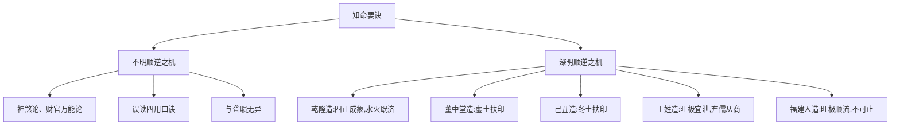

# 知命

## 「要与人间开聋聩」——句式与用字

> 【原文】要与人间开聋聩，顺逆之机须理会。

本篇正文仅十字，但句式紧凑而结构严谨。先看句式：「要与……开聋聩，顺逆之机须理会」是双扇句——上半句立志（「要与人间开聋聩」是目的），下半句立方法（「顺逆之机须理会」是手段），两句之间是「要做什么、靠什么做」的关系。

「开聋聩」三字最重——聋者不闻声、聩者不见事，比喻世人对命理茫然无觉。开聋聩，等于说要破世人对命的两大迷障：一是不能听（不知命中有顺有逆），二是不能见（不知顺逆之机何在）。注家点题便破这两重迷障。

再看用字：「顺逆之机」之「机」字值得留意。「机」是触发点、关窍——机一动，事即发；机不发，事未萌。用「机」不用「理」「数」「势」，正是要把「顺逆」从静态的「道理」提到动态的「关窍」层面——顺逆之机不是用来「知」的，是用来「触发」的；知而不会，等于不知。

## 不知命如聋聩

> 【原注】不知命者如聋聩，知命于顺逆之机而能理会之，庶可以开天下之聋聩。

原注顺接原文，把「开聋聩」再申一遍：「不知命者如聋聩」——这是对原文本义的直接点明；「知命于顺逆之机而能理会之」——这是对原文下半句的方法论翻译；「庶可以开天下之聋聩」——这是对原文上半句「要与人间开」的回扣。

原注用「庶可」二字（「庶几可以」之略）措辞谨慎——不是说「一定可以」开天下聋聩，而是「差不多可以」。这一字之差，把命理学从「必然论」拉回到「或然论」的位置上：知顺逆之机是必要条件，而非充分条件。

## 任氏批判——「用」字根源

> 【任氏曰】此言有至理，惟恐后人学命，不究顺逆之机。妄谈人命，贻误不浅，混看奇格异局，一切神杀，荒唐取用，桃花咸池，专论女命邪淫，受责鬼神；金锁铁蛇，谬指小儿关煞，忧人父母；不论日主之衰旺，总以财官为喜，伤杀为憎，定人终身；不管日主之强弱，尽以食印为福，枭劫为殃，不知财官等名，为六亲取用而列，竟认作财可养命，官可荣身，何其愚也！

任铁樵注解开篇便是一通长篇批判——把当世命学的几大流弊一并扫荡：

| 流弊 | 任氏批评 |
| --- | --- |
| 神煞论 | 「桃花咸池专论女命邪淫」「金锁铁蛇谬指小儿关煞」——以神煞定人邪正关煞，无经典依据 |
| 财官万能论 | 「不论日主之衰旺，总以财官为喜」「不管日主之强弱，尽以食印为福」——把十神当中的一两个绝对化 |
| 误读十神本义 | 「不知财官等名，为六亲取用而列，竟认作财可养命，官可荣身」——把「六亲关系的命名」误读为「命运吉凶的判准」 |

任氏文末一句反诘最有力量——以反证法把「财可养命、官可荣身」的常识性错误一击而溃：若财真能养命，则财多身弱者当为巨富，不该是「富屋贫人」；若官真能荣身，则身衰官重者当为显贵，不该是「夭贱」之辈。

> 【任氏曰】余详考古书，子平之法，全在四柱五行。察其衰旺，究其顺悖，审其进退，论其喜忌，是谓理会。至于奇格异局，神煞纳音诸名目，乃好事妄造，非关命理休咎。若据此论命，必至以正为谬，以是为非，讹以传讹，遂使吉凶之理，昏昧难明矣。书云：「用之为财不可劫，用之为官不可伤，用之印绶不可坏，用之食神不可夺。」此四句原有至理，其要在一「用」字。无知学命者，不究「用」字根源，专以财官为重，不知不用财星尽可劫，不用官星尽可伤，不用印绶尽可坏，不用食神尽可夺。顺悖之机不理会，与聋聩何异，岂能论吉凶、辩贤否，而有功於世哉！反误世惑人者多矣！

任氏第二段注进一步把批判指向「四用不可」的口诀。这四句口诀本身并不错——「用之为财不可劫」等——错的是学命者不究「用」字根源，把口诀读死了。

任氏给出关键判语：**「其要在一『用』字」**——四句口诀之所以能成立，全在「用」字。「用神」是命局中真正起调候、平衡、扶抑作用的那一两个特定十神；「用神为财」，则财不可劫；「用神为官」，则官不可伤。口诀本身没问题，但学命者若不知「用神」是什么、怎么取用，便把口诀读成死律——「专以财官为重」是其一，「不知不用财星尽可劫」是其二。

任氏这一段的核心命题：命学的关键不在十神表面，而在「用神」的辨识；不明「用」字根源，便与聋聩无异。

任氏相较原注的推进：原注在「知命」与「聋聩」之间建立对照，任氏则在「知命」与「误用」之间建立批判——他不只是说「知命」好，而是把「不知命」的各种具体形态一一曝光，让读者看到：误用十神、口诀流弊、神煞论，本质都是不知「顺逆之机」。

## 高宗纯皇帝御造

> 【任氏曰】高宗纯皇帝御造：
>
> 八字：辛卯 丁酉 庚午 丙子
>
> 大运：丙申 乙未 癸巳 壬辰 庚寅 己丑 戊子 丁亥
>
> 天干庚辛丙丁，正配火炼秋金；地支子午卯酉，又配坎离震兑。支全四正，气贯八方，然五行无土，虽诞秋令，不作旺论。最喜子午逢冲，水克火，使午火不破酉金，足以辅主；更妙卯酉逢冲，金克木，则卯木不助午火，制伏得宜。卯酉为震兑，主仁义之真极；子午为坎离，宰天地之中气。且坎离得日月之正体，无消无灭，一润一暄，坐下端门，水火既济。所以八方宾服，四海攸同，金马朱鸢，并隶版图之内，白狼玄兔，咸归覆帱之中，天下熙宁也。

【命造一（任氏曰第3段）】乾隆造：辛卯 丁酉 庚午 丙子

- **日主**：庚金。生于酉月（秋金当令），天干又透辛金，庚辛同气，秋金本应作旺论。但任氏明言「五行无土」——庚金无印（无戊土生金），故不作旺论。
- **七煞**：丁火透出，午火藏丁，丙火透出（年干辛金之官）。丁、丙两火炼庚金——「火炼秋金」是成器之象。
- **地支四正**：子（坎）、午（离）、卯（震）、酉（兑）——四正齐备，「气贯八方」。

任氏的格局判定——

- **子午逢冲**（水克火）：午火本可破酉金（丁火克庚金之根），但子水冲午火，使午火不破酉金——这是「制伏得宜」的第一层。
- **卯酉逢冲**（金克木）：卯木本可生午火（财生煞），但酉金冲卯木，使卯木不助午火——这是「制伏得宜」的第二层。
- 冲的结果：火虽有根（午），但受子水之制；木虽有气（卯），但受酉金之克；庚金得保——这是任氏所说的「最喜」「更妙」两层。

任氏进一步用易学象数阐发——

- 卯酉为震兑，「主仁义之真极」（震为仁、兑为义，仁义之极配于命造，有帝王之象）；
- 子午为坎离，「宰天地之中气」（坎为水、离为火，位居天地之中）；
- 坎离得日月之正体——子为水（月中之精，纳阳）、午为火（日中之精，主明），「无消无灭，一润一暄」——这是日月并明之象；
- 「坐下端门」——日支午为端门（皇城正南之门），「水火既济」——子水在上、午火在下，坎上离下，正是《周易·既济》卦象。

任氏由此定论：「八方宾服，四海攸同，金马朱鸢，并隶版图之内，白狼玄兔，咸归覆帱之中，天下熙宁也。」——这是对乾隆朝「十全武功」「康乾盛世」的命理附会。

【顺逆之机】此造之顺：火炼秋金，成器之象；四正支全，气贯八方；子午卯酉两两相冲，使煞制伏得宜。其逆之机：五行无土，庚金无印——若四柱再见土反而坏事；丁壬合、丙辛合又有合绊之忧——好在冲胜于合，故不忌。

## 董中堂造

> 【任氏曰】八字：庚申 庚辰 戊辰 戊午
>
> 大运：辛巳 壬午 癸未 甲申 乙酉 丙戌 丁亥 戊子
>
> 董中堂造，日干戊土，生于季春午时，似乎旺相，第春时虚土，非比六九月之实也。且两辰蓄水为湿，足以泄火生金，干透两庚，支会申辰，日主过泄，用神必在午火。喜水木不见，日主印绶不伤，精神旺足，纯粹中和。一生宦海无波，三十余年太平相业，直至子运会水局不禄，寿已八旬矣。

【命造二（任氏曰第4段）】董中堂造：庚申 庚辰 戊辰 戊午

- **日主**：戊土。生于辰月（季春土旺），午时生（火生土），看似旺相。
- **任氏关键判定**：「春时虚土，非比六九月之实」——辰月虽是土旺之月，但春令之土「虚」（气未充），不同于六（未月）九（戌月）月之「实土」（气已盛）。这是任氏的一个细腻判法：土旺有「虚实」之别，春土虚、夏秋土实。
- **生克结构**：两辰蓄水（辰为水库），足以泄午火之火、生庚金之金；干透两庚（食神），支会申辰（申子辰不全会，但申辰半会金局）——日主过泄明显（土生金）。
- **用神**：日主过泄，「用神必在午火」——午火为日主之印（戊土之印为丁火、丙火），制庚金（食神）以护身。

任氏给出关键判语——

- 「喜水木不见」——水（财）木（官）皆不见，则日主印绶（午火）不伤，制食神（庚金）之力纯粹；
- 「精神旺足，纯粹中和」——用神（午火）有力而不杂，故命主三十余年太平相业；
- 「子运会水局不禄」——大运至戊子，子辰半会水局，午火（用神）被水冲克而失，寿终八旬。

任氏的相业——「一生宦海无波，三十余年太平相业」——这是对清代某位「董中堂」（尚书或大学士一级）之命造点评。中堂是明清对大学士、尚书等高官的尊称。

【顺逆之机】此造之顺：戊土日主虽虚，得午火实印扶之；午火得辰、申护持不杂；三十年南方火运（午巳等）一路扶印，宦海无波。其逆之机：戊土本质「虚」，须印扶；一旦印受伤（子辰会水冲午），命便终结。任氏点出：命主寿终在子运，正是「顺逆之机」的临界点。

## 己丑辛酉造

> 【任氏曰】八字：辛酉 辛丑 己酉 丙寅
>
> 大运：壬寅 癸卯 甲辰 乙巳 丙午 丁未 戊申 己酉
>
> 此造与上造异曲同工之妙，日干己土，虽诞丑月，然冬土寒湿，非比六九月之温煦。且丑中蓄水含金，干透两辛，支会丑酉，日主过泄，用神必在丙火。喜时中寅木，九寒回阳，丙火有根。人极纤美灵秀，早运壬癸，书香有阻，将来巳午未南方火地，前程未可限量。(新增)

【命造三（任氏曰第5段）】己丑辛酉造：辛酉 辛丑 己酉 丙寅（标注「新增」）

- **日主**：己土。生于丑月（季冬），丙寅时（火生土、木助火）。
- **任氏关键判定**：「冬土寒湿，非比六九月之温煦」——冬令之土「寒湿」（气敛而湿重），不同于六（未月）九（戌月）月之「温煦」（气和而温润）。这是任氏继春土「虚」之后，对冬土「寒湿」的进一步细分。
- **生克结构**：丑中蓄水（丑为水库）、含金（丑藏辛），干透两辛（食神），支会丑酉（半会金局）——日主过泄。
- **用神**：日主过泄，「用神必在丙火」——丙火为日主之印，制两辛（食神）以护身。
- **时支寅木**：「九寒回阳，丙火有根」——寅中藏甲木、丙火，寅为丙火之长生——这是冬寒之中的一线阳气，使丙火有根而不虚。

任氏的格局判定——

- 「与上造异曲同工之妙」——和董中堂造（戊土、辰月、午火用神）同属「日主过泄、用神在印」一格；
- 「人极纤美灵秀」——冬土寒湿而得丙火温煦，气质清雅；
- 「早运壬癸，书香有阻」——壬癸水运（壬寅、癸卯）水克火，印绶受伤，读书运不佳；
- 「将来巳午未南方火地，前程未可限量」——巳午未南方火运，印绶得力，前程远大。

任氏特别标注「(新增)」二字——这是任铁樵补入的案例，与董中堂造相互印证「冬土寒湿扶印」之法。

【顺逆之机】此造之顺：冬土寒湿得丙火温煦、得寅木回阳；己土虽弱，用神（丙火）有力。其逆之机：早运壬癸（壬寅、癸卯），水克丙火用神，故「书香有阻」；中晚年入南方火运，印绶得力，前程方显。顺逆之机，在大运流转中显见。

## 同邑王姓造

> 【任氏曰】八字：壬辰 壬寅 甲寅 庚午
>
> 大运：癸卯 甲辰 乙巳 丙午 丁未 戊申 己酉 庚戌
>
> 同邑王姓造。俗以身强杀浅论，取庚金为用，谓春木逢金，必作栋梁之器，劝其读书必发；至三旬外，不但读书未售，而且家业渐销，嘱余推之。观其支坐两寅，乘权当令，干透两壬，生助旺神，年支之辰土，乃水之库，木之余气，能蓄水养木，不能生金，一点庚金，休囚已极，且午火敌之，壬水泄之，不惟无用，反为生水之病。大凡旺之极者，宜泄而不宜克，宜顺其气势，弗悖其性也。以午火为用，将来运至火地，虽不贵于名，定当富于利，如再守芸窗，终身误矣。彼即弃儒就经营，至丙午运，克尽庚金之病，不满十年，发财十余万，则庚金为病明矣。

【命造四（任氏曰第6段）】王姓造：壬辰 壬寅 甲寅 庚午

- **日主**：甲木。生于寅月（春木当令），支坐两寅（卯不全会，但寅寅自刑旺），干透两壬（印绶生身）——身强旺。
- **俗论**：「身强杀浅论，取庚金为用」——俗以七煞庚金为用神，谓「春木逢金，必作栋梁之器，劝其读书必发」。
- **事实**：命主三旬外「读书未售，家业渐销」——俗论不应。

任氏的格局判定——

- 「支坐两寅，乘权当令」——寅月、寅日、寅时，三寅拱木，身极强旺；
- 「干透两壬，生助旺神」——壬水印绶生甲木，更增其势；
- 「年支之辰土，乃水之库，木之余气」——辰藏戊土（水的墓库）、乙木（春木余气）；
- 「能蓄水养木，不能生金」——辰土虽为土，但本造中只能蓄水、养木，不能作为金的印绶（因为金无根）；
- 「一点庚金，休囚已极」——庚金在春令（寅月）处绝地（寅卯辰为春，金处休囚），又无印生（辰土不生金），「休囚已极」；
- 「且午火敌之，壬水泄之」——午火（财）克庚金（七煞）、壬水（印）泄庚金（食伤），庚金两面受敌；
- 「不惟无用，反为生水之病」——庚金本为七煞（克身），但在本造中反而生壬水（印），间接助日主之旺——「七煞」反而成了「生印之源」的病。

任氏由此提出通用判法——

- **「大凡旺之极者，宜泄而不宜克」**——日主旺到极处（两寅乘权、两壬生助），克之不动、反激起其势；
- **「宜顺其气势，弗悖其性也」**——顺应旺神之势，方为正途；
- **「以午火为用」**——午火为甲木之财（甲乙木之财为戊己土，但午藏丁火、己土，丁火为伤官、己土为正财），此处取午火为泄秀之神（木生火，泄其旺气）。

任氏的应期——

- 「将来运至火地，虽不贵于名，定当富于利」——火地（巳午未）引出午火用神，泄秀发财；
- 「如再守芸窗，终身误矣」——若命主继续走读书科举之路，违背顺其气势之理，将终身困顿；
- 「至丙午运，克尽庚金之病，不满十年，发财十余万」——命主弃儒就商，至丙午运（午火到位、丙火透出），庚金（七煞病根）被克尽，不满十年发财十余万。

【顺逆之机】此造之关键：俗论取庚金为用（克身之煞），任氏判庚金为病（克身反助印）。两种判法的根本差异在于——俗论只看到「身强杀浅」的表面，任氏看到「旺之极者宜泄不宜克」的深层规律。命主一生转折在「弃儒就商」——这是顺逆之机在人事层面的体现：命局中的「用神」（午火）须在人事上得到响应（弃文从商），方可应吉。

## 福建人造

> 【任氏曰】八字：癸酉 甲子 癸亥 辛酉
>
> 大运：癸亥 壬戌 辛酉 庚申 己未 戊午 丁巳 丙辰
>
> 此福建人不知姓氏，庚午冬，余推之，大取金水运，不取火土。彼曰：金水旺极，何以又取金水？则命书不足凭乎？书曰：「旺则宜泄宜伤」，今满局金水，反取金水，是命书无凭矣。余曰：命书何为无凭？皆因不能识命中五行之奥妙耳。此造水旺逢金，其势冲奔，一点甲木枯浮，难泄水气，如止其流，反成水患，不若顺其流为美。初运癸亥，助其旺神，荫庇有余；一交壬戌，水不通根，逆其气势，刑耗并见；辛酉庚申，丁财并旺；己未戊午，逆其性，半生事业，尽付东流，刑妻克子，孤苦无依。此所谓「昆仑之水，可顺而不可逆也」。顺逆之机，不可不知也。

【命造五（任氏曰第7段）】福建人造：癸酉 甲子 癸亥 辛酉

- **日主**：癸水。生于子月（冬水当令），干透癸水（年干），时干辛金（印绶）。
- **生克结构**：癸癸两透（年、日），子亥两见（时支亥、月支子），酉辛金局（年支酉、时支酉、时干辛）——满盘金水。
- **俗论质疑**：「金水旺极，何以又取金水？」——既然金水旺极，为什么用神仍是金水？命书说「旺则宜泄宜伤」，应当取木火泄秀，方合书理。

任氏的格局判定——

- 「水旺逢金，其势冲奔」——金生水，金水相涵，气势奔流；
- 「一点甲木枯浮，难泄水气」——时支子中藏癸水，月支子中藏癸水，年干癸水——满局水势，一点甲木（食神，泄水之气）无力承担「泄秀」之任；
- 「如止其流，反成水患」——若用木火（泄秀为用），等于在急流中筑坝，水势冲决反而成灾；
- 「不若顺其流为美」——顺其金水旺势，方为正途。

任氏的应期——

- 「初运癸亥，助其旺神，荫庇有余」——童少年走水运（癸亥、壬戌），水势更盛，但命主出身世家，得荫庇；
- 「一交壬戌，水不通根，逆其气势，刑耗并见」——壬戌运，戌为火土之库，水不通根，金水旺势受挫，刑耗并见；
- 「辛酉庚申，丁财并旺」——金运（辛酉、庚申），金水并旺，丁火（癸水之正财）、财星并旺；
- 「己未戊午，逆其性，半生事业，尽付东流」——火土运（己未、戊午），逆金水之势，事业尽毁；
- 「刑妻克子，孤苦无依」——火土运中，金水被逆，六亲皆伤。

任氏最后以形象比喻收束——「此所谓『昆仑之水，可顺而不可逆也』」——昆仑之水喻金水旺势之不可挡；顺之则荫庇财旺，逆之则刑耗孤苦。

【顺逆之机】此造之关键：俗论依「旺则宜泄宜伤」之书理，主张取木火用神；任氏据具体命局判「水旺逢金其势冲奔」，主张顺其金水之势。两种判法的差异在于——「旺则宜泄」是普遍原理，但具体命局中「泄」是否可行，须看泄秀之神（甲木）是否有足够力量承担。在本造中，甲木枯浮无力，若强用木火，等于「止其流」反成水患；顺其金水之势方为正途。

这是本篇最重要的「顺逆之机」实证——同一个原则（旺则宜泄）在不同命局中可以有截然相反的应用：乾隆造中水火既济成象、董中堂造中扶印成格、己丑造中冬土扶印、王姓造中顺泄得财、福建人造中顺气得荫——五造共用「顺逆之机」之法，而具体何为顺、何为逆，须视日主旺衰、气势走向、用神强弱而定。

**本篇为《滴天髓》上篇通神论系列之一，专论「知命」——亦即命学家自身的认识论问题。** 任铁樵一面批判时弊（神煞论、财官万能论、四用口诀的误读），一面以乾隆、董中堂、己丑、王姓、福建人五造实证「顺逆之机」的具体应用。五个命造环环相扣——乾隆造论四正成象、董中堂造论虚土扶印、己丑造论冬土寒湿、王姓造论旺极宜泄、福建人造论旺极顺流——共同呈现「顺逆之机」这一核心命题在不同命局中的多元应用。任氏以「与聋聩何异」一句作核心反诘，把命学从「技艺」层面提升到「明理」层面——不知「顺逆之机」，纵然记住千百口诀，亦不过一聋聩之人。
