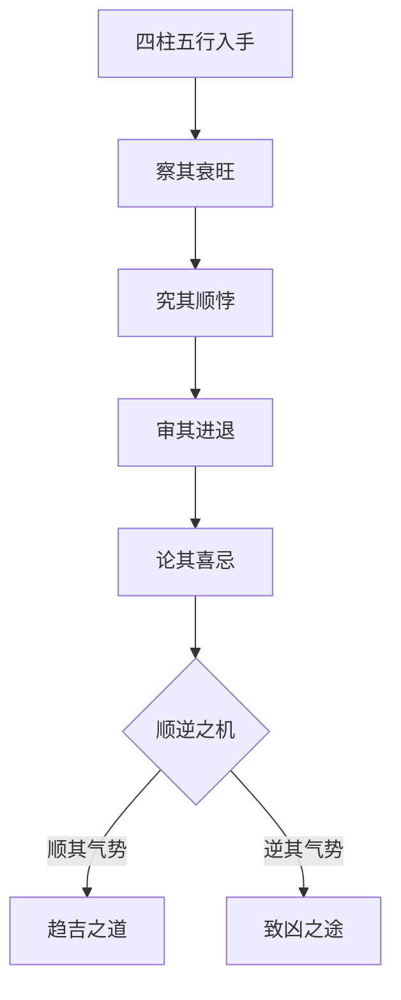

## 知命之旨

> 要与人间开聋聩，顺逆之机须理会。

此开篇二句，乃全篇之纲。"要与人间开聋聩"立言宗旨，"顺逆之机须理会"标举枢要。聋聩者，不闻不辨之喻——不知命理则行事盲目，如聋者不闻声、聩者不辨色。命学之要，在于使人察识五行盈虚消长、阴阳进退之理，而能顺其性、逆其势以趋吉避凶。此二句以"要"字领起全篇大义，以"须理会"三字作警醒语，诫学者不可浅尝辄止。

## 顺逆枢机

"顺逆之机"四字为全篇眼目，亦是子平命理最精微处。何谓顺？五行气势流通、命局喜神与日主之气相生相扶，即是顺。何谓逆？用神被克、喜神受伤、气势阻隔不通，即是逆。任铁樵于注中反复申说此义，谓"顺逆之机不理会，与聋聩何异"，可见此四字分量之重。

> 【原注】不知命者如聋聩，知命于顺逆之机而能理会之，庶可以开天下之聋聩。

原注以"知命于顺逆之机而能理会之"一句作正面阐释，承接开篇之喻。言下之意：知命不在于记诵神煞名目、拘执格局格式，而在理会五行顺逆之机——气当顺者顺之，气当逆者逆之。"理会"之关键不在"命"之表面，而在"机"之几微。机者，吉凶萌动之际也。

## 针砭俗学

> 【任氏曰】此言有至理，惟恐后人学命，不究顺逆之机。

任铁樵开篇即叹"此言有至理"，随即列举当时命学之数大弊端。

> 妄谈人命，贻误不浅，混看奇格异局，一切神煞，荒唐取用，桃花咸池，专论女命邪淫，受责鬼神；金锁铁蛇，谬指小儿关煞，忧人父母；

此段列举俗学之误，可分四端：
- **混看奇格异局**：不审日主衰旺、气势顺逆，专以格局套论；
- **神煞妄用**：桃花、咸池、金锁、铁蛇诸煞，拘执为命理定规；
- **女命邪淫之说**：以桃花咸池专论女命贞淫，受责鬼神之虚妄；
- **小儿关煞之谬**：以金锁铁蛇谬指小儿关煞，徒增父母之忧。

四端之病根相同：皆不究五行顺逆之机，舍本逐末，取其形而遗其神。

> 不论日主之衰旺，总以财官为喜，伤杀为憎，定人终身；不管日主之强弱，尽以食印为福，枭劫为殃，不知财官等名，为六亲取用而列，竟认作财可养命，官可荣身，何其愚也！

此段更深一层，抉出俗学第二大病根：**不知"用"字真义**。世俗论命，见财便以为吉、见官便以为荣，不知财官之用须视日主能否任之。日主强则财官为吉、为用；日主弱则财官反为克泄、为我所不胜之祸患。任氏于此下一"愚"字，痛斥之深可见一斑。

> 如财可养命，则财多身弱者，不为富屋贫人，而成巨富；官可荣身，则身衰官重者，不至夭贱，而成显贵。

此以反诘作证，逻辑严密：若"财可养命"为定规，则财多身弱之命应皆富；若"官可荣身"为定规，则身衰官重之命应皆贵。然事实上财多身弱多为富屋贫人、身衰官重多夭贱。足证俗学之谬。

## 子平正法

> 余详考古书，子平之法，全在四柱五行。察其衰旺，究其顺悖，审其进退，论其喜忌，是谓理会。

此段为子平正法之总纲，十六字诀可拆为四步功夫：

| 步骤 | 字诀 | 义涵 |
|------|------|------|
| 一 | 察其衰旺 | 审视日主及五行旺衰强弱 |
| 二 | 究其顺悖 | 明辨气势流通与阻隔 |
| 三 | 审其进退 | 观察行运引动之方向 |
| 四 | 论其喜忌 | 判定用神喜忌与吉凶 |

四步功夫，由静至动，由察至论，层层推进。"察"为入手，"究"为深入，"审"为变通，"论"为归结。此即任氏所谓"理会"之真义。其推演之序，可观下图：

```mermaid
flowchart TD
    A[四柱五行入手] --> B[察其衰旺]
    B --> C[究其顺悖]
    C --> D[审其进退]
    D --> E[论其喜忌]
    E --> F{顺逆之机}
    F -->|顺其气势| G[趋吉之道]
    F -->|逆其气势| H[致凶之途]
```

> 至于奇格异局，神煞纳音诸名目，乃好事妄造，非关命理休咎。若据此论命，必至以正为谬，以是为非，讹以传讹，遂使吉凶之理，昏昧难明矣。

承接上文"理会"之义，反面申说：奇格异局、神煞纳音等名目，皆为"好事妄造"，与命理休咎无关。若据此论命，必然"以正为谬，以是为非"——吉凶之理反致昏昧。此与前文"混看奇格异局"前后呼应，一正一反，将子平正法与俗学之别抉发无遗。

## 四用之诀

> 书云："用之为财不可劫，用之为官不可伤，用之印绶不可坏，用之食神不可夺。"此四句原有至理，其要在一"用"字。

此四句为子平命理之钥，关键全在一"用"字。所谓"用"者，即命局所喜、所赖之五行——可能是财、可能是官、可能是印绶、可能是食神，须视日主强弱、格局需要而定，**不可执一端而定终身**。

> 无知学命者，不究"用"字根源，专以财官为重，不知不用财星尽可劫，不用官星尽可伤，不用印绶尽可坏，不用食神尽可夺。

此段揭示"用"字之反面义：若财非命局所用，则劫之无害；若官非命局所用，则伤之无妨；若印非命局所用，则坏之无碍；若食非命局所用，则夺之无损。关键在判别"用"与"不用"——而非一见财官印食便以为是吉神。

> 顺悖之机不理会，与聋聩何异，岂能论吉凶、辨贤否，而有功於世哉！反误世惑人者多矣！

收束全段，重提前文"顺逆之机"之旨。不理会顺悖之机而妄论吉凶，与聋聩何异？其结果不是"有功于世"，反而"误世惑人"——害己害人，贻误不浅。

## 御造四正

> 辛卯 丁酉 庚午 丙子
> 大运：丙申 乙未 甲午 癸巳 壬辰 辛卯 庚寅 己丑
> 天干庚辛丙丁，正配火炼秋金；地支子午卯酉，又配坎离震兑。

乾隆御造，天干庚辛（金）丙丁（火）并列，地支子（水）午（火）卯（木）酉（金）全四正——子为坎、午为离、卯为震、酉为兑，位居四方之正。此造天干地支皆成对仗，气象宏大，非寻常命造可比。

> 支全四正，气贯八方，然五行无土，虽诞秋令，不作旺论。

注家点出关键：虽日主庚金诞于酉月（秋金当令），但命局五行独缺土——金无土则无所生、无所附，故不作旺论。此为"不执月令定旺衰"之活法。

> 最喜子午逢冲，水克火，使午火不破酉金，足以辅主；更妙卯酉逢冲，金克木，则卯木不助午火，制伏得宜。

此造核心在于两组对冲之妙用。表面看，午火（丁火之根）克酉金（庚金之根），对日主不利；卯木（庚金所克）生午火，又助火势。然而：
- **子午冲**：子水克午火，制火以护金；
- **卯酉冲**：酉金克卯木，制木以断火源。

两组冲战相互配合，形成制化得宜之妙局——表面是相克不利之象，深处是辅主护主之机。此即"顺逆之机"的精微运用：不看表面之克，而看气势之流通。

> 卯酉为震兑，主仁义之真极；子午为坎离，宰天地之中气。且坎离得日月之正体，无消无灭，一润一暄，坐下端门，水火既济。

此段由命理推及天地之道。震（卯木）为仁之极，兑（酉金）为义之极，仁义相辅；坎（子水）离（午火）为天地中气，日月之正体——坎为月、离为日，一润一暄，无消无灭。"坐下端门"指命主所坐之位（中天帝座），水火既济——《易·既济》之象，阴阳和合、天下太平。

> 所以八方宾服，四海攸同，金马朱鸢，并隶版图之内，白狼玄兔，咸归覆帱之中，天下熙宁也。

末段由命主推及治世：八方宾服、四海归一、天下熙宁。此为御造之特殊处——其命理格局与帝王治世相应，"顺逆之机"在此造中表现为气势调和、阴阳各得其位。

## 董造弱主

> 庚申 庚辰 戊辰 戊午
> 大运：辛巳 壬午 癸未 甲申 乙酉 丙戌 丁亥 戊子
> 日干戊土，生于季春午时，似乎旺相，第春时虚土，非比六九月之实也。

董中堂造，日干戊土，生于辰月（季春）、午时。表面看，土生辰月（辰为土之墓库）、得午火生，似乎旺相。然注家点出关键：**春时土虚，非比六九月之实**。三月之土虽有其名，实则气寒土薄，不能与六（未月）九（戌月）之实土相比。

> 且两辰蓄水为湿，足以泄火生金，干透两庚，支会申辰，日主过泄，用神必在午火。

进一步分析：
- 两辰藏水（辰为水之库），蓄水为湿，泄日主之火气；
- 干透两庚（金），支会申辰（金局），日主之土气被金所泄；
- 午火虽生土，但亦被水所泄、力有不逮。

综合而论，日主**过泄**——土气被金水层层抽剥。此时用神不能再取泄日主之五行，而须取午火扶助日主。**"过泄用印"**——印绶（午火）在此为扶身之要。

> 喜水木不见，日主印绶不伤，精神旺足，纯粹中和。一生宦海无波，三十余年太平相业，直至子运会水局不禄，寿已八旬矣。

命局喜忌：喜火（扶身）、忌水（泄身）、忌金（耗身）、忌木（克身，因木克土）。此造水木不见，印绶（午火）不受伤，故"精神旺足、纯粹中和"。

行运验证：
- 辛巳、壬午、癸未——前运虽有水木透出，但巳午未南方火地制之，仕途平稳；
- 甲申、乙酉、丙戌——甲乙木虽为忌，但申酉金运泄木，丙戌火土助身；
- 丁亥——丁火虽助身，但亥水冲巳，水势渐盛；
- **戊子**——子辰会水局，水势大盛，冲克午火（用神），日主失助，故"不禄"。

"寿已八旬"——古人能至八十，已为高寿，且一生"太平相业"无风波，正应"纯粹中和"之命。

## 寒土回阳

> 辛酉 辛丑 己酉 丙寅
> 大运：壬寅 癸卯 甲辰 乙巳 丙午 丁未 戊申 己酉
> 此造与上造异曲同工之妙，日干己土，虽诞丑月，然冬土寒湿，非比六九月之温煦。

对比董造，日干己土，生于丑月（季冬）。丑月之土寒湿，与六（未）九（戌）月之温煦有本质区别——冬土非但无生助之力，反而冻结日主，使其难以施用。

> 且丑中蓄水含金，干透两辛，支会丑酉，日主过泄，用神必在丙火。喜时中寅木，九寒回阳，丙火有根。

此造与董造病机相似：
- 丑中蓄水含金，土气被泄；
- 干透两辛（金），支会丑酉（金局），日主受金之泄；
- 日主过泄，用神必在丙火（扶身）。

然与董造不同的是，此造时支有**寅木**——寅为丙火之根（寅中藏甲丙戊），"九寒回阳"即指寅木生火，使冬日之寒土得暖气回生。

> 人极纤美灵秀，早运壬癸，书香有阻，将来巳午未南方火地，前程未可限量。

命主气质"纤美灵秀"——金水秀气透出所致。早运壬癸（水运）助水势，克制用神（丙火），故"书香有阻"（科举不顺）。然此后巳午未南方火地，火势渐盛，克制金水、扶助日主，"前程未可限量"。

两造（董造与对造）同显"弱主用印"之理，皆为过泄之局、用神在火。然一为春土（虚）、一为冬土（寒），病机虽同而浅深有别——春土尚有微阳，冬土则须"九寒回阳"之力更重。

## 旺极宜泄

> 壬辰 壬寅 甲寅 庚午
> 大运：癸卯 甲辰 乙巳 丙午 丁未 戊申 己酉 庚戌
> 俗以身强杀浅论，取庚金为用，谓春木逢金，必作栋梁之器，劝其读书必发；至三旬外，不但读书未售，而且家业渐销，嘱余推之。

王姓造，壬辰、壬寅、甲寅、庚午——日主甲木，生于寅月（孟春），地支两寅（甲木之禄地），干透两壬（水生木），甲木气势极旺。时柱庚金为七杀，表面看"身强杀浅"——日主强、杀弱，宜取庚金为用神（以杀制身），劝其读书求功名。

然事实相反："至三旬外，不但读书未售，而且家业渐销"——功名不就、家业凋零。命主请任氏推命。

> 观其支坐两寅，乘权当令，干透两壬，生助旺神，年支之辰土，乃水之库，木之余气，能蓄水养木，不能生金，一点庚金，休囚已极，且午火敌之，壬水泄之，不惟无用，反为生水之病。

任氏细审此造：
- 日主甲木**极旺**——支坐两寅（禄地），乘当令之气；干透两壬（水），生助旺神；
- 庚金（七杀）虽透时干，**休囚已极**——年支辰土为水之库、木之余气，只能蓄水养木，不能生金；
- 庚金之衰：午火（克金）、壬水（泄金）夹击——庚金被克被泄，毫无生气；
- **庚金不仅无用，反为生水之病**——庚金生壬水，壬水生甲木，庚金的存在反而助旺了日主。

> 大凡旺之极者，宜泄而不宜克，宜顺其气势，弗悖其性也。以午火为用，将来运至火地，虽不贵于名，定当富于利，如再守芸窗，终身误矣。

此段为"顺逆之机"之正论。**"旺之极者，宜泄而不宜克，宜顺其气势，弗悖其性"**——日主旺极之时，不可强行克制（克则激化），只可顺其气势、顺势泄化。

此造之"顺"：
- 甲木极旺，宜取午火（泄木之气）——食神泄秀，生财有道；
- 忌取庚金——庚金既衰，又助水势，不仅无用反为累。

故任氏断言："以午火为用，将来运至火地，虽不贵于名，定当富于利"——火地助午火之势，木气得泄则生财，故富而不贵。

> 彼即弃儒就经营，至丙午运，克尽庚金之病，不满十年，发财十余万，则庚金为病明矣。

命主听从任氏建议，弃儒从商。丙午运——丙火透干、午火当旺，庚金之病被"克尽"（制去），"不满十年，发财十余万"。铁案如山，足证庚金为病、午火为用之判精准。

## 顺流之美

> 癸酉 甲子 癸亥 辛酉
> 大运：癸亥 壬戌 辛酉 庚申 己未 戊午 丁巳 丙辰
> 庚午冬，余推之，大取金水运，不取火土。彼曰：金水旺极，何以又取金水？则命书不足凭乎？

闽人造，癸酉、甲子、癸亥、辛酉——日主癸水，生于子月（仲冬），地支酉亥酉（金水），干透癸辛（金水），金水之势极旺。

任氏批命：**大取金水运，不取火土**。命主疑惑：金水已经旺极，为何还要取金水？这不是"命书不足凭"吗？

> 书曰："旺则宜泄宜伤"，今满局金水，反取金水，是命书无凭矣。余曰：命书何为无凭？皆因不能识命中五行之奥妙耳。

注家先引书云"旺则宜泄宜伤"——表面看，此造金水旺极，应取火（泄金）或木（泄水）制化。然任氏反取金水，看似与书相悖，实则不然。

> 此造水旺逢金，其势冲奔，一点甲木枯浮，难泄水气，如止其流，反成水患，不若顺其流为美。

关键分析：
- 此造**水旺逢金**——金生水，金水相联，气势冲奔，不可阻遏；
- 一点甲木（时干）浮于地，**枯浮难泄水气**——木气单薄，不足以制水；
- **若强行止水（取木或土制水）**——"反成水患"，如筑堤防洪而堤溃；
- **不若顺其流**——顺水之性，使其自然流布，反为安稳。

> 初运癸亥，助其旺神，荫庇有余；一交壬戌，水不通根，逆其气势，刑耗并见；辛酉庚申，丁财并旺；

行运验证：
- **癸亥运**（初运）——助水之旺神，命主得荫庇，平安顺遂；
- **壬戌运**——戌为土库，土克水，**逆其气势**，故"刑耗并见"（灾祸破财）；
- **辛酉、庚申运**——金运助水，金水流通，丁（人丁）财并旺。

> 己未戊午，逆其性，半生事业，尽付东流，刑妻克子，孤苦无依。

后半生行运：
- **己未、戊午运**——火土运，逆水之性，水火交战，局势逆转；
- "半生事业，尽付东流"——前半生积累付之东流；
- "刑妻克子，孤苦无依"——家破人亡之象。

> 此所谓"昆仑之水，可顺而不可逆也"。顺逆之机，不可不知也。

末句以"昆仑之水"作喻——昆仑山为大水之源，其势冲奔而下，不可逆、只可顺。**"顺逆之机，不可不知"**——再点全篇主旨。

## 通篇之旨

五则命例自御造之精微、至臣工之纯粹、再至庶民之贫富吉凶，层层展开"顺逆之机"于不同命局：

| 命例 | 日主 | 病机 | 用神 | 顺逆之机 |
|------|------|------|------|----------|
| 乾隆御造 | 庚金 | 极旺无土，四正兼收 | 午火（成于冲中） | 子午冲、卯酉冲制化得宜 |
| 董中堂造 | 戊土 | 春虚过泄 | 午火 | 火扶弱主，水木不见 |
| 对比造 | 己土 | 冬寒过泄 | 丙火 | 寅木回阳，暖气滋生 |
| 王姓造 | 甲木 | 极旺杀弱 | 午火 | 泄秀生财，顺木之性 |
| 闽人造 | 癸水 | 金水极旺 | 金水 | 顺水之流，不可逆止 |

五造涵盖命理诸种格局——极旺、极弱、中和、特殊（御造），共同点在于**皆不离"顺逆之机"四字**。知此，则命理之学可得其门而入；不知此，则虽记诵万卷，亦与聋聩无异。

> 不知命者如聋聩，知命于顺逆之机而能理会之，庶可以开天下之聋聩。

原注以"庶可以开天下之聋聩"作结，立意高远——命理之学非为个人吉凶之问，而为开化世人、破除迷信之具。任铁樵承此意，于注中反复申说俗学之弊、四用之诀、顺逆之机，皆在使学者"知命"而非"误命"。开篇二句"要与人间开聋聩，顺逆之机须理会"作总纲，末段"顺逆之机，不可不知也"作收束，前后呼应，全篇血脉一贯。