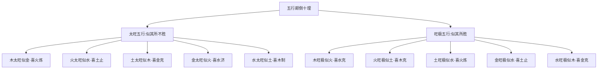

# 衰旺

## 衰旺之真机

> 【原文】能知衰旺之真机，其于三命之奥，思过半矣。

《滴天髓》本篇以"知衰旺之真机"为论旨，并把掌握衰旺视为通达命理奥义的关键。原文明言"思过半矣"——衰旺之理若能通透，命理大半义理都可由此推演。这是本篇作为方法论的总纲地位。

> 【原注】旺则宜泄宜伤，衰则喜帮喜助，子平之理也。然旺中有衰者存，不可损也；衰中有旺者存，不可益也。旺之可损，以损在其中矣；衰之极者不可所当损者而损之，反凶；实所当益者而益之，反害，此真机，皆能知之，又何难于详察三微奥乎？

原注首句确立基本法则："旺则宜泄宜伤，衰则喜帮喜助"——这是子平命理取用神的根本法则（扶抑法）。但原注随即点出三段进阶：
- 旺中有衰者存，不可损——过旺之中有弱者要保留；
- 衰中有旺者存，不可益——过衰之中有强者要保留；
- 衰之极者，不可损反凶，不可益反害——极衰极旺之处，常法失灵。

原注末尾点明：能知此真机，则"三微奥"（三命之微妙）不难详察。

## 任氏对"得令失令"死法的批判

> 【任氏】得时俱为旺论，失令便作衰看，虽是至理，亦死法也。夫五行之气，流行于四时，虽日干各有专令，而其实专令之中，亦有并存者在，如春木司令，甲乙虽旺，而此时休囚之戊己，亦未尝绝于天地也；冬水司令，壬水虽旺，而此时休囚之丙丁，未尝绝于天地也。

任铁樵开篇就挑战"得令为旺、失令为衰"这一通行法则：虽是至理，但是死法。他以"五行之气流行于四时"立论：春木司令时甲乙虽旺，但休囚的戊己土也未尝绝于天地；冬水司令时壬水虽旺，但休囚的丙丁火也未尝绝于天地。这就是说，休囚不等于无气，得令不等于独旺。

> 【任氏】物时当退避，不敢争先，而其实春土何尝不生万物，冬日何尝不照万国乎？况八字虽以月令为重，而旺相休囚，年日时中，亦有损益之权，故生月即不值令，亦能值年值日值时，岂可执一而论？

任氏以两个反诘句立论：春土（休囚）何尝不生万物？冬日（休囚）何尝不照万国？这就把"得令"从唯一标准降为"重要参考"——年日时支的五行"值年值日值时"也有损益之权。生月虽不值令，也可能在年日时中得令得气。任氏强调"岂可执一而论"。

> 【任氏】有如春木虽强，金太重而木亦危；干庚辛而支申酉，无火制而不富，逢土生而必夭，是得时不旺也。秋木虽弱，木根深而木亦强，干甲乙而支寅卯，遇官透而能受，逢水生而太过，是失时不弱也。

任氏以春木、秋木两组正反对照立论：
- 春木虽强（得令），若金太重（庚辛透干、申酉在地支），木反危——无火制金不富、逢土生金必夭。这是"得时不旺"；
- 秋木虽弱（失令），若根深（寅卯在地支），木亦强——遇官杀能承受、逢水生则太过。这是"失时不弱"。

得时不一定旺，失时不一定衰——关键在五行之"根"。

> 【任氏】是故日干不论月令休囚，只要四柱有根，便能受财官食神而当伤官七杀。长生禄旺，根之重者也；墓库余气，根之轻者也。天干得一比肩，不如地支得一余气墓库。墓者，如甲乙逢未，丙丁逢戌，庚辛逢丑，壬癸辰之类是也。余气者，如丙丁逢未，丙丁逢戌，庚辛逢丑，壬癸逢辰之类是也。

任氏确立"四柱有根"是判断日主能否任财官食神、能否当伤官七杀的核心标准。根有两类：
- 长生禄旺（寅申巳亥之类四生四禄之地）——根之重者；
- 墓库余气（辰戌丑未四库之地）——根之轻者。

任氏特别指出"天干得一比肩，不如地支得一余气墓库"——天干比肩是"朋友相扶"，地支余气是"家室可托"，根之实在胜于比肩之虚。这就把"根"具体到十二长生体系中：
- 墓：如甲乙逢未、丙丁逢戌、庚辛逢丑、壬癸逢辰；
- 余气：如丙丁逢未、甲乙逢辰、庚辛逢戌、壬癸逢丑之类。

> 【任氏】得二比肩，不如支中得一长生禄旺，如甲乙逢亥寅卯之类是也。盖比肩如朋友之相扶，通根如家室之可托，干多不如根重，理固然也。今人不知此理，见是春土夏水秋木冬火，不问有根无根，便谓之弱：见是春木夏火秋金冬水，不究克重克轻，便谓之旺，更有壬癸逢辰，丙丁逢戌，甲乙逢未，庚辛逢丑之类，不以为通根逢库，甚至求刑冲以开之，竟不思刑冲伤吾本根之气。此种谬论，必宜一切扫除也。

任氏再加一锤：得两个比肩（天干），不如地支得一长生禄旺（如亥寅卯）——"干多不如根重"。他批评时人三类谬论：
- 见春土夏水秋木冬火（失令）就不问有根无根，径直判弱；
- 见春木夏火秋金冬水（得令）就不究克重克轻，径直判旺；
- 见壬癸逢辰、丙丁逢戌、甲乙逢未、庚辛逢丑——这是"通根逢库"（地支有根），世人反不认为有根，甚至求"刑冲以开之"——不知刑冲反伤本根。

任氏最后定调："此种谬论，必宜一切扫除也"——这是对当时命理界主流的严厉驳斥。

## 五行颠倒之理

> 【任氏】然此皆论衰旺之正面，易者也，更有颠倒之理存焉，其理有十：木太旺者而似金，喜火之炼也；木旺极者而似火，喜水之克也。火太旺者而似水，喜土之止也；火旺极者而似土，喜木之克也。土太旺者而似木，喜金之克也；土旺极者而似水，喜火之练也。金太旺者而似火，喜水之济也；金旺极者而似水，喜土之止也。水太旺者而似土，喜木之制也；水旺极者而似木，喜金之克也。

任氏在扶抑法（衰旺正面）之外，开出"五行颠倒"十理：
- 木太旺似金——木旺到一定程度，性质转刚硬如金，需要火来锻炼成器；
- 木旺极似火——木旺到极处，性质转燥烈如火，需要水来克制；
- 火太旺似水——火旺到一定程度，性质转炎烈如水的奔放，需要土来止息；
- 火旺极似土——火旺极转燥实似土，需要木来疏泄；
- 土太旺似木——土厚到一定程度，性质板结似木的坚硬，需要金来劈开；
- 土旺极似水——土厚到极处反而要防溃散如水的危险，需要火来锻炼；
- 金太旺似火——金旺到一定程度，性质转刚烈似火，需要水来济其燥；
- 金旺极似水——金旺极转柔顺似水，需要土来止其流；
- 水太旺似土——水旺到一定程度，性质重浊似土，需要木来疏泄；
- 水旺极似木——水旺极转曲直似木，需要金来斩伐。

五行过旺，性质会发生转化（"似"），取用神也要随之转换——这是任氏对"五行无常胜"的义理展开。

> 【任氏】木太衰者而似水也，宜金以生之；木衰极者而似土也，宜火以生之。火太衰者而似木也，宜水以生之；火衰极者而似金也，宜土以生之。土太衰者而似火也，宜木以生之；土衰极者而似水也，宜金以生之。金太衰者而似土，宜火以生之。金衰极者而似木也，宜水以生之。水太衰者而似金也，宜土以生之；水衰极者而似火也，宜木以生之。此五行颠倒之真机，学者宜细详，玄玄之妙。

五行过衰同样有"似"他行之理：
- 木太衰似水——木气虚弱如水的飘荡，需要金来生水（"金生水"转为"金生木"之桥梁）；
- 木衰极似土——木衰极反要补火以生；
- 火太衰似木——火弱似木需要水来生木（反生）；
- 火衰极似金——火弱极要补土；
- 土太衰似火——土弱似火要补木以生；
- 土衰极似水——土弱极要补金；
- 金太衰似土——金弱似土要补火；
- 金衰极似木——金弱极要补水；
- 水太衰似金——水弱似金要补土；
- 水衰极似火——水弱极要补木。

任氏在"旺之极"与"衰之极"两端各开十理，共二十种"五行颠倒"格局，加上原注"旺中有衰、衰中有旺"四句，构成"衰旺真机"的完整图景。

## 命造印证（二十造之部）

> 甲辰 丁卯 甲子 戊辰
> 戊辰 己巳 庚午 辛未 壬申 癸酉

【命造一（任氏注）】甲子日生卯月，地支两辰，是木之余气也，又辰卯东方，子辰拱水，木太旺者似金也，以丁火为用。至巳运，丁火临旺，名列宫墙；庚辛两运，南方截脚之金，虽有刑耗，而无大患；未运克去子水，食廪天储；午运子水冲克，秋闱失意；壬申运金水齐来，刑妻克子，破耗多端；癸运不禄。

此造甲木生卯月（禄地），地支两辰（余气）、子辰拱水生木——木气太旺，性质转刚硬似金（"木太旺者似金也"），用神取丁火（"以丁火为用"——火来炼金成器）。巳运丁火临旺，功名可成；庚辛运为南方火地制去金的"截脚"，虽有刑耗而无大患；未运克去子水（去子水之生木），食廪天储；午运冲克子水，秋闱失意；壬申运金水齐来，泄丁火之气又助木之旺，刑妻克子；癸运水更盛，不禄。

> 癸卯 乙卯 甲寅 乙亥
> 甲寅 癸丑 壬子 辛亥 庚戌 己酉

【命造二（任氏注）】此造四支皆木，又逢水生，六木两水，别无他气。木旺极者，似火也，出身祖业本丰。惟丑运刑伤，壬子水势乘旺，辛亥金不通根，支逢水旺，此二十年经营，获利数万；一交庚戌，土金并旺，破财而亡。

此造甲寅日主、地支寅卯亥、亥卯半合木局——四支皆木又得水生，"六木两水"全无克泄，木旺到极处，性质转燥烈似火（"木旺极者似火也"），喜水来克（"喜水之克也"）。丑运刑伤有损；壬子、辛亥二十年水势乘旺，财源广进（克火之水即财星），经营获利数万；庚戌运土金并旺，水气被制——火旺无水来克则火势失控，破财而亡。

> 乙丑 甲申 甲申 辛未
> 癸未 壬午 辛巳 庚辰 己卯 戊寅

【命造三（任氏注）】此造地支土金，木无盘根之处，时干辛金，元神发透，木太衰者，似水也，初运癸未壬午，生木制金，刑丧早见，荫疪难丰；辛巳庚辰，金逢生地，白手发财数万；己卯运土无根，木得地，遭回禄，破财万余；至寅而亡。

此造甲木生申月（秋金乘令），地支申申未丑——全是金土，木无盘根之处，时干辛金（食神）发透。木太衰则性质柔弱似水（"木太衰者似水也"），喜金来生（"宜金以生之"——金生水、水生木，反向通根）。癸未壬午运水火之运生木制金——但金太旺难以制住，刑丧早见；辛巳庚辰运金逢生地，金旺生水、水生木，木反得根，白手发财数万；己卯运土无根（被木克），木得地，遭回禄（火灾）；至寅运而亡。

> 己巳 己巳 乙酉 丙戌
> 戊辰 丁卯 丙寅 乙丑 甲子 癸亥

【命造四（任氏注）】此造地支皆逢克泄，天干又透火土，全无水气。木衰极者，似土也。初交戊辰丁运，获丰厚之荫疪，美景良多；卯运椿萱并谢；丙运大遂经营之愿，获利万金；寅运克妻破财，又遭回禄；乙丑支全金局，火土两泄，家业耗散；甲子北方水地，不禄宜矣。

此造乙木生酉月（金旺），地支巳巳酉戌——巳火克酉金、戌土泄火——地支皆逢克泄，天干己己丙透出火土，全无水气。木衰到极处，性质板结似土（"木衰极者似土也"），喜火来生（"宜火以生之"）。戊辰丁运火土并旺，得荫庇；卯运木得禄地，椿萱（父母）凋谢——木旺则土受克；丙运火更旺，经营获利万金；寅运克妻（寅冲申、寅巳刑）又遭回禄；乙丑运支全金局、火土两泄，家业耗散；甲子运北方水地克火，不禄。

> 乙丑 壬午 丙戌 甲午
> 辛巳 庚辰 己卯 戊寅 丁丑 丙子

【命造五（任氏注）】此丙戌日元，月时两刃，壬水无根，又逢木泄。火太旺者，似水也。初运庚辰辛巳，金逢生地，孔怀无辅助之人，亲党少知心之辈；己卯得际遇，戊寅全会火局，及丁丑二十年，发财四五万，至子运而亡。

此造丙火生午月（建禄），月支午、时支午、戌（余气）——月时两刃，壬水无根（坐戌土克），甲木泄火之气。火太旺则性质转炎烈似水（"火太旺者似水也"），喜土来止（"喜土之止也"）。庚辰辛巳运金逢生地，金生水、水克火，但火太旺难以制住——"孔怀无辅助之人"（兄弟无助）；己卯运得际遇，戊寅运全会火局、丁丑运二十年土来止水，发财四五万；至子运（壬水）水被火激而反克，亡。

> 戊寅 丁巳 丙寅 甲午
> 戊午 己未 庚申 辛酉 癸亥 壬戌

【命造六（任氏注）】此造丙火生孟夏，地支两坐长生而逢禄旺。火旺极者，似土也。初运虽不逢木，喜其南方火地，遗绪丰盈，读书过目成育；一交庚运，即弃诗书，受嬉好游，挥金如土；申运家破身亡。此造若逢木运，名利两全也。

此造丙火生巳月（建禄），地支寅（长生）、午（禄地）、巳（建禄）——火坐两长生又逢禄旺，旺到极处。火旺极则性质转燥实似土（"火旺极者似土也"），喜木来克（"喜木之克也"——木疏土则土活）。初运南方火地、火更旺，遗绪丰盈、读书聪慧；一交庚运金来克木（破坏木的疏土之用），弃诗书好游；申运金旺木死，家破身亡。任氏感叹"若逢木运，名利两全"——木来疏土才是真用神。

> 辛巳 丁酉 丁酉 辛丑
> 丙申 乙未 甲午 癸巳 壬辰 辛卯

【命造七（任氏注）】丁火生于八月，秋金秉令，又全金局。火衰者，似木也。初运己未甲午，火木并旺，骨肉如同画饼，六亲亦是浮云；一交癸巳，干透水，支拱金，出外经营，大得际遇；壬辰运中，发财十余万。

此造丁火生酉月（秋金），地支巳酉酉丑（巳酉半合金、丑酉半合金）——全金局。火衰则性质转柔弱似木（"火衰者似木也"），喜水来生（"宜水以生之"——水生木、木生火）。己未甲午运火木并旺但火仍无根，徒增其焰，"骨肉如同画饼"；癸巳运干透癸水（生木之元神）、支巳酉拱金——金生水、水生木、木生火，通关得用，出外大得际遇；壬辰运发财十余万。

> 辛亥 壬辰 丙申 己亥
> 辛卯 庚寅 己丑 戊子 丁亥 丙戌

【命造八（任氏注）】此财生杀，杀攻身，丙临申，申辰拱水。火衰极者，似金也。初运辛卯庚寅，东方木地，萱椿凋谢，祖业无恒；至己丑运，出外经营，青蚨衬辇，白镪随舆；及戊子二十年，春风吹枊，红绫易公子之裳，杏露沾衣，膏雨沐王孙之袖。所谓有其运，必得其福也。

此造丙火生申月、申辰拱水（食神生财、财生杀），亥亥自刑——火被重重水金克泄，衰到极处。火衰极则性质转刚硬似金（"火衰极者似金也"），喜土来生（"宜土以生之"——土生金、金泄为水、水克火——反向通关）。辛卯庚寅运东方木地，木生火但木也泄土之气，萱椿凋谢、祖业无恒；己丑运土金并旺，丑为金库，土来生金（反向通关），出外经营大得际遇；戊子运二十年土水并旺，"春风吹枊"——流通得宜，福禄自来。

> 戊辰 戊午 戊申 己未
> 己未 庚申 辛酉 壬戌 癸亥 甲子

【命造九（任氏注）】此造重重厚土，生于夏令，土太旺者，似木也，其用在金。庚申运，早采芹香；辛酉运辛丑年，饮鹿鸣，宴琼林，云程直上；壬戌运，刑丧挫折，丙午而亡。

此造三戊一己，地支辰午申未——重重厚土生午月（火土当令）。土太旺则性质板结似木（"土太旺者似木也"），喜金来克（"喜金之克也"——金劈木则木疏土）。庚申运金来劈木（疏土），早采芹香（秀才）；辛酉运金更旺，辛丑年（丑为金库）饮鹿鸣（乡试）、宴琼林（会试），云程直上；壬戌运水火交战（壬克丙、戌刑辰），刑丧挫折，丙午年火土更旺反激金气，亡。

> 戊戌 丙辰 己巳 己巳
> 丁巳 戊午 己未 庚申 辛酉 壬戌

【命造十（任氏注）】此造四柱火土，全无克泄。土旺极者，似金也。初运南方，遗业丰盈，午运入泮，己未棘闱，拔而不举；一交庚申，青蚨化蝶，家业渐消；辛酉财若春后霜雪，事业萧条；壬运克丙不禄。

此造戊戌己巳己巳、丙辰——四柱火土（戊戌、丙辰、己巳、己巳），全无金水木气克泄。土旺极则性质转柔顺似金（"土旺极者似金也"），喜火来炼（"喜火之练也"——火炼金成器）。初运南方火地，遗业丰盈；午运火更旺入泮（入学）；己未运火土仍旺，棘闱（科举）拔而不举——火虽炼金但金气未现，格局未成；庚申运金气出现但"青蚨化蝶"（钱财散尽）——金来泄土气反致家业渐消；辛酉运事业萧条；壬运水克丙火，亡。

> 壬辰 辛亥 戊子 癸丑
> 壬子 癸丑 甲寅 乙卯 丙辰 丁巳

【命造十一（任氏注）】此造支类北方，水势汪洋，天干又透金水。土太衰者，似火也。运至甲寅乙卯，干支皆木，名成利遂；一交丙运，刑妻克子，破耗多端；至于巳运，岁运火土，暗伤体用，得风疾而亡。

此造戊土生亥月（水旺），地支辰亥子丑（申子辰合水局之半、亥子丑北方水局）——支类北方水势汪洋，天干壬癸亥（壬癸透、亥藏壬甲）。土太衰则性质转炎烈似火（"土太衰者似火也"），喜木来生（"宜木以生之"——木生火、火生土，反向通根）。甲寅乙卯运干支皆木，木生火、火生土，反向通根有情，名成利遂；丙运火生土太过（克金破财），刑妻克子；巳运火土并旺，"暗伤体用"（土得火助则制水太过），得风疾而亡。

> 癸酉 甲子 戊子 戊午
> 癸亥 壬戌 辛酉 庚申 己未 戊午

【命造十二（任氏注）】此四柱皆水，又得金生。土衰极者，似水也。初运癸亥，平宁之境；壬戌水无根，土得地，刑丧破耗，家业消亡；辛酉庚申二十年，大得际遇，白手发财十余万；己未运破去数万，寿亦在未而止。

此造癸酉甲子戊子戊午——天干癸甲戊戊、地支酉子午——金水重重克泄戊土（甲木克土、癸水克火、子午冲）。土衰极则性质转柔弱似水（"土衰极者似水也"），喜金来生（"宜金以生之"——金生水、水生木、木克土——反向）。癸亥运水更旺，平宁之境；壬戌运戌为土库（戊土得根），但子午冲、戌刑丑（无丑则戌无助），"水无根、土得地"——土得地则破财（破去金水之生），刑丧破耗；辛酉庚申二十年金旺生水，反向通根得力，白手发财十余万；己未运土克水（破反向），破去数万而寿终。

> 壬申 己酉 庚子 庚辰
> 庚戌 辛亥 壬子 癸丑 甲寅 乙卯

【命造十三（任氏注）】此造秋金秉令，木火全无。金太旺者，似火也。亥运壬水坐禄，早游泮水，壬子运用神临旺，撞破烟楼，高攀月桂；癸丑合去壬水旺地，囊内青蚨成蝶舞，枝上子规月下啼；甲寅乙卯，尚有制土卫水之功，仁路清高，枫叶未应毡共冷，梅开早觉笔先香。

此造庚金生酉月（金旺），地支申酉辰子（申子辰合水局、酉辰合金）——金水重重。金太旺则性质转刚烈似火（"金太旺者似火也"），喜水来济（"喜水之济也"——水济火、火克金成器）。亥运壬水坐禄（亥中壬水本气），早游泮水（入学）；壬子运用神临旺，"撞破烟楼"（屋宅破旧、形容清苦却得高攀月桂"——考中功名）；癸丑运丑合子水（破水之旺），财来财去；甲寅乙卯运木来制土（破金之旺气），尚有制土卫水之功，仕途清高。

> 庚申 乙酉 庚戌 庚辰
> 丙戌 丁亥 戊子 己丑 庚寅 辛卯

【命造十四（任氏注）】此造支类西方，又逢厚土，金旺极者，似水也。初运火，祖业无恒；至戊子运获厚利，纳房出仁已丑庚运，名利皆遂；一交寅运，犯事落职，大破财利；至卯不禄。

此造庚申、乙酉、庚戌、庚辰——三庚一乙，地支申酉戌辰（申酉戌会金、辰酉合金）——支类西方厚土生金。金旺极则性质转柔顺似水（"金旺极者似水也"），喜土来止（"喜土之止也"——土止水、水流通、金气得以转化）。初运丙戌丁亥运火，祖业无恒——火克金破格；戊子运土水并旺，土止水、水流通，获厚利；己丑庚运土金并旺，名利皆遂；寅运木来克土（破止水之用），犯事落职；卯运木更盛，不禄。

> 己卯 庚午 辛卯 甲午
> 己巳 戊辰 丁卯 丙寅 乙丑 甲子

【命造十五（任氏注）】辛金生于促夏，地支皆逢财杀。金太衰者，似土也。初运己巳戊辰，晦火生金，求名多滞，作事少成；一交丁卯，木火并旺，如枯苗得雨，勃然而兴，似鸿毛遇风，飘然而起，家业丰裕，交丑生金泄火，不禄。

此造辛金生午月（火旺），地支卯午午——财（木）杀（火）重重克金。金太衰则性质转柔弱似土（"金太衰者似土也"），喜火来生（"宜火以生之"——火克金转而生土、土生金——反向）。己巳戊辰运火土并旺但金仍未得根，求名多滞；丁卯运木火并旺，枯苗得雨（克金之火反生土、土生金），勃然而兴，家业丰裕；交丑运土金并旺（丑为金库）生金泄火，不禄。

> 己亥 丁卯 庚寅 丙子
> 丙寅 乙丑 甲子 癸亥 壬戌 辛酉

【命造十六（任氏注）】此造木旺乘权，又得水生，四面皆逢财杀。金衰极者，似木也。所以乙丑运中，土金暗旺，家业破尽；至甲子运，北方水旺，财源通裕；癸亥出仁，名利两全，壬戌水临绝地，罢职而归。

此造庚金生卯月（木旺），地支亥卯寅子（水木重重）——木旺乘权、水生木旺。金衰极则性质转曲直似木（"金衰极者似木也"），喜水来生（"宜水以生之"——水生木、木转克金——反向）。乙丑运土金暗旺（丑为金库），反破水木之旺，家业破尽；甲子运北方水旺，财源通裕；癸亥运水更旺，出仕（出仁）名利两全；壬戌运戌为土库克水（破反向），罢职而归。

> 壬寅 辛亥 壬子 辛丑
> 壬子 癸丑 甲寅 乙卯 戊辰 丁巳

【命造十七（任氏注）】此造壬水生于孟冬，支类北方，干皆金水。水太旺者，似土也，喜其寅木吐秀。至甲寅运，早遂青云之志，可谓才藻翩翩，辉映杏坛桃李，文思弈弈，光腾药笼参芩，乙卯运官途顺遂，交丙而亡。

此造壬水生亥月（水旺），地支寅亥子丑（亥子丑北方水局）——水势汪洋，干透壬辛。水太旺则性质转重浊似土（"水太旺者似土也"），喜木来制（"喜木之制也"——木克土、土止水、水流通）。寅木在地支可吐秀（泄水之气），但天干不透。甲寅运干支皆木，木来制土（破水之浊），早遂青云之志（仕途高升）；乙卯运木更旺，官途顺遂；交丙运火克金（破木之生），亡。

> 癸亥 癸亥 壬子 庚子
> 壬戌 辛酉 庚申 己未 戊午 丁巳

【命造十八（任氏注）】此造四柱皆水，一无克泄，其势冲奔，不可遏也。初运壬戌，支逢土旺，早见刑丧；辛酉庚申，干支皆金，所谓月印舞江银作浪，门临五福锦铺花；交己未，妻子皆伤，家业破尽；戌午运，贫乏不堪，忧郁而卒。

此造癸亥、癸亥、壬子、庚子——四柱皆水（亥亥子庚），天干三水一金，水势冲奔不可遏。水旺到极处，"初运壬戌"运逢土旺，土克水激其怒（"早见刑丧"）；辛酉庚申运干支皆金，金生水更助水势——任氏以"月印舞江银作浪"形容水势之浩大，"门临五福锦铺花"形容表面富贵；交己未运土克水（破金水之旺），妻子皆伤、家业破尽；戌午运火土并旺，贫乏不堪，忧郁而卒。

> 丙辰 乙未 壬午 癸卯
> 丙申 丁酉 戊戌 己亥 庚子 辛丑

【命造十九（任氏注）】此火土当权，又逢木助，五行无金。水太衰者，似金也。初交丙申丁酉，盖头是火，使申酉不能生水，财喜并旺；戊戌运中，家业饶裕；己亥土无根，还喜支会木局，虽有破耗而无大患；一交庚子，家破人亡。

此造壬水生未月（火土当令），地支辰未午卯——火土重重克水（未午为火土、辰为水库但被未辰刑、卯为木泄水）。水太衰则性质转柔弱似金（"水太衰者似金也"），喜土来生（"宜土以生之"——土克水转而生金——反向）。丙申丁酉运盖头是火（丙丁火盖住申酉金），申酉金不能生水（反而生火）——表面"财喜并旺"实则命主受克；戊戌运土更旺克水，家业饶裕（土来生金之反向）；己亥运土无根（水旺克土），支会木局（亥卯未三合木），木克土破反向通根，有破耗无大患；庚子运金生水、水更衰，家破人亡。

> 癸卯 戊午 壬寅 丙午
> 丁巳 丙辰 乙卯 甲寅 癸丑 壬子

【命造二十（任氏注）】此造丙火当权，戊癸从化，枯干壬水。水衰极者，似火也。初运逢火，从其火旺，丰衣足食；乙卯甲寅，名利双全；癸丑争官夺财，破耗而亡。

此造癸卯、戊午、壬寅、丙午——丙火当权、戊癸合化火（戊癸合、卯戌合火局之半），壬水孤弱无根——枯干之水（"枯干壬水"）。水衰极则性质转燥烈似火（"水衰极者似火也"），喜木来生（"宜木以生之"——木生火、火克水转而生木——反向）。初运丁巳丙辰乙卯甲寅运火木并旺，戊癸合化得真，"从其火旺"丰衣足食；乙卯甲寅运木来生火（破反向通根），名利双全；癸丑运癸水出干（破戊癸合化），丑为金库（生水破火旺），争官夺财，破耗而亡。

> 以上二十造，五行极旺极衰，不得中和之气。原注云："旺中有衰者存，衰中有旺者存"，此两句，即余之太旺太衰也："旺之极者不可损，衰之极者不可益"，此两句，即余之极旺极旺衰也。特选此为后证。

任氏在二十造之后给出方法论总收束：
- "旺中有衰者存、衰中有旺者存"——任氏把它对应为"太旺"与"太衰"（偏旺偏衰）——这是扶抑法仍可起作用的范围；
- "旺之极者不可损、衰之极者不可益"——任氏把它对应为"极旺"与"极衰"——这是颠倒法（反向通根）出场的范围。

## 篇中定位

本篇是《滴天髓》论衰旺、取用神、辨格局的方法论重镇。衰旺是扶抑的判据，但"得令为旺、失令为衰"是死法。任氏以"四柱有根"重建衰旺真机，开出"五行颠倒"二十理，把"旺之极、衰之极"从扶抑法不可达的盲区纳入反向通根的格局系统，使本篇的判据具有双重性格——日常用扶抑，极端处用颠倒。
