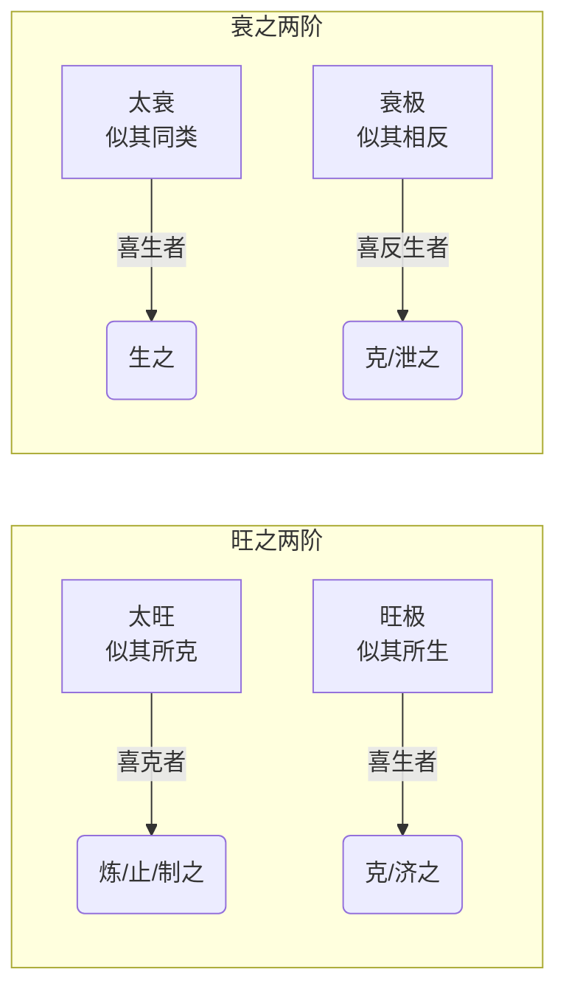

## 旺衰之真机——正反互倚

> 【原文】能知衰旺之真机,其于三命之奥,思过半矣。

> 【原注】旺则宜泄宜伤,衰则喜帮喜助,子平之理也。然旺中有衰者存,不可损也;衰中有旺者存,不可益也。旺之可损,以损在其中矣;衰之极者,不可损所当损者,反凶;实所当益者而益之,反害,此真机,皆能知之,又何难于详察三命之奥乎?

开篇一句"思过半矣",把衰旺提到子平命学最高法眼的高度——意思是掌握了衰旺之理,命理大半的奥义就已掌握。原注随即点出**双向辩证**的核心：旺者宜泄宜伤（即用食伤、官杀来消耗旺神，让命局流通有情）；衰者喜帮喜助（用印比来扶持日主，补弱以成格）。这是子平最基本的一条总则。

然而原注并非简单重复这条总则,而是进一步揭出**"旺中有衰、衰中有旺"**的辩证——旺到极处方有衰意藏于其中,此时若再一味用克泄,反而击破命局隐伏的生机;同理,衰到极点不可再强行扶助,扶之太过反而成害。所谓"真机",正是提醒学者不要落入"见旺即泻、见衰即扶"的死法。

这一层论理给出了后续任氏发挥的总纲：正面旺衰是基础,颠倒之理才是真机所在。任铁樵在原文基础上,先阐"正面",后揭"颠倒",层层递进。

## 通根重于比肩——正面衰旺之辨

> 【任氏】得时俱为旺论,失令便作衰看,虽是至理,亦死法也。

任氏开门即破"死法"二字。世俗流行的论命口诀,只看月令是否与日主同类便定旺衰,看似简易明了,实则胶柱鼓瑟。任氏的批判直指时弊：五行之气流行四时,即使在某五行专令之时,休囚之五行也并未"绝于天地"——春木司令时戊己土仍化育万物,冬水司令时丙丁火仍照耀万国,专令之中必有并存之气。

这一批判,是任氏全篇立论的逻辑起点。**判旺衰不能只看月令一柱**,而要看整个四柱（年月日时）的损益权。

### 月令之外,四柱皆有权衡

> 【任氏】八字虽以月令为重,而旺相休囚,年日时中,亦有损益之权,故生月即不值令,亦能值年值日值时,岂可执一而论?

此处是说：若日主在地支中得了年柱、日柱、时柱的同类之气,即便月令休囚,亦可作旺看。反之,即便月令得令,而四柱皆见克泄,亦可作衰看。

任氏随后举正反两组例证：

- **得时不旺**：春木虽强,若天干庚辛、地支申酉过重（官杀太重克身）,无火制金,反主夭折不富——此谓"得令而不旺"。
- **失时不弱**：秋木虽弱,若天干甲乙、地支寅卯得深根（印比有力）,遇官透反能承受,逢水生又嫌太过——此谓"失令而不弱"。

两组对比,破除"月令决定论",直接为下文的"通根说"张本。

### 干多不如根重——通根之分层

> 【任氏】是故日干不论月令休囚,只要四柱有根,便能受财官食神而当伤官七杀。长生禄旺,根之重者也;墓库余气,根之轻者也。

这是全篇的核心方法论。任氏把"根"分成两等：

| 根之层级 | 类别 | 举例 |
|---------|------|------|
| 重根 | 长生、禄、旺 | 甲乙逢亥寅卯 |
| 轻根 | 墓库、余气 | 甲乙逢未、辰 |

紧接着一个反直觉的论断：**天干得一比肩,不如地支得一余气墓库**。

> 【任氏】天干得一比肩,不如地支得一余气墓库。……得二比肩,不如支中得一长生禄旺。盖比肩如朋友之相扶,通根如家室之可托,干多不如根重,理固然也。

这一论断颇为关键。所谓"比肩"是天干之同类（如甲日主再见甲）；所谓"通根"是日主在地支得有禄旺、长生或墓库余气（如甲日主地支见寅、亥、未、辰）。任氏的比喻非常生动——**比肩如朋友,通根如家室**。朋友再多只能扶持于外,家室则可寄托根本。前者虚,后者实。实务上常见天干重重比肩（一片比劫）而地支无根,反主孤弱无助；而地支得一禄旺之根,即便天干少比肩,亦有自立之基。

最后,任氏顺手纠正一种流行谬误：世俗论命,见"春土夏水秋木冬火"即断为弱,见"春木夏火秋金冬水"即断为旺,不问有根无根、不究克重克轻；更有甚者,见壬癸逢辰、丙丁逢戌、甲乙逢未、庚辛逢丑,不知此乃通根逢库,反而求**刑冲以开库**,殊不知刑冲之法本是调候之奇,若误用于"开库出根",反而伤及本根之气。这条提醒,针对的是命学界的"乱冲乱刑"流弊。

## 颠倒五行——真机之所在

任氏紧接着转入全篇重心——"颠倒"之理。在正面旺衰之理（旺则喜克泄、衰则喜帮生）之上,任氏揭出一层更深的辩证：**旺衰到了极点,反而走向反面**。

### 颠倒之理二十条

> 【任氏】然此皆论衰旺之正面,易者也,更有颠倒之理存焉,其理有二十:

任氏随后逐条列举五行的"太旺""旺极""太衰""衰极"四种状态,每种状态都对应一种"似何""喜何"的反常规律。这不是文字游戏,而是基于五行的物理之象：

```mermaid
flowchart LR
    subgraph 旺之两阶
    A[太旺<br/>似其所克] -->|喜克者| B(炼/止/制之)
    C[旺极<br/>似其所生] -->|喜生者| D(克/济之)
    end
    subgraph 衰之两阶
    E[太衰<br/>似其同类] -->|喜生者| F(生之)
    G[衰极<br/>似其相反] -->|喜反生者| H(克/泄之)
    end
```

例如木：

- **木太旺**,气势已盛,反似金之刚硬,此时喜火来锻炼成器（用火之炼）。
- **木旺极**,气盛已极,反似火之燥烈,此时喜水来克制润下（用水之克）。
- **木太衰**,气已虚弱,反似水之寒滞,宜金来生扶（取金生水之意,而非直接生木,因其本身已无受生之力）。
- **木衰极**,气已殆尽,反似土之枯槁,宜火来生之（火生土、土再生木,是间接的接续）。

十种五行各有此四阶变化,合计四十条,任氏择其要者列出二十条作为纲纪。这一理论的实际应用,在于教人识别命局"表象与本质"的反差——看见木极旺,不可再见木或水来助势（那只会更旺成灾）,而要用火或金去对治;看见木极衰,也不可径直用水去扶助（虚不受补）,而要用火或金去间接接续。

### 颠倒之理的三层应用

颠倒之理并非玄谈,而是有严格的实操层级：

1. **识别表象**：表面看是某五行当令或成势,实际已进入"极"的临界。
2. **判定反向喜忌**：极旺者忌同类相助,反喜对治;极衰者忌直接生扶,反喜间接接续。
3. **选取用神**：用神不必是"日主所喜",而应是命局真正需要的平衡点。

任氏随即举出二十造命例作为验证,这是全文最长的一段,可视为**颠倒之理的应用教科书**。

## 二十造验证

任氏为"颠倒"之理精选了二十个命造,涵盖五行各态。每造皆有格局判定、流年应验、关键转折的记录。以下按五行分类呈现。

### 木之四阶——太旺、旺极、太衰、衰极

**【命造一（任氏释颠倒·木太旺）】甲辰 丁卯 甲子 戊辰**

> 甲子日生卯月,地支两辰,是木之余气也,又辰卯东方,子辰拱水,木太旺者似金也,以丁火为用。

此造甲木日主,卯月当令,两辰为木之余气,子辰又半会水局（子辰半会水方）,水生木,木势极旺。然而木太旺反似金之刚硬,需用丁火来锻炼成器（即"食神制杀"格局,丁火食神制庚金七杀,使旺木得驯）。

- 至巳运,丁火临旺,名列宫墙（科举中式）;
- 庚辛两运,南方截脚之金（即庚辛金运在南方火地受克）,虽有刑耗而无大患;
- 未运克去子水,食廪天储（取得廪膳,意即学业官运亨通）;
- 午运子水冲克,秋闱失意;
- 壬申运金水齐来,刑妻克子,破耗多端;
- 癸运不禄（亡故）。

> 丁火为用神,旺运助之则吉,水金齐来冲克用神则败。命局喜忌随运而迁,关键在用神能否得力。

**【命造二（任氏释颠倒·木旺极）】癸卯 乙卯 甲寅 乙亥**

> 此造四支皆木,又逢水生,六木两水,别无他气。木旺极者,似火也。

四支皆木,亥卯又半会木局,天干癸乙皆水生木,木势旺极反似火之燥烈。这种格局的命主出身祖业本丰（木旺主祖荫厚）,但"旺极"意味着命局无可对治——丑运刑伤,壬子水势乘旺反而助纣为虐（再来水生木,木更旺无制）,辛亥金不通根则无制木之力,支逢水旺,二十年经营获利数万;一交庚戌（土金并旺,终于有金来克木、对治旺极）,破财而亡。

> 旺极之局,喜见对治之神;再见同类,反促其亡。庚戌运之金,正是"木旺极似火,喜金之克也"的实证。

**【命造三（任氏释颠倒·木太衰）】乙丑 甲申 甲申 辛未**

> 此造地支土金,木无盘根之处,时干辛金,元神发透,木太衰者,似水也。

甲木日主,生申月（秋金当令）,地支丑申未皆土金,木毫无根基可言（"无盘根之处"）,辛金七杀透时干克身,木极衰反似水之寒弱。太衰之木不宜直接用水来扶（虚不受补）,宜用金来生水——金生水、水生木,是间接的接续。

此造初运癸未壬午,水生木、木受金克,虽有祖荫但刑丧早见（庇荫难丰）;辛巳庚辰,金逢生地（巳中有庚金长生、辰为水土之库而金气暗藏）,金气足则可生水、水再生木,白手发财数万;己卯运,土无根,木得地（卯为木之禄旺）,原本应吉,但**卯未半会木局反助木势,遭回禄（火灾）破财万余**;至寅运而亡。

> "木太衰似水,宜金以生之"——金是间接接续之媒,故金运发家。然回禄之祸,正因木得地而复旺,与之前"太衰"之判定已变,运过则用神亦变。

**【命造四（任氏释颠倒·木衰极）】己巳 己巳 乙酉 丙戌**

> 此造地支皆逢克泄,天干又透火土,全无水气。木衰极者,似土也。

乙木日主,生巳月（夏火当令）,四支巳酉戌三会金局（巳酉戌会金,金克木）,天干己土透出（己为阴土,木克土为财,但此造木极弱,见土反受泄——木克土需木有力,木无力则被土反侮）,丙火食神亦泄木气。命局全无水气（无印星生扶）,木衰极反似土之枯竭。

初交戊辰丁运,火土虽克泄木,但运程助命局已有的火土之势,反得丰厚庇荫;卯运,乙木日主临禄（卯为乙木之禄）,本应得力,但同时冲开酉金（卯酉冲）,且椿萱并谢（父母长辈亡故）——木虽得地,而原局金局克木之力仍在,卯运之木不足以敌全局;丙运,火土并旺,经营获利万金;寅运,木得长生却克妻破财（寅中甲木比肩夺财,且寅巳刑、火势更烈,木又受泄）,又遭回禄;乙丑运,支全金局（丑酉半会、巳酉丑三会金局）,火土两泄,家业耗散;甲子运,北方水地本可生木,但原局金局仍存,木终无力,不禄（亡故）。

> "木衰极似土,宜火以生之"——火生土、土再生金（财生官杀）,间接接续木气（通过土之缓和、金之流通）。但木衰极者,任何外助皆如杯水车薪,终难持久。

### 火之四阶——太旺、旺极、太衰、衰极

**【命造五（任氏释颠倒·火太旺）】乙丑 壬午 丙戌 甲午**

> 此丙戌日元,月时两刃,壬水无根,又逢木泄。火太旺者,似水也。

丙火日主,生午月（夏火当令）,月支午火、时支午火皆为劫财（丙火之禄）,甲木伤官泄火（甲木生火、火生土,伤官之泄为火之出路）,壬水七杀无根（壬坐戌土,戌为火库而非水库,壬水失根）。火太旺反似水之寒滞,需用土来止水（"火太旺似水,喜土之止也"）——意即火势过旺,反需土来分火之气,使火不至于焚毁一切。

初运庚辰辛巳,金逢生地（庚为丙火之偏财、辛为正财,金被火克反主财运,但此造火旺,金运反而泄火——金为财、火为身,身旺能任财则吉）,孔怀无辅助之人（兄弟无依）;己卯运,木土之乡,得际遇;戊寅运会火局（寅午戌三合火）,丁丑运火土并旺,二十年发财四五万;至子运,水来克火,不禄。

> "火太旺似水,喜土之止"——土之功用在于分火势、引火入库（戌为火库）,而非直接克水。运至子水冲午,克去用神,故亡。

**【命造六（任氏释颠倒·火旺极）】戊寅 丁巳 丙寅 甲午**

> 此造丙火生孟夏,地支两坐长生而逢禄旺。火旺极者,似土也。

丙火日主,生巳月（孟夏,四月巳火当令）,寅午皆火之禄旺,戊土食伤、丁火劫财、甲木伤官（甲木生火,火势更盛）,火旺极反似土之厚重。此造"旺极"之象——表面火炎土燥,实则气势已尽,反需木来疏泄（"火旺极似土,喜木之克也"——此处"克"非真克,而是木泄火之象,任氏用"克"字是借五行相克之理,言木对火之调节）。

初运南方火地,火势更旺而无制,然此时命主尚幼,赖祖荫遗绪丰盈,读书过目成诵（木运尚未至,故学业成就）;一交庚运（西方金运,金为财星,但金被火克——火旺极而金受制）,即弃诗书,受嬉好游,挥金如土;申运,金水并来（申为金、申中壬水为杀）,家破身亡。

> 任氏明示："此造若逢木运,名利两全也。"——木为伤官,泄火之气、引火归库,正是"火旺极似土,喜木之克"的实证。

**【命造七（任氏释颠倒·火太衰）】辛巳 丁酉 丁酉 辛丑**

> 丁火生于八月,秋金秉令,又全金局。火衰者,似木也。

丁火日主,生酉月（仲秋,八月金当令）,巳酉丑三合金局（巳酉丑会西方金）,天干两辛（辛金正官）夹丁（火被金克,官杀太重）,丁火极衰反似木之柔弱（"火太衰似木,宜水以生之"——水生木、木生火,是间接接续）。

初运丙申乙未,火（劫财）木（伤官）并旺,似可助身,然原局金局过重,火木皆被金克,故骨肉如同画饼（亲情无依）,六亲亦是浮云;一交癸巳运,癸水七杀透干、巳中庚金（财星）暗藏,出外经营大得际遇;壬辰运中（壬为七杀、辰为湿土晦火而存一点水气）,发财十余万。

> "火太衰似木,宜水以生之"——水为间接之媒,经木再生火。癸巳、壬辰运正是水运,故得际遇发财。

**【命造八（任氏释颠倒·火衰极）】辛亥 壬辰 丙申 己亥**

> 此财生杀,杀攻身,丙临申,申辰拱水。火衰极者,似金也。

丙火日主,生辰月（春土当令,辰为湿土）,壬水七杀透月干、亥水在时支、申辰半合水局（申辰半合水方）,天干辛金偏财、己土食伤,火被水克（杀攻身）极衰,反似金之沉敛（"火衰极似金,宜土以生之"——土为火之子,火生土、土再生金,是间接接续）。

初运辛卯庚寅,东方木地,木生火本可助身,但卯木与原局亥卯半会木局反助水势（寅亥合木、水气更盛）,祖业无恒、萱椿凋谢（父母早逝）;至己丑运,土金并旺（丑为金库、土之墓库）,出外经营,青蚨（钱币）衬辇、白镪（白银）随舆——发财之象;及戊子运,二十年大发（戊为食神、子为杀,但原局已有水,此处食神制杀反而成格——火衰极而得食神制杀,正是"似金"的敛聚之象）。

> 任氏以"春风吹柳,红绫易公子之裳;杏露沾衣,膏雨沐王孙之袖"形容其富贵——这是食神制杀格成而得禄位之象。

### 土之四阶——太旺、旺极、太衰、衰极

**【命造九（任氏释颠倒·土太旺）】戊辰 戊午 戊申 己未**

> 此造重重厚土,生于夏令,土太旺者,似木也,其用在金。

戊土日主,生午月（夏火当令,火生土）,四支辰午申未皆土（辰为湿土、午为火之禄但火生土、申为金之禄但土生金、未为木库但木克土此处木气不足),天干三土（戊戊己）,土势极厚反似木之盘根（"土太旺似木,喜金之克也"——金为财星,土太旺则需金来泄,即"土旺用金"）。

庚申运,金气临旺（庚为偏财、申为金之禄旺）,早采芹香（考取秀才）;辛酉运辛丑年,金气更盛,饮鹿鸣（举人）、宴琼林（进士）、云程直上——科甲连登;壬戌运,水火交战（壬为七杀、戌为火库,戌中丁火被壬水克——杀克食神则破格）,刑丧挫折,丙午年而亡。

> "土太旺用金"——金为财星,土旺任财则富;然壬运水来克火（食神）,格局破,故亡。

**【命造十（任氏释颠倒·土旺极）】戊戌 丙辰 己巳 己巳**

> 此造四柱火土,全无克泄。土旺极者,似金也。

己土日主,生辰月（春木当令,然辰为湿土、水库,木克土之力被辰中水气化解）,四支戌辰巳巳皆火土（戌为火库、辰为湿土、巳为火之禄旺——两巳火生土）,天干戊丙己皆火土,命局全无金（财）水（官杀）木（官杀）来克泄,土旺极反似金之坚凝（"土旺极似水,喜火之练也"——此处"练"即锻炼,火炼土成金之象）。

初运南方火地,火土更旺而失衡,然此时尚幼,遗业丰盈、午运入泮（考取秀才）;己未运,土更厚而失衡（未为木库但木气被土压,己土助势）,棘闱（科举考场）拔而不举（考试不中）;一交庚申运,金气透出（庚为偏财、申为金之禄旺）,青蚨化蝶（破财之象）——金为财,本应为吉,然原局土旺极,金来反被土埋（财多身弱之象的反面——身极旺而财星反受克）,家业渐消;辛酉运,金气更盛反激土怒（旺土见旺金,金被土克而财星受损）,事业萧条;壬运,水来克丙火（食神被克则护不住财星）,不禄。

> "土旺极似水"——此处任氏比喻有深意：土旺极则失其本性（如水之润下）,反需火来重炼。火为土之食伤,食伤生财,故火运之时尚可承祖荫;一过火运,失衡之局难以维持。

**【命造十一（任氏释颠倒·土太衰）】壬辰 辛亥 戊子 癸丑**

> 此造支类北方,水势汪洋,天干又透金水。土太衰者,似火也。

戊土日主,生亥月（冬水当令）,四支辰亥子丑皆水（辰为水库、亥为水之禄旺、子为水之禄、丑为金库但丑中癸水余气）,天干壬癸皆水（官杀攻身）、辛金（食伤,但金生水助杀）,土极衰反似火之虚浮（"土太衰似火,宜木以生之"——木为火之食伤,木生火、火生土,是间接接续;然此处"宜木"非直接助土,而是借火之暖土——任氏用"似火"二字提示,太衰之土如寒土,需火来暖）。

运至甲寅乙卯,干支皆木,木为官杀（克土之物,然此处木生火、火生土,木反成接续之媒——木虽克土,但木之气转为火之生土）,名成利遂;一交丙运,丙火食神透出本可助身,然丙与原局壬水（夫星）冲（壬丙冲、水火交战）,刑妻克子;至于巳运,巳中丙火虽生土,但巳亥冲（冲去原局亥水之禄）,且巳中庚金（财星）被原局水克,暗伤体用,得风疾而亡。

> "土太衰似火,宜木以生之"——木克土本为忌,然在此处木反为用,因其能间接生火暖土。此理甚妙,学者宜深思。

**【命造十二（任氏释颠倒·土衰极）】癸酉 甲子 戊子 戊午**

> 此四柱皆水,又得金生。土衰极者,似水也。

戊土日主,生子月（冬水当令,水旺之时）,四支酉子子午（酉为金之禄、子为水之禄、午为火之禄但被水克——此处午火孤立无援,且子午冲）,天干癸甲戊戊,甲木官杀透干本可克土,然甲乙木在冬水之时亦受克（寒木无力）;癸水七杀透出,土衰极反似水之沉滞（"土衰极似水,宜金以生之"——金为土之子,土生金、金生水,间接接续之理;然此造已多水,金再生水则更失衡,故"宜金"实指金之气可泄土之沉滞,使土稍得舒展）。

初运癸亥,水更旺,平宁之境（命主尚幼,家业尚稳）;壬戌运,壬水七杀、戌为火库（戌中丁火余气可暖土,然戌亦为土之墓库——此处戌反为土之根,虽戌被壬水所克,但戌中土气尚存）,土得地而失衡（戌运冲辰则动全局）,刑丧破耗,家业消亡;辛酉庚申二十年,金气大盛（庚为食伤、辛为食神,食伤泄土之气,使土不致过滞——"似水"之土得金泄则稍安）,大得际遇,白手发财十余万;己未运,己土劫财助身（然未为木库,木克土,未运与原局子未相害——子未相害,水土交战）,破去数万;寿亦在未而止。

> "土衰极似水,宜金以生之"——金为食伤,泄土之滞、使土有流通之机,故金运发财。然未运水土交战而亡,此即命理"过犹不及"之理。

### 金之四阶——太旺、旺极、太衰、衰极

**【命造十三（任氏释颠倒·金太旺）】壬申 己酉 庚子 庚辰**

> 此造秋金秉令,木火全无。金太旺者,似火也。

庚金日主,生酉月（仲秋,金当令）,四支申酉子辰皆金水（申为金之禄、酉为金之禄旺、子为水之禄、辰为湿土但辰中癸水余气）,天干壬己庚庚,壬水食伤（泄金之气）、己土偏印（生金）、庚金比肩（助金）,金势极旺反似火之刚烈（"金太旺似火,喜水之济也"——水为食伤,泄金之锐气、引金入润,正是"似火"之金需水来淬砺之意）。

亥运,壬水坐禄（亥中壬水本气）,早游泮水（入县学）;壬子运,壬水食神临旺（子为水之禄）、劫财（庚金比肩）被泄——食神制杀（壬制己土七杀——己土本为偏印生金,然壬水制己则护住庚金,使金不致过旺而失衡）,格局纯粹,撞破烟楼（考中举人）、高攀月桂（考中进士）;癸丑运,癸水食神、丑为金库（丑中辛金本气）,财源丰裕（青蚨成蝶舞,喻财富之多）;甲寅乙卯运,木来克土（制土卫水——木克己土则护壬水,水气更纯）,仁路清高（仕途顺遂）。

> 任氏以"枫叶未应毡共冷,梅开早觉笔先香"形容其科甲之盛——此造"金太旺"得水来泄,水为食伤,食伤生财则富,食伤制杀则贵,皆因用神得力。

**【命造十四（任氏释颠倒·金旺极）】庚申 乙酉 庚戌 庚辰**

> 此造支类西方,又逢厚土,金旺极者,似水也。

庚金日主,生酉月（仲秋金当令）,四支申酉戌辰皆金土（申酉为金之禄旺、戌为火库但戌中辛金余气——金入墓于戌,戌为金之墓库,金气更厚）,天干庚乙庚庚,乙木正官（七杀亦可,乙庚合金——此处乙木被庚金合化,反助金之势;然乙木为正官,官星被合则去官留杀之象需另论）,金旺极反似水之沉厚（"金旺极似水,喜土之止也"——土为财星,金旺极则需土来止其流、使金有所归）。

初运火（丙戌丁亥）,火为官杀本可制金,然金旺极,火来反被金克（丙丁火克庚金,需火有力方能制——初运火运火气尚浅,无力制旺金）,祖业无恒;至戊子运,戊土偏印透出（子为水之禄,但戊土合子中癸水则化火——戊癸合火,火气生土,土来止金之流）,获厚利,纳妾出仕;己丑运,丑为金库（丑中辛金本气、己土湿土晦金——此处丑土晦金使金不致过锐）,庚运庚金比肩助身,名利皆遂;一交寅运（寅为木之禄,木克土则护金——寅中甲木克己土,土被克则无法止金,金复归旺极之乱）,犯事落职（格局破）,大破财利;至卯运（卯为乙木之禄,卯酉冲——冲去原局酉金之禄,金之根动摇）,不禄。

> "金旺极似水,喜土之止"——土为财星,金旺极需土来收摄;然寅卯运木克土,土被克则无法止金,金复归乱,故败亡。

**【命造十五（任氏释颠倒·金太衰）】己卯 庚午 辛卯 甲午**

> 辛金生于仲夏,地支皆逢财杀。金太衰者,似土也。

辛金日主,生午月（仲夏,五月火当令）,四支卯午卯午皆木火（卯为木之禄、午为火之禄——两卯两午,木火成势）,天干己庚辛甲,己土伤官（泄金之气,但金本衰,泄之更弱——此处"伤官"非吉象,因身太弱则伤官反为累）、庚金比肩（助金,然庚金在午月受克——庚金死於午,助之无力）、甲木正官（七杀之轻者,克金——金衰见木,克之更甚）,金太衰反似土之虚弱（"金太衰似土,宜火以生之"——火为金之食伤,火生土、土生金,间接接续）。

初运己巳戊辰,己土伤官、戊土食神（食伤泄金,然辰为湿土晦火养金——此处食伤运本应凶,但辰中癸水余气可润金,故"晦火生金"四字点出辰运之妙）,求名多滞、作事少成（格局未成,故无功）;一交丁卯运,丁火七杀（克金之物,但丁壬合——原局无壬,丁火单纯克金——然木火并旺,卯木生丁火、丁火克金——看似凶运,实则"金太衰似土,宜火以生之"——火生土、土生金的间接接续正在此运）,如枯苗得雨（命局得助）、勃然而兴,似鸿毛遇风、飘然而起,家业丰裕;交丑运（丑为金库、丑中辛金本气,金得根则可任财官——丑土生金,金不再衰）,生金泄火,格局圆满,不禄。

> "金太衰似土,宜火以生之"——火本克金,在此处反为用神,因其能间接生土（土为金之印,印可帮身）、再生金（食伤生财、财生官杀——间接接续之理甚妙）。

**【命造十六（任氏释颠倒·金衰极）】己亥 丁卯 庚寅 丙子**

> 此造木旺乘权,又得水生,四面皆逢财杀。金衰极者,似木也。

庚金日主,生卯月（仲春,木当令）,四支亥卯寅子皆水木（亥卯半会木、寅卯辰会木局之半、亥子半会水——水生木,木势极旺）,天干己丁庚丙,己土伤官（泄金,然金极衰,泄之更弱——此处伤官为累）、丁火七杀（克金,然丁壬合木——原局无壬,丁火单纯克金——丁火在卯月得木生,杀力更重）、丙火正官（克金,丙火在寅卯月得木生,官星有力）,金衰极反似木之飘摇（"金衰极似木,宜水以生之"——水为金之食伤,水生木、木生火——间接接续之理:水泄金之气,金本已衰,水来反成"似木"之金的气韵转换——任氏此论最为精微,言金衰极者已失金之本性,反有木之虚浮,水来则顺势化为木之气）。

乙丑运,丑为金库（丑中辛金本气）、己土伤官（伤官见官则祸——丑中己土与原局丁火合,合去七杀则格局破）,土金暗旺（丑运助金之根）,然乙木正官透出（乙庚合金——此处乙木反被庚合,合住官星则去官留杀——格局破则家业破尽）;至甲子运,北方水旺,财源通裕（水为食伤,泄金之气——然金已衰极,水来反得其润,如枯木得雨）;癸亥出仕,水更盛,名利两全;壬戌运,壬水食神、戌为火库（戌中丁火被壬水克——食神制杀,然原局丁火七杀已被壬水制——此处双重制杀则太过,杀被制尽则无以卫财——水临绝地（戌为水之墓库?此处任氏用"绝地"言戌中火土克水之象）,罢职而归。

> "金衰极似木,宜水以生之"——水为食伤,泄金而生木,木再生火（财生官杀）。此造反复辗转于水木火之间,皆因金已失其本性。

### 水之四阶——太旺、旺极、太衰、衰极

**【命造十七（任氏释颠倒·水太旺）】壬寅 辛亥 壬子 辛丑**

> 此造壬水生于孟冬,支类北方,干皆金水。水太旺者,似土也,喜其寅木吐秀。

壬水日主,生亥月（孟冬,十月水当令）,四支寅亥子丑皆水木（亥子丑会北方水局,水势汪洋;寅为木之禄——寅中甲木食神可泄水之气）,天干壬辛壬辛,辛金偏印（生水——金生水,助水之势;然印星过重反为累——身旺则印多反窒）、壬水比肩（助水）,水太旺反似土之厚重（"水太旺似土,喜木之制也"——木为食伤,泄水之气、引水归库——寅中甲木正是"吐秀"之象）。

至甲寅运,木气临旺（甲为食神、寅为木之禄旺——食神制杀——七杀戊土本可制水,然戊土在原局无透干,食神甲木反成泄水之媒）,早遂青云之志,才藻翩翩、辉映杏坛桃李——食伤为用,文思大发;乙卯运（乙为伤官、卯为木之禄——伤官见官则祸?然原局无官透干,伤官纯粹泄秀）,官途顺遂;交巳运（巳为火之禄旺——巳中丙火为偏财、庚金为正印——巳亥冲,冲去原局亥水之禄,水之根动摇）,而亡。

> "水太旺似土,喜木之制"——木为食伤,泄水之秀。甲寅运正是食伤旺地,故文思大发;然食伤过旺则泄尽日元之气,寿元亦随之而尽——巳运冲去亥水之根,水失其势则亡。

**【命造十八（任氏释颠倒·水旺极）】癸亥 癸亥 壬子 庚子**

> 此造四柱皆水,一无克泄,其势冲奔,不可遏也。

壬水日主,生亥月（孟冬水当令）,四支亥亥子子皆水（亥为水之禄旺、子为水之禄——四水相聚,水势冲奔）,天干癸壬癸庚,癸水劫财（助水）、壬水比肩（助水）、庚金偏印（金生水——印星生身,水势更旺）,水旺极则几近"无土可制"之局（"水旺极似木,喜金之克也"——金为财星,水旺极则需金来对治;然金生水,金反助水——此处任氏的"喜金"非取金生水,而是取金之"克"——金克木之理延伸至"金对治水"——此论最为微妙:水旺极反需金之沉敛来对治,如大水需堤坝）。

初运壬戌,戌为火库（戌中丁火余气可制水——然戌被壬水克——食神制杀之象?此处壬水克戌中丁火,即水克火——水势太旺则克火,火被克则无法生土,土无法制水——戌运本可暖局,然原局水势太旺,戌被克则助纣为虐）,早见刑丧;辛酉庚申运,干支皆金（辛为正印、庚为偏印——金生水,水更旺——然任氏以"月印舞江银作浪,门临五福锦铺花"形容其富贵——金运虽生水,然金之气亦制水之冲奔,金为堤坝之意,使水不泛滥）;交己未运,己土正官（克水之物）、未为木库（未中乙木余气可泄水——木为食伤,可泄水之秀——己未运本为官杀食伤并见,格局应破,然原局水势过旺,己未运之土反被水克——妻子皆伤、家业破尽）;戊午运,戊土七杀、午为火之禄旺（土克水、火暖水——然水势过旺,戊午之土火反被水冲克——午亥暗合?子午冲——原局子午冲,午运再冲则冲力太大,命局崩）,贫乏不堪,忧郁而卒。

> 此造"水旺极不可遏"——原局无任何克泄（金生水为助、水生木为泄但原局无木——四柱皆水,无一可制）,任氏以"喜金"对治,然金运亦只能暂时收摄,一过金运则崩。

**【命造十九（任氏释颠倒·水太衰）】丙辰 乙未 壬午 癸卯**

> 此火土当权,又逢木助,五行无金。水太衰者,似金也。

壬水日主,生未月（季夏,六月土当令——未为木库,木克土,然未中乙木余气亦存）,四支辰未午卯皆火土木（辰为湿土、水库——辰中癸水余气可助水,然辰被原局火土包围,水库被克——辰中癸水无力;未为木库、火之余气;午为火之禄;卯为木之禄——木生火、火生土,火土成势）,天干丙乙壬癸,丙火偏财（克水——壬丙冲?壬坐午冲丙?此处天干相冲需另论）、乙木伤官（泄水之气——水生木,木又生火,水之消耗更甚）、壬水比肩（助水,然孤弱无助）、癸水劫财（助水,亦无力）,水太衰反似金之沉滞（"水太衰似金,宜土以生之"——土为火之子,火生土、土再生金——间接接续之理;然此造火土当权,土已过旺,再"宜土"则失衡——任氏此处论"太衰"与"衰极"有别:太衰者尚有一点根气,衰极则根气全无）。

初交丙申丁酉,丙丁火盖头（天干火克金——然原局无金,火之克无所施;申酉为金之禄旺,本可生水,然被丙丁火盖头则金气受制——火克金则金不能生水）,申酉不能生水（财喜并旺——金为财、水为身,身弱则不能任财——财多身弱之象）,故虽"财喜并旺"而命主无福消受;戊戌运,戊土七杀（克水——然戊土合癸水则化火——七杀被合则去杀留官?此处戊癸合化火则格局变——戊戌运土气更盛,水更衰）,家业饶裕（此因格局虽变,然原局木火土成势,运程与之同类则吉——任氏以"家业饶裕"四字点出戊戌运之吉,然吉从何来?乃格局纯粹之故:木生火、火生土、土克水,食伤生财、财生官杀,一路相生,水虽衰而有流通之机）;己亥运,己土正官（克水——然己土被原局乙木克——伤官见官则祸?然乙己合,合去官星则格局破）、亥为水之禄旺（亥中壬水本气可助水,然亥与原局巳（辰?此处原局无巳）无冲?亥与卯半会木——亥卯半会木则木势更旺,木泄水之气）,土无根（己土在亥月受克——己土死於亥）,还喜支会木局（亥卯未会木?此处亥卯半会木,加上未为木库,木局已成）,虽有破耗而无大患（格局虽破,然木局可泄水,水有流通则不致崩——任氏"无大患"四字透露,亥运虽冲克,然木局成则水有所泄）;一交庚子运,庚金偏印（生水——金生水,本可助身）、子为水之禄（子中癸水本气——水得根则旺——然庚子运与原局冲:子午冲——子冲午,冲去原局午火之禄;庚金被原局丁火（丁未?原局有乙未,未中丁火余气）克——印星被克则无法生水）,家破人亡。

> "水太衰似金,宜土以生之"——然此造火土过旺,再添土则失衡,故"宜土"非直接扶助,而是借土之沉厚使水有所归（"似金"之水需土来安定）。任氏明言庚子运家破人亡,正是印星（金）被克则水无所依之故。

**【命造二十（任氏释颠倒·水衰极）】癸卯 戊午 壬寅 丙午**

> 此造丙火当权,戊癸从化,枯干壬水。水衰极者,似火也。

壬水日主,生午月（仲夏火当令,五月火旺之时）,四支卯午寅午皆木火（卯为木之禄、午为火之禄——两午两卯木火成势）,天干癸戊壬丙,戊土七杀（克水——戊癸合,戊癸合化火——此处壬水被合化则失其本性——任氏"枯干壬水"四字点出:壬水被戊土合化,已非水之本体）、丙火正财（克水——两丙夹壬,水被火蒸腾——水衰极之象）,癸水劫财（亦被戊土合——戊癸合,两癸皆被合——水之同类尽被合去）,水衰极反似火之虚浮（"水衰极似火,宜木以生之"——木为水之食伤,水生木、木生火——间接接续之理;然此造壬水已被戊癸合化,已失水之本性,木来再生火则更失衡——任氏"宜木"非救水,而是顺势转化,使命局归于火之格局）。

初运逢火（丁巳丙辰——火运助原局火势——然格局本已归火,火运则火更纯——"从其火旺"四字点出:原局壬水已从化,则顺其火势则吉,逆之则凶——此即"从格"之理）,丰衣足食;乙卯甲寅运,木气大盛（乙为伤官、甲为食神——食伤泄水——然原局已从火,食伤再生火则火更纯——格局纯粹则吉）,名利双全;癸丑运,癸水劫财（试图破坏从化——然丑为金库,丑中辛金可生水,水有根则不再从化——格局破则祸起——争官夺财——癸水与原局戊土合,戊癸合化火则格局复归——然癸丑运丑运冲未?原局无未——此处"争官夺财"指癸水出现则原局从化被破坏,七杀（戊）被争则官非其官、财非其财）,破耗而亡。

> "水衰极似火,宜木以生之"——任氏以"从格"之理诠释水衰极:水已失其本性,则顺其所化之五行（此处化火）则吉,逆之则亡。癸丑运癸水出现,试图恢复水之本性,反而破坏了从化格局,故亡。

### 二十造之统观

任氏在列举二十造之后,作了总结:

> 【任氏】以上二十造,五行极旺极衰,不得中和之气。原注云:"旺中有衰者存,衰中有旺者存",此两句,即余之太旺太衰也;"旺之极者不可损,衰之极者不可益",此两句,即余之极旺极衰也。特选此为后证。

这一段把"颠倒之理"与原注作了对照融合:

| 原注 | 任氏发挥 |
|------|---------|
| 旺中有衰者存 | 即太旺——表面旺,内有衰意 |
| 衰中有旺者存 | 即太衰——表面衰,内有旺意 |
| 旺之极者不可损 | 即极旺——旺到极点不可再助 |
| 衰之极者不可益 | 即极衰——衰到极点不可再扶 |

这一对照揭示了任氏的理论体系:原注提出辩证的原则,任氏则把原则细化为二十种具体格局,并用二十造命例逐一验证。这是子平命学中"理论——实践"结合的典范写法。

## 子平之通论——篇末定位

通观全篇,从"能知衰旺之真机,思过半矣"的纲领起,经原注的"旺衰互倚"之理,任氏接以"通根重于比肩"的正面论断,再推演至"颠倒五行"的反面真机,最后以二十造命例逐一验证——整个论述呈"总纲—正面—反面—验证"四阶递进,层次极为严密。

从全书格局看,此篇是子平命学"基础法则"的总论性篇章。衰旺之辨,是论命入手第一关;通根之说,是辨旺衰的关键尺度;颠倒之理,则是对"旺衰二元论"的深层突破——揭示了五行"过犹不及"的反转化规律。任氏以二十造为证,既不流于空谈,也不拘于死法,处处扣紧"原局—大运—流年"的动态变化。

命理学的根本难度,在于五行之气"流行于四时"的复杂性。月令得气、未月得地、年日时得助——四柱各有损益之权,不可执一而论。而颠倒之理更进一步:即便是同一种五行,若处"极"位,其喜忌可能完全反转。这要求论命者既要看当下之"形",又要悟其背后之"机"。

至于"通根重于比肩"一说,更是子平实务的基石。天干比肩再多,终是朋友之扶;地支一得长生禄旺,即是家室之托。这一论断,直接关系到格局高下、用神取舍——凡论命者,不可不知。