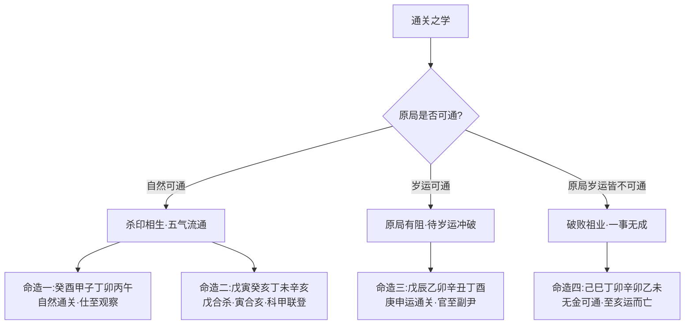

# 通关

## 开门见山以牛郎织女喻通关

> 【原文】关内有织女，关外有牛郎，此关若通也，相邀入洞户。

开篇以牛郎织女七夕相会的典故立论。表面是讲神话，深层是讲命理：**命局之中常有「关」——两种相克相敌之神被某种障碍隔开，不能相会相生**。若能把这一关打通，则原本相克相敌者反而能相邀入洞房——克者变成助者、敌者变成友者。这就是「通关」一词的本意。

「关」字选得尤其精到。命局中两种五行本可相生相用，但中间被第三种五行所隔，所隔之处即是「关」。「通」字则不是「克去」「化去」那个隔神，而是「引入援引之神」让被隔的两神最终会合——通关的本质是**让相克者反得相生之用**。

> 【原注】天气欲不降，地气欲上升，欲相合相和相生也。木土而要火，火金而要土，土水而要金，金木而要水，皆是牛郎织女之有情也。中间上下远隔，为物所间；前后远绝，或被刑冲，或被劫占，或隔一物，皆谓之关也。必得引用无合之神及刑冲所间之物，前后上下，授引得来，能胜劫占之神，能补所缺之物，明见暗会，岁运相逢，乃为通关也。必得引用无合之神，及刑冲所间之物，前后上下，援引得来，能胜劫占之神，能补所缺之物，明见暗会，岁运相逢，乃为通关也。关通而其愿遂矣，不犹牛郎织女之入洞房也哉？

原注先把通关的宇宙论根据铺开——「天气欲不降，地气欲上升，欲相合相和相生也」——这与《周易·泰卦》「小往大来，吉亨」的天地相交之理一脉相承。在命局中，天干主动（天气）、地支主静（地气），二者「欲相合相和相生」是自然之势；本篇即讲如何促成这种势的实现。

随即原注给出一组五行相通关的对应表：**木土而要火（火通关木土之克）、火金而要土（土通关火金之克）、土水而要金（金通关土水之克）、金木而要水（水通关金木之克）**。这一组对应的内在逻辑是：甲乙木克戊己土，要丙丁火通关（火泄木生土，使木之气转向生土）；丙丁火克庚辛金，要戊己土通关（土泄火生金）；戊己土克壬癸水，要庚辛金通关（金泄土生水）；庚辛金克甲乙木，要壬癸水通关（水泄金生木）。这是「通关」之学的「药方」总表。

原注再讲「关」的成因——「中间上下远隔，为物所间；前后远绝，或被刑冲，或被劫占，或隔一物」——关的形成有四种：上下远隔（如年干时干之间被月干所隔）、前后远绝（如年支时支被月支所隔）、被刑冲（如卯冲酉、午冲子使两神不能会合）、被劫占（如比劫夺财、印绶夺食使所喜之神不得用）、隔一物（如两喜神之间被一忌神所夹）。随即原注给出通关的实操——「必得引用无合之神及刑冲所间之物，前后上下，授引得来，能胜劫占之神，能补所缺之物，明见暗会，岁运相逢」。

## 任氏之论通关与通关神

> 【任氏曰】通关者，引通克制之神也。所谓阴阳二用，妙在气交，天降而下，地升而上。天干之气动而专，地支之气静而杂，是故地运有推移，而天气从之；天气有转徒，而地运应之；天气动于上，而人元应之；人元动于下，而天气从之，所以阴胜逢阳则止，阳胜逢阴则往，是谓天地交泰，干支有情，左右不背，阴阳生育而相通也。

任铁樵一开篇就把「通关」从技法升格为宇宙论——「引通克制之神也」。他把原注所说的「通关」与《周易·泰卦·彖传》「天地交而其道通也」的义理一脉相承——「天降而下，地升而上」「阴胜逢阳则止，阳胜逢阴则往」「天地交泰、阴阳生育而相通」。这一段话虽然没有直接引《周易》原文，但与《泰》卦彖辞「天地交、万物通也」「天地不交、万物不通也」义理完全一致。任氏以此立论：通关不是简单的「引入一个神」，而是让整个命局的阴阳之气恢复交流。

> 【任氏曰】若杀重喜印，杀露印亦露，煞藏印亦藏，此显然通达，不必节外生枝。倘原局无印，必须岁运逢印，向而通之，或暗会明合而通之，局内有印，被财星损坏，或官星化之，或比劫解之，或被合住，则冲开之，或被冲坏，则合化之，或隔一物，则克去之，前后上下，不能授引，得岁运相逢尤佳。

任氏把「杀印相生」作为通关最典型的应用——七杀重而喜印绶化之（杀生印、印生身），是通关正格。随即任氏给出一组实操——

- **原局无印、岁运逢印**——「向而通之」（岁运之印向原局之杀而去，引通杀印之势）；
- **原局有印、暗会明合**——「或暗会明合而通之」（支中暗藏之印与天干之杀明合，引通）；
- **印被财损坏**——「或官星化之，或比劫解之」（官星化财生印、比劫克财护印）；
- **印被合住**——「冲开之」（冲去合神之实，使印重新流通）；
- **印被冲坏**——「合化之」（合住冲神，使印得以保留）；
- **隔一物**——「克去之」（克去中间所隔之物）。

这是任氏给出的通关「药方」实操——针对不同的「关」之成因，给出不同的「通关之法」。

> 【任氏曰】如年印时杀，干杀支印，前后远立，上下悬隔，或为间神忌物所间，此原局无可通之理，必须岁运暗冲暗会，克制间神忌物，该冲则冲，该合则合，引通相克之势，此关一通，所谓琴遇子期，马逢伯乐，求名者青钱万选，问利者意则屡中，如牛郎织女之入洞房，无不其所愿。杀印之论如此，食伤财官之论亦如此。

任氏随即点出最棘手的情形——年印时杀、干杀支印、前后远立、上下悬隔——原局无路可通，必须借助岁运来暗冲暗会、克制间神忌物。任氏以「琴遇子期、马逢伯乐」形容通关之后命主得志之快——「求名者青钱万选、问利者意则屡中」。这一句的语义层次尤其值得留意：原局之「关」一旦打通，**命局原先被压抑的喜神一下子获得解放，其势如决堤之水、其利如破竹之势**。任氏最后一句尤其吃紧——「杀印之论如此，食伤财官之论亦如此」——他把杀印通关的逻辑推及食伤、财官之通关：本篇虽然以「杀印」立论，其实食伤、财官的相生相克之理也可由此推演。

## 命造一 癸酉 甲子 丁卯 丙午——自然通关之吉格

> 【命造一（任氏注）】癸酉 甲子 丁卯 丙午
> 癸亥 壬戌 辛酉 庚申 乙未 戊午
> 此造天干地支皆杀生印，印生身，时归禄旺，尤妙四冲反为四助，金见水克木而生水，水见木不克火而生木，此自然不隔不占，无阻节之物。日主弱中变旺，运遇水，仍能生木；逢金仍能生水，印绶不伤，所以秋闱早捷，仕至观察。

**命局结构**——年癸酉、月甲子、日丁卯、时丙午。天干癸、甲、丁、丙，地支酉、子、卯、午。

**任氏析命**——癸水七杀、甲子印绶、丁卯日主、丙午时归禄旺——天干地支皆「杀→印→身」之连续：金（酉）生水（癸）、水（癸）生木（甲）、木（甲）生火（丁、丙），是典型的杀印相生之格。「尤妙四冲反为四助」——日支卯与年支酉、日支卯与时支午、月支子与时支午——三组冲或合皆「反为四助」：金见水克木而生水（酉金生癸水不克木）、水见木不克火而生木（子水生卯木不克丁火）——五行流通无阻、杀印相生之路畅然。

**任氏判语**——「自然不隔不占，无阻节之物。日主弱中变旺，运遇水，仍能生木；逢金仍能生水，印绶不伤」——秋闱早捷（乡试中举），仕至观察（中级地方长官）。

此造是「杀印相生、自然通关」之典型——杀、印、身三者首尾相连，五行流转有情，本身即是通关的最佳状态，无需岁运来推助。

## 命造二 戊寅 癸亥 丁未 辛亥——戊土合杀之奇格

> 【命造二（任氏注）】戊寅 癸亥 丁未 辛亥
> 甲子 乙丑 丙寅 丁卯 戊辰 己巳
> 此癸水临旺，贴身相克，被戊土合去，反作帮身。月支亥水本助杀，得年支寅亥合来生身，寅本遥隔，反为亲近。时支之亥，又逢未会，以杂为恩。，一来一去，何等情协，一往一会，通关无阻。所以科甲联登，仕至黄堂。

**命局结构**——年戊寅、月癸亥、日丁未、时辛亥。天干戊、癸、丁、辛，地支寅、亥、未、亥。

**任氏析命**——癸水（七杀）临亥月旺地，贴身相克日主丁火——若按常理，日主被七杀克身，难得富贵。但任氏点出三步通关之妙：

- **戊土合癸水**——年干戊土合去月干癸水（戊癸合化火），癸水不再克丁火，「反作帮身」——戊癸合化之火生丁火，反而帮身；
- **寅亥合**——年支寅与月支亥合（寅亥合木），亥水本助杀，寅木一合，「合来生身」——寅木生丁火；
- **未亥会**——时支亥与日支未（亥未会木？不成立，按：此处任氏用「未会」或指未中藏干乙木，乙木与亥中甲木成木之势），「以杂为恩」——亥中甲木与未中乙木皆木，木生火，反助日主。

任氏以「一来一去、何等情协，一往一会、通关无阻」形容此造——戊合癸、寅合亥、未会亥，三处合会皆将「克我之杀」转化为「生我之物」。科甲联登（接连中举中进士）、仕至黄堂（知府）。

## 命造三 戊辰 乙卯 辛丑 丁酉——岁运通关之格

> 【命造三（任氏注）】戊辰 乙卯 辛丑 丁酉
> 丙辰 丁巳 戊午 己未 庚申 辛酉
> 此春金气弱，时杀紧克，年逢印绶，远隔不通。又被旺木克土坏印，不但戊土不能生化，即日支之丑土，亦被卯木所坏。此局内无可通之理。中运南方杀地，碌碌风霜，奔驰未遇；交庚申克去木神，得奇遇，分发陕西，屡得军功；及辛酉二十年，官至副尹，盖金能克木帮身，印可化杀而通也。

**命局结构**——年戊辰、月乙卯、日辛丑、时丁酉。天干戊、乙、辛、丁，地支辰、卯、丑、酉。

**任氏析命**——辛金日主生于卯月（木旺），时干丁火（七杀）紧克；年干戊土（印绶）本可化杀生身，但「远隔不通」——戊在年干、丁在时干，中间月干乙木（财星）克断戊土之生化之路；地支卯木（财）克辰土（印库）、卯木亦克丑土（日支之印根）——「局内无可通之理」。

**运程**——初运丙辰丁巳戊午己未（南方火土之地），火生土、土生金虽可，但火为杀旺之地，「碌碌风霜、奔驰未遇」；交庚申运，金克木（去间神忌物）、金帮身，「得奇遇、分发陕西、屡得军功」；辛酉运金更旺，二十年官至副尹（按：明清副尹即府同知，州县副长官）。

此造是「原局不可通、岁运来通关」的典型——年印（戊）被月财（乙）克断、时杀（丁）远隔——原局无路可通；交入庚申运，庚金既克去乙木（破财护印）、又帮身抗杀，关一打通，喜神（印绶）得以化杀生身，命运大转。

## 命造四 己巳 丁卯 辛卯 乙未——不可通关之败格

> 【命造四（任氏注）】己巳 丁卯 辛卯 乙未
> 丙寅 乙丑 甲子 癸亥 壬戌 辛酉
> 此春金虚弱，木火当权，年印，月杀，未得相通，时支未土，又会卯化木，只有生杀之情，而无辅主之意，兼之一路运途无金，一派水木，仍滋杀之根源，以致破败祖业。一事无成，至亥运会木生杀而亡。

**命局结构**——年己巳、月丁卯、日辛卯、时乙未。天干己、丁、辛、乙，地支巳、卯、卯、未。

**任氏析命**——辛金生于卯月（木旺），月干丁火（七杀）紧克，时干乙木（财星）生杀；年干己土（印绶）本可化杀，但「未得相通」——己土在年干、丁火在月干，月支卯木克己土之根（巳中虽有戊土但被卯冲）——己土无力化杀。地支两卯（卯卯）会木、时支未（未中藏乙木）会卯化木——「只有生杀之情，而无辅主之意」。

**运程**——丙寅乙丑（运干支皆木火、继续生杀）、甲子癸亥壬戌（水运生木助杀）、辛酉运方有金来帮身——但辛酉运未至，亥运已经「会木生杀而亡」。

此造与命造三形成鲜明对照：命造三原局虽不可通，但庚申运一来即可通关；命造四原局不可通、运途亦无可通之时——「一路运途无金，一派水木，仍滋杀之根源」——故破败祖业、一事无成，至亥运而亡。

## 四造对照通与不通

四造并列，通关之学一目了然：命造一、二是「原局可通」之格——五行流转有情，自身即是通关；命造三是「原局不可通、岁运可通」之格——需要等待岁运之金来冲破间神；命造四是「原局与岁运皆不可通」之格——运途无金、杀旺身弱，终至破败而亡。任氏以四造画出通关之学三种境况的完整光谱。

## 篇中定位

本篇专论命局"通关"之法——当命局两行对峙、气势阻塞时，如何用中间一行作为媒引使两行流通。任氏以"关内有织女、关外有牛郎"作喻：两强对峙如牛郎织女隔关相望，通关者即在中间架桥使会合。任氏辨通关与通关神的区别：通关神是专一之字可解一格；通关是当机立断之格局大法。任氏以四造对照演示"通关"与"不通关"的两种结果——一则富贵福寿，一则贫贱刑伤——把这一格局大法的成败得失落到具体命局上。
