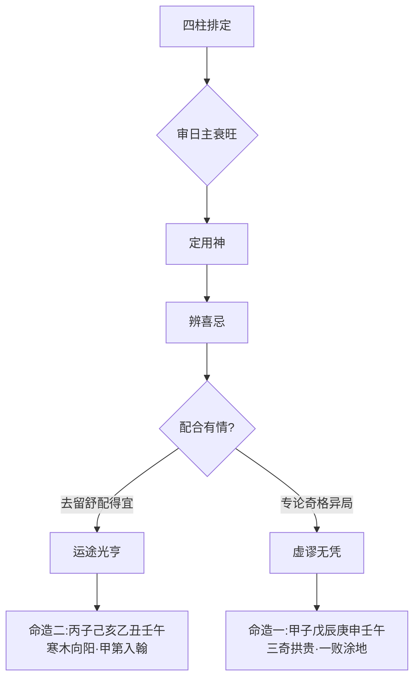

# 配合

## 配合之要：总览干支以定吉凶

> 【原注】天干地支，相为配合，仔细推详其进退之机，则可以断人之祸福灾祥矣。

原注极简——「相为配合」四字点出方法，「仔细推详」四字说明态度。「进退之机」四字最吃紧：天干地支两两相配，要看哪一方进、哪一方退，谁当令、谁休囚；进的一方为福、为吉，退的一方为祸、为凶。这与后续「衰旺喜忌」之理首尾相接，原注其实只点了一个判断的总纲。

## 任氏辟谬：弃奇格而重用神

> 【任氏曰】此章乃辟谬之要领也。配合干支，必须正理搜寻详推，与衰旺喜忌之理，不可将四柱干支弗论，专从奇格、异局、神杀等类妄谈，以致祸福无凭，吉凶不验。命中至理，只存用神，不拘财、官、印绶、比劫、食伤、枭杀，皆可为用，勿以名之美者为佳，恶者为憎。果能审日主之衰旺，用神之喜忌，当抑则抑，当扶则扶，所谓去留舒配，取裁确当，则运途否泰，显然明白，祸福灾祥，无不验矣。

任氏一开篇便为「配合」定下全书级别的定位——「此章乃辟谬之要领也」。「辟谬」二字直指当时命界之病：世人论命，专挑奇格、异局、神杀等形貌奇特之物作招牌，而把四柱本身的衰旺喜忌搁置不理。任氏认为这是「妄谈」，导致「祸福无凭，吉凶不验」。

任氏随即把方法论重整为四步实操：

- **审日主之衰旺**：先看日主本身是强是弱。
- **定用神之喜忌**：在衰旺基础上取用神，分清喜忌。
- **当抑则抑，当扶则扶**：喜神要扶，忌神要抑。
- **去留舒配，取裁确当**：最后做「去」「留」「舒」「配」的取舍。

「去留舒配」四字是任氏自创的浓缩判法——去其所忌、留其所喜、舒其气脉、配其性情。这是「用神」二字的具体展开。

任氏同时破除一种根深蒂固的偏见：「不拘财、官、印绶、比劫、食伤、枭杀，皆可为用，勿以名之美者为佳，恶者为憎。」印绶、食神被视为「美名」，七杀、枭神被视为「恶名」，但任氏强调：六神皆是工具，**衰旺才是定盘星**。这是对当时命界「喜清忌浊、喜顺忌逆」流俗的当头棒喝。

## 命造一（任氏注）：甲子 戊辰 庚申 壬午——「三奇拱贵」之谬

> 【命造一（任氏注）】甲子 戊辰 庚申 壬午
>
> 己巳 庚午 辛未 壬申 癸酉 甲戌 乙亥 丙子
>
> 此造以俗论之，干透三奇之美，支逢拱贵之荣，且又会局不冲，官星得用，主名利双收。然庚申生于季春，水本休囚，原可用官，嫌其支会水局，则坎增其势，而离失其威，官星必伤，不足为用。欲以强众敌寡而用壬水，更嫌三奇透戊，枭神夺食，亦难作用。甲木之财，本可借用，疏土卫水，泄伤生官，似乎有情，不知甲木退气，戊土当权，难以疏通。纵用甲木，亦是假神，不过庸碌之人。况运走西南甲木休囚之地，虽有祖业，亦一败而尽，且不免刑妻克子，孤苦不堪。以三奇拱贵等格论命，而不看用神者，皆虚谬耳。

**命局结构**——年甲子、月戊辰、日庚申、时壬午。天干透出甲戊庚壬，地支坐子、辰、申、午，申子辰三合水局。

**俗论所见**——天干「甲戊庚」三奇，壬水「拱贵」，加之「会局不冲，官星得用」，故论者判为「名利双收」。

**任氏翻案**——庚申日主生于辰月（季春），木气退、土当权而水休囚。任氏分四步拆解：

- **用官之路断**：本可取戊土官星为用，但支会水局，水势增而火（财）失威，戊土官星受伤，「不足为用」。
- **用壬水亦难**：壬水虽多，想要以「强众敌寡」之势力敌土，但甲戊庚三奇之中，戊土「枭神夺食」——按任氏此处逻辑是：戊土为偏印（枭神）夺去食神，使食神无法泄秀生财，故壬水也难以施展。
- **借甲木作财**：甲木退气，戊土当权，「甲木虽可疏土卫水、泄伤生官」，但力量不足，「纵用甲木，亦是假神，不过庸碌之人」。
- **运走西南**：从戊辰后行己巳、庚午、辛未等运，多为西南火土金地，**甲木用神遭严重克泄**。故虽有祖业，亦一败而尽；刑妻克子，孤苦不堪。

**任氏判语**——「以三奇拱贵等格论命，而不看用神者，皆虚谬耳。」此八字与下文命造二形成鲜明对照——同样的「配合干支」，一者拘于「三奇拱贵」之名，一者抓到「伤官秀气」之实，结果天渊之隔。

## 命造二（任氏注）：丙子 己亥 乙丑 壬午——「伤官秀气」之真

> 【命造二（任氏注）】丙子 己亥 乙丑 壬午
>
> 庚子 辛丑 壬寅 癸卯 甲辰 乙巳 丙午 丁未
>
> 此造初看，一无可取，天干壬丙一克，地支子午遥冲，且寒木喜阳，正遇水势泛滥，火气克绝，似乎名利无成。余细推之，三水二土二火，水势虽旺，喜无金；火本休囚，喜有土卫，谓儿能救母；况天干壬水生乙木，丙火生己土，各立门户，相生有情，必无争克之意。地支虽北方，然喜己土原神透出，通根禄旺，互相滋护，其势足以止水卫火，正谓有病得药。且一阳后万物怀胎，木火进气，以伤官秀气为用。中年运走东南，用神生旺，必是甲第中人。交寅，火生木旺，运登甲榜，入翰苑，是以青云直上。

**命局结构**——年丙子、月己亥、日乙丑、时壬午。天干透丙己乙壬，地支子、亥、丑、午，子丑合土，亥子丑北方水局，午火孤悬。

**俗论所见**——一无可取：天干壬丙相克（按：壬丙本不对冲，此处指水克火之克性透出），地支子午遥冲，乙木生于亥月为寒木，又遇水势泛滥、火气克绝——「名利无成」几成定论。

**任氏细推**——

- **辨五行分布**：三水（壬、子、亥）二土（己、丑）二火（丙、午）。水虽多，但「喜无金」——金不来生水、又不克木，水势孤立无党。
- **火虽弱，喜有土卫**：「儿能救母」——按五行十二运程，火为土之子（按：此处「儿能救母」以子午火为儿、亥子水为母论之另有所指，任氏用之说明火虽被水克，但有己土之母透出，可生金制木护火），故己土原神透出，通根于丑（丑为己土本气），己土一立，则生金、金生水、水生木、木生火之循环可成。
- **天干各立门户**：壬水生乙木、丙火生己土，「相生有情，必无争克之意」——这是任氏对「配合」二字最精到的注解。
- **地支有情**：己土透出，丑为根，午虽孤，但己丑合力「足以止水卫火」，「正谓有病得药」——水旺为病（泛滥克火），己丑土为药（蓄水止水、扶火之母）。
- **时令之机**：乙木生于亥月虽寒，但「一阳后万物怀胎」——亥月为十月，立冬之后一阳初生，**木火进气**（按：亥月虽寒，但子月后一阳来复，木气在地中已动；且乙木为阴木，初春即可发荣）。伤官（乙木生丙火，丙火食伤）秀气流通。
- **用神确定**：**伤官秀气为用**——即丙火（食神）配乙木（伤官）之秀气，己丑土护之为根。
- **中年运走东南**：庚子、辛丑初运金水不利；壬寅、癸卯北方水运，亦非佳运；至甲辰、乙巳东南木火之地，**用神生旺**，故中年甲第（进士及第）联登，丙午运入翰苑（任氏谓「入翰苑」即入翰林院，授编修或检讨之职）。

**任氏判语**——表面「无可取」之造，因「有病得药」（水旺有土止、丙火有己护）反成大贵之格。

## 两造对照：「配合」之真义

> 【任氏结语】由此两造观之，配合干支之理，其可忽乎？

任氏以两造作结：一造「三奇拱贵」之名而实败，一造表面「无可取」而实贵。两造的天干地支都摆在纸上，吉凶之差为何如此悬殊？任氏给的方法论是**「有病得药」四字**——命造一满局水势无忌神解救、官星受伤、运走休囚之地，用神无从立；命造二水势虽旺但有己丑蓄之、丙火有源、运走东南用神得地，**配合有情**。

本篇虽短，却在全书开篇立下「以用神为权衡、不以格局外形为定准」的根本方法。从这层意义上说，「配合」二字不仅是讲四柱如何相配，更是**讲论命者如何配合四柱**——放下奇格异局的美名执着，回到日主衰旺、用神喜忌的实操层面。

**本篇为《滴天髓》上篇通神论系列之一，专论四柱配合之「实」**。任铁樵以「辟谬之要领」自我定位，一面批驳「三奇拱贵」式的外形论命，一面树立「审日主衰旺—定用神—去留舒配」的实操三步。两造一败一成的对照，把「配合」二字从抽象的口诀落到可验证的命理过程。
