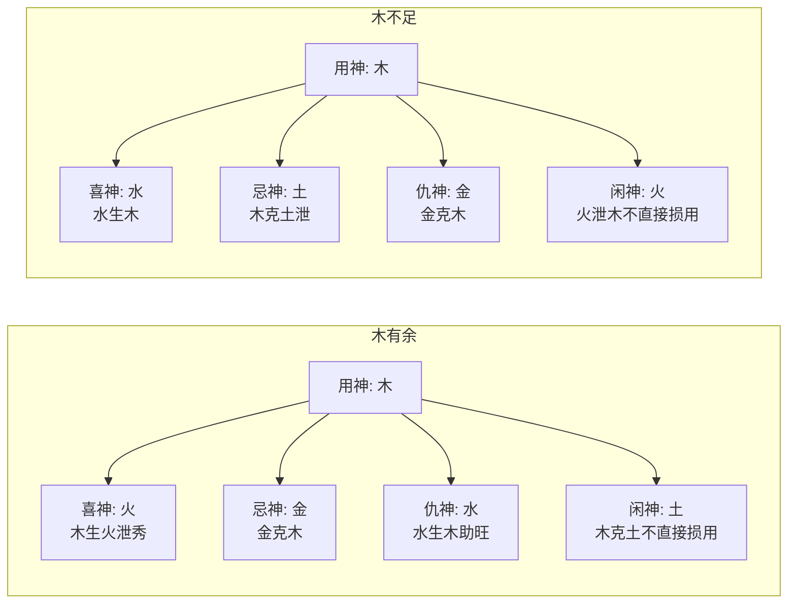

# 闲神

## 纲举之句

> 【原文】一二闲神用去么，不用何妨莫动它；半局闲神任闲着，要紧之场作自豪。

本篇题眼在「闲神」二字。首句「一二闲神用去么」是设问——一两个闲神要不要去用？答曰「不用何妨莫动它」：闲神不伤体用、不碍喜神时，任其闲着即可。第二句「半局闲神任闲着，要紧之场作自豪」进一步指出：即使半局皆闲神，平时也不必管；只有到了「要紧之场」（原局喜用被冲克、合绊、阻隔而需救援的关键时点），闲神才真正有用——以「自豪」点出闲神在关键时刻担当大任的一面。

## 原注所论之理

> 【原注】喜神不必多也，一喜而十备矣；忌神不必多也。一忌而十害矣。自喜忌之外，不足以为喜，不足以为忌，皆闲神也。

原注先把「喜神」「忌神」「闲神」三者并列：喜神不必多，一个喜神若能得力可抵十备；忌神不必多，一个忌神若能肆虐可致十害。在喜忌之外，那些「不足以为喜，不足以为忌」的字——既不显著帮扶喜用、也不直接破坏体用的字——都是闲神。

> 【原注】如以天干为用；成气成合，而地支之神，虚脱无气，冲合自适，升降无情；如以地支为用，成助成合，而天干之神，游散浮泛，不碍日主，主阳辅阳，而阳气停泊，不冲不动，不合不助；日月有情，年时不顾，日主无害，日主无气情；日时得所，年月不顾，日主无害，日主无冲无合，虽有闲神，只不去动它，但要紧之地，自结营寨。至于运道，只行自家边界，亦足为奇。

原注对「用天干还是用地支为用」做了分论：

- **天干为用时**：成气成合、而地支之神虚脱无气、冲合自适、升降无情——地支力量空虚不足时，不必强求地支配合；
- **地支为用时**：成助成合、而天干之神游散浮泛、不碍日主——天干虚浮时也不必强求天干配合；
- **主阳辅阳**：阳气停泊，不冲不动、不合不助——阳气自守时，闲神不必管；
- **日月有情，年时不顾**：日主与月干有情而年时不管闲事；日主无害无气情；日时得所（用神落在日时近身位置），年月不顾——这些情形下「虽有闲神，只不去动它」；
- **原局与运道**：原局闲神不去动他，运道「只行自家边界」（与原局喜用同向的运）也已足为奇。

这一段的字句在原注中多有重复与错位（「日主无害，日主无气情」「日月有情，年时不顾」两句式结构近似），依原文存录，读者宜对照查看。任氏在下文对原注这一段作了直接的纠偏。

## 任氏对原注的纠偏与展开

> 【任氏曰】有用神必有喜神，喜神者，辅格助用之神也，然有喜神，亦必有忌神忌神者，破格损用之神也。自用神、喜神、忌神之外，皆闲神也。惟闲神居多，故有一二半局之称，闲神不伤体用，不碍喜神，可不必动它也。任其闲着，至岁支遇破格损用之时，而喜神不能辅格护用之际，谓要紧之场，得闲神制化岁运之凶神忌物，匡扶格局喜用；或得闲神合岁支之神，化为喜用而辅格助用，为我一家人也。此章本文，所重者在末句"要紧之场，作自家"也，原注未免有误。至云虽有闲神，只不去动它，要紧之场，自结营寨，至于运道，只行自家边界，诚如是论，不但不作自家，反作贼鬼提防矣。此非一定之理也。

任氏先把四神的位置定准：有用神必有喜神（辅格助用），有喜神必有忌神（破格损用），在用神、喜神、忌神之外皆是闲神。命局中闲神常占多数，故有「一二闲神」「半局闲神」之说。闲神「不伤体用，不碍喜神」时，不必去动它，任其闲着。

随后任氏点出闲神真正的作用时点：「至岁支遇破格损用之时，而喜神不能辅格护用之际，谓要紧之场」——大运流年遇到冲克体用、阻隔喜神的关键时刻，原局的喜神已经无能为力了，此时若有闲神能制化岁运带来的凶神忌物、匡扶喜用，或得闲神合岁支之神化为喜用，那就是「要紧之场，作自家」——闲神在这一刻成了命主的「自己人」（自家），解燃眉之急。

任氏特别指出原注的失当之处：「至云虽有闲神，只不去动它，要紧之场，自结营寨，至于运道，只行自家边界，诚如是论，不但不作自家，反作贼鬼提防矣。」如果按原注所说「闲神不去动它」「运道只行自家边界」，那闲神就不仅不能「作自家」，反而会因被冷落而「作贼鬼提防」——即闲神一旦被忌神拉拢、化忌之后再来攻击喜用，便成了真正的祸害。所以「此非一定之理也」——闲神不能一概不管，要看其在原局和运途中的具体处境。

> 【任氏曰】如用木，木有余，以火为喜神，以金为忌神，以水为仇神，以土为闲神；木不足，以水为喜神，以土为忌神，以金为仇神，以火为闲神，是以用神必得喜谉之佐，闲神之助，则用神有势，不怀忌神矣，木论如此，余者可知。

任氏进一步把「用—喜—忌—仇—闲」五神的相对关系列了一个表（以木为例）：

任氏在用神（木）的力量有余时（旺），喜神是火（木生火，泄秀为喜），忌神是金（金克木），仇神是水（水生木，使木更旺反而失衡），闲神是土（木克土，土不直接克用神故为闲）。在用神不足时（弱），喜神是水（水生木，扶抑得宜），忌神是土（木克土，泄木之气），仇神是金（金克木），闲神是火（木生火，泄木之力但对喜用水无害）。任氏点明「用神必得喜神之佐，闲神之助，则用神有势，不怀忌神矣」——用神有喜神辅佐、闲神帮助，便足以抗衡忌神。

任氏强调「木论如此，余者可知」——五行的喜忌仇闲关系可类推到火、土、金、水。

## 「出门要向天涯游」章

> 【原文】出门要向天涯游，何事裙钗瓷意留。

第二组韵文以「裙钗恣意留」喻贪合不化：本来要出门远游的，却因妻妾（裙钗）牵缠而驻足。原文以「瓷」字，原注、任氏引文皆作「恣」字，此处【异文标注】以「恣」为通用。

> 【原注】本欲奋发有为者也，而日主有合，不顾用神，用神有合，不顾日主，不欲贵而遇贵，不欲禄而遇禄，不欲合而遇合，不欲生而遇生，皆有情而反无情，如禄钗这留不去也。

原注解释：日主本欲奋发有为，但若日主有合（日主与他神合绊）则不顾用神之辅佐；用神有合（用神与他神合绊）则不顾日主之需求；不欲贵而遇贵、不欲禄而遇禄、不欲合而遇合、不欲生而遇生——这些情况「皆有情而反无情」，如裙钗恣意留人不让走。

> 【任氏曰】此乃贪合不化之意也，既合宜化之，化之喜者，名利自如；化之忌者，灾咎必至。合而不化，谓绊住留连，贪彼忌此，而无大志有为也。日主有合，不顾用神之辅我。而忌其大志也；用神有合，不顾日主之有为，不佐其成功也，又有合神真，本可化者，反助其从合之神而不化也；又有日主休囚，本可从者，反逢合神之助而不从也。此皆有情而反无情，如禄钗之恣意留也。

任氏以「贪合不化」四字定性：合而能化，化出的是喜神则名利自如，化出的是忌神则灾咎必至；合而不化则是「绊住留连，贪彼忌此」，命主为情绊住而无大志。

任氏又分四种情形：

- **日主有合**：日主与他神合绊，不顾用神之辅佐，自身贪恋私情而失大志；
- **用神有合**：用神与他神合绊，不顾日主之需求，不助日主成功；
- **合神真而本可化者**：本可化合，反助其从合之神而不化（如甲己合本可化土，但甲木又助从合的乙木合庚金，反不化）；
- **日主休囚本可从者**：日主本弱可从，反因合神之助而变为不从（如从弱格中逢合神生扶日主，破了从格）。

四种都是「有情而反无情」的具体表现。

### 【命造一（任氏注）】

> 乙未 庚辰 戊辰 丙辰
>
> 己卯 戊寅 丁丑 丙子 乙亥 甲戌
>
> 戊土生于季春，乙木官星透露，盘根在未，余气在辰，本可为用。嫌其合庚，谓贪合忌克，不顾日主之喜我，合而不化。庚金亦可作用，又有丙火当头，至二十一岁，因小试不利，即弃诗书，不事生产，以酒为事；且曰：高车大纛不为荣，连陌度阡，吾不为富，惟此怡悦性情，适吾口体，以终吾身，足矣！

此造戊土生辰月（季春），月干乙木正官透出，地支未、辰皆藏乙木（盘根），本可为用。但月干乙木被年干庚金合绊（乙庚合金），乙木贪合于庚金，不再克日主（贪合忘克），「不顾日主之喜我」——正官既已贪合，便失去了克身之用神功能；「合而不化」则乙庚虽合却仍守其本形，乙木既不能克日主也不化去庚金。

任氏点评：庚金虽亦可作用（食伤），但时干丙火透出（丙火克庚金），庚金被压制；时支辰土又比肩帮身。整个命局日主无制、贪合忘克，所以命主「至二十一岁，因小试不利，即弃诗书」——既无大志建功，便以酒自娱。命主自言「高车大纛不为荣，连陌度阡，吾不为富，惟此怡悦性情」——正是「贪合不化」「如裙钗恣意留」的写照。

### 【命造二（任氏注）】

> 丁丑 癸卯 丙戌 辛卯
>
> 壬寅 辛丑 庚子 己亥 戊戌 丁酉
>
> 丙火生于仲春，印正官清，日元生旺，足以用官。所嫌丙辛一合，不顾用神之辅我，辛金柔软，丙火逢之而怯，柔能制刚，恋恋不舍，忌有为之志；丙嫌卯戌合而化劫，所以幼年过目成诵，后因恋洒色，废学亡资，竟为酒色丧身，一事无成。

此造丙火生卯月（仲春），月干癸水（正官）透出，卯木（印绶）当令生身，丙火日主生旺足以用官（癸水）。但时干辛金（正官之根、偏官之性）与日主丙火相合（丙辛合），「不顾用神之辅我」——辛金既已与丙火合，便不再正当地克身（贪合忘克）；辛金阴柔、丙火本刚，「柔能制刚，恋恋不舍」——命主在辛金（妾、桃花一类）面前失却刚强之志。

更兼日支戌与月支卯「卯戌合」——卯木为印本可生身，戌为火之墓库，卯戌合化火（合化之火反为劫财，「化劫」），印之生身之力被合化转向——命主「幼年过目成诵」本有才学，「后因恋洒色，废学亡资，竟为酒色丧身，一事无成」。

## 「不管白雪与明月」章

> 【原文】不管白雪与明月，任君策马朝天阙。

第三组韵文以「策马朝天阙」喻乘势前进、无私牵制的境界——「白雪与明月」皆无碍于前行，恰与上一组「裙钗恣意留」形成强烈对照。

> 【原注】日主乘用神而驰骤，无私意牵制也；用神随日主而驰骤，无私情羁绊也。足以成其大志，是无情而有情也。

原注解释：日主乘用神而驰骤（乘势前进），无私意牵制；用神随日主而驰骤，无私情羁绊。两者相辅相成，足以成其大志——这是「无情而有情」的另一种辩证。

> 【任氏曰】此乃逢冲得用意也，冲则动也，动则驰也。局中除用神喜神之外，而日主与他神有所贪恋者，得用神喜神冲而去之，则日主无私意牵制，乘喜神之势而驰骤矣。局中用神喜神与他神有所贪恋者，日主能冲克他审而去之，则喜神无私之羁绊，随日主而驰骤矣。此无情而反有情，以丈夫之志，不恋私情而大志有为也。

任氏以「逢冲得用」四字定性：冲是动的机制，动是驰的根据。任氏分两种情形：

- **日主与他神贪恋**：用神喜神冲去贪恋对象，日主无私意牵制，乘喜神之势驰骤；
- **用神喜神与他神贪恋**：日主冲克贪恋对象，喜神无私情羁绊，随日主驰骤。

两种情形都是「无情而反有情」——看似无情（冲散贪恋），实则有利于大志有为。任氏以「丈夫之志，不恋私情」作结——这一组与上一组「裙钗恣意留」形成对照：贪合不化者「如裙钗恣意留」，逢冲得用者「如策马朝天阙」。

### 【命造一（任氏注）】

> 丁卯 辛亥 丙寅 丙申
>
> 庚戌 己酉 戊申 丁未 丙午 乙巳
>
> 此造杀虽秉令，而印绶亦旺，兼之比劫并透，身旺足以用杀。用杀不宜合杀，合则不显，加以辛金贴身，而日主之情，必贪恋羁绊。喜其丁火劫去辛金，使日主无贪恋之私，申金冲动寅木，使日主无牵制之意。更妙申金滋杀，日主依喜用而驰骤矣。至戊申运，登科发甲，大志有为也。

此造丙火生亥月（十月），亥中壬水七杀秉令，但寅木（印绶）当令、卯木（寅卯皆印）又生身，年干丁火、月干辛金、时干丙火——日主身旺足以用杀（壬水）。但时干辛金（地支亥中壬水之引化）与日主丙火合（丙辛合），辛金贴身——「日主之情，必贪恋羁绊」。

任氏点出两处救应：一是年干丁火（劫财）克制辛金，劫去辛金使日主无贪恋之私；二是时支申金冲月支寅木（寅申冲），冲动印绶（寅木）使日主无牵制之意。两处一冲一克，把日主从贪恋和牵制中解放出来，「更妙申金滋杀」——申金是壬水七杀的源头（申中藏壬水），申金既冲寅又生杀，反助杀之用。日主依喜用（杀+劫）而驰骤，故「至戊申运，登科发甲，大志有为也」。

### 【命造二（任氏注）】

> 辛巳 丙申 壬寅 庚戌
>
> 乙未 甲午 癸巳 壬辰 辛卯 庚寅
>
> 壬水生于申月，虽秋水通源，而财杀并旺，以申金为用。第天干丙辛、地支申巳皆合，合之能化，亦可帮身，合之不化，反为羁绊，不顾日主，喜我为用也，且金当令，火通根，只有贪恋之私，而无化合之意。妙在日主自克丙火，使丙火无暇合辛，寅去冲动申金，使其克木、则丙火之根反拔，而日主之壬，固无牵制之私，用神随日主而驰骤矣，至癸巳运，连登甲第，仕至观察，而成其大志也。

此造壬水生申月（金当令），秋水通源（申中藏壬水），年干辛金（财星）、时干庚金（偏印）透出——财杀并旺，以申金为用。但天干丙辛合（月干丙与年干辛），地支申巳合（月支申与年支巳）——两组合绊都「不合化」，「反为羁绊」。

任氏点出关键救应：日主壬水自己克丙火（壬克丙），使丙火无暇合辛（壬水既克丙火则丙火无法再合辛金）；时支寅冲月支申（寅申冲），冲动申金使其克木（寅木中藏甲丙火），则丙火之根被拔（寅中丙火被申金中庚金冲克），日主之壬「固无牵制之私」。

「用神随日主而驰骤」——申金（用神）虽被寅冲但仍是壬水之源头（秋水通源），冲开之后反更显其用。「至癸巳运，连登甲第，仕至观察，而成其大志也」——癸水（食神）帮身、巳火虽与申合但运中力量各异，命主终成大志。

## 篇中定位

闲神一篇是论命局中「喜忌之外」那一大片字如何处置的专题。原注与任氏在「闲神是否要管」这一问题上存在直接的义理推进：原注主张「闲神不去动它」，任氏则指出闲神在「要紧之场」可作自家用、但在「运道只行自家边界」时反作贼鬼提防——闲神的性质依其所处时势而变。第二、三组韵文「裙钗恣意留」与「策马朝天阙」互为对照，分别给出了贪合不化（有情反无情）与逢冲得用（无情反有情）两种典型格局的处理思路。整篇把「用神—喜神—忌神—仇神—闲神」五神的相对关系摆到了一个完整框架之内，是《滴天髓》论喜忌系统的一篇收束性专论。
